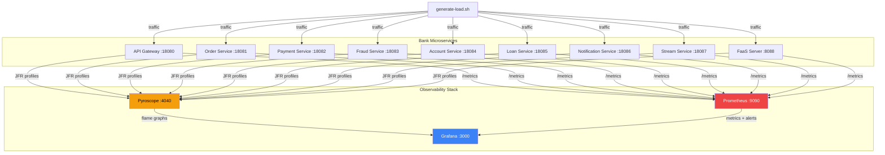
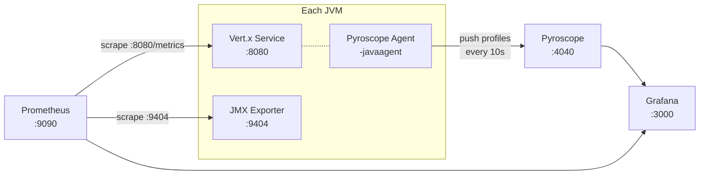

# Pyroscope + Java Vert.x — Zero-Code Continuous Profiling

A bank enterprise microservices demo with **9 Vert.x services** profiled by the **Pyroscope Java agent** — no application code changes required. Integrates with Prometheus, Grafana (6 dashboards), and alert rules.

## TL;DR

```bash
git clone <this-repo> && cd pyroscope
bash scripts/run.sh                # deploy + load + validate + data check (quiet mode)
# Wait for the "Ready!" banner, then:
#   Grafana:   http://localhost:3000 (admin/admin) → dashboards are pre-loaded
#   Pyroscope: http://localhost:4040 → select any bank-* service → flame graphs
# Ctrl-C to stop load, then:
bash scripts/run.sh teardown       # clean up
```

## Architecture



## Bank Services

All 9 services are built from the **same Docker image**. The `VERTICLE` environment variable selects which class runs. Pyroscope profiles each one independently.

| Service | Port | Verticle | Pyroscope Name | Profiling Signature |
|---------|------|----------|----------------|---------------------|
| **API Gateway** | 18080 | MainVerticle | `bank-api-gateway` | Recursive fibonacci, batch processing, serialization |
| **Order Service** | 18081 | OrderVerticle | `bank-order-service` | String concatenation, synchronized blocks (lock contention) |
| **Payment Service** | 18082 | PaymentVerticle | `bank-payment-service` | BigDecimal math, SHA-256 hashing, synchronized ledger |
| **Fraud Detection** | 18083 | FraudDetectionVerticle | `bank-fraud-service` | Regex rule engine, statistical analysis, sliding window |
| **Account Service** | 18084 | AccountVerticle | `bank-account-service` | Stream API filtering, BigDecimal interest calc, ConcurrentHashMap |
| **Loan Service** | 18085 | LoanVerticle | `bank-loan-service` | Amortization schedules, Monte Carlo simulation, portfolio aggregation |
| **Notification** | 18086 | NotificationVerticle | `bank-notification-service` | Template rendering (String.format), queue drain loops, exponential backoff |
| **Stream Service** | 18087 | StreamVerticle | `bank-stream-service` | Reactive streams, backpressure handling, event processing |
| **FaaS Server** | 8088 | FaasVerticle | `bank-faas-server` | Function deploy/undeploy lifecycle, cold starts, warm pools |

Each service has deliberately different CPU, memory, and lock characteristics so flame graphs show distinct patterns when compared side by side.

### Observability Data Flow

Three telemetry pipelines run simultaneously with zero code changes:



| Pipeline | Agent | Transport | What It Captures |
|----------|-------|-----------|-----------------|
| **Continuous Profiling** | Pyroscope Java agent | Push to Pyroscope :4040 | CPU, allocation, mutex, wall clock flame graphs |
| **JVM Metrics** | JMX Exporter on :9404 | Prometheus scrape | Heap, GC, threads, CPU, classloading, file descriptors |
| **HTTP Metrics** | Vert.x Micrometer on :8080/metrics | Prometheus scrape | Request rate, latency percentiles, status codes |

### Service Endpoints

<details>
<summary>API Gateway (:18080) — 17 endpoints</summary>

| Endpoint | Category |
|----------|----------|
| `/cpu` | Recursive Fibonacci |
| `/alloc` | Memory allocation |
| `/slow` | Blocking I/O |
| `/db`, `/mixed` | Combined workloads |
| `/redis/set`, `/redis/get`, `/redis/scan` | Serialization + pattern match |
| `/db/select`, `/db/insert`, `/db/join` | Database simulation |
| `/csv/process` | Data processing |
| `/json/process`, `/xml/process` | Serialization |
| `/downstream/call`, `/downstream/fanout` | HTTP client simulation |
| `/batch/process` | 50K record batch |
</details>

<details>
<summary>Order Service (:18081) — 6 endpoints</summary>

| Endpoint | Category |
|----------|----------|
| `/order/create` | Build order maps (GC pressure) |
| `/order/list` | Iterate + serialize |
| `/order/validate` | Regex validation |
| `/order/process` | Synchronized batch (lock contention) |
| `/order/aggregate` | HashMap group-by |
| `/order/fulfill` | Fan-out orchestration |
</details>

<details>
<summary>Payment Service (:18082) — 6 endpoints</summary>

| Endpoint | Category |
|----------|----------|
| `/payment/transfer` | BigDecimal + SHA-256 signing |
| `/payment/payroll` | Synchronized batch payroll (200-500 employees) |
| `/payment/fx` | Multi-hop currency conversion |
| `/payment/orchestrate` | Fraud→debit→credit→notify fan-out |
| `/payment/history` | Ledger scan + sort |
| `/payment/reconcile` | Re-verify all signatures |
</details>

<details>
<summary>Fraud Service (:18083) — 6 endpoints</summary>

| Endpoint | Category |
|----------|----------|
| `/fraud/score` | Rule engine (8 regex patterns) |
| `/fraud/ingest` | Bulk event ingestion |
| `/fraud/scan` | Scan 10K events against all rules |
| `/fraud/anomaly` | Mean/stddev/percentiles/anomaly detection |
| `/fraud/velocity` | Time-window counting |
| `/fraud/report` | Risk bucket aggregation |
</details>

<details>
<summary>Account Service (:18084) — 8 endpoints</summary>

| Endpoint | Category |
|----------|----------|
| `/account/open` | Create new account |
| `/account/balance` | Lookup balance |
| `/account/deposit`, `/account/withdraw` | Synchronized balance updates |
| `/account/statement` | String.format-heavy statement generation |
| `/account/interest` | 30-day compound interest (BigDecimal loop) |
| `/account/search` | Stream API filter + sort |
| `/account/branch-summary` | Group-by aggregation across 20 branches |
</details>

<details>
<summary>Loan Service (:18085) — 6 endpoints</summary>

| Endpoint | Category |
|----------|----------|
| `/loan/apply` | Weighted credit scoring + decisioning |
| `/loan/amortize` | Full amortization schedule (BigDecimal power) |
| `/loan/risk-sim` | 10K Monte Carlo simulations |
| `/loan/portfolio` | Aggregate 3K loans by type |
| `/loan/delinquency` | Filter + sort delinquent loans |
| `/loan/originate` | Credit→appraisal→underwriting→funding orchestration |
</details>

<details>
<summary>Notification Service (:18086) — 6 endpoints</summary>

| Endpoint | Category |
|----------|----------|
| `/notify/send` | Render template + send |
| `/notify/bulk` | Queue 500-2000 messages |
| `/notify/drain` | Process outbox with 8% failure rate |
| `/notify/render` | Render 200-500 templates (allocation heavy) |
| `/notify/status` | Delivery status aggregation |
| `/notify/retry` | Exponential backoff retry of failed messages |
</details>

<details>
<summary>Stream Service (:18087) — 5 endpoints</summary>

| Endpoint | Category |
|----------|----------|
| `/stream/publish` | Publish events to stream |
| `/stream/subscribe` | Subscribe to event stream |
| `/stream/backpressure` | Backpressure handling demo |
| `/stream/transform` | Stream transformation pipeline |
| `/stream/aggregate` | Windowed aggregation |
</details>

<details>
<summary>FaaS Server (:8088) — 8 endpoints</summary>

| Endpoint | Category |
|----------|----------|
| `/fn/invoke/{name}` | Deploy-execute-undeploy single function |
| `/fn/burst/{name}?count=N` | Concurrent function invocations |
| `/fn/list` | List available functions |
| `/fn/stats` | Invocation statistics |
| `/fn/chain` | Chain multiple functions sequentially |
| `/fn/warmpool/{name}?size=N` | Pre-deploy warm pool |
| `DELETE /fn/warmpool/{name}` | Undeploy warm pool |
| `/health` | Health check |

Built-in functions: `fibonacci`, `transform`, `hash`, `sort`, `sleep`, `matrix`, `regex`, `compress`, `primes`, `contention`, `fanout`
</details>

## Quick Start

### Option 0: Single command (recommended)

```bash
bash scripts/run.sh                     # full pipeline: deploy → load → validate → data check
                                        # quiet mode with spinner progress + "Ready" banner
bash scripts/run.sh --verbose           # full pipeline with all output inline (old behavior)
bash scripts/run.sh --log-dir /tmp/logs # quiet mode + save full logs to disk
bash scripts/run.sh deploy              # deploy only (always verbose)
bash scripts/run.sh load 60             # 60s of load
bash scripts/run.sh validate            # validate only
bash scripts/run.sh teardown            # clean up
bash scripts/run.sh benchmark           # profiling overhead test
bash scripts/run.sh top                 # top functions by CPU/memory/mutex
bash scripts/run.sh top cpu             # CPU hotspots only
bash scripts/run.sh health              # flag problematic JVMs
bash scripts/run.sh health --json       # JSON output for automation
bash scripts/run.sh diagnose            # full diagnostic report (no browser needed)
bash scripts/run.sh diagnose --json     # machine-readable JSON for scripting
bash scripts/run.sh --load-duration 60  # full pipeline with custom load duration
bash scripts/run.sh --fixed             # deploy with OPTIMIZED=true (optimized-only mode)
bash scripts/run.sh compare             # before/after comparison on running stack
bash scripts/run.sh bottleneck          # automated root-cause analysis per service
bash scripts/run.sh bottleneck --json   # machine-readable for alerting pipelines
```

The default full pipeline runs in **quiet mode**: each stage shows a single-line spinner with elapsed time, and on completion prints a "Ready" banner with Grafana/Pyroscope URLs. Use `--verbose` for full inline output or `--log-dir DIR` to persist stage logs to disk.

See `bash scripts/run.sh --help` for details on each stage.

### Option 1: Bash scripts (individual)

```bash
bash scripts/deploy.sh             # build + start 10 containers
bash scripts/generate-load.sh 120  # generate traffic (default 300s)
bash scripts/validate.sh           # automated health check
bash scripts/teardown.sh           # stop + clean
```

### Postman

Import `postman/pyroscope-demo.postman_collection.json` into Postman
for interactive API exploration. See [postman/README.md](postman/README.md).

**URLs after deploy:**

| Service | URL | Credentials |
|---------|-----|-------------|
| Grafana | http://localhost:3000 | admin / admin |
| Pyroscope | http://localhost:4040 | |
| Prometheus | http://localhost:9090 | |
| API Gateway | http://localhost:18080 | |
| Order Service | http://localhost:18081 | |
| Payment Service | http://localhost:18082 | |
| Fraud Service | http://localhost:18083 | |
| Account Service | http://localhost:18084 | |
| Loan Service | http://localhost:18085 | |
| Notification Service | http://localhost:18086 | |
| Stream Service | http://localhost:18087 | |
| FaaS Server | http://localhost:8088 | |

## Grafana Dashboards

Six pre-provisioned dashboards:

| Dashboard | UID | Description |
|-----------|-----|-------------|
| **Pyroscope Java Overview** | `pyroscope-java-overview` | CPU/memory/lock/wall flame graphs with application selector for all 9 services |
| **Service Performance** | `verticle-performance` | Per-service CPU, latency, request rate with flame graph correlation |
| **JVM Metrics Deep Dive** | `jvm-metrics-deep-dive` | CPU gauge, heap/non-heap, GC pauses, threads, memory pool utilization |
| **HTTP Performance** | `http-performance` | Request rate, p50/p95/p99 latency, error rate, slowest endpoints |
| **Before vs After Fix** | `before-after-comparison` | Compare flame graphs before/after `OPTIMIZED=true` performance fixes |
| **FaaS Server** | `faas-server` | FaaS-specific metrics: function invocations, deploy/undeploy lifecycle, warm pools |

### Before vs After Fix

The default `bash scripts/run.sh` pipeline generates load in two phases — before and after applying optimizations. Use the Before vs After Fix dashboard to compare flame graphs.

| Verticle | Fix | Flame Graph Impact |
|----------|-----|--------------------|
| MainVerticle | `fibonacci()` → iterative loop | `fibonacci` frame: dominant → near-zero |
| OrderVerticle | `processOrders()` → lock-free `computeIfPresent` | Lock contention frames disappear |
| PaymentVerticle | `sha256()` → ThreadLocal + `Character.forDigit` | `getInstance` + `String.format` frames vanish |
| FraudDetectionVerticle | Percentiles → primitive `double[]` + `Arrays.sort` | `Double.compareTo` boxing gone |
| NotificationVerticle | `renderTemplate()` → StringBuilder + `indexOf` | `Formatter.format` frames disappear |

## Prometheus Alert Rules

| Alert | Trigger | Severity |
|-------|---------|----------|
| `HighCpuUsage` | CPU > 80% for 1m | warning |
| `HighHeapUsage` | Heap > 85% for 2m | warning |
| `HighGcPauseRate` | GC > 50ms/s for 1m | warning |
| `HighErrorRate` | 5xx > 5% for 1m | critical |
| `HighLatency` | p99 > 2s for 2m | warning |
| `ServiceDown` | Scrape fails for 30s | critical |

## Documentation

See [docs/INDEX.md](docs/INDEX.md) for a full documentation map with learning paths.

### Getting Started

| Document | Audience | Description |
|----------|----------|-------------|
| [docs/continuous-profiling-runbook.md](docs/continuous-profiling-runbook.md) | Everyone | What continuous profiling is, deployment, agent setup, MTTR reduction |
| [docs/demo-runbook.md](docs/demo-runbook.md) | Presenters | Step-by-step demo agenda with commands and talking points (20-25 min) |
| [docs/reading-flame-graphs.md](docs/reading-flame-graphs.md) | Everyone | How to read flame graphs, terminology, and common patterns |

### Using Pyroscope and Grafana

| Document | Audience | Description |
|----------|----------|-------------|
| [docs/profiling-scenarios.md](docs/profiling-scenarios.md) | Engineers | 6 hands-on scenarios + quick reference table of all bottlenecks by service |
| [docs/code-to-profiling-guide.md](docs/code-to-profiling-guide.md) | Engineers | Source code → flame graph mapping for every service and endpoint |
| [docs/dashboard-guide.md](docs/dashboard-guide.md) | Engineers | Panel-by-panel reference for all 6 Grafana dashboards |
| [docs/sample-queries.md](docs/sample-queries.md) | Engineers | Copy-paste queries for Pyroscope, Prometheus, and Grafana |

### FaaS BOR/SOR Functions

| Document | Audience | Description |
|----------|----------|-------------|
| [docs/function-reference.md](docs/function-reference.md) | Engineers | BOR function API reference (triage, diff report, fleet search) |
| [docs/function-architecture.md](docs/function-architecture.md) | Engineers | Project structure, design patterns, and Gradle build setup |
| [docs/production-questionnaire-phase1.md](docs/production-questionnaire-phase1.md) | Architects | Production onboarding questionnaire — Phase 1 |
| [docs/production-questionnaire-phase2.md](docs/production-questionnaire-phase2.md) | Architects | Production onboarding questionnaire — Phase 2 |

### Deployment and Operations

| Document | Audience | Description |
|----------|----------|-------------|
| [docs/continuous-profiling-runbook.md](docs/continuous-profiling-runbook.md) | SREs | Deploying Pyroscope, agent configuration, Grafana setup |
| [docs/grafana-setup.md](docs/grafana-setup.md) | SREs | Connecting Grafana to Pyroscope via provisioning files |
| [docs/deployment-guide.md](docs/deployment-guide.md) | SREs | Deployment decision trees, step-by-step guides, firewall rules |
| [docs/runbook.md](docs/runbook.md) | On-call | Incident response playbooks, operational procedures |

### Reference and Strategy

| Document | Audience | Description |
|----------|----------|-------------|
| [docs/faas-server.md](docs/faas-server.md) | Engineers | FaaS runtime with deploy/undeploy lifecycle profiling |
| [docs/endpoint-reference.md](docs/endpoint-reference.md) | Engineers | Complete endpoint list with curl examples |

## Project Structure

> **Code classification:** Items marked **DEMO** are for local testing and learning.
> Items marked **PRODUCTION** are enterprise deployment automation.
> Items marked **APPLICATION** are real FaaS function code.
> Items marked **BOTH** serve dual purpose. See [docs/INDEX.md](docs/INDEX.md) for details.

```
pyroscope/
├── app/                             # [DEMO] Bank microservices with deliberate bottlenecks
│   ├── build.gradle                 # Gradle build (shadow plugin)
│   ├── Dockerfile                   # Multi-stage: Gradle → JRE
│   └── src/main/java/com/example/
│       ├── MainVerticle.java        # API Gateway + verticle router
│       ├── OrderVerticle.java       # Order processing, synchronized blocks
│       ├── PaymentVerticle.java     # Transfers, payroll, FX (SHA-256, BigDecimal)
│       ├── FraudDetectionVerticle.java  # Rule engine, anomaly detection
│       ├── AccountVerticle.java     # Core banking, interest calculation
│       ├── LoanVerticle.java        # Amortization, Monte Carlo simulation
│       ├── NotificationVerticle.java    # Templates, queue drain, retries
│       ├── StreamVerticle.java      # Reactive streams, backpressure
│       ├── FaasVerticle.java        # FaaS runtime, function lifecycle
│       └── handlers/                # Additional workload handlers
│
├── services/                        # [APPLICATION] FaaS BOR/SOR functions (Vert.x)
│   ├── build.gradle                 # Shared dependency versions + plugin config
│   ├── settings.gradle              # Multi-project build (4 subprojects)
│   ├── gradlew                      # Single shared Gradle wrapper
│   ├── Makefile                     # Build + test targets
│   ├── faas-jvm11/            # JVM 11 target (Phase 1)
│   │   ├── bor/                     # BOR: triage, diff report, fleet search
│   │   │   ├── src/                 # Java 11 source (POJOs, traditional switch)
│   │   │   ├── build.gradle         # Slim — inherits from root
│   │   │   └── Dockerfile           # eclipse-temurin:11
│   │   └── sor/                     # SOR: profile data, baseline, history, registry, alert rule
│   │       ├── src/                 # Java 11 source + Testcontainers tests
│   │       ├── build.gradle         # Adds pg-client + testcontainers deps
│   │       └── Dockerfile           # eclipse-temurin:11
│   └── faas-jvm21/            # JVM 21 target (Phase 2)
│       ├── bor/                     # Same functions, Java 17+ features (records, switch expressions)
│       └── sor/                     # Same functions, Java 17+ features
│
├── config/                          # [BOTH] Config files — demo values, production-grade comments
│   ├── grafana/
│   │   ├── dashboards/              # 6 Grafana dashboards (JSON)
│   │   └── provisioning/            # Datasources, dashboard provider, plugins
│   ├── prometheus/
│   │   ├── prometheus.yaml          # Scrape config for 9 services
│   │   └── alerts.yaml              # 6 alert rules
│   └── pyroscope/
│       ├── pyroscope.properties     # Java agent config (shared across services)
│       └── pyroscope.yaml           # Pyroscope server config
│
├── deploy/                          # [PRODUCTION] Enterprise deployment automation
│   ├── monolith/                    # VM deployment: stage1-build.sh → stage2-deploy.sh
│   │   ├── deploy.sh               # Multi-target deployer (VM, K8s, OCP, air-gapped)
│   │   └── ansible/                # Ansible role + playbooks for enterprise VMs
│   ├── grafana/                     # Standalone Grafana image build
│   ├── helm/pyroscope/              # Unified Helm chart (monolith + microservices, K8s + OCP)
│   └── microservices/               # Distributed Pyroscope deployment
│       └── vm/                      # Docker Compose + NFS (for VMs/EC2)
│
├── docs/                            # see docs/INDEX.md
│
├── postman/                         # Postman collection + environment
│
├── scripts/                         # [DEMO] Local demo lifecycle and analysis tools
│   ├── run.sh                       # Main entry point — deploy, load, validate, teardown
│   ├── deploy.sh                    # Build + start containers
│   ├── generate-load.sh             # Traffic generation to all 9 services
│   ├── validate.sh                  # Automated health + data verification
│   ├── teardown.sh                  # Stop and clean up
│   ├── diagnose.sh                  # Full diagnostic report (CLI)
│   ├── top-functions.sh             # Top CPU/memory/mutex functions
│   ├── bottleneck.sh                # Automated root-cause analysis
│   ├── jvm-health.sh                # JVM health thresholds
│   ├── benchmark.sh                 # Profiling overhead measurement
│   ├── check-dashboards.sh          # Dashboard validation
│   └── lib/                         # Python analysis modules
│
├── docker-compose.yaml              # [DEMO] 12 containers (3 infra + 9 services)
├── docker-compose.optimized.yaml    # [DEMO] Overlay: enable OPTIMIZED=true
├── docker-compose.no-pyroscope.yaml # [DEMO] Overlay: disable profiling agent
└── README.md
```

## How It Works — No Code Changes

The Pyroscope Java agent is configured via a shared properties file baked into the Docker image (`/opt/pyroscope/pyroscope.properties`). Per-service overrides (application name, labels) are set via environment variables in `docker-compose.yaml`:

```properties
# config/pyroscope/pyroscope.properties — shared across all services
pyroscope.server.address=http://pyroscope:4040
pyroscope.format=jfr
pyroscope.profiler.event=itimer
pyroscope.profiler.alloc=512k
pyroscope.profiler.lock=10ms
pyroscope.log.level=info
```

```yaml
# docker-compose.yaml — per-service overrides only
environment:
  VERTICLE: payment
  PYROSCOPE_APPLICATION_NAME: bank-payment-service
  PYROSCOPE_LABELS: env=production,service=payment-service
  PYROSCOPE_CONFIGURATION_FILE: /opt/pyroscope/pyroscope.properties
  JAVA_TOOL_OPTIONS: >-
    -javaagent:/opt/pyroscope/pyroscope.jar
    -javaagent:/opt/jmx-exporter/jmx_prometheus_javaagent.jar=9404:/opt/jmx-exporter/config.yaml
```

Configuration precedence: System Properties (`-D`) > Environment Variables (`PYROSCOPE_*`) > Properties File.

All 9 services use the same Docker image. The `VERTICLE` env var (`order`, `payment`, `fraud`, `account`, `loan`, `notification`, `stream`, `faas`) selects which class to run. Default is `MainVerticle`.

### Profile Types

| Profile | Event | What It Shows |
|---------|-------|---------------|
| **CPU** | `cpu` | On-CPU time — which methods consume the most processor cycles |
| **Allocation** | `alloc` | Heap allocations — objects created, GC pressure sources (threshold: 512KB) |
| **Lock** | `lock` | Lock contention — synchronized blocks, ReentrantLock waits (threshold: 10ms) |
| **Wall Clock** | `wall` | Real elapsed time — includes I/O waits, sleeps, off-CPU time |

In Pyroscope UI, select any `bank-*` application, then switch between profile types to see different views of the same service.

### Profiling Overhead Benchmark

Compare application performance with and without the Pyroscope agent:

```bash
bash scripts/benchmark.sh           # 200 requests per endpoint (default)
bash scripts/benchmark.sh 500 100   # 500 requests, 100 warmup
```

This runs each service endpoint twice — once with the agent attached, once without — and reports average latency, p50/p95/p99, throughput, and percentage overhead per service. Results are saved to `benchmark-results/`.

To manually run without profiling:

```bash
# Start without Pyroscope agent
docker compose -f docker-compose.yaml -f docker-compose.no-pyroscope.yaml up -d

# Start with Pyroscope agent (default)
docker compose up -d
```

## Enterprise Use Cases

### Cost Optimization
Compare CPU profiles across all 7 services. The Payment Service's BigDecimal math and Loan Service's Monte Carlo simulation are intentionally expensive — in production, these are the services where optimization yields the most savings.

### Incident Response
When the Fraud Service p99 spikes, open the flame graph for `bank-fraud-service` and see whether the regex rule engine or the anomaly detection is the bottleneck. See [docs/runbook.md](docs/runbook.md) for full playbooks.

### CI/CD Regression Detection

Query Pyroscope API to compare profiles between builds:

```bash
curl "http://pyroscope:4040/pyroscope/render?query=process_cpu:cpu:nanoseconds:cpu:nanoseconds%7Bservice_name%3D%22bank-payment-service%22%7D&from=now-1h&until=now&format=json"
```

### CI/CD Integration — TODO

The before/after comparison workflow can be automated in CI pipelines to catch performance regressions per-PR:

- [ ] **Baseline snapshot script** (`scripts/ci-snapshot.sh`) — dump per-service top-N function CPU/alloc totals from Pyroscope API to `baseline/profiles.json`. Commit as the known-good baseline
- [ ] **Regression gate script** (`scripts/ci-compare.sh`) — fetch the same top-N data after a PR build, diff against baseline, fail the pipeline if any function's CPU share increases by a configurable threshold (e.g. 20%)
- [ ] **GitHub Actions / GitLab CI job** — spin up the stack, generate load, run the regression gate, upload flame graph diffs as PR artifacts
- [ ] **Pyroscope diff API** — use `GET /pyroscope/render-diff?leftFrom=...&rightFrom=...` for server-side profile diffs
- [ ] **Slack/webhook notification** — on regression, post a summary (service, function, % increase, Grafana link) to a channel

## Multi-Language Roadmap

| Language | Profiler | Injection Method |
|----------|----------|------------------|
| **Java** (current) | async-profiler via Pyroscope agent | `JAVA_TOOL_OPTIONS=-javaagent:...` |
| **Python** | py-spy | Sidecar: `py-spy record --pid <PID>` |
| **Go** | pprof | `import _ "net/http/pprof"` |
| **Node.js** | perf hooks | `NODE_OPTIONS=--require=pyroscope-node` |

## Troubleshooting

```bash
bash scripts/validate.sh   # automated check
```

See [docs/runbook.md#troubleshooting](docs/runbook.md#troubleshooting) for detailed steps.
