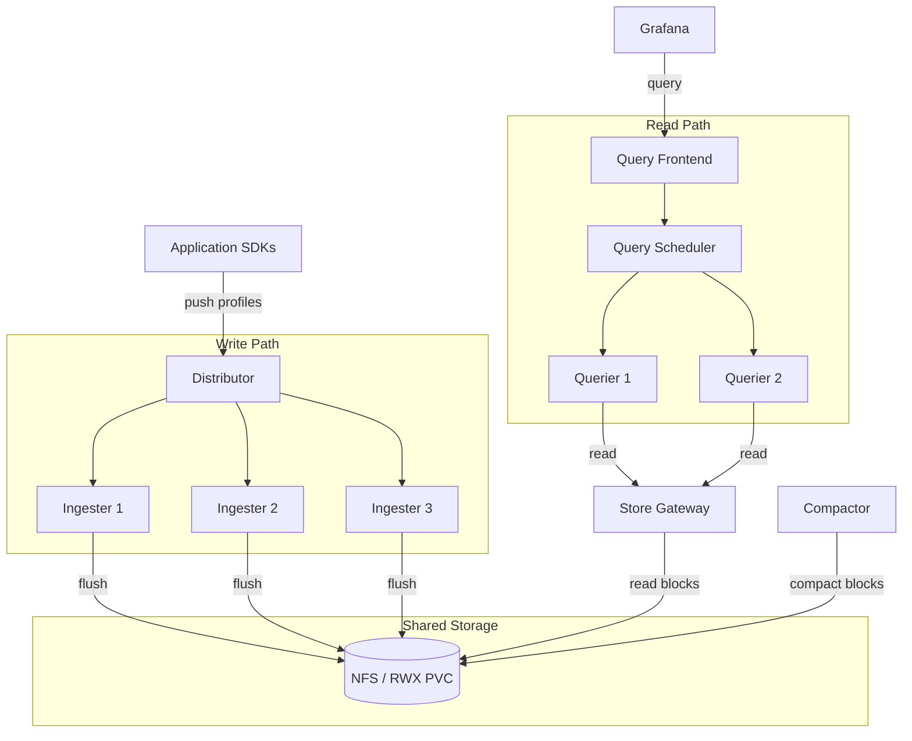

# Pyroscope Microservices Deployment

Runs Pyroscope as separate, independently scalable components for high-availability production workloads. All storage uses NFS-backed filesystems — no MinIO or S3 required.

## Architecture

## Choose your environment

| Environment | Path | How it works |
|-------------|------|-------------|
| **VM / Docker Compose** | [`vm/`](vm/) | Docker Compose on bare-metal or EC2; NFS bind-mounted into containers |
| **OpenShift** | [`openshift/`](openshift/) | Helm chart deploying Kubernetes Deployments with a ReadWriteMany PVC |

Both environments use identical Pyroscope component topology (9 services) and NFS-backed filesystem storage.

For simpler single-node deployments, see [`../monolithic/`](../monolithic/).
