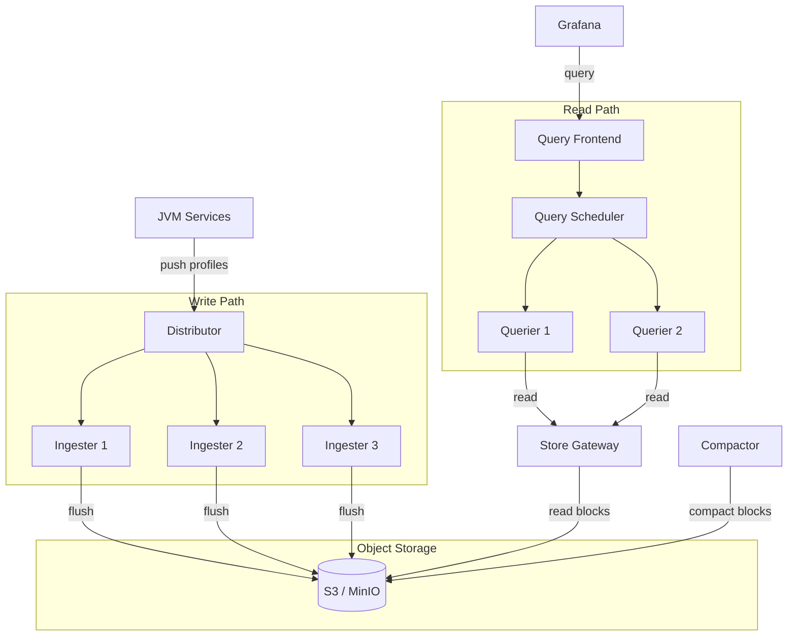

# Pyroscope Microservices Deployment

Runs Pyroscope as separate, independently scalable components for high-availability production workloads. All storage uses S3-compatible object storage (MinIO, AWS S3, GCS, or Azure Blob).

## Architecture


```mermaid
graph TB
    SDK[JVM Services] -->|push profiles| DIST[Distributor]
    G[Grafana] -->|query| QF[Query Frontend]

    subgraph Write Path
        DIST --> ING1[Ingester 1]
        DIST --> ING2[Ingester 2]
        DIST --> ING3[Ingester 3]
    end

    subgraph Read Path
        QF --> QS[Query Scheduler]
        QS --> Q1[Querier 1]
        QS --> Q2[Querier 2]
    end

    SG[Store Gateway]
    C[Compactor]

    subgraph Object Storage
        S3[("S3 / MinIO")]
    end

    ING1 -->|flush| S3
    ING2 -->|flush| S3
    ING3 -->|flush| S3
    Q1 -->|read| SG
    Q2 -->|read| SG
    SG -->|read blocks| S3
    C -->|compact blocks| S3
```

## Choose your environment

| Environment | Path | How it works |
|-------------|------|-------------|
| **VM / Docker Compose** | [`vm/`](vm/) | Docker Compose on bare-metal or EC2; includes local MinIO for dev, configurable for external S3 |
| **Kubernetes / OpenShift** | [`../helm/pyroscope/`](../helm/pyroscope/) | Unified Helm chart supporting both monolith and microservices modes, OCP Routes and K8s Ingress |

All environments use identical Pyroscope component topology (7 services) and S3-compatible object storage.

For monolith mode (single-node) VM deployments, see [`../monolith/`](../monolith/).

For Kubernetes/OpenShift monolith or microservices deployments, use the unified Helm chart:

```bash
# Microservices on OpenShift
helm upgrade --install pyroscope ../helm/pyroscope/ \
    -n pyroscope --create-namespace \
    -f ../helm/pyroscope/examples/microservices-openshift.yaml

# Microservices on Kubernetes
helm upgrade --install pyroscope ../helm/pyroscope/ \
    -n pyroscope --create-namespace \
    -f ../helm/pyroscope/examples/microservices-kubernetes.yaml
```
