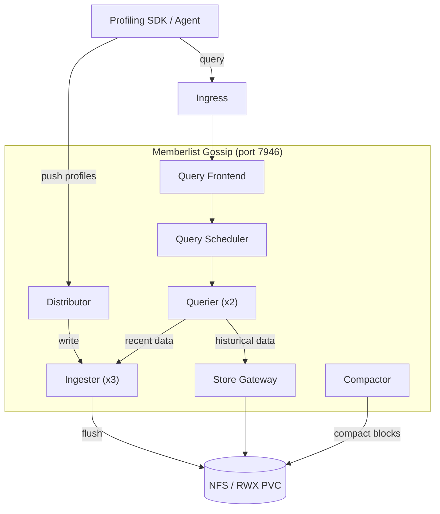

# Pyroscope Microservices -- Kubernetes Manifests

Plain Kubernetes manifests for deploying Pyroscope in microservices mode.
Converted from the OpenShift Helm chart at [`../openshift/`](../openshift/).

## Architecture



**Components:**

| Component | Replicas | Description |
|-----------|----------|-------------|
| Distributor | 1 | Receives push requests, distributes to ingesters |
| Ingester | 3 | Writes profiling data to storage (anti-affinity spread) |
| Querier | 2 | Reads profiling data from ingesters and store-gateway |
| Query Frontend | 1 | Query gateway, splits/retries queries |
| Query Scheduler | 1 | Distributes queries across queriers |
| Compactor | 1 | Compacts stored blocks on shared storage |
| Store Gateway | 1 | Reads compacted data from shared storage |

## Prerequisites

- Kubernetes v1.29+
- `kubectl` configured for your cluster
- ReadWriteMany (RWX) storage provisioner (NFS, CephFS, etc.)
- nginx Ingress controller (for external access)

## Quick Start

```bash
# Create namespace and apply all resources
kubectl apply -f deploy/microservices/k8s/namespace.yaml
kubectl apply -f deploy/microservices/k8s/

# Verify pods are running
kubectl -n pyroscope get pods

# Verify services
kubectl -n pyroscope get svc
```

## Customization

### Image Tag

Edit each deployment file under `deployments/` or use a one-liner:

```bash
# Replace 'latest' with a specific version
sed -i 's|grafana/pyroscope:latest|grafana/pyroscope:1.7.0|' deploy/microservices/k8s/deployments/*.yaml
```

### Replica Counts

Edit the `replicas` field in the relevant deployment:

- `deployments/ingester.yaml` -- default 3
- `deployments/querier.yaml` -- default 2
- All others -- default 1

### Storage Class

To specify a storage class, add `storageClassName` to `pvc.yaml`:

```yaml
spec:
  storageClassName: "nfs-client"
  accessModes:
    - ReadWriteMany
```

### Ingress Host and TLS

Edit `ingress.yaml`:

1. Replace `pyroscope.example.com` with your hostname
2. Uncomment the `tls` section and set `secretName` to your TLS secret

### Pyroscope Configuration

Edit `configmap.yaml` to modify the Pyroscope config (e.g., storage backend,
memberlist settings, retention).

## Cleanup

```bash
kubectl delete -f deploy/microservices/k8s/
```

## Related

- OpenShift Helm chart variant: [`../openshift/`](../openshift/)
- VM docker-compose deployment: [`../vm/`](../vm/)
