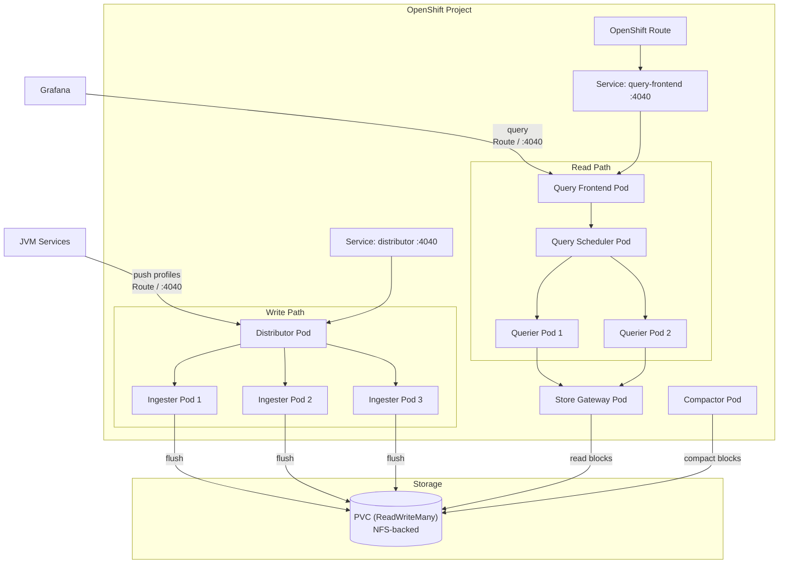

# Pyroscope Microservices — OpenShift (Helm)

Deploys Pyroscope in microservices mode on OpenShift 4.x using a Helm chart. Storage is backed by a ReadWriteMany PVC (typically NFS-backed via a storage class like `nfs-client`).

## Architecture



## Prerequisites

- OpenShift 4.x cluster with `helm` CLI
- A ReadWriteMany-capable storage class (e.g. `nfs-client`, `ocs-storagecluster-cephfs`)

## Quick start

```bash
# Install
helm install pyroscope deploy/microservices/openshift/helm/ \
  --namespace pyroscope --create-namespace

# Upgrade after changing values
helm upgrade pyroscope deploy/microservices/openshift/helm/ \
  --namespace pyroscope

# Uninstall
helm uninstall pyroscope --namespace pyroscope
```

## Values reference

| Key | Default | Description |
|-----|---------|-------------|
| `image.repository` | `grafana/pyroscope` | Container image repository |
| `image.tag` | `latest` | Container image tag |
| `image.pullPolicy` | `IfNotPresent` | Image pull policy |
| `storage.storageClassName` | `""` (cluster default) | Storage class for the RWX PVC |
| `storage.size` | `50Gi` | PVC size |
| `distributor.replicas` | `1` | Distributor replica count |
| `ingester.replicas` | `3` | Ingester replica count |
| `querier.replicas` | `2` | Querier replica count |
| `queryFrontend.replicas` | `1` | Query Frontend replica count |
| `queryScheduler.replicas` | `1` | Query Scheduler replica count |
| `compactor.replicas` | `1` | Compactor replica count |
| `storeGateway.replicas` | `1` | Store Gateway replica count |
| `route.enabled` | `true` | Create an OpenShift Route for external access |
| `route.host` | `""` | Route hostname (auto-generated if empty) |

## Customizing storage class

```bash
helm install pyroscope deploy/microservices/openshift/helm/ \
  --namespace pyroscope --create-namespace \
  --set storage.storageClassName=nfs-client \
  --set storage.size=100Gi
```

## Endpoints

| Resource | Purpose |
|----------|---------|
| Service `*-distributor:4040` | SDK push endpoint (`/ingest`) |
| Service `*-query-frontend:4040` | Query endpoint (Grafana data source) |
| Route (if enabled) | External access to query-frontend |

For monolithic mode (single-node) deployments, see [`../../../monolithic/`](../../../monolithic/).
