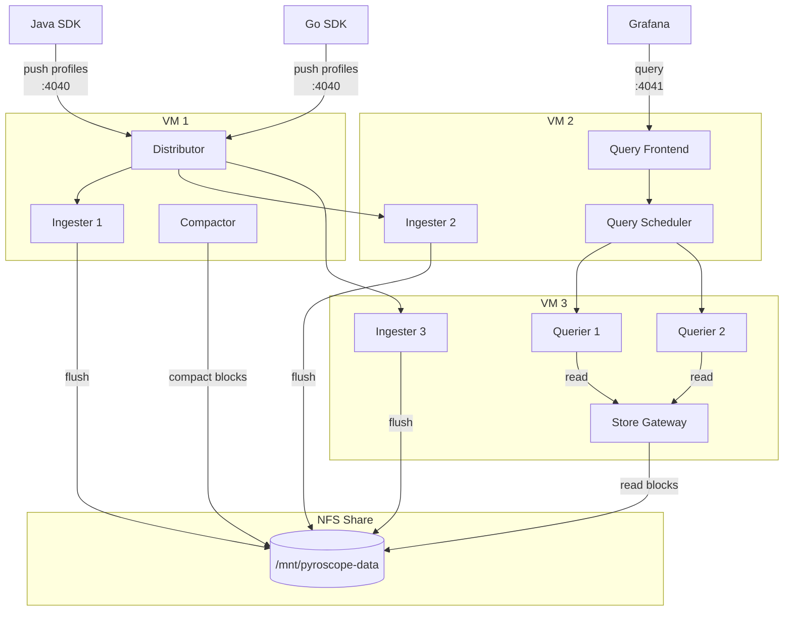
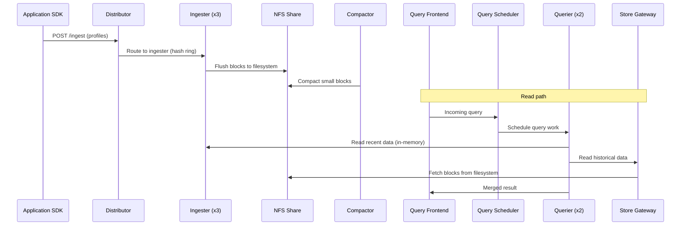

# Pyroscope Microservices — VM / Docker Compose

Runs Pyroscope as separate, independently scalable components on VMs using NFS-backed filesystem storage. Suitable for private enterprise environments where NFS is already available.

## Architecture



### Data flow



## Components

| Service | Replicas | Role |
|---------|----------|------|
| **distributor** | 1 | Routes incoming profiles to ingesters via consistent hash ring |
| **ingester** | 3 | Buffers profiles in memory, flushes completed blocks to NFS |
| **compactor** | 1 | Merges and deduplicates stored blocks for query efficiency |
| **query-frontend** | 1 | Entry point for reads; caches and parallelizes queries |
| **query-scheduler** | 1 | Distributes query work across querier replicas |
| **querier** | 2 | Reads and merges profile data from ingesters and store-gateway |
| **store-gateway** | 1 | Serves historical blocks from NFS |

All Pyroscope components discover each other via **memberlist** (gossip on port 7946).

## Files

| File | Purpose |
|------|---------|
| `docker-compose.yaml` | Defines all services with NFS bind mounts |
| `pyroscope.yaml` | Shared config: filesystem storage, memberlist ring, port 4040 |
| `deploy.sh` | Lifecycle script with NFS pre-check (start/stop/restart/logs/status/clean) |

## Prerequisites

1. An NFS share mounted on every VM at the same path (default: `/mnt/pyroscope-data`)
2. Docker and Docker Compose installed

Example NFS mount:

```bash
sudo mkdir -p /mnt/pyroscope-data
sudo mount -t nfs nfs-server:/export/pyroscope /mnt/pyroscope-data
```

Add to `/etc/fstab` for persistence:

```
nfs-server:/export/pyroscope  /mnt/pyroscope-data  nfs  defaults,rw  0 0
```

## Quick start

```bash
bash deploy.sh          # Start all services
```

- Push profiles to `http://localhost:4040` (distributor)
- Query profiles at `http://localhost:4041` (query-frontend)

## Usage

```bash
bash deploy.sh              # Start (default)
bash deploy.sh stop         # Stop and remove all services
bash deploy.sh restart      # Restart all services
bash deploy.sh logs         # Tail logs from all services
bash deploy.sh status       # Show service status and health
bash deploy.sh clean        # Stop services and remove all volumes
```

## Configuration

| Variable | Default | Description |
|----------|---------|-------------|
| `PYROSCOPE_DATA_DIR` | `/mnt/pyroscope-data` | Host path to the NFS-backed shared storage directory |
| `PYROSCOPE_PUSH_PORT` | `4040` | Host port for the distributor (SDK push endpoint) |
| `PYROSCOPE_QUERY_PORT` | `4041` | Host port for the query-frontend (Grafana data source) |

## Endpoints

| Port | Service | Purpose |
|------|---------|---------|
| `:4040` | Distributor | SDK push endpoint (`/ingest`) |
| `:4041` | Query Frontend | Query endpoint (configure as Grafana data source) |

For simpler single-node deployments, see [`../../monolithic/`](../../monolithic/).
