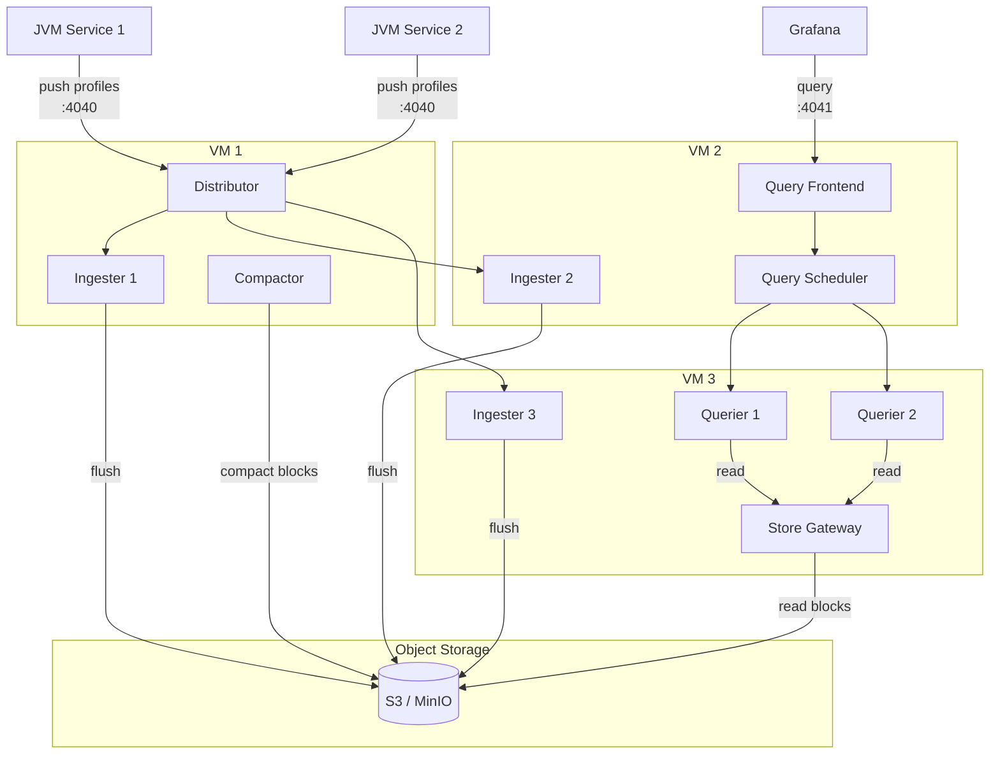
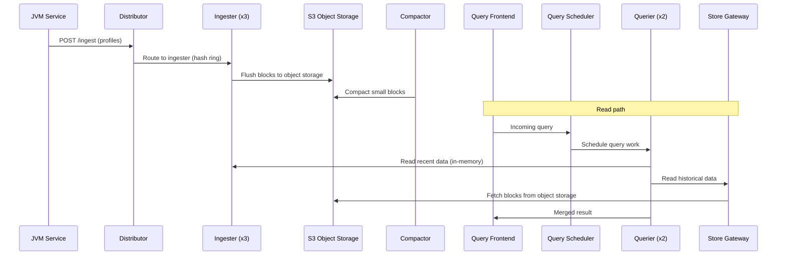

# Pyroscope Microservices — VM / Docker Compose

Runs Pyroscope as separate, independently scalable components on VMs using S3-compatible object storage (MinIO, AWS S3, GCS, or Azure Blob). Suitable for private enterprise environments.

## Architecture


```mermaid
graph TB
    JVM1[JVM Service 1] -->|push profiles<br/>:4040| DIST
    JVM2[JVM Service 2] -->|push profiles<br/>:4040| DIST
    G[Grafana] -->|query<br/>:4041| QF

    subgraph VM 1
        DIST[Distributor]
        ING1[Ingester 1]
        C[Compactor]
    end

    subgraph VM 2
        ING2[Ingester 2]
        QF[Query Frontend]
        QS[Query Scheduler]
    end

    subgraph VM 3
        ING3[Ingester 3]
        Q1[Querier 1]
        Q2[Querier 2]
        SG[Store Gateway]
    end

    subgraph Object Storage
        S3[("S3 / MinIO")]
    end

    DIST --> ING1
    DIST --> ING2
    DIST --> ING3
    ING1 -->|flush| S3
    ING2 -->|flush| S3
    ING3 -->|flush| S3
    Q1 -->|read| SG
    Q2 -->|read| SG
    SG -->|read blocks| S3
    C -->|compact blocks| S3
    QF --> QS
    QS --> Q1
    QS --> Q2
```

### Data flow


```mermaid
sequenceDiagram
    participant SDK as JVM Service
    participant D as Distributor
    participant I as Ingester (x3)
    participant S3 as S3 Object Storage
    participant C as Compactor
    participant QF as Query Frontend
    participant QS as Query Scheduler
    participant Q as Querier (x2)
    participant SG as Store Gateway

    SDK->>D: POST /ingest (profiles)
    D->>I: Route to ingester (hash ring)
    I->>S3: Flush blocks to object storage
    C->>S3: Compact small blocks

    Note over QF,SG: Read path
    QF->>QS: Incoming query
    QS->>Q: Schedule query work
    Q->>I: Read recent data (in-memory)
    Q->>SG: Read historical data
    SG->>S3: Fetch blocks from object storage
    Q->>QF: Merged result
```

## Components

| Service | Replicas | Role |
|---------|----------|------|
| **distributor** | 1 | Routes incoming profiles to ingesters via consistent hash ring |
| **ingester** | 3 | Buffers profiles in memory, flushes completed blocks to S3 |
| **compactor** | 1 | Merges and deduplicates stored blocks for query efficiency |
| **query-frontend** | 1 | Entry point for reads; caches and parallelizes queries |
| **query-scheduler** | 1 | Distributes query work across querier replicas |
| **querier** | 2 | Reads and merges profile data from ingesters and store-gateway |
| **store-gateway** | 1 | Serves historical blocks from S3 |
| **minio** | 1 | S3-compatible object storage (dev/local use; replace with external S3 in production) |

All Pyroscope components discover each other via **memberlist** (gossip on port 7946).

## Files

| File | Purpose |
|------|---------|
| `docker-compose.yaml` | Defines all services with S3 configuration via environment variables |
| `pyroscope.yaml` | Shared config: S3 object storage backend, memberlist ring, port 4040 |
| `deploy.sh` | Lifecycle script (start/stop/restart/logs/status/clean) |

## Prerequisites

1. S3-compatible object storage endpoint (MinIO for dev, AWS S3/GCS/Azure Blob for production)
2. Docker and Docker Compose installed

For local development, the included `docker-compose.yaml` starts a MinIO container automatically. For production, set the S3 environment variables to point to your external storage.

## Quick start

```bash
bash deploy.sh          # Start all services (including local MinIO)
```

- Push profiles to `http://localhost:4040` (distributor)
- Query profiles at `http://localhost:4041` (query-frontend)
- MinIO console at `http://localhost:9001` (user: `pyroscope`, password: `supersecret`)

## Usage

```bash
bash deploy.sh              # Start (default)
bash deploy.sh stop         # Stop and remove all services
bash deploy.sh restart      # Restart all services
bash deploy.sh logs         # Tail logs from all services
bash deploy.sh status       # Show service status and health
bash deploy.sh clean        # Stop services and remove all volumes
```

## Configuration

| Variable | Default | Description |
|----------|---------|-------------|
| `S3_ENDPOINT` | `http://minio:9000` | S3-compatible endpoint URL |
| `S3_BUCKET` | `pyroscope` | S3 bucket name for profile data |
| `S3_ACCESS_KEY_ID` | `pyroscope` | S3 access key |
| `S3_SECRET_ACCESS_KEY` | `supersecret` | S3 secret key |
| `PYROSCOPE_PUSH_PORT` | `4040` | Host port for the distributor (SDK push endpoint) |
| `PYROSCOPE_QUERY_PORT` | `4041` | Host port for the query-frontend (Grafana data source) |

## Endpoints

| Port | Service | Purpose |
|------|---------|---------|
| `:4040` | Distributor | SDK push endpoint (`/ingest`) |
| `:4041` | Query Frontend | Query endpoint (configure as Grafana data source) |
| `:9000` | MinIO | S3 API (local dev only) |
| `:9001` | MinIO | Web console (local dev only) |

For monolithic mode (single-node) deployments, see [`../../monolithic/`](../../monolithic/).
