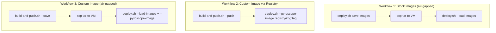
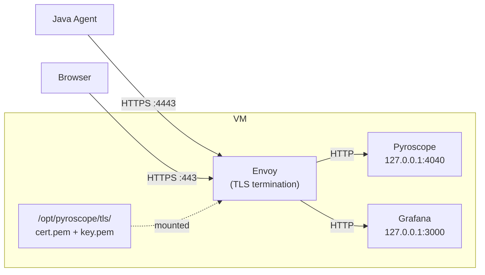

# Pyroscope Monolith Deployment

Everything needed to deploy Pyroscope continuous profiling (with optional Grafana)
on VMs, Kubernetes, or OpenShift. Supports HTTP and HTTPS, air-gapped environments,
and three deployment methods (manual, bash script, Ansible).

## Overview

**Grafana modes** -- control what gets deployed:

| Mode | What it does |
|------|-------------|
| `full-stack` (default) | Deploy Pyroscope + fresh Grafana together |
| `full-stack --skip-grafana` | Deploy Pyroscope only (no Grafana container) |
| `add-to-existing` | Add Pyroscope datasource and dashboards to an existing Grafana |

**Deployment methods** -- control how it gets deployed:

| Method | When to use |
|--------|------------|
| Manual | Step-by-step `docker` CLI commands documented below |
| Bash script | `deploy.sh` via SSH + `pbrun` |
| Ansible | `deploy/monolith/ansible/` role and playbooks |

**Target environments** -- control where it gets deployed:

| Target | Flag | Runtime |
|--------|------|---------|
| VM / bare metal | `--target vm` (default) | `docker run` |
| Local development | `--target local` | Docker Compose |
| Kubernetes v1.29+ | `--target k8s` | `kubectl` |
| OpenShift OCP 4.12+ | `--target openshift` | `oc` CLI + Routes |

---

## Quick Start

### VM with HTTP (Pyroscope + Grafana)

```bash
# On a machine with internet access -- save images to tar
bash deploy.sh save-images

# Transfer to VM
scp pyroscope-stack-images.tar operator@vm01.corp.example.com:/tmp/

# SSH to VM, elevate to root
ssh operator@vm01.corp.example.com
pbrun /bin/su -

# Dry run first (no changes made)
bash deploy.sh full-stack --target vm \
    --load-images /tmp/pyroscope-stack-images.tar --dry-run

# Deploy
bash deploy.sh full-stack --target vm \
    --load-images /tmp/pyroscope-stack-images.tar \
    --log-file /tmp/deploy.log
```

Result: Pyroscope on `:4040`, Grafana on `:3000` with 6 dashboards pre-loaded.

### VM with HTTP (Pyroscope only)

```bash
bash deploy.sh full-stack --target vm --skip-grafana \
    --load-images /tmp/pyroscope-stack-images.tar
```

### VM with HTTPS (self-signed)

```bash
bash deploy.sh full-stack --target vm \
    --load-images /tmp/pyroscope-stack-images.tar \
    --tls --tls-self-signed
```

Result: Pyroscope on `https://<VM>:4443`, Grafana on `https://<VM>:443`.
Backend containers bind to `127.0.0.1` only.

### VM with HTTPS (CA certificates)

```bash
bash deploy.sh full-stack --target vm \
    --tls --tls-cert /path/to/cert.pem --tls-key /path/to/key.pem
```

### Add to existing Grafana

API method (no Grafana restart):

```bash
bash deploy.sh add-to-existing \
    --grafana-url http://grafana.corp:3000 \
    --grafana-api-key eyJrIj... \
    --pyroscope-url http://pyroscope.corp:4040
```

Provisioning method (requires Grafana restart):

```bash
bash deploy.sh add-to-existing \
    --method provisioning \
    --pyroscope-url http://pyroscope.corp:4040 \
    --grafana-provisioning-dir /etc/grafana/provisioning \
    --grafana-dashboard-dir /var/lib/grafana/dashboards

systemctl restart grafana-server
```

### Kubernetes

```bash
# Default (PVCs for persistent data)
bash deploy.sh full-stack --target k8s --namespace monitoring

# With specific storage class
bash deploy.sh full-stack --target k8s --namespace monitoring \
    --storage-class managed-premium --pvc-size-pyroscope 50Gi

# Ephemeral (no PVC -- dev/testing only)
bash deploy.sh full-stack --target k8s --namespace monitoring --no-pvc
```

### OpenShift

```bash
bash deploy.sh full-stack --target openshift --namespace monitoring
```

OpenShift Routes are created automatically for both services.

---

## Script Composition

Two scripts with a clean separation of concerns:

| Script | Responsibility |
|--------|---------------|
| `deploy.sh` | **Deployment lifecycle** -- deploy, status, stop, clean, logs, save-images |
| `build-and-push.sh` | **Image lifecycle** -- build, tag, push, save, list-tags, clean |

They compose via `--pyroscope-image` and `--load-images`:



**Workflow 1 -- Stock images, no registry:**
```bash
bash deploy.sh save-images                          # workstation
scp pyroscope-stack-images.tar operator@vm01:/tmp/   # transfer
bash deploy.sh full-stack --load-images /tmp/pyroscope-stack-images.tar   # VM
```

**Workflow 2 -- Custom image via registry:**
```bash
bash build-and-push.sh --version 1.18.0 --registry registry.corp/pyroscope --push
bash deploy.sh full-stack --pyroscope-image registry.corp/pyroscope/pyroscope-server:1.18.0
```

**Workflow 3 -- Custom image, air-gapped:**
```bash
bash build-and-push.sh --version 1.18.0 --platform linux/amd64 --save
scp pyroscope-server-1.18.0.tar operator@vm01:/tmp/
bash deploy.sh full-stack \
    --load-images /tmp/pyroscope-server-1.18.0.tar \
    --pyroscope-image pyroscope-server:1.18.0
```

---

## Image Building

`build-and-push.sh` builds a Pyroscope Docker image with a pinned version
and optionally pushes it to an internal registry or saves it as a tar file.

```bash
# List available upstream versions
bash build-and-push.sh --list-tags

# Build and push to internal registry
bash build-and-push.sh --version 1.18.0 \
    --registry company.corp.com/docker-proxy/pyroscope --push

# Build for linux/amd64 (when building on Mac for RHEL)
bash build-and-push.sh --version 1.18.0 --platform linux/amd64 --push \
    --registry company.corp.com/docker-proxy/pyroscope

# Save as tar (air-gapped)
bash build-and-push.sh --version 1.18.0 --platform linux/amd64 --save

# Pull official image and re-tag (no build step, config mounted at runtime)
bash build-and-push.sh --version 1.18.0 --pull-only --push \
    --registry company.corp.com/docker-proxy/pyroscope
```

See [DOCKER-BUILD.md](DOCKER-BUILD.md) for the full step-by-step guide
covering registry push, `docker save/load`, cross-platform builds, upgrade,
and rollback procedures.

### build-and-push.sh flags

| Flag | Env Variable | Default | Description |
|------|-------------|---------|-------------|
| `--version` | `VERSION` | `1.18.0` | Pyroscope version to build |
| `--registry` | `REGISTRY` | `company.corp.com/docker-proxy/pyroscope` | Internal registry path |
| `--image` | `IMAGE_NAME` | `pyroscope-server` | Image name |
| `--upstream` | `UPSTREAM_IMAGE` | `grafana/pyroscope` | Upstream Docker Hub image |
| `--platform` | `PLATFORM` | *(current arch)* | Target platform (e.g. `linux/amd64`) |
| `--pull-only` | | | Re-tag official image (no Dockerfile build) |
| `--save [path]` | | | Export image as tar file |
| `--push` | | | Push to registry after build |
| `--latest` | | | Also tag/push as `:latest` |
| `--dry-run` | | | Show commands without executing |
| `--list-tags` | | | List upstream versions from Docker Hub |
| `--no-cache` | | | Build without Docker cache |
| `--clean` | | | Remove container, image, volume, and config |

---

## Custom Base Images

When the official `grafana/pyroscope` image is unavailable (no Docker Hub access,
no internal mirror), use `Dockerfile.custom`. It extracts the Pyroscope binary
from the official image in a multi-stage build, then runs it on a minimal base.

```bash
# Alpine (default, ~8 MB)
docker build -f Dockerfile.custom -t pyroscope-server:1.18.0 .

# Red Hat UBI Minimal (enterprise compliance)
docker build -f Dockerfile.custom \
    --build-arg PYROSCOPE_VERSION=1.18.0 \
    --build-arg BASE_IMAGE=registry.access.redhat.com/ubi8/ubi-minimal:8.10 \
    -t pyroscope-server:1.18.0 .

# Debian slim
docker build -f Dockerfile.custom \
    --build-arg BASE_IMAGE=debian:bookworm-slim \
    -t pyroscope-server:1.18.0 .

# Distroless (smallest attack surface, no shell)
docker build -f Dockerfile.custom \
    --build-arg BASE_IMAGE=gcr.io/distroless/static-debian12:nonroot \
    -t pyroscope-server:1.18.0 .
```

The multi-stage build only needs Docker Hub access at build time (to pull
`grafana/pyroscope` as the source stage). The final image uses your chosen base.

---

## Configuration Reference

### General flags

| Flag | Env Variable | Default | Description |
|------|-------------|---------|-------------|
| `--target <env>` | -- | `vm` | Target: `vm`, `local`, `k8s`, `openshift` |
| `--method <m>` | -- | `api` | Method for `add-to-existing`: `api` or `provisioning` |
| `--dry-run` | -- | -- | Validate without making changes |
| `--log-file <path>` | -- | -- | Append output to log file |
| `--skip-grafana` | -- | -- | Deploy Pyroscope only |
| `--load-images <path>` | -- | -- | Load Docker images from tar before deploying |
| `--bake-config` | -- | -- | Bake config into image (instead of volume mount) |
| `--mount-config` | -- | -- | Volume-mount config from host (default) |
| `--grafana-config-dir` | `GRAFANA_CONFIG_DIR` | `/opt/pyroscope/grafana` | Host dir for Grafana config |

### Pyroscope flags

| Flag | Env Variable | Default | Description |
|------|-------------|---------|-------------|
| `--pyroscope-port` | `PYROSCOPE_PORT` | `4040` | Host port |
| `--pyroscope-url` | `PYROSCOPE_URL` | auto-detected | Server URL (for `add-to-existing`) |
| `--pyroscope-image` | `PYROSCOPE_IMAGE` | `grafana/pyroscope:latest` | Docker image |
| `--pyroscope-config` | `PYROSCOPE_CONFIG` | -- | Path to custom pyroscope.yaml |

### Grafana flags

| Flag | Env Variable | Default | Description |
|------|-------------|---------|-------------|
| `--grafana-port` | `GRAFANA_PORT` | `3000` | Host port |
| `--grafana-url` | `GRAFANA_URL` | -- | Existing Grafana URL |
| `--grafana-api-key` | `GRAFANA_API_KEY` | -- | API key (prefer env var -- flags visible in `ps`) |
| `--grafana-admin-password` | `GRAFANA_ADMIN_PASSWORD` | `admin` | Admin password (prefer env var) |
| `--grafana-provisioning-dir` | `GRAFANA_PROVISIONING_DIR` | `/etc/grafana/provisioning` | Provisioning dir for `add-to-existing` |
| `--grafana-dashboard-dir` | `GRAFANA_DASHBOARD_DIR` | `/var/lib/grafana/dashboards` | Dashboard dir for `add-to-existing` |

### TLS / HTTPS flags

| Flag | Env Variable | Default | Description |
|------|-------------|---------|-------------|
| `--tls` | -- | -- | Enable TLS mode |
| `--tls-self-signed` | -- | -- | Auto-generate self-signed cert |
| `--tls-cert <path>` | -- | -- | TLS certificate (PEM) |
| `--tls-key <path>` | -- | -- | TLS private key (PEM) |
| `--tls-cert-dir` | `TLS_CERT_DIR` | `/opt/pyroscope/tls` | Cert directory on host |
| `--tls-port-pyroscope` | `TLS_PORT_PYROSCOPE` | `4443` | HTTPS port for Pyroscope |
| `--tls-port-grafana` | `TLS_PORT_GRAFANA` | `443` | HTTPS port for Grafana |

### Kubernetes / OpenShift flags

| Flag | Env Variable | Default | Description |
|------|-------------|---------|-------------|
| `--namespace` | `NAMESPACE` | `monitoring` | K8s / OpenShift namespace |
| `--no-pvc` | -- | -- | Use emptyDir instead of PVC |
| `--storage-class` | -- | cluster default | Storage class for PVCs |
| `--pvc-size-pyroscope` | `PVC_SIZE_PYROSCOPE` | `10Gi` | Pyroscope PVC size |
| `--pvc-size-grafana` | `PVC_SIZE_GRAFANA` | `2Gi` | Grafana PVC size |

---

## TLS / HTTPS

TLS is opt-in. When enabled, an Envoy reverse proxy terminates TLS in front
of Pyroscope and Grafana. Backend containers bind to `127.0.0.1` and are not
directly reachable from the network.



### Self-signed (dev / demo)

Generates cert + key with hostname SAN automatically.
The cert is regenerated only if missing or expiring within 7 days.

```bash
bash deploy.sh full-stack --target vm --tls --tls-self-signed
```

### Enterprise CA (production)

Provide cert and key as file paths. Never pass certificate content as CLI args.

```bash
bash deploy.sh full-stack --target vm \
    --tls --tls-cert /path/to/cert.pem --tls-key /path/to/key.pem
```

### Validation rules

- `--tls` alone fails -- must specify `--tls-self-signed` or both `--tls-cert`/`--tls-key`.
- `--tls-cert` requires `--tls-key` (and vice versa).
- `--tls-self-signed` requires `openssl` on PATH.

### Port reference

| Service | HTTP (default) | HTTPS (with TLS) |
|---------|---------------|-------------------|
| Pyroscope | `:4040` | `:4443` via Envoy |
| Grafana | `:3000` | `:443` via Envoy |
| Envoy admin | -- | `127.0.0.1:9901` |

---

## Add to Existing Grafana

Two methods for integrating Pyroscope into a Grafana instance you already manage.

### API method (no restart)

Uses the Grafana HTTP API. Requires an API key or admin credentials.
Installs the Pyroscope plugin, adds the datasource, and imports 6 dashboards.

```bash
bash deploy.sh add-to-existing \
    --grafana-url http://grafana.corp:3000 \
    --grafana-api-key eyJrIj... \
    --pyroscope-url http://pyroscope.corp:4040
```

### Provisioning method (requires restart)

Writes provisioning YAML and dashboard JSON files to disk. No API key needed
but Grafana must be restarted to pick up the changes.

```bash
bash deploy.sh add-to-existing \
    --method provisioning \
    --pyroscope-url http://pyroscope.corp:4040 \
    --grafana-provisioning-dir /etc/grafana/provisioning \
    --grafana-dashboard-dir /var/lib/grafana/dashboards

systemctl restart grafana-server
```

### Dashboards included

| Dashboard | Description |
|-----------|-------------|
| Pyroscope Overview | CPU, allocation, lock profiles across all services |
| Verticle Performance | Per-verticle flame graph analysis |
| JVM Metrics | GC, heap, thread pool deep dive |
| HTTP Performance | Request latency correlated with CPU profiles |
| Before/After Comparison | Diff flame graph for optimization validation |
| FaaS Server | Serverless function profiling |

---

## Ansible

For teams that use Ansible, an equivalent role is provided in `ansible/`.
It supports the same features as `deploy.sh` -- TLS, skip-grafana,
image loading -- using native Ansible modules (`community.docker`, `ansible.posix`).

```bash
cd deploy/monolith/ansible

# Deploy full stack (HTTP)
ansible-playbook -i inventory playbooks/deploy.yml

# Deploy with HTTPS (self-signed)
ansible-playbook -i inventory playbooks/deploy.yml \
    -e tls_enabled=true -e tls_self_signed=true

# Deploy with pre-loaded images
ansible-playbook -i inventory playbooks/deploy.yml \
    -e docker_load_path=/tmp/pyroscope-stack-images.tar
```

The role can be included in any existing playbook:

```yaml
- name: Infrastructure playbook
  hosts: profiling_servers
  become: true
  roles:
    - role: pyroscope-stack
```

See [ansible/README.md](ansible/README.md) for full documentation.

---

## Day-2 Operations

### Status and logs

```bash
bash deploy.sh status --target vm
bash deploy.sh logs --target vm
```

### Stop and clean

```bash
# Stop (data volumes preserved)
bash deploy.sh stop --target vm

# Full cleanup (removes containers, volumes, images, certs)
bash deploy.sh clean --target vm
```

### Manual Docker commands

```bash
# Health check
curl -s http://localhost:4040/ready && echo " OK"

# View logs (last 100 lines / follow / last hour / errors only)
docker logs --tail 100 pyroscope
docker logs -f pyroscope
docker logs --since 1h pyroscope
docker logs pyroscope 2>&1 | grep -i error

# Stop container (data preserved)
docker stop pyroscope

# Remove container (data preserved)
docker rm -f pyroscope
```

### Config changes

If config is volume-mounted (default):

```bash
vi /opt/pyroscope/pyroscope.yaml
docker restart pyroscope
```

If config is baked into the image (`--bake-config`):

```bash
# Re-run deploy to rebuild image
bash deploy.sh full-stack --target vm --bake-config
```

### Upgrade

```bash
# Pull new version and redeploy (data volume preserved)
bash deploy.sh full-stack --target vm \
    --pyroscope-image grafana/pyroscope:1.19.0
```

Or for air-gapped VMs:

```bash
# Workstation: save new images
bash deploy.sh save-images   # or build-and-push.sh --save

# VM: load and deploy
bash deploy.sh full-stack --target vm \
    --load-images /tmp/pyroscope-stack-images.tar
```

### Backup and restore

```bash
# Backup profiling data (Pyroscope can remain running)
docker run --rm \
    -v pyroscope-data:/data:ro \
    -v "$(pwd)":/backup \
    alpine tar czf /backup/pyroscope-backup-$(date +%Y%m%d).tar.gz -C /data .

# Restore (stop Pyroscope first)
docker stop pyroscope
docker run --rm \
    -v pyroscope-data:/data \
    -v "$(pwd)":/backup:ro \
    alpine sh -c "rm -rf /data/* && tar xzf /backup/pyroscope-backup-YYYYMMDD.tar.gz -C /data"
docker start pyroscope
```

### Disk usage

```bash
docker system df -v 2>/dev/null | grep pyroscope-data
docker system df
```

---

## Data Persistence

| Target | Pyroscope data | Grafana data | Grafana config | Survives restart? |
|--------|---------------|-------------|----------------|:-----------------:|
| VM (docker) | Named volume `pyroscope-data` | Named volume `grafana-data` | Host dir (default) or baked | Yes |
| Local (compose) | Named volume | Named volume | Bind mount from repo | Yes |
| K8s (default) | PVC 10Gi | PVC 2Gi | ConfigMaps | Yes |
| K8s (`--no-pvc`) | emptyDir | emptyDir | ConfigMaps | No |

---

## File Map

| File | Purpose |
|------|---------|
| `deploy.sh` | Deployment lifecycle script (deploy, status, stop, clean, logs, save-images) |
| `build-and-push.sh` | Image lifecycle script (build, tag, push, save, list-tags, clean) |
| `deploy-test.sh` | 45 mock-based unit tests for deploy.sh (no root/Docker needed) |
| `Dockerfile` | Production image from official `grafana/pyroscope` base |
| `Dockerfile.custom` | Custom base image (Alpine, UBI, Debian) multi-stage build |
| `pyroscope.yaml` | Pyroscope server config (filesystem storage at `/data`, port 4040) |
| `DOCKER-BUILD.md` | Full guide for building, pushing, and managing Docker images |
| `ansible/` | Ansible role + playbooks (same functionality as deploy.sh) |
