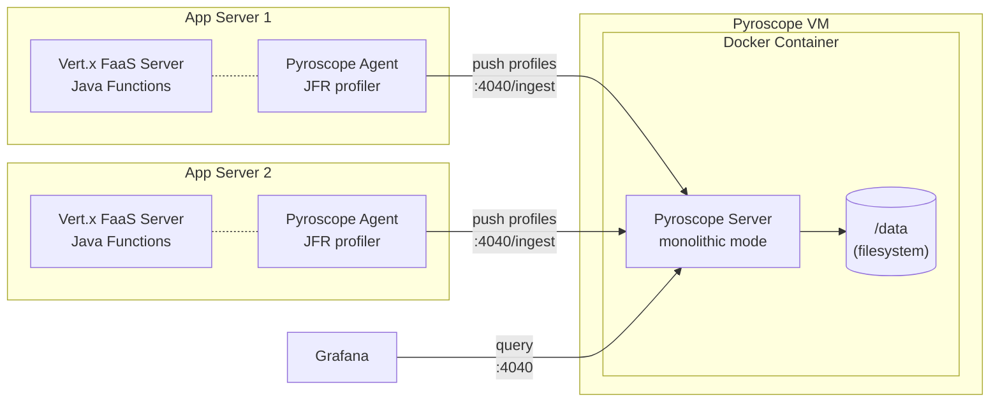

# Pyroscope Monolithic Deployment

Pyroscope server deployed in **monolithic mode** (`-target=all`), suitable for development, testing, and small-to-medium workloads. All components (ingestion, storage, querying) run in a single process inside one container with local filesystem storage. See [Grafana docs: deployment modes](https://grafana.com/docs/pyroscope/latest/reference-pyroscope-architecture/deployment-modes/) for details.

## Architecture



The Pyroscope Java agent runs as a `-javaagent` inside each Vert.x JVM process. It continuously samples CPU, memory, lock, and wall-clock profiles using JFR and pushes them to the Pyroscope server every 10 seconds. No application code changes are required — the agent is attached at JVM startup via `JAVA_TOOL_OPTIONS`.

## Files

| File | Purpose |
|------|---------|
| `Dockerfile` | Production image from official `grafana/pyroscope` base. Pinned version, non-root user, HEALTHCHECK. |
| `Dockerfile.custom` | Custom base image (Alpine, UBI, Debian) for environments where the official image is unavailable. Multi-stage build copies the Pyroscope binary. |
| `pyroscope.yaml` | Server config: filesystem storage at `/data`, port 4040 |
| `deploy.sh` | Lifecycle script (start/stop/restart/logs/status/clean) with Git and local source options |
| `deploy-test.sh` | 45 mock-based unit tests for deploy.sh (no root or Docker needed) |
| `build-and-push.sh` | Build Pyroscope image with pinned version and push to internal Docker registry |

## Prerequisites

- **Docker** installed and running on the target VM
- **Root access** via `pbrun /bin/su -`
- **Port 4040** available (or choose a different port)

## Directory Layout

| Location | Purpose |
|----------|---------|
| **Your workstation** | |
| `deploy/monolithic/` | Source files in your local repo clone (Dockerfile, pyroscope.yaml, deploy.sh) |
| **Target VM** | |
| `/tmp/pyroscope-deploy/` | Temporary landing directory for scp (deleted after install) |
| `/opt/pyroscope/` | Permanent install directory on the VM (Dockerfile + pyroscope.yaml live here) |
| Docker volume `pyroscope-data` | Mounted as `/data` inside the container — stores profiling data |

---

## Option A: Deploy with Script

### Step 1: Copy files to the VM (from your workstation)

`scp` (secure copy) transfers files over SSH. The syntax is `scp <local-files> <user>@<host>:<remote-path>`. Run this from your workstation, not from the VM.

```bash
# Create the landing directory on the VM
ssh operator@vm01.corp.example.com "mkdir -p /tmp/pyroscope-deploy"

# Copy the 3 required files from your local repo clone
scp deploy/monolithic/deploy.sh \
    deploy/monolithic/Dockerfile \
    deploy/monolithic/pyroscope.yaml \
    operator@vm01.corp.example.com:/tmp/pyroscope-deploy/
```

After this step, the VM has:

```
/tmp/pyroscope-deploy/
├── deploy.sh
├── Dockerfile
└── pyroscope.yaml
```

### Step 2: SSH to the VM

```bash
ssh operator@vm01.corp.example.com
```

### Step 3: Elevate to root

```bash
pbrun /bin/su -
```

### Step 4: Pre-flight checks

```bash
# Verify Docker is installed and running
docker info >/dev/null 2>&1 && echo "Docker OK" || echo "Docker NOT available"

# Check that port 4040 is not already in use
ss -tlnp | grep :4040

# Check no container named 'pyroscope' already exists
docker ps -a --format '{{.Names}}' | grep -x pyroscope || echo "No conflict"
```

If Docker is not installed (RHEL 8):

```bash
yum install -y yum-utils
yum-config-manager --add-repo https://download.docker.com/linux/centos/docker-ce.repo
yum install -y docker-ce docker-ce-cli containerd.io
systemctl start docker && systemctl enable docker
```

### Step 5: Deploy

```bash
bash /tmp/pyroscope-deploy/deploy.sh start --from-local /tmp/pyroscope-deploy
```

The script will:

1. Verify you are root and Docker is running
2. Copy `Dockerfile` and `pyroscope.yaml` from `/tmp/pyroscope-deploy/` to `/opt/pyroscope/`
3. Build the Docker image `pyroscope-server` from `/opt/pyroscope/Dockerfile`
4. Create a Docker volume `pyroscope-data` (if it does not already exist)
5. Start the container `pyroscope` on port 4040
6. Wait up to 60 seconds for the health check (`/ready` endpoint)
7. Print a connection summary with the VM IP address

To use a different port:

```bash
PYROSCOPE_PORT=9090 bash /tmp/pyroscope-deploy/deploy.sh start --from-local /tmp/pyroscope-deploy
```

### Step 6: Verify

```bash
curl -s http://localhost:4040/ready && echo " OK"
```

Open `http://<VM_IP>:4040` in a browser to access the Pyroscope UI.

### Step 7: Clean up and keep deploy.sh for day-2

```bash
# Copy deploy.sh to the install directory for future use
cp /tmp/pyroscope-deploy/deploy.sh /opt/pyroscope/deploy.sh

# Remove the temp landing directory
rm -rf /tmp/pyroscope-deploy
```

After cleanup, the VM has:

```
/opt/pyroscope/
├── deploy.sh          # lifecycle script for day-2 operations
├── Dockerfile         # used by docker build
└── pyroscope.yaml     # Pyroscope server config
```

---

## Option B: Deploy Manually (without script)

If you prefer not to use the deploy script, run the Docker commands directly.

### Step 1: Copy files to the VM (from your workstation)

Only 2 files are needed (no deploy.sh).

```bash
ssh operator@vm01.corp.example.com "mkdir -p /tmp/pyroscope-deploy"

scp deploy/monolithic/Dockerfile \
    deploy/monolithic/pyroscope.yaml \
    operator@vm01.corp.example.com:/tmp/pyroscope-deploy/
```

### Step 2: SSH to the VM and elevate to root

```bash
ssh operator@vm01.corp.example.com
pbrun /bin/su -
```

### Step 3: Pre-flight checks

```bash
docker info >/dev/null 2>&1 && echo "Docker OK" || echo "Docker NOT available"
ss -tlnp | grep :4040
```

### Step 4: Copy files to the install directory

```bash
mkdir -p /opt/pyroscope
cp /tmp/pyroscope-deploy/Dockerfile     /opt/pyroscope/Dockerfile
cp /tmp/pyroscope-deploy/pyroscope.yaml /opt/pyroscope/pyroscope.yaml
```

### Step 5: Build the Docker image

```bash
cd /opt/pyroscope
docker build -t pyroscope-server .
```

This builds an image from the Dockerfile, which:
- Pulls `grafana/pyroscope:latest` from Docker Hub
- Copies `pyroscope.yaml` into the image as `/etc/pyroscope/config.yaml`
- Sets the entrypoint to `pyroscope -config.file=/etc/pyroscope/config.yaml`

If the VM cannot reach Docker Hub, use a base image from your internal registry:

```bash
docker build --build-arg BASE_IMAGE=company.corp.com/docker-proxy/pyroscope/pyroscope:1.13.0 \
    -t pyroscope-server .
```

Or use [Option C](#option-c-pre-built-image-from-internal-registry) to avoid building on the VM entirely.

### Step 6: Create the data volume

```bash
docker volume create pyroscope-data
```

This volume persists profiling data across container restarts. It is mounted as `/data` inside the container.

### Step 7: Start the container

```bash
docker run -d \
    --name pyroscope \
    --restart unless-stopped \
    -p 4040:4040 \
    -v pyroscope-data:/data \
    pyroscope-server
```

To use a different host port (e.g., 9090):

```bash
docker run -d \
    --name pyroscope \
    --restart unless-stopped \
    -p 9090:4040 \
    -v pyroscope-data:/data \
    pyroscope-server
```

### Step 8: Wait for health check

```bash
# Poll until ready (up to 60 seconds)
for i in $(seq 1 30); do
    if docker exec pyroscope wget -q --spider http://localhost:4040/ready 2>/dev/null; then
        echo "Pyroscope is ready"
        break
    fi
    sleep 2
done
```

### Step 9: Verify

```bash
curl -s http://localhost:4040/ready && echo " OK"
docker ps --filter "name=^pyroscope$" --format "table {{.Names}}\t{{.Status}}\t{{.Ports}}"
```

### Step 10: Clean up temp files

```bash
rm -rf /tmp/pyroscope-deploy
```

After cleanup, the VM has:

```
/opt/pyroscope/
├── Dockerfile         # kept for rebuilds
└── pyroscope.yaml     # kept for reference

Docker:
  Image:     pyroscope-server
  Container: pyroscope (port 4040)
  Volume:    pyroscope-data (mounted as /data)
```

### Manual day-2 operations

```bash
# View logs
docker logs -f pyroscope

# Stop (data volume preserved)
docker rm -f pyroscope

# Restart (rebuild image first if config changed)
cd /opt/pyroscope && docker build -t pyroscope-server .
docker rm -f pyroscope 2>/dev/null
docker run -d --name pyroscope --restart unless-stopped -p 4040:4040 -v pyroscope-data:/data pyroscope-server

# Full cleanup (removes container, image, and all profiling data)
docker rm -f pyroscope 2>/dev/null
docker rmi pyroscope-server 2>/dev/null
docker volume rm pyroscope-data 2>/dev/null
```

---

## Option C: Pre-built Image from Internal Registry

Use this when VMs cannot reach Docker Hub (common in enterprise networks). Build the image once from a machine with internet access, push to your internal Docker registry (e.g., Artifactory, Nexus, Harbor), then pull on VMs.

### Why this option?

Options A and B run `docker build` on the VM, which requires pulling `grafana/pyroscope` from Docker Hub. If the VM has no internet access, the build fails with:

```
failed to resolve source metadata for docker.io/grafana/pyroscope:latest: dial ... i/o timeout
```

Option C solves this by building and pushing the image from your workstation (which has internet access) to an internal registry that VMs can reach.

### Step 1: Check available versions (from your workstation)

```bash
# List recent Pyroscope releases from Docker Hub
bash deploy/monolithic/build-and-push.sh --list-tags
```

### Step 2: Build and push from your workstation

```bash
# Build with a pinned version (default: 1.18.0)
bash deploy/monolithic/build-and-push.sh --version 1.18.0

# Preview what would happen without executing
bash deploy/monolithic/build-and-push.sh --version 1.18.0 --push --dry-run

# Build and push to your internal registry
bash deploy/monolithic/build-and-push.sh --version 1.18.0 --push

# Also update the :latest tag in the registry
bash deploy/monolithic/build-and-push.sh --version 1.18.0 --push --latest
```

Configure the registry path via flag or environment variable:

```bash
# Via flag
bash deploy/monolithic/build-and-push.sh \
    --version 1.18.0 \
    --registry company.corp.com/docker-proxy/pyroscope \
    --push

# Via environment variable
REGISTRY=company.corp.com/docker-proxy/pyroscope \
    bash deploy/monolithic/build-and-push.sh --version 1.18.0 --push
```

This produces:

```
company.corp.com/docker-proxy/pyroscope/pyroscope-server:1.18.0
company.corp.com/docker-proxy/pyroscope/pyroscope-server:latest   (if --latest)
```

The image has `pyroscope.yaml` baked in — no config files needed on the VM.

If building on a Mac/ARM workstation for Linux VMs:

```bash
bash deploy/monolithic/build-and-push.sh --version 1.18.0 --platform linux/amd64 --push
```

### Step 3: SSH to the VM and elevate to root

```bash
ssh operator@vm01.corp.example.com
pbrun /bin/su -
```

### Step 4: Pre-flight checks

```bash
docker info >/dev/null 2>&1 && echo "Docker OK" || echo "Docker NOT available"
ss -tlnp | grep :4040
```

### Step 5: Pull the image from your internal registry

```bash
docker pull company.corp.com/docker-proxy/pyroscope/pyroscope-server:1.18.0
```

### Step 6: Create the data volume and start the container

```bash
docker volume create pyroscope-data

docker run -d \
    --name pyroscope \
    --restart unless-stopped \
    -p 4040:4040 \
    -v pyroscope-data:/data \
    company.corp.com/docker-proxy/pyroscope/pyroscope-server:1.18.0
```

### Step 7: Verify

```bash
# Wait for health check
for i in $(seq 1 30); do
    if docker exec pyroscope wget -q --spider http://localhost:4040/ready 2>/dev/null; then
        echo "Pyroscope is ready"
        break
    fi
    sleep 2
done

curl -s http://localhost:4040/ready && echo " OK"
```

After deployment, the VM has:

```
No files on disk — the image was pulled from the internal registry.

Docker:
  Image:     company.corp.com/docker-proxy/pyroscope/pyroscope-server:1.18.0
  Container: pyroscope (port 4040)
  Volume:    pyroscope-data (mounted as /data)
```

### Upgrading to a new Pyroscope version

On your workstation:

```bash
# Check what's available
bash deploy/monolithic/build-and-push.sh --list-tags

# Build and push the new version
bash deploy/monolithic/build-and-push.sh --version 1.19.0 --push --latest
```

On the VM:

```bash
docker pull company.corp.com/docker-proxy/pyroscope/pyroscope-server:1.19.0
docker rm -f pyroscope
docker run -d \
    --name pyroscope \
    --restart unless-stopped \
    -p 4040:4040 \
    -v pyroscope-data:/data \
    company.corp.com/docker-proxy/pyroscope/pyroscope-server:1.19.0
```

The data volume is preserved across upgrades.

### build-and-push.sh configuration

All settings can be set via flags or environment variables. Flags take precedence.

| Flag | Env Variable | Default | Description |
|------|-------------|---------|-------------|
| `--version` | `VERSION` | `1.18.0` | Pyroscope version to build (pinned, not `latest`) |
| `--registry` | `REGISTRY` | `company.corp.com/docker-proxy/pyroscope` | Internal registry path |
| `--image` | `IMAGE_NAME` | `pyroscope-server` | Image name appended to registry path |
| `--upstream` | `UPSTREAM_IMAGE` | `grafana/pyroscope` | Upstream Docker Hub image |
| `--platform` | `PLATFORM` | *(current)* | Target platform (e.g., `linux/amd64`) |
| `--push` | | | Push to internal registry after building |
| `--latest` | | | Also tag and push as `:latest` (requires `--push`) |
| `--dry-run` | | | Show commands without executing |
| `--list-tags` | | | List recent upstream versions from Docker Hub |
| `--no-cache` | | | Build without Docker cache (force fresh pull) |

---

## Dockerfile Details

### Which Dockerfile to use

| Dockerfile | Base Image | When to Use |
|-----------|-----------|-------------|
| `Dockerfile` | `grafana/pyroscope:1.18.0` (distroless) | Default. Use when you can pull the official image from Docker Hub or an internal mirror. |
| `Dockerfile.custom` | Alpine, UBI, or Debian (your choice) | Use when the official `grafana/pyroscope` image is completely unavailable. Multi-stage build copies the binary from the official image into a custom base. |

### Security and best practices

The official `grafana/pyroscope` image is already hardened:

- **Distroless base** (`gcr.io/distroless/static`) — no shell, no package manager, minimal attack surface
- **Non-root user** — runs as `pyroscope` (UID 10001, GID 10001)
- **Statically compiled Go binary** — no runtime dependencies

Our `Dockerfile` adds:

- **Pinned version** (`1.18.0` instead of `latest`) — reproducible builds, no surprise upgrades
- **HEALTHCHECK** — Docker monitors container health automatically, reports in `docker ps`
- **OCI labels** — metadata for image provenance tracking

### Custom base image (Dockerfile.custom)

For environments where even the multi-stage pull from `grafana/pyroscope` is blocked, or when enterprise policy requires a specific base image (e.g., Red Hat UBI for RHEL compliance):

```bash
# Alpine (default) — smallest, ~8 MB total
docker build -f Dockerfile.custom -t pyroscope-server:1.18.0 .

# Red Hat UBI Minimal — RHEL-compatible, good for enterprise compliance
docker build -f Dockerfile.custom \
    --build-arg BASE_IMAGE=registry.access.redhat.com/ubi8/ubi-minimal:8.10 \
    -t pyroscope-server:1.18.0 .

# Debian slim — broader package ecosystem
docker build -f Dockerfile.custom \
    --build-arg BASE_IMAGE=debian:bookworm-slim \
    -t pyroscope-server:1.18.0 .

# Distroless (same as official) — smallest attack surface, no shell
docker build -f Dockerfile.custom \
    --build-arg BASE_IMAGE=gcr.io/distroless/static-debian12:nonroot \
    -t pyroscope-server:1.18.0 .
```

| Base Image | Size | Shell | Production Use | Notes |
|-----------|:----:|:-----:|:--------------:|-------|
| Alpine 3.20 | ~8 MB | Yes | Yes | Widely used. Default for `Dockerfile.custom`. |
| UBI 8 Minimal | ~80 MB | Yes | Yes | Required by some enterprises for RHEL compliance. |
| Debian slim | ~75 MB | Yes | Yes | Broader ecosystem if you need debugging tools. |
| Distroless | ~5 MB | No | Yes | What the official image uses. Most secure, hardest to debug. |

All base images are production-grade. Alpine is the best default — small, well-maintained, and has a shell for debugging if needed. Use UBI if your enterprise requires Red Hat-based images.

---

## Idempotency and Safety

All three deployment options are safe to run on a VM with existing services:

- **Only manages its own container.** The container is named `pyroscope`. No other containers are affected.
- **Port binding is scoped.** Only binds port 4040 (or your override). If that port is taken, Docker will fail with a clear error — it will not steal the port.
- **Re-running is safe.** Running `start` again (or the manual commands) replaces the existing `pyroscope` container and rebuilds the image. The data volume `pyroscope-data` is preserved.
- **No system-level changes.** No firewall rules, systemd units, cron jobs, or package installations. Only Docker API calls.

---

## Script Commands

```bash
bash deploy.sh start   [--from-git [url] | --from-local <path>]
bash deploy.sh stop
bash deploy.sh restart [--from-git [url] | --from-local <path>]
bash deploy.sh logs
bash deploy.sh status
bash deploy.sh clean
bash deploy.sh help
```

| Command | Description |
|---------|-------------|
| `start` | Build the image and start the container. If a container already exists, it is replaced. The data volume is preserved. |
| `stop` | Stop and remove the container. The data volume is preserved. |
| `restart` | Stop then start. Equivalent to running `stop` followed by `start`. |
| `logs` | Tail the container logs (Ctrl+C to stop). |
| `status` | Show whether the container is running and the health check result. |
| `clean` | Stop the container, remove the image, and delete the data volume. This deletes all stored profiling data. |
| `help` | Show usage information. |

### Source Options (for `start` and `restart`)

| Option | Description |
|--------|-------------|
| *(none)* | Use files already present in `/opt/pyroscope/` (or `INSTALL_DIR`). |
| `--from-local <path>` | Copy `Dockerfile` and `pyroscope.yaml` from a local directory to `INSTALL_DIR`, then build and start. Use this when you have scp'd the files to the VM. The path can point to the `deploy/monolithic/` subdirectory or directly to a directory containing the Dockerfile. |
| `--from-git [url]` | Clone (or pull) the repo into `INSTALL_DIR`, then build and start. If the repo is already cloned, it fetches and resets to the latest commit. An optional URL overrides the default `REPO_URL`. |

## Configuration

Override these environment variables to change defaults:

| Variable | Default | Description |
|----------|---------|-------------|
| `PYROSCOPE_PORT` | `4040` | Host port mapped to the container |
| `INSTALL_DIR` | `/opt/pyroscope` | Directory where Dockerfile and config are installed |
| `REPO_URL` | `git@github.com:aff0gat000/pyroscope.git` | Git repo URL for `--from-git` |
| `REPO_BRANCH` | `main` | Git branch for `--from-git` |

Example with overrides:

```bash
PYROSCOPE_PORT=9090 INSTALL_DIR=/srv/pyroscope bash deploy.sh start --from-local /tmp/pyroscope-deploy
```

## Endpoints

| Endpoint | Purpose |
|----------|---------|
| `:4040` | Pyroscope UI |
| `:4040/ingest` | Java agent push endpoint |
| `:4040/ready` | Health/readiness check |

## Connecting Java Agents

Once Pyroscope is running, configure the Java agent on your application servers to push profiles to this instance. Set the server address in your `pyroscope.properties` file or as an environment variable:

```properties
# pyroscope.properties
pyroscope.server.address=http://<PYROSCOPE_VM_IP>:4040
```

Or as an environment variable:

```bash
PYROSCOPE_SERVER_ADDRESS=http://<PYROSCOPE_VM_IP>:4040
```

## Day-2 Operations

If you deployed with the script (Option A) and copied `deploy.sh` to `/opt/pyroscope/`:

```bash
docker logs -f pyroscope                     # View logs
bash /opt/pyroscope/deploy.sh status         # Check status and health
bash /opt/pyroscope/deploy.sh restart        # Restart with fresh image
bash /opt/pyroscope/deploy.sh stop           # Stop (data preserved)
bash /opt/pyroscope/deploy.sh clean          # Full cleanup (deletes data)
```

If you deployed manually (Option B), see the [manual day-2 operations](#manual-day-2-operations) section above.

## Running Tests

The test suite uses mock binaries for docker, git, id, and hostname. No root, Docker, or network access is required.

```bash
bash deploy/monolithic/deploy-test.sh
```

## When to Use This Mode

- Single-node deployments with moderate ingestion volume
- Environments where operational simplicity is preferred over horizontal scaling
- Development and testing

For high-availability or high-throughput workloads, use [microservices mode](../microservices/).
