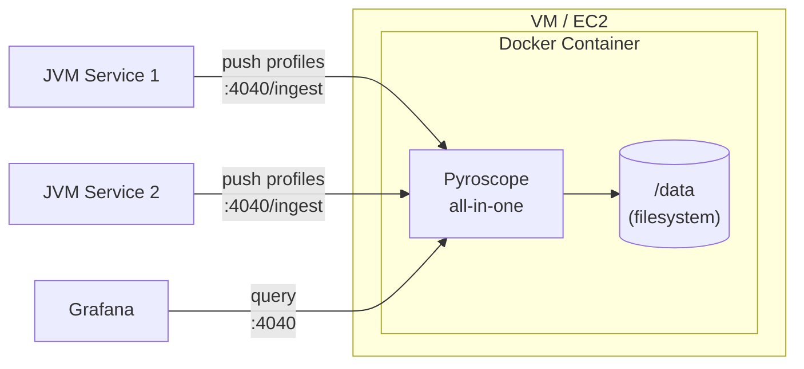

# Pyroscope Monolithic Deployment

Single-process Pyroscope server suitable for development, testing, and small-to-medium workloads. All components (ingestion, storage, querying) run inside one container with local filesystem storage.

## Architecture



## Files

| File | Purpose |
|------|---------|
| `Dockerfile` | Builds a container image from `grafana/pyroscope:latest` with baked-in config |
| `pyroscope.yaml` | Server config: filesystem storage at `/data`, port 4040 |
| `deploy.sh` | Lifecycle script (start/stop/restart/logs/status/clean) with Git and local source options |
| `deploy-test.sh` | 45 mock-based unit tests for deploy.sh (no root or Docker needed) |

## Operator Workflow

```bash
# 1. SSH to the VM
ssh operator@vm01.corp.example.com

# 2. Elevate to root
pbrun /bin/su -

# 3. Deploy from Git
bash deploy.sh start --from-git

# Or deploy from files scp'd to the VM
bash deploy.sh start --from-local /tmp/pyroscope-deploy
```

## Usage

```bash
bash deploy.sh start   [--from-git [url] | --from-local <path>]
bash deploy.sh stop
bash deploy.sh restart [--from-git [url] | --from-local <path>]
bash deploy.sh logs
bash deploy.sh status
bash deploy.sh clean
```

## Configuration

| Variable | Default | Description |
|----------|---------|-------------|
| `PYROSCOPE_PORT` | `4040` | Host port mapped to the container |
| `REPO_URL` | `git@github.com:aff0gat000/pyroscope.git` | Git repo URL for `--from-git` |
| `REPO_BRANCH` | `main` | Git branch |
| `INSTALL_DIR` | `/opt/pyroscope` | Installation directory on the VM |

## Endpoints

| Endpoint | Purpose |
|----------|---------|
| `:4040` | Pyroscope UI |
| `:4040/ingest` | SDK push endpoint |
| `:4040/ready` | Health/readiness check |

## Running Tests

```bash
bash deploy/monolithic/deploy-test.sh
```

## When to use this mode

- Local development and testing
- Single-node deployments with moderate ingestion volume
- Environments where operational simplicity is preferred over horizontal scaling

For high-availability or high-throughput workloads, see [`../microservices/`](../microservices/).
