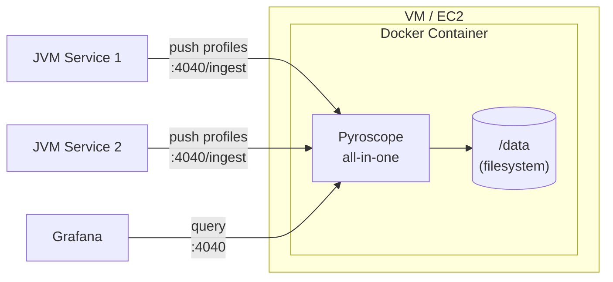

# Pyroscope Monolithic Deployment

Single-process Pyroscope server suitable for development, testing, and small-to-medium workloads. All components (ingestion, storage, querying) run inside one container with local filesystem storage.

## Architecture



## Files

| File | Purpose |
|------|---------|
| `Dockerfile` | Builds a container image from `grafana/pyroscope:latest` with baked-in config |
| `pyroscope.yaml` | Server config: filesystem storage at `/data`, port 4040 |
| `deploy.sh` | Lifecycle script (start/stop/restart/logs/status/clean) |

## Quick start

```bash
bash deploy.sh          # Build image and start container
```

Pyroscope will be available at `http://localhost:4040`.

## Usage

```bash
bash deploy.sh              # Start (default)
bash deploy.sh stop         # Stop and remove container
bash deploy.sh restart      # Restart container
bash deploy.sh logs         # Tail container logs
bash deploy.sh status       # Show container status and health
bash deploy.sh clean        # Stop container, remove image + volume
```

## Configuration

| Variable | Default | Description |
|----------|---------|-------------|
| `PYROSCOPE_PORT` | `4040` | Host port mapped to the container |

## Endpoints

| Endpoint | Purpose |
|----------|---------|
| `:4040` | Pyroscope UI |
| `:4040/ingest` | SDK push endpoint |
| `:4040/ready` | Health/readiness check |

## When to use this mode

- Local development and testing
- Single-node deployments with moderate ingestion volume
- Environments where operational simplicity is preferred over horizontal scaling

For high-availability or high-throughput workloads, see [`../microservices/`](../microservices/).
