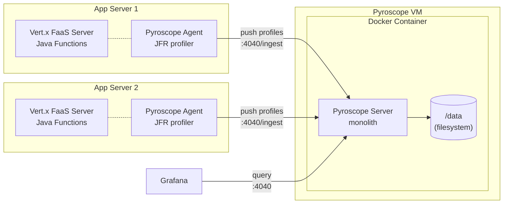

# Pyroscope Monolithic Deployment

Single-process Pyroscope server suitable for development, testing, and small-to-medium workloads. All components (ingestion, storage, querying) run inside one container with local filesystem storage.

## Architecture



The Pyroscope Java agent runs as a `-javaagent` inside each Vert.x JVM process. It continuously samples CPU, memory, lock, and wall-clock profiles using JFR and pushes them to the Pyroscope server every 10 seconds. No application code changes are required — the agent is attached at JVM startup via `JAVA_TOOL_OPTIONS`.

## Files

| File | Purpose |
|------|---------|
| `Dockerfile` | Builds a container image from `grafana/pyroscope:latest` with baked-in config |
| `pyroscope.yaml` | Server config: filesystem storage at `/data`, port 4040 |
| `deploy.sh` | Lifecycle script (start/stop/restart/logs/status/clean) with Git and local source options |
| `deploy-test.sh` | 45 mock-based unit tests for deploy.sh (no root or Docker needed) |

## Prerequisites

- **Docker** installed and running on the target VM
- **Root access** via `pbrun /bin/su -` (the script checks for root and exits with a hint if not elevated)
- **Port 4040** available (or set `PYROSCOPE_PORT` to use a different port)

---

## Step-by-Step Deployment Guide

### Step 1: Copy files to the VM (from your local machine)

Only 3 files are needed. Use `scp` to copy them from your local machine to the VM before connecting.

`scp` (secure copy) transfers files over SSH. The syntax is `scp <local-files> <user>@<host>:<remote-path>`. It runs from your workstation, not from the VM.

```bash
# Create a directory on the VM to receive the files
ssh operator@vm01.corp.example.com "mkdir -p /tmp/pyroscope-deploy"

# Copy the 3 required files from your local repo clone
scp deploy/monolithic/deploy.sh \
    deploy/monolithic/Dockerfile \
    deploy/monolithic/pyroscope.yaml \
    operator@vm01.corp.example.com:/tmp/pyroscope-deploy/
```

If `scp` is not available, you can use `sftp` or `rsync -e ssh` instead. All three transfer files over SSH the same way.

### Step 2: SSH to the VM

```bash
ssh operator@vm01.corp.example.com
```

### Step 3: Elevate to root

```bash
pbrun /bin/su -
```

### Step 4: Pre-flight checks

Run these before deploying to verify the VM is ready and there are no conflicts with existing services.

```bash
# Verify Docker is installed and running
docker info >/dev/null 2>&1 && echo "Docker OK" || echo "Docker NOT available"

# Check that port 4040 is not already in use by another service
ss -tlnp | grep :4040

# Check no container named 'pyroscope' already exists
docker ps -a --format '{{.Names}}' | grep -x pyroscope || echo "No conflict"
```

If port 4040 is in use by another service, set a different port when deploying:

```bash
PYROSCOPE_PORT=9090 bash /tmp/pyroscope-deploy/deploy.sh start --from-local /tmp/pyroscope-deploy
```

If Docker is not installed (RHEL 8):

```bash
yum install -y yum-utils
yum-config-manager --add-repo https://download.docker.com/linux/centos/docker-ce.repo
yum install -y docker-ce docker-ce-cli containerd.io
systemctl start docker && systemctl enable docker
```

### Step 5: Deploy

```bash
bash /tmp/pyroscope-deploy/deploy.sh start --from-local /tmp/pyroscope-deploy
```

The script will:

1. Verify you are root
2. Verify Docker is running
3. Copy `Dockerfile` and `pyroscope.yaml` to `/opt/pyroscope/`
4. Build the Docker image
5. Create a `pyroscope-data` volume (if it does not already exist)
6. Start the container on port 4040 (or your override)
7. Wait up to 60 seconds for the health check (`/ready` endpoint)
8. Print a connection summary with the VM IP address

### Step 6: Verify

```bash
# Quick health check
curl -s http://localhost:4040/ready && echo " OK"

# Or use the script
bash /tmp/pyroscope-deploy/deploy.sh status
```

Open `http://<VM_IP>:4040` in a browser to access the Pyroscope UI.

### Step 7: Clean up temp files (optional)

```bash
rm -rf /tmp/pyroscope-deploy
```

The installed files are now in `/opt/pyroscope/`. The temp copy is no longer needed.

If you want `deploy.sh` available on the VM for day-2 operations:

```bash
cp /tmp/pyroscope-deploy/deploy.sh /opt/pyroscope/deploy.sh
```

---

## Idempotency and Safety

The script is safe to run on a VM with existing services:

- **Only manages its own container.** It looks for a container named exactly `pyroscope` (via `grep -qx`). It will never stop, remove, or interfere with other containers.
- **Port binding is scoped.** Only binds port 4040 (or your override). If that port is taken, Docker will fail with a clear error — it will not steal the port.
- **Re-running is safe.** Running `start` again replaces the existing `pyroscope` container and rebuilds the image. The data volume is preserved.
- **No system-level changes.** No firewall rules, systemd units, cron jobs, or package installations. Only Docker API calls.

---

## Script Commands

```bash
bash deploy.sh start   [--from-git [url] | --from-local <path>]
bash deploy.sh stop
bash deploy.sh restart [--from-git [url] | --from-local <path>]
bash deploy.sh logs
bash deploy.sh status
bash deploy.sh clean
bash deploy.sh help
```

| Command | Description |
|---------|-------------|
| `start` | Build the image and start the container. If a container already exists, it is replaced. The data volume is preserved. |
| `stop` | Stop and remove the container. The data volume is preserved. |
| `restart` | Stop then start. Equivalent to running `stop` followed by `start`. |
| `logs` | Tail the container logs (Ctrl+C to stop). |
| `status` | Show whether the container is running and the health check result. |
| `clean` | Stop the container, remove the image, and delete the data volume. This deletes all stored profiling data. |
| `help` | Show usage information. |

### Source Options (for `start` and `restart`)

| Option | Description |
|--------|-------------|
| *(none)* | Use files already present in `/opt/pyroscope/` (or `INSTALL_DIR`). |
| `--from-local <path>` | Copy `Dockerfile` and `pyroscope.yaml` from a local directory to `INSTALL_DIR`, then build and start. Use this when you have scp'd the files to the VM. The path can point to the `deploy/monolithic/` subdirectory or directly to a directory containing the Dockerfile. |
| `--from-git [url]` | Clone (or pull) the repo into `INSTALL_DIR`, then build and start. If the repo is already cloned, it fetches and resets to the latest commit. An optional URL overrides the default `REPO_URL`. |

## Configuration

Override these environment variables to change defaults:

| Variable | Default | Description |
|----------|---------|-------------|
| `PYROSCOPE_PORT` | `4040` | Host port mapped to the container |
| `INSTALL_DIR` | `/opt/pyroscope` | Directory where Dockerfile and config are installed |
| `REPO_URL` | `git@github.com:aff0gat000/pyroscope.git` | Git repo URL for `--from-git` |
| `REPO_BRANCH` | `main` | Git branch for `--from-git` |

Example with overrides:

```bash
PYROSCOPE_PORT=9090 INSTALL_DIR=/srv/pyroscope bash deploy.sh start --from-local /tmp/pyroscope-deploy
```

## Endpoints

| Endpoint | Purpose |
|----------|---------|
| `:4040` | Pyroscope UI |
| `:4040/ingest` | Java agent push endpoint |
| `:4040/ready` | Health/readiness check |

## Connecting Java Agents

Once Pyroscope is running, configure the Java agent on your application servers to push profiles to this instance. Set the server address in your `pyroscope.properties` file or as an environment variable:

```properties
# pyroscope.properties
pyroscope.server.address=http://<PYROSCOPE_VM_IP>:4040
```

Or as an environment variable:

```bash
PYROSCOPE_SERVER_ADDRESS=http://<PYROSCOPE_VM_IP>:4040
```

## Day-2 Operations

```bash
# View logs
docker logs -f pyroscope

# Check status and health
bash /opt/pyroscope/deploy.sh status

# Restart with a fresh image (e.g., after Pyroscope releases a new version)
bash /opt/pyroscope/deploy.sh restart

# Stop without removing data
bash /opt/pyroscope/deploy.sh stop

# Full cleanup (removes container, image, and all profiling data)
bash /opt/pyroscope/deploy.sh clean
```

## Running Tests

The test suite uses mock binaries for docker, git, id, and hostname. No root, Docker, or network access is required.

```bash
bash deploy/monolithic/deploy-test.sh
```

## When to Use This Mode

- Single-node deployments with moderate ingestion volume
- Environments where operational simplicity is preferred over horizontal scaling
- Development and testing

For high-availability or high-throughput workloads, see [`../microservices/`](../microservices/).
