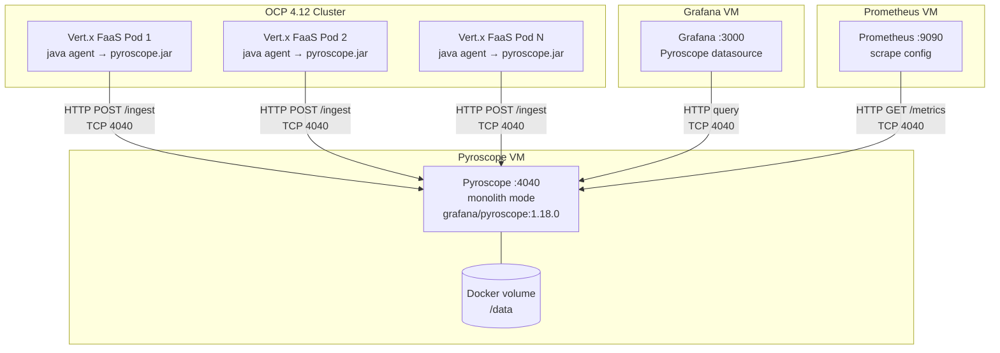

# ADR-001: Continuous Profiling with Pyroscope

## Status

Accepted

## Date

2026-02-23

## Context

We need continuous profiling for Java services (Vert.x FaaS) running on OpenShift
Container Platform (OCP) 4.12. The profiling platform must:

- Collect CPU, allocation, lock, and wall-clock profiles from JVM applications on OCP
- Use the Pyroscope Java agent (JFR-based) attached via `JAVA_TOOL_OPTIONS` — no code changes
- Store profiling data on infrastructure we control (no SaaS, no data leaving the network)
- Integrate with existing Grafana (separate VM) for visualization and flame graph rendering
- Integrate with existing Prometheus (separate VM) for Pyroscope server health metrics
- Operate within enterprise change management controls (approval cycles, firewall requests)
- Start with minimal infrastructure and scale later if needed
- Cost $0 in software licensing

The Java agent is embedded in the OCP pod container images. It samples every 10ms using
JFR, aggregates locally, and pushes compressed profiles to the Pyroscope server via HTTP
POST every 10 seconds. Agent overhead is 3-8% CPU and 20-40 MB memory per pod.

We evaluated three deployment options for the Pyroscope server:

### Option A — Monolith on VM (Docker container)

Single Pyroscope process on a dedicated VM. All components (ingester, querier, compactor)
run in one process. Data stored on local Docker volume.

- **Pros:** Simplest to deploy and operate. Single container, single config file. No shared
  storage, no memberlist gossip, no inter-component networking. Fits within existing VM
  provisioning process. Can be deployed in 1-2 hours once the VM is ready.
- **Cons:** Vertical scaling only. Single point of failure. Capacity ceiling of ~100
  profiled services before performance degrades.

### Option B — Microservices on OCP

7 Pyroscope components deployed as separate pods on the existing OCP cluster using the
Helm chart.

- **Pros:** Horizontal scaling, HA (pod rescheduling), managed by OCP team. Supports
  100+ services.
- **Cons:** Requires RWX storage class (NFS provisioner). Needs OCP team to provision
  namespace, storage, and network policies. More complex to configure and troubleshoot.
  Adds 7+ pods to a shared cluster. Overkill for initial rollout with < 20 services.

### Option C — Microservices on VM (Docker Compose)

7 Pyroscope containers on a VM using Docker Compose with NFS-mounted shared storage.

- **Pros:** Horizontal scaling without OCP dependency.
- **Cons:** No pod rescheduling (VM goes down = everything goes down). Requires NFS
  setup on the VM. Docker Compose has no built-in health checks, rolling upgrades, or
  resource limits equivalent to OCP. Worst of both worlds — complexity of microservices
  without the benefits of orchestration.

## Network Topology (Phase 1)

### Firewall rules required

| Source | Destination | Port | Protocol | Purpose |
|--------|-------------|:----:|----------|---------|
| OCP worker nodes | Pyroscope VM | 4040 | TCP/HTTP | Agent profile push |
| Grafana VM | Pyroscope VM | 4040 | TCP/HTTP | Datasource queries |
| Prometheus VM | Pyroscope VM | 4040 | TCP/HTTP | Metrics scrape |
| Admin workstation | Pyroscope VM | 4040 | TCP/HTTP | UI access |

> Single port (TCP 4040) for all traffic. Pyroscope never initiates outbound connections.

## Decision

Deploy Pyroscope in **monolith mode on a VM** (Option A) for Phase 1.

## Rationale

1. **Simplest path to value.** A monolith can be deployed in hours, not weeks. We prove
   the concept with real production profiling data before investing in microservices
   infrastructure.

2. **Sufficient capacity.** We are starting with < 20 Java services. Monolith mode
   supports ~100 services. We have significant headroom before scaling becomes a concern.

3. **Minimal approvals.** A single VM provisioning request and one firewall rule
   (OCP → VM port 4040) is all that's needed. No OCP namespace, no storage class
   provisioning, no NFS setup.

4. **Reversible.** Migration from monolith to microservices is server-side only — the
   Java agents do not change. The agent pushes to a URL; we change what's behind that URL.

5. **Risk reduction.** If the POC fails or is deprioritized, we decommission one VM.
   No cluster resources to clean up, no shared storage to reclaim.

## Consequences

- **Single point of failure.** If the VM or container goes down, profiling data is not
  collected until it recovers. Applications are unaffected (agent silently drops data).
- **Vertical scaling only.** If we exceed ~100 services, we must migrate to microservices
  mode. This is documented in the Phase 2 plan.
- **No HA.** Planned maintenance on the VM means a brief profiling gap. Acceptable for
  a non-critical observability tool.
- **Phase 2 migration path.** When capacity or HA requirements justify it, we will deploy
  microservices mode on the existing OCP cluster (not VM Docker Compose). This is
  documented in [ADR-002](ADR-002-microservices-on-ocp.md) (future).

## References

- [architecture.md](../architecture.md) — monolith vs microservices comparison, topology diagrams
- [deployment-guide.md § Tree 7](../deployment-guide.md) — hybrid VM + OCP topology
- [project-plan-phase1.md](../project-plan-phase1.md) — Phase 1 scope, timeline, effort estimates
- [what-is-pyroscope.md § Deployment phases](../what-is-pyroscope.md) — Phase 1 → Phase 2 progression
