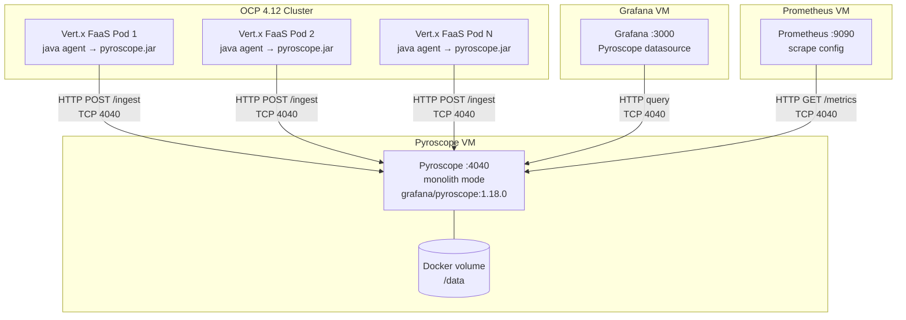

# ADR-001: Continuous Profiling with Pyroscope

## Status

Proposed

## Date

2026-02-23

---

## 1. Initiative Description

Deploy a continuous profiling platform for Java services (Vert.x FaaS) running on
OpenShift Container Platform (OCP) 4.12. The platform will use Grafana Pyroscope
(open source, AGPL-3.0) to collect function-level performance data from JVM applications
in production, enabling engineers to identify CPU hotspots, memory allocation issues,
and lock contention without code changes or ad-hoc debugging sessions.

The initiative is phased:

| Phase | Scope | Infrastructure |
|-------|-------|---------------|
| **Phase 1a** | Single Pyroscope monolith on VM, Java agent on OCP pods, 3 BOR + 1 SOR analysis functions | 1 VM (local filesystem storage), existing OCP cluster |
| **Phase 1b** | Multi-instance monolith for HA, shared object storage, F5 VIP load balancing | 2-4 VMs + S3-compatible object storage (MinIO or cloud) + F5 LB |
| **Phase 2** | PostgreSQL-backed SORs, v2 BOR functions, microservices mode on OCP | + PostgreSQL instance, OCP namespace |

---

## 2. Business Case and Expected Outcomes

### Problem

When a performance incident occurs, engineers currently:
1. Receive an alert from Prometheus (high CPU, high latency)
2. SSH into the pod or connect a profiler manually
3. Attempt to reproduce the issue under load
4. Analyze a heap dump or thread dump after the fact

This process takes **30-90 minutes** per incident and often fails because the conditions
that caused the issue are no longer present by the time the profiler is attached.

### Expected outcomes

| Outcome | Metric | Target |
|---------|--------|--------|
| Reduce incident root-cause identification time | MTTR for performance incidents | 30-90 min → 5-15 min (70-85% reduction) |
| Eliminate manual profiler attachment | % of incidents requiring ad-hoc profiling | 100% → 0% |
| Catch regressions before production impact | Deployment comparison (diff report) | Available for every deploy |
| Identify fleet-wide optimization targets | Fleet search across all services | On-demand, < 10 seconds |
| Zero software licensing cost | Annual profiling tool spend | $0 (vs $9,000-21,000/year for commercial APM at 50 hosts) |

### Return on investment

| Category | Phase 1a (single monolith) | Phase 1b (HA with object storage) |
|----------|:-------------------------:|:---------------------------------:|
| Engineering effort | 7-10 weeks FTE | +1-2 weeks incremental |
| Infrastructure | 1 VM (4 CPU, 8 GB RAM, 250 GB) | 2-4 VMs + S3-compatible object storage (MinIO or cloud) |
| Object storage | Not required | MinIO: ~$3,000 one-time + ~$1,000/year; Cloud S3: ~$150-300/year |
| Software licensing | $0 | $0 |
| Ongoing maintenance | < 2 hours/month | < 4 hours/month |
| Annual infrastructure cost | ~$5,900 | ~$10,450-11,300 |
| 3-year TCO (50 hosts) | ~$42,700 | ~$36,350-41,900 |
| 3-year savings vs commercial APM | $24,300-90,300 | $25,100-96,650 |

Annual returns from MTTR reduction, avoided redeployments, infrastructure right-sizing,
and prevented outages total **$19,800-39,800/year** — a **2-7x ROI** against infrastructure
costs. Full calculations in [what-is-pyroscope.md § 5](../what-is-pyroscope.md).

---

## 3. Technical Specifications

### Pyroscope server

| Specification | Value |
|--------------|-------|
| Software | Grafana Pyroscope 1.18.0 |
| License | AGPL-3.0 (free for internal deployment) |
| Deployment mode | Monolith (single process) |
| Host | Dedicated VM (RHEL 8/9, Docker) |
| Resources | 2 CPU, 4 GB RAM, 100 GB disk |
| Port | TCP 4040 (HTTP API, UI, agent ingestion) |
| Storage | Docker named volume at `/data`, 30-day retention (`compactor.blocks_retention_period`) |
| Capacity | Up to ~100 profiled services |

### Phase 1b scale-up (multi-instance monolith)

| Specification | Value |
|--------------|-------|
| Deployment mode | 2-4 monolith instances behind F5 VIP |
| Storage backend | S3-compatible object storage (MinIO on-premise, AWS S3, GCS, or Azure Blob) |
| Load balancer | F5 VIP with `/ready` health check |
| HA | Active-active — any instance can ingest and query |
| Migration from 1a | Server-side only — agents change URL from VM IP to VIP FQDN |

### Java agent

| Specification | Value |
|--------------|-------|
| Agent | Pyroscope Java agent v0.14.0 (`pyroscope.jar`) |
| Profiling engine | JDK Flight Recorder (JFR), built into JDK 11+ |
| Attachment method | `JAVA_TOOL_OPTIONS=-javaagent:/opt/pyroscope/pyroscope.jar` |
| Code changes | None |
| Sampling interval | 10ms |
| Push interval | Every 10 seconds |
| Profile types | CPU, allocation, lock (mutex), wall clock |
| Overhead | 3-8% CPU, 20-40 MB memory per pod |
| Network | Outbound HTTP POST to Pyroscope server only, no listening ports |

### Integration

| System | Integration | Purpose |
|--------|------------|---------|
| Grafana (existing, separate VM) | Pyroscope datasource | Flame graph visualization in existing dashboards |
| Prometheus (existing, separate VM) | Scrape target | Pyroscope server health metrics |
| OCP 4.12 (existing) | Java agent in pod images | Profile collection from Vert.x FaaS services |

### Network topology

### Firewall rules required

| Source | Destination | Port | Protocol | Purpose |
|--------|-------------|:----:|----------|---------|
| OCP worker nodes | Pyroscope VM | 4040 | TCP/HTTP | Agent profile push |
| Grafana VM | Pyroscope VM | 4040 | TCP/HTTP | Datasource queries |
| Prometheus VM | Pyroscope VM | 4040 | TCP/HTTP | Metrics scrape |
| Admin workstation | Pyroscope VM | 4040 | TCP/HTTP | UI access |

> Single port (TCP 4040) for all traffic. Pyroscope never initiates outbound connections.

---

## 4. Architecture Decision Record

### 4a. Context and problem statement

**Problem:** We lack function-level performance visibility in production. Current
observability (Prometheus metrics, application logs) tells us *that* something is slow
but not *why* at the code level. When incidents occur, engineers cannot identify root
causes without reproducing the issue and manually attaching a profiler — a process that
is slow, disruptive, and often fails because conditions have changed.

**Scope:** This decision covers the deployment architecture for a continuous profiling
platform serving Java services on OCP 4.12 in an enterprise environment with change
management controls, shared VM infrastructure, and existing Grafana/Prometheus instances.

### 4b. Decision drivers

| # | Driver | Weight | Measurement |
|---|--------|:------:|-------------|
| D1 | Time to production value | High | Calendar weeks from approval to first production flame graph |
| D2 | Operational complexity | High | Number of components to deploy, configure, and monitor |
| D3 | Infrastructure requirements | High | Number of approval requests (VMs, firewall rules, OCP namespaces, storage classes) |
| D4 | Software licensing cost | High | Annual cost at current scale (< 20 services) and projected scale (50+ services) |
| D5 | Data sovereignty | High | All profiling data must stay on-premise, no SaaS dependency |
| D6 | Agent overhead on production pods | Medium | CPU and memory impact on existing OCP workloads |
| D7 | Scalability ceiling | Medium | Maximum number of profiled services before architectural change required |
| D8 | High availability | Low | Acceptable to have profiling gaps during maintenance (non-critical observability tool) |

### 4c. Options considered

#### Option 1 — Pyroscope monolith on VM (selected)

Single Pyroscope process on a dedicated VM. Java agent on OCP pods pushes profiles
over HTTP.

| Driver | Assessment |
|--------|-----------|
| D1 Time to value | 1-2 hours deploy time once VM is provisioned |
| D2 Complexity | Single container, single config file |
| D3 Infrastructure | 1 VM request + 1 firewall rule |
| D4 Cost | $0 licensing |
| D5 Data sovereignty | All data on-premise in Docker volume |
| D6 Agent overhead | 3-8% CPU, 20-40 MB memory (JFR-based, bounded) |
| D7 Scalability | ~100 services before migration needed |
| D8 HA | No — single point of failure (acceptable) |

#### Option 2 — Pyroscope microservices on OCP

7 Pyroscope components deployed as pods on the existing OCP cluster.

| Driver | Assessment |
|--------|-----------|
| D1 Time to value | 2-4 weeks (OCP namespace, storage class, network policies) |
| D2 Complexity | 7+ pods, memberlist gossip, shared storage |
| D3 Infrastructure | OCP namespace + RWX storage class + NetworkPolicy |
| D4 Cost | $0 licensing |
| D5 Data sovereignty | All data on-premise in RWX PVC |
| D6 Agent overhead | Same agent — 3-8% CPU, 20-40 MB memory |
| D7 Scalability | 100+ services, horizontal scaling |
| D8 HA | Yes — pod rescheduling, replication |

#### Option 3 — Pyroscope microservices on VM (Docker Compose)

7 Pyroscope containers on a VM using Docker Compose with S3-compatible object storage.

| Driver | Assessment |
|--------|-----------|
| D1 Time to value | 1-2 weeks (VM + object storage setup) |
| D2 Complexity | 7 containers, object storage config, Docker Compose |
| D3 Infrastructure | 1 VM request + S3-compatible storage (MinIO or cloud) + firewall rules |
| D4 Cost | $0 licensing + object storage costs |
| D5 Data sovereignty | All data on-premise (MinIO) or in cloud S3 |
| D6 Agent overhead | Same agent — 3-8% CPU, 20-40 MB memory |
| D7 Scalability | 100+ services |
| D8 HA | No — VM failure takes everything down |

#### Option 4 — Datadog Continuous Profiler

Commercial SaaS profiling integrated into the Datadog APM platform.

| Driver | Assessment |
|--------|-----------|
| D1 Time to value | 1-2 days (agent install, SaaS backend managed by vendor) |
| D2 Complexity | Low — vendor manages the backend |
| D3 Infrastructure | None — SaaS |
| D4 Cost | $12-36/host/month. At 50 hosts: $7,200-21,600/year |
| D5 Data sovereignty | **Fails** — profiling data sent to Datadog SaaS (US/EU data centers) |
| D6 Agent overhead | 2-5% CPU (comparable to Pyroscope) |
| D7 Scalability | Unlimited (vendor-managed) |
| D8 HA | Yes — vendor-managed |

#### Option 5 — Dynatrace OneAgent

Commercial APM with profiling capabilities (code-level insights).

| Driver | Assessment |
|--------|-----------|
| D1 Time to value | 1-2 days (OneAgent install) |
| D2 Complexity | Low — vendor manages the backend |
| D3 Infrastructure | Dynatrace ActiveGate on-premise (optional) |
| D4 Cost | $15-40/host/month. At 50 hosts: $9,000-24,000/year |
| D5 Data sovereignty | **Partial** — Managed deployment available, but most customers use SaaS |
| D6 Agent overhead | 2-5% CPU |
| D7 Scalability | Unlimited (vendor-managed) |
| D8 HA | Yes — vendor-managed |

#### Option 6 — OpenTelemetry Profiling (emerging)

OTel profiling signal (currently in development/experimental status).

| Driver | Assessment |
|--------|-----------|
| D1 Time to value | **Not production-ready** — profiling signal is experimental (2026) |
| D2 Complexity | Collector + backend (Pyroscope or other) still needed |
| D3 Infrastructure | Same as whichever backend is chosen |
| D4 Cost | $0 (open source) |
| D5 Data sovereignty | Depends on backend choice |
| D6 Agent overhead | TBD — not yet benchmarked in production |
| D7 Scalability | Depends on backend choice |
| D8 HA | Depends on backend choice |

> **Note on OpenTelemetry:** OTel is the standard for metrics, traces, and logs. The
> profiling signal is being developed but is not GA as of 2026. When it matures, Pyroscope
> supports OTel ingestion — migration path is to swap the agent, not the backend.

### 4d. Decision outcome

Deploy **Pyroscope in monolith mode on a VM** (Option 1) with the Java agent on OCP pods.
Start with Phase 1a (single monolith, local filesystem), scale to Phase 1b (multi-instance
monolith with S3-compatible object storage and F5 VIP) when HA is required.

**Reasoning:**

1. **Simplest path to value.** A monolith can be deployed in hours, not weeks. We prove
   the concept with real production profiling data before investing in HA or microservices
   infrastructure.

2. **Sufficient capacity.** We are starting with < 20 Java services. Monolith mode
   supports ~100 services. We have significant headroom before scaling becomes a concern.

3. **Minimal approvals.** A single VM provisioning request and one firewall rule
   (OCP → VM port 4040) is all that's needed. No OCP namespace, no storage class
   provisioning, no object storage setup for Phase 1a.

4. **Data sovereignty.** All profiling data stays on-premise. Options 4 and 5 (Datadog,
   Dynatrace) fail the data sovereignty requirement or require expensive managed
   deployment options.

5. **Zero licensing cost.** Options 4 and 5 cost $7,200-24,000/year at current scale.
   Pyroscope is free.

6. **Incremental HA path.** Phase 1b adds 2-4 monolith instances behind an F5 VIP with
   shared object storage (MinIO or cloud S3). Agents only change the target URL from
   VM IP to VIP FQDN — no code or agent config changes beyond the URL.

7. **Reversible.** Migration from monolith to microservices (Phase 2) is server-side
   only — the Java agents do not change. The agent pushes to a URL; we change what's
   behind that URL.

8. **OTel future-proof.** When OpenTelemetry profiling matures, Pyroscope supports OTel
   ingestion natively. We swap the agent, not the backend.

**Options rejected:**
- **Option 2 (microservices on OCP):** Overkill for < 20 services. Reserved for Phase 2.
- **Option 3 (microservices on VM):** Complexity of microservices without orchestration benefits. Phase 1b (multi-instance monolith) provides HA without microservices complexity.
- **Option 4 (Datadog):** Fails data sovereignty. Annual cost unjustified for POC.
- **Option 5 (Dynatrace):** Fails data sovereignty (SaaS default). Annual cost unjustified.
- **Option 6 (OpenTelemetry):** Not production-ready. Pyroscope is the future backend for OTel profiling.

### 4e. Consequences

**Positive:**
- Production flame graphs available within days of deployment
- Engineers can diagnose performance issues without reproducing them
- Zero impact on application code — agent-only deployment
- No recurring licensing cost
- All data stays on-premise

**Negative:**
- Single point of failure — if the VM/container goes down, profiling data is not collected
  (applications are unaffected; agent silently drops data)
- Vertical scaling only — capacity ceiling of ~100 services before migration required
- No HA — planned maintenance on the VM means a brief profiling gap
- Team must build operational expertise for Pyroscope (no vendor support)

### 4f. Technical debt

| Debt item | Severity | Mitigation | When to address |
|-----------|:--------:|------------|-----------------|
| Monolith mode limits horizontal scaling | Low | Sufficient for < 100 services. Migration to microservices on OCP is server-side only (agents unchanged). | Phase 2, when ingestion exceeds single-node capacity |
| No HA / disaster recovery | Low | Pyroscope is a non-critical observability tool. Profiling gaps during outages are acceptable. Persistent Docker volume survives container restarts. | Phase 2, if profiling becomes a critical-path dependency |
| No FIPS-compliant build | Low | Pyroscope supports `GOEXPERIMENT=boringcrypto` and Red Hat Go Toolset builds. TLS termination at load balancer also satisfies FIPS. | When FIPS certification is required by compliance team |
| Manual container management (no orchestrator) | Low | systemd unit or Docker restart policy handles auto-restart. Single container is simple to manage. | Phase 2, when moving to OCP microservices |
| 30-day data retention (configurable) | Low | Set via `compactor.blocks_retention_period`. 100 GB disk supports ~20 services at 1-5 GB/service/month. | Increase disk or enable object storage when retention requirements grow |

---

## References

- [architecture.md](../architecture.md) — monolith vs microservices comparison, topology diagrams
- [deployment-guide.md § Tree 7](../deployment-guide.md) — hybrid VM + OCP topology, step-by-step
- [project-plan-phase1.md](../project-plan-phase1.md) — Phase 1 scope, timeline, effort estimates
- [what-is-pyroscope.md](../what-is-pyroscope.md) — business case, cost analysis, deployment phases
- [faq.md](../faq.md) — security, overhead, licensing, operations FAQ
- [function-reference.md](../function-reference.md) — BOR/SOR analysis function API reference
