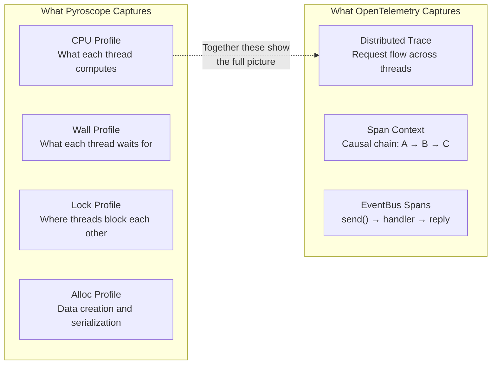
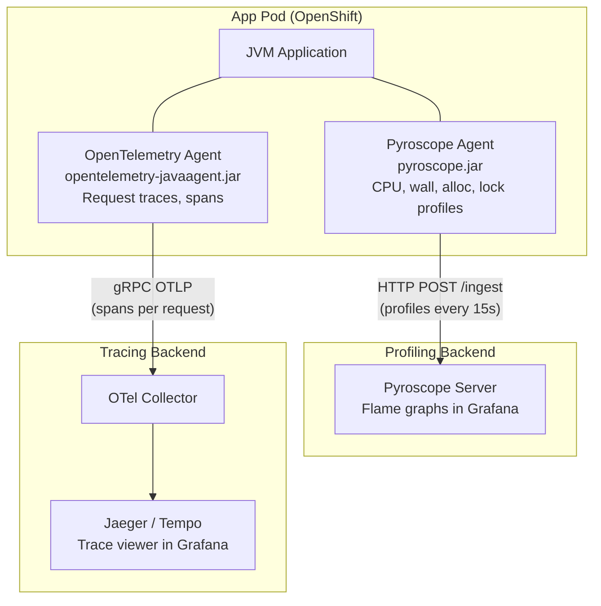

# Pyroscope Java Agent Configuration Reference

Complete reference for the Pyroscope Java agent configuration, tuned for Vert.x
servers with thousands of deployed functions/verticles. Covers all profile types,
thread context visibility, Vert.x-specific edge cases, and OpenTelemetry integration
for full cross-thread request tracing.

Target audience: platform engineers, application developers, performance engineers.

---

## Table of Contents

- [1. Profile Types](#1-profile-types)
- [2. Thread Context and Cross-Thread Visibility](#2-thread-context-and-cross-thread-visibility)
- [3. Configuration Properties Reference](#3-configuration-properties-reference)
- [4. Vert.x Edge Cases and Use Cases](#4-vertx-edge-cases-and-use-cases)
- [5. OpenTelemetry Integration](#5-opentelemetry-integration)
- [6. Tuning for Scale](#6-tuning-for-scale)

---

## 1. Profile Types

The agent captures four profile types simultaneously. Each reveals a different
dimension of application behavior. All four are enabled by default in
`config/pyroscope/pyroscope.properties`.

### 1a. CPU (itimer) — "Where is CPU time spent?"

```
Grafana → Profile type: cpu
```

Flame graphs showing which functions consume the most CPU cycles per thread.

| Setting | Value | Meaning |
|---------|-------|---------|
| `pyroscope.profiler.event` | `itimer` | Use interval timer (not perf_events) |
| `pyroscope.profiler.interval` | `10ms` | Sample every 10ms = ~100 samples/sec |

**What to look for:**
- Wide bars on `vert.x-eventloop-*` threads = event-loop doing too much CPU work
- Hot paths in JSON parsing, regex, crypto, or serialization
- Framework overhead (codec, router, handler chain)

**Overhead:** ~2% CPU (constant, does not scale with request volume)

---

### 1b. Wall-clock — "Where do threads spend time waiting?"

```
Grafana → Profile type: wall
```

Flame graphs showing total elapsed time — both executing and waiting. This is the
key to understanding cross-thread communication patterns.

| Setting | Value | Meaning |
|---------|-------|---------|
| `pyroscope.profiler.wall` | `20ms` | Sample all threads every 20ms including sleeping/waiting |

**What to look for:**
- Event-loop threads waiting on `EventBus.request()` replies
- Worker threads waiting on I/O (database, HTTP client, file system)
- Threads blocked on `Future.await()` or `Promise` completion
- Worker pool queue backpressure (`executeBlocking` wait time)

**How it differs from CPU:** CPU profiling only captures running code. A thread
waiting for an EventBus reply shows as idle in CPU profiles but shows the full
wait duration in wall-clock profiles. This reveals the "hidden" time between
thread hand-offs.

**Overhead:** ~1-2% CPU additional

---

### 1c. Allocation — "What creates GC pressure?"

```
Grafana → Profile type: alloc_in_new_tlab_objects or alloc_in_new_tlab_bytes
```

Flame graphs showing which functions allocate the most heap memory.

| Setting | Value | Meaning |
|---------|-------|---------|
| `pyroscope.profiler.alloc` | `256k` | Sample allocations >= 256 KB; probabilistic sampling below |

**What to look for:**
- EventBus message serialization (codec `encodeToWire` / `decodeFromWire`)
- JSON parsing creating JsonObject/JsonArray per request
- HTTP response buffer allocation (Netty ByteBuf wrappers)
- Lambda captures and CompositeFuture wrappers in async chains

**Cross-thread relevance:** EventBus messages are serialized by the sender
thread and deserialized by the receiver thread. Both sides show up as allocation
hotspots — high allocation on either side means the codec is inefficient or
messages are too large.

**Overhead:** ~0.5-1% CPU

---

### 1d. Lock contention — "Where do threads block each other?"

```
Grafana → Profile type: lock_count or lock_duration
```

Flame graphs showing where threads wait for locks held by other threads. This is
the most direct view of thread-to-thread interaction.

| Setting | Value | Meaning |
|---------|-------|---------|
| `pyroscope.profiler.lock` | `10ms` | Capture lock waits >= 10ms |

**What to look for:**
- Lock waits on `vert.x-eventloop-*` threads = **event-loop blocking** (critical)
- `executeBlocking` queue contention = worker pool saturated
- `ConcurrentHashMap` or synchronized cache contention between verticles
- ClassLoader locks during mass verticle deployment/undeployment

**Overhead:** < 0.5% CPU

---

## 2. Thread Context and Cross-Thread Visibility

### What profiling CAN show about thread communication



### Technique: Reconstructing thread communication from profiles

You cannot see a single "request trace" across threads in Pyroscope. But you can
reconstruct communication patterns by correlating four profile types:

**Step 1: Identify the hand-off point**

Open the **wall-clock** profile in Grafana. Filter to `vert.x-eventloop-*` threads.
Look for tall stacks ending in `EventBus.request()` or `Future.await()` — these
are event-loop threads waiting for responses from other threads.

**Step 2: Find the receiver**

Switch the thread filter to `vert.x-worker-*`. In the same time window, look for
stacks containing the handler or function that processes the message. The **CPU**
profile shows what the worker thread actually computes.

**Step 3: Check for contention**

Open the **lock contention** profile. If you see lock waits on event-loop threads
with the same lock object class that appears in worker threads, you've found a
direct thread interaction point — both threads are contending on shared state.

**Step 4: Trace the data path**

Open the **allocation** profile. Filter by event-loop threads — look for
`encodeToWire()` calls (message serialization). Filter by worker threads — look
for `decodeFromWire()` calls (deserialization). The codec classes and allocation
sizes tell you what data is being passed between threads.

### What profiling CANNOT show

| Gap | Why | Solution |
|-----|-----|----------|
| Causal request chain across threads | Profiling samples threads independently; no request ID links them | OpenTelemetry traces with context propagation |
| EventBus message routing | Profiler sees the send() and handler() but doesn't link them as cause-effect | OpenTelemetry Vert.x instrumentation |
| End-to-end latency breakdown per request | Profiling is statistical (aggregated); not per-request | OpenTelemetry spans with timing |
| Which specific verticle instance handled which message | Profiling aggregates by function name, not instance | OpenTelemetry span attributes |

> **Recommendation:** Use Pyroscope for "where is time/CPU/memory going?" and
> OpenTelemetry for "what is the request flow?". See [Section 5](#5-opentelemetry-integration)
> for how to run both together.

---

## 3. Configuration Properties Reference

Complete reference for all properties in `config/pyroscope/pyroscope.properties`.

| Property | Default | Our value | Description |
|----------|---------|-----------|-------------|
| `pyroscope.server.address` | — | `http://pyroscope:4040` | Pyroscope server URL. For VM monolith with Nginx TLS: `https://pyroscope.company.com` |
| `pyroscope.format` | `jfr` | `jfr` | Profile format. JFR enables all profile types simultaneously |
| `pyroscope.profiler.event` | `itimer` | `itimer` | CPU sampling event. Options: `itimer` (recommended), `cpu` (perf_events), `wall` (wall-clock only) |
| `pyroscope.profiler.interval` | `10ms` | `10ms` | CPU sample interval. Lower = more detail but more overhead |
| `pyroscope.profiler.wall` | — | `20ms` | Wall-clock sample interval. Captures waiting time, not just CPU |
| `pyroscope.profiler.alloc` | — | `256k` | Allocation sampling threshold. Lower = more detail, more overhead |
| `pyroscope.profiler.lock` | — | `10ms` | Lock contention threshold. Captures lock waits >= this duration |
| `pyroscope.profiler.include` | — | `vert.x-eventloop-*\|vert.x-worker-*\|vert.x-internal-blocking-*` | Thread name filter (include patterns) |
| `pyroscope.profiler.exclude` | — | (not set) | Thread name filter (exclude patterns). Applied after include |
| `pyroscope.upload.interval` | `10s` | `15s` | How often profiles are pushed to the server |
| `pyroscope.labels` | — | `env=production` | Static labels added to all profiles. Keep cardinality low |
| `pyroscope.log.level` | `info` | `warn` | Agent log level. Use `debug` only for troubleshooting |

### Per-service overrides (environment variables)

These are set per pod/container in docker-compose.yaml or pod spec:

| Environment variable | Example | Purpose |
|---------------------|---------|---------|
| `PYROSCOPE_APPLICATION_NAME` | `bank-api-gateway` | Service name in Grafana. Each service gets its own flame graphs |
| `PYROSCOPE_LABELS` | `env=production,service=api-gateway` | Additional labels for filtering in Grafana |
| `PYROSCOPE_CONFIGURATION_FILE` | `/opt/pyroscope/pyroscope.properties` | Path to the shared config file |
| `PYROSCOPE_SERVER_ADDRESS` | `https://pyroscope.company.com` | Overrides server address (useful for per-env config) |

---

## 4. Vert.x Edge Cases and Use Cases

### 4a. Event-loop blocking detection

**The problem:** Vert.x golden rule — never block the event loop. But with
thousands of functions, blocking calls can hide in deep call chains.

**How profiling catches it:**
- **CPU profile:** Event-loop thread with unexpectedly wide bars (spending too
  much CPU time in a single handler)
- **Lock profile:** Any lock contention on `vert.x-eventloop-*` threads is a
  red flag. Event loops should never wait for locks.
- **Wall profile:** Event-loop thread showing long wall-clock time in a single
  frame (handler taking seconds instead of milliseconds)

**What to look for in Grafana:**
```
Profile type: lock_duration
Thread filter: vert.x-eventloop-*
→ Any results at all indicate event-loop blocking
```

---

### 4b. Worker pool exhaustion

**The problem:** `executeBlocking()` calls queue onto the worker pool. If all
worker threads are busy, new requests queue and event-loop handlers stall waiting
for `Future` completion.

**How profiling catches it:**
- **Wall profile on event-loop threads:** Long waits on `executeBlocking` return
  futures mean the worker pool can't keep up
- **CPU profile on worker threads:** Shows what the workers are actually doing
  (slow database calls? CPU-heavy computation?)
- **Lock profile:** Contention on the worker pool's internal task queue

---

### 4c. EventBus serialization overhead

**The problem:** Every EventBus message is serialized (even within the same JVM
in non-clustered mode). With thousands of verticles exchanging messages, codec
overhead can become significant.

**How profiling catches it:**
- **Allocation profile:** High allocation in `MessageCodec.encodeToWire()` or
  `decodeFromWire()` means large or frequent messages
- **CPU profile:** Time spent in JSON serialization (`JsonObject.encode()`,
  Jackson, Gson) on event-loop threads

**Fix:** Use `LocalMap` or shared data for same-JVM communication; reduce message
sizes; use efficient codecs (protobuf instead of JSON).

---

### 4d. ClassLoader contention during mass deployment

**The problem:** Deploying or undeploying hundreds of verticles simultaneously
causes ClassLoader lock contention. The JVM's `ClassLoader.loadClass()` is
synchronized.

**How profiling catches it:**
- **Lock profile:** Contention on `java.lang.ClassLoader` locks, with stack
  traces showing `Deployment.deploy()` or `VerticleFactory.createVerticle()`
- **Wall profile on `vert.x-internal-blocking-*`:** Long waits during deployment

**Fix:** Deploy verticles in batches; pre-warm classes; use a custom ClassLoader
that avoids the synchronized bottleneck.

---

### 4e. CompositeFuture and async chain overhead

**The problem:** Deep `Future.compose()` / `Future.flatMap()` chains with many
steps create lambda objects and stack frames that consume memory and CPU.

**How profiling catches it:**
- **Allocation profile:** High allocation in `ContextInternal` and `FutureImpl`
- **CPU profile:** Deep frames in `FutureImpl.onComplete()` chains

---

### 4f. Timer/periodic overhead at scale

**The problem:** Thousands of verticles each setting `vertx.setPeriodic()` timers
creates scheduling overhead on event-loop threads.

**How profiling catches it:**
- **CPU profile on event-loop:** Time in Netty's `HashedWheelTimer` or Vert.x
  timer management becomes visible as a hot frame
- **Wall profile:** Event-loop spending time processing timer callbacks instead
  of handling I/O

---

### 4g. Vert.x clustering (Hazelcast/Infinispan)

**The problem:** If Vert.x clustering is enabled, Hazelcast or Infinispan threads
participate in distributed EventBus communication. These threads are not profiled
by default.

**Fix:** Add cluster threads to the include filter:
```properties
# Hazelcast clustering
pyroscope.profiler.include=vert.x-eventloop-*|vert.x-worker-*|vert.x-internal-blocking-*|hz.*

# Infinispan clustering
pyroscope.profiler.include=vert.x-eventloop-*|vert.x-worker-*|vert.x-internal-blocking-*|jgroups-*
```

---

### 4h. Connection pool contention

**The problem:** Database or HTTP client connection pools shared across verticles
cause contention when the pool is exhausted.

**How profiling catches it:**
- **Lock profile:** Contention on connection pool internals (HikariCP, Vert.x
  SQL client pool, Vert.x HTTP client pool)
- **Wall profile on worker threads:** Long waits for connection acquisition

---

## 5. OpenTelemetry Integration

Pyroscope shows **where** time is spent. OpenTelemetry shows **how requests flow**.
Running both together gives you complete observability: flame graphs for depth,
traces for breadth.

### Architecture with both agents



### How to attach both agents

Both agents run simultaneously in the same JVM. They do not conflict — Pyroscope
uses JFR/async-profiler (timer-based sampling) while OpenTelemetry uses bytecode
instrumentation (method enter/exit hooks).

```yaml
# Pod spec or docker-compose environment
env:
  - name: JAVA_TOOL_OPTIONS
    value: >-
      -javaagent:/opt/pyroscope/pyroscope.jar
      -javaagent:/opt/opentelemetry/opentelemetry-javaagent.jar
  - name: PYROSCOPE_APPLICATION_NAME
    value: "my-service"
  - name: PYROSCOPE_CONFIGURATION_FILE
    value: "/opt/pyroscope/pyroscope.properties"
  - name: OTEL_SERVICE_NAME
    value: "my-service"
  - name: OTEL_EXPORTER_OTLP_ENDPOINT
    value: "http://otel-collector.monitoring.svc:4317"
  - name: OTEL_TRACES_EXPORTER
    value: "otlp"
  - name: OTEL_METRICS_EXPORTER
    value: "none"
  - name: OTEL_LOGS_EXPORTER
    value: "none"
```

### What OpenTelemetry adds for Vert.x

The OpenTelemetry Java agent auto-instruments Vert.x with zero code changes:

| Instrumented component | What it captures | Pyroscope equivalent |
|----------------------|-----------------|---------------------|
| **Vert.x HTTP Server** | Span per incoming HTTP request (method, path, status, latency) | CPU/wall profile aggregated across all requests |
| **Vert.x HTTP Client** | Span per outgoing HTTP call (URL, status, latency) | Wall profile shows wait time but not per-request |
| **Vert.x EventBus** | Span per `send()` / `request()` with message address | Lock/wall profile shows contention but not per-message |
| **Vert.x SQL Client** | Span per database query (statement, latency) | Wall profile shows DB wait time but not per-query |
| **Cross-thread context** | Trace context propagated across event-loop → worker → event-loop | Not available in profiling |

### Combined workflow: flame graph + trace

1. **Alert fires:** Latency spike on the order service
2. **Pyroscope (CPU profile):** Flame graph shows 40% of CPU in `JsonObject.encode()` on event-loop threads — serialization hotspot
3. **Pyroscope (lock profile):** Event-loop threads contending on a shared `ConcurrentHashMap` in the order cache
4. **OpenTelemetry (trace):** Request trace shows: HTTP handler → EventBus.request("orders.validate") → worker thread → EventBus.reply() — the validate step takes 800ms
5. **Pyroscope (wall profile, filtered to worker):** Worker thread spending 750ms waiting on database query in `OrderValidator.checkInventory()`
6. **Root cause:** Slow database query in the validation step, plus unnecessary JSON serialization on the event-loop

Without OpenTelemetry, you'd see steps 2, 3, and 5 but wouldn't know they're all
part of the same request flow. Without Pyroscope, you'd see step 4 but wouldn't
know *why* the validate step is slow (JSON overhead + DB query).

### Combined overhead

| Agent | CPU | Memory | Network |
|-------|:---:|:------:|:-------:|
| Pyroscope (4 profile types) | 3-5% | ~50 MB | ~40 KB per push / 15s |
| OpenTelemetry (traces only) | 1-3% | ~30 MB | Varies with request rate |
| **Combined** | **4-8%** | **~80 MB** | Varies |

> **If 4-8% combined overhead is too much**, disable OpenTelemetry metrics and
> logs exporters (as shown above) and keep only traces. Or run OTel at lower
> sampling rate: `OTEL_TRACES_SAMPLER=parentbased_traceidratio` with
> `OTEL_TRACES_SAMPLER_ARG=0.1` (10% of requests).

### OCP networking for OpenTelemetry

If running both, add an egress rule for the OTel Collector:

```yaml
apiVersion: networking.k8s.io/v1
kind: NetworkPolicy
metadata:
  name: allow-otel-egress
  namespace: my-app-namespace
spec:
  podSelector: {}
  policyTypes:
    - Egress
  egress:
    # Pyroscope (VM monolith)
    - to:
        - ipBlock:
            cidr: <F5_VIP_IP>/32
      ports:
        - protocol: TCP
          port: 443
    # OTel Collector (in-cluster)
    - to:
        - namespaceSelector:
            matchLabels:
              kubernetes.io/metadata.name: monitoring
      ports:
        - protocol: TCP
          port: 4317
```

### Grafana: linking profiles to traces

Grafana supports linking Pyroscope flame graphs to Tempo/Jaeger traces when
both datasources are configured. In the Pyroscope datasource settings:

1. Go to Grafana → Data Sources → Pyroscope
2. Under "Trace to profiles", link to your Tempo/Jaeger datasource
3. Set the tag mapping: `service.name` → Pyroscope application name

This enables clicking from a slow span in a trace directly to the flame graph
for that service and time window.

---

## 6. Tuning for Scale

### Current configuration overhead summary

| Profile type | CPU | Memory | Can disable? | Impact of disabling |
|-------------|:---:|:------:|:------------:|-------------------|
| CPU (itimer 10ms) | ~2% | ~15 MB | No | Lose function-level CPU visibility |
| Wall (20ms) | ~1-2% | ~15 MB | Yes | Lose thread wait-time visibility |
| Allocation (256k) | ~0.5-1% | ~10 MB | Yes | Lose GC pressure visibility |
| Lock (10ms) | < 0.5% | ~10 MB | No | Lose thread contention visibility |
| **Total** | **~3-5%** | **~50 MB** | | |

### If overhead must be reduced

Priority order for disabling profile types (least to most impactful):

1. **Disable wall-clock** (save ~1-2% CPU): Remove `pyroscope.profiler.wall=20ms`.
   You lose thread wait-time visibility but still have CPU + lock + alloc.

2. **Raise alloc threshold** (save ~0.5% CPU): Change `pyroscope.profiler.alloc=512k`
   or `1m`. You see fewer allocation sites but still catch the big ones.

3. **Raise upload interval** (save network, not CPU): Change
   `pyroscope.upload.interval=30s`. Adds latency to Grafana but reduces server load.

4. **Last resort — disable alloc** (save ~1% CPU): Remove `pyroscope.profiler.alloc`.
   Only do this if GC is not a concern.

> **Never disable lock profiling** for Vert.x. Event-loop blocking is the #1
> production issue and lock profiles are the only way to catch it proactively.

---

## Cross-references

- [capacity-planning.md](capacity-planning.md) — Sizing, deployment reference, enterprise value proposition
- [architecture.md](architecture.md) — Topology diagrams, port matrix, data flow
- [deployment-guide.md § 15](deployment-guide.md#15-agent-instrumentation) — Agent installation steps
- [configuration-reference.md](configuration-reference.md) — Full config key reference
- [troubleshooting.md](troubleshooting.md) — Common issues and diagnostics
