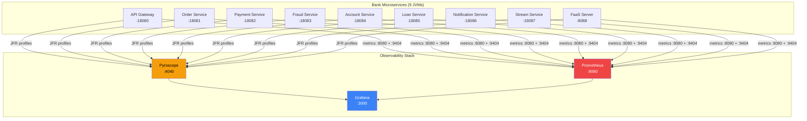
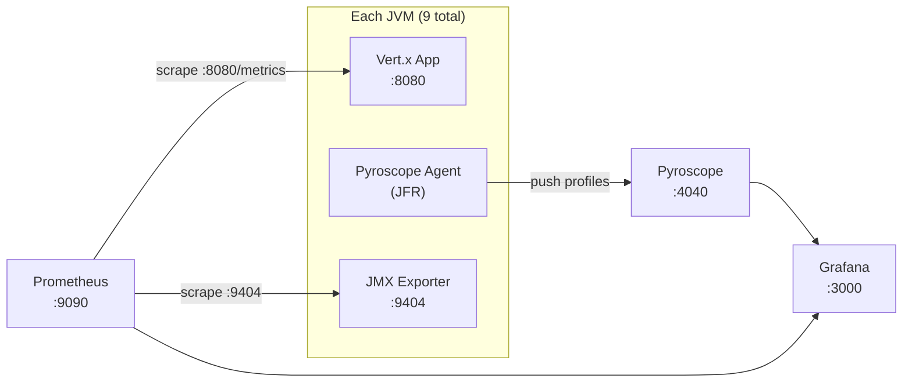

# Architecture & Technical Design

Deployment topology, application architecture, and observability data flow for the continuous profiling demo.

---

## System Overview

The project deploys 12 containers on a single Docker Compose network: 9 Java microservices + Pyroscope + Prometheus + Grafana.



---

## Application Stack

### Technology Stack

| Layer | Technology | Version |
|-------|------------|---------|
| Runtime | OpenJDK | 21 |
| Framework | Eclipse Vert.x | 4.5.x |
| Build | Gradle (shadow plugin) | 8.x |
| Metrics | Micrometer + JMX Exporter | — |
| Profiling | Pyroscope Java Agent (async-profiler) | 0.14.x |

### Single Image, Multiple Services

All 9 services are built from the **same Docker image** (`app/Dockerfile`). The `VERTICLE` environment variable selects which verticle class to run:

```yaml
# docker-compose.yaml excerpt
api-gateway:
  build: ./app
  environment:
    VERTICLE: main

payment-service:
  build: ./app
  environment:
    VERTICLE: payment
```

| VERTICLE value | Class | Pyroscope app name |
|----------------|-------|-------------------|
| `main` | MainVerticle | `bank-api-gateway` |
| `order` | OrderVerticle | `bank-order-service` |
| `payment` | PaymentVerticle | `bank-payment-service` |
| `fraud` | FraudDetectionVerticle | `bank-fraud-service` |
| `account` | AccountVerticle | `bank-account-service` |
| `loan` | LoanVerticle | `bank-loan-service` |
| `notification` | NotificationVerticle | `bank-notification-service` |
| `stream` | StreamVerticle | `bank-stream-service` |
| `faas` | FaasVerticle | `bank-faas-server` |

---

## Service Catalog

Each service has distinct CPU, memory, and lock characteristics to produce different flame graph signatures.

### Core Banking Services

| Service | Port | Profile Characteristics | Key Bottlenecks |
|---------|------|------------------------|-----------------|
| **API Gateway** | 18080 | CPU-heavy | Recursive fibonacci O(2^n), batch processing |
| **Order Service** | 18081 | Lock contention | `synchronized` method, regex compilation per call |
| **Payment Service** | 18082 | CPU + allocation | `MessageDigest.getInstance()` per call, BigDecimal math |
| **Fraud Service** | 18083 | CPU (baseline) | Precompiled regex patterns — efficient reference |
| **Account Service** | 18084 | Mixed | BigDecimal interest loops, ConcurrentHashMap |
| **Loan Service** | 18085 | CPU-heavy | Monte Carlo simulation, amortization schedules |
| **Notification Service** | 18086 | Allocation-heavy | `String.format` in loops creates Formatter garbage |

### Specialized Services

| Service | Port | Profile Characteristics | Key Bottlenecks |
|---------|------|------------------------|-----------------|
| **Stream Service** | 18087 | Backpressure | Reactive streams, event processing |
| **FaaS Server** | 8088 | Lifecycle overhead | Deploy/undeploy per invocation, cold starts vs warm pools |

---

## Observability Data Flow

Three telemetry pipelines run simultaneously with zero code changes:



### Pipeline Details

| Pipeline | Agent | Transport | What It Captures |
|----------|-------|-----------|-----------------|
| **Continuous Profiling** | Pyroscope Java agent | Push to Pyroscope :4040 | CPU, allocation, mutex, wall clock flame graphs |
| **JVM Metrics** | JMX Exporter on :9404 | Prometheus scrape | Heap, GC, threads, CPU, classloading, file descriptors |
| **HTTP Metrics** | Vert.x Micrometer on :8080/metrics | Prometheus scrape | Request rate, latency percentiles, status codes |

### Prometheus Jobs

| Job | Port | Metrics |
|-----|------|---------|
| `jvm` | 9404 | `jvm_memory_*`, `jvm_gc_*`, `jvm_threads_*`, `process_cpu_*`, `process_open_fds` |
| `vertx-apps` | 8080 | `http_server_requests_*`, `vertx_http_*`, `vertx_pool_*` |

### Pyroscope Profile Types

| Profile Type ID | What It Captures |
|-----------------|-----------------|
| `process_cpu:cpu:nanoseconds:cpu:nanoseconds` | On-CPU time — computation hotspots |
| `wall:wall:nanoseconds:wall:nanoseconds` | Wall clock time — includes I/O, sleep, locks |
| `memory:alloc_in_new_tlab_bytes:bytes:space:bytes` | Allocation bytes — GC pressure sources |
| `memory:alloc_in_new_tlab_objects:count:space:bytes` | Allocation count — object churn |
| `mutex:contentions:count:mutex:count` | Lock contention count |
| `mutex:delay:nanoseconds:mutex:count` | Lock wait time |

---

## JVM Agent Configuration

Each service container sets `JAVA_TOOL_OPTIONS` with two agents:

```bash
# Pyroscope agent — continuous profiling via JFR/async-profiler
-javaagent:/opt/pyroscope/pyroscope.jar
-Dpyroscope.application.name=bank-payment-service
-Dpyroscope.server.address=http://pyroscope:4040
-Dpyroscope.format=jfr
-Dpyroscope.profiler.event=itimer      # CPU profiling
-Dpyroscope.profiler.alloc=512k        # Allocation sampling threshold
-Dpyroscope.profiler.lock=10ms         # Lock contention threshold

# JMX Exporter — JVM metrics as Prometheus endpoint
-javaagent:/opt/jmx-exporter/jmx_prometheus_javaagent.jar=9404:/opt/jmx-exporter/config.yaml
```

---

## Container Configuration

### Resource Limits

| Service | Memory Limit | CPU Limit |
|---------|--------------|-----------|
| Pyroscope | 2 GB | — |
| Prometheus | 1 GB | — |
| Grafana | 512 MB | — |
| Each Java service | 768 MB | — |

### Health Checks

| Service | Endpoint | Interval |
|---------|----------|----------|
| Pyroscope | `GET /ready` | 10s |
| Prometheus | `GET /-/ready` | 10s |
| Grafana | `GET /api/health` | 10s |
| Java services | `GET /health` | 10s |

### Port Mapping

| Service | Host Port | Container Port |
|---------|-----------|----------------|
| API Gateway | 18080 | 8080 |
| Order Service | 18081 | 8080 |
| Payment Service | 18082 | 8080 |
| Fraud Service | 18083 | 8080 |
| Account Service | 18084 | 8080 |
| Loan Service | 18085 | 8080 |
| Notification Service | 18086 | 8080 |
| Stream Service | 18087 | 8080 |
| FaaS Server | 8088 | 8080 |
| Grafana | 3000 | 3000 |
| Pyroscope | 4040 | 4040 |
| Prometheus | 9090 | 9090 |

---

## OPTIMIZED Environment Variable

Toggles between slow and optimized code paths for before/after comparison:

| Value | Behavior |
|-------|----------|
| unset | Original implementations with deliberate bottlenecks |
| `true` | Optimized implementations — bottlenecks removed |

### What Changes

| Service | Unoptimized | Optimized |
|---------|-------------|-----------|
| API Gateway | Recursive fibonacci O(2^n) | Iterative loop O(n) |
| Payment | `MessageDigest.getInstance()` per call | `ThreadLocal<MessageDigest>` reuse |
| Payment | `String.format("%02x", b)` per byte | `Character.forDigit()` |
| Order | `synchronized` method | `ConcurrentHashMap.computeIfPresent()` |
| Notification | `String.format` in loops | `StringBuilder` |
| Fraud | `Double` boxing in percentiles | Primitive `double[]` + `Arrays.sort` |
| FaaS | Deploy/undeploy per invocation | Warm pool reuse |

Toggle with:
```bash
bash scripts/run.sh optimize    # Switch running stack to optimized
bash scripts/run.sh unoptimize  # Switch back to unoptimized
bash scripts/run.sh --fixed     # Start fresh with optimized only
```

---

## Grafana Dashboards

Six pre-provisioned dashboards:

| Dashboard | UID | Primary Data Source |
|-----------|-----|---------------------|
| Pyroscope Java Overview | `pyroscope-java-overview` | Pyroscope |
| Service Performance | `verticle-performance` | Prometheus + Pyroscope |
| JVM Metrics Deep Dive | `jvm-metrics-deep-dive` | Prometheus |
| HTTP Performance | `http-performance` | Prometheus |
| Before vs After Fix | `before-after-comparison` | Pyroscope |
| FaaS Server | `faas-server` | Prometheus + Pyroscope |

---

## Network Topology

All containers run on the `monitoring` bridge network. Services communicate by container name:

```
pyroscope:4040      — Profiling backend
prometheus:9090     — Metrics backend
grafana:3000        — Dashboards
api-gateway:8080    — (internal, exposed as 18080)
payment-service:8080 — (internal, exposed as 18082)
...
```

Prometheus scrapes services by internal container name and port (e.g., `payment-service:8080`, `payment-service:9404`).

---

## File Structure Reference

```
config/
├── grafana/
│   ├── dashboards/           # 6 dashboard JSON files
│   └── provisioning/
│       ├── dashboards/       # Dashboard provider config
│       ├── datasources/      # Prometheus + Pyroscope datasources
│       └── plugins/          # Pyroscope app plugin activation
├── prometheus/
│   ├── prometheus.yaml       # Scrape config (jvm + vertx-apps jobs)
│   └── alerts.yaml           # 6 alert rules
└── pyroscope/
    └── pyroscope.yaml        # Pyroscope server config

app/
├── Dockerfile                # Multi-stage: Gradle build → JRE runtime
├── build.gradle              # Vert.x + Micrometer + shadow plugin
└── src/main/java/com/example/
    ├── MainVerticle.java     # Entry point + API Gateway routes
    ├── OrderVerticle.java
    ├── PaymentVerticle.java
    ├── FraudDetectionVerticle.java
    ├── AccountVerticle.java
    ├── LoanVerticle.java
    ├── NotificationVerticle.java
    ├── StreamVerticle.java
    └── FaasVerticle.java
```
