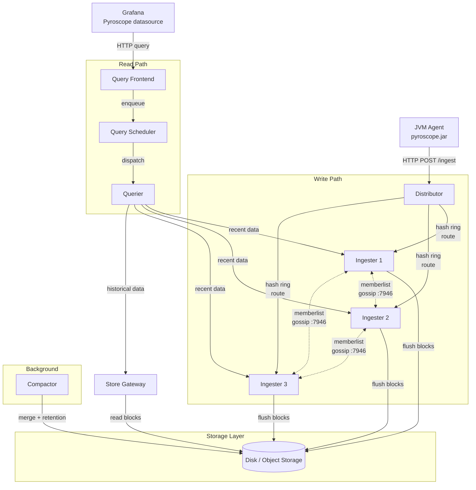
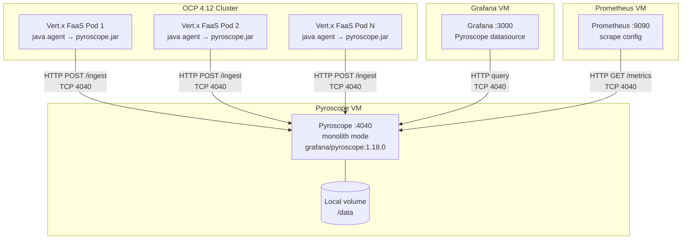
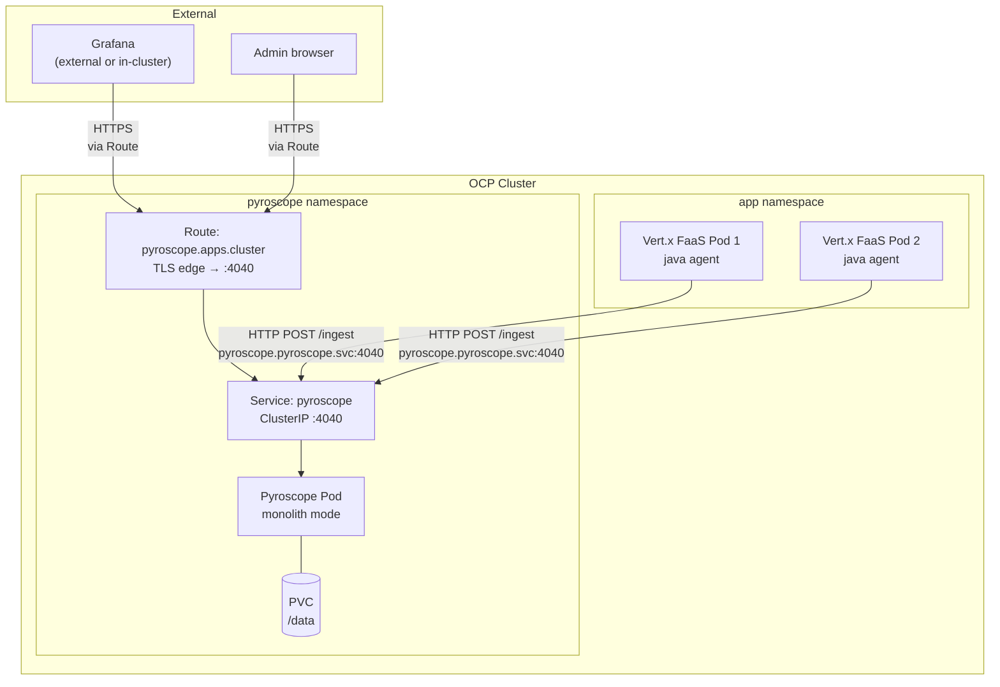
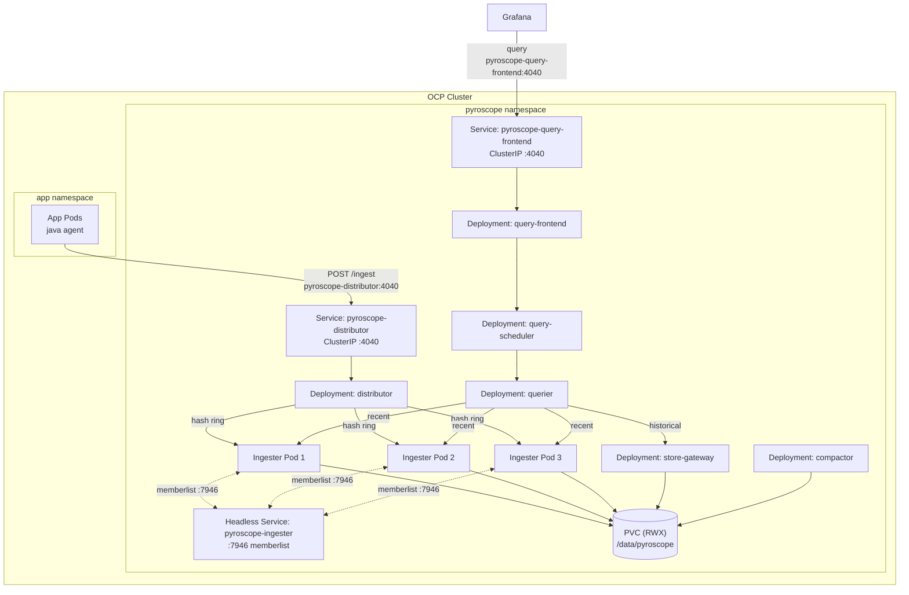
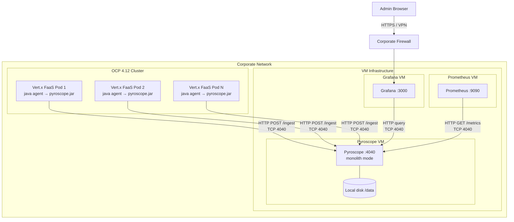
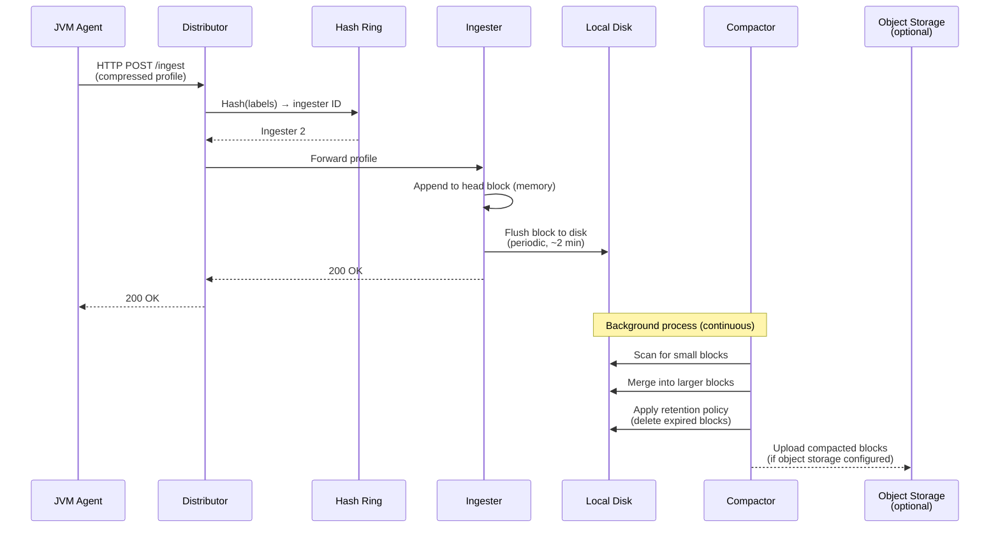
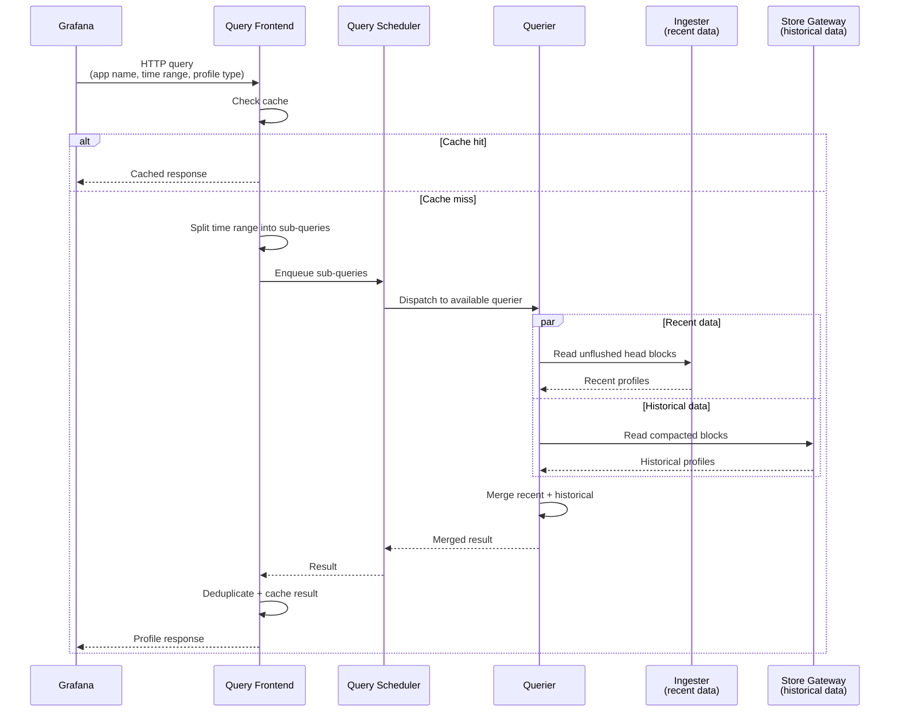
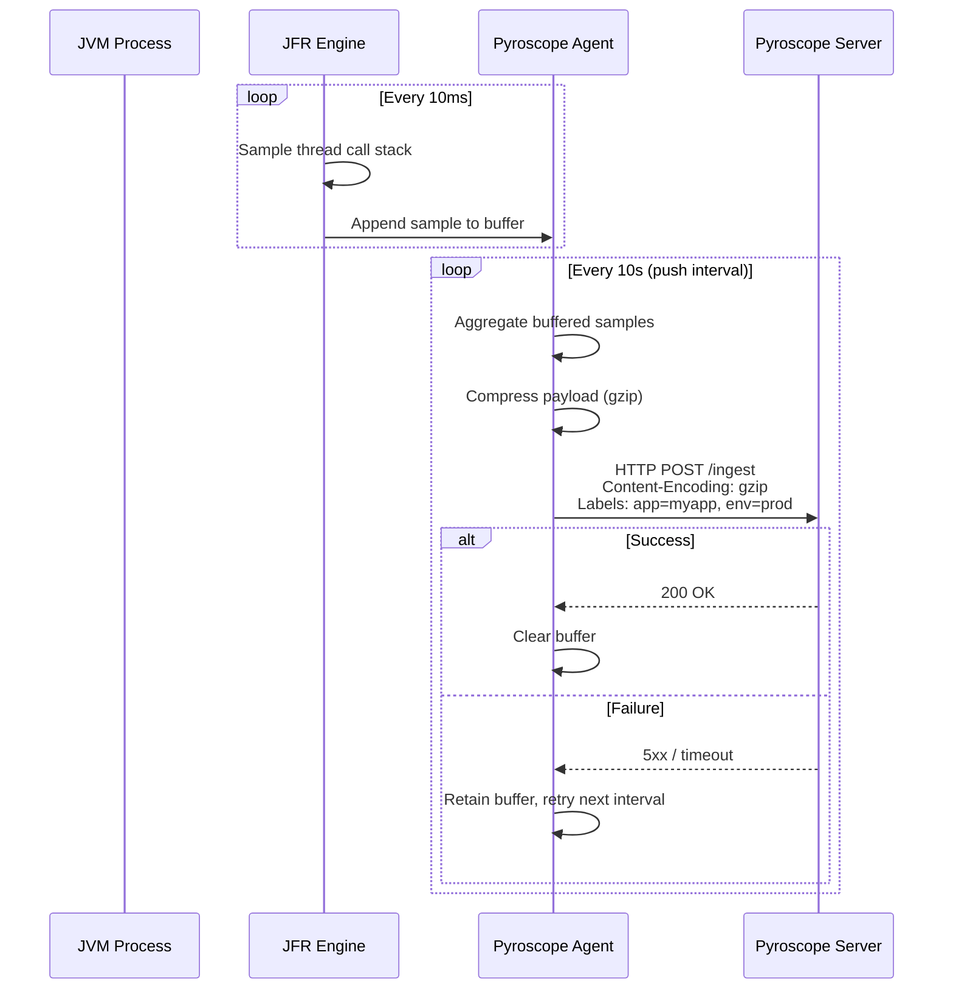
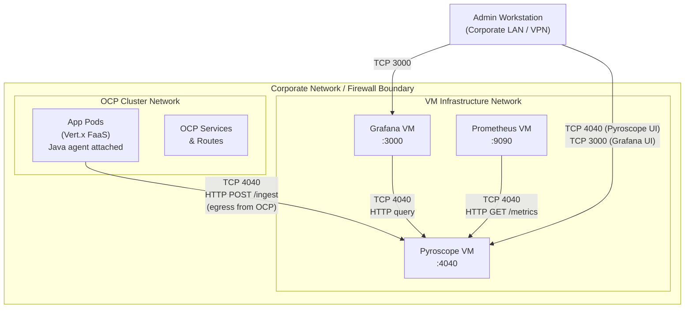

# Pyroscope Architecture Guide

Architecture reference for Pyroscope continuous profiling. Covers component internals,
deployment topologies, data flow, network boundaries, and storage design.

Target audience: architects, security reviewers, platform engineers.

---

## Table of Contents

- [1. Pyroscope Components](#1-pyroscope-components)
- [2. Deployment Mode Comparison](#2-deployment-mode-comparison)
- [3. Topology Diagrams](#3-topology-diagrams) -- [3a. VM Monolith](#3a-vm-monolith-phase-1--current-deployment) | [3b. OCP Monolith](#3b-ocp-monolith-helm-chart) | [3c. VM Microservices](#3c-vm-microservices-docker-compose) | [3d. OCP Microservices](#3d-ocp-microservices-helm-chart) | [3e. Hybrid](#3e-hybrid-vm-pyroscope--ocp-agents)
- [4. Data Flow Diagrams](#4-data-flow-diagrams) -- [4a. Write Path](#4a-write-path-agent--storage) | [4b. Read Path](#4b-read-path-query--response) | [4c. Agent Push Flow](#4c-agent-push-flow)
- [5. Network Boundaries](#5-network-boundaries)
- [6. Storage Architecture](#6-storage-architecture)
- [7. Port Matrix Summary](#7-port-matrix-summary)

---

## 1. Pyroscope Components

Pyroscope uses a microservices-based internal architecture. In monolith mode, all components
run inside a single process. In microservices mode, each component runs as an independent
container that can be scaled separately.

| Component | Role | Stateful | Protocol |
|-----------|------|----------|----------|
| **Distributor** | Receives profiles from agents via HTTP `POST /ingest`. Hashes the profile's label set and routes it to the correct ingester(s) via the consistent hash ring. | No | HTTP inbound, hash ring lookup |
| **Ingester** | Accepts profiles from the distributor and writes them to local storage (head blocks in memory, flushed to disk). Participates in memberlist gossip to form the hash ring. Replicates data to peer ingesters for durability. | Yes | Memberlist (TCP+UDP 7946), HTTP |
| **Querier** | Executes profile queries by reading from two sources: ingesters (for recent, unflushed data) and the store-gateway (for historical, compacted data). Merges results before returning. | No | HTTP/gRPC to ingesters and store-gateway |
| **Query-frontend** | Entry point for all read queries (Grafana, API). Provides query caching, time-range splitting (breaks wide queries into sub-queries), retry logic, and result deduplication. | No | HTTP inbound from Grafana |
| **Query-scheduler** | Sits between the query-frontend and queriers. Maintains a queue of pending queries and distributes them across available querier replicas for load balancing. | No | HTTP/gRPC |
| **Compactor** | Periodically scans stored block files, merges small blocks into larger ones for query efficiency, and applies the configured retention policy (deleting blocks older than the retention window). | No (reads/writes shared storage) | Filesystem |
| **Store-gateway** | Serves historical profile data from long-term storage (local filesystem or object storage like S3/GCS). Loads block metadata into memory for fast index lookups. | No (reads shared storage) | HTTP/gRPC |

### Component interaction overview


```mermaid
graph TB
    Agent["JVM Agent<br/>pyroscope.jar"]
    Grafana["Grafana<br/>Pyroscope datasource"]

    Agent -->|"HTTP POST /ingest"| Distributor
    Grafana -->|"HTTP query"| QF["Query Frontend"]

    subgraph "Write Path"
        Distributor -->|"hash ring<br/>route"| Ingester1["Ingester 1"]
        Distributor -->|"hash ring<br/>route"| Ingester2["Ingester 2"]
        Distributor -->|"hash ring<br/>route"| Ingester3["Ingester 3"]
    end

    subgraph "Read Path"
        QF -->|"enqueue"| QS["Query Scheduler"]
        QS -->|"dispatch"| Querier
    end

    subgraph "Background"
        Compactor["Compactor"]
    end

    subgraph "Storage Layer"
        Storage[("Disk / Object Storage")]
    end

    Ingester1 -->|"flush blocks"| Storage
    Ingester2 -->|"flush blocks"| Storage
    Ingester3 -->|"flush blocks"| Storage
    Querier -->|"recent data"| Ingester1
    Querier -->|"recent data"| Ingester2
    Querier -->|"recent data"| Ingester3
    Querier -->|"historical data"| SG["Store Gateway"]
    SG -->|"read blocks"| Storage
    Compactor -->|"merge + retention"| Storage

    Ingester1 <-.->|"memberlist<br/>gossip :7946"| Ingester2
    Ingester2 <-.->|"memberlist<br/>gossip :7946"| Ingester3
    Ingester3 <-.->|"memberlist<br/>gossip :7946"| Ingester1
```

---

## 2. Deployment Mode Comparison

| Dimension | Monolith | Microservices |
|-----------|----------|---------------|
| **Components** | All 7 components in a single process | Each component is an independent container/pod |
| **Scaling** | Vertical only (add CPU/RAM to the single instance) | Horizontal per component (scale ingesters and queriers independently) |
| **Storage** | Local filesystem at `/data` inside the container | Shared filesystem (NFS / RWX PVC) at `/data/pyroscope` per ingester |
| **High availability** | No built-in HA; single point of failure | Yes -- replicated ingesters, multiple queriers, hash ring rebalancing |
| **Memberlist** | Not used (all components are in-process) | Required -- ingesters form a hash ring via memberlist gossip on port 7946 |
| **Complexity** | Low -- single container, single config file | Higher -- 7+ containers, shared storage provisioning, network policies |
| **Object storage** | Optional (S3/GCS for long-term) | Optional (S3/GCS for long-term) |
| **When to use** | Fewer than ~100 profiled applications, dev/staging, PoC, single-team use | 100+ profiled applications, production HA requirement, multi-team shared platform |
| **Minimum resources** | 2 CPU, 4 GB RAM, 50 GB disk | 8 CPU, 16 GB RAM, 100 GB RWX storage |

---

## 3. Topology Diagrams

### 3a. VM Monolith (Phase 1 -- current deployment)

Single Pyroscope container on a dedicated VM. OCP-hosted Vert.x FaaS pods push profiles
over the network. Grafana and Prometheus run on separate VMs.


```mermaid
graph TB
    subgraph "OCP 4.12 Cluster"
        direction TB
        FaaS1["Vert.x FaaS Pod 1<br/>java agent → pyroscope.jar"]
        FaaS2["Vert.x FaaS Pod 2<br/>java agent → pyroscope.jar"]
        FaaSN["Vert.x FaaS Pod N<br/>java agent → pyroscope.jar"]
    end

    subgraph "Pyroscope VM"
        direction TB
        Pyro["Pyroscope :4040<br/>monolith mode<br/>grafana/pyroscope:1.18.0"]
        Vol[("Local volume<br/>/data")]
        Pyro --- Vol
    end

    subgraph "Grafana VM"
        Grafana["Grafana :3000<br/>Pyroscope datasource"]
    end

    subgraph "Prometheus VM"
        Prom["Prometheus :9090<br/>scrape config"]
    end

    FaaS1 -->|"HTTP POST /ingest<br/>TCP 4040"| Pyro
    FaaS2 -->|"HTTP POST /ingest<br/>TCP 4040"| Pyro
    FaaSN -->|"HTTP POST /ingest<br/>TCP 4040"| Pyro

    Grafana -->|"HTTP query<br/>TCP 4040"| Pyro
    Prom -->|"HTTP GET /metrics<br/>TCP 4040"| Pyro
```

**Key characteristics:**
- Single port (TCP 4040) for all external traffic
- Agents push to Pyroscope; Pyroscope never initiates outbound connections to OCP
- All cross-boundary traffic is HTTP (no gRPC, no memberlist)

---

### 3b. OCP Monolith (Helm chart)

Pyroscope runs as a pod inside the OCP cluster. App pods push profiles over the cluster
SDN. External access via OCP Route.


```mermaid
graph TB
    subgraph "OCP Cluster"
        subgraph "pyroscope namespace"
            PyroSvc["Service: pyroscope<br/>ClusterIP :4040"]
            PyroPod["Pyroscope Pod<br/>monolith mode"]
            PVC[("PVC<br/>/data")]
            Route["Route: pyroscope.apps.cluster<br/>TLS edge → :4040"]

            PyroSvc --> PyroPod
            PyroPod --- PVC
            Route --> PyroSvc
        end

        subgraph "app namespace"
            App1["Vert.x FaaS Pod 1<br/>java agent"]
            App2["Vert.x FaaS Pod 2<br/>java agent"]
        end
    end

    subgraph "External"
        ExtGrafana["Grafana<br/>(external or in-cluster)"]
        Admin["Admin browser"]
    end

    App1 -->|"HTTP POST /ingest<br/>pyroscope.pyroscope.svc:4040"| PyroSvc
    App2 -->|"HTTP POST /ingest<br/>pyroscope.pyroscope.svc:4040"| PyroSvc

    ExtGrafana -->|"HTTPS<br/>via Route"| Route
    Admin -->|"HTTPS<br/>via Route"| Route
```

**Key characteristics:**
- Agent-to-Pyroscope traffic stays within the cluster SDN (no firewall rules needed)
- External access via OCP Route with TLS edge termination
- NetworkPolicy can restrict which namespaces reach port 4040

---

### 3c. VM Microservices (Docker Compose)

All 7 Pyroscope components run as separate containers on a single VM (or spread across
VMs with shared NFS storage). Memberlist gossip coordinates the hash ring.


```mermaid
graph TB
    Agent["JVM Agents<br/>HTTP POST /ingest"]
    Grafana["Grafana<br/>HTTP query"]

    subgraph "Pyroscope VM — Docker Compose"
        DIST["Distributor<br/>:4040 push endpoint"]
        ING1["Ingester 1<br/>:7946 memberlist"]
        ING2["Ingester 2<br/>:7946 memberlist"]
        ING3["Ingester 3<br/>:7946 memberlist"]
        QF["Query Frontend<br/>:4041 query endpoint"]
        QS["Query Scheduler"]
        Q["Querier"]
        SG["Store Gateway"]
        C["Compactor"]

        DIST -->|"hash ring"| ING1
        DIST -->|"hash ring"| ING2
        DIST -->|"hash ring"| ING3

        QF --> QS --> Q
        Q -->|"recent"| ING1
        Q -->|"recent"| ING2
        Q -->|"recent"| ING3
        Q -->|"historical"| SG

        ING1 <-.->|"gossip :7946"| ING2
        ING2 <-.->|"gossip :7946"| ING3
        ING3 <-.->|"gossip :7946"| ING1
    end

    subgraph "Shared Storage"
        NFS[("NFS volume<br/>/mnt/pyroscope-data")]
    end

    Agent -->|"TCP 4040"| DIST
    Grafana -->|"TCP 4041"| QF

    ING1 -->|"flush"| NFS
    ING2 -->|"flush"| NFS
    ING3 -->|"flush"| NFS
    SG -->|"read blocks"| NFS
    C -->|"compact + retention"| NFS
```

**Key characteristics:**
- Distributor on port 4040 (agent push), query-frontend on port 4041 (Grafana queries)
- Memberlist gossip on TCP+UDP 7946 between ingesters (container network only)
- NFS mount at `/mnt/pyroscope-data` shared by all containers
- Compactor runs continuously in the background

---

### 3d. OCP Microservices (Helm chart)

Full distributed deployment on OpenShift. Each component is a separate Deployment with
its own Service. Headless service for memberlist discovery.


```mermaid
graph TB
    subgraph "OCP Cluster"
        subgraph "pyroscope namespace"
            DistSvc["Service: pyroscope-distributor<br/>ClusterIP :4040"]
            DistDeploy["Deployment: distributor"]

            QFSvc["Service: pyroscope-query-frontend<br/>ClusterIP :4040"]
            QFDeploy["Deployment: query-frontend"]

            QSDeploy["Deployment: query-scheduler"]
            QDeploy["Deployment: querier"]

            IngSvc["Headless Service: pyroscope-ingester<br/>:7946 memberlist"]
            Ing1["Ingester Pod 1"]
            Ing2["Ingester Pod 2"]
            Ing3["Ingester Pod 3"]

            SGDeploy["Deployment: store-gateway"]
            CDeploy["Deployment: compactor"]

            PVC[("PVC (RWX)<br/>/data/pyroscope")]

            DistSvc --> DistDeploy
            QFSvc --> QFDeploy

            DistDeploy -->|"hash ring"| Ing1
            DistDeploy -->|"hash ring"| Ing2
            DistDeploy -->|"hash ring"| Ing3

            QFDeploy --> QSDeploy --> QDeploy
            QDeploy -->|"recent"| Ing1
            QDeploy -->|"recent"| Ing2
            QDeploy -->|"recent"| Ing3
            QDeploy -->|"historical"| SGDeploy

            Ing1 <-.->|"memberlist :7946"| IngSvc
            Ing2 <-.->|"memberlist :7946"| IngSvc
            Ing3 <-.->|"memberlist :7946"| IngSvc

            Ing1 --> PVC
            Ing2 --> PVC
            Ing3 --> PVC
            SGDeploy --> PVC
            CDeploy --> PVC
        end

        subgraph "app namespace"
            AppPods["App Pods<br/>java agent"]
        end
    end

    ExtGrafana["Grafana"]

    AppPods -->|"POST /ingest<br/>pyroscope-distributor:4040"| DistSvc
    ExtGrafana -->|"query<br/>pyroscope-query-frontend:4040"| QFSvc
```

**Key characteristics:**
- Agents push to `pyroscope-distributor.pyroscope.svc:4040`
- Grafana queries `pyroscope-query-frontend.pyroscope.svc:4040`
- Headless service enables memberlist peer discovery via DNS SRV records
- PVC must be RWX (ReadWriteMany) -- NFS, CephFS, or equivalent
- NetworkPolicy can restrict inter-namespace traffic

---

### 3e. Hybrid: VM Pyroscope + OCP Agents

The current production topology. Pyroscope server runs on a dedicated VM in monolith
mode. OCP-hosted application pods push profiles across the network boundary.


```mermaid
graph TB
    subgraph "Corporate Network"
        subgraph "OCP 4.12 Cluster"
            FaaS1["Vert.x FaaS Pod 1<br/>java agent → pyroscope.jar"]
            FaaS2["Vert.x FaaS Pod 2<br/>java agent → pyroscope.jar"]
            FaaSN["Vert.x FaaS Pod N<br/>java agent → pyroscope.jar"]
        end

        subgraph "VM Infrastructure"
            subgraph "Pyroscope VM"
                Pyro["Pyroscope :4040<br/>monolith mode"]
                Vol[("Local disk /data")]
                Pyro --- Vol
            end

            subgraph "Grafana VM"
                Grafana["Grafana :3000"]
            end

            subgraph "Prometheus VM"
                Prom["Prometheus :9090"]
            end
        end

        FaaS1 -->|"HTTP POST /ingest<br/>TCP 4040"| Pyro
        FaaS2 -->|"HTTP POST /ingest<br/>TCP 4040"| Pyro
        FaaSN -->|"HTTP POST /ingest<br/>TCP 4040"| Pyro

        Grafana -->|"HTTP query<br/>TCP 4040"| Pyro
        Prom -->|"HTTP GET /metrics<br/>TCP 4040"| Pyro
    end

    Firewall["Corporate Firewall"]
    Admin["Admin Browser"]

    Admin -->|"HTTPS / VPN"| Firewall
    Firewall --> Grafana
```

**Key characteristics:**
- Only TCP 4040 crosses the OCP-to-VM boundary (agents push to Pyroscope)
- Pyroscope never initiates outbound connections to OCP
- Grafana and Prometheus are on the VM infrastructure network
- All traffic within the corporate network; no public internet exposure

---

## 4. Data Flow Diagrams

### 4a. Write path (agent to storage)


```mermaid
sequenceDiagram
    participant Agent as JVM Agent
    participant Dist as Distributor
    participant Ring as Hash Ring
    participant Ing as Ingester
    participant Disk as Local Disk
    participant Comp as Compactor
    participant Store as Object Storage<br/>(optional)

    Agent->>Dist: HTTP POST /ingest<br/>(compressed profile)
    Dist->>Ring: Hash(labels) → ingester ID
    Ring-->>Dist: Ingester 2
    Dist->>Ing: Forward profile
    Ing->>Ing: Append to head block (memory)
    Ing->>Disk: Flush block to disk<br/>(periodic, ~2 min)
    Ing-->>Dist: 200 OK
    Dist-->>Agent: 200 OK

    Note over Comp,Disk: Background process (continuous)
    Comp->>Disk: Scan for small blocks
    Comp->>Disk: Merge into larger blocks
    Comp->>Disk: Apply retention policy<br/>(delete expired blocks)
    Comp-->>Store: Upload compacted blocks<br/>(if object storage configured)
```

**Write path summary:**
1. JVM agent samples the call stack (every 10ms by default)
2. Agent batches samples and HTTP POSTs a compressed profile to `/ingest` every 10 seconds
3. Distributor hashes the profile labels to determine the target ingester
4. Ingester appends the profile to its in-memory head block
5. Head blocks are periodically flushed to disk (~2 minutes)
6. Compactor merges small blocks and enforces retention in the background

---

### 4b. Read path (query to response)


```mermaid
sequenceDiagram
    participant Grafana as Grafana
    participant QF as Query Frontend
    participant QS as Query Scheduler
    participant Q as Querier
    participant Ing as Ingester<br/>(recent data)
    participant SG as Store Gateway<br/>(historical data)

    Grafana->>QF: HTTP query<br/>(app name, time range, profile type)
    QF->>QF: Check cache
    alt Cache hit
        QF-->>Grafana: Cached response
    else Cache miss
        QF->>QF: Split time range into sub-queries
        QF->>QS: Enqueue sub-queries
        QS->>Q: Dispatch to available querier
        par Recent data
            Q->>Ing: Read unflushed head blocks
            Ing-->>Q: Recent profiles
        and Historical data
            Q->>SG: Read compacted blocks
            SG-->>Q: Historical profiles
        end
        Q->>Q: Merge recent + historical
        Q-->>QS: Merged result
        QS-->>QF: Result
        QF->>QF: Deduplicate + cache result
        QF-->>Grafana: Profile response
    end
```

**Read path summary:**
1. Grafana sends a query with app name, time range, and profile type
2. Query-frontend checks its cache; on miss, it splits wide time ranges into sub-queries
3. Query-scheduler distributes sub-queries to available queriers
4. Querier reads from both ingesters (recent, unflushed data) and store-gateway (historical, compacted data) in parallel
5. Querier merges both result sets
6. Query-frontend deduplicates overlapping results and caches the final response

---

### 4c. Agent push flow


```mermaid
sequenceDiagram
    participant JVM as JVM Process
    participant JFR as JFR Engine
    participant PA as Pyroscope Agent
    participant Pyro as Pyroscope Server

    loop Every 10ms
        JFR->>JFR: Sample thread call stack
        JFR->>PA: Append sample to buffer
    end

    loop Every 10s (push interval)
        PA->>PA: Aggregate buffered samples
        PA->>PA: Compress payload (gzip)
        PA->>Pyro: HTTP POST /ingest<br/>Content-Encoding: gzip<br/>Labels: app=myapp, env=prod
        alt Success
            Pyro-->>PA: 200 OK
            PA->>PA: Clear buffer
        else Failure
            Pyro-->>PA: 5xx / timeout
            PA->>PA: Retain buffer, retry next interval
        end
    end
```

**Agent push summary:**
1. JFR (Java Flight Recorder) samples the thread call stack every ~10ms
2. The Pyroscope Java agent collects samples into an in-memory buffer
3. Every 10 seconds, the agent compresses and POSTs the profile to the Pyroscope server
4. On success (200 OK), the buffer is cleared; on failure, samples are retained for the next push

---

## 5. Network Boundaries


```mermaid
graph TB
    subgraph "Corporate Network / Firewall Boundary"
        subgraph "OCP Cluster Network"
            direction TB
            OCPPods["App Pods<br/>(Vert.x FaaS)<br/>Java agent attached"]
            OCPSvc["OCP Services<br/>& Routes"]
        end

        subgraph "VM Infrastructure Network"
            direction TB
            PyroVM["Pyroscope VM<br/>:4040"]
            GrafVM["Grafana VM<br/>:3000"]
            PromVM["Prometheus VM<br/>:9090"]
        end
    end

    AdminNet["Admin Workstation<br/>(Corporate LAN / VPN)"]

    OCPPods -->|"TCP 4040<br/>HTTP POST /ingest<br/>(egress from OCP)"| PyroVM
    GrafVM -->|"TCP 4040<br/>HTTP query"| PyroVM
    PromVM -->|"TCP 4040<br/>HTTP GET /metrics"| PyroVM
    AdminNet -->|"TCP 4040 (Pyroscope UI)<br/>TCP 3000 (Grafana UI)"| PyroVM
    AdminNet -->|"TCP 3000"| GrafVM
```

### Boundary crossing summary

| Source Zone | Destination Zone | Port | Protocol | Direction | Purpose |
|-------------|------------------|------|----------|-----------|---------|
| OCP cluster | VM infrastructure | TCP 4040 | HTTP | OCP egress | Agent push (`POST /ingest`) |
| VM infrastructure | VM infrastructure | TCP 4040 | HTTP | Internal | Grafana queries, Prometheus scrape |
| Corporate LAN | VM infrastructure | TCP 4040 | HTTP | Ingress | Admin access to Pyroscope UI |
| Corporate LAN | VM infrastructure | TCP 3000 | HTTP | Ingress | Admin access to Grafana UI |
| OCP cluster | OCP cluster (microservices mode) | TCP 7946 | TCP+UDP | Internal | Memberlist gossip (ingesters only) |
| OCP cluster | OCP cluster (microservices mode) | TCP 4040 | HTTP | Internal | Inter-component communication |

> **Outbound from Pyroscope:** None. Pyroscope does not initiate connections to agents,
> Grafana, or Prometheus. All traffic is inbound to the Pyroscope server.

---

## 6. Storage Architecture

### Monolith mode

```
Pyroscope container
└── /data/                          ← Docker volume (local filesystem)
    ├── head/                       ← In-memory blocks flushed to disk
    │   └── <tenant>/<block-id>/    ← Per-tenant block directories
    ├── local/                      ← Compacted blocks (long-term)
    │   └── <tenant>/<block-id>/
    └── wal/                        ← Write-ahead log for crash recovery
```

- **Volume:** Docker named volume (`pyroscope-data`) or bind mount
- **Sizing:** ~1 GB per 10 profiled JVMs per day (varies with profile frequency and cardinality)
- **Backup:** Snapshot the Docker volume or `/data` directory

### Microservices mode

```
Shared NFS / RWX PVC
└── /data/pyroscope/                ← Mounted by all ingesters, store-gateway, compactor
    ├── head/                       ← Each ingester writes to its own subdirectory
    │   ├── ingester-0/<block-id>/
    │   ├── ingester-1/<block-id>/
    │   └── ingester-2/<block-id>/
    ├── local/                      ← Compacted blocks (shared reads)
    │   └── <tenant>/<block-id>/
    └── wal/                        ← Per-ingester WAL directories
```

- **Volume:** NFS mount at `/mnt/pyroscope-data` (VM) or RWX PVC (K8s/OCP)
- **Storage class:** Must support ReadWriteMany -- NFS, CephFS, or GlusterFS
- **Sizing:** Same per-JVM estimate; scale with number of ingesters

### Object storage (optional)

For long-term retention beyond local disk capacity, Pyroscope supports S3-compatible
or GCS object storage. Compacted blocks are uploaded; the store-gateway serves reads.

```yaml
# pyroscope.yaml snippet
storage:
  backend: s3
  s3:
    bucket_name: pyroscope-profiles
    endpoint: s3.amazonaws.com
    region: us-east-1
```

### Retention policy

- **Default:** Unlimited (blocks are kept indefinitely)
- **Configuration:** Set `compactor.blocks_retention_period` in `pyroscope.yaml`
- **Example:** `compactor.blocks_retention_period: 30d` deletes blocks older than 30 days

---

## 7. Port Matrix Summary

Quick reference for firewall rules and network policy configuration.

| Port | Protocol | Component | Direction | Mode | Purpose |
|------|----------|-----------|-----------|------|---------|
| **4040** | TCP / HTTP | All (monolith) or Distributor (microservices) | Inbound | All | Agent push (`POST /ingest`), Grafana queries, Prometheus scrape, UI |
| **4041** | TCP / HTTP | Query Frontend (VM microservices) | Inbound | Microservices (VM) | Grafana query endpoint (mapped port in Docker Compose) |
| **4040** | TCP / HTTPS | Nginx TLS proxy | Inbound | Monolith (HTTPS) | TLS-terminated agent push and queries (Pyroscope moves to :4041) |
| **4443** | TCP / HTTPS | Envoy TLS proxy (legacy) | Inbound | Monolith (HTTPS, legacy) | TLS-terminated agent push and queries |
| **9095** | TCP / gRPC | Internal inter-component | Internal | Microservices | gRPC communication between components |
| **7946** | TCP + UDP | Ingester memberlist | Internal | Microservices | Hash ring gossip, peer discovery, ring state propagation |
| **3000** | TCP / HTTP | Grafana | Inbound | All (if deployed) | Grafana web UI and API |
| **443** | TCP / HTTPS | Envoy TLS proxy or OCP Route | Inbound | HTTPS / OCP | TLS-terminated Grafana access |

### Mode-specific port requirements

| Deployment Mode | Required Ports | Notes |
|-----------------|---------------|-------|
| VM Monolith (HTTP) | 4040 | Single port for everything |
| VM Monolith (HTTPS) | 4040 (Nginx TLS) | Nginx terminates TLS on :4040, proxies to Pyroscope on :4041 internally |
| OCP Monolith | 4040 (cluster-internal), 443 (Route) | Cluster SDN handles internal routing |
| VM Microservices | 4040 (push), 4041 (query), 7946 (memberlist) | Memberlist is container-network only |
| OCP Microservices | 4040 (per-component), 7946 (memberlist) | All internal to cluster SDN |
| Hybrid (VM + OCP) | 4040 (cross-boundary) | Only port that crosses OCP-to-VM boundary |
