# Pyroscope Architecture Guide

Architecture reference for Pyroscope continuous profiling. Covers component internals,
deployment topologies, data flow, network boundaries, and storage design.

Target audience: architects, security reviewers, platform engineers.

---

## Table of Contents

- [1. Pyroscope Components](#1-pyroscope-components)
- [2. Deployment Mode Comparison](#2-deployment-mode-comparison)
- [3. Topology Diagrams](#3-topology-diagrams) -- [3a. VM Monolith](#3a-vm-monolith-phase-1--current-deployment) | [3b. Multi-VM Monolith](#3b-multi-vm-monolith-with-block-storage-phase-2) | [3c. OCP Monolith](#3c-ocp-monolith-helm-chart) | [3d. VM Microservices](#3d-vm-microservices-docker-compose) | [3e. OCP Microservices](#3e-ocp-microservices-helm-chart) | [3f. Hybrid](#3f-hybrid-vm-pyroscope--ocp-agents)
- [4. Data Flow Diagrams](#4-data-flow-diagrams) -- [4a. Write Path](#4a-write-path-agent--storage) | [4b. Read Path](#4b-read-path-query--response) | [4c. Agent Push Flow](#4c-agent-push-flow)
- [5. Network Boundaries](#5-network-boundaries)
- [6. Storage Architecture](#6-storage-architecture)
- [7. Port Matrix Summary](#7-port-matrix-summary)

---

## 1. Pyroscope Components

Pyroscope uses a microservices-based internal architecture. In monolith mode, all components
run inside a single process. In microservices mode, each component runs as an independent
container that can be scaled separately.

| Component | Role | Stateful | Protocol |
|-----------|------|----------|----------|
| **Distributor** | Receives profiles from agents via HTTP `POST /ingest`. Hashes the profile's label set and routes it to the correct ingester(s) via the consistent hash ring. | No | HTTP inbound, hash ring lookup |
| **Ingester** | Accepts profiles from the distributor and writes them to local storage (head blocks in memory, flushed to disk). Participates in memberlist gossip to form the hash ring. Replicates data to peer ingesters for durability. | Yes | Memberlist (TCP+UDP 7946), HTTP |
| **Querier** | Executes profile queries by reading from two sources: ingesters (for recent, unflushed data) and the store-gateway (for historical, compacted data). Merges results before returning. | No | HTTP/gRPC to ingesters and store-gateway |
| **Query-frontend** | Entry point for all read queries (Grafana, API). Provides query caching, time-range splitting (breaks wide queries into sub-queries), retry logic, and result deduplication. | No | HTTP inbound from Grafana |
| **Query-scheduler** | Sits between the query-frontend and queriers. Maintains a queue of pending queries and distributes them across available querier replicas for load balancing. | No | HTTP/gRPC |
| **Compactor** | Periodically scans stored block files, merges small blocks into larger ones for query efficiency, and applies the configured retention policy (deleting blocks older than the retention window). | No (reads/writes shared storage) | Filesystem |
| **Store-gateway** | Serves historical profile data from long-term storage (local filesystem or object storage like S3/GCS). Loads block metadata into memory for fast index lookups. | No (reads shared storage) | HTTP/gRPC |

### Component interaction overview

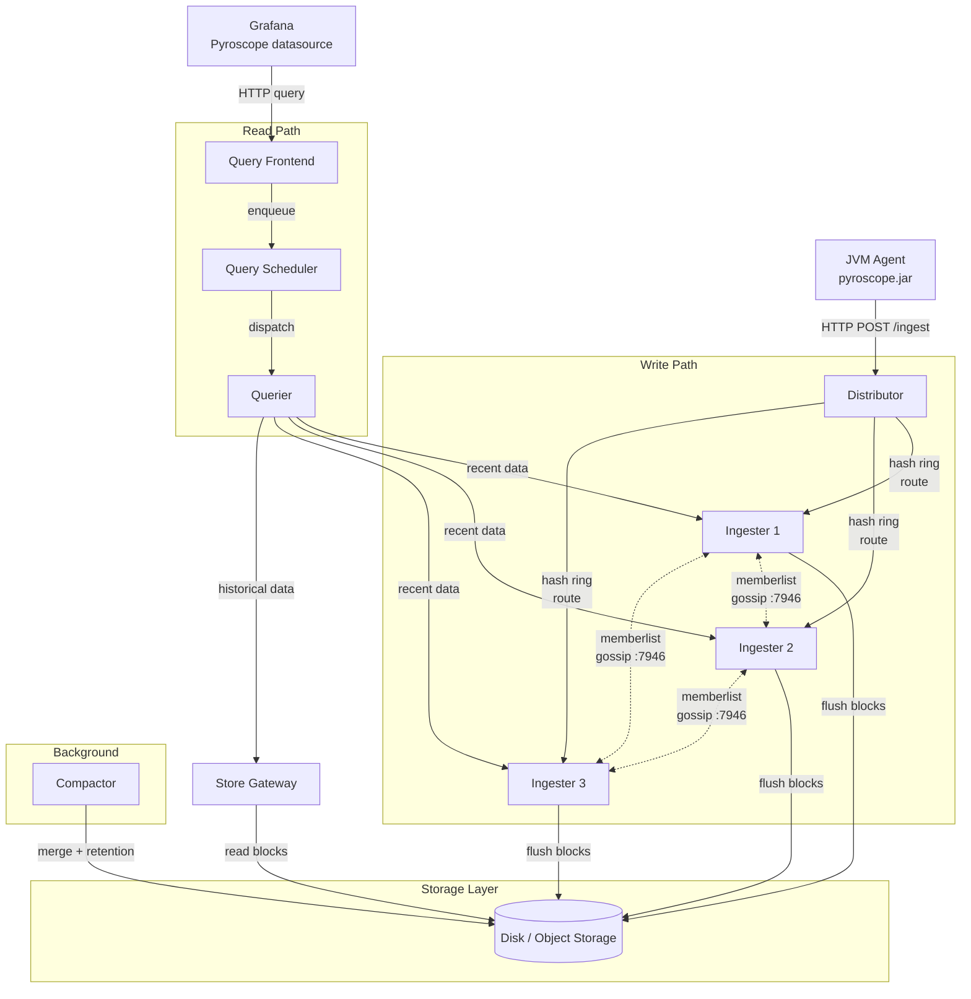
```mermaid
graph TB
    Agent["JVM Agent<br/>pyroscope.jar"]
    Grafana["Grafana<br/>Pyroscope datasource"]

    Agent -->|"HTTP POST /ingest"| Distributor
    Grafana -->|"HTTP query"| QF["Query Frontend"]

    subgraph "Write Path"
        Distributor -->|"hash ring<br/>route"| Ingester1["Ingester 1"]
        Distributor -->|"hash ring<br/>route"| Ingester2["Ingester 2"]
        Distributor -->|"hash ring<br/>route"| Ingester3["Ingester 3"]
    end

    subgraph "Read Path"
        QF -->|"enqueue"| QS["Query Scheduler"]
        QS -->|"dispatch"| Querier
    end

    subgraph "Background"
        Compactor["Compactor"]
    end

    subgraph "Storage Layer"
        Storage[("Disk / Object Storage")]
    end

    Ingester1 -->|"flush blocks"| Storage
    Ingester2 -->|"flush blocks"| Storage
    Ingester3 -->|"flush blocks"| Storage
    Querier -->|"recent data"| Ingester1
    Querier -->|"recent data"| Ingester2
    Querier -->|"recent data"| Ingester3
    Querier -->|"historical data"| SG["Store Gateway"]
    SG -->|"read blocks"| Storage
    Compactor -->|"merge + retention"| Storage

    Ingester1 <-.->|"memberlist<br/>gossip :7946"| Ingester2
    Ingester2 <-.->|"memberlist<br/>gossip :7946"| Ingester3
    Ingester3 <-.->|"memberlist<br/>gossip :7946"| Ingester1
```

---

## 2. Deployment Mode Comparison

| Dimension | Monolith (Phase 1) | Multi-VM Monolith (Phase 2) | Microservices (Phase 3) |
|-----------|----------|---------------------------|---------------|
| **Components** | All 7 in a single process | All 7 in a single process per VM | Each component is an independent container/pod |
| **Scaling** | Vertical only | Vertical (per VM) | Horizontal per component |
| **Storage** | Local filesystem at `/data` | Shared block storage (SAN/iSCSI) at `/data/pyroscope` | RWX PVC backed by block storage or S3-compatible object storage |
| **High availability** | No -- single point of failure | Yes -- VIP failover between VMs | Yes -- replicated ingesters, pod rescheduling |
| **Load balancer** | None | F5 VIP with health check | OCP Service / Route |
| **Memberlist** | Not used | Not used | Required -- ingesters form hash ring on port 7946 |
| **Complexity** | Low -- single container | Low-medium -- 2 VMs, block storage, VIP | Higher -- 7+ containers, storage, network policies |
| **Object storage** | Optional (S3/GCS) | Optional (S3/GCS) | Optional (S3/GCS) |
| **When to use** | < 100 apps, PoC, single-team | < 100 apps, need HA, enterprise | 100+ apps, horizontal scaling, multi-team |
| **Minimum resources** | 2 CPU, 4 GB RAM, 50 GB disk | 2x (2 CPU, 4 GB RAM), shared block storage | 8 CPU, 16 GB RAM, 100 GB RWX storage |

---

## 3. Topology Diagrams

### 3a. VM Single Monolith with Nginx TLS (Phase 1a)

Pyroscope and Nginx run as Docker containers on a dedicated RHEL VM. Nginx
terminates TLS on port 4040 and forwards to Pyroscope on 4041 (localhost only).
An F5 VIP fronts the VM with a DNS entry. OCP-hosted JVM application pods push
profiles over HTTPS via the VIP.

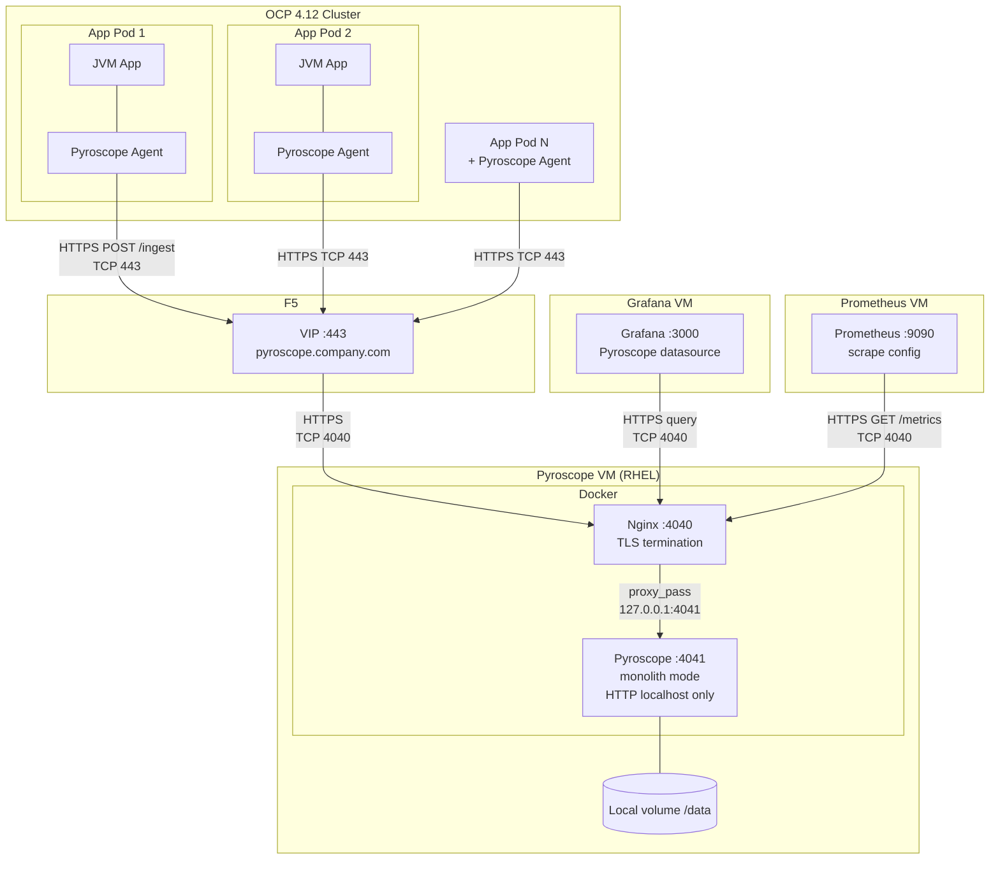
```mermaid
graph TB
    subgraph "OCP 4.12 Cluster"
        direction TB
        subgraph "App Pod 1"
            JVM1["JVM App"]
            PA1["Pyroscope Agent"]
            JVM1 --- PA1
        end
        subgraph "App Pod 2"
            JVM2["JVM App"]
            PA2["Pyroscope Agent"]
            JVM2 --- PA2
        end
        PodN["App Pod N<br/>+ Pyroscope Agent"]
    end

    subgraph "F5"
        VIP["VIP :443<br/>pyroscope.company.com"]
    end

    subgraph "Pyroscope VM (RHEL)"
        subgraph "Docker"
            Nginx["Nginx :4040<br/>TLS termination"]
            Pyro["Pyroscope :4041<br/>monolith mode<br/>HTTP localhost only"]
        end
        Vol[("Local volume /data")]
        Nginx -->|"proxy_pass<br/>127.0.0.1:4041"| Pyro
        Pyro --- Vol
    end

    subgraph "Grafana VM"
        Grafana["Grafana :3000<br/>Pyroscope datasource"]
    end

    subgraph "Prometheus VM"
        Prom["Prometheus :9090<br/>scrape config"]
    end

    PA1 -->|"HTTPS POST /ingest<br/>TCP 443"| VIP
    PA2 -->|"HTTPS TCP 443"| VIP
    PodN -->|"HTTPS TCP 443"| VIP
    VIP -->|"HTTPS<br/>TCP 4040"| Nginx

    Grafana -->|"HTTPS query<br/>TCP 4040"| Nginx
    Prom -->|"HTTPS GET /metrics<br/>TCP 4040"| Nginx
```

**Key characteristics:**
- All external traffic is HTTPS — Nginx TLS on :4040, Pyroscope HTTP on :4041 (localhost only)
- Port 4041 is **never** exposed externally; Nginx proxies to `127.0.0.1:4041`
- Agents push via F5 VIP on TCP 443; F5 forwards to VM on TCP 4040
- Pyroscope never initiates outbound connections to OCP
- No gRPC, no memberlist — monolith runs all 9 components in a single process

---

### 3a-ii. VM Multi-Instance Monolith with Shared Storage (Phase 1b)

Multiple Pyroscope monolith instances run on separate VMs, each fronted by Nginx TLS.
An F5 load balancer distributes agent pushes and Grafana queries across all instances.
All instances share a common S3-compatible object storage backend (MinIO, AWS S3, GCS, or Azure Blob) so
that any instance can serve queries for any data, regardless of which instance ingested it.

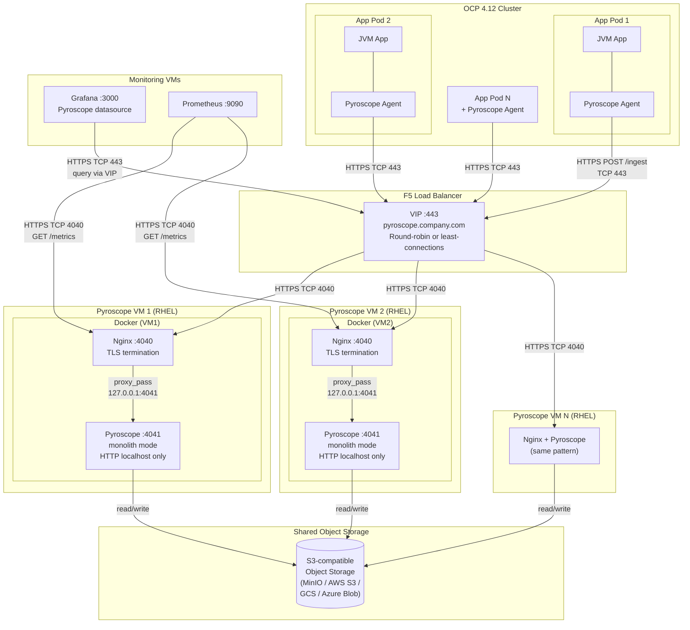
```mermaid
graph TB
    subgraph "OCP 4.12 Cluster"
        direction TB
        subgraph "App Pod 1"
            JVM1["JVM App"]
            PA1["Pyroscope Agent"]
            JVM1 --- PA1
        end
        subgraph "App Pod 2"
            JVM2["JVM App"]
            PA2["Pyroscope Agent"]
            JVM2 --- PA2
        end
        PodN["App Pod N<br/>+ Pyroscope Agent"]
    end

    subgraph "F5 Load Balancer"
        VIP["VIP :443<br/>pyroscope.company.com<br/>Round-robin or least-connections"]
    end

    subgraph "Pyroscope VM 1 (RHEL)"
        subgraph "Docker (VM1)"
            Nginx1["Nginx :4040<br/>TLS termination"]
            Pyro1["Pyroscope :4041<br/>monolith mode<br/>HTTP localhost only"]
        end
        Nginx1 -->|"proxy_pass<br/>127.0.0.1:4041"| Pyro1
    end

    subgraph "Pyroscope VM 2 (RHEL)"
        subgraph "Docker (VM2)"
            Nginx2["Nginx :4040<br/>TLS termination"]
            Pyro2["Pyroscope :4041<br/>monolith mode<br/>HTTP localhost only"]
        end
        Nginx2 -->|"proxy_pass<br/>127.0.0.1:4041"| Pyro2
    end

    subgraph "Pyroscope VM N (RHEL)"
        PyroN["Nginx + Pyroscope<br/>(same pattern)"]
    end

    subgraph "Shared Object Storage"
        Storage[("S3-compatible<br/>Object Storage<br/>(MinIO / AWS S3 /<br/>GCS / Azure Blob)")]
    end

    subgraph "Monitoring VMs"
        Grafana["Grafana :3000<br/>Pyroscope datasource"]
        Prom["Prometheus :9090"]
    end

    PA1 -->|"HTTPS POST /ingest<br/>TCP 443"| VIP
    PA2 -->|"HTTPS TCP 443"| VIP
    PodN -->|"HTTPS TCP 443"| VIP
    VIP -->|"HTTPS TCP 4040"| Nginx1
    VIP -->|"HTTPS TCP 4040"| Nginx2
    VIP -->|"HTTPS TCP 4040"| PyroN

    Pyro1 -->|"read/write"| Storage
    Pyro2 -->|"read/write"| Storage
    PyroN -->|"read/write"| Storage

    Grafana -->|"HTTPS TCP 443<br/>query via VIP"| VIP
    Prom -->|"HTTPS TCP 4040<br/>GET /metrics"| Nginx1
    Prom -->|"HTTPS TCP 4040<br/>GET /metrics"| Nginx2
```

**Key characteristics:**
- Each VM runs the same Nginx + Pyroscope monolith stack — identical configuration
- F5 VIP distributes traffic across all VMs. Health check: `GET /ready` on port 4040
- **Shared object storage is mandatory.** Without it, each instance only sees its own data
- **Object storage:** Configure all instances to use the same S3-compatible bucket (MinIO, AWS S3, GCS, or Azure Blob). This is the only shared storage backend supported by Grafana Pyroscope for multi-instance deployments. No file locking issues, scales well with concurrent writers
- No memberlist — each instance is independent. F5 handles failover
- Any instance can serve queries for any data because storage is shared
- Scale horizontally by adding more VMs to the F5 pool

**Storage configuration (object storage):**
```yaml
# pyroscope.yaml — identical on every instance
storage:
  backend: s3
  s3:
    bucket_name: pyroscope-profiles
    endpoint: minio.company.com:9000
    access_key_id: ${MINIO_ACCESS_KEY}
    secret_access_key: ${MINIO_SECRET_KEY}
    insecure: false
```

> **Why object storage?** Grafana Pyroscope officially supports S3-compatible, GCS, Azure Blob, and
> Swift object storage backends for shared data across instances. NFS / shared filesystems are not
> a supported storage backend. Ingesters flush blocks to local disk first, then upload to the object
> store. See [Grafana Pyroscope storage docs](https://grafana.com/docs/pyroscope/latest/configure-server/storage/).

**F5 configuration:**
| Setting | Value | Notes |
|---------|-------|-------|
| Pool members | VM1:4040, VM2:4040, ..., VMn:4040 | All Pyroscope VMs |
| Load balancing | Round-robin or least-connections | Both work — instances are stateless with shared storage |
| Health monitor | HTTPS GET `/ready` on port 4040 | Returns 200 when Pyroscope is ready to accept data |
| Persistence | None required | Instances are interchangeable with shared storage |
| VIP address | `pyroscope.company.com:443` | Single DNS entry for all agents |

**When to use multi-instance monolith vs microservices:**

| Consideration | Multi-Instance Monolith | Microservices (Phase 2) |
|---------------|------------------------|------------------------|
| Operational complexity | Low — same config on every VM, F5 handles routing | Higher — 7+ components, memberlist, per-component scaling |
| HA mechanism | F5 removes unhealthy VMs from pool | Hash ring rebalancing, ingester replication |
| Scaling granularity | Whole instances only | Per-component (e.g., add queriers without adding ingesters) |
| Sweet spot | 50-200 profiled services | 200+ profiled services |
| Storage | S3-compatible object storage (MinIO, AWS S3, GCS, Azure Blob) | S3-compatible object storage (MinIO, AWS S3, GCS, Azure Blob) |
| Best for | Teams comfortable with VMs who need HA without Kubernetes complexity | Teams on OpenShift who need fine-grained scaling |

---

### 3b. Multi-VM Monolith with Block Storage (Phase 2)

Two Pyroscope monolith instances on separate VMs, each mounting the same block storage
volume (SAN/iSCSI). A load balancer (F5 VIP) distributes traffic and provides failover.

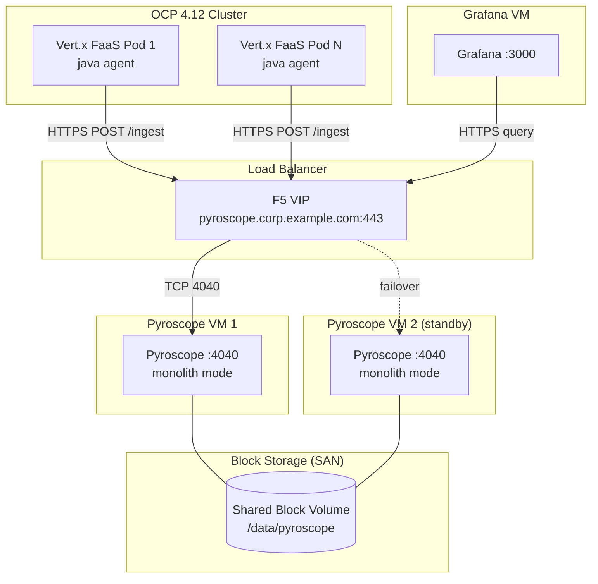
```mermaid
graph TB
    subgraph "OCP 4.12 Cluster"
        FaaS1["Vert.x FaaS Pod 1<br/>java agent"]
        FaaS2["Vert.x FaaS Pod N<br/>java agent"]
    end

    subgraph "Load Balancer"
        VIP["F5 VIP<br/>pyroscope.corp.example.com:443"]
    end

    subgraph "Pyroscope VM 1"
        Pyro1["Pyroscope :4040<br/>monolith mode"]
    end

    subgraph "Pyroscope VM 2 (standby)"
        Pyro2["Pyroscope :4040<br/>monolith mode"]
    end

    subgraph "Block Storage (SAN)"
        BS[("Shared Block Volume<br/>/data/pyroscope")]
    end

    subgraph "Grafana VM"
        Grafana["Grafana :3000"]
    end

    FaaS1 -->|"HTTPS POST /ingest"| VIP
    FaaS2 -->|"HTTPS POST /ingest"| VIP

    VIP -->|"TCP 4040"| Pyro1
    VIP -.->|"failover"| Pyro2

    Pyro1 --- BS
    Pyro2 --- BS

    Grafana -->|"HTTPS query"| VIP
```

**Key characteristics:**
- Both VMs mount the same block storage volume (SAN/iSCSI) at `/data/pyroscope`
- F5 VIP provides load balancing and health-check failover (`GET /ready`)
- Active-passive recommended: only one VM writes at a time to avoid block-level conflicts
- Agents push to VIP; transparent failover if active VM goes down
- No architecture change to Pyroscope itself — same monolith binary, shared data directory

---

### 3c. OCP Monolith (Helm chart)

Pyroscope runs as a pod inside the OCP cluster. App pods push profiles over the cluster
SDN. External access via OCP Route.

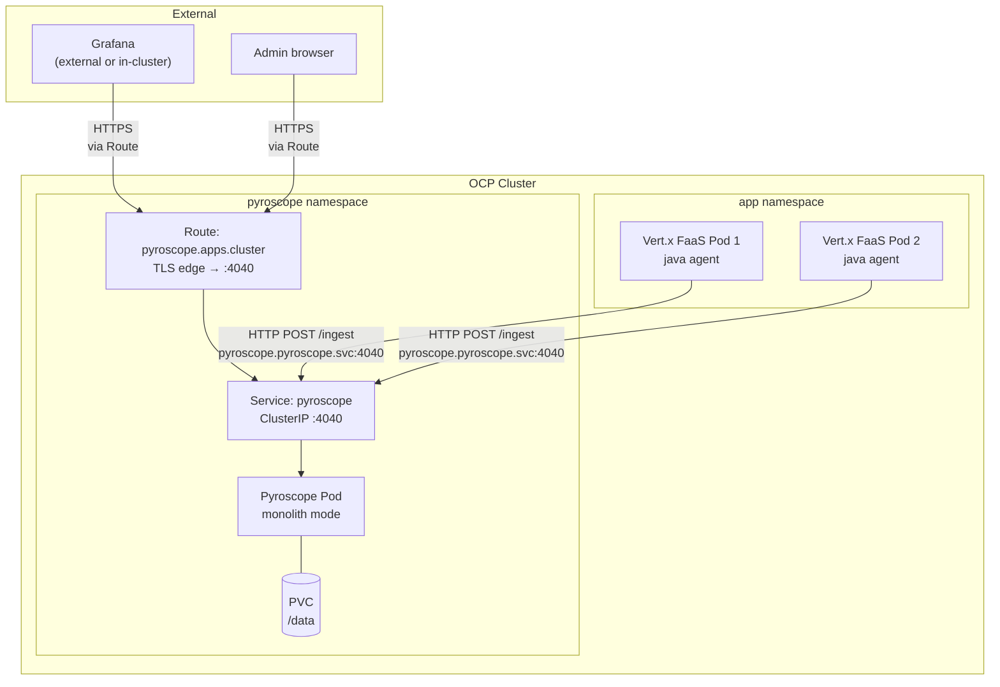
```mermaid
graph TB
    subgraph "OCP Cluster"
        subgraph "pyroscope namespace"
            PyroSvc["Service: pyroscope<br/>ClusterIP :4040"]
            PyroPod["Pyroscope Pod<br/>monolith mode"]
            PVC[("PVC<br/>/data")]
            Route["Route: pyroscope.apps.cluster<br/>TLS edge → :4040"]

            PyroSvc --> PyroPod
            PyroPod --- PVC
            Route --> PyroSvc
        end

        subgraph "app namespace"
            App1["Vert.x FaaS Pod 1<br/>java agent"]
            App2["Vert.x FaaS Pod 2<br/>java agent"]
        end
    end

    subgraph "External"
        ExtGrafana["Grafana<br/>(external or in-cluster)"]
        Admin["Admin browser"]
    end

    App1 -->|"HTTP POST /ingest<br/>pyroscope.pyroscope.svc:4040"| PyroSvc
    App2 -->|"HTTP POST /ingest<br/>pyroscope.pyroscope.svc:4040"| PyroSvc

    ExtGrafana -->|"HTTPS<br/>via Route"| Route
    Admin -->|"HTTPS<br/>via Route"| Route
```

**Key characteristics:**
- Agent-to-Pyroscope traffic stays within the cluster SDN (no firewall rules needed)
- External access via OCP Route with TLS edge termination
- NetworkPolicy can restrict which namespaces reach port 4040

---

### 3d. VM Microservices (Docker Compose)

All 7 Pyroscope components run as separate containers on a single VM (or spread across
VMs with shared block storage or S3-compatible object storage). Memberlist gossip coordinates the hash ring.

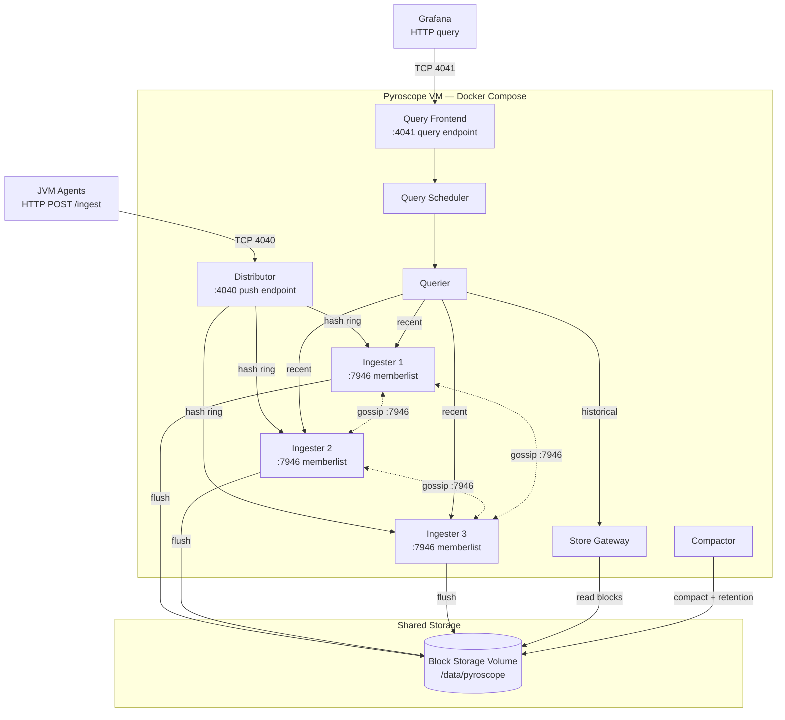
```mermaid
graph TB
    Agent["JVM Agents<br/>HTTP POST /ingest"]
    Grafana["Grafana<br/>HTTP query"]

    subgraph "Pyroscope VM — Docker Compose"
        DIST["Distributor<br/>:4040 push endpoint"]
        ING1["Ingester 1<br/>:7946 memberlist"]
        ING2["Ingester 2<br/>:7946 memberlist"]
        ING3["Ingester 3<br/>:7946 memberlist"]
        QF["Query Frontend<br/>:4041 query endpoint"]
        QS["Query Scheduler"]
        Q["Querier"]
        SG["Store Gateway"]
        C["Compactor"]

        DIST -->|"hash ring"| ING1
        DIST -->|"hash ring"| ING2
        DIST -->|"hash ring"| ING3

        QF --> QS --> Q
        Q -->|"recent"| ING1
        Q -->|"recent"| ING2
        Q -->|"recent"| ING3
        Q -->|"historical"| SG

        ING1 <-.->|"gossip :7946"| ING2
        ING2 <-.->|"gossip :7946"| ING3
        ING3 <-.->|"gossip :7946"| ING1
    end

    subgraph "Shared Storage"
        BS[("Block Storage Volume<br/>/data/pyroscope")]
    end

    Agent -->|"TCP 4040"| DIST
    Grafana -->|"TCP 4041"| QF

    ING1 -->|"flush"| BS
    ING2 -->|"flush"| BS
    ING3 -->|"flush"| BS
    SG -->|"read blocks"| BS
    C -->|"compact + retention"| BS
```

**Key characteristics:**
- Distributor on port 4040 (agent push), query-frontend on port 4041 (Grafana queries)
- Memberlist gossip on TCP+UDP 7946 between ingesters (container network only)
- Block storage mount at `/data/pyroscope` shared by all containers (or S3-compatible object storage)
- Compactor runs continuously in the background

---

### 3e. OCP Microservices (Helm chart — Phase 3)

Full distributed deployment on OpenShift. Each component is a separate Deployment with
its own Service. Headless service for memberlist discovery.

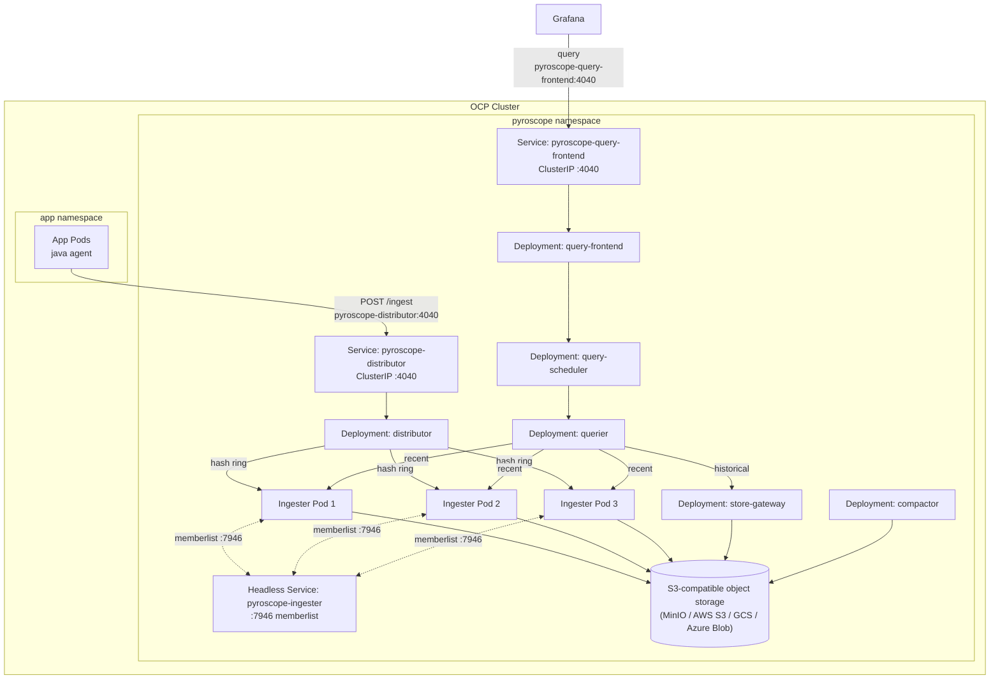
```mermaid
graph TB
    subgraph "OCP Cluster"
        subgraph "pyroscope namespace"
            DistSvc["Service: pyroscope-distributor<br/>ClusterIP :4040"]
            DistDeploy["Deployment: distributor"]

            QFSvc["Service: pyroscope-query-frontend<br/>ClusterIP :4040"]
            QFDeploy["Deployment: query-frontend"]

            QSDeploy["Deployment: query-scheduler"]
            QDeploy["Deployment: querier"]

            IngSvc["Headless Service: pyroscope-ingester<br/>:7946 memberlist"]
            Ing1["Ingester Pod 1"]
            Ing2["Ingester Pod 2"]
            Ing3["Ingester Pod 3"]

            SGDeploy["Deployment: store-gateway"]
            CDeploy["Deployment: compactor"]

            S3[("S3-compatible object storage<br/>(MinIO / AWS S3 / GCS / Azure Blob)")]

            DistSvc --> DistDeploy
            QFSvc --> QFDeploy

            DistDeploy -->|"hash ring"| Ing1
            DistDeploy -->|"hash ring"| Ing2
            DistDeploy -->|"hash ring"| Ing3

            QFDeploy --> QSDeploy --> QDeploy
            QDeploy -->|"recent"| Ing1
            QDeploy -->|"recent"| Ing2
            QDeploy -->|"recent"| Ing3
            QDeploy -->|"historical"| SGDeploy

            Ing1 <-.->|"memberlist :7946"| IngSvc
            Ing2 <-.->|"memberlist :7946"| IngSvc
            Ing3 <-.->|"memberlist :7946"| IngSvc

            Ing1 --> S3
            Ing2 --> S3
            Ing3 --> S3
            SGDeploy --> S3
            CDeploy --> S3
        end

        subgraph "app namespace"
            AppPods["App Pods<br/>java agent"]
        end
    end

    ExtGrafana["Grafana"]

    AppPods -->|"POST /ingest<br/>pyroscope-distributor:4040"| DistSvc
    ExtGrafana -->|"query<br/>pyroscope-query-frontend:4040"| QFSvc
```

**Key characteristics:**
- Agents push to `pyroscope-distributor.pyroscope.svc:4040`
- Grafana queries `pyroscope-query-frontend.pyroscope.svc:4040`
- Headless service enables memberlist peer discovery via DNS SRV records
- PVC must be RWX (ReadWriteMany) -- block storage backed (ODF/OCS, CephFS on block devices) or S3-compatible object storage
- NetworkPolicy can restrict inter-namespace traffic

---

### 3f. Hybrid: VM Pyroscope (Nginx TLS) + OCP Agents

The current production topology. Pyroscope and Nginx run as Docker containers on a
dedicated VM. Nginx terminates TLS on :4040. OCP-hosted application pods push
profiles across the network boundary via an F5 VIP.

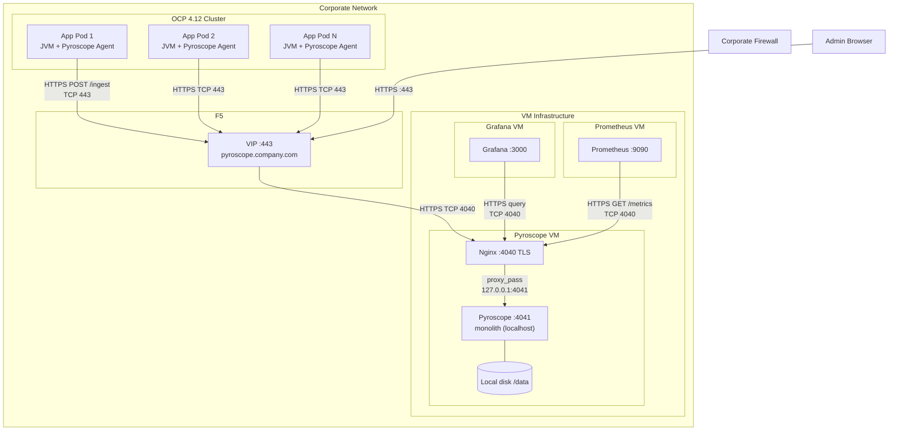
```mermaid
graph TB
    subgraph "Corporate Network"
        subgraph "OCP 4.12 Cluster"
            FaaS1["App Pod 1<br/>JVM + Pyroscope Agent"]
            FaaS2["App Pod 2<br/>JVM + Pyroscope Agent"]
            FaaSN["App Pod N<br/>JVM + Pyroscope Agent"]
        end

        subgraph "F5"
            VIP["VIP :443<br/>pyroscope.company.com"]
        end

        subgraph "VM Infrastructure"
            subgraph "Pyroscope VM"
                Nginx["Nginx :4040 TLS"]
                Pyro["Pyroscope :4041<br/>monolith (localhost)"]
                Vol[("Local disk /data")]
                Nginx -->|"proxy_pass<br/>127.0.0.1:4041"| Pyro
                Pyro --- Vol
            end

            subgraph "Grafana VM"
                Grafana["Grafana :3000"]
            end

            subgraph "Prometheus VM"
                Prom["Prometheus :9090"]
            end
        end

        FaaS1 -->|"HTTPS POST /ingest<br/>TCP 443"| VIP
        FaaS2 -->|"HTTPS TCP 443"| VIP
        FaaSN -->|"HTTPS TCP 443"| VIP
        VIP -->|"HTTPS TCP 4040"| Nginx

        Grafana -->|"HTTPS query<br/>TCP 4040"| Nginx
        Prom -->|"HTTPS GET /metrics<br/>TCP 4040"| Nginx
    end

    Firewall["Corporate Firewall"]
    Admin["Admin Browser"]

    Admin -->|"HTTPS :443"| VIP
```

**Key characteristics:**
- All external traffic is HTTPS — Nginx TLS terminates on :4040, proxies to Pyroscope on :4041
- Agents push via F5 VIP :443; F5 forwards to VM :4040 (HTTPS)
- Port 4041 is internal only (localhost) — never exposed externally
- Pyroscope never initiates outbound connections to OCP
- Grafana and Prometheus connect to Nginx :4040 (HTTPS)
- All traffic within the corporate network; no public internet exposure

---

## 4. Data Flow Diagrams

### 4a. Write path (agent to storage)

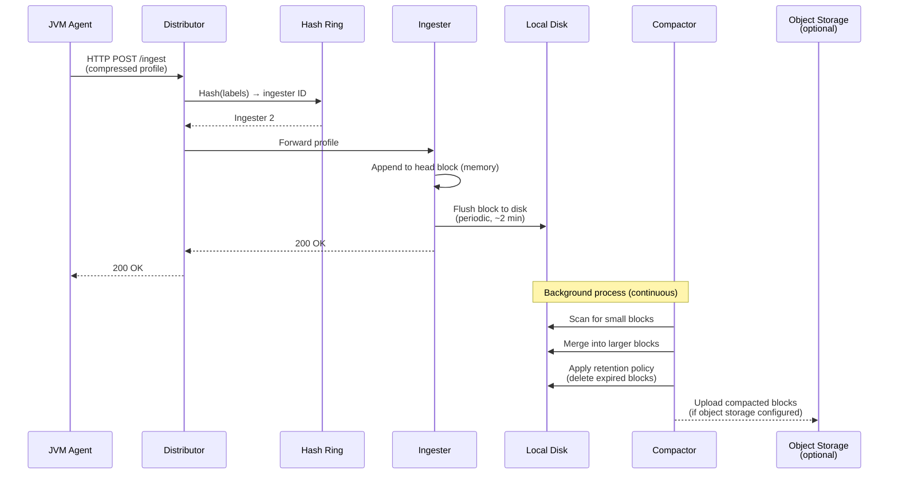
```mermaid
sequenceDiagram
    participant Agent as JVM Agent
    participant Dist as Distributor
    participant Ring as Hash Ring
    participant Ing as Ingester
    participant Disk as Local Disk
    participant Comp as Compactor
    participant Store as Object Storage<br/>(optional)

    Agent->>Dist: HTTP POST /ingest<br/>(compressed profile)
    Dist->>Ring: Hash(labels) → ingester ID
    Ring-->>Dist: Ingester 2
    Dist->>Ing: Forward profile
    Ing->>Ing: Append to head block (memory)
    Ing->>Disk: Flush block to disk<br/>(periodic, ~2 min)
    Ing-->>Dist: 200 OK
    Dist-->>Agent: 200 OK

    Note over Comp,Disk: Background process (continuous)
    Comp->>Disk: Scan for small blocks
    Comp->>Disk: Merge into larger blocks
    Comp->>Disk: Apply retention policy<br/>(delete expired blocks)
    Comp-->>Store: Upload compacted blocks<br/>(if object storage configured)
```

**Write path summary:**
1. JVM agent samples the call stack (every 10ms by default)
2. Agent batches samples and HTTP POSTs a compressed profile to `/ingest` every 10 seconds
3. Distributor hashes the profile labels to determine the target ingester
4. Ingester appends the profile to its in-memory head block
5. Head blocks are periodically flushed to disk (~2 minutes)
6. Compactor merges small blocks and enforces retention in the background

---

### 4b. Read path (query to response)

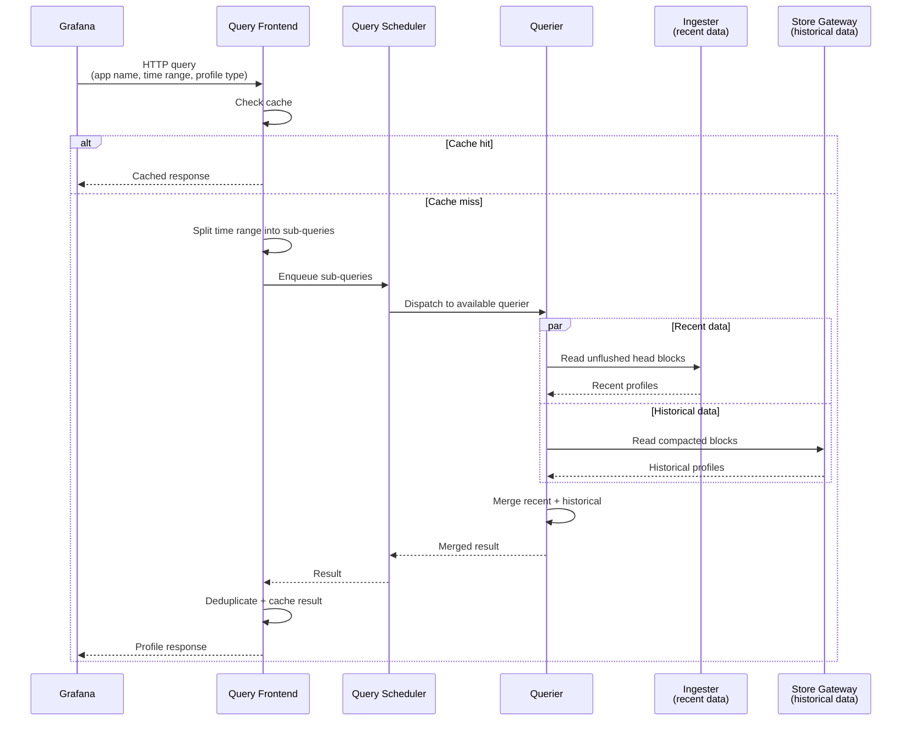
```mermaid
sequenceDiagram
    participant Grafana as Grafana
    participant QF as Query Frontend
    participant QS as Query Scheduler
    participant Q as Querier
    participant Ing as Ingester<br/>(recent data)
    participant SG as Store Gateway<br/>(historical data)

    Grafana->>QF: HTTP query<br/>(app name, time range, profile type)
    QF->>QF: Check cache
    alt Cache hit
        QF-->>Grafana: Cached response
    else Cache miss
        QF->>QF: Split time range into sub-queries
        QF->>QS: Enqueue sub-queries
        QS->>Q: Dispatch to available querier
        par Recent data
            Q->>Ing: Read unflushed head blocks
            Ing-->>Q: Recent profiles
        and Historical data
            Q->>SG: Read compacted blocks
            SG-->>Q: Historical profiles
        end
        Q->>Q: Merge recent + historical
        Q-->>QS: Merged result
        QS-->>QF: Result
        QF->>QF: Deduplicate + cache result
        QF-->>Grafana: Profile response
    end
```

**Read path summary:**
1. Grafana sends a query with app name, time range, and profile type
2. Query-frontend checks its cache; on miss, it splits wide time ranges into sub-queries
3. Query-scheduler distributes sub-queries to available queriers
4. Querier reads from both ingesters (recent, unflushed data) and store-gateway (historical, compacted data) in parallel
5. Querier merges both result sets
6. Query-frontend deduplicates overlapping results and caches the final response

---

### 4c. Agent push flow

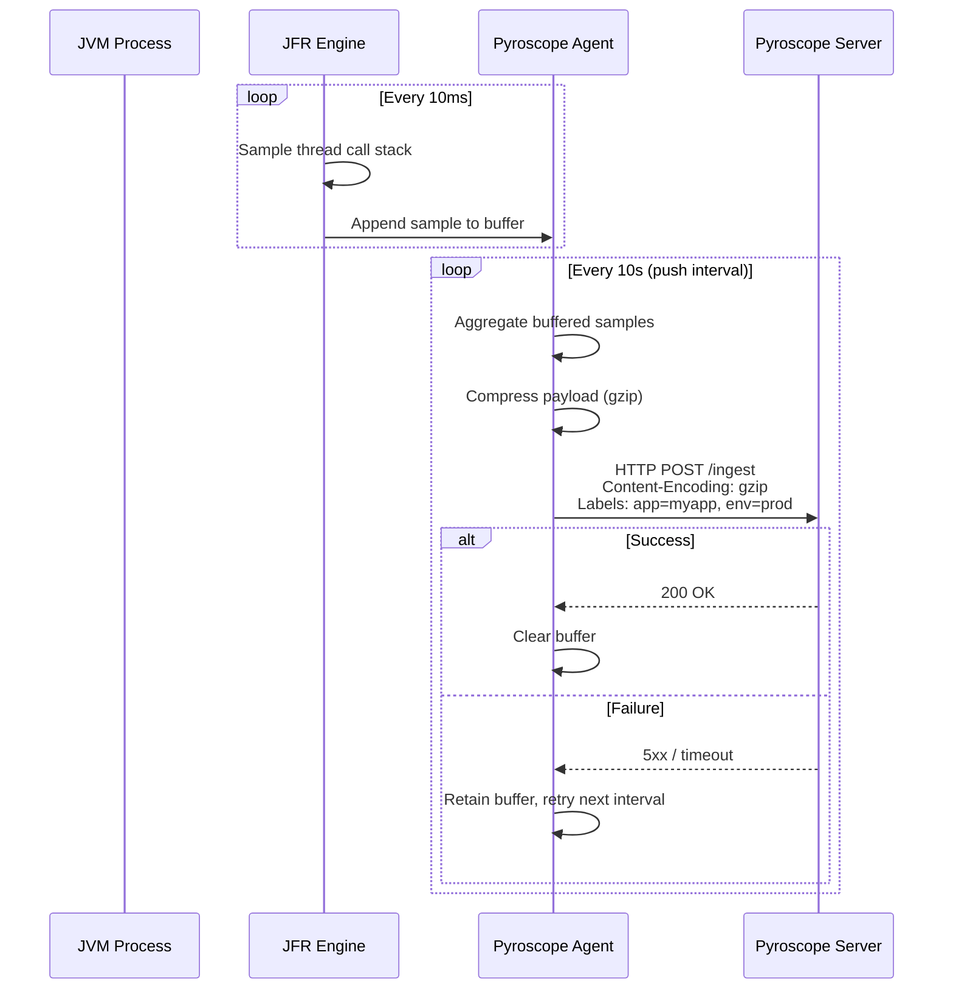
```mermaid
sequenceDiagram
    participant JVM as JVM Process
    participant JFR as JFR Engine
    participant PA as Pyroscope Agent
    participant Pyro as Pyroscope Server

    loop Every 10ms
        JFR->>JFR: Sample thread call stack
        JFR->>PA: Append sample to buffer
    end

    loop Every 10s (push interval)
        PA->>PA: Aggregate buffered samples
        PA->>PA: Compress payload (gzip)
        PA->>Pyro: HTTP POST /ingest<br/>Content-Encoding: gzip<br/>Labels: app=myapp, env=prod
        alt Success
            Pyro-->>PA: 200 OK
            PA->>PA: Clear buffer
        else Failure
            Pyro-->>PA: 5xx / timeout
            PA->>PA: Retain buffer, retry next interval
        end
    end
```

**Agent push summary:**
1. JFR (Java Flight Recorder) samples the thread call stack every ~10ms
2. The Pyroscope Java agent collects samples into an in-memory buffer
3. Every 10 seconds, the agent compresses and POSTs the profile to the Pyroscope server
4. On success (200 OK), the buffer is cleared; on failure, samples are retained for the next push

---

## 5. Network Boundaries

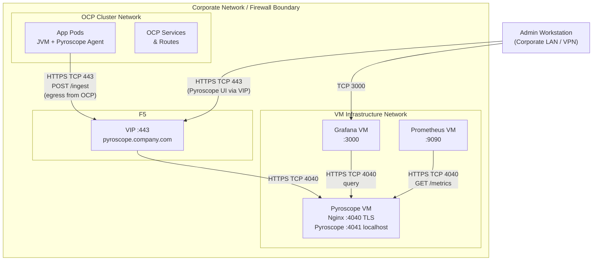
```mermaid
graph TB
    subgraph "Corporate Network / Firewall Boundary"
        subgraph "OCP Cluster Network"
            direction TB
            OCPPods["App Pods<br/>JVM + Pyroscope Agent"]
            OCPSvc["OCP Services<br/>& Routes"]
        end

        subgraph "F5"
            VIP["VIP :443<br/>pyroscope.company.com"]
        end

        subgraph "VM Infrastructure Network"
            direction TB
            NginxVM["Pyroscope VM<br/>Nginx :4040 TLS<br/>Pyroscope :4041 localhost"]
            GrafVM["Grafana VM<br/>:3000"]
            PromVM["Prometheus VM<br/>:9090"]
        end
    end

    AdminNet["Admin Workstation<br/>(Corporate LAN / VPN)"]

    OCPPods -->|"HTTPS TCP 443<br/>POST /ingest<br/>(egress from OCP)"| VIP
    VIP -->|"HTTPS TCP 4040"| NginxVM
    GrafVM -->|"HTTPS TCP 4040<br/>query"| NginxVM
    PromVM -->|"HTTPS TCP 4040<br/>GET /metrics"| NginxVM
    AdminNet -->|"HTTPS TCP 443<br/>(Pyroscope UI via VIP)"| VIP
    AdminNet -->|"TCP 3000"| GrafVM
```

### Boundary crossing summary

| Source Zone | Destination Zone | Port | Protocol | Direction | Purpose |
|-------------|------------------|------|----------|-----------|---------|
| OCP cluster | F5 VIP | TCP 443 | HTTPS | OCP egress | Agent push (`POST /ingest`) via VIP |
| F5 VIP | VM infrastructure | TCP 4040 | HTTPS | F5 → VM | Nginx TLS termination on Pyroscope VM |
| VM infrastructure | VM infrastructure | TCP 4040 | HTTPS | Internal | Grafana queries, Prometheus scrape → Nginx TLS |
| Corporate LAN | F5 VIP | TCP 443 | HTTPS | Ingress | Admin access to Pyroscope UI |
| Corporate LAN | VM infrastructure | TCP 3000 | HTTP | Ingress | Admin access to Grafana UI |
| OCP cluster (microservices) | OCP cluster (microservices) | TCP 7946 | TCP+UDP | Internal | Memberlist gossip (ingesters only) |
| OCP cluster (microservices) | OCP cluster (microservices) | TCP 4040 | HTTP | Internal | Inter-component communication |

> **Port 4041 does not appear above.** It is localhost-only on the Pyroscope VM.
> Nginx proxies `0.0.0.0:4040 → 127.0.0.1:4041`. Never open 4041 externally.
>
> **Outbound from Pyroscope:** None. Pyroscope does not initiate connections to agents,
> Grafana, or Prometheus. All traffic is inbound to the Pyroscope server.

---

## 6. Storage Architecture

### Single monolith mode (Phase 1a)

```
Pyroscope container
└── /data/                          ← Docker volume (local filesystem)
    ├── head/                       ← In-memory blocks flushed to disk
    │   └── <tenant>/<block-id>/    ← Per-tenant block directories
    ├── local/                      ← Compacted blocks (long-term)
    │   └── <tenant>/<block-id>/
    └── wal/                        ← Write-ahead log for crash recovery
```

- **Volume:** Docker named volume (`pyroscope-data`) or bind mount
- **Sizing:** ~1 GB per 10 profiled JVMs per day (varies with profile frequency and cardinality)
- **Backup:** Snapshot the Docker volume or `/data` directory

### Multi-VM monolith (Phase 2 — block storage)

```
Shared Block Storage (SAN/iSCSI)
└── /data/pyroscope/                <- Mounted on both VMs
    ├── head/                       <- Both VMs read/write (active-passive)
    │   └── <tenant>/<block-id>/
    ├── local/                      <- Compacted blocks (shared reads)
    │   └── <tenant>/<block-id>/
    └── wal/                        <- Write-ahead log
```

- **Volume:** Shared block storage (SAN LUN, iSCSI target) with clustered filesystem (GFS2) or enterprise SAN with shared LUN
- **Access:** Both VMs mount the same volume at `/data/pyroscope`
- **Mode:** Active-passive recommended to avoid write conflicts
- **Sizing:** Same per-JVM estimate as monolith; shared across VMs

### Microservices mode (Phase 3)

```
Block Storage / RWX PVC (or S3-compatible object storage)
└── /data/pyroscope/                <- Mounted by all ingesters, store-gateway, compactor
    ├── head/                       ← Each ingester writes to its own subdirectory
    │   ├── ingester-0/<block-id>/
    │   ├── ingester-1/<block-id>/
    │   └── ingester-2/<block-id>/
    ├── local/                      ← Compacted blocks (shared reads)
    │   └── <tenant>/<block-id>/
    └── wal/                        ← Per-ingester WAL directories (local disk)
```

- **Volume:** Block storage mount at `/data/pyroscope` (VM) or RWX PVC (K8s/OCP), or S3-compatible object storage
- **Storage class:** Must support ReadWriteMany if using block storage (ODF/OCS with CephFS on block devices); alternatively use S3-compatible object storage
- **Sizing:** Same per-JVM estimate; scale with number of ingesters

### Object storage (optional)

For long-term retention beyond local disk capacity, Pyroscope supports S3-compatible
or GCS object storage. Compacted blocks are uploaded; the store-gateway serves reads.

```yaml
# pyroscope.yaml snippet
storage:
  backend: s3
  s3:
    bucket_name: pyroscope-profiles
    endpoint: s3.amazonaws.com
    region: us-east-1
```

### Retention policy

- **Default:** Unlimited (blocks are kept indefinitely)
- **Configuration:** Set `compactor.blocks_retention_period` in `pyroscope.yaml`
- **Example:** `compactor.blocks_retention_period: 30d` deletes blocks older than 30 days

---

## 7. Port Matrix Summary

Quick reference for firewall rules and network policy configuration.

### All ports

| Port | Protocol | Component | Listens on | Mode | Purpose |
|------|----------|-----------|:----------:|------|---------|
| **443** | TCP / HTTPS | F5 VIP | F5 | VM Monolith (production) | VIP entry point. F5 forwards to Nginx on VM :4040 |
| **4040** | TCP / HTTPS | Nginx TLS proxy | `0.0.0.0` on VM | VM Monolith (production) | TLS termination. Accepts agent push, Grafana queries, Prometheus scrape. Proxies to Pyroscope :4041 |
| **4041** | TCP / HTTP | Pyroscope monolith | `127.0.0.1` on VM | VM Monolith (production) | **Internal only.** Nginx → Pyroscope. Never exposed externally |
| **4040** | TCP / HTTP | Distributor | `0.0.0.0` in pod | OCP Microservices | Agent push (`POST /ingest`). Distributor routes to ingesters via hash ring |
| **4040** | TCP / HTTP | All components | `0.0.0.0` in pod | OCP Microservices | Inter-component HTTP (querier↔ingester, querier↔store-gateway, query-frontend↔scheduler) |
| **4041** | TCP / HTTP | Query Frontend | `0.0.0.0` in container | VM Microservices (Compose) | Grafana query endpoint (host-mapped port in Docker Compose) |
| **7946** | TCP + UDP | Ingester memberlist | `0.0.0.0` in pod | Microservices (all) | Hash ring gossip, peer discovery, ring state propagation |
| **9404** | TCP / HTTP | JMX Exporter (in app pods) | `0.0.0.0` in pod | All (optional) | Prometheus scrape for JVM metrics (heap, GC, threads) |
| **3000** | TCP / HTTP | Grafana | `0.0.0.0` | All (if deployed) | Grafana web UI and API |
| **443** | TCP / HTTPS | OCP Route | Cluster router | OCP Microservices | TLS edge termination for external Grafana access to query-frontend |

### Mode-specific port requirements

| Deployment Mode | External Ports | Internal Ports | Notes |
|-----------------|:-------------:|:--------------:|-------|
| **VM Monolith + Nginx TLS** (production default) | 443 (VIP), 4040 (Nginx TLS on VM) | 4041 (Pyroscope localhost) | Nginx terminates TLS on :4040, proxies to :4041. Never open 4041 externally |
| OCP Monolith | 443 (Route) | 4040 (cluster-internal) | Cluster SDN handles internal routing |
| VM Microservices (Compose) | 4040 (push), 4041 (query) | 7946 (memberlist) | Memberlist is container-network only |
| **OCP Microservices** (production HA) | 443 (Route) | 4040 (per-component), 7946 (memberlist) | All internal to cluster SDN. Route exposes query-frontend |
| Hybrid (VM + OCP) | 443 (VIP), 4040 (Nginx TLS on VM) | 4041 (Pyroscope localhost) | Only HTTPS :443 crosses OCP-to-F5 boundary |
