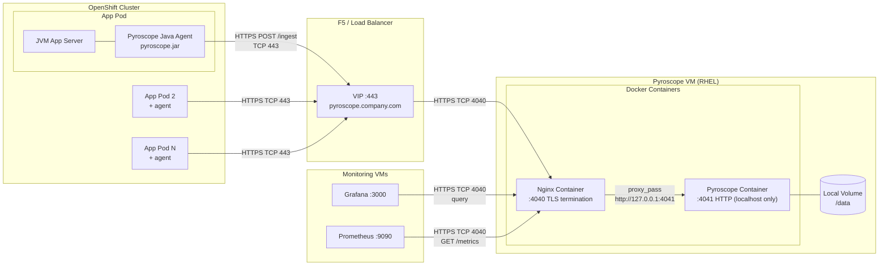
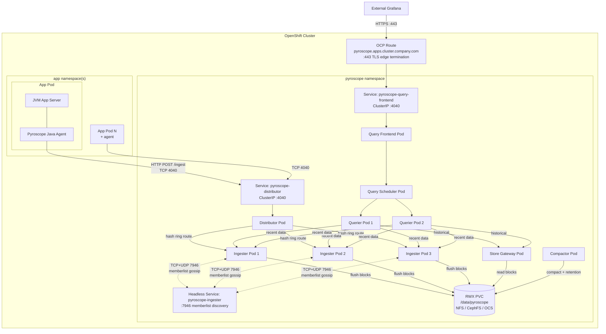

# Capacity Planning

Sizing formulas, worked examples, scaling triggers, networking requirements, and
enterprise scoping for Pyroscope infrastructure. Covers monolith mode (VM) and
microservices mode (OpenShift).

Target audience: platform engineers scoping deployments and presenting requirements
to infrastructure, network, and storage teams.

---

## Server Sizing

| Resource | Phase 1 (Up to 20 Svcs) | Medium (50 Svcs) | Large (100 Svcs) |
|----------|--------------------------|-------------------|-------------------|
| CPU      | 2 cores                  | 4 cores           | 8 cores           |
| Memory   | 4 GB                     | 8 GB              | 16 GB             |
| Disk     | 100 GB                   | 250 GB            | 500 GB            |
| Network  | < 1 Mbps                 | < 5 Mbps          | < 10 Mbps         |

> Monolith mode supports up to ~100 services. Beyond that, migrate to microservices mode.

See [adr/ADR-001-continuous-profiling.md](adr/ADR-001-continuous-profiling.md) for Phase 1 VM specification.

---

## Agent Overhead Per Pod

| Resource | Overhead          | Notes                                                            |
|----------|-------------------|------------------------------------------------------------------|
| CPU      | 3-8%              | JFR sampling, bounded by sample interval, does not increase with load |
| Memory   | 20-40 MB          | Agent buffer, constant regardless of application size            |
| Network  | 10-50 KB per push | Compressed profile data every 10 seconds (configurable)          |
| Disk     | 0                 | Agent stores nothing locally; profiles are pushed immediately    |

See [faq.md](faq.md) for overhead discussion.

---

## Storage Sizing Formula

```bash
storage_GB = services × data_rate_GB_per_month × retention_months
```

Where `data_rate` ranges from 1-5 GB/service/month depending on:

- Number of profile types enabled (CPU only: ~1 GB, all 4 types: ~5 GB)
- Label cardinality (more unique label combinations = more storage)
- Upload interval (default 10s; longer intervals reduce data)

### Retention vs Storage

Assuming 3 GB/service/month average:

| Retention | 10 Svcs | 20 Svcs | 50 Svcs | 100 Svcs |
|-----------|--------:|--------:|--------:|---------:|
| 1 day     |    1 GB |    2 GB |    5 GB |    10 GB |
| 7 days    |    7 GB |   14 GB |   35 GB |    70 GB |
| 30 days   |   30 GB |   60 GB |  150 GB |   300 GB |
| 90 days   |   90 GB |  180 GB |  450 GB |   900 GB |

> Default retention is unlimited. Set `compactor.blocks_retention_period` in pyroscope.yaml.

See [configuration-reference.md](configuration-reference.md) for retention configuration.

---

## Network Bandwidth

```bash
total_bandwidth_KB_s = services × avg_push_size_KB / push_interval_s
```

### Worked Example

- 50 services x 30 KB average push / 10s interval = 150 KB/s = ~1.2 Mbps
- This is well within typical VM network capacity
- Peak: 2-3x average during high-cardinality workloads

---

## Worked Sizing Examples

### 10 Services (POC / Phase 1 Start)

| Resource               | Specification                                  |
|------------------------|------------------------------------------------|
| VM                     | 2 CPU, 4 GB RAM                                |
| Disk                   | 50 GB (generous for POC, supports 30-day retention) |
| Network                | < 0.5 Mbps ingestion                           |
| Retention              | 7-30 days recommended                          |
| Monthly Storage Growth | ~30 GB at 30-day retention                     |

### 50 Services (Phase 1 Full Deployment)

| Resource               | Specification                                  |
|------------------------|------------------------------------------------|
| VM                     | 4 CPU, 8 GB RAM                                |
| Disk                   | 250 GB (supports 30-day retention)             |
| Network                | < 2 Mbps ingestion                             |
| Retention              | 7-30 days recommended                          |
| Monthly Storage Growth | ~150 GB at 30-day retention                    |

### 100 Services (Phase 1 Ceiling)

| Resource               | Specification                                  |
|------------------------|------------------------------------------------|
| VM                     | 8 CPU, 16 GB RAM                               |
| Disk                   | 500 GB (supports 30-day retention) or object storage |
| Network                | < 5 Mbps ingestion                             |
| Retention              | 7-14 days recommended (or use object storage for longer) |
| Migration              | Consider migration to microservices mode       |

---

## Scaling Triggers

| Trigger                    | Symptom                       | Action                                                          |
|----------------------------|-------------------------------|-----------------------------------------------------------------|
| Query latency > 10s        | Slow flame graph rendering    | Add CPU, reduce retention, or migrate to microservices          |
| Disk usage > 80%           | Low disk space alerts         | Expand disk, reduce retention, or enable object storage         |
| Ingestion drops            | Agents timing out on push     | Add CPU and memory, check network bandwidth                     |
| > 100 profiled services    | Approaching monolith ceiling  | Plan migration to microservices mode                            |

See [pyroscope-reference-guide.md](pyroscope-reference-guide.md) for detailed scaling guidance.

---

## Object Storage

For deployments exceeding 500 GB or requiring long retention (90+ days), consider object storage:

- S3-compatible (MinIO, AWS S3, Ceph RGW)
- GCS (Google Cloud Storage)

Object storage separates compute from storage -- the Pyroscope server no longer needs large local disk.

See [architecture.md](architecture.md) for object storage configuration.

---

## Monitoring Storage Growth

```bash
# Check Docker volume usage (VM deployments)
docker system df -v 2>/dev/null | grep pyroscope-data

# Check PVC usage (K8s/OCP deployments)
kubectl exec -n monitoring deploy/pyroscope -- df -h /data
```

See [monitoring-guide.md](monitoring-guide.md) for Prometheus-based storage alerts.

---

## Microservices Mode: Component Sizing

When monolith mode reaches its ceiling (~100 services), migrate to microservices mode.
Each component runs as a separate pod/container and can be scaled independently.

### Per-component resource recommendations

| Component | Replicas | CPU request | CPU limit | Memory request | Memory limit | Stateful | Notes |
|-----------|:--------:|:-----------:|:---------:|:--------------:|:------------:|:--------:|-------|
| **Distributor** | 1-2 | 0.5 | 2 | 512 Mi | 1 Gi | No | Scales with ingest rate. Add replicas if agent push latency > 100ms |
| **Ingester** | 3 | 1 | 4 | 2 Gi | 4 Gi | Yes | Memory-intensive — holds head blocks in RAM before flushing. 3 replicas for hash ring quorum |
| **Querier** | 2 | 1 | 4 | 1 Gi | 2 Gi | No | Scales with query concurrency. Add replicas for more simultaneous Grafana users |
| **Query Frontend** | 1 | 0.25 | 1 | 256 Mi | 512 Mi | No | Lightweight gateway. Rarely needs scaling |
| **Query Scheduler** | 1 | 0.25 | 1 | 256 Mi | 512 Mi | No | Queue manager. Single replica is sufficient |
| **Compactor** | 1 | 0.5 | 2 | 1 Gi | 2 Gi | No | Background process. Must be singleton (only 1 replica) |
| **Store Gateway** | 1 | 0.5 | 2 | 1 Gi | 2 Gi | No | Loads block index into memory. Scale if historical query latency is high |

### Aggregate sizing by scale

| Scale | Services | Total CPU (request) | Total Memory (request) | RWX Storage | Network |
|-------|:--------:|:-------------------:|:---------------------:|:-----------:|:-------:|
| Small | 50-100 | 8 cores | 12 Gi | 100 Gi | < 5 Mbps |
| Medium | 100-250 | 14 cores | 20 Gi | 250 Gi | < 10 Mbps |
| Large | 250-500 | 24 cores | 40 Gi | 500 Gi | < 25 Mbps |

### Storage requirements

| Type | Mount | Access mode | Storage class | Sizing |
|------|-------|:-----------:|---------------|--------|
| Profile data | `/data/pyroscope` | ReadWriteMany (RWX) | NFS, CephFS, OCS | See retention table above |

> **RWX is mandatory.** Ingesters, store-gateway, and compactor all read/write the same
> volume. ReadWriteOnce (RWO) does not work for microservices mode.

---

## Networking Requirements & Deployment Reference

> This section serves as a **standalone requirements document** for interfacing
> with infrastructure, network, storage, and security teams. Each deployment
> type includes: architecture diagram, components, port matrix, firewall rules,
> runtime requirements, and team scoping checklist.
>
> **See also:** [architecture.md § 7 Port Matrix](architecture.md#7-port-matrix-summary) |
> [deployment-guide.md §§ 17a-17e](deployment-guide.md#17a-firewall-rules-monolith-on-vm-http)

---

### Deployment Type A: VM Monolith (Nginx TLS) — Production Default

Docker containers on a dedicated VM. OCP-hosted JVM application pods run the
Pyroscope Java agent, which pushes profiles over HTTPS. Nginx terminates TLS on
port 4040 and forwards to the Pyroscope monolith on port 4041 (localhost only).

#### Architecture



#### Components on the VM

| Component | Image / Process | Port | Listens on | Purpose |
|-----------|----------------|:----:|:----------:|---------|
| **Nginx** | `nginx:alpine` or OS-installed | **4040** | `0.0.0.0` | TLS termination. Accepts HTTPS from F5 VIP, agents, Grafana, Prometheus. Forwards to Pyroscope on 127.0.0.1:4041 |
| **Pyroscope** | `grafana/pyroscope:1.18.0` | **4041** | `127.0.0.1` | Monolith mode. All 7 internal components (distributor, ingester, querier, query-frontend, query-scheduler, compactor, store-gateway) run in a single process |
| **Docker Engine** | `docker-ce` | — | — | Container runtime for Nginx and Pyroscope |

#### Components in each OCP App Pod

| Component | Artifact | Resource overhead | Purpose |
|-----------|----------|:-----------------:|---------|
| **Application JVM** | Your app server (e.g., Vert.x, Spring Boot, Quarkus) | — | Business logic |
| **Pyroscope Java Agent** | `pyroscope.jar` (attached via `JAVA_TOOL_OPTIONS=-javaagent:...`) | 3-5% CPU, ~30 MB RAM | Samples CPU, allocation, and lock contention via JFR. Pushes compressed profiles to Pyroscope every 10s |
| **JMX Exporter** (optional) | `jmx_prometheus_javaagent.jar` on port 9404 | < 1% CPU, ~10 MB RAM | Exposes JVM metrics (heap, GC, threads) as Prometheus metrics |

#### Port Matrix

| # | Source | Destination | Port | Protocol | Direction | Purpose |
|---|--------|-------------|:----:|----------|-----------|---------|
| 1 | OCP worker nodes | F5 VIP | **TCP 443** | HTTPS | OCP → F5 | Agent push (`POST /ingest` every 10s per pod) |
| 2 | F5 VIP | Pyroscope VM | **TCP 4040** | HTTPS | F5 → VM | F5 backend pool → Nginx TLS |
| 3 | Grafana VM | Pyroscope VM | **TCP 4040** | HTTPS | VM → VM | Datasource queries (on-demand) |
| 4 | Prometheus VM | Pyroscope VM | **TCP 4040** | HTTPS | VM → VM | Metrics scrape (`GET /metrics` every 15-30s) |
| 5 | Admin workstation | F5 VIP | **TCP 443** | HTTPS | LAN → F5 | Pyroscope UI via VIP |
| 6 | App pods (JMX Exporter) | Prometheus | **TCP 9404** | HTTP | OCP → Prom | JVM metrics scrape (if JMX Exporter enabled) |

> **Port 4041 is internal only.** Nginx proxies to `localhost:4041`. Do NOT
> open port 4041 in any firewall. No external traffic should reach Pyroscope directly.
>
> **Pyroscope never initiates outbound connections.** All traffic is inbound
> to the Pyroscope VM. No egress rules needed from the VM side.

#### VM Infrastructure Requirements

| Resource | Specification | Notes |
|----------|--------------|-------|
| OS | RHEL 8/9 | Hardened, enterprise-supported |
| CPU | 4 cores (up to 50 svcs), 8 cores (up to 100 svcs) | Pyroscope + Nginx |
| Memory | 8 GB (up to 50 svcs), 16 GB (up to 100 svcs) | Pyroscope in-memory head blocks |
| Disk | 250 GB local (50 svcs), 500 GB (100 svcs) | `/data` Docker volume for profiles |
| Docker | Docker CE or Podman | `docker` group for service account |
| TLS Certificate | Enterprise CA-signed cert for VIP FQDN | Mounted into Nginx container |
| Network | Static IP, DNS entry | F5 backend pool target |

#### Agent Configuration (in OCP pods)

```properties
# pyroscope.properties — mounted into each pod
pyroscope.server.address=https://pyroscope.company.com
pyroscope.format=jfr
pyroscope.profiler.event=itimer
pyroscope.profiler.interval=10ms
pyroscope.profiler.alloc=512k
pyroscope.profiler.lock=10ms
pyroscope.upload.interval=10s
pyroscope.log.level=warn
```

```yaml
# Pod spec — attach agent via JAVA_TOOL_OPTIONS (no code changes)
env:
  - name: JAVA_TOOL_OPTIONS
    value: "-javaagent:/opt/pyroscope/pyroscope.jar"
  - name: PYROSCOPE_APPLICATION_NAME
    value: "my-app-name"
  - name: PYROSCOPE_CONFIGURATION_FILE
    value: "/opt/pyroscope/pyroscope.properties"
```

#### OCP Egress Policy (if default-deny)

```yaml
apiVersion: networking.k8s.io/v1
kind: NetworkPolicy
metadata:
  name: allow-pyroscope-egress
  namespace: my-app-namespace
spec:
  podSelector: {}
  policyTypes:
    - Egress
  egress:
    - to:
        - ipBlock:
            cidr: <F5_VIP_IP>/32
      ports:
        - protocol: TCP
          port: 443
```

---

### Deployment Type B: OCP Microservices — Full OpenShift Deployment

All Pyroscope components run as separate pods in a dedicated OpenShift namespace.
JVM application pods push profiles to the distributor service over the cluster SDN.
No cross-boundary firewall rules needed for agent traffic.

#### Architecture



#### Pyroscope Components — What Each Does

| Component | Replicas | Stateful | CPU req/limit | Memory req/limit | Port | Role |
|-----------|:--------:|:--------:|:-------------:|:----------------:|:----:|------|
| **Distributor** | 1-2 | No | 0.5 / 2 | 512 Mi / 1 Gi | 4040 | Receives `POST /ingest` from agents. Hashes profile labels and routes to the correct ingester via the consistent hash ring. Scale if agent push latency > 100ms |
| **Ingester** | 3 | Yes | 1 / 4 | 2 Gi / 4 Gi | 4040, 7946 | Accepts profiles from distributor, writes to in-memory head blocks, flushes to shared storage. Participates in memberlist gossip (port 7946) for hash ring. 3 replicas for quorum |
| **Querier** | 2 | No | 1 / 4 | 1 Gi / 2 Gi | 4040 | Executes profile queries: reads recent data from ingesters + historical data from store-gateway, merges results. Scale with concurrent Grafana users |
| **Query Frontend** | 1 | No | 0.25 / 1 | 256 Mi / 512 Mi | 4040 | Entry point for all Grafana queries. Provides caching, time-range splitting, retries, and deduplication. Rarely needs scaling |
| **Query Scheduler** | 1 | No | 0.25 / 1 | 256 Mi / 512 Mi | 4040 | Sits between query-frontend and queriers. Maintains query queue and distributes across available querier replicas |
| **Compactor** | 1 | No | 0.5 / 2 | 1 Gi / 2 Gi | 4040 | Background process: merges small blocks into larger ones for query efficiency, enforces retention policy. **Must be singleton** (only 1 replica) |
| **Store Gateway** | 1 | No | 0.5 / 2 | 1 Gi / 2 Gi | 4040 | Serves historical profile data from long-term storage. Loads block index into memory for fast lookups. Scale if historical query latency is high |

**Aggregate resource requirements:**

| Scale | Profiled services | Total CPU (request) | Total Memory (request) | RWX Storage | Network |
|-------|:-----------------:|:-------------------:|:---------------------:|:-----------:|:-------:|
| Small | 50-100 | 8 cores | 12 Gi | 100 Gi | < 5 Mbps |
| Medium | 100-250 | 14 cores | 20 Gi | 250 Gi | < 10 Mbps |
| Large | 250-500 | 24 cores | 40 Gi | 500 Gi | < 25 Mbps |

#### Components in each OCP App Pod (same as VM Monolith)

| Component | Artifact | Resource overhead | Purpose |
|-----------|----------|:-----------------:|---------|
| **Application JVM** | Your app server | — | Business logic |
| **Pyroscope Java Agent** | `pyroscope.jar` via `JAVA_TOOL_OPTIONS` | 3-5% CPU, ~30 MB RAM | Profiles CPU, alloc, lock. Pushes to distributor every 10s |
| **JMX Exporter** (optional) | `jmx_prometheus_javaagent.jar` on port 9404 | < 1% CPU, ~10 MB RAM | JVM metrics for Prometheus |

#### Port Matrix

**Intra-cluster traffic (handled by OCP SDN — no firewall rules needed):**

| # | Source | Destination | Port | Protocol | Purpose |
|---|--------|-------------|:----:|----------|---------|
| 1 | App pods (any namespace) | `pyroscope-distributor.pyroscope.svc` | **TCP 4040** | HTTP | Agent push (`POST /ingest`) |
| 2 | Query Frontend | Query Scheduler | **TCP 4040** | HTTP | Query enqueue |
| 3 | Query Scheduler | Querier pods | **TCP 4040** | HTTP | Query dispatch |
| 4 | Querier | Ingester pods | **TCP 4040** | HTTP | Read recent (unflushed) data |
| 5 | Querier | Store Gateway | **TCP 4040** | HTTP | Read historical (compacted) data |
| 6 | Distributor | Ingester pods | **TCP 4040** | HTTP | Profile write path |
| 7 | Ingester ↔ Ingester | Headless Service | **TCP 7946** | Memberlist | Hash ring gossip |
| 8 | Ingester ↔ Ingester | Headless Service | **UDP 7946** | Memberlist | Ring state propagation |

**External access:**

| # | Source | Destination | Port | Protocol | Purpose |
|---|--------|-------------|:----:|----------|---------|
| 9 | External Grafana | OCP Route | **TCP 443** | HTTPS | Datasource queries via TLS edge termination |
| 10 | Prometheus | Any Pyroscope component | **TCP 4040** | HTTP | Metrics scrape (`GET /metrics`) |

#### OCP Platform Requirements

| Resource | Specification | Notes |
|----------|--------------|-------|
| Namespace | `pyroscope` (dedicated) | Resource quota: 16 CPU, 24 Gi memory minimum |
| RBAC | ServiceAccount with Deployment, Service, PVC, ConfigMap permissions | For Helm chart deployment |
| Storage | RWX PersistentVolumeClaim — 100-500 Gi | **Must be ReadWriteMany** (NFS, CephFS, or OCS). RWO does not work — ingesters, store-gateway, and compactor all read/write the same volume |
| Route | TLS edge termination | Hostname: `pyroscope.apps.cluster.company.com` |
| SCC | `restricted` (default) is sufficient | No privileged containers needed |
| Image | `grafana/pyroscope:1.18.0` | All 7 components use the same image with different `-target=` flags |

#### Agent Configuration (in app pods — same for both modes)

```yaml
# Pod spec — OCP microservices mode points to distributor service
env:
  - name: JAVA_TOOL_OPTIONS
    value: "-javaagent:/opt/pyroscope/pyroscope.jar"
  - name: PYROSCOPE_APPLICATION_NAME
    value: "my-app-name"
  - name: PYROSCOPE_SERVER_ADDRESS
    value: "http://pyroscope-distributor.pyroscope.svc:4040"
  - name: PYROSCOPE_FORMAT
    value: "jfr"
```

#### NetworkPolicy (restrict which namespaces can push)

```yaml
apiVersion: networking.k8s.io/v1
kind: NetworkPolicy
metadata:
  name: pyroscope-ingress
  namespace: pyroscope
spec:
  podSelector: {}
  policyTypes:
    - Ingress
  ingress:
    # Allow agent push from app namespaces
    - from:
        - namespaceSelector:
            matchLabels:
              kubernetes.io/metadata.name: my-app-namespace
      ports:
        - protocol: TCP
          port: 4040
    # Allow intra-namespace traffic (component-to-component + memberlist)
    - from:
        - podSelector: {}
      ports:
        - protocol: TCP
          port: 4040
        - protocol: TCP
          port: 7946
        - protocol: UDP
          port: 7946
```

> **Memberlist port 7946 must be open between ingester pods.** If your OCP
> cluster has default-deny NetworkPolicy, ensure TCP+UDP 7946 is allowed
> within the pyroscope namespace.

---

## Enterprise Scoping: What to Ask Other Teams

Use these checklists when coordinating with infrastructure, network, storage, and
security teams. Hand the relevant section directly to each team.

### VM Monolith with Nginx TLS (Phase 1)

| Team | What to request | Lead time | Details |
|------|----------------|:---------:|---------|
| **VM / Infrastructure** | RHEL VM — 4 CPU, 8 GB RAM, 250 GB disk | 1-2 weeks | Docker CE installed, `docker` group for service account |
| **VM / Infrastructure** | Docker images: `grafana/pyroscope:1.18.0`, `nginx:alpine` | Days | Pull to VM or load from air-gapped tarball |
| **Network** | F5 VIP + DNS entry (e.g., `pyroscope.company.com`) → VM IP:4040 | 2-4 weeks | Backend pool health check: `GET /ready` on port 4040 |
| **Network** | Firewall rule: OCP worker nodes → F5 VIP, TCP 443 | 1-2 weeks | HTTPS (agent push + Grafana queries) |
| **Network** | Firewall rule: F5 VIP → VM IP, TCP 4040 | 1-2 weeks | HTTPS (Nginx TLS termination) |
| **Network** | Firewall rule: Grafana VM / Prometheus VM → VM IP, TCP 4040 | 1-2 weeks | HTTPS (datasource queries + metrics scrape) |
| **Security / PKI** | TLS certificate for VIP FQDN | 1-2 weeks | CSR signed by enterprise CA, mounted into Nginx container |
| **Monitoring** | Prometheus scrape target: `https://VM_IP:4040/metrics` | Days | Standard service discovery or static config |
| **Grafana** | Pyroscope datasource | Days | URL: `https://pyroscope.company.com` |

### OCP Microservices (Phase 2)

| Team | What to request | Lead time | Details |
|------|----------------|:---------:|---------|
| **OCP Platform** | Dedicated namespace (`pyroscope`) | Days | Resource quota: 16 CPU, 24 Gi memory |
| **OCP Platform** | RBAC: service account with Deployment/Service/PVC/ConfigMap permissions | Days | For Helm chart deployment |
| **OCP Platform** | OCP Route with TLS edge termination | Days | Hostname: `pyroscope.apps.cluster.company.com` |
| **Storage** | RWX PersistentVolume — 100-500 Gi | 1-2 weeks | StorageClass: NFS, CephFS, or OCS. **Must be ReadWriteMany** |
| **Network** | NetworkPolicy: allow ingress from app namespaces → pyroscope namespace, TCP 4040 | Days | See NetworkPolicy YAML above |
| **Network** | NetworkPolicy: allow TCP+UDP 7946 within pyroscope namespace | Days | Required for ingester memberlist gossip |
| **Security** | Review: no PII in profile data | 1 week | Profiles contain function names and stack traces only — no request payloads, no secrets |
| **Grafana** | Pyroscope datasource | Days | URL: `http://pyroscope-query-frontend.pyroscope.svc:4040` (in-cluster) or Route URL (external) |

### Agent Rollout (both modes)

| Team | What to request | Lead time | Details |
|------|----------------|:---------:|---------|
| **App teams** | Add `JAVA_TOOL_OPTIONS="-javaagent:/opt/pyroscope/pyroscope.jar"` to pod spec | Days per team | No code changes. Agent JAR via init container or baked into image |
| **App teams** | Set `PYROSCOPE_SERVER_ADDRESS` env var | Days | VM: `https://pyroscope.company.com` / OCP: `http://pyroscope-distributor.pyroscope.svc:4040` |
| **OCP Platform** | EgressNetworkPolicy (if default-deny): allow TCP 443 to F5 VIP (VM mode) or TCP 4040 to pyroscope namespace (OCP mode) | Days | Per app namespace |
| **Change management** | CAB approval for agent deployment | 1-2 weeks | Rollback: remove `JAVA_TOOL_OPTIONS`. Overhead: 3-5% CPU, ~30 MB memory per JVM |

---

## Migration Path: Monolith to Microservices

| Trigger | Symptom | Action |
|---------|---------|--------|
| > 100 profiled services | Ingestion latency increasing | Plan microservices migration |
| Query latency > 10s sustained | Grafana timeouts on wide time ranges | Scale queriers independently (requires microservices) |
| HA requirement | Single point of failure unacceptable | Microservices mode with 3 ingesters provides write-path HA |
| Multi-team shared platform | Multiple teams need isolated access | Microservices with tenant isolation |

### Migration steps

1. Deploy microservices mode in parallel (new namespace, new storage)
2. Point a subset of agents to the new distributor endpoint
3. Validate data flow and query performance
4. Gradually migrate remaining agents
5. Decommission monolith VM

> **Data is not migrated.** The monolith and microservices instances have separate
> storage. Historical data on the monolith remains queryable until the VM is
> decommissioned. Plan retention overlap accordingly.

---

## Cross-references

- [architecture.md](architecture.md) — Component details, topology diagrams, data flow, port matrix
- [deployment-guide.md Section 12](deployment-guide.md#12-microservices-mode) — Microservices deployment steps
- [deployment-guide.md Sections 17a-17d](deployment-guide.md#17a-firewall-rules-monolith-on-vm-http) — Firewall rules per mode
- [tls-setup.md](tls-setup.md) — TLS options (F5 VIP, Nginx, Envoy, native)
- [deploy/helm/pyroscope/examples/](../deploy/helm/pyroscope/examples/) — Ready-to-use Helm values for OCP microservices
