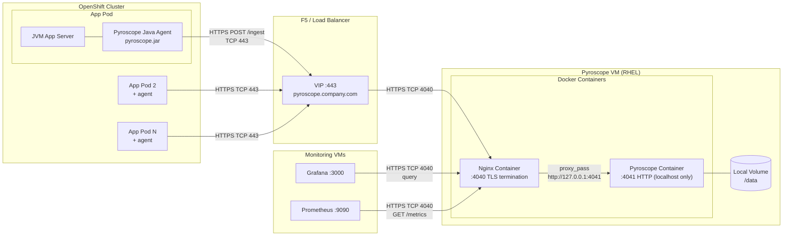
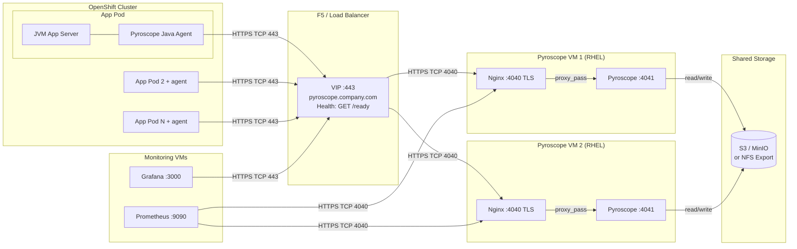
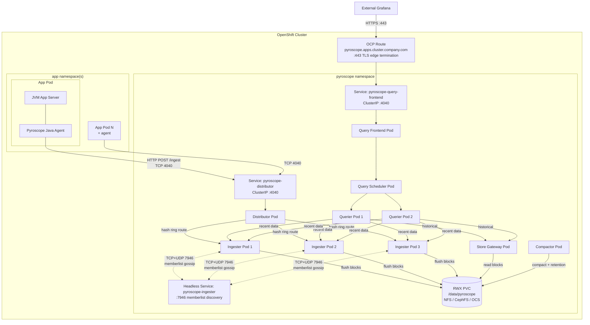

# Capacity Planning

Sizing formulas, worked examples, scaling triggers, networking requirements, and
enterprise scoping for Pyroscope infrastructure. Covers monolith mode (VM) and
microservices mode (OpenShift).

Target audience: platform engineers scoping deployments and presenting requirements
to infrastructure, network, and storage teams.

---

## Why Pyroscope: Enterprise Value Proposition

### The problem continuous profiling solves

Traditional observability (logs, metrics, traces) tells you **what** is slow or
failing. Continuous profiling tells you **why** — down to the exact function,
line of code, and call path consuming CPU, memory, or holding locks.

Without profiling, performance investigations follow this pattern:

1. Alert fires (high latency, OOM kill, thread starvation)
2. Team reviews dashboards — sees the symptom but not the cause
3. Engineers attempt to reproduce locally — often cannot replicate production load
4. Ad-hoc profiling is attached in production — requires restart, access, and timing
5. Root cause found days or weeks later

With continuous profiling always on, step 5 happens at step 1. The profile data
is already captured. Open Grafana, select the time window, read the flame graph.

### Quantified value

| Benefit | Without profiling | With Pyroscope | Impact |
|---------|------------------|----------------|--------|
| **Mean time to root cause (MTTR)** | Hours to days — reproduce, attach profiler, wait for recurrence | Minutes — flame graph already captured for the incident window | 5-50x faster root cause identification |
| **Production debugging** | Requires SSH access, JVM restarts, or debug builds in production | Always-on, no restarts, no code changes, no elevated access needed | Eliminates emergency profiling sessions |
| **Resource optimization** | Over-provisioned "just in case" — CPU/memory requests based on guesswork | Data-driven right-sizing — flame graphs show actual CPU/memory consumers per function | 10-30% infrastructure cost reduction through right-sizing |
| **Performance regression detection** | Caught in production by end users or alerts, after deployment | Before/after flame graph comparison shows new hotspots immediately | Regressions caught in minutes, not days |
| **Cross-team debugging** | "It's not my service" — finger-pointing between teams | Shared flame graph data across all services — objective, function-level evidence | Eliminates blame games with data |
| **Knowledge transfer** | Senior engineers carry performance knowledge in their heads | Flame graphs document how the system actually behaves under load | Institutional knowledge is captured automatically |

### When to implement

Pyroscope is worth implementing when **any** of these apply:

- You have JVM services in production that experience periodic latency spikes, OOM kills, or thread contention
- Performance investigations regularly take more than a few hours
- Teams over-provision resources because they lack data on actual usage
- You need to validate that code changes don't introduce performance regressions
- Multiple teams share infrastructure and need objective performance data
- You're running on OpenShift/Kubernetes where attaching ad-hoc profilers is difficult

### When it may not be needed

- Small number of services (< 5) with well-understood performance characteristics
- Batch-only workloads with no latency requirements
- Environments where 3-5% CPU overhead is not acceptable (rare — see below)

---

## Performance Impact Assessment

> **Bottom line: the agent overhead is small, predictable, and bounded.
> It does not grow with application load.** The profiler samples at a fixed
> interval regardless of how busy the JVM is.

### Agent overhead per JVM pod

| Resource | Overhead | Behavior under load | Notes |
|----------|----------|:-------------------:|-------|
| **CPU** | 3-5% | **Constant** — does not increase with application throughput | Sampling is timer-based (every 10ms). Whether the JVM handles 10 req/s or 10,000 req/s, the profiler takes the same number of samples |
| **Memory** | ~30 MB | **Constant** — does not grow with heap size | Agent buffer for batching samples before upload. Independent of application memory |
| **Network** | 10-50 KB per push (every 10s) | **Constant** — compressed profile payloads are small | ~100-500 KB/min per pod. Negligible compared to application traffic |
| **Latency** | < 1ms per sample | **Imperceptible** — safepoint bias is minimal with itimer | No stop-the-world pauses. JFR itimer sampling does not require JVM safepoints |
| **Disk** | 0 | N/A | Agent stores nothing locally — profiles are pushed to server immediately |

### Why the overhead is safe for production

1. **Sampling, not instrumentation.** The agent does not modify bytecode or wrap
   method calls. It periodically snapshots the call stack using JFR (Java Flight
   Recorder), which is built into the JVM and designed for always-on production use.

2. **itimer-based, not perf-based.** We use `itimer` (interval timer) rather than
   Linux `perf_events`. itimer has no kernel dependency, no `CAP_PERFMON`
   requirement, and works in unprivileged containers. It also avoids the overhead
   spikes that perf-based sampling can cause under heavy context switching.

3. **Fixed sample rate.** The 10ms interval means ~100 samples/second regardless
   of application load. A JVM processing 1 request/second gets the same profiling
   overhead as one processing 100,000 requests/second.

4. **Bounded memory.** The agent buffer is a fixed-size ring buffer (~30 MB). It
   does not grow with heap size, number of threads, or request volume.

5. **Graceful degradation.** If the Pyroscope server is unreachable, the agent
   retains samples in its buffer and retries on the next push interval. It does
   not block the application, throw exceptions, or accumulate unbounded memory.

### Profile types and their overhead

All three profile types are enabled by default in our configuration:

| Profile type | What it captures | Overhead | Configuration |
|-------------|-----------------|:--------:|--------------|
| **CPU (itimer)** | Function-level CPU time — which methods consume the most CPU cycles | ~2-3% CPU | `pyroscope.profiler.event=itimer` at 10ms interval |
| **Allocation** | Heap allocation hotspots — which methods create the most garbage, causing GC pressure | ~1% CPU | `pyroscope.profiler.alloc=512k` — samples allocations >= 512 KB |
| **Lock contention** | Thread blocking — which `synchronized` blocks, `ReentrantLock` calls, or monitors cause waits | < 0.5% CPU | `pyroscope.profiler.lock=10ms` — captures lock waits >= 10ms |
| **Combined total** | All three above | **~3-5% CPU, ~30 MB RAM** | All enabled simultaneously in `pyroscope.properties` |

### Comparison with alternatives

| Approach | Overhead | Always-on? | Production-safe? | Visibility |
|----------|:--------:|:----------:|:----------------:|:----------:|
| **Pyroscope agent (JFR/itimer)** | 3-5% CPU | Yes | Yes | CPU + alloc + lock, function-level |
| Java Flight Recorder (manual) | 1-3% CPU | No (on-demand) | Yes | Requires JVM restart or `jcmd` access |
| VisualVM / JProfiler (remote attach) | 10-30% CPU | No (on-demand) | Risky | Deep detail but high overhead |
| `async-profiler` (manual) | 3-5% CPU | No (on-demand) | Yes | Same engine as Pyroscope, but no central storage |
| APM agents (Datadog, New Relic) | 5-15% CPU | Yes | Yes | Traces + some profiling, higher overhead |
| No profiling | 0% | N/A | N/A | Blind to function-level performance |

> **Pyroscope uses async-profiler under the hood** — the same battle-tested engine
> used by Netflix, Uber, and other large-scale JVM shops. The Pyroscope agent adds
> central collection, storage, and Grafana integration on top.

### Rollback plan

If the agent must be removed for any reason:

```yaml
# Remove this line from the pod spec:
# JAVA_TOOL_OPTIONS: "-javaagent:/opt/pyroscope/pyroscope.jar"

# Or set to empty:
env:
  - name: JAVA_TOOL_OPTIONS
    value: ""
```

- **Rollback time:** Pod restart (~30 seconds)
- **Data impact:** Historical profiles remain in Pyroscope. No data loss.
- **Application impact:** Zero. The agent has no runtime hooks, no bytecode
  modifications, and no application code dependencies. Removing it is the same
  as never having added it.

---

## Server Sizing

### Phase 1a: Single Monolith (one VM)

| Resource | Small (Up to 20 Svcs) | Medium (50 Svcs) | Large (100 Svcs) |
|----------|--------------------------|-------------------|-------------------|
| CPU      | 2 cores                  | 4 cores           | 8 cores           |
| Memory   | 4 GB                     | 8 GB              | 16 GB             |
| Disk     | 100 GB                   | 250 GB            | 500 GB            |
| Network  | < 1 Mbps                 | < 5 Mbps          | < 10 Mbps         |

> Single monolith supports up to ~100 services. For HA or beyond 100 services, move to
> multi-instance monolith (Phase 1b) or microservices (Phase 2).

### Phase 1b: Multi-Instance Monolith (multiple VMs with shared storage)

Each VM runs the same Pyroscope + Nginx stack. F5 distributes traffic. Shared storage
(object storage or NFS) allows any instance to serve queries for any data.

**Per-VM sizing (each instance):**

| Resource | Specification | Notes |
|----------|--------------|-------|
| CPU | 4 cores | Same as single monolith |
| Memory | 8 GB | In-memory head blocks per instance |
| Local disk | 50 GB | Temp/WAL only if using object storage; 250 GB if NFS |
| Network | < 5 Mbps | Per-VM ingestion bandwidth |

**Shared storage sizing:**

| Storage type | Sizing | Notes |
|-------------|--------|-------|
| Object storage (S3/MinIO) | 50-500 GB | Same formula as single monolith. No local disk needed for profile data |
| NFS | 250-500 GB | Mounted at `/data` on all VMs. NFS server needs sufficient IOPS |

**Instance count guidelines:**

| Profiled services | Recommended instances | F5 pool | Shared storage |
|:-----------------:|:--------------------:|:-------:|:--------------:|
| 20-50 | 2 (active-active) | Round-robin | 250 GB |
| 50-100 | 2-3 | Least-connections | 500 GB |
| 100-200 | 3-4 | Least-connections | 500 GB - 1 TB |

**Additional infrastructure:**

| Component | Specification | Notes |
|-----------|--------------|-------|
| F5 VIP | `pyroscope.company.com:443` | Health check: `GET /ready` on :4040 |
| Object storage | MinIO cluster or S3-compatible | 2+ nodes for HA. Or use existing enterprise object storage |
| NFS server (if NFS) | Dedicated NFS export | NFSv4 recommended. Sufficient IOPS for concurrent writers |
| TLS certificate | Same cert on all Nginx instances | Wildcard or SAN cert for VIP FQDN |

> **Why multi-instance over microservices?** Multi-instance monolith gives you HA and
> horizontal scaling with the operational simplicity of the monolith. Each VM runs an
> identical stack. No memberlist, no hash ring, no per-component scaling. The trade-off:
> you cannot scale components independently (e.g., add queriers without adding ingesters).
> If you need per-component scaling, move to Phase 2 microservices.

See [adr/ADR-001-continuous-profiling.md](adr/ADR-001-continuous-profiling.md) for Phase 1 VM specification.

---

## Agent Overhead Per Pod

| Resource | Overhead          | Notes                                                            |
|----------|-------------------|------------------------------------------------------------------|
| CPU      | 3-8%              | JFR sampling, bounded by sample interval, does not increase with load |
| Memory   | 20-40 MB          | Agent buffer, constant regardless of application size            |
| Network  | 10-50 KB per push | Compressed profile data every 10 seconds (configurable)          |
| Disk     | 0                 | Agent stores nothing locally; profiles are pushed immediately    |

See [faq.md](faq.md) for overhead discussion.

---

## Storage Sizing Formula

```bash
storage_GB = services × data_rate_GB_per_month × retention_months
```

Where `data_rate` ranges from 1-5 GB/service/month depending on:

- Number of profile types enabled (CPU only: ~1 GB, all 4 types: ~5 GB)
- Label cardinality (more unique label combinations = more storage)
- Upload interval (default 10s; longer intervals reduce data)

### Retention vs Storage

Assuming 3 GB/service/month average:

| Retention | 10 Svcs | 20 Svcs | 50 Svcs | 100 Svcs |
|-----------|--------:|--------:|--------:|---------:|
| 1 day     |    1 GB |    2 GB |    5 GB |    10 GB |
| 7 days    |    7 GB |   14 GB |   35 GB |    70 GB |
| 30 days   |   30 GB |   60 GB |  150 GB |   300 GB |
| 90 days   |   90 GB |  180 GB |  450 GB |   900 GB |

> Default retention is unlimited. Set `compactor.blocks_retention_period` in pyroscope.yaml.

See [configuration-reference.md](configuration-reference.md) for retention configuration.

---

## Network Bandwidth

```bash
total_bandwidth_KB_s = services × avg_push_size_KB / push_interval_s
```

### Worked Example

- 50 services x 30 KB average push / 10s interval = 150 KB/s = ~1.2 Mbps
- This is well within typical VM network capacity
- Peak: 2-3x average during high-cardinality workloads

---

## Worked Sizing Examples

### 10 Services (POC / Phase 1 Start)

| Resource               | Specification                                  |
|------------------------|------------------------------------------------|
| VM                     | 2 CPU, 4 GB RAM                                |
| Disk                   | 50 GB (generous for POC, supports 30-day retention) |
| Network                | < 0.5 Mbps ingestion                           |
| Retention              | 7-30 days recommended                          |
| Monthly Storage Growth | ~30 GB at 30-day retention                     |

### 50 Services (Phase 1 Full Deployment)

| Resource               | Specification                                  |
|------------------------|------------------------------------------------|
| VM                     | 4 CPU, 8 GB RAM                                |
| Disk                   | 250 GB (supports 30-day retention)             |
| Network                | < 2 Mbps ingestion                             |
| Retention              | 7-30 days recommended                          |
| Monthly Storage Growth | ~150 GB at 30-day retention                    |

### 100 Services (Phase 1 Ceiling)

| Resource               | Specification                                  |
|------------------------|------------------------------------------------|
| VM                     | 8 CPU, 16 GB RAM                               |
| Disk                   | 500 GB (supports 30-day retention) or object storage |
| Network                | < 5 Mbps ingestion                             |
| Retention              | 7-14 days recommended (or use object storage for longer) |
| Migration              | Consider migration to microservices mode       |

---

## Scaling Triggers

| Trigger                    | Symptom                       | Action                                                          |
|----------------------------|-------------------------------|-----------------------------------------------------------------|
| Query latency > 10s        | Slow flame graph rendering    | Add CPU, reduce retention, or migrate to microservices          |
| Disk usage > 80%           | Low disk space alerts         | Expand disk, reduce retention, or enable object storage         |
| Ingestion drops            | Agents timing out on push     | Add CPU and memory, check network bandwidth                     |
| > 100 profiled services    | Approaching monolith ceiling  | Plan migration to microservices mode                            |

See [pyroscope-reference-guide.md](pyroscope-reference-guide.md) for detailed scaling guidance.

---

## Object Storage

For deployments exceeding 500 GB or requiring long retention (90+ days), consider object storage:

- S3-compatible (MinIO, AWS S3, Ceph RGW)
- GCS (Google Cloud Storage)

Object storage separates compute from storage -- the Pyroscope server no longer needs large local disk.

See [architecture.md](architecture.md) for object storage configuration.

---

## Monitoring Storage Growth

```bash
# Check Docker volume usage (VM deployments)
docker system df -v 2>/dev/null | grep pyroscope-data

# Check PVC usage (K8s/OCP deployments)
kubectl exec -n monitoring deploy/pyroscope -- df -h /data
```

See [monitoring-guide.md](monitoring-guide.md) for Prometheus-based storage alerts.

---

## Microservices Mode: Component Sizing

When monolith mode reaches its ceiling (~100 services), migrate to microservices mode.
Each component runs as a separate pod/container and can be scaled independently.

### Per-component resource recommendations

| Component | Replicas | CPU request | CPU limit | Memory request | Memory limit | Stateful | Notes |
|-----------|:--------:|:-----------:|:---------:|:--------------:|:------------:|:--------:|-------|
| **Distributor** | 1-2 | 0.5 | 2 | 512 Mi | 1 Gi | No | Scales with ingest rate. Add replicas if agent push latency > 100ms |
| **Ingester** | 3 | 1 | 4 | 2 Gi | 4 Gi | Yes | Memory-intensive — holds head blocks in RAM before flushing. 3 replicas for hash ring quorum |
| **Querier** | 2 | 1 | 4 | 1 Gi | 2 Gi | No | Scales with query concurrency. Add replicas for more simultaneous Grafana users |
| **Query Frontend** | 1 | 0.25 | 1 | 256 Mi | 512 Mi | No | Lightweight gateway. Rarely needs scaling |
| **Query Scheduler** | 1 | 0.25 | 1 | 256 Mi | 512 Mi | No | Queue manager. Single replica is sufficient |
| **Compactor** | 1 | 0.5 | 2 | 1 Gi | 2 Gi | No | Background process. Must be singleton (only 1 replica) |
| **Store Gateway** | 1 | 0.5 | 2 | 1 Gi | 2 Gi | No | Loads block index into memory. Scale if historical query latency is high |

### Aggregate sizing by scale

| Scale | Services | Total CPU (request) | Total Memory (request) | RWX Storage | Network |
|-------|:--------:|:-------------------:|:---------------------:|:-----------:|:-------:|
| Small | 50-100 | 8 cores | 12 Gi | 100 Gi | < 5 Mbps |
| Medium | 100-250 | 14 cores | 20 Gi | 250 Gi | < 10 Mbps |
| Large | 250-500 | 24 cores | 40 Gi | 500 Gi | < 25 Mbps |

### Storage requirements

| Type | Mount | Access mode | Storage class | Sizing |
|------|-------|:-----------:|---------------|--------|
| Profile data | `/data/pyroscope` | ReadWriteMany (RWX) | NFS, CephFS, OCS | See retention table above |

> **RWX is mandatory.** Ingesters, store-gateway, and compactor all read/write the same
> volume. ReadWriteOnce (RWO) does not work for microservices mode.

---

## Networking Requirements & Deployment Reference

> This section serves as a **standalone requirements document** for interfacing
> with infrastructure, network, storage, and security teams. Each deployment
> type includes: architecture diagram, components, port matrix, firewall rules,
> runtime requirements, and team scoping checklist.
>
> **See also:** [architecture.md § 7 Port Matrix](architecture.md#7-port-matrix-summary) |
> [deployment-guide.md §§ 17a-17e](deployment-guide.md#17a-firewall-rules-monolith-on-vm-http)

---

### Deployment Type A1: VM Single Monolith (Nginx TLS) — Phase 1a

Docker containers on a dedicated VM. OCP-hosted JVM application pods run the
Pyroscope Java agent, which pushes profiles over HTTPS. Nginx terminates TLS on
port 4040 and forwards to the Pyroscope monolith on port 4041 (localhost only).

#### Architecture



#### Components on the VM

| Component | Image / Process | Port | Listens on | Purpose |
|-----------|----------------|:----:|:----------:|---------|
| **Nginx** | `nginx:alpine` or OS-installed | **4040** | `0.0.0.0` | TLS termination. Accepts HTTPS from F5 VIP, agents, Grafana, Prometheus. Forwards to Pyroscope on 127.0.0.1:4041 |
| **Pyroscope** | `grafana/pyroscope:1.18.0` | **4041** | `127.0.0.1` | Monolith mode. All 7 internal components (distributor, ingester, querier, query-frontend, query-scheduler, compactor, store-gateway) run in a single process |
| **Docker Engine** | `docker-ce` | — | — | Container runtime for Nginx and Pyroscope |

#### Components in each OCP App Pod

| Component | Artifact | Resource overhead | Purpose |
|-----------|----------|:-----------------:|---------|
| **Application JVM** | Your app server (e.g., Vert.x, Spring Boot, Quarkus) | — | Business logic |
| **Pyroscope Java Agent** | `pyroscope.jar` (attached via `JAVA_TOOL_OPTIONS=-javaagent:...`) | 3-5% CPU, ~30 MB RAM | Samples CPU, allocation, and lock contention via JFR. Pushes compressed profiles to Pyroscope every 10s |
| **JMX Exporter** (optional) | `jmx_prometheus_javaagent.jar` on port 9404 | < 1% CPU, ~10 MB RAM | Exposes JVM metrics (heap, GC, threads) as Prometheus metrics |

#### Port Matrix

| # | Source | Destination | Port | Protocol | Direction | Purpose |
|---|--------|-------------|:----:|----------|-----------|---------|
| 1 | OCP worker nodes | F5 VIP | **TCP 443** | HTTPS | OCP → F5 | Agent push (`POST /ingest` every 10s per pod) |
| 2 | F5 VIP | Pyroscope VM | **TCP 4040** | HTTPS | F5 → VM | F5 backend pool → Nginx TLS |
| 3 | Grafana VM | Pyroscope VM | **TCP 4040** | HTTPS | VM → VM | Datasource queries (on-demand) |
| 4 | Prometheus VM | Pyroscope VM | **TCP 4040** | HTTPS | VM → VM | Metrics scrape (`GET /metrics` every 15-30s) |
| 5 | Admin workstation | F5 VIP | **TCP 443** | HTTPS | LAN → F5 | Pyroscope UI via VIP |
| 6 | App pods (JMX Exporter) | Prometheus | **TCP 9404** | HTTP | OCP → Prom | JVM metrics scrape (if JMX Exporter enabled) |

> **Port 4041 is internal only.** Nginx proxies to `localhost:4041`. Do NOT
> open port 4041 in any firewall. No external traffic should reach Pyroscope directly.
>
> **Pyroscope never initiates outbound connections.** All traffic is inbound
> to the Pyroscope VM. No egress rules needed from the VM side.

#### VM Infrastructure Requirements

| Resource | Specification | Notes |
|----------|--------------|-------|
| OS | RHEL 8/9 | Hardened, enterprise-supported |
| CPU | 4 cores (up to 50 svcs), 8 cores (up to 100 svcs) | Pyroscope + Nginx |
| Memory | 8 GB (up to 50 svcs), 16 GB (up to 100 svcs) | Pyroscope in-memory head blocks |
| Disk | 250 GB local (50 svcs), 500 GB (100 svcs) | `/data` Docker volume for profiles |
| Docker | Docker CE or Podman | `docker` group for service account |
| TLS Certificate | Enterprise CA-signed cert for VIP FQDN | Mounted into Nginx container |
| Network | Static IP, DNS entry | F5 backend pool target |

#### Agent Configuration (in OCP pods)

```properties
# pyroscope.properties — mounted into each pod
pyroscope.server.address=https://pyroscope.company.com
pyroscope.format=jfr
pyroscope.profiler.event=itimer
pyroscope.profiler.interval=10ms
pyroscope.profiler.alloc=512k
pyroscope.profiler.lock=10ms
pyroscope.upload.interval=10s
pyroscope.log.level=warn
```

```yaml
# Pod spec — attach agent via JAVA_TOOL_OPTIONS (no code changes)
env:
  - name: JAVA_TOOL_OPTIONS
    value: "-javaagent:/opt/pyroscope/pyroscope.jar"
  - name: PYROSCOPE_APPLICATION_NAME
    value: "my-app-name"
  - name: PYROSCOPE_CONFIGURATION_FILE
    value: "/opt/pyroscope/pyroscope.properties"
```

#### OCP Egress Policy (if default-deny)

```yaml
apiVersion: networking.k8s.io/v1
kind: NetworkPolicy
metadata:
  name: allow-pyroscope-egress
  namespace: my-app-namespace
spec:
  podSelector: {}
  policyTypes:
    - Egress
  egress:
    - to:
        - ipBlock:
            cidr: <F5_VIP_IP>/32
      ports:
        - protocol: TCP
          port: 443
```

---

### Deployment Type A2: VM Multi-Instance Monolith (Shared Storage) — Phase 1b

Multiple Pyroscope monolith instances on separate VMs, each with Nginx TLS. F5
distributes agent traffic and Grafana queries across all instances. All instances
share storage (object storage or NFS) so any instance can serve queries for any data.

#### Architecture



#### Components per VM (identical on each)

| Component | Image / Process | Port | Listens on | Purpose |
|-----------|----------------|:----:|:----------:|---------|
| **Nginx** | `nginx:alpine` or OS-installed | **4040** | `0.0.0.0` | TLS termination. Accepts HTTPS from F5 VIP. Forwards to Pyroscope on 127.0.0.1:4041 |
| **Pyroscope** | `grafana/pyroscope:1.18.0` | **4041** | `127.0.0.1` | Monolith mode. Reads/writes shared storage backend |
| **Docker Engine** | `docker-ce` | — | — | Container runtime |

#### Port Matrix

| # | Source | Destination | Port | Protocol | Direction | Purpose |
|---|--------|-------------|:----:|----------|-----------|---------|
| 1 | OCP worker nodes | F5 VIP | **TCP 443** | HTTPS | OCP → F5 | Agent push (`POST /ingest`) |
| 2 | F5 VIP | Pyroscope VM 1..N | **TCP 4040** | HTTPS | F5 → VMs | F5 pool members → Nginx TLS |
| 3 | Grafana VM | F5 VIP | **TCP 443** | HTTPS | VM → F5 | Datasource queries via VIP |
| 4 | Prometheus VM | Pyroscope VM 1..N | **TCP 4040** | HTTPS | VM → VM | Metrics scrape per instance |
| 5 | Pyroscope VM 1..N | Object storage / NFS | **TCP 9000** (MinIO) or **TCP 2049** (NFS) | HTTPS / NFS | VM → Storage | Profile data read/write |
| 6 | Admin workstation | F5 VIP | **TCP 443** | HTTPS | LAN → F5 | Pyroscope UI |

> **New vs single monolith:** Row 5 (shared storage access) is the key addition.
> F5 pool has multiple members instead of one. Prometheus must scrape each VM individually.

#### VM Infrastructure Requirements (per instance)

| Resource | Specification | Notes |
|----------|--------------|-------|
| OS | RHEL 8/9 | Same image/config on every VM |
| CPU | 4 cores | Per-instance |
| Memory | 8 GB | Per-instance |
| Local disk | 50 GB (object storage) or 250 GB (NFS) | Object storage: local disk is for WAL/temp only |
| Docker | Docker CE or Podman | Same version on all VMs |
| TLS Certificate | Same cert on all VMs (VIP FQDN) | Enterprise CA-signed |

#### Shared Storage Requirements

| Option | Specification | Pros | Cons |
|--------|--------------|------|------|
| **Object storage (recommended)** | MinIO cluster or S3-compatible, 250 GB - 1 TB | No file locking issues, scales well with concurrent writers, built-in replication | Additional infrastructure (MinIO cluster) |
| **NFS** | NFSv4 export, 250 GB - 1 TB, sufficient IOPS | Simple setup, familiar to most teams | File-level locking under concurrent writes, NFS server is single point of failure |

#### Pyroscope Configuration (object storage mode)

```yaml
# pyroscope.yaml — IDENTICAL on every instance
storage:
  backend: s3
  s3:
    bucket_name: pyroscope-profiles
    endpoint: minio.company.com:9000
    access_key_id: ${MINIO_ACCESS_KEY}
    secret_access_key: ${MINIO_SECRET_KEY}
    insecure: false
```

#### F5 Pool Configuration

| Setting | Value | Notes |
|---------|-------|-------|
| Pool members | `VM1:4040`, `VM2:4040`, ..., `VMn:4040` | All Pyroscope VMs |
| Load balancing | Round-robin or least-connections | Instances are stateless with shared storage |
| Health monitor | HTTPS `GET /ready` on port 4040 | Removes unhealthy instances automatically |
| Session persistence | None required | Any instance can serve any request |

#### Agent Configuration (same as single monolith)

```properties
# Agents point to the VIP — they don't know about individual instances
pyroscope.server.address=https://pyroscope.company.com
```

#### OCP Egress Policy (same as single monolith)

```yaml
apiVersion: networking.k8s.io/v1
kind: NetworkPolicy
metadata:
  name: allow-pyroscope-egress
  namespace: my-app-namespace
spec:
  podSelector: {}
  policyTypes:
    - Egress
  egress:
    - to:
        - ipBlock:
            cidr: <F5_VIP_IP>/32
      ports:
        - protocol: TCP
          port: 443
```

---

### Deployment Type B: OCP Microservices — Phase 2 (Full OpenShift Deployment)

All Pyroscope components run as separate pods in a dedicated OpenShift namespace.
JVM application pods push profiles to the distributor service over the cluster SDN.
No cross-boundary firewall rules needed for agent traffic.

#### Architecture



#### Pyroscope Components — What Each Does

| Component | Replicas | Stateful | CPU req/limit | Memory req/limit | Port | Role |
|-----------|:--------:|:--------:|:-------------:|:----------------:|:----:|------|
| **Distributor** | 1-2 | No | 0.5 / 2 | 512 Mi / 1 Gi | 4040 | Receives `POST /ingest` from agents. Hashes profile labels and routes to the correct ingester via the consistent hash ring. Scale if agent push latency > 100ms |
| **Ingester** | 3 | Yes | 1 / 4 | 2 Gi / 4 Gi | 4040, 7946 | Accepts profiles from distributor, writes to in-memory head blocks, flushes to shared storage. Participates in memberlist gossip (port 7946) for hash ring. 3 replicas for quorum |
| **Querier** | 2 | No | 1 / 4 | 1 Gi / 2 Gi | 4040 | Executes profile queries: reads recent data from ingesters + historical data from store-gateway, merges results. Scale with concurrent Grafana users |
| **Query Frontend** | 1 | No | 0.25 / 1 | 256 Mi / 512 Mi | 4040 | Entry point for all Grafana queries. Provides caching, time-range splitting, retries, and deduplication. Rarely needs scaling |
| **Query Scheduler** | 1 | No | 0.25 / 1 | 256 Mi / 512 Mi | 4040 | Sits between query-frontend and queriers. Maintains query queue and distributes across available querier replicas |
| **Compactor** | 1 | No | 0.5 / 2 | 1 Gi / 2 Gi | 4040 | Background process: merges small blocks into larger ones for query efficiency, enforces retention policy. **Must be singleton** (only 1 replica) |
| **Store Gateway** | 1 | No | 0.5 / 2 | 1 Gi / 2 Gi | 4040 | Serves historical profile data from long-term storage. Loads block index into memory for fast lookups. Scale if historical query latency is high |

**Aggregate resource requirements:**

| Scale | Profiled services | Total CPU (request) | Total Memory (request) | RWX Storage | Network |
|-------|:-----------------:|:-------------------:|:---------------------:|:-----------:|:-------:|
| Small | 50-100 | 8 cores | 12 Gi | 100 Gi | < 5 Mbps |
| Medium | 100-250 | 14 cores | 20 Gi | 250 Gi | < 10 Mbps |
| Large | 250-500 | 24 cores | 40 Gi | 500 Gi | < 25 Mbps |

#### Components in each OCP App Pod (same as VM Monolith)

| Component | Artifact | Resource overhead | Purpose |
|-----------|----------|:-----------------:|---------|
| **Application JVM** | Your app server | — | Business logic |
| **Pyroscope Java Agent** | `pyroscope.jar` via `JAVA_TOOL_OPTIONS` | 3-5% CPU, ~30 MB RAM | Profiles CPU, alloc, lock. Pushes to distributor every 10s |
| **JMX Exporter** (optional) | `jmx_prometheus_javaagent.jar` on port 9404 | < 1% CPU, ~10 MB RAM | JVM metrics for Prometheus |

#### Port Matrix

**Intra-cluster traffic (handled by OCP SDN — no firewall rules needed):**

| # | Source | Destination | Port | Protocol | Purpose |
|---|--------|-------------|:----:|----------|---------|
| 1 | App pods (any namespace) | `pyroscope-distributor.pyroscope.svc` | **TCP 4040** | HTTP | Agent push (`POST /ingest`) |
| 2 | Query Frontend | Query Scheduler | **TCP 4040** | HTTP | Query enqueue |
| 3 | Query Scheduler | Querier pods | **TCP 4040** | HTTP | Query dispatch |
| 4 | Querier | Ingester pods | **TCP 4040** | HTTP | Read recent (unflushed) data |
| 5 | Querier | Store Gateway | **TCP 4040** | HTTP | Read historical (compacted) data |
| 6 | Distributor | Ingester pods | **TCP 4040** | HTTP | Profile write path |
| 7 | Ingester ↔ Ingester | Headless Service | **TCP 7946** | Memberlist | Hash ring gossip |
| 8 | Ingester ↔ Ingester | Headless Service | **UDP 7946** | Memberlist | Ring state propagation |

**External access:**

| # | Source | Destination | Port | Protocol | Purpose |
|---|--------|-------------|:----:|----------|---------|
| 9 | External Grafana | OCP Route | **TCP 443** | HTTPS | Datasource queries via TLS edge termination |
| 10 | Prometheus | Any Pyroscope component | **TCP 4040** | HTTP | Metrics scrape (`GET /metrics`) |

#### OCP Platform Requirements

| Resource | Specification | Notes |
|----------|--------------|-------|
| Namespace | `pyroscope` (dedicated) | Resource quota: 16 CPU, 24 Gi memory minimum |
| RBAC | ServiceAccount with Deployment, Service, PVC, ConfigMap permissions | For Helm chart deployment |
| Storage | RWX PersistentVolumeClaim — 100-500 Gi | **Must be ReadWriteMany** (NFS, CephFS, or OCS). RWO does not work — ingesters, store-gateway, and compactor all read/write the same volume |
| Route | TLS edge termination | Hostname: `pyroscope.apps.cluster.company.com` |
| SCC | `restricted` (default) is sufficient | No privileged containers needed |
| Image | `grafana/pyroscope:1.18.0` | All 7 components use the same image with different `-target=` flags |

#### Agent Configuration (in app pods — same for both modes)

```yaml
# Pod spec — OCP microservices mode points to distributor service
env:
  - name: JAVA_TOOL_OPTIONS
    value: "-javaagent:/opt/pyroscope/pyroscope.jar"
  - name: PYROSCOPE_APPLICATION_NAME
    value: "my-app-name"
  - name: PYROSCOPE_SERVER_ADDRESS
    value: "http://pyroscope-distributor.pyroscope.svc:4040"
  - name: PYROSCOPE_FORMAT
    value: "jfr"
```

#### NetworkPolicy (restrict which namespaces can push)

```yaml
apiVersion: networking.k8s.io/v1
kind: NetworkPolicy
metadata:
  name: pyroscope-ingress
  namespace: pyroscope
spec:
  podSelector: {}
  policyTypes:
    - Ingress
  ingress:
    # Allow agent push from app namespaces
    - from:
        - namespaceSelector:
            matchLabels:
              kubernetes.io/metadata.name: my-app-namespace
      ports:
        - protocol: TCP
          port: 4040
    # Allow intra-namespace traffic (component-to-component + memberlist)
    - from:
        - podSelector: {}
      ports:
        - protocol: TCP
          port: 4040
        - protocol: TCP
          port: 7946
        - protocol: UDP
          port: 7946
```

> **Memberlist port 7946 must be open between ingester pods.** If your OCP
> cluster has default-deny NetworkPolicy, ensure TCP+UDP 7946 is allowed
> within the pyroscope namespace.

---

## Enterprise Scoping: What to Ask Other Teams

Use these checklists when coordinating with infrastructure, network, storage, and
security teams. Hand the relevant section directly to each team.

### Phase 1a: VM Single Monolith with Nginx TLS

| Team | What to request | Lead time | Details |
|------|----------------|:---------:|---------|
| **VM / Infrastructure** | RHEL VM — 4 CPU, 8 GB RAM, 250 GB disk | 1-2 weeks | Docker CE installed, `docker` group for service account |
| **VM / Infrastructure** | Docker images: `grafana/pyroscope:1.18.0`, `nginx:alpine` | Days | Pull to VM or load from air-gapped tarball |
| **Network** | F5 VIP + DNS entry (e.g., `pyroscope.company.com`) → VM IP:4040 | 2-4 weeks | Backend pool health check: `GET /ready` on port 4040 |
| **Network** | Firewall rule: OCP worker nodes → F5 VIP, TCP 443 | 1-2 weeks | HTTPS (agent push + Grafana queries) |
| **Network** | Firewall rule: F5 VIP → VM IP, TCP 4040 | 1-2 weeks | HTTPS (Nginx TLS termination) |
| **Network** | Firewall rule: Grafana VM / Prometheus VM → VM IP, TCP 4040 | 1-2 weeks | HTTPS (datasource queries + metrics scrape) |
| **Security / PKI** | TLS certificate for VIP FQDN | 1-2 weeks | CSR signed by enterprise CA, mounted into Nginx container |
| **Monitoring** | Prometheus scrape target: `https://VM_IP:4040/metrics` | Days | Standard service discovery or static config |
| **Grafana** | Pyroscope datasource | Days | URL: `https://pyroscope.company.com` |

### Phase 1b: VM Multi-Instance Monolith with Shared Storage

Everything from Phase 1a, plus:

| Team | What to request | Lead time | Details |
|------|----------------|:---------:|---------|
| **VM / Infrastructure** | Additional RHEL VMs (2-4 total) — 4 CPU, 8 GB RAM each | 1-2 weeks | Same Docker image, same config as first VM |
| **Storage** | Object storage: MinIO cluster or S3-compatible (250 GB - 1 TB) | 1-2 weeks | Or NFS export if object storage is not available |
| **Storage** | (If NFS) Dedicated NFS export with sufficient IOPS | 1-2 weeks | NFSv4 recommended. Mount at `/data` on all VMs |
| **Network** | F5 pool: add additional VMs as pool members (TCP 4040) | Days | Same VIP, add members. Health check: `GET /ready` |
| **Network** | Firewall rule: Pyroscope VMs → Object storage / NFS server | 1-2 weeks | TCP 9000 (MinIO) or TCP 2049 (NFS) |
| **Network** | Prometheus scrape targets: all Pyroscope VMs individually | Days | One scrape target per VM (not via VIP) |
| **Security / PKI** | Same TLS cert on all VMs (or wildcard cert) | Days | VIP FQDN cert — already issued in Phase 1a |

### Phase 2: OCP Microservices

| Team | What to request | Lead time | Details |
|------|----------------|:---------:|---------|
| **OCP Platform** | Dedicated namespace (`pyroscope`) | Days | Resource quota: 16 CPU, 24 Gi memory |
| **OCP Platform** | RBAC: service account with Deployment/Service/PVC/ConfigMap permissions | Days | For Helm chart deployment |
| **OCP Platform** | OCP Route with TLS edge termination | Days | Hostname: `pyroscope.apps.cluster.company.com` |
| **Storage** | RWX PersistentVolume — 100-500 Gi | 1-2 weeks | StorageClass: NFS, CephFS, or OCS. **Must be ReadWriteMany** |
| **Network** | NetworkPolicy: allow ingress from app namespaces → pyroscope namespace, TCP 4040 | Days | See NetworkPolicy YAML above |
| **Network** | NetworkPolicy: allow TCP+UDP 7946 within pyroscope namespace | Days | Required for ingester memberlist gossip |
| **Security** | Review: no PII in profile data | 1 week | Profiles contain function names and stack traces only — no request payloads, no secrets |
| **Grafana** | Pyroscope datasource | Days | URL: `http://pyroscope-query-frontend.pyroscope.svc:4040` (in-cluster) or Route URL (external) |

### Agent Rollout (both modes)

| Team | What to request | Lead time | Details |
|------|----------------|:---------:|---------|
| **App teams** | Add `JAVA_TOOL_OPTIONS="-javaagent:/opt/pyroscope/pyroscope.jar"` to pod spec | Days per team | No code changes. Agent JAR via init container or baked into image |
| **App teams** | Set `PYROSCOPE_SERVER_ADDRESS` env var | Days | VM: `https://pyroscope.company.com` / OCP: `http://pyroscope-distributor.pyroscope.svc:4040` |
| **OCP Platform** | EgressNetworkPolicy (if default-deny): allow TCP 443 to F5 VIP (VM mode) or TCP 4040 to pyroscope namespace (OCP mode) | Days | Per app namespace |
| **Change management** | CAB approval for agent deployment | 1-2 weeks | Rollback: remove `JAVA_TOOL_OPTIONS`. Overhead: 3-5% CPU, ~30 MB memory per JVM |

---

## Migration Path

### Phase 1a → Phase 1b (single monolith → multi-instance monolith)

| Trigger | Symptom | Action |
|---------|---------|--------|
| HA requirement | Single point of failure unacceptable | Add second VM, configure shared storage, add to F5 pool |
| Approaching 100 profiled services | Query latency increasing | Add instances to distribute load |
| DR/maintenance windows | Need zero-downtime upgrades | Second instance handles traffic during rolling upgrades |

**Migration steps (1a → 1b):**

1. Provision shared storage (MinIO/S3 or NFS export)
2. Reconfigure existing Pyroscope to use shared storage backend
3. Verify data is accessible from shared storage
4. Provision second VM with identical Nginx + Pyroscope config
5. Add second VM to F5 pool
6. Verify F5 health checks pass for both VMs
7. Agents require no changes — they push to the same VIP

### Phase 1b → Phase 2 (multi-instance monolith → OCP microservices)

| Trigger | Symptom | Action |
|---------|---------|--------|
| > 200 profiled services | Even multi-instance cannot keep up | Plan microservices migration |
| Query latency > 10s sustained | Grafana timeouts on wide time ranges | Scale queriers independently (requires microservices) |
| Per-component scaling needed | Ingestion fine but queries are slow | Microservices mode separates ingestion and query scaling |
| Multi-team shared platform | Multiple teams need isolated access | Microservices with tenant isolation |

**Migration steps (1b → Phase 2):**

1. Deploy microservices mode in parallel (new OCP namespace, new storage)
2. Point a subset of agents to the new distributor endpoint
3. Validate data flow and query performance
4. Gradually migrate remaining agents
5. Decommission monolith VMs

> **Data is not migrated.** The monolith and microservices instances have separate
> storage. Historical data on the monolith remains queryable until the VM is
> decommissioned. Plan retention overlap accordingly.

---

## Cross-references

- [architecture.md](architecture.md) — Component details, topology diagrams, data flow, port matrix
- [deployment-guide.md Section 12](deployment-guide.md#12-microservices-mode) — Microservices deployment steps
- [deployment-guide.md Sections 17a-17d](deployment-guide.md#17a-firewall-rules-monolith-on-vm-http) — Firewall rules per mode
- [tls-setup.md](tls-setup.md) — TLS options (F5 VIP, Nginx, Envoy, native)
- [deploy/helm/pyroscope/examples/](../deploy/helm/pyroscope/examples/) — Ready-to-use Helm values for OCP microservices
