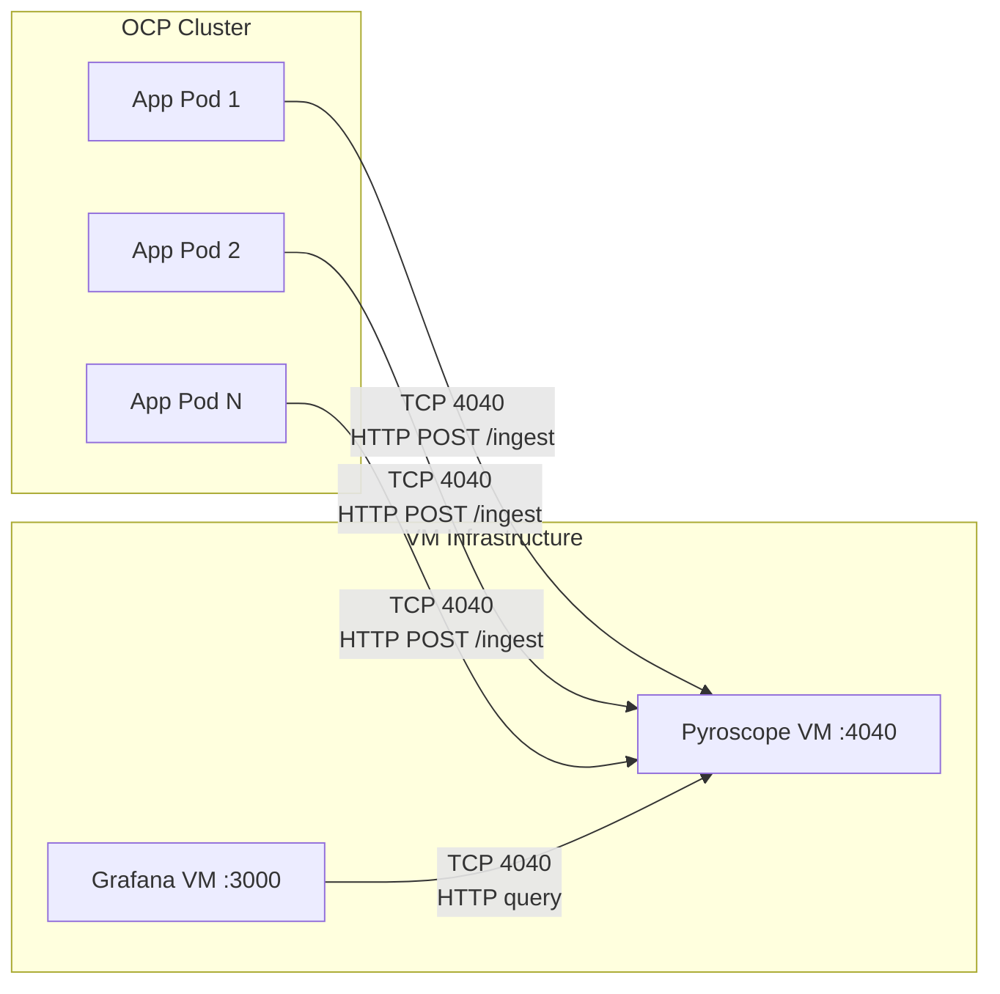
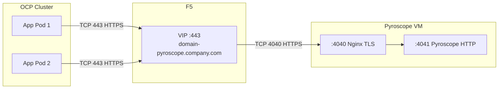
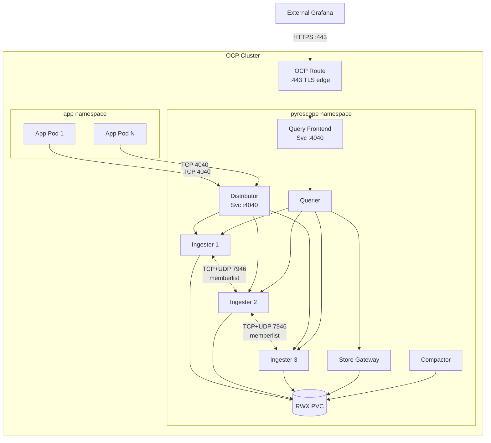

# Capacity Planning

Sizing formulas, worked examples, scaling triggers, networking requirements, and
enterprise scoping for Pyroscope infrastructure. Covers monolith mode (VM) and
microservices mode (OpenShift).

Target audience: platform engineers scoping deployments and presenting requirements
to infrastructure, network, and storage teams.

---

## Server Sizing

| Resource | Phase 1 (Up to 20 Svcs) | Medium (50 Svcs) | Large (100 Svcs) |
|----------|--------------------------|-------------------|-------------------|
| CPU      | 2 cores                  | 4 cores           | 8 cores           |
| Memory   | 4 GB                     | 8 GB              | 16 GB             |
| Disk     | 100 GB                   | 250 GB            | 500 GB            |
| Network  | < 1 Mbps                 | < 5 Mbps          | < 10 Mbps         |

> Monolith mode supports up to ~100 services. Beyond that, migrate to microservices mode.

See [adr/ADR-001-continuous-profiling.md](adr/ADR-001-continuous-profiling.md) for Phase 1 VM specification.

---

## Agent Overhead Per Pod

| Resource | Overhead          | Notes                                                            |
|----------|-------------------|------------------------------------------------------------------|
| CPU      | 3-8%              | JFR sampling, bounded by sample interval, does not increase with load |
| Memory   | 20-40 MB          | Agent buffer, constant regardless of application size            |
| Network  | 10-50 KB per push | Compressed profile data every 10 seconds (configurable)          |
| Disk     | 0                 | Agent stores nothing locally; profiles are pushed immediately    |

See [faq.md](faq.md) for overhead discussion.

---

## Storage Sizing Formula

```bash
storage_GB = services × data_rate_GB_per_month × retention_months
```

Where `data_rate` ranges from 1-5 GB/service/month depending on:

- Number of profile types enabled (CPU only: ~1 GB, all 4 types: ~5 GB)
- Label cardinality (more unique label combinations = more storage)
- Upload interval (default 10s; longer intervals reduce data)

### Retention vs Storage

Assuming 3 GB/service/month average:

| Retention | 10 Svcs | 20 Svcs | 50 Svcs | 100 Svcs |
|-----------|--------:|--------:|--------:|---------:|
| 1 day     |    1 GB |    2 GB |    5 GB |    10 GB |
| 7 days    |    7 GB |   14 GB |   35 GB |    70 GB |
| 30 days   |   30 GB |   60 GB |  150 GB |   300 GB |
| 90 days   |   90 GB |  180 GB |  450 GB |   900 GB |

> Default retention is unlimited. Set `compactor.blocks_retention_period` in pyroscope.yaml.

See [configuration-reference.md](configuration-reference.md) for retention configuration.

---

## Network Bandwidth

```bash
total_bandwidth_KB_s = services × avg_push_size_KB / push_interval_s
```

### Worked Example

- 50 services x 30 KB average push / 10s interval = 150 KB/s = ~1.2 Mbps
- This is well within typical VM network capacity
- Peak: 2-3x average during high-cardinality workloads

---

## Worked Sizing Examples

### 10 Services (POC / Phase 1 Start)

| Resource               | Specification                                  |
|------------------------|------------------------------------------------|
| VM                     | 2 CPU, 4 GB RAM                                |
| Disk                   | 50 GB (generous for POC, supports 30-day retention) |
| Network                | < 0.5 Mbps ingestion                           |
| Retention              | 7-30 days recommended                          |
| Monthly Storage Growth | ~30 GB at 30-day retention                     |

### 50 Services (Phase 1 Full Deployment)

| Resource               | Specification                                  |
|------------------------|------------------------------------------------|
| VM                     | 4 CPU, 8 GB RAM                                |
| Disk                   | 250 GB (supports 30-day retention)             |
| Network                | < 2 Mbps ingestion                             |
| Retention              | 7-30 days recommended                          |
| Monthly Storage Growth | ~150 GB at 30-day retention                    |

### 100 Services (Phase 1 Ceiling)

| Resource               | Specification                                  |
|------------------------|------------------------------------------------|
| VM                     | 8 CPU, 16 GB RAM                               |
| Disk                   | 500 GB (supports 30-day retention) or object storage |
| Network                | < 5 Mbps ingestion                             |
| Retention              | 7-14 days recommended (or use object storage for longer) |
| Migration              | Consider migration to microservices mode       |

---

## Scaling Triggers

| Trigger                    | Symptom                       | Action                                                          |
|----------------------------|-------------------------------|-----------------------------------------------------------------|
| Query latency > 10s        | Slow flame graph rendering    | Add CPU, reduce retention, or migrate to microservices          |
| Disk usage > 80%           | Low disk space alerts         | Expand disk, reduce retention, or enable object storage         |
| Ingestion drops            | Agents timing out on push     | Add CPU and memory, check network bandwidth                     |
| > 100 profiled services    | Approaching monolith ceiling  | Plan migration to microservices mode                            |

See [pyroscope-reference-guide.md](pyroscope-reference-guide.md) for detailed scaling guidance.

---

## Object Storage

For deployments exceeding 500 GB or requiring long retention (90+ days), consider object storage:

- S3-compatible (MinIO, AWS S3, Ceph RGW)
- GCS (Google Cloud Storage)

Object storage separates compute from storage -- the Pyroscope server no longer needs large local disk.

See [architecture.md](architecture.md) for object storage configuration.

---

## Monitoring Storage Growth

```bash
# Check Docker volume usage (VM deployments)
docker system df -v 2>/dev/null | grep pyroscope-data

# Check PVC usage (K8s/OCP deployments)
kubectl exec -n monitoring deploy/pyroscope -- df -h /data
```

See [monitoring-guide.md](monitoring-guide.md) for Prometheus-based storage alerts.

---

## Microservices Mode: Component Sizing

When monolith mode reaches its ceiling (~100 services), migrate to microservices mode.
Each component runs as a separate pod/container and can be scaled independently.

### Per-component resource recommendations

| Component | Replicas | CPU request | CPU limit | Memory request | Memory limit | Stateful | Notes |
|-----------|:--------:|:-----------:|:---------:|:--------------:|:------------:|:--------:|-------|
| **Distributor** | 1-2 | 0.5 | 2 | 512 Mi | 1 Gi | No | Scales with ingest rate. Add replicas if agent push latency > 100ms |
| **Ingester** | 3 | 1 | 4 | 2 Gi | 4 Gi | Yes | Memory-intensive — holds head blocks in RAM before flushing. 3 replicas for hash ring quorum |
| **Querier** | 2 | 1 | 4 | 1 Gi | 2 Gi | No | Scales with query concurrency. Add replicas for more simultaneous Grafana users |
| **Query Frontend** | 1 | 0.25 | 1 | 256 Mi | 512 Mi | No | Lightweight gateway. Rarely needs scaling |
| **Query Scheduler** | 1 | 0.25 | 1 | 256 Mi | 512 Mi | No | Queue manager. Single replica is sufficient |
| **Compactor** | 1 | 0.5 | 2 | 1 Gi | 2 Gi | No | Background process. Must be singleton (only 1 replica) |
| **Store Gateway** | 1 | 0.5 | 2 | 1 Gi | 2 Gi | No | Loads block index into memory. Scale if historical query latency is high |

### Aggregate sizing by scale

| Scale | Services | Total CPU (request) | Total Memory (request) | RWX Storage | Network |
|-------|:--------:|:-------------------:|:---------------------:|:-----------:|:-------:|
| Small | 50-100 | 8 cores | 12 Gi | 100 Gi | < 5 Mbps |
| Medium | 100-250 | 14 cores | 20 Gi | 250 Gi | < 10 Mbps |
| Large | 250-500 | 24 cores | 40 Gi | 500 Gi | < 25 Mbps |

### Storage requirements

| Type | Mount | Access mode | Storage class | Sizing |
|------|-------|:-----------:|---------------|--------|
| Profile data | `/data/pyroscope` | ReadWriteMany (RWX) | NFS, CephFS, OCS | See retention table above |

> **RWX is mandatory.** Ingesters, store-gateway, and compactor all read/write the same
> volume. ReadWriteOnce (RWO) does not work for microservices mode.

---

## Networking Requirements

### VM Monolith (HTTP) — OCP agents push to VM



**Firewall / network policy requirements:**

| # | Source | Destination | Port | Protocol | Direction | Purpose |
|---|--------|-------------|:----:|----------|-----------|---------|
| 1 | OCP worker nodes | Pyroscope VM | TCP 4040 | HTTP | OCP → VM | Agent push (`POST /ingest` every 10s) |
| 2 | Grafana VM | Pyroscope VM | TCP 4040 | HTTP | VM → VM | Datasource queries (on-demand) |
| 3 | Prometheus VM | Pyroscope VM | TCP 4040 | HTTP | VM → VM | Metrics scrape (`GET /metrics` every 15-30s) |
| 4 | Admin workstation | Pyroscope VM | TCP 4040 | HTTP | LAN → VM | Pyroscope UI access |

**OCP egress policy (if default-deny):**

```yaml
# Allow pods to push profiles to Pyroscope VM
apiVersion: networking.k8s.io/v1
kind: NetworkPolicy
metadata:
  name: allow-pyroscope-egress
  namespace: my-app-namespace
spec:
  podSelector: {}
  policyTypes:
    - Egress
  egress:
    - to:
        - ipBlock:
            cidr: <PYROSCOPE_VM_IP>/32
      ports:
        - protocol: TCP
          port: 4040
```

> **Pyroscope never initiates outbound connections.** All traffic is inbound
> to the Pyroscope VM. No egress rules needed from the VM side.

---

### VM Monolith (HTTPS with Nginx) — F5 VIP + Nginx on VM



**Firewall / network policy requirements:**

| # | Source | Destination | Port | Protocol | Direction | Purpose |
|---|--------|-------------|:----:|----------|-----------|---------|
| 1 | OCP worker nodes | F5 VIP | TCP 443 | HTTPS | OCP → F5 | Agent push via VIP |
| 2 | F5 VIP | Pyroscope VM | TCP 4040 | HTTPS | F5 → VM | F5 backend pool to Nginx TLS |
| 3 | Grafana VM | Pyroscope VM | TCP 4040 | HTTPS | VM → VM | Datasource queries |
| 4 | Admin workstation | F5 VIP | TCP 443 | HTTPS | LAN → F5 | Pyroscope UI via VIP |

> **Port 4041 is internal only.** Do NOT open port 4041 in the firewall.
> Nginx proxies to `localhost:4041` — no external traffic should reach Pyroscope directly.

---

### OCP Microservices — all traffic within cluster



**Intra-cluster traffic (no firewall rules — handled by OCP SDN):**

| # | Source | Destination | Port | Protocol | Purpose |
|---|--------|-------------|:----:|----------|---------|
| 1 | App pods (any namespace) | `pyroscope-distributor.pyroscope.svc` | TCP 4040 | HTTP | Agent push |
| 2 | Query Frontend | Query Scheduler → Querier | TCP 4040 | HTTP | Query dispatch |
| 3 | Querier | Ingester pods | TCP 4040 | HTTP | Read recent data |
| 4 | Querier | Store Gateway | TCP 4040 | HTTP | Read historical data |
| 5 | Ingester ↔ Ingester | Headless Service | TCP+UDP 7946 | Memberlist | Hash ring gossip |
| 6 | External Grafana | OCP Route | TCP 443 | HTTPS | Query via Route |

**NetworkPolicy (restrict which namespaces can push):**

```yaml
apiVersion: networking.k8s.io/v1
kind: NetworkPolicy
metadata:
  name: pyroscope-ingress
  namespace: pyroscope
spec:
  podSelector: {}
  policyTypes:
    - Ingress
  ingress:
    # Allow agent push from app namespaces
    - from:
        - namespaceSelector:
            matchLabels:
              kubernetes.io/metadata.name: my-app-namespace
      ports:
        - protocol: TCP
          port: 4040
    # Allow intra-namespace traffic (component-to-component)
    - from:
        - podSelector: {}
      ports:
        - protocol: TCP
          port: 4040
        - protocol: TCP
          port: 7946
        - protocol: UDP
          port: 7946
```

> **Memberlist port 7946 must be open between ingester pods.** If your OCP
> cluster has default-deny NetworkPolicy, ensure TCP+UDP 7946 is allowed
> within the pyroscope namespace.

---

## Enterprise Scoping: What to Ask Other Teams

Use this table when coordinating with infrastructure, network, storage, and security
teams to scope a Pyroscope deployment.

### VM Monolith (Phase 1)

| Team | What to request | Lead time | Details |
|------|----------------|:---------:|---------|
| **VM / Infrastructure** | RHEL VM — 4 CPU, 8 GB RAM, 250 GB disk | 1-2 weeks | Docker installed, `docker` group for service account |
| **Network** | Firewall rule: OCP worker nodes → VM IP, TCP 4040 | 1-2 weeks | HTTP (or HTTPS if F5 VIP) |
| **Network** | F5 VIP + DNS entry (e.g., `domain-pyroscope.company.com`) | 2-4 weeks | Backend pool: VM IP:4040, health check: `GET /ready` |
| **Security / PKI** | TLS certificate for VIP FQDN | 1-2 weeks | CSR signed by enterprise CA |
| **Monitoring** | Prometheus scrape target: `VM_IP:4040/metrics` | Days | Standard service discovery or static config |
| **Grafana** | Pyroscope datasource in enterprise Grafana | Days | URL: `https://domain-pyroscope.company.com` |

### OCP Microservices (Phase 2)

| Team | What to request | Lead time | Details |
|------|----------------|:---------:|---------|
| **OCP Platform** | Dedicated namespace (`pyroscope`) | Days | With resource quota: 16 CPU, 24 Gi memory |
| **OCP Platform** | RBAC: service account with pod/pvc create permissions | Days | For Helm chart deployment |
| **Storage** | RWX PersistentVolume — 100-500 Gi | 1-2 weeks | StorageClass: NFS, CephFS, or OCS. Must be ReadWriteMany |
| **Network** | NetworkPolicy allowing ingress from app namespaces to pyroscope namespace, TCP 4040 | Days | See NetworkPolicy example above |
| **Network** | OCP Route for external Grafana access | Days | TLS edge termination, hostname: `pyroscope.apps.cluster.company.com` |
| **Security** | Review: no PII in profile data, no secrets in labels | 1 week | Profiles contain function names and stack traces only |
| **Grafana** | Pyroscope datasource | Days | URL: `http://pyroscope-query-frontend.pyroscope.svc:4040` (in-cluster) or Route URL (external) |

### Agent rollout (both modes)

| Team | What to request | Lead time | Details |
|------|----------------|:---------:|---------|
| **App teams** | Add `JAVA_TOOL_OPTIONS="-javaagent:/path/to/pyroscope.jar"` to pod spec | Days per team | No code changes. Agent JAR via init container or baked into image |
| **OCP Platform** | EgressNetworkPolicy (if default-deny): allow TCP 4040 to Pyroscope | Days | Per app namespace |
| **Change management** | CAB approval for agent deployment | 1-2 weeks | Rollback: remove `JAVA_TOOL_OPTIONS`. Overhead: 3-8% CPU, 20-40 MB memory |

---

## Migration Path: Monolith to Microservices

| Trigger | Symptom | Action |
|---------|---------|--------|
| > 100 profiled services | Ingestion latency increasing | Plan microservices migration |
| Query latency > 10s sustained | Grafana timeouts on wide time ranges | Scale queriers independently (requires microservices) |
| HA requirement | Single point of failure unacceptable | Microservices mode with 3 ingesters provides write-path HA |
| Multi-team shared platform | Multiple teams need isolated access | Microservices with tenant isolation |

### Migration steps

1. Deploy microservices mode in parallel (new namespace, new storage)
2. Point a subset of agents to the new distributor endpoint
3. Validate data flow and query performance
4. Gradually migrate remaining agents
5. Decommission monolith VM

> **Data is not migrated.** The monolith and microservices instances have separate
> storage. Historical data on the monolith remains queryable until the VM is
> decommissioned. Plan retention overlap accordingly.

---

## Cross-references

- [architecture.md](architecture.md) — Component details, topology diagrams, data flow, port matrix
- [deployment-guide.md Section 12](deployment-guide.md#12-microservices-mode) — Microservices deployment steps
- [deployment-guide.md Sections 17a-17d](deployment-guide.md#17a-firewall-rules-monolith-on-vm-http) — Firewall rules per mode
- [tls-setup.md](tls-setup.md) — TLS options (F5 VIP, Nginx, Envoy, native)
- [deploy/helm/pyroscope/examples/](../deploy/helm/pyroscope/examples/) — Ready-to-use Helm values for OCP microservices
