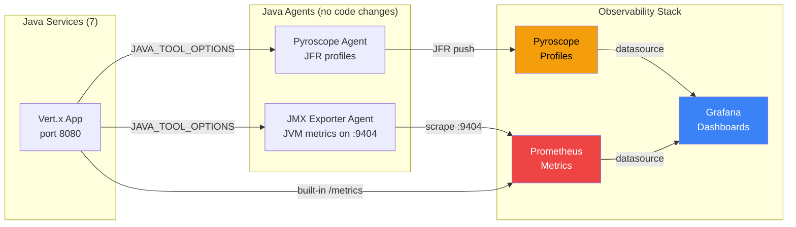
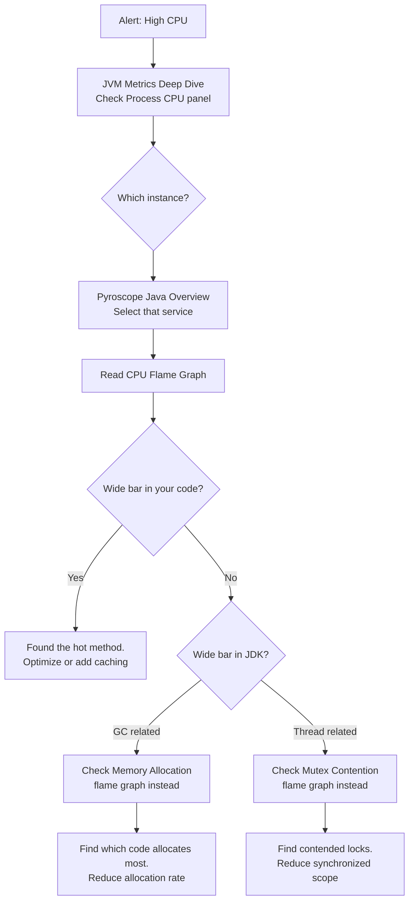
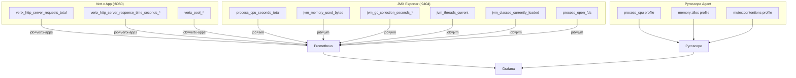

# Dashboard Guide & Production Debugging Runbook

How to use each Grafana dashboard, what the panels mean, and step-by-step
workflows for debugging production issues using profiling and metrics data.

---

## Architecture Overview

This project collects three types of observability data with **zero application
code changes** — everything is attached via Java agents and infrastructure config:



**Two Prometheus jobs:**

| Job | Port | Metrics | Source |
|-----|------|---------|--------|
| `vertx-apps` | 8080 | HTTP request counts, response times, pool stats | Vert.x Micrometer (built into app) |
| `jvm` | 9404 | Heap, GC, threads, CPU, classloading, file descriptors | JMX Exporter agent (no code changes) |

**Pyroscope profile types:**

| Profile Type ID | What it captures |
|----------------|-----------------|
| `process_cpu:cpu:nanoseconds:cpu:nanoseconds` | Which methods consume CPU time |
| `memory:alloc_in_new_tlab_bytes:bytes:space:bytes` | Where memory is allocated |
| `memory:alloc_in_new_tlab_objects:count:space:bytes` | How many objects are allocated |
| `mutex:contentions:count:mutex:count` | Which synchronized blocks cause contention |
| `mutex:delay:nanoseconds:mutex:count` | How long threads wait on mutexes |

---

## Dashboard 1: Pyroscope Java Overview

**URL:** http://localhost:3000/d/pyroscope-java-overview

**Purpose:** Primary profiling dashboard. Shows CPU, memory, and mutex flame
graphs for any service, plus correlated JVM and HTTP metrics.

### Panels

| Panel | Data Source | What to look for |
|-------|-----------|-----------------|
| CPU Profile (flame graph) | Pyroscope | Wide bars = methods using most CPU. Look for your code (not JDK internals) |
| Memory Allocation (flame graph) | Pyroscope | Wide bars = methods allocating most memory. Drives GC pressure |
| Mutex Contention (flame graph) | Pyroscope | Wide bars = synchronized blocks causing thread contention |
| Profile Comparison | Pyroscope | Compare different profile types via the `profile_type` dropdown |
| JVM CPU Usage | Prometheus (`jvm`) | Should correlate with CPU flame graph — spikes mean hot code running |
| JVM Heap Memory Used | Prometheus (`jvm`) | Sawtooth pattern = healthy GC. Flat line at max = memory leak |
| GC Collection Duration Rate | Prometheus (`jvm`) | Spikes here + allocation flame graph = GC pressure |
| HTTP Request Rate | Prometheus (`vertx-apps`) | Traffic volume driving the profiles |
| Top Functions (CPU) | Pyroscope | Table view of hottest functions |

### Template variables

- **application** — Select any `bank-*` service. Default: `bank-api-gateway`
- **profile_type** — CPU, memory allocation, or mutex contention
- **comparison_range** — Time range for profile diff views

### When this dashboard is useful

- Investigating which methods consume the most CPU
- Finding memory allocation hotspots driving GC pauses
- Identifying lock contention in concurrent code
- Comparing profile shapes before/after a deployment

---

## Dashboard 2: JVM Metrics Deep Dive

**URL:** http://localhost:3000/d/jvm-metrics-deep-dive

**Purpose:** Detailed JVM runtime health. All data comes from the JMX Exporter
agent (zero code changes).

### Panels

| Panel | Metric | What to look for |
|-------|--------|-----------------|
| Process CPU Usage | `process_cpu_seconds_total` | Per-instance CPU rate. High = check CPU flame graph |
| System CPU Usage (gauge) | `process_cpu_seconds_total` | Aggregate — above 0.8 = overloaded |
| Open File Descriptors | `process_open_fds` | Should be stable. Rising = resource leak |
| Heap Memory Used | `jvm_memory_used_bytes{area="heap"}` | Sawtooth = normal GC. Compare used vs max |
| Non-Heap Memory Used | `jvm_memory_used_bytes{area="nonheap"}` | Metaspace + code cache. Rising = classloader leak |
| GC Collection Duration (rate) | `jvm_gc_collection_seconds_sum` | Time spent in GC per second. Above 0.05 = investigate |
| GC Collection Count (rate) | `jvm_gc_collection_seconds_count` | GC frequency. Many minor GCs = normal. Major GCs = concerning |
| Live Threads | `jvm_threads_current/daemon/peak` | Stable = good. Rising = thread leak. Look at thread states |
| Classes Loaded | `jvm_classes_currently_loaded` | Should plateau after startup. Rising = classloader leak |
| Process Uptime | `process_start_time_seconds` | How long since JVM started. Useful for restart detection |
| Memory Pool Utilization | `jvm_memory_pool_used_bytes / max` | Per-pool %. Eden full = normal. Old Gen > 80% = investigate |

### Template variables

- **instance** — Filter by service instance (multi-select). Default: All
- **interval** — Scrape aggregation window (10s, 30s, 1m, 5m)

### When this dashboard is useful

- Monitoring JVM health across all services
- Detecting memory leaks (rising heap, rising non-heap)
- Identifying GC pressure (frequent collections, long pauses)
- Finding thread leaks or deadlocks

---

## Dashboard 3: HTTP Performance

**URL:** http://localhost:3000/d/http-performance

**Purpose:** HTTP traffic analysis. All data comes from Vert.x Micrometer
metrics (built into the app, `vertx-apps` job).

### Panels

| Panel | Metric | What to look for |
|-------|--------|-----------------|
| Request Rate by Endpoint | `vertx_http_server_requests_total` | Which endpoints get the most traffic |
| Request Rate by Instance | Same, grouped by instance | Load distribution across services |
| Total Requests (counter) | Same, raw counter | Absolute request counts per service |
| Average Latency by Endpoint | `response_time_seconds_sum / count` | Which endpoints are slow on average |
| Max Latency by Endpoint | `response_time_seconds_max` | Worst-case latency spikes per endpoint |
| Error Rate (5xx) | Requests with `code=~"5.."` | Any 5xx = investigate immediately |
| Response Status Distribution | Pie chart of status codes | Should be nearly 100% 200s |
| Slowest Endpoints (bar gauge) | Top 10 by avg latency | Quick visual of bottlenecks |

### Template variables

- **instance** — Filter by service instance (multi-select)
- **method** — Filter by HTTP method (GET, POST, etc.)

### When this dashboard is useful

- Finding which endpoints are slowest
- Detecting error rate spikes
- Understanding traffic distribution
- Identifying latency outliers

---

## Dashboard 4: Service Comparison

**URL:** http://localhost:3000/d/service-comparison

**Purpose:** Side-by-side comparison of API Gateway vs Order Service across
all dimensions — CPU, memory, GC, threads, HTTP, and flame graphs.

### Panels

| Panel | What it compares |
|-------|-----------------|
| CPU | Process CPU usage for both services |
| Heap Used | JVM heap memory consumption |
| GC Pause Rate | GC collection duration rate |
| Thread Count | Live threads |
| Request Rate | HTTP requests/sec |
| Avg Latency | Mean response time |
| CPU Profile (API Gateway) | Flame graph — where API Gateway spends CPU |
| CPU Profile (Order Service) | Flame graph — where Order Service spends CPU |

### When this dashboard is useful

- Comparing resource usage between two services
- Identifying which service is under more pressure
- Correlating metrics with profiling data side-by-side
- Before/after comparison when tuning a specific service

---

## CLI: Identify Problematic JVMs

To quickly flag which of the 7 services are showing concerning behavior:

```bash
bash scripts/jvm-health.sh          # human-readable output
bash scripts/jvm-health.sh --json   # JSON for automation
bash scripts/run.sh health          # via unified runner
```

Checks each service against thresholds:

| Metric | Warning | Critical |
|--------|---------|----------|
| CPU usage (rate) | >= 50% | >= 80% |
| Heap utilization | >= 70% | >= 85% |
| GC time rate | >= 0.03 s/s | >= 0.10 s/s |
| Live threads | >= 50 | >= 100 |

Services are ranked by severity (CRITICAL first). For each flagged service,
the output suggests `top-functions.sh` and Pyroscope queries to investigate
root cause.

---

## CLI: Top Functions by CPU / Memory / Mutex

For quick answers to **"what classes/functions are consuming the most CPU, memory,
or causing lock contention?"** without opening a browser:

```bash
bash scripts/top-functions.sh              # all services, all profile types
bash scripts/top-functions.sh cpu          # CPU only
bash scripts/top-functions.sh memory       # memory allocation only
bash scripts/top-functions.sh mutex        # mutex contention only
bash scripts/top-functions.sh cpu bank-api-gateway   # CPU for one service
bash scripts/top-functions.sh --top 20     # show top 20 (default 15)
bash scripts/top-functions.sh --range 30m  # last 30 minutes (default 1h)

# Or via the unified runner:
bash scripts/run.sh top                    # all profiles, all services
bash scripts/run.sh top cpu               # CPU only
```

Example output:

```
================================================================
  CPU — Top 15 functions (last 1h)
================================================================

--- bank-api-gateway ---
    1.  42.3%         1.85s  com.example.MainVerticle.fibonacci
    2.  12.1%         0.53s  com.example.MainVerticle.lambda$start$3
    3.   8.7%         0.38s  java.math.BigDecimal.multiply
  ...

--- bank-payment-service ---
    1.  31.5%         1.22s  com.example.PaymentVerticle.signTransaction
    2.  18.2%         0.71s  java.security.MessageDigest.digest
  ...
```

This queries the Pyroscope HTTP API and parses flamebearer JSON to extract
self-time per function. It requires a running Pyroscope instance with profile
data (run `bash scripts/generate-load.sh` first).

---

## Production Debugging Workflows

### Workflow 1: High CPU Usage

**Alert:** `HighCpuUsage` fires — `process_cpu_seconds_total > 0.8`



**Steps:**
1. Open **JVM Metrics Deep Dive** → Process CPU panel → identify which instance
2. Open **Pyroscope Java Overview** → set `application` to that service
3. Read the CPU flame graph top-to-bottom:
   - **Wide bars at the top** = your code spending the most CPU
   - **Narrow bars** = negligible CPU
   - Click a bar to zoom in and see its call chain
4. If most CPU is in GC, switch to the Memory Allocation flame graph
5. **CLI alternative:** `bash scripts/top-functions.sh cpu bank-api-gateway`
6. Common findings:
   - `fibonacci()` consuming CPU → expected for CPU benchmark endpoints
   - `BigDecimal` operations → expected for payment/loan services
   - `Pattern.compile()` in a loop → bug, compile once and reuse
   - `HashMap.resize()` → pre-size your maps

### Workflow 2: Memory Leak / High Heap Usage

**Alert:** `HighHeapUsage` fires — heap > 85% of max

**Steps:**
1. Open **JVM Metrics Deep Dive** → Heap Memory panel
   - **Sawtooth pattern** = normal GC behavior, not a leak
   - **Steadily rising line** = probable memory leak
   - **Flat at max** = OOM imminent
2. Check GC panels — if GC is running constantly but heap doesn't drop, objects
   are being retained
3. Open **Pyroscope Java Overview** → Memory Allocation flame graph
   - Wide bars = methods allocating the most bytes
   - This shows *allocation rate*, not retention — but high allocators are
     the first suspects for leaks
   - **CLI alternative:** `bash scripts/top-functions.sh memory`
4. Check Memory Pool Utilization (bottom of JVM dashboard):
   - **Old Gen > 80%** = long-lived objects accumulating
   - **Metaspace rising** = classloader leak (dynamic class generation)

### Workflow 3: Latency Spike

**Alert:** `HighLatency` fires — max response time > 2s

**Steps:**
1. Open **HTTP Performance** → Max Latency panel → identify which endpoint
2. Check the corresponding **Slowest Endpoints** bar gauge for confirmation
3. Open **JVM Metrics Deep Dive** → check if GC pauses correlate with latency spikes
4. Open **Pyroscope Java Overview** → CPU flame graph for that service
   - If the endpoint does `Thread.sleep()` or I/O, CPU profile won't show it
   - Check Mutex Contention flame graph instead — mutex delays cause latency
   - If the endpoint is CPU-bound, the CPU flame graph will show the bottleneck
5. Common findings:
   - GC pause during request → reduce allocation rate
   - Lock contention → reduce synchronized scope or use concurrent data structures
   - Slow downstream call → the flame graph will show time in `HttpClient`

### Workflow 4: Error Rate Spike

**Alert:** `HighErrorRate` fires — 5xx rate > 5%

**Steps:**
1. Open **HTTP Performance** → Error Rate (5xx) panel → which instance
2. Check Response Status Distribution pie chart
3. Check service logs: `docker logs <container-name> --tail 100`
4. Open **JVM Metrics Deep Dive** → check for:
   - Thread count spike → thread pool exhaustion
   - Heap at max → OOM causing 500s
   - Open file descriptors at limit → socket/file exhaustion
5. If a downstream service is down, check **Service Comparison** to see which
   services are healthy vs degraded

### Workflow 5: Comparing Before/After a Change

**Steps:**
1. Run the full pipeline: `bash scripts/run.sh`
2. Open all 4 dashboards, note the baseline numbers
3. Make your change (config, JVM flags, code if needed)
4. Redeploy: `bash scripts/run.sh teardown && bash scripts/run.sh`
5. Compare:
   - **Service Comparison** — side-by-side CPU, memory, latency
   - **Pyroscope Java Overview** — use Comparison view to diff flame graphs
   - **HTTP Performance** — latency and throughput changes
   - **JVM Metrics Deep Dive** — GC improvements, thread count changes

---

## Useful Prometheus Queries

### Service health

```promql
# All services up?
up{job="vertx-apps"}

# JMX exporter reachable?
up{job="jvm"}
```

### CPU analysis

```promql
# CPU usage per service (rate over 1m)
rate(process_cpu_seconds_total{job="jvm"}[1m])

# Top 3 CPU consumers
topk(3, rate(process_cpu_seconds_total{job="jvm"}[5m]))
```

### Memory analysis

```promql
# Heap usage per service
jvm_memory_used_bytes{job="jvm", area="heap"}

# Heap utilization percentage
jvm_memory_used_bytes{job="jvm", area="heap"} / jvm_memory_max_bytes{job="jvm", area="heap"}

# Memory pool breakdown
jvm_memory_pool_used_bytes{job="jvm"}
```

### GC analysis

```promql
# GC time spent per second
rate(jvm_gc_collection_seconds_sum{job="jvm"}[2m])

# GC frequency
rate(jvm_gc_collection_seconds_count{job="jvm"}[2m])

# Average GC pause duration
rate(jvm_gc_collection_seconds_sum{job="jvm"}[5m]) / rate(jvm_gc_collection_seconds_count{job="jvm"}[5m])
```

### HTTP analysis

```promql
# Request rate by endpoint
sum by (route) (rate(vertx_http_server_requests_total{job="vertx-apps"}[1m]))

# Average latency by endpoint
sum by (route) (rate(vertx_http_server_response_time_seconds_sum{job="vertx-apps"}[1m]))
  / sum by (route) (rate(vertx_http_server_response_time_seconds_count{job="vertx-apps"}[1m]))

# Error rate (5xx)
sum(rate(vertx_http_server_requests_total{job="vertx-apps", code=~"5.."}[1m]))
  / sum(rate(vertx_http_server_requests_total{job="vertx-apps"}[1m]))

# Total throughput across all services
sum(rate(vertx_http_server_requests_total{job="vertx-apps"}[1m]))
```

### Thread analysis

```promql
# Live threads per service
jvm_threads_current{job="jvm"}

# Thread state breakdown
jvm_threads_state{job="jvm"}

# Deadlocked threads (should always be 0)
jvm_threads_deadlocked{job="jvm"}
```

---

## Troubleshooting: Dashboard Shows "No Data"

### Pyroscope panels (flame graphs) show nothing

1. Check Pyroscope is running: `curl http://localhost:4040/ready`
2. Check profiles exist:
   ```bash
   curl -s 'http://localhost:4040/querier.v1.QuerierService/LabelValues' \
     -X POST -H 'Content-Type: application/json' -d '{"name":"service_name"}'
   ```
   Should list all 7 `bank-*` services
3. Check the `application` dropdown has a value selected (not empty)
4. Check the time range covers when load was generated (top right → "Last 1 hour")
5. Load must have been generated — profiles are empty without HTTP traffic

### Prometheus panels (timeseries) show nothing

1. Check which job the panel uses (hover over panel title → Edit → look at `job=`):
   - `job="jvm"` → JMX Exporter metrics (heap, CPU, GC, threads)
   - `job="vertx-apps"` → Vert.x HTTP metrics (request rate, latency)
2. Verify targets are up:
   ```bash
   curl -s 'http://localhost:9090/api/v1/query?query=up' | python3 -m json.tool
   ```
3. Verify the specific metric exists:
   ```bash
   curl -s 'http://localhost:9090/api/v1/query?query=jvm_memory_used_bytes' | \
     python3 -c "import json,sys; print(len(json.load(sys.stdin)['data']['result']), 'series')"
   ```
4. If 0 series, the JMX exporter may not be running — check container logs:
   ```bash
   docker logs api-gateway 2>&1 | grep -i "jmx\|exporter\|9404"
   ```

### Grafana volume caching old dashboards

If you updated dashboard JSON but Grafana still shows old versions:
```bash
bash scripts/run.sh teardown
docker volume rm pyroscope_grafana-data 2>/dev/null; true
bash scripts/run.sh
```

---

## Quick Reference: Metric Sources


