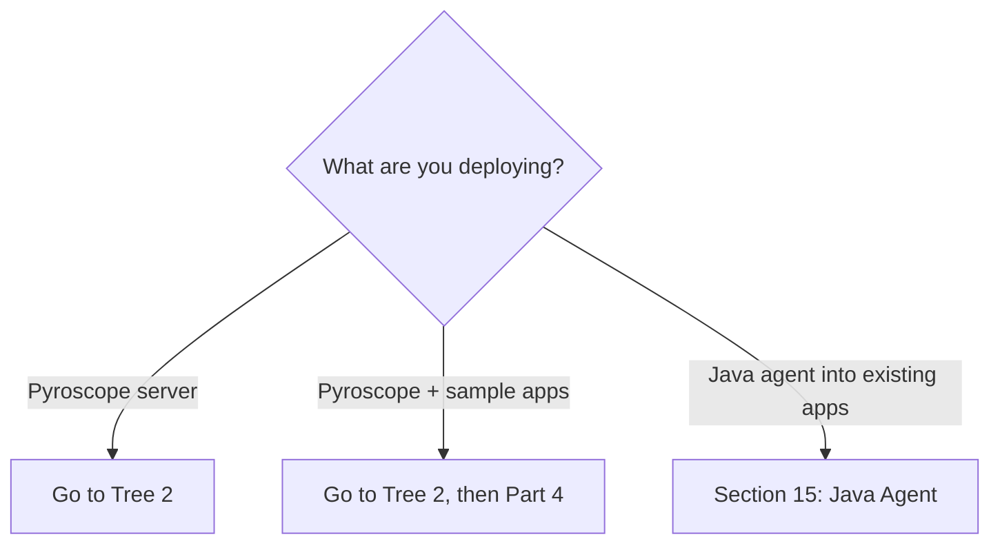
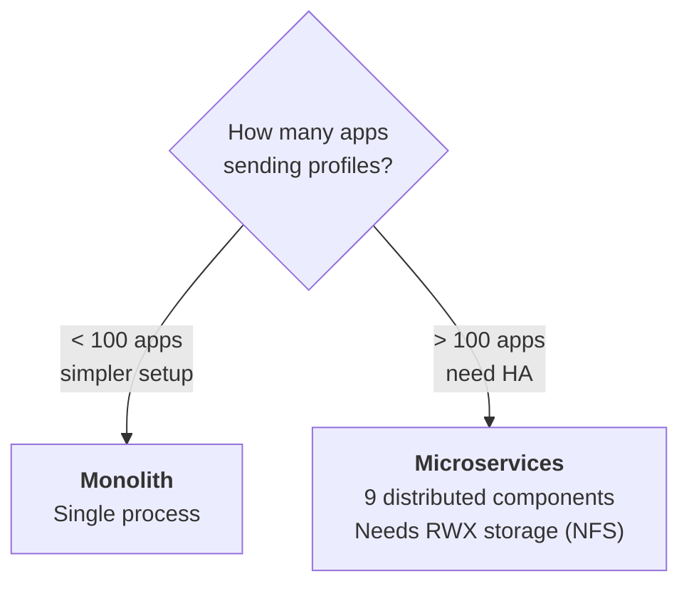
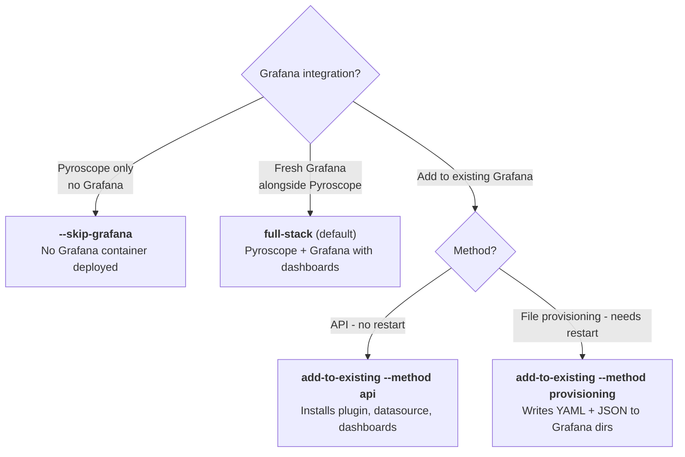
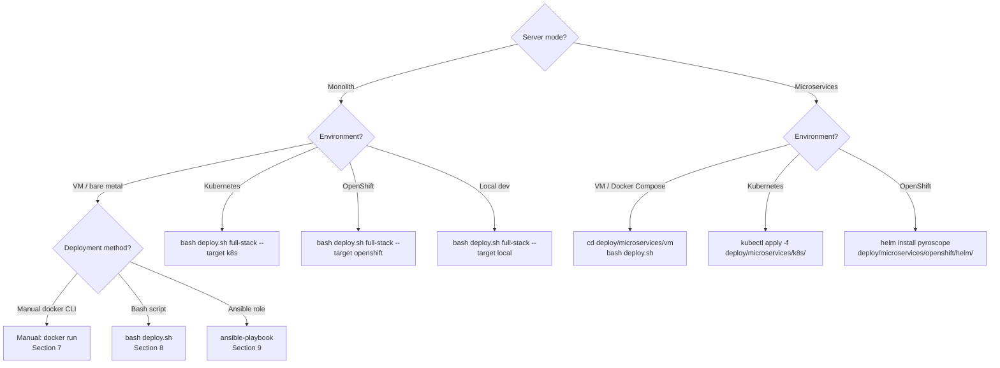
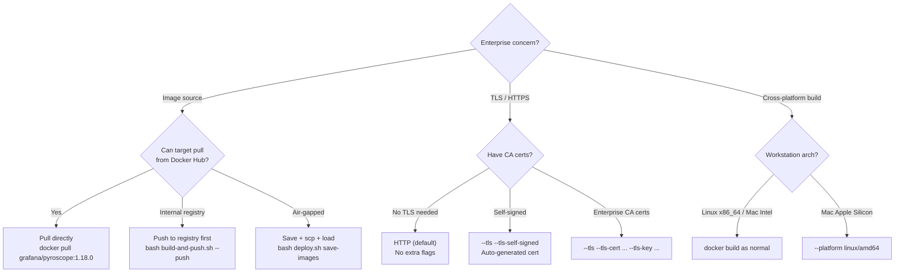
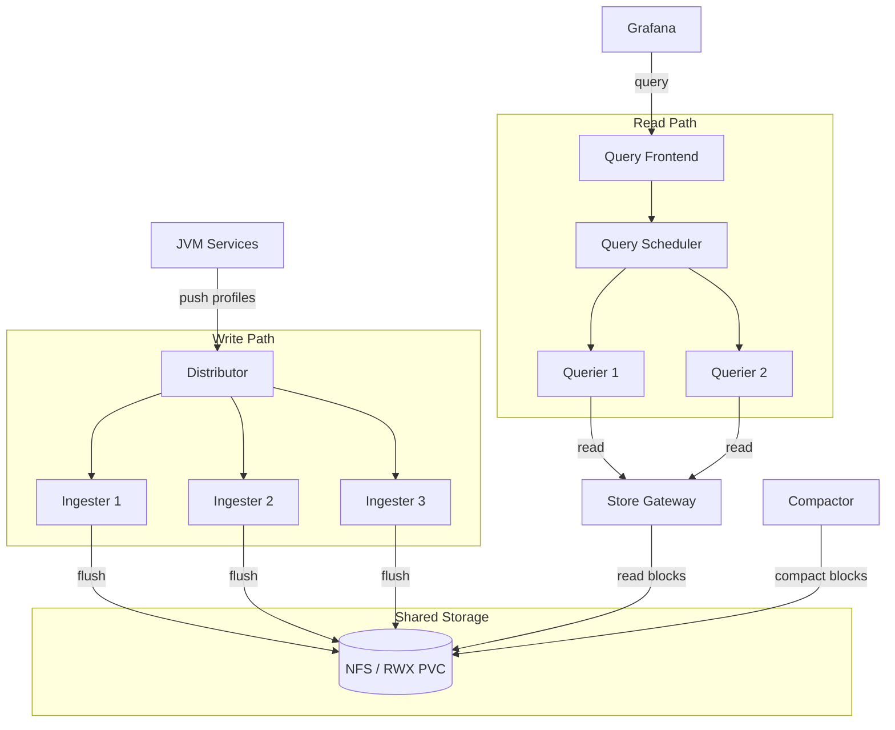
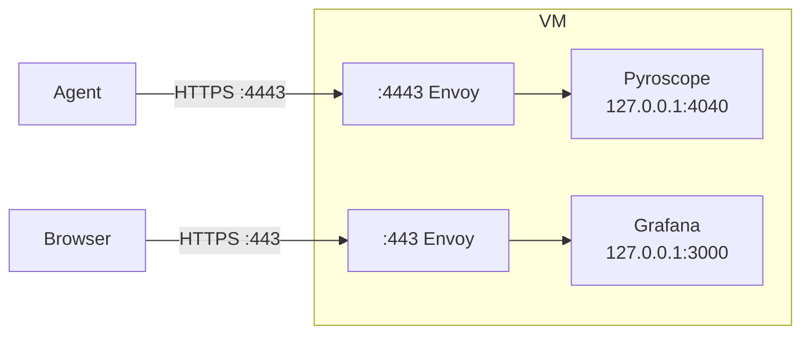
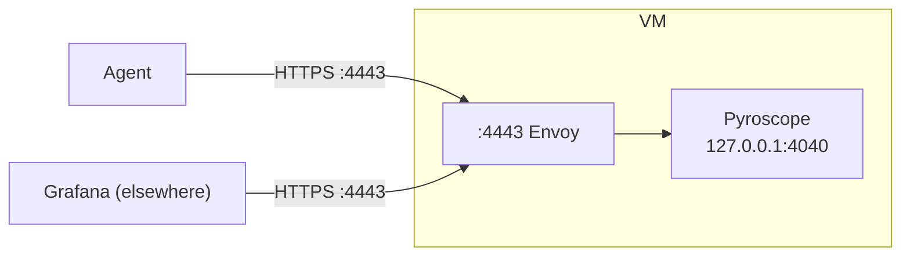
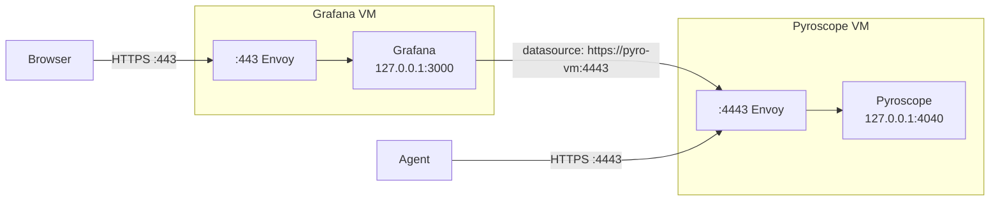

# Pyroscope Deployment Guide

Comprehensive guide covering every deployment scenario for Pyroscope continuous profiling:
monolith mode, microservices mode, sample apps, Java agent integration, VM, Kubernetes,
OpenShift, Docker Compose, TLS, air-gapped, and Ansible automation.

---

## Table of Contents

- **Part 1: Decision Trees** -- [1. What are you deploying?](#1-what-are-you-deploying) | [2. Server mode](#2-pyroscope-server-mode) | [3. Grafana integration](#3-grafana-integration) | [4. Environment and method](#4-environment-and-deployment-method) | [5. Enterprise concerns](#5-enterprise-concerns)
- **Part 2: Quick Reference** -- [6a. Monolith](#6a-monolith-quick-reference) | [6b. Microservices](#6b-microservices-quick-reference) | [6c. Sample apps](#6c-sample-apps-quick-reference)
- **Part 3: Pyroscope Server** -- [SSH config](#ssh-configuration) | [HTTP vs HTTPS config](#pyroscope-server-configuration-http-vs-https) | [7. Manual VM](#7-monolith-manual-vm-deployment) | [8. Bash script](#8-monolith-bash-script-on-vm) | [9. Ansible](#9-monolith-ansible-on-vm) | [10. K8s/OpenShift](#10-monolith-kubernetes-and-openshift) | [11. Local Compose](#11-monolith-local-docker-compose) | [12. Microservices](#12-microservices-mode)
- **Part 4: Sample Apps** -- [13. Bank app](#13-bank-app-demo-9-services) | [14. FaaS server](#14-faas-server-only)
- **Part 5: Java Agent** -- [15. Agent configuration](#15-java-agent-configuration)
- **Part 6: Reference** -- [16. TLS architecture](#16-tls-architecture) | [17. Port reference](#17-port-reference) | [18. Day-2 operations](#18-day-2-operations) | [19. File map](#19-file-map)

---

# Part 1: Decision Trees

## 1. What are you deploying?



| Outcome | Go to |
|---------|-------|
| Pyroscope server (monolith or microservices) | [Tree 2: Server mode](#2-pyroscope-server-mode) |
| Pyroscope server + sample bank app or FaaS | [Tree 2](#2-pyroscope-server-mode), then [Section 13](#13-bank-app-demo-9-services) or [Section 14](#14-faas-server-only) |
| Java agent into existing JVM apps | [Section 15: Java Agent Configuration](#15-java-agent-configuration) |

---

## 2. Pyroscope server mode



| Outcome | Go to |
|---------|-------|
| Monolith -- single process, simple operations | Sections [7](#7-monolith-manual-vm-deployment) - [11](#11-monolith-local-docker-compose) |
| Microservices -- 9 components, HA, NFS required | [Section 12: Microservices mode](#12-microservices-mode) |

---

## 3. Grafana integration



| Outcome | Where to find it |
|---------|-----------------|
| Pyroscope only (`--skip-grafana`) | [Section 7b](#7b-http-pyroscope-only), [Section 8b](#8b-deploysh-examples) |
| Full stack (Pyroscope + fresh Grafana) | [Section 7a](#7a-http-with-grafana-full-stack), [Section 8b](#8b-deploysh-examples) |
| Add to existing Grafana (API) | [Section 8b](#8b-deploysh-examples) (`add-to-existing --method api`) |
| Add to existing Grafana (provisioning) | [Section 8b](#8b-deploysh-examples) (`add-to-existing --method provisioning`) |

---

## 4. Environment and deployment method



| Mode | Environment | Method | Go to |
|------|-------------|--------|-------|
| Monolith | VM | Manual docker CLI | [Section 7](#7-monolith-manual-vm-deployment) |
| Monolith | VM | Bash script (`deploy.sh`) | [Section 8](#8-monolith-bash-script-on-vm) |
| Monolith | VM | Ansible role | [Section 9](#9-monolith-ansible-on-vm) |
| Monolith | Kubernetes | `deploy.sh --target k8s` | [Section 10a](#10a-kubernetes-with-kubectl) |
| Monolith | OpenShift | `deploy.sh --target openshift` | [Section 10b](#10b-openshift-with-oc) |
| Monolith | Local dev | `deploy.sh --target local` | [Section 11](#11-monolith-local-docker-compose) |
| Microservices | VM | Docker Compose | [Section 12a](#12a-vm-with-docker-compose) |
| Microservices | Kubernetes | kubectl manifests | [Section 12b](#12b-kubernetes) |
| Microservices | OpenShift | Helm chart | [Section 12c](#12c-openshift) |

---

## 5. Enterprise concerns



| Concern | Outcome | Where |
|---------|---------|-------|
| Docker Hub direct pull | Default -- no special flags | [Section 7a](#7a-http-with-grafana-full-stack) |
| Push to internal registry | `bash build-and-push.sh --version 1.18.0 --push` | [DOCKER-BUILD.md](../deploy/monolith/DOCKER-BUILD.md) |
| Air-gapped (save/load) | `bash deploy.sh save-images` then `--load-images` | [Section 8a](#8a-ssh-with-pbrun-workflow) |
| HTTP (default) | No TLS flags | [Section 7a](#7a-http-with-grafana-full-stack) |
| HTTPS self-signed | `--tls --tls-self-signed` | [Section 7c](#7c-https-with-self-signed-cert) |
| HTTPS CA certs | `--tls --tls-cert cert.pem --tls-key key.pem` | [Section 7d](#7d-https-with-ca-certs) |
| Cross-platform (Mac ARM to Linux) | `--platform linux/amd64` | [DOCKER-BUILD.md](../deploy/monolith/DOCKER-BUILD.md) |

---

# Part 2: Quick Reference Tables

## 6a. Monolith quick reference

All commands run from `deploy/monolith/` unless otherwise noted.

| I want to... | Command |
|---|---|
| Deploy Pyroscope + Grafana on VM (HTTP) | `bash deploy.sh full-stack --target vm` |
| Deploy Pyroscope + Grafana on VM (HTTP, air-gapped) | `bash deploy.sh full-stack --target vm --load-images /tmp/pyroscope-stack-images.tar` |
| Deploy Pyroscope only on VM (HTTP) | `bash deploy.sh full-stack --target vm --skip-grafana` |
| Deploy Pyroscope only on VM (HTTP, air-gapped) | `bash deploy.sh full-stack --target vm --skip-grafana --load-images /tmp/pyroscope-stack-images.tar` |
| Deploy Pyroscope + Grafana on VM (HTTPS self-signed) | `bash deploy.sh full-stack --target vm --tls --tls-self-signed` |
| Deploy Pyroscope + Grafana on VM (HTTPS self-signed, air-gapped) | `bash deploy.sh full-stack --target vm --tls --tls-self-signed --load-images /tmp/pyroscope-stack-images.tar` |
| Deploy Pyroscope + Grafana on VM (HTTPS CA certs) | `bash deploy.sh full-stack --target vm --tls --tls-cert cert.pem --tls-key key.pem` |
| Deploy Pyroscope only on VM (HTTPS self-signed) | `bash deploy.sh full-stack --target vm --skip-grafana --tls --tls-self-signed` |
| Deploy Pyroscope only on VM (HTTPS CA certs) | `bash deploy.sh full-stack --target vm --skip-grafana --tls --tls-cert cert.pem --tls-key key.pem` |
| Add to existing Grafana via API | `bash deploy.sh add-to-existing --grafana-url http://grafana:3000 --grafana-api-key eyJr... --pyroscope-url http://pyro:4040` |
| Add to existing Grafana via provisioning | `bash deploy.sh add-to-existing --method provisioning --pyroscope-url http://pyro:4040` |
| Deploy via Ansible (HTTP) | `ansible-playbook -i inventory playbooks/deploy.yml` |
| Deploy via Ansible (HTTPS self-signed) | `ansible-playbook -i inventory playbooks/deploy.yml -e tls_enabled=true -e tls_self_signed=true` |
| Deploy via Ansible (HTTPS CA) | `ansible-playbook -i inventory playbooks/deploy.yml -e tls_enabled=true -e tls_cert_src=cert.pem -e tls_key_src=key.pem` |
| Deploy via Ansible (Pyroscope only) | `ansible-playbook -i inventory playbooks/deploy.yml -e skip_grafana=true` |
| Deploy via Ansible (air-gapped) | `ansible-playbook -i inventory playbooks/deploy.yml -e docker_load_path=/tmp/images.tar` |
| Deploy on Kubernetes | `bash deploy.sh full-stack --target k8s --namespace monitoring` |
| Deploy on Kubernetes (custom storage) | `bash deploy.sh full-stack --target k8s --namespace monitoring --storage-class gp3 --pvc-size-pyroscope 50Gi` |
| Deploy on Kubernetes (no PVC, dev) | `bash deploy.sh full-stack --target k8s --namespace monitoring --no-pvc` |
| Deploy on Kubernetes (skip Grafana) | `bash deploy.sh full-stack --target k8s --namespace monitoring --skip-grafana` |
| Deploy on OpenShift | `bash deploy.sh full-stack --target openshift --namespace monitoring` |
| Deploy locally with Docker Compose | `bash deploy.sh full-stack --target local` |
| Deploy with custom Pyroscope image | `bash deploy.sh full-stack --target vm --pyroscope-image pyroscope-server:1.18.0` |
| Deploy with mounted pyroscope.yaml | `bash deploy.sh full-stack --target vm --pyroscope-config /opt/pyroscope/pyroscope.yaml` |
| Save images for air-gapped transfer | `bash deploy.sh save-images` |
| Save images (Pyroscope only, no Grafana) | `bash deploy.sh save-images --skip-grafana` |
| Save images (including Envoy for TLS) | `bash deploy.sh save-images --tls` |
| Build custom image and push to registry | `bash build-and-push.sh --version 1.18.0 --push` |
| Build custom image and save as tar | `bash build-and-push.sh --version 1.18.0 --save` |
| Push stock image to internal registry | `bash build-and-push.sh --version 1.18.0 --pull-only --push` |
| List available Pyroscope versions | `bash build-and-push.sh --list-tags` |
| Dry run (validate without changes) | `bash deploy.sh full-stack --target vm --dry-run` |
| Check status | `bash deploy.sh status --target vm` |
| View logs | `bash deploy.sh logs --target vm` |
| Stop (preserve data) | `bash deploy.sh stop --target vm` |
| Full cleanup (remove everything) | `bash deploy.sh clean --target vm` |
| Run deployment tests | `bash deploy-test.sh` |

---

## 6b. Microservices quick reference

| I want to... | Command |
|---|---|
| Deploy on VM with Docker Compose | `cd deploy/microservices/vm && bash deploy.sh` |
| Stop microservices (VM) | `cd deploy/microservices/vm && bash deploy.sh stop` |
| Clean microservices (VM) | `cd deploy/microservices/vm && bash deploy.sh clean` |
| View logs (VM) | `cd deploy/microservices/vm && bash deploy.sh logs` |
| Deploy on Kubernetes | `kubectl apply -f deploy/microservices/k8s/namespace.yaml && kubectl apply -f deploy/microservices/k8s/` |
| Clean Kubernetes | `kubectl delete -f deploy/microservices/k8s/` |
| Deploy on OpenShift | `helm install pyroscope deploy/microservices/openshift/helm/ --namespace pyroscope --create-namespace` |
| Clean OpenShift | `helm uninstall pyroscope --namespace pyroscope` |

---

## 6c. Sample apps quick reference

| I want to... | Command |
|---|---|
| Full bank demo (all 9 services + Pyroscope + Grafana) | `docker compose up -d` (from repo root) |
| Start specific services | `docker compose up -d pyroscope grafana order-service payment-service` |
| FaaS server only | `docker compose up -d faas-server pyroscope` |
| Invoke a FaaS function | `curl -X POST http://localhost:8088/fn/invoke/fibonacci` |
| Burst test | `curl -X POST "http://localhost:8088/fn/burst/fibonacci?count=100"` |
| Add agent to existing app (Docker) | Set `JAVA_TOOL_OPTIONS="-javaagent:/path/to/pyroscope.jar"` -- see [Section 15](#15-java-agent-configuration) |
| Add agent to existing app (K8s) | Init container pattern -- see [Section 15f](#15f-kubernetes-init-container-pattern) |
| Stop all sample apps | `docker compose down` (from repo root) |

---

# Part 3: Step-by-Step: Pyroscope Server

## SSH configuration

Enterprise environments often require RSA key algorithm compatibility for SSH connections.
Add these options inline or configure `~/.ssh/config`.

**Inline (per command):**

```bash
ssh -o HostKeyAlgorithms=+ssh-rsa -o PubkeyAcceptedAlgorithms=+ssh-rsa operator@<vm-hostname>
scp -o HostKeyAlgorithms=+ssh-rsa -o PubkeyAcceptedAlgorithms=+ssh-rsa file.tar operator@<vm-hostname>:/tmp/
```

**Recommended: `~/.ssh/config`** (applies to all commands automatically):

```
# ~/.ssh/config — Pyroscope deployment targets
Host pyro-* *.example.com
    User operator
    HostKeyAlgorithms +ssh-rsa
    PubkeyAcceptedAlgorithms +ssh-rsa
```

With this config, all `ssh`/`scp` commands in this guide work without extra flags.
Replace the `Host` pattern with your actual hostname pattern (e.g., `*.corp.mycompany.com`).

---

## Pyroscope server configuration (HTTP vs HTTPS)

The Pyroscope server always listens on HTTP internally (port 4040). The `pyroscope.yaml`
config file is **identical** for HTTP and HTTPS deployments:

```yaml
# deploy/monolith/pyroscope.yaml — same for HTTP and HTTPS
storage:
  backend: filesystem
  filesystem:
    dir: /data

server:
  http_listen_port: 4040

self_profiling:
  disable_push: true
```

For HTTPS deployments, TLS is terminated by an **Envoy reverse proxy** in front of
Pyroscope. Pyroscope itself never handles TLS. This means:

- No config changes needed for Pyroscope when switching between HTTP and HTTPS
- Grafana on the same host still connects to Pyroscope via `http://localhost:4040`
- Only external clients (Java agents, browsers) use the HTTPS endpoint (`:4443`)

See [Section 16: TLS architecture](#16-tls-architecture) for diagrams.

---

## 7. Monolith: Manual VM deployment

Manual `docker` CLI commands. No scripts required. Good for understanding the deployment
or for environments where third-party scripts cannot be used.

### 7a. HTTP with Grafana (full stack)

> **SSH note:** If your environment requires RSA key compatibility, add SSH options
> or configure `~/.ssh/config` — see [SSH configuration](#ssh-configuration) below.

```bash
# ---- On your workstation (has internet) ----

# Pull and save images
docker pull grafana/pyroscope:1.18.0
docker pull grafana/grafana:11.5.2
docker save -o pyroscope-stack-images.tar \
    grafana/pyroscope:1.18.0 \
    grafana/grafana:11.5.2

# Transfer to VM
scp pyroscope-stack-images.tar operator@<vm-hostname>:/tmp/

# ---- On the target VM (as root) ----
ssh operator@<vm-hostname>
pbrun /bin/su -

# Load images
docker load -i /tmp/pyroscope-stack-images.tar

# Create volumes
docker volume create pyroscope-data
docker volume create grafana-data

# Start Pyroscope
docker run -d \
    --name pyroscope \
    --restart unless-stopped \
    -p 4040:4040 \
    -v pyroscope-data:/data \
    grafana/pyroscope:1.18.0

# Verify Pyroscope
curl -s http://localhost:4040/ready

# Stage Grafana config (copy from repo's config/grafana/ directory)
mkdir -p /opt/pyroscope/grafana/{provisioning/datasources,provisioning/dashboards,provisioning/plugins,dashboards}
# Copy provisioning YAML files and dashboards from the repo.
# Update datasource URL in provisioning/datasources/datasources.yaml
# to point to this VM's IP address.

# Start Grafana (stock image with volume-mounted config)
docker run -d \
    --name grafana \
    --restart unless-stopped \
    -p 3000:3000 \
    -v grafana-data:/var/lib/grafana \
    -v /opt/pyroscope/grafana/grafana.ini:/etc/grafana/grafana.ini:ro \
    -v /opt/pyroscope/grafana/provisioning:/etc/grafana/provisioning:ro \
    -v /opt/pyroscope/grafana/dashboards:/var/lib/grafana/dashboards:ro \
    -e GF_INSTALL_PLUGINS=grafana-pyroscope-app,grafana-pyroscope-datasource \
    -e GF_SECURITY_ADMIN_PASSWORD=admin \
    grafana/grafana:11.5.2

# Verify
curl -s http://localhost:4040/ready        # Pyroscope
curl -s http://localhost:3000/api/health   # Grafana
```

### 7b. HTTP Pyroscope only

Single VM, no Grafana.

```bash
# ---- On your workstation (has internet) ----

docker pull grafana/pyroscope:1.18.0
docker save -o pyroscope-images.tar grafana/pyroscope:1.18.0

scp pyroscope-images.tar operator@<vm-hostname>:/tmp/

# ---- On the target VM (as root) ----
ssh operator@<vm-hostname>
pbrun /bin/su -

docker load -i /tmp/pyroscope-images.tar
docker volume create pyroscope-data

docker run -d \
    --name pyroscope \
    --restart unless-stopped \
    -p 4040:4040 \
    -v pyroscope-data:/data \
    grafana/pyroscope:1.18.0

# Verify
curl -s http://localhost:4040/ready && echo " OK"
```

Configure Java agents: `PYROSCOPE_SERVER_ADDRESS=http://<vm-hostname>:4040`.

### 7b-multi. HTTP Pyroscope only: multiple VMs

```bash
# ---- On your workstation ----

docker pull grafana/pyroscope:1.18.0
docker save -o pyroscope-images.tar grafana/pyroscope:1.18.0

TARGETS="vm01.example.com vm02.example.com vm03.example.com"  # replace with your hostnames

for vm in ${TARGETS}; do
    scp pyroscope-images.tar operator@${vm}:/tmp/
done

# ---- Deploy on each VM ----
for vm in ${TARGETS}; do
    ssh operator@${vm} "pbrun /bin/su - -c '
        docker load -i /tmp/pyroscope-images.tar
        docker volume create pyroscope-data
        docker run -d \
            --name pyroscope \
            --restart unless-stopped \
            -p 4040:4040 \
            -v pyroscope-data:/data \
            grafana/pyroscope:1.18.0
    '"
done

# Verify all VMs
for vm in ${TARGETS}; do
    echo -n "${vm}: "
    curl -s http://${vm}:4040/ready && echo " OK" || echo " FAIL"
done
```

### 7c. HTTPS with self-signed cert

```bash
# ---- On the target VM (as root) ----

# Load images (including Envoy for TLS termination)
docker load -i /tmp/pyroscope-stack-images.tar

# Generate self-signed certificate
mkdir -p /opt/pyroscope/tls
VM_IP=$(hostname -I | awk '{print $1}')
VM_HOSTNAME=$(hostname)

openssl req -x509 \
    -newkey rsa:2048 -nodes -days 365 \
    -subj "/CN=${VM_HOSTNAME}" \
    -addext "subjectAltName=DNS:${VM_HOSTNAME},DNS:localhost,IP:${VM_IP},IP:127.0.0.1" \
    -keyout /opt/pyroscope/tls/key.pem \
    -out /opt/pyroscope/tls/cert.pem

chmod 600 /opt/pyroscope/tls/key.pem
chmod 644 /opt/pyroscope/tls/cert.pem

# Start Pyroscope (bound to localhost -- Envoy handles external traffic)
docker volume create pyroscope-data
docker run -d \
    --name pyroscope \
    --restart unless-stopped \
    -p 127.0.0.1:4040:4040 \
    -v pyroscope-data:/data \
    grafana/pyroscope:1.18.0

# Start Grafana (bound to localhost)
docker volume create grafana-data
docker run -d \
    --name grafana \
    --restart unless-stopped \
    -p 127.0.0.1:3000:3000 \
    -v grafana-data:/var/lib/grafana \
    -v /opt/pyroscope/grafana/grafana.ini:/etc/grafana/grafana.ini:ro \
    -v /opt/pyroscope/grafana/provisioning:/etc/grafana/provisioning:ro \
    -v /opt/pyroscope/grafana/dashboards:/var/lib/grafana/dashboards:ro \
    -e GF_INSTALL_PLUGINS=grafana-pyroscope-app,grafana-pyroscope-datasource \
    -e GF_SECURITY_ADMIN_PASSWORD=admin \
    grafana/grafana:11.5.2

# Write Envoy config (TLS termination proxy)
# See deploy.sh generate_envoy_config for the full template.
# Listeners: :4443 -> 127.0.0.1:4040, :443 -> 127.0.0.1:3000

# Start Envoy TLS proxy
docker run -d \
    --name envoy-proxy \
    --restart unless-stopped \
    --network host \
    -v /opt/pyroscope/tls/envoy.yaml:/etc/envoy/envoy.yaml:ro \
    -v /opt/pyroscope/tls:/etc/envoy/tls:ro \
    envoyproxy/envoy:v1.31-latest

# Verify
curl -k https://localhost:4443/ready       # Pyroscope via Envoy
curl -k https://localhost:443/api/health   # Grafana via Envoy
```

### 7d. HTTPS with CA certs

Same pattern as [7c](#7c-https-with-self-signed-cert) but skip the `openssl req` step.
Place your enterprise-provided `cert.pem` and `key.pem` into `/opt/pyroscope/tls/` instead.

```bash
# Copy enterprise certs to the VM
cp /path/to/enterprise-cert.pem /opt/pyroscope/tls/cert.pem
cp /path/to/enterprise-key.pem /opt/pyroscope/tls/key.pem
chmod 600 /opt/pyroscope/tls/key.pem
chmod 644 /opt/pyroscope/tls/cert.pem

# Then follow the same Pyroscope + Grafana + Envoy steps from Section 7c.
```

Java agents do not need special trust configuration when the CA is already
in the JVM default truststore.

---

## 8. Monolith: Bash script on VM

The `deploy.sh` script in `deploy/monolith/` handles pre-flight checks, image loading,
container lifecycle, TLS setup, firewall ports, SELinux volume labels, and health checks.
All operations are idempotent -- safe to re-run.

### 8a. SSH with pbrun workflow

```bash
# On your workstation -- save images
cd deploy/monolith
bash deploy.sh save-images
# Output: pyroscope-stack-images.tar

# Transfer to VM
scp pyroscope-stack-images.tar operator@<vm-hostname>:/tmp/

# SSH to VM and become root
ssh operator@<vm-hostname>
pbrun /bin/su -

# Run from the repo checkout on the VM
cd /path/to/repo/deploy/monolith
bash deploy.sh full-stack --target vm \
    --load-images /tmp/pyroscope-stack-images.tar \
    --log-file /tmp/deploy.log
```

### 8b. deploy.sh examples

```bash
# --- Full stack, HTTP ---
bash deploy.sh full-stack --target vm \
    --load-images /tmp/pyroscope-stack-images.tar \
    --log-file /tmp/deploy.log

# --- Full stack, HTTP, Pyroscope only ---
bash deploy.sh full-stack --target vm --skip-grafana \
    --load-images /tmp/pyroscope-stack-images.tar

# --- Full stack, HTTPS (self-signed) ---
bash deploy.sh save-images --tls     # includes Envoy image
# scp to VM, then:
bash deploy.sh full-stack --target vm \
    --tls --tls-self-signed \
    --load-images /tmp/pyroscope-stack-images.tar

# --- Full stack, HTTPS (CA certs) ---
bash deploy.sh full-stack --target vm \
    --tls --tls-cert /path/to/cert.pem --tls-key /path/to/key.pem

# --- Pyroscope only, HTTPS (self-signed) ---
bash deploy.sh full-stack --target vm --skip-grafana \
    --tls --tls-self-signed

# --- Pyroscope only, HTTPS (CA certs) ---
bash deploy.sh full-stack --target vm --skip-grafana \
    --tls --tls-cert /path/to/cert.pem --tls-key /path/to/key.pem

# --- Add to existing Grafana (API method, no restart) ---
bash deploy.sh add-to-existing \
    --grafana-url http://grafana.corp:3000 \
    --grafana-api-key eyJrIj... \
    --pyroscope-url http://pyroscope.corp:4040

# --- Add to existing Grafana (provisioning files) ---
bash deploy.sh add-to-existing --method provisioning \
    --pyroscope-url http://pyroscope.corp:4040

# --- Custom Pyroscope image with mounted config ---
bash deploy.sh full-stack --target vm \
    --pyroscope-image pyroscope-server:1.18.0 \
    --pyroscope-config /opt/pyroscope/pyroscope.yaml

# --- Docker Compose locally ---
bash deploy.sh full-stack --target local

# --- Dry run (validate without making changes) ---
bash deploy.sh full-stack --target vm --dry-run
```

### 8c. Verify after deploy

**HTTP deployment:**

```bash
bash deploy.sh status --target vm
curl -s http://localhost:4040/ready        # Pyroscope
curl -s http://localhost:3000/api/health   # Grafana (if deployed)
```

**HTTPS deployment** (TLS via Envoy):

```bash
bash deploy.sh status --target vm
curl -ks https://localhost:4443/ready       # Pyroscope via Envoy
curl -ks https://localhost:443/api/health   # Grafana via Envoy (if deployed)
```

> **Note:** The Pyroscope server config (`pyroscope.yaml`) is identical for HTTP and
> HTTPS. TLS is handled by the Envoy proxy — see [SSH and config notes](#pyroscope-server-configuration-http-vs-https).

---

## 9. Monolith: Ansible on VM

The Ansible role in `deploy/monolith/ansible/` provides the same features as `deploy.sh`
using native Ansible modules (`community.docker`, `ansible.posix`).

### 9a. Inventory with pbrun

Edit `deploy/monolith/ansible/inventory/hosts.yml`:

```yaml
all:
  children:
    pyroscope_full_stack:
      hosts:
        vm01.corp.example.com:
        # vm02.corp.example.com:

    pyroscope_add_to_existing:
      hosts:
        # grafana01.corp.example.com:
        #   grafana_url: http://localhost:3000
        #   grafana_api_key: "eyJrIj..."

  vars:
    ansible_user: operator
    ansible_become: true
    ansible_become_method: su
    # For pbrun:
    # ansible_become_method: pbrun
    # ansible_become_exe: /usr/local/bin/pbrun
```

### 9b. Group vars

Edit `deploy/monolith/ansible/inventory/group_vars/pyroscope.yml`:

```yaml
pyroscope_mode: full-stack
pyroscope_image: grafana/pyroscope:1.18.0
pyroscope_port: 4040
grafana_image: grafana/grafana:11.5.2
grafana_port: 3000
grafana_admin_password: admin  # use ansible-vault in production
```

### 9c. Playbook examples

All commands run from `deploy/monolith/ansible/`:

```bash
# --- Full stack, HTTP ---
ansible-playbook -i inventory playbooks/deploy.yml

# --- Full stack, HTTP, air-gapped ---
ansible-playbook -i inventory playbooks/deploy.yml \
    -e docker_load_path=/tmp/pyroscope-stack-images.tar

# --- Full stack, HTTPS (self-signed) ---
ansible-playbook -i inventory playbooks/deploy.yml \
    -e tls_enabled=true \
    -e tls_self_signed=true

# --- Full stack, HTTPS (CA certs) ---
ansible-playbook -i inventory playbooks/deploy.yml \
    -e tls_enabled=true \
    -e tls_cert_src=/path/to/cert.pem \
    -e tls_key_src=/path/to/key.pem

# --- Pyroscope only (no Grafana) ---
ansible-playbook -i inventory playbooks/deploy.yml \
    -e skip_grafana=true

# --- Add to existing Grafana ---
ansible-playbook -i inventory playbooks/deploy.yml \
    -e pyroscope_mode=add-to-existing \
    -e grafana_url=http://grafana.corp:3000 \
    -e grafana_api_key=eyJrIj...

# --- Target a single host ---
ansible-playbook -i inventory playbooks/deploy.yml \
    --limit vm01.corp.example.com

# --- Dry run (check mode) ---
ansible-playbook -i inventory playbooks/deploy.yml --check

# --- Status ---
ansible-playbook -i inventory playbooks/status.yml

# --- Stop (preserve data) ---
ansible-playbook -i inventory playbooks/stop.yml

# --- Full cleanup ---
ansible-playbook -i inventory playbooks/clean.yml
```

### 9d. Split-VM topology

Pyroscope on one VM group, Grafana on another:

```yaml
# inventory/production/hosts.yml
all:
  children:
    pyroscope_full_stack:
      hosts:
        pyro-vm01.corp.example.com:
      vars:
        skip_grafana: true
        tls_enabled: true
        tls_self_signed: true

    pyroscope_add_to_existing:
      hosts:
        grafana-vm01.corp.example.com:
      vars:
        pyroscope_mode: add-to-existing
        pyroscope_url: "https://pyro-vm01.corp.example.com:4443"
        grafana_url: "http://localhost:3000"
        grafana_api_key: "{{ vault_grafana_api_key }}"
```

```bash
ansible-playbook -i inventory/production playbooks/deploy.yml
```

### 9e. Importing the role into existing playbooks

The `pyroscope-stack` role can be added to any Ansible project. It is NOT installed
via Galaxy -- use one of these methods:

**Method 1: Symlink**

```bash
ln -s /path/to/pyroscope/deploy/monolith/ansible/roles/pyroscope-stack \
      /path/to/your/playbook/roles/pyroscope-stack
```

**Method 2: roles_path in ansible.cfg**

```ini
# ansible.cfg
[defaults]
roles_path = /path/to/pyroscope/deploy/monolith/ansible/roles
```

When using the role from an external playbook, override `pyroscope_repo_root`
so it can find the config files:

```yaml
- name: Deploy Pyroscope
  hosts: profiling_servers
  become: true
  roles:
    - role: pyroscope-stack
      pyroscope_repo_root: /path/to/pyroscope
```

The default value (`{{ playbook_dir }}/../../..`) only works when running from
the repo's own `ansible/playbooks/` directory.

---

## 10. Monolith: Kubernetes and OpenShift

### 10a. Kubernetes with kubectl

```bash
# Create namespace and deploy
bash deploy.sh full-stack --target k8s --namespace monitoring

# The script creates:
#   - Namespace (if needed)
#   - ConfigMaps for Grafana provisioning and dashboards
#   - Deployments + Services for Pyroscope and Grafana
#   - PVCs for persistent storage (10Gi Pyroscope, 2Gi Grafana)

# Access via port-forward
kubectl -n monitoring port-forward svc/pyroscope 4040:4040
kubectl -n monitoring port-forward svc/grafana 3000:3000

# Verify
kubectl -n monitoring get pods
```

**Customization:**

```bash
# Custom storage class and PVC size
bash deploy.sh full-stack --target k8s \
    --namespace monitoring \
    --storage-class gp3 \
    --pvc-size-pyroscope 50Gi

# Ephemeral (no PVC -- for dev/testing)
bash deploy.sh full-stack --target k8s --namespace monitoring --no-pvc

# Pyroscope only (skip Grafana)
bash deploy.sh full-stack --target k8s --namespace monitoring --skip-grafana

# Status / cleanup
bash deploy.sh status --target k8s --namespace monitoring
bash deploy.sh clean --target k8s --namespace monitoring
```

### 10b. OpenShift with oc

```bash
# Deploy (creates Routes automatically)
bash deploy.sh full-stack --target openshift --namespace monitoring

# The script creates:
#   - Project (namespace)
#   - ConfigMaps for Grafana provisioning and dashboards
#   - Deployments + Services
#   - OpenShift Routes for external access

# Status (shows pods, services, routes)
bash deploy.sh status --target openshift --namespace monitoring

# Cleanup
bash deploy.sh clean --target openshift --namespace monitoring
```

---

## 11. Monolith: Local Docker Compose

For local development and testing:

```bash
bash deploy.sh full-stack --target local
```

This generates a `docker-compose.yaml` in `deploy/monolith/` and runs `docker compose up -d`.
Pyroscope is on `:4040`, Grafana on `:3000` with provisioning bind-mounted from the repo.

```bash
# Stop
bash deploy.sh stop --target local

# Clean (removes volumes)
bash deploy.sh clean --target local
```

---

## 12. Microservices mode

Runs Pyroscope as 9 separate, independently scalable components. Requires NFS-backed
shared storage (ReadWriteMany). All storage is filesystem-based -- no MinIO or S3.

### Architecture



**Components:**

| Component | Replicas | Description |
|-----------|----------|-------------|
| Distributor | 1 | Receives push requests, distributes to ingesters |
| Ingester | 3 | Writes profiling data to storage |
| Querier | 2 | Reads from ingesters and store-gateway |
| Query Frontend | 1 | Query gateway, splits/retries queries |
| Query Scheduler | 1 | Distributes queries across queriers |
| Compactor | 1 | Compacts stored blocks on shared storage |
| Store Gateway | 1 | Reads compacted data from shared storage |

### 12a. VM with Docker Compose

**Prerequisites:** NFS mount at `/mnt/pyroscope-data` shared across all VMs.

```bash
cd deploy/microservices/vm

# Start all services
bash deploy.sh

# Push endpoint (distributor):  http://localhost:4040
# Query endpoint (frontend):    http://localhost:4041
```

Day-2 operations:

```bash
bash deploy.sh status
bash deploy.sh logs
bash deploy.sh stop
bash deploy.sh clean
```

### 12b. Kubernetes

**Prerequisites:** ReadWriteMany (RWX) storage provisioner (NFS, CephFS, etc.).

```bash
# Create namespace and apply all manifests
kubectl apply -f deploy/microservices/k8s/namespace.yaml
kubectl apply -f deploy/microservices/k8s/

# Verify
kubectl -n pyroscope get pods

# Cleanup
kubectl delete -f deploy/microservices/k8s/
```

Customize image tag, replicas, and storage class by editing the YAML files
under `deploy/microservices/k8s/`. See [deploy/microservices/k8s/README.md](../deploy/microservices/k8s/README.md).

### 12c. OpenShift

```bash
# Install via Helm
helm install pyroscope deploy/microservices/openshift/helm/ \
    --namespace pyroscope --create-namespace

# With custom storage class
helm install pyroscope deploy/microservices/openshift/helm/ \
    --namespace pyroscope --create-namespace \
    --set storage.storageClassName=nfs-client \
    --set storage.size=100Gi

# Upgrade
helm upgrade pyroscope deploy/microservices/openshift/helm/ \
    --namespace pyroscope

# Uninstall
helm uninstall pyroscope --namespace pyroscope
```

### 12d. Connecting Grafana to microservices Pyroscope

The Grafana Pyroscope datasource URL depends on where Grafana runs:

| Grafana location | Datasource URL |
|------------------|----------------|
| Same VM (Docker Compose) | `http://query-frontend:4040` (container name) |
| Different VM | `http://PYROSCOPE_VM_IP:4041` (query-frontend mapped port) |
| Same K8s cluster | `http://pyroscope-query-frontend.pyroscope.svc:4040` |
| External to K8s | Use Ingress or port-forward |

---

# Part 4: Sample App Deployment

## 13. Bank app demo (9 services)

The repo root `docker-compose.yaml` deploys a bank enterprise demo: Pyroscope + Prometheus
+ Grafana + 9 Java services. All services use the same Docker image with different
`VERTICLE` env vars. All have the Pyroscope Java agent pre-configured via `JAVA_TOOL_OPTIONS`.

```bash
# From the repo root:

# Start everything: Pyroscope + Prometheus + Grafana + all 9 bank services
docker compose up -d

# Start specific services only
docker compose up -d pyroscope grafana order-service payment-service

# Verify
curl -s http://localhost:4040/ready          # Pyroscope
curl -s http://localhost:3000/api/health     # Grafana
curl -s http://localhost:8080/api/health     # API Gateway
```

**Services:**

| Service | Port | VERTICLE | Pyroscope App Name |
|---------|------|----------|-------------------|
| API Gateway | :8080 | *(default)* | bank-api-gateway |
| Order Service | :8081 | `order` | bank-order-service |
| Payment Service | :8082 | `payment` | bank-payment-service |
| Fraud Service | :8083 | `fraud` | bank-fraud-service |
| Account Service | :8084 | `account` | bank-account-service |
| Loan Service | :8085 | `loan` | bank-loan-service |
| Notification Service | :8086 | `notification` | bank-notification-service |
| Stream Service | :8087 | `stream` | bank-stream-service |
| FaaS Server | :8088 | `faas` | bank-faas-server |

All services have the Pyroscope agent pre-configured via `JAVA_TOOL_OPTIONS` and
use a shared `pyroscope.properties` config mounted from `config/pyroscope/`.

```bash
# Stop everything
docker compose down
```

---

## 14. FaaS server only

The FaaS server deploys and undeploys short-lived Vert.x verticle "functions" on demand.
It produces different profiling signatures than long-running services.

```bash
# Start FaaS server + Pyroscope only
docker compose up -d faas-server pyroscope

# Invoke a function
curl -X POST http://localhost:8088/fn/invoke/fibonacci

# Burst test (100 concurrent invocations)
curl -X POST "http://localhost:8088/fn/burst/fibonacci?count=100"
```

See [docs/faas-server.md](faas-server.md) for the full function API reference,
including all 11 built-in functions and their profiling signatures.

---

# Part 5: Adding Java Agent to Existing Apps

## 15. Java agent configuration

### 15a. Download the agent

```bash
# Download Pyroscope Java agent
curl -L -o pyroscope.jar \
    https://github.com/grafana/pyroscope-java/releases/download/v0.14.0/pyroscope.jar
```

### 15b. HTTP configuration

```bash
PYROSCOPE_SERVER_ADDRESS=http://pyroscope-vm:4040
JAVA_TOOL_OPTIONS="-javaagent:/path/to/pyroscope.jar"
```

Or as JVM system properties:

```bash
java -javaagent:/path/to/pyroscope.jar \
     -Dpyroscope.server.address=http://pyroscope-vm:4040 \
     -Dpyroscope.application.name=my-service \
     -jar myapp.jar
```

### 15c. HTTPS with CA cert

If the CA is already in the JVM default truststore, just change the URL scheme:

```bash
PYROSCOPE_SERVER_ADDRESS=https://pyroscope-vm:4443
```

### 15d. HTTPS with self-signed cert

Import into the JVM truststore:

```bash
keytool -importcert -noprompt -alias pyroscope \
    -file /path/to/cert.pem \
    -keystore $JAVA_HOME/lib/security/cacerts \
    -storepass changeit
```

Or use a custom truststore:

```bash
JAVA_TOOL_OPTIONS="-javaagent:/path/to/pyroscope.jar -Djavax.net.ssl.trustStore=/path/to/truststore.jks"
```

### 15e. Docker Compose

Add to any service in your `docker-compose.yaml`:

```yaml
environment:
  PYROSCOPE_APPLICATION_NAME: my-service
  PYROSCOPE_SERVER_ADDRESS: http://pyroscope:4040
  PYROSCOPE_LABELS: env=production,service=my-service
  JAVA_TOOL_OPTIONS: >-
    -javaagent:/opt/pyroscope/pyroscope.jar
```

The agent JAR must be in the image (ADD in Dockerfile) or mounted as a volume.

### 15f. Kubernetes: init container pattern

```yaml
initContainers:
  - name: pyroscope-agent
    image: grafana/pyroscope-java:0.14.0
    command: ['cp', '/pyroscope.jar', '/agent/pyroscope.jar']
    volumeMounts:
      - name: agent
        mountPath: /agent
containers:
  - name: app
    env:
      - name: JAVA_TOOL_OPTIONS
        value: "-javaagent:/agent/pyroscope.jar"
      - name: PYROSCOPE_SERVER_ADDRESS
        value: "http://pyroscope.monitoring.svc:4040"
      - name: PYROSCOPE_APPLICATION_NAME
        value: "my-service"
    volumeMounts:
      - name: agent
        mountPath: /agent
volumes:
  - name: agent
    emptyDir: {}
```

### 15g. Agent configuration reference

| Property | Env Var | Default | Description |
|----------|---------|---------|-------------|
| `pyroscope.server.address` | `PYROSCOPE_SERVER_ADDRESS` | `http://localhost:4040` | Pyroscope server URL |
| `pyroscope.application.name` | `PYROSCOPE_APPLICATION_NAME` | `""` | Application name in Pyroscope UI |
| `pyroscope.labels` | `PYROSCOPE_LABELS` | `""` | Comma-separated key=value labels |
| `pyroscope.format` | `PYROSCOPE_FORMAT` | `jfr` | Profile format |
| `pyroscope.profiler.event` | `PYROSCOPE_PROFILER_EVENT` | `itimer` | CPU profiling event |
| `pyroscope.profiler.alloc` | `PYROSCOPE_PROFILER_ALLOC` | `512k` | Allocation profiling threshold |
| `pyroscope.profiler.lock` | `PYROSCOPE_PROFILER_LOCK` | `10ms` | Lock contention threshold |
| `pyroscope.log.level` | `PYROSCOPE_LOG_LEVEL` | `info` | Agent log level |
| `pyroscope.configuration.file` | `PYROSCOPE_CONFIGURATION_FILE` | `""` | Path to properties file |

**Precedence:** System Properties (`-D`) > Environment Variables > Properties File

---

# Part 6: Reference

## 16. TLS architecture

When `--tls` is enabled, an Envoy reverse proxy terminates TLS. Backend containers
bind to `127.0.0.1` only. Only Envoy listens on external network interfaces.

### Single VM: full stack



### Single VM: Pyroscope only



### Split VMs



---

## 17. Port reference

### Pyroscope server ports

| Service | Monolith HTTP | Monolith HTTPS | Microservices |
|---------|:---:|:---:|:---:|
| Pyroscope | :4040 | :4443 (Envoy) | :4040 (distributor push) |
| Grafana | :3000 | :443 (Envoy) | N/A (external) |
| Query Frontend | N/A | N/A | :4041 (VM) / :4040 (K8s svc) |
| Envoy admin | N/A | 127.0.0.1:9901 | N/A |
| Memberlist | N/A | N/A | :7946 (inter-component) |

### Bank app ports

| Service | Port | VERTICLE |
|---------|------|----------|
| API Gateway | :8080 | *(default)* |
| Order Service | :8081 | `order` |
| Payment Service | :8082 | `payment` |
| Fraud Service | :8083 | `fraud` |
| Account Service | :8084 | `account` |
| Loan Service | :8085 | `loan` |
| Notification Service | :8086 | `notification` |
| Stream Service | :8087 | `stream` |
| FaaS Server | :8088 | `faas` |

---

## 18. Day-2 operations

### Monolith: Bash script

```bash
# Status
bash deploy.sh status --target vm

# Logs
bash deploy.sh logs --target vm
docker logs -f pyroscope          # follow a single container
docker logs -f grafana
docker logs -f envoy-proxy

# Stop (containers removed, volumes preserved)
bash deploy.sh stop --target vm

# Full cleanup (containers, volumes, images, config, certs)
bash deploy.sh clean --target vm
```

### Monolith: Ansible

```bash
ansible-playbook -i inventory playbooks/status.yml
ansible-playbook -i inventory playbooks/stop.yml
ansible-playbook -i inventory playbooks/clean.yml
```

### Microservices: Docker Compose

```bash
cd deploy/microservices/vm
bash deploy.sh status
bash deploy.sh logs
bash deploy.sh stop
bash deploy.sh clean
```

### Upgrade workflow

```bash
# 1. Save new images on workstation
bash build-and-push.sh --version 1.19.0 --save
scp pyroscope-server-1.19.0.tar operator@<vm-hostname>:/tmp/

# 2. On VM: load new image
docker load -i /tmp/pyroscope-server-1.19.0.tar

# 3. Replace container (volume preserved = data preserved)
docker rm -f pyroscope
docker run -d \
    --name pyroscope \
    --restart unless-stopped \
    -p 4040:4040 \
    -v pyroscope-data:/data \
    grafana/pyroscope:1.19.0

# 4. Verify
curl -s http://localhost:4040/ready
```

Or with `deploy.sh`:

```bash
bash deploy.sh full-stack --target vm \
    --pyroscope-image grafana/pyroscope:1.19.0
```

### Rollback

```bash
# Same as upgrade, use the old image tag
docker rm -f pyroscope
docker run -d \
    --name pyroscope \
    --restart unless-stopped \
    -p 4040:4040 \
    -v pyroscope-data:/data \
    grafana/pyroscope:1.18.0
```

### Config changes

If config is volume-mounted (default):

```bash
vi /opt/pyroscope/pyroscope.yaml
docker restart pyroscope
```

### Certificate renewal (TLS)

```bash
cp new-cert.pem /opt/pyroscope/tls/cert.pem
cp new-key.pem /opt/pyroscope/tls/key.pem
chmod 600 /opt/pyroscope/tls/key.pem
docker restart envoy-proxy
```

### Backup profiling data

```bash
# Find volume location
docker volume inspect pyroscope-data

# Backup (Pyroscope can remain running)
docker run --rm \
    -v pyroscope-data:/data:ro \
    -v /tmp:/backup \
    alpine tar czf /backup/pyroscope-backup-$(date +%Y%m%d).tar.gz -C /data .

# Restore (stop Pyroscope first)
docker stop pyroscope
docker run --rm \
    -v pyroscope-data:/data \
    -v /tmp:/backup:ro \
    alpine sh -c "rm -rf /data/* && tar xzf /backup/pyroscope-backup-YYYYMMDD.tar.gz -C /data"
docker start pyroscope
```

---

## 19. File map

### Monolith deployment

| Path | Purpose |
|------|---------|
| `deploy/monolith/deploy.sh` | Lifecycle script -- deploy, status, stop, clean, logs, save-images |
| `deploy/monolith/build-and-push.sh` | Build, tag, push, save Docker images |
| `deploy/monolith/deploy-test.sh` | Unit tests for deploy.sh (no root/Docker needed) |
| `deploy/monolith/Dockerfile` | Standard build (official `grafana/pyroscope` base) |
| `deploy/monolith/Dockerfile.custom` | Custom base image (Alpine, UBI, Debian, distroless) |
| `deploy/monolith/pyroscope.yaml` | Server config (filesystem storage, port 4040) |
| `deploy/monolith/DOCKER-BUILD.md` | Image building reference |
| `deploy/monolith/README.md` | Monolith deployment reference |

### Ansible

| Path | Purpose |
|------|---------|
| `deploy/monolith/ansible/inventory/hosts.yml` | Target VM inventory |
| `deploy/monolith/ansible/inventory/group_vars/pyroscope.yml` | Shared role variables |
| `deploy/monolith/ansible/playbooks/deploy.yml` | Deploy the stack |
| `deploy/monolith/ansible/playbooks/status.yml` | Check running status |
| `deploy/monolith/ansible/playbooks/stop.yml` | Stop (preserve data) |
| `deploy/monolith/ansible/playbooks/clean.yml` | Full cleanup |
| `deploy/monolith/ansible/roles/pyroscope-stack/defaults/main.yml` | Role defaults |
| `deploy/monolith/ansible/roles/pyroscope-stack/tasks/main.yml` | Entry point |
| `deploy/monolith/ansible/roles/pyroscope-stack/templates/envoy.yaml.j2` | Envoy TLS config |
| `deploy/monolith/ansible/README.md` | Ansible deployment reference |

### Microservices deployment

| Path | Purpose |
|------|---------|
| `deploy/microservices/vm/docker-compose.yaml` | 9-service Docker Compose for VM |
| `deploy/microservices/vm/deploy.sh` | Start/stop/logs/status/clean script |
| `deploy/microservices/vm/pyroscope.yaml` | Microservices Pyroscope config |
| `deploy/microservices/vm/README.md` | VM deployment reference |
| `deploy/microservices/k8s/` | Kubernetes manifests (7 deployments, services, PVC) |
| `deploy/microservices/k8s/README.md` | K8s deployment reference |
| `deploy/microservices/openshift/helm/` | OpenShift Helm chart |
| `deploy/microservices/openshift/README.md` | OpenShift deployment reference |
| `deploy/microservices/README.md` | Microservices overview |

### Grafana config

| Path | Purpose |
|------|---------|
| `config/grafana/provisioning/datasources/datasources.yaml` | Pyroscope datasource |
| `config/grafana/provisioning/dashboards/dashboards.yaml` | Dashboard provider |
| `config/grafana/provisioning/plugins/plugins.yaml` | Pyroscope plugin config |
| `config/grafana/dashboards/pyroscope-overview.json` | Overview dashboard |
| `config/grafana/dashboards/http-performance.json` | HTTP performance dashboard |
| `config/grafana/dashboards/verticle-performance.json` | Verticle profiling dashboard |
| `config/grafana/dashboards/before-after-comparison.json` | Diff flame graph dashboard |
| `config/grafana/dashboards/faas-server.json` | FaaS function dashboard |
| `config/grafana/dashboards/jvm-metrics.json` | JVM metrics dashboard |
| `deploy/grafana/grafana.ini` | Grafana server config |
| `deploy/grafana/Dockerfile` | Custom Grafana image build |

### Pyroscope config

| Path | Purpose |
|------|---------|
| `config/pyroscope/pyroscope.yaml` | Pyroscope server config (sample app) |
| `config/pyroscope/pyroscope.properties` | Java agent shared config |

### Sample app

| Path | Purpose |
|------|---------|
| `app/Dockerfile` | Bank app Docker image (all 9 services) |
| `docker-compose.yaml` | Full demo orchestration (Pyroscope + Prometheus + Grafana + 9 services) |

### Documentation

| Path | Purpose |
|------|---------|
| [docs/deployment-guide.md](deployment-guide.md) | This guide |
| [docs/faas-server.md](faas-server.md) | FaaS server API and function reference |
| [docs/grafana-setup.md](grafana-setup.md) | Grafana configuration details |
| [docs/dashboard-guide.md](dashboard-guide.md) | Dashboard usage guide |
| [docs/reading-flame-graphs.md](reading-flame-graphs.md) | Flame graph interpretation |
| [docs/architecture.md](architecture.md) | System architecture |
| [docs/endpoint-reference.md](endpoint-reference.md) | API endpoint reference |
