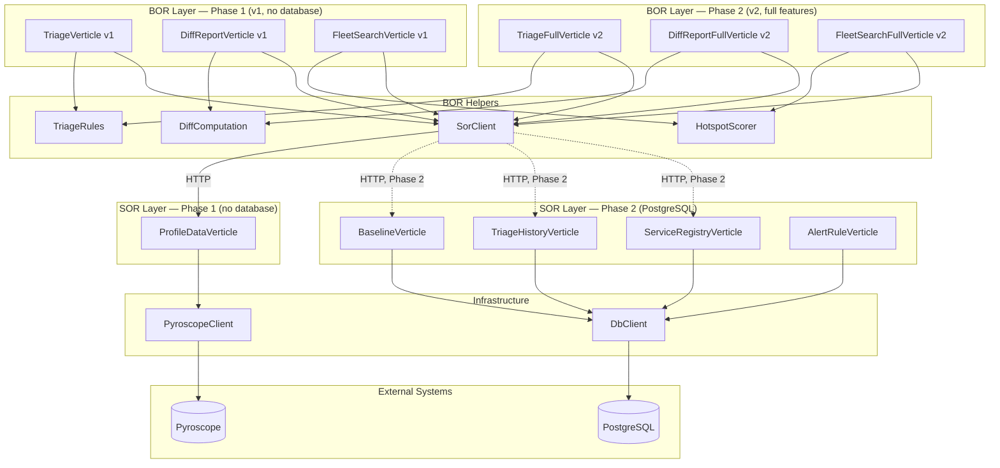
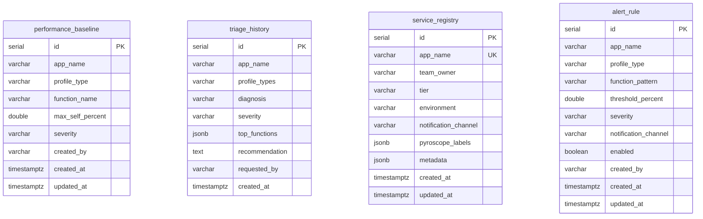
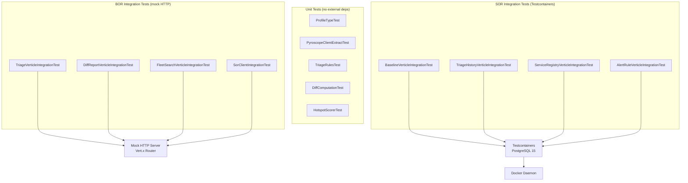

# Function Architecture — Pyroscope BOR/SOR

Project structure, design patterns, and build setup for the BOR and SOR services.

---

## Project Overview

Four independent Gradle projects under `services/`. Each produces a fat JAR (Shadow plugin) deployable as a standalone service.

| Project | Layer | Java Target | Description |
|---------|-------|-------------|-------------|
| `pyroscope-bor` | BOR | 17 | Business logic: triage, diff report, fleet search |
| `pyroscope-bor-java11` | BOR | 11 | Same functionality, Java 11 compatible |
| `pyroscope-sor` | SOR | 17 | Data access: Pyroscope API wrapper + PostgreSQL CRUD |
| `pyroscope-sor-java11` | SOR | 11 | Same functionality, Java 11 compatible |

Java 17 versions use records and switch expressions; Java 11 versions use manual POJOs and traditional switch. Both expose the same accessor signatures (`.name()`, `.selfSamples()`).

---

## Technology Stack

| Layer | Technology | Version |
|-------|-----------|---------|
| Runtime | OpenJDK | 17 (or 11 with `--release 11`) |
| Framework | Eclipse Vert.x | 4.5.8 |
| Build | Gradle + Shadow plugin | 7.6.4 |
| HTTP client | Vert.x WebClient | 4.5.8 |
| PostgreSQL driver | Vert.x Reactive PgClient | 4.5.8 |
| Testing | JUnit 5 + AssertJ + vertx-junit5 | 5.10.2 / 3.26.0 |
| Database testing | Testcontainers | 1.19.8 |

---

## High-Level Architecture



---

## Deployment Phases

### Phase 1 — No Database (4 functions)

Deploy to validate core profiling value before requesting PostgreSQL infrastructure. Only requires Pyroscope (already deployed).

| Function | Layer | FUNCTION env var | Depends on |
|----------|-------|-----------------|------------|
| Profile Data | SOR | `ReadPyroscopeProfile.sor.v1` | Pyroscope HTTP API |
| Triage | BOR | `ReadPyroscopeTriageAssessment.v1` | Profile Data SOR |
| Diff Report | BOR | `ReadPyroscopeDiffReport.v1` | Profile Data SOR |
| Fleet Search | BOR | `ReadPyroscopeFleetSearch.v1` | Profile Data SOR |

```
                  ┌──────────────────────────────────────────────┐
  Phase 1         │              BOR (1 JAR)                     │
                  │  Triage    DiffReport    FleetSearch          │
                  └──────────────┬───────────────────────────────┘
                                 │ HTTP
                  ┌──────────────▼───────────────────────────────┐
                  │              SOR (1 JAR)                     │
                  │           ProfileData                        │
                  └──────────────┬───────────────────────────────┘
                                 │ HTTP
                  ┌──────────────▼───────────────────────────────┐
                  │           Pyroscope                          │
                  └─────────────────────────────────────────────┘
```

### Phase 2 — With PostgreSQL (8 functions)

Add database-backed SORs for baseline thresholds, audit trails, service ownership, and alert rules. Upgrade BOR functions from v1 to v2 (full) by setting additional SOR URLs in config — no code changes needed.

| Function | Layer | FUNCTION env var | Depends on | PostgreSQL |
|----------|-------|-----------------|------------|:----------:|
| Profile Data | SOR | `ReadPyroscopeProfile.sor.v1` | Pyroscope | No |
| Baseline | SOR | `ReadPyroscopeBaseline.sor.v1` | — | Yes |
| Triage History | SOR | `CreatePyroscopeTriageHistory.sor.v1` | — | Yes |
| Service Registry | SOR | `ReadPyroscopeServiceRegistry.sor.v1` | — | Yes |
| Alert Rule | SOR | `ReadPyroscopeAlertRule.sor.v1` | — | Yes |
| Triage | BOR | `ReadPyroscopeTriageAssessment.v2` | Profile Data + Baseline + History | — |
| Diff Report | BOR | `ReadPyroscopeDiffReport.v2` | Profile Data + Baseline + History | — |
| Fleet Search | BOR | `ReadPyroscopeFleetSearch.v2` | Profile Data + Registry | — |

The full BOR variants (v2) handle missing SOR URLs gracefully — if `BASELINE_URL`, `HISTORY_URL`, or `REGISTRY_URL` is unset, those features are silently disabled. This means Phase 1 → Phase 2 is incremental: add SORs one at a time, set the URL, and the BOR picks it up.

### What Each Phase Adds

| Capability | Phase 1 | Phase 2 |
|-----------|:-------:|:-------:|
| Profile diagnosis | Yes | Yes |
| Deploy comparison | Yes | Yes |
| Fleet-wide hotspots | Yes | Yes |
| Baseline threshold comparison | — | Yes |
| Triage audit trail | — | Yes |
| Service ownership enrichment | — | Yes |
| Alerting rules | — | Yes |

---

## Architecture and Design Patterns

### BOR/SOR Separation

Follows the enterprise service layer pattern: BOR (Business Object Rules) owns business logic, SOR (System of Record) owns data access. Each layer deploys independently from a single fat JAR — the `FUNCTION` env var selects which verticle runs.

Why this matters: BOR engineers write diagnosis rules and scoring logic without touching SQL or HTTP client code. SOR changes (switching from Pyroscope to another profiler, changing the DB schema) don't require BOR redeployment.

### Anti-Corruption Layer

The Profile Data SOR translates Pyroscope's raw flamebearer format (4-int-stride level arrays, numTicks denominators) into a clean domain model: ranked functions with names, self-sample counts, and percentages. BOR verticles never parse Pyroscope wire format.

### Graceful Degradation

`SorClient` null-checks optional SOR clients before making calls. If a URL isn't configured, the client returns an empty result instead of failing:

```java
if (baseline == null) return Future.succeededFuture(
    new JsonObject().put("baselines", new JsonArray()));
```

This enables phased rollout — deploy full BOR verticles (v2) with only `PROFILE_DATA_URL` set, and they behave identically to lite versions until the other SOR URLs are added.

### Single Artifact, Multiple Deployments

One JAR per layer. `Main.java` reads the `FUNCTION` env var and instantiates the matching verticle. Four deployments of the same BOR JAR (with different `FUNCTION` values) run four different functions. Reduces build artifacts from 11 to 2.

### AbstractFunctionVerticle

All verticles extend `AbstractFunctionVerticle`. Subclasses only implement `initFunction()` to register their routes:

```java
public class TriageVerticle extends AbstractFunctionVerticle {
    @Override
    protected void initFunction() {
        sor = new SorClient(vertx, profileDataUrl);
        router.get("/triage/:appName").handler(this::handleTriage);
    }
}
```

The base class also provides shared parameter extraction and error response helpers used across all verticles:

- `paramLong(ctx, name, default)` / `paramInt(ctx, name, default)` / `paramStr(ctx, name, default)` — extract query parameters with defaults
- `sendError(ctx, status, message)` — send a JSON error response (`{"error": "..."}`)

```
AbstractFunctionVerticle (abstract)
├── HTTP server lifecycle (start/stop, health endpoint)
├── Router with BodyHandler
├── Parameter helpers (paramLong, paramInt, paramStr)
├── Error response helper (sendError)
└── abstract initFunction() — subclass routes
```

### Business Logic Extraction

Business logic lives in stateless utility classes with `static` methods — testable without deploying verticles:

| Class | Package | Responsibility |
|-------|---------|---------------|
| `TriageRules` | `com.pyroscope.bor.triage` | Pattern-based diagnosis of profile data, severity classification, recommendations |
| `DiffComputation` | `com.pyroscope.bor.diffreport` | Per-function delta calculation between baseline and current profiles, threshold comparison |
| `HotspotScorer` | `com.pyroscope.bor.fleetsearch` | Fleet-wide hotspot ranking by impact score (serviceCount x maxSelfPercent) |

### SorClient (BOR HTTP client)

Wraps Vert.x `WebClient` for BOR → SOR communication:

| Method | SOR Called | Returns |
|--------|----------|---------|
| `getProfile(app, type, from, to, limit)` | Profile Data | `JsonObject` with top functions |
| `getProfileDiff(app, type, bFrom, bTo, from, to, limit)` | Profile Data | `JsonObject` with baseline + current functions |
| `getApps(from, to)` | Profile Data | `List<String>` of app names |
| `getBaselines(app, type)` | Baseline | `JsonObject` with threshold list |
| `getServices()` | Service Registry | `JsonObject` with service metadata |
| `saveHistory(assessment)` | Triage History | Fire-and-forget POST |

### DbClient (SOR PostgreSQL client)

Wraps Vert.x `PgPool` with connection pooling and `queryWithRetry()` (exponential backoff, max 3 retries, 5s cap). Accepts `PgConnectOptions` directly for test injection. Config via env vars: `DB_HOST`, `DB_PORT`, `DB_NAME`, `DB_USER`, `DB_PASSWORD`, `DB_POOL_SIZE`.

### PyroscopeClient (SOR Pyroscope parser)

Wraps the Pyroscope HTTP API. `extractTopFunctions()` parses the 4-int-stride flamebearer format, aggregates self-samples across stack levels, and returns ranked `FunctionSample` objects. `ProfileType` enum maps friendly names (cpu, alloc, lock, wall) to Pyroscope query syntax.

---

## BOR Source Structure

```
pyroscope-bor/src/main/java/com/pyroscope/bor/
├── AbstractFunctionVerticle.java    # Base verticle with HTTP server lifecycle
├── Main.java                        # Entry point — selects verticle by FUNCTION env var
├── SorClient.java                   # HTTP client for SOR communication
├── sor/
│   ├── ProfileType.java             # Enum: CPU, ALLOC, LOCK, WALL with query generation
│   └── PyroscopeClient.java         # Flamebearer parser (embedded data access for lite mode)
├── triage/
│   ├── TriageRules.java             # Diagnosis, recommendation, severity logic
│   ├── TriageVerticle.java          # Lite: direct Pyroscope diagnosis
│   └── TriageFullVerticle.java      # Full: + baseline comparison + history saving
├── diffreport/
│   ├── DiffComputation.java         # Delta calculation + threshold comparison
│   ├── DiffReportVerticle.java      # Lite: baseline vs current diff
│   └── DiffReportFullVerticle.java  # Full: + threshold context + history saving
└── fleetsearch/
    ├── HotspotScorer.java           # Impact score ranking across fleet
    ├── FleetSearchVerticle.java     # Lite: search + hotspots via Profile Data SOR
    └── FleetSearchFullVerticle.java # Full: + service registry enrichment
```

## SOR Source Structure

```
pyroscope-sor/src/main/java/com/pyroscope/sor/
├── AbstractFunctionVerticle.java    # Base verticle with HTTP server lifecycle
├── Main.java                        # Entry point — selects verticle by FUNCTION env var
├── DbClient.java                    # Reactive PostgreSQL client with retry logic
├── ProfileType.java                 # Enum: CPU, ALLOC, LOCK, WALL
├── PyroscopeClient.java             # Flamebearer response parser
├── profiledata/
│   └── ProfileDataVerticle.java     # Pyroscope API wrapper — no database
├── baseline/
│   └── BaselineVerticle.java        # CRUD: performance_baseline table
├── history/
│   └── TriageHistoryVerticle.java   # CRUD: triage_history table
├── registry/
│   └── ServiceRegistryVerticle.java # CRUD: service_registry table
└── alertrule/
    └── AlertRuleVerticle.java       # CRUD: alert_rule table
```

---

## SOR Endpoint Reference

### Profile Data SOR (`ProfileDataVerticle`)

Wraps the Pyroscope HTTP API. No database.

| Endpoint | Method | Description |
|----------|--------|-------------|
| `/profiles/:appName` | GET | Fetch top functions for an app. Params: `type`, `from`, `to`, `limit` |
| `/profiles/:appName/diff` | GET | Fetch functions for two time windows. Params: `type`, `baselineFrom`, `baselineTo`, `from`, `to`, `limit` |
| `/profiles/apps` | GET | List all Pyroscope-monitored app names. Params: `from`, `to` |
| `/health` | GET | Returns `OK` |

### Baseline SOR (`BaselineVerticle`)

CRUD for approved performance thresholds. Table: `performance_baseline`.

| Endpoint | Method | Description |
|----------|--------|-------------|
| `/baselines` | POST | Create or upsert baseline. Body: `appName`, `profileType`, `functionName`, `maxSelfPercent`, `severity?`, `createdBy?` |
| `/baselines/:appName` | GET | List baselines for an app |
| `/baselines/:appName/:type` | GET | List baselines for an app and profile type |
| `/baselines/:id` | PUT | Update baseline threshold/severity |
| `/baselines/:id` | DELETE | Delete a baseline |
| `/health` | GET | Returns `OK` |

### Triage History SOR (`TriageHistoryVerticle`)

CRUD for triage assessment audit trail. Table: `triage_history`.

| Endpoint | Method | Description |
|----------|--------|-------------|
| `/history` | POST | Create history entry. Body: `appName`, `diagnosis`, `severity`, `profileTypes?`, `topFunctions?`, `recommendation?`, `requestedBy?` |
| `/history/:appName` | GET | List history for an app. Params: `limit` |
| `/history/:appName/latest` | GET | Get most recent triage for an app |
| `/history/:id` | DELETE | Delete a history entry |
| `/health` | GET | Returns `OK` |

### Service Registry SOR (`ServiceRegistryVerticle`)

CRUD for monitored application metadata. Table: `service_registry`.

| Endpoint | Method | Description |
|----------|--------|-------------|
| `/services` | POST | Create or upsert service. Body: `appName`, `teamOwner?`, `tier?`, `environment?`, `notificationChannel?`, `pyroscopeLabels?`, `metadata?` |
| `/services` | GET | List all services. Params: `tier` |
| `/services/:appName` | GET | Get service by app name |
| `/services/:appName` | PUT | Update service fields |
| `/services/:appName` | DELETE | Delete a service |
| `/health` | GET | Returns `OK` |

### Alert Rule SOR (`AlertRuleVerticle`)

CRUD for profiling-based alert rules. Table: `alert_rule`.

| Endpoint | Method | Description |
|----------|--------|-------------|
| `/rules` | POST | Create alert rule. Body: `appName`, `profileType`, `thresholdPercent`, `functionPattern?`, `severity?`, `notificationChannel?`, `enabled?`, `createdBy?` |
| `/rules` | GET | List all rules. Params: `appName` |
| `/rules/:id` | GET | Get rule by ID |
| `/rules/active/:appName` | GET | Get enabled rules for an app |
| `/rules/:id` | PUT | Update rule fields |
| `/rules/:id` | DELETE | Delete a rule |
| `/health` | GET | Returns `OK` |

---

## Database Schema

Four tables in a single PostgreSQL database. Schema DDL is at `services/pyroscope-sor/src/test/resources/schema.sql`.



Key constraints:
- `performance_baseline`: UNIQUE on `(app_name, profile_type, function_name)` — enables upsert
- `service_registry`: UNIQUE on `app_name` — one entry per monitored application
- `triage_history`: INDEX on `(app_name, created_at DESC)` — efficient latest-first queries
- `alert_rule`: INDEX on `(app_name, enabled)` — efficient active rule lookups

---

## Java 11 vs Java 17 Differences

Same functionality and API contracts. Differences are syntactic only:

| Feature | Java 17 Version | Java 11 Version |
|---------|----------------|-----------------|
| Data classes | `record FunctionSample(...)` | Manual class with constructor, fields, accessors |
| Accessor methods | Generated by record | Hand-written `.name()`, `.selfSamples()`, etc. |
| Switch | Switch expressions (`yield`) | Traditional `switch`/`case`/`break`/`return` |
| Stream terminal | `.toList()` (Java 16+) | `.collect(Collectors.toList())` |
| Text blocks | `"""..."""` | String concatenation |
| `var` keyword | Yes (Java 10+) | Yes (Java 10+) |

Tests use the same class names and assertions across both versions.

---

## Build and Test Infrastructure

### Gradle

Each project has its own `gradlew` (Gradle 7.6.4). Standard commands: `./gradlew test`, `./gradlew shadowJar`, `./gradlew clean`.

### Makefile

`services/Makefile` runs Gradle across all four projects:

| Target | Description | Docker Required |
|--------|-------------|:-:|
| `make test` | Run all tests across all 4 projects | Yes (for SOR integration) |
| `make test-unit` | Run unit tests only | No |
| `make test-bor` | Run all BOR tests | No |
| `make test-sor` | Run all SOR tests | Yes |
| `make test-bor-21` | pyroscope-bor tests only | No |
| `make test-bor-11` | pyroscope-bor-java11 tests only | No |
| `make test-sor-21` | pyroscope-sor tests only | Yes |
| `make test-sor-11` | pyroscope-sor-java11 tests only | Yes |
| `make compile` | Compile all projects | No |
| `make clean` | Clean all build artifacts | No |

### Test Architecture



Unit tests hit the extracted business logic directly — no Vert.x, no HTTP, no database. BOR integration tests deploy real verticles against mock HTTP servers. SOR integration tests use Testcontainers with real PostgreSQL (Docker required).

---

## Deployment Configuration

`FUNCTION` env var selects the verticle at startup. One JAR, multiple deployments.

| FUNCTION Value | Verticle Class | Layer | Phase | PostgreSQL |
|---------------|---------------|-------|:-----:|:----------:|
| `ReadPyroscopeProfile.sor.v1` | ProfileDataVerticle | SOR | 1 | No |
| `ReadPyroscopeTriageAssessment.v1` | TriageVerticle | BOR | 1 | No |
| `ReadPyroscopeDiffReport.v1` | DiffReportVerticle | BOR | 1 | No |
| `ReadPyroscopeFleetSearch.v1` | FleetSearchVerticle | BOR | 1 | No |
| `ReadPyroscopeBaseline.sor.v1` | BaselineVerticle | SOR | 2 | Yes |
| `CreatePyroscopeTriageHistory.sor.v1` | TriageHistoryVerticle | SOR | 2 | Yes |
| `ReadPyroscopeServiceRegistry.sor.v1` | ServiceRegistryVerticle | SOR | 2 | Yes |
| `ReadPyroscopeAlertRule.sor.v1` | AlertRuleVerticle | SOR | 2 | Yes |
| `ReadPyroscopeTriageAssessment.v2` | TriageFullVerticle | BOR | 2 | No |
| `ReadPyroscopeDiffReport.v2` | DiffReportFullVerticle | BOR | 2 | No |
| `ReadPyroscopeFleetSearch.v2` | FleetSearchFullVerticle | BOR | 2 | No |

### Environment Variables

**BOR verticles:**

| Variable | Required | Description |
|----------|:--------:|-------------|
| `FUNCTION` | Yes | Verticle selector (see table above) |
| `PORT` | No | HTTP listen port (default: 8080) |
| `PROFILE_DATA_URL` | Yes | URL of Profile Data SOR |
| `BASELINE_URL` | v2 only | URL of Baseline SOR (omit to disable) |
| `HISTORY_URL` | v2 only | URL of Triage History SOR (omit to disable) |
| `REGISTRY_URL` | v2 only | URL of Service Registry SOR (omit to disable) |

**SOR verticle — Profile Data (no database):**

| Variable | Required | Description |
|----------|:--------:|-------------|
| `FUNCTION` | Yes | `ReadPyroscopeProfile.sor.v1` |
| `PORT` | No | HTTP listen port (default: 8080) |
| `PYROSCOPE_URL` | Yes | Pyroscope server URL (e.g., `http://pyroscope:4040`) |

**SOR verticles — PostgreSQL-backed (Phase 2):**

| Variable | Required | Description |
|----------|:--------:|-------------|
| `FUNCTION` | Yes | Verticle selector |
| `PORT` | No | HTTP listen port (default: 8080) |
| `DB_HOST` | Yes | PostgreSQL host |
| `DB_PORT` | No | PostgreSQL port (default: 5432) |
| `DB_NAME` | Yes | Database name |
| `DB_USER` | Yes | Database username |
| `DB_PASSWORD` | Yes | Database password |
| `DB_POOL_SIZE` | No | Connection pool size (default: 5) |
