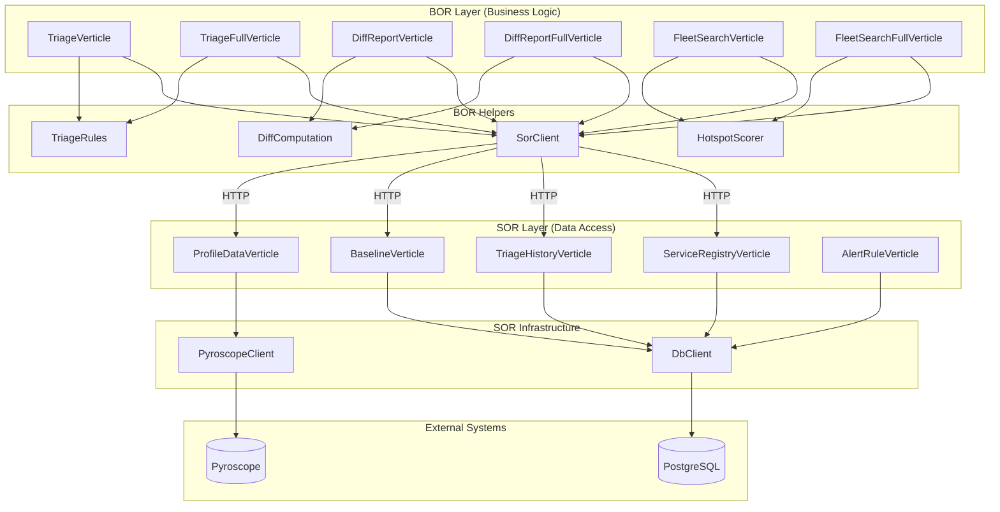
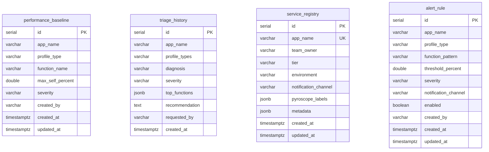
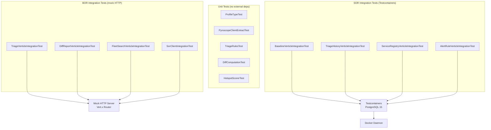

# Function Architecture — Pyroscope BOR/SOR Services

Technical architecture, project structure, design patterns, and build infrastructure for the Pyroscope BOR and SOR function services.

---

## Project Overview

The Pyroscope functions are implemented as four independent Gradle projects under `services/`. Each project produces a single fat JAR (via the Shadow plugin) that can be deployed as a standalone service.

| Project | Layer | Java Target | Description |
|---------|-------|-------------|-------------|
| `pyroscope-bor` | BOR | 17 | Business logic: triage, diff report, fleet search |
| `pyroscope-bor-java11` | BOR | 11 | Same functionality, Java 11 compatible |
| `pyroscope-sor` | SOR | 17 | Data access: Pyroscope API wrapper + PostgreSQL CRUD |
| `pyroscope-sor-java11` | SOR | 11 | Same functionality, Java 11 compatible |

Both Java versions are maintained in parallel. The Java 17 versions use records and switch expressions; the Java 11 versions use equivalent manual POJOs and traditional switch statements with identical accessor method signatures (`.name()`, `.selfSamples()`, etc.).

---

## Technology Stack

| Layer | Technology | Version |
|-------|-----------|---------|
| Runtime | OpenJDK | 17 (or 11 with `--release 11`) |
| Framework | Eclipse Vert.x | 4.5.8 |
| Build | Gradle + Shadow plugin | 7.6.4 |
| HTTP client | Vert.x WebClient | 4.5.8 |
| PostgreSQL driver | Vert.x Reactive PgClient | 4.5.8 |
| Testing | JUnit 5 + AssertJ + vertx-junit5 | 5.10.2 / 3.26.0 |
| Database testing | Testcontainers | 1.19.8 |

---

## High-Level Architecture



**Lite deployment** uses only `TriageVerticle`, `DiffReportVerticle`, `FleetSearchVerticle` + `ProfileDataVerticle`. No database required.

**Full deployment** uses the Full verticle variants, adding baseline comparison, audit trails, and service registry enrichment via the PostgreSQL-backed SOR verticles.

---

## Design Patterns

### AbstractFunctionVerticle

All verticles extend `AbstractFunctionVerticle`, which consolidates common HTTP server lifecycle:

```
AbstractFunctionVerticle (abstract)
├── Creates Router with BodyHandler
├── Registers GET /health endpoint
├── Starts HTTP server on configured port
├── Calls abstract initFunction() for subclass routes
└── Manages graceful shutdown
```

Subclasses only implement `initFunction()` to register their routes:

```java
public class TriageVerticle extends AbstractFunctionVerticle {
    public TriageVerticle(String profileDataUrl, int port) {
        super(port);
        this.profileDataUrl = profileDataUrl;
    }

    @Override
    protected void initFunction() {
        sor = new SorClient(vertx, profileDataUrl);
        router.get("/triage/:appName").handler(this::handleTriage);
    }
}
```

### Business Logic Extraction

Business logic is extracted into stateless utility classes with `static` methods, making them independently testable without deploying verticles or starting HTTP servers:

| Class | Package | Responsibility |
|-------|---------|---------------|
| `TriageRules` | `com.pyroscope.bor.triage` | Pattern-based diagnosis of profile data, severity classification, recommendations |
| `DiffComputation` | `com.pyroscope.bor.diffreport` | Per-function delta calculation between baseline and current profiles, threshold comparison |
| `HotspotScorer` | `com.pyroscope.bor.fleetsearch` | Fleet-wide hotspot ranking by impact score (serviceCount x maxSelfPercent) |

### SorClient (BOR-side HTTP client)

`SorClient` is the BOR's HTTP client for communicating with SOR services. It wraps Vert.x `WebClient` and provides typed methods:

| Method | SOR Called | Returns |
|--------|----------|---------|
| `getProfile(app, type, from, to, limit)` | Profile Data | `JsonObject` with top functions |
| `getProfileDiff(app, type, bFrom, bTo, from, to, limit)` | Profile Data | `JsonObject` with baseline + current functions |
| `getApps(from, to)` | Profile Data | `List<String>` of app names |
| `getBaselines(app, type)` | Baseline | `JsonObject` with threshold list |
| `getServices()` | Service Registry | `JsonObject` with service metadata |
| `saveHistory(assessment)` | Triage History | Fire-and-forget POST |

### DbClient (SOR-side PostgreSQL client)

`DbClient` wraps Vert.x's reactive `PgPool` and provides:

- Connection pool management with configurable pool size
- `queryWithRetry(sql, params, maxRetries)` with exponential backoff
- Constructor overload accepting `PgConnectOptions` for Testcontainers injection in tests
- Environment variable-based configuration (`DB_HOST`, `DB_PORT`, `DB_NAME`, `DB_USER`, `DB_PASSWORD`)

### PyroscopeClient (SOR-side Pyroscope parser)

`PyroscopeClient` wraps the Pyroscope HTTP API and parses the flamebearer response format:

- `extractTopFunctions(renderResponse, limit)` — Parses the 4-int-stride flamebearer format (offset, total, self, nameIdx), aggregates self-samples across stack levels, calculates percentages, sorts by self-samples descending, and returns a ranked list of `FunctionSample` objects.
- `ProfileType` enum maps user-friendly type names (cpu, alloc, lock, wall) to Pyroscope query syntax (e.g., `myapp.cpu{}`, `myapp.alloc_in_new_tlab_bytes{}`).

---

## BOR Source Structure

```
pyroscope-bor/src/main/java/com/pyroscope/bor/
├── AbstractFunctionVerticle.java    # Base verticle with HTTP server lifecycle
├── Main.java                        # Entry point — selects verticle by FUNCTION env var
├── SorClient.java                   # HTTP client for SOR communication
├── sor/
│   ├── ProfileType.java             # Enum: CPU, ALLOC, LOCK, WALL with query generation
│   └── PyroscopeClient.java         # Flamebearer parser (embedded data access for lite mode)
├── triage/
│   ├── TriageRules.java             # Diagnosis, recommendation, severity logic
│   ├── TriageVerticle.java          # Lite: direct Pyroscope diagnosis
│   └── TriageFullVerticle.java      # Full: + baseline comparison + history saving
├── diffreport/
│   ├── DiffComputation.java         # Delta calculation + threshold comparison
│   ├── DiffReportVerticle.java      # Lite: baseline vs current diff
│   └── DiffReportFullVerticle.java  # Full: + threshold context + history saving
└── fleetsearch/
    ├── HotspotScorer.java           # Impact score ranking across fleet
    ├── FleetSearchVerticle.java     # Lite: search + hotspots via Profile Data SOR
    └── FleetSearchFullVerticle.java # Full: + service registry enrichment
```

## SOR Source Structure

```
pyroscope-sor/src/main/java/com/pyroscope/sor/
├── AbstractFunctionVerticle.java    # Base verticle with HTTP server lifecycle
├── Main.java                        # Entry point — selects verticle by FUNCTION env var
├── DbClient.java                    # Reactive PostgreSQL client with retry logic
├── ProfileType.java                 # Enum: CPU, ALLOC, LOCK, WALL
├── PyroscopeClient.java             # Flamebearer response parser
├── profiledata/
│   └── ProfileDataVerticle.java     # Pyroscope API wrapper — no database
├── baseline/
│   └── BaselineVerticle.java        # CRUD: performance_baseline table
├── history/
│   └── TriageHistoryVerticle.java   # CRUD: triage_history table
├── registry/
│   └── ServiceRegistryVerticle.java # CRUD: service_registry table
└── alertrule/
    └── AlertRuleVerticle.java       # CRUD: alert_rule table
```

---

## SOR Endpoint Reference

### Profile Data SOR (`ProfileDataVerticle`)

Wraps the Pyroscope HTTP API. No database.

| Endpoint | Method | Description |
|----------|--------|-------------|
| `/profiles/:appName` | GET | Fetch top functions for an app. Params: `type`, `from`, `to`, `limit` |
| `/profiles/:appName/diff` | GET | Fetch functions for two time windows. Params: `type`, `baselineFrom`, `baselineTo`, `from`, `to`, `limit` |
| `/profiles/apps` | GET | List all Pyroscope-monitored app names. Params: `from`, `to` |
| `/health` | GET | Returns `OK` |

### Baseline SOR (`BaselineVerticle`)

CRUD for approved performance thresholds. Table: `performance_baseline`.

| Endpoint | Method | Description |
|----------|--------|-------------|
| `/baselines` | POST | Create or upsert baseline. Body: `appName`, `profileType`, `functionName`, `maxSelfPercent`, `severity?`, `createdBy?` |
| `/baselines/:appName` | GET | List baselines for an app |
| `/baselines/:appName/:type` | GET | List baselines for an app and profile type |
| `/baselines/:id` | PUT | Update baseline threshold/severity |
| `/baselines/:id` | DELETE | Delete a baseline |
| `/health` | GET | Returns `OK` |

### Triage History SOR (`TriageHistoryVerticle`)

CRUD for triage assessment audit trail. Table: `triage_history`.

| Endpoint | Method | Description |
|----------|--------|-------------|
| `/history` | POST | Create history entry. Body: `appName`, `diagnosis`, `severity`, `profileTypes?`, `topFunctions?`, `recommendation?`, `requestedBy?` |
| `/history/:appName` | GET | List history for an app. Params: `limit` |
| `/history/:appName/latest` | GET | Get most recent triage for an app |
| `/history/:id` | DELETE | Delete a history entry |
| `/health` | GET | Returns `OK` |

### Service Registry SOR (`ServiceRegistryVerticle`)

CRUD for monitored application metadata. Table: `service_registry`.

| Endpoint | Method | Description |
|----------|--------|-------------|
| `/services` | POST | Create or upsert service. Body: `appName`, `teamOwner?`, `tier?`, `environment?`, `notificationChannel?`, `pyroscopeLabels?`, `metadata?` |
| `/services` | GET | List all services. Params: `tier` |
| `/services/:appName` | GET | Get service by app name |
| `/services/:appName` | PUT | Update service fields |
| `/services/:appName` | DELETE | Delete a service |
| `/health` | GET | Returns `OK` |

### Alert Rule SOR (`AlertRuleVerticle`)

CRUD for profiling-based alert rules. Table: `alert_rule`.

| Endpoint | Method | Description |
|----------|--------|-------------|
| `/rules` | POST | Create alert rule. Body: `appName`, `profileType`, `thresholdPercent`, `functionPattern?`, `severity?`, `notificationChannel?`, `enabled?`, `createdBy?` |
| `/rules` | GET | List all rules. Params: `appName` |
| `/rules/:id` | GET | Get rule by ID |
| `/rules/active/:appName` | GET | Get enabled rules for an app |
| `/rules/:id` | PUT | Update rule fields |
| `/rules/:id` | DELETE | Delete a rule |
| `/health` | GET | Returns `OK` |

---

## Database Schema

Four tables in a single PostgreSQL database. Schema DDL is at `services/pyroscope-sor/src/test/resources/schema.sql`.



Key constraints:
- `performance_baseline`: UNIQUE on `(app_name, profile_type, function_name)` — enables upsert
- `service_registry`: UNIQUE on `app_name` — one entry per monitored application
- `triage_history`: INDEX on `(app_name, created_at DESC)` — efficient latest-first queries
- `alert_rule`: INDEX on `(app_name, enabled)` — efficient active rule lookups

---

## Java 11 vs Java 17 Differences

The Java 11 versions maintain identical functionality and API contracts. The differences are purely syntactic:

| Feature | Java 17 Version | Java 11 Version |
|---------|----------------|-----------------|
| Data classes | `record FunctionSample(...)` | Manual class with constructor, fields, accessors |
| Accessor methods | Generated by record | Hand-written `.name()`, `.selfSamples()`, etc. |
| Switch | Switch expressions (`yield`) | Traditional `switch`/`case`/`break`/`return` |
| Stream terminal | `.toList()` (Java 16+) | `.collect(Collectors.toList())` |
| Text blocks | `"""..."""` | String concatenation |
| `var` keyword | Yes (Java 10+) | Yes (Java 10+) |

Both versions use the same test class names and the same assertion logic. Tests reference accessor methods (`.name()`, `.selfSamples()`) that are consistent across both versions.

---

## Build and Test Infrastructure

### Gradle Wrapper

Each project has its own Gradle Wrapper (`gradlew`) configured for Gradle 7.6.4. No global Gradle installation required.

### Build Commands

```bash
# From any project directory
./gradlew compileJava          # Compile main sources
./gradlew compileTestJava      # Compile test sources
./gradlew test                 # Run all tests
./gradlew shadowJar            # Build fat JAR for deployment
./gradlew clean                # Clean build artifacts
```

### Makefile

The `services/Makefile` provides top-level targets for all four projects:

| Target | Description | Docker Required |
|--------|-------------|:-:|
| `make test` | Run all tests across all 4 projects | Yes (for SOR integration) |
| `make test-unit` | Run unit tests only | No |
| `make test-bor` | Run all BOR tests | No |
| `make test-sor` | Run all SOR tests | Yes |
| `make test-bor-21` | pyroscope-bor tests only | No |
| `make test-bor-11` | pyroscope-bor-java11 tests only | No |
| `make test-sor-21` | pyroscope-sor tests only | Yes |
| `make test-sor-11` | pyroscope-sor-java11 tests only | Yes |
| `make compile` | Compile all projects | No |
| `make clean` | Clean all build artifacts | No |

### Test Architecture



**Unit tests** test extracted business logic classes directly. No Vert.x, no HTTP, no database.

**BOR integration tests** deploy real verticles and use mock HTTP servers (Vert.x `HttpServer` + `Router`) to simulate SOR responses. No Docker required.

**SOR integration tests** deploy real verticles against a real PostgreSQL instance managed by Testcontainers. Docker daemon required.

---

## Deployment Configuration

Each verticle is selected at startup via the `FUNCTION` environment variable. `Main.java` maps the value to the corresponding verticle class:

| FUNCTION Value | Verticle Class | Layer |
|---------------|---------------|-------|
| `ReadPyroscopeTriageAssessment.v1` | TriageVerticle | BOR |
| `ReadPyroscopeTriageAssessment.v2` | TriageFullVerticle | BOR |
| `ReadPyroscopeDiffReport.v1` | DiffReportVerticle | BOR |
| `ReadPyroscopeDiffReport.v2` | DiffReportFullVerticle | BOR |
| `ReadPyroscopeFleetSearch.v1` | FleetSearchVerticle | BOR |
| `ReadPyroscopeFleetSearch.v2` | FleetSearchFullVerticle | BOR |
| `ReadPyroscopeProfile.sor.v1` | ProfileDataVerticle | SOR |
| `ReadPyroscopeBaseline.sor.v1` | BaselineVerticle | SOR |
| `CreatePyroscopeTriageHistory.sor.v1` | TriageHistoryVerticle | SOR |
| `ReadPyroscopeServiceRegistry.sor.v1` | ServiceRegistryVerticle | SOR |
| `ReadPyroscopeAlertRule.sor.v1` | AlertRuleVerticle | SOR |

### Environment Variables

**BOR verticles:**

| Variable | Required | Description |
|----------|:--------:|-------------|
| `FUNCTION` | Yes | Verticle selector (see table above) |
| `PORT` | No | HTTP listen port (default: 8080) |
| `PROFILE_DATA_URL` | Yes | URL of Profile Data SOR |
| `BASELINE_URL` | Full only | URL of Baseline SOR |
| `HISTORY_URL` | Full only | URL of Triage History SOR |
| `REGISTRY_URL` | Full only | URL of Service Registry SOR |

**SOR verticles (PostgreSQL):**

| Variable | Required | Description |
|----------|:--------:|-------------|
| `FUNCTION` | Yes | Verticle selector |
| `PORT` | No | HTTP listen port (default: 8080) |
| `DB_HOST` | Yes | PostgreSQL host |
| `DB_PORT` | No | PostgreSQL port (default: 5432) |
| `DB_NAME` | Yes | Database name |
| `DB_USER` | Yes | Database username |
| `DB_PASSWORD` | Yes | Database password |
| `DB_POOL_SIZE` | No | Connection pool size (default: 5) |

**SOR verticle (Profile Data):**

| Variable | Required | Description |
|----------|:--------:|-------------|
| `FUNCTION` | Yes | `ReadPyroscopeProfile.sor.v1` |
| `PORT` | No | HTTP listen port (default: 8080) |
| `PYROSCOPE_URL` | Yes | Pyroscope server URL (e.g., `http://pyroscope:4040`) |
