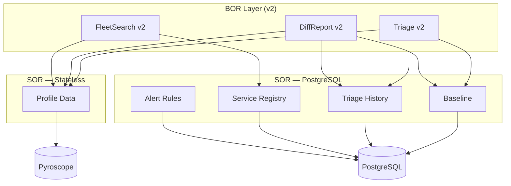
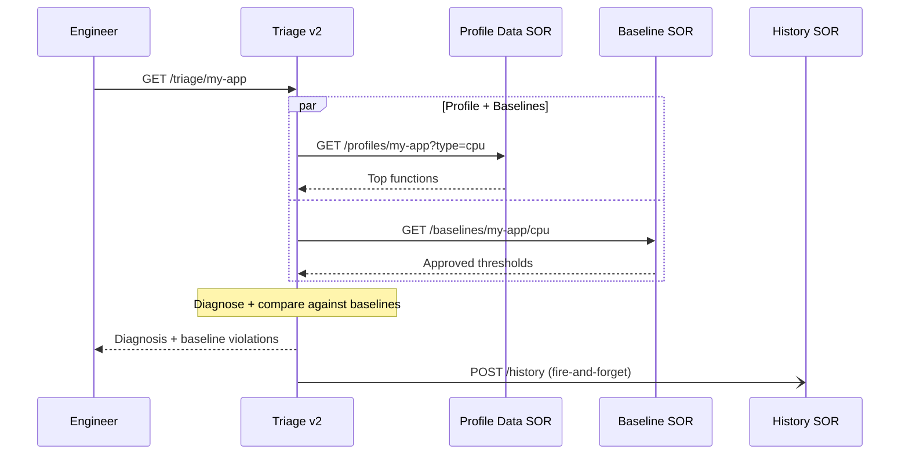
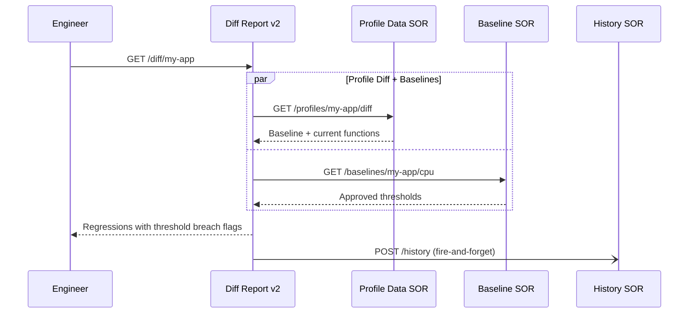
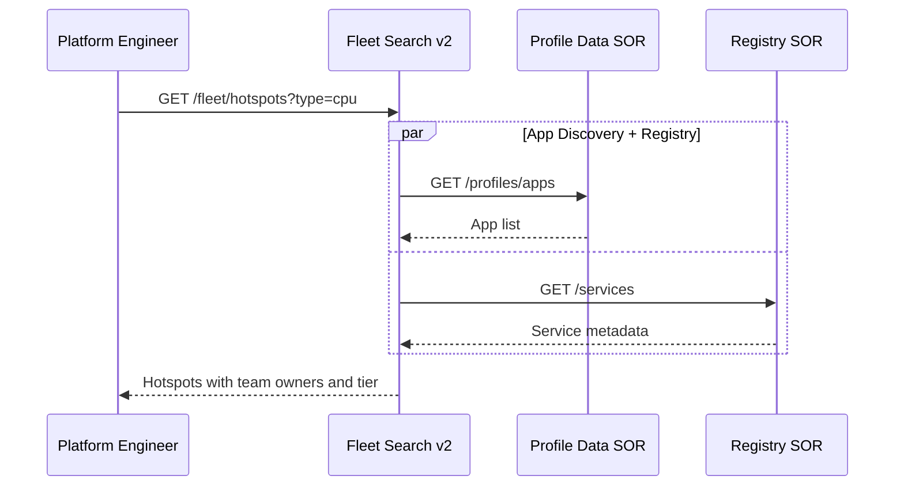
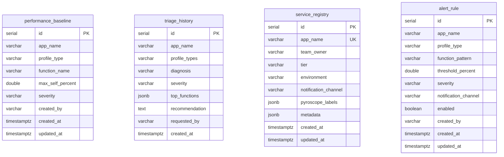

# Pyroscope Functions — Phase 2 (With PostgreSQL)

Adds 4 PostgreSQL-backed SOR functions and upgrades the 3 BOR functions from v1 to v2. Builds on top of [Phase 1](function-phase1.md).

---

## What Phase 2 Adds

| Capability | Phase 1 | Phase 2 |
|-----------|:-------:|:-------:|
| Profile diagnosis | Yes | Yes |
| Deploy comparison | Yes | Yes |
| Fleet-wide hotspots | Yes | Yes |
| Baseline threshold comparison | — | Yes |
| Triage audit trail | — | Yes |
| Service ownership enrichment | — | Yes |
| Alerting rules | — | Yes |

---

## Architecture



---

## Upgraded BOR Functions (v1 → v2)

The v2 functions serve the **same API endpoints with the same parameters**. The response includes additional fields.

### 1. Triage v2 — Baseline Comparison + Audit Trail

**Business Impact:** Instead of "GC is high," says "GC is at 34.2% which exceeds the approved baseline of 15% by 19.2 points." Every assessment is saved for trend analysis and post-mortem review.



**Additional response fields:**

```json
{
  "profiles": {
    "cpu": {
      "baselineViolations": [
        { "function": "G1 Young Generation", "currentPercent": 34.2, "threshold": 15.0, "exceededBy": 19.2, "severity": "warning" }
      ]
    }
  },
  "summary": { "baselineViolations": 1 }
}
```

### 2. Diff Report v2 — Threshold Context + Audit Trail

**Business Impact:** Regressions annotated with whether they breach approved thresholds. Data-driven deployment go/no-go decisions.



**Additional response fields:**

```json
{
  "regressions": [
    { "function": "DataSerializer.serialize", "deltaPercent": 6.6, "approvedThreshold": 5.0, "exceedsThreshold": true }
  ],
  "summary": { "thresholdBreaches": 1 }
}
```

### 3. Fleet Search v2 — Service Ownership Enrichment

**Business Impact:** Results include who owns each service and its tier. `criticalServiceCount` prioritizes hotspots affecting critical services.



**Additional response fields:**

```json
{
  "hotspots": [
    {
      "function": "java.util.HashMap.resize",
      "criticalServiceCount": 1,
      "services": [
        { "app": "app-a", "selfPercent": 8.2, "teamOwner": "team-a", "tier": "critical" }
      ]
    }
  ]
}
```

---

## New SOR Functions (4)

All require PostgreSQL. Same JAR as Phase 1's Profile Data SOR — different `FUNCTION` env var.

### Baseline SOR

CRUD for approved performance thresholds. Table: `performance_baseline`. Upsert via `ON CONFLICT DO UPDATE` on `(app_name, profile_type, function_name)`.

**Business Impact:** Establishes approved thresholds per function so triage and diff report can flag violations automatically.

| Endpoint | Method | Description |
|----------|--------|-------------|
| `/baselines` | POST | Create or upsert. Body: `appName`, `profileType`, `functionName`, `maxSelfPercent`, `severity?`, `createdBy?` |
| `/baselines/:appName` | GET | List baselines for an app |
| `/baselines/:appName/:type` | GET | List by app and profile type |
| `/baselines/:id` | PUT | Update threshold/severity |
| `/baselines/:id` | DELETE | Delete |

### Triage History SOR

Audit trail for triage assessments. Table: `triage_history`. Indexed on `(app_name, created_at DESC)`.

**Business Impact:** Post-mortem reviews reference exactly what was diagnosed and when. Trend analysis over time. Compliance requirement for audit trails.

| Endpoint | Method | Description |
|----------|--------|-------------|
| `/history` | POST | Create entry. Body: `appName`, `diagnosis`, `severity`, `profileTypes?`, `topFunctions?`, `recommendation?`, `requestedBy?` |
| `/history/:appName` | GET | List by app. Params: `limit` |
| `/history/:appName/latest` | GET | Most recent triage |
| `/history/:id` | DELETE | Delete |

### Service Registry SOR

Metadata for monitored apps. Table: `service_registry`. Unique on `app_name`.

**Business Impact:** Fleet search results include who owns each service. Hotspot findings route directly to the responsible team.

| Endpoint | Method | Description |
|----------|--------|-------------|
| `/services` | POST | Create or upsert. Body: `appName`, `teamOwner?`, `tier?`, `environment?`, `notificationChannel?`, `pyroscopeLabels?`, `metadata?` |
| `/services` | GET | List all. Params: `tier` |
| `/services/:appName` | GET | Get by app name |
| `/services/:appName` | PUT | Update |
| `/services/:appName` | DELETE | Delete |

### Alert Rule SOR

CRUD for profiling-based alert rules. Table: `alert_rule`. Indexed on `(app_name, enabled)`.

**Business Impact:** Future automation: "alert if GC > 30% for app X."

| Endpoint | Method | Description |
|----------|--------|-------------|
| `/rules` | POST | Create. Body: `appName`, `profileType`, `thresholdPercent`, `functionPattern?`, `severity?`, `notificationChannel?`, `enabled?`, `createdBy?` |
| `/rules` | GET | List all. Params: `appName` |
| `/rules/:id` | GET | Get by ID |
| `/rules/active/:appName` | GET | Enabled rules for an app |
| `/rules/:id` | PUT | Update |
| `/rules/:id` | DELETE | Delete |

---

## Database Schema

Four tables in a single PostgreSQL database. Schema DDL at `services/pyroscope-sor/src/test/resources/schema.sql`.



---

## Deployment

### New SOR Functions (PostgreSQL)

| Variable | Required | Description |
|----------|:--------:|-------------|
| `FUNCTION` | Yes | See table below |
| `PORT` | No | HTTP listen port (default: 8080) |
| `DB_HOST` | Yes | PostgreSQL host |
| `DB_PORT` | No | PostgreSQL port (default: 5432) |
| `DB_NAME` | Yes | Database name |
| `DB_USER` | Yes | Database username |
| `DB_PASSWORD` | Yes | Database password |
| `DB_POOL_SIZE` | No | Connection pool size (default: 5) |

### Upgraded BOR Functions

| Variable | Required | Description |
|----------|:--------:|-------------|
| `FUNCTION` | Yes | v2 variant (see table below) |
| `PORT` | No | HTTP listen port (default: 8080) |
| `PROFILE_DATA_URL` | Yes | URL of Profile Data SOR (unchanged) |
| `BASELINE_URL` | No | URL of Baseline SOR (omit to disable) |
| `HISTORY_URL` | No | URL of Triage History SOR (omit to disable) |
| `REGISTRY_URL` | No | URL of Service Registry SOR (omit to disable) |

### Example

```
# Profile Data SOR (unchanged from Phase 1)
FUNCTION=ReadPyroscopeProfile.sor.v1
PYROSCOPE_URL=http://pyroscope:4040
PORT=8082

# Baseline SOR
FUNCTION=ReadPyroscopeBaseline.sor.v1
DB_HOST=postgres  DB_PORT=5432  DB_NAME=pyroscope  DB_USER=pyroscope  DB_PASSWORD=...
PORT=8081

# Triage History SOR
FUNCTION=CreatePyroscopeTriageHistory.sor.v1
DB_HOST=postgres  DB_PORT=5432  DB_NAME=pyroscope  DB_USER=pyroscope  DB_PASSWORD=...
PORT=8081

# Service Registry SOR
FUNCTION=ReadPyroscopeServiceRegistry.sor.v1
DB_HOST=postgres  DB_PORT=5432  DB_NAME=pyroscope  DB_USER=pyroscope  DB_PASSWORD=...
PORT=8081

# Alert Rule SOR
FUNCTION=ReadPyroscopeAlertRule.sor.v1
DB_HOST=postgres  DB_PORT=5432  DB_NAME=pyroscope  DB_USER=pyroscope  DB_PASSWORD=...
PORT=8081

# Triage v2
FUNCTION=ReadPyroscopeTriageAssessment.v2
PROFILE_DATA_URL=http://profile-data-sor:8082
BASELINE_URL=http://baseline-sor:8081
HISTORY_URL=http://history-sor:8081
PORT=8080

# Diff Report v2
FUNCTION=ReadPyroscopeDiffReport.v2
PROFILE_DATA_URL=http://profile-data-sor:8082
BASELINE_URL=http://baseline-sor:8081
HISTORY_URL=http://history-sor:8081
PORT=8080

# Fleet Search v2
FUNCTION=ReadPyroscopeFleetSearch.v2
PROFILE_DATA_URL=http://profile-data-sor:8082
REGISTRY_URL=http://registry-sor:8081
PORT=8080
```

### All Phase 2 FUNCTION Values

| Value | Layer | Requires |
|-------|-------|----------|
| `ReadPyroscopeBaseline.sor.v1` | SOR | PostgreSQL |
| `CreatePyroscopeTriageHistory.sor.v1` | SOR | PostgreSQL |
| `ReadPyroscopeServiceRegistry.sor.v1` | SOR | PostgreSQL |
| `ReadPyroscopeAlertRule.sor.v1` | SOR | PostgreSQL |
| `ReadPyroscopeTriageAssessment.v2` | BOR | Profile Data + Baseline + History |
| `ReadPyroscopeDiffReport.v2` | BOR | Profile Data + Baseline + History |
| `ReadPyroscopeFleetSearch.v2` | BOR | Profile Data + Registry |

---

## Testing

SOR integration tests require Docker (Testcontainers PostgreSQL).

```bash
make test-sor    # All SOR tests (requires Docker)

cd services/pyroscope-sor && ./gradlew test --tests '*BaselineVerticleIntegrationTest'
```

| Test Class | What It Tests |
|-----------|--------------|
| `BaselineVerticleIntegrationTest` | CRUD: create, upsert, list, update, delete, validation |
| `TriageHistoryVerticleIntegrationTest` | CRUD: create, list with pagination, latest, delete |
| `ServiceRegistryVerticleIntegrationTest` | CRUD: create, upsert, tier filter, JSONB updates, delete |
| `AlertRuleVerticleIntegrationTest` | CRUD: create, app filter, active rules, update, delete |

---

## Upgrade Path from Phase 1

1. Apply `schema.sql` to PostgreSQL (creates 4 tables)
2. Deploy 4 new SOR functions
3. Switch BOR `FUNCTION` values from v1 → v2
4. Set `BASELINE_URL`, `HISTORY_URL`, `REGISTRY_URL`

Steps 2-4 can be done incrementally — the v2 BORs silently skip any SOR whose URL is not set.
