# Pyroscope BOR Function Reference

Three functions on top of Pyroscope: triage (incident diagnosis), diff report (deploy comparison), fleet search (cross-service hotspots).

## Architecture

BOR/SOR layering — BORs have the business logic, SORs handle data access. BORs never talk to Pyroscope or PostgreSQL directly.

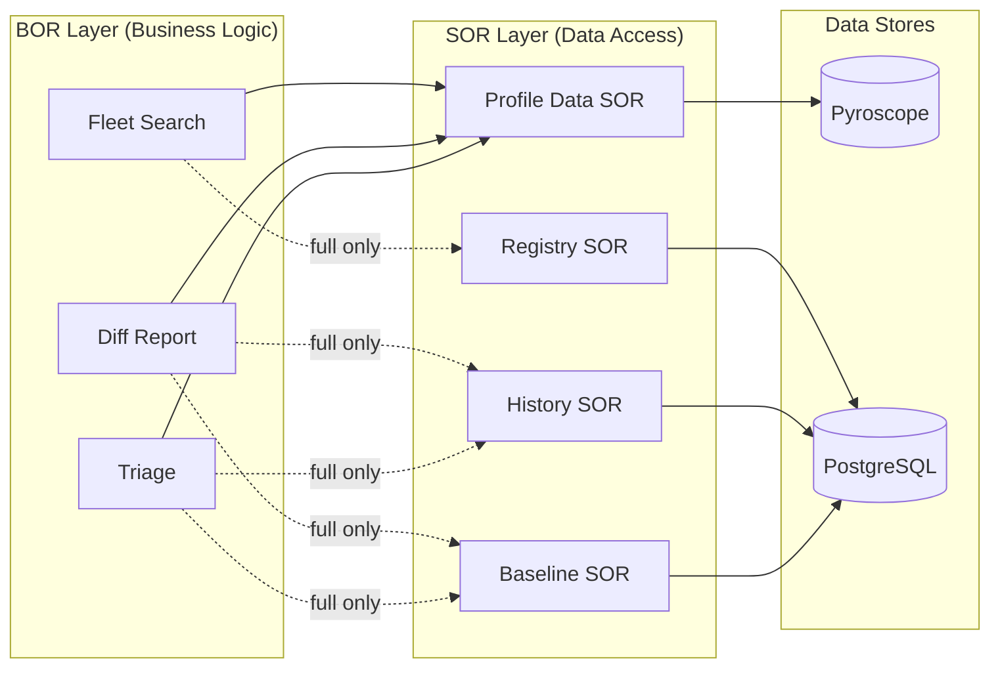

**Lite deployment** (solid lines) requires only Pyroscope. No database needed.

**Full deployment** (dashed lines) adds PostgreSQL-backed SORs for baseline comparison, audit trails, and service ownership.

---

## 1. Profile Triage

### MVP Use Case

An engineer is paged at 2 AM for a latency spike on an application. Instead of logging into Grafana, navigating to Pyroscope, selecting the right time range, reading a flame graph, and interpreting the results, they call one endpoint:

```
GET /triage/my-app
```

The function returns: **"gc_pressure — high severity — GC activity in CPU profile, check heap sizing. Top function: G1 Young Generation (34.2%)"**

The engineer now knows the root cause is garbage collection pressure. They increase the heap size, latency recovers, and they go back to sleep. No flame graph expertise required.

**MVP scope:** Single HTTP GET, sensible defaults (last hour, CPU + allocation profiles), pattern-based diagnosis, actionable recommendation in the response body.

### Business Impact

| Impact Area | Benefit |
|-------------|---------|
| **MTTR reduction** | Eliminates the manual profiling investigation step during incidents. Engineers get a diagnosis in seconds instead of spending 15-30 minutes reading flame graphs. |
| **Knowledge democratization** | Junior engineers and on-call rotations get the same diagnostic quality as profiling experts. Reduces dependency on senior engineers during incidents. |
| **Consistent incident response** | Every triage follows the same diagnostic rules. No variance in quality depending on who is on call. |
| **Audit trail (full)** | Every triage assessment is recorded. Post-mortem reviews can reference exactly what was diagnosed and when, satisfying compliance requirements. |

### How it works

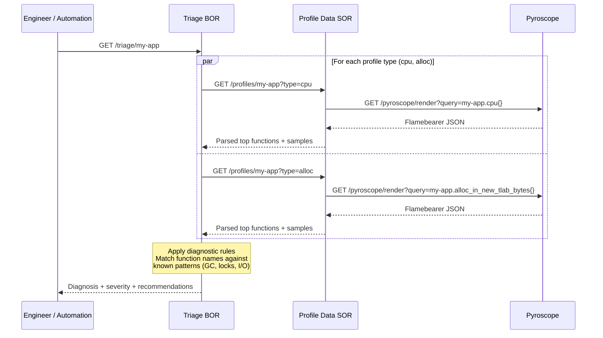

The BOR applies pattern-matching rules against the top functions in each profile type:

| Profile Type | Patterns Detected | Diagnosis |
|-------------|-------------------|-----------|
| CPU | GC, G1, ParallelGC, ZGC | `gc_pressure` |
| CPU | park, sleep, Object.wait | `thread_waiting` |
| CPU | synchronized, ReentrantLock | `lock_contention` |
| CPU | Compiler, C1, C2 | `jit_overhead` |
| Alloc | StringBuilder, concat, String.format | `string_allocation` |
| Alloc | ArrayList, HashMap, resize, grow | `collection_resizing` |
| Alloc | Jackson, Gson, deserialize | `deserialization_overhead` |
| Wall | sleep, wait, park, idle | `idle_time` |
| Wall | socket, connect, dns, InputStream.read, OutputStream.write, SocketChannel | `network_io` |

### API

```
GET /triage/:appName
```

| Parameter | Default | Description |
|-----------|---------|-------------|
| `from` | now - 1h | Start time (epoch seconds) |
| `to` | now | End time (epoch seconds) |
| `types` | `cpu,alloc` | Comma-separated profile types to analyze |
| `limit` | `10` | Top N functions per profile type |

### Example

**Request:**
```
GET /triage/my-app
```

**Response:**
```json
{
  "appName": "my-app",
  "from": 1706000000,
  "to": 1706003600,
  "profiles": {
    "cpu": {
      "diagnosis": "gc_pressure",
      "totalSamples": 48230,
      "topFunctions": [
        { "name": "G1 Young Generation", "selfPercent": 34.2, "selfSamples": 16494 },
        { "name": "com.example.AppService.process", "selfPercent": 12.1, "selfSamples": 5836 }
      ],
      "recommendation": "GC activity in CPU profile — check heap sizing (-Xmx), reduce allocation rate. Top: G1 Young Generation"
    },
    "alloc": {
      "diagnosis": "collection_resizing",
      "totalSamples": 112000000,
      "topFunctions": [
        { "name": "java.util.HashMap.resize", "selfPercent": 18.5, "selfSamples": 20720000 }
      ],
      "recommendation": "Collection resizing — pre-size collections with expected capacity. Top: java.util.HashMap.resize"
    }
  },
  "summary": {
    "primaryIssue": "gc_pressure",
    "severity": "high",
    "recommendation": "GC activity in CPU profile — check heap sizing (-Xmx), reduce allocation rate. Top: G1 Young Generation"
  }
}
```

### Incident workflow

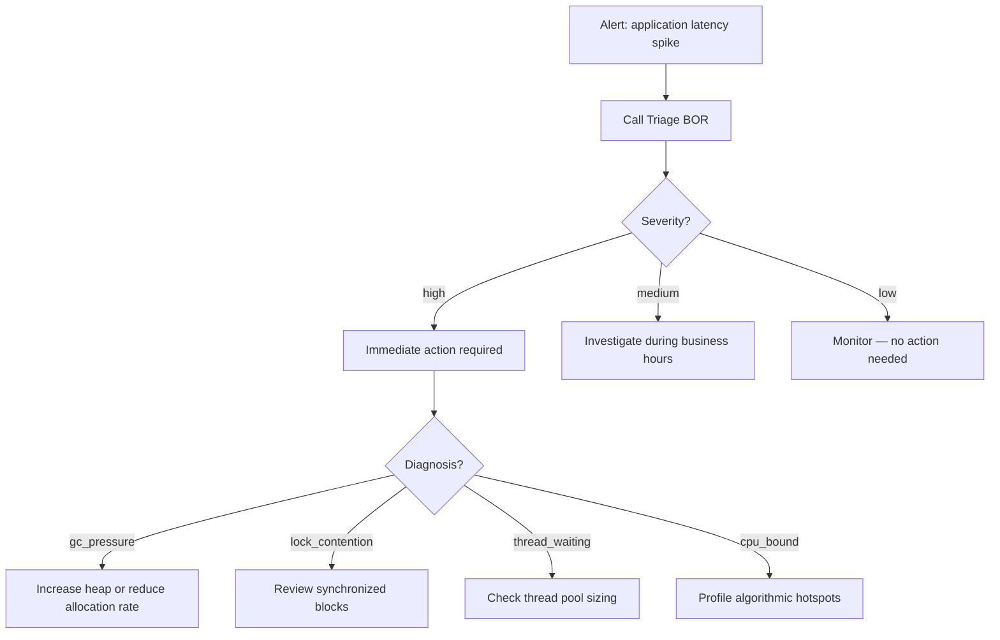

---

## 2. Diff Report

### MVP Use Case

A team deploys `my-app` v2.3.1. They need to know if the deployment changed performance. Instead of opening Pyroscope, manually selecting two time ranges, and eyeballing flame graph differences, they call:

```
GET /diff/my-app?baselineFrom=1706000000&baselineTo=1706003600&from=1706003600&to=1706007200
```

The function returns: **"1 regression — com.example.DataSerializer.serialize went from 2.1% to 8.7% (+6.6%). 1 improvement — com.example.CacheManager.lookup dropped from 15.3% to 3.1% (-12.2%)."**

The team sees the new serializer code is a regression and the caching optimization worked. No flame graph comparison required.

**MVP scope:** Single HTTP GET, two time windows (baseline vs current), per-function delta computation, JSON or Markdown output, sensible defaults (compare last hour vs previous hour).

### Business Impact

| Impact Area | Benefit |
|-------------|---------|
| **Deployment confidence** | Teams know within minutes whether a deploy introduced regressions. Reduces the window between "deploy" and "detect regression" from hours/days to the time it takes profiling data to accumulate (10-15 minutes). |
| **Rollback decision support** | Quantified regression data ("serialize went from 2% to 9%") gives teams evidence to justify a rollback instead of guessing. |
| **Optimization validation** | When teams optimize code, the diff report proves the improvement with numbers. Justifies engineering investment in performance work. |
| **CI/CD integration** | Markdown output can be posted directly to pull requests or Slack channels as deployment evidence. |
| **Threshold compliance (full)** | Full version flags regressions that breach approved baselines, providing data-driven deployment go/no-go decisions. |

### How it works

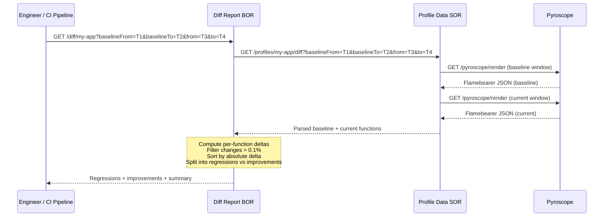

### API

```
GET /diff/:appName
```

| Parameter | Default | Description |
|-----------|---------|-------------|
| `from` | `to` - 1h | Current window start (epoch seconds) |
| `to` | now | Current window end (epoch seconds) |
| `baselineFrom` | `from` - 1h | Baseline window start (epoch seconds) |
| `baselineTo` | `from` | Baseline window end (epoch seconds) |
| `type` | `cpu` | Profile type to compare |
| `limit` | `20` | Top N changes to return |
| `format` | `json` | Response format: `json` or `markdown` |

### Example

**Request** (compare pre-deploy vs post-deploy):
```
GET /diff/my-app?baselineFrom=1706000000&baselineTo=1706003600&from=1706003600&to=1706007200
```

**Response (JSON):**
```json
{
  "appName": "my-app",
  "profileType": "cpu",
  "baseline": { "from": 1706000000, "to": 1706003600 },
  "current": { "from": 1706003600, "to": 1706007200 },
  "regressions": [
    {
      "function": "com.example.DataSerializer.serialize",
      "baselinePercent": 2.1,
      "currentPercent": 8.7,
      "deltaPercent": 6.6
    }
  ],
  "improvements": [
    {
      "function": "com.example.CacheManager.lookup",
      "baselinePercent": 15.3,
      "currentPercent": 3.1,
      "deltaPercent": -12.2
    }
  ],
  "summary": {
    "regressionsCount": 1,
    "improvementsCount": 1,
    "topRegression": "com.example.DataSerializer.serialize (+6.6%)"
  }
}
```

**Response (Markdown)** — post to pull requests or Slack:
```
GET /diff/my-app?format=markdown
```

```markdown
# Diff Report: my-app

**Profile**: cpu
**Baseline**: 2024-01-23 10:00 - 2024-01-23 11:00
**Current**: 2024-01-23 11:00 - 2024-01-23 12:00

## Regressions

| Function | Baseline | Current | Change |
|----------|----------|---------|--------|
| DataSerializer.serialize | 2.1% | 8.7% | +6.6% |

## Improvements

| Function | Baseline | Current | Change |
|----------|----------|---------|--------|
| CacheManager.lookup | 15.3% | 3.1% | -12.2% |

## Summary

- 1 regressions
- 1 improvements
- Top regression: `DataSerializer.serialize` (+6.6%)
```

### Deployment validation workflow

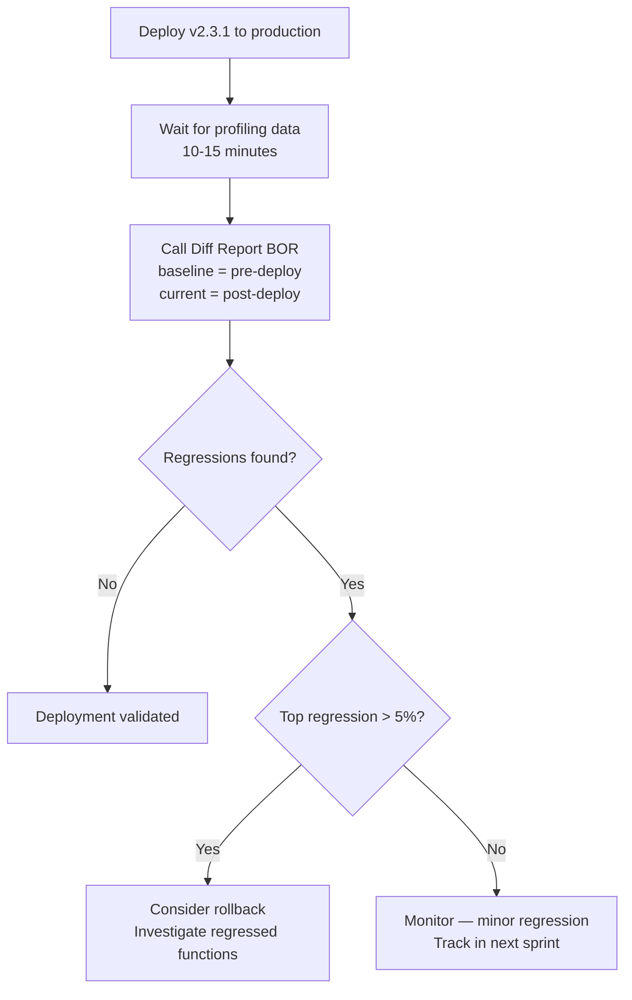

---

## 3. Fleet Search

### MVP Use Case

The platform team notices that `HashMap.resize` appeared in multiple incident triage reports this month. They want to know: **how many services are affected, and which ones?**

```
GET /search?function=HashMap.resize&type=cpu
```

The function discovers all Pyroscope-monitored applications, fetches their CPU profiles, and returns every match: `app-a` (8.2%), `app-b` (5.1%), `app-c` (1.3%).

For a broader view, the platform team runs a weekly hotspot check:

```
GET /fleet/hotspots?type=cpu&limit=10
```

This returns the top 10 functions by fleet-wide impact, ranked by `impactScore = serviceCount x maxSelfPercent`. The team can now prioritize which functions to optimize for maximum organization-wide benefit.

**MVP scope:** Two HTTP GET endpoints (search by function name, ranked hotspots). Auto-discovers apps from Pyroscope. Aggregates and ranks results. No configuration needed beyond pointing at the Profile Data SOR.

### Business Impact

| Impact Area | Benefit |
|-------------|---------|
| **Shared library optimization** | Identifies when a common library (Jackson, Netty, Log4j) is a hotspot across many services. One fix in the shared library improves all affected services simultaneously. |
| **Fleet-wide visibility** | Platform team sees which functions are burning the most CPU/memory across the entire organization, not just one service at a time. |
| **Prioritization** | Impact score ranks hotspots by organizational cost (how many services x how severe). Engineering effort is directed where it has the most return. |
| **Incident pattern detection** | When multiple services experience similar issues, fleet search reveals whether they share a common root cause (e.g., a framework version with a regression). |
| **Team routing (full)** | Full version includes service ownership. Hotspot findings are automatically attributed to the responsible team, eliminating "who owns this?" delays. |

### How it works — Search

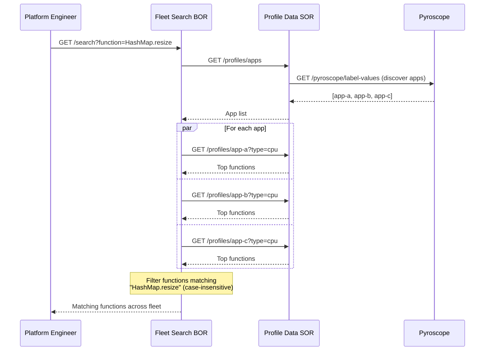

### How it works — Hotspots

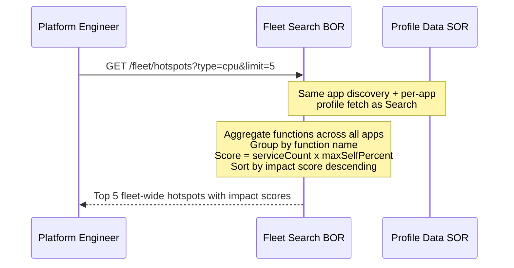

### API — Search

```
GET /search
```

| Parameter | Default | Description |
|-----------|---------|-------------|
| `function` | **(required)** | Function name substring to search for (case-insensitive) |
| `type` | `cpu` | Profile type to search |
| `from` | now - 1h | Start time (epoch seconds) |
| `to` | now | End time (epoch seconds) |
| `apps` | all discovered | Comma-separated app names to restrict search |

### API — Hotspots

```
GET /fleet/hotspots
```

| Parameter | Default | Description |
|-----------|---------|-------------|
| `type` | `cpu` | Profile type to analyze |
| `limit` | `20` | Top N hotspots to return |
| `from` | now - 1h | Start time (epoch seconds) |
| `to` | now | End time (epoch seconds) |
| `apps` | all discovered | Comma-separated app names to restrict search |

### Example — Search

**Request:**
```
GET /search?function=HashMap.resize&type=cpu
```

**Response:**
```json
{
  "query": "HashMap.resize",
  "profileType": "cpu",
  "from": 1706000000,
  "to": 1706003600,
  "matchCount": 3,
  "matches": [
    {
      "app": "app-a",
      "function": "java.util.HashMap.resize",
      "selfPercent": 8.2,
      "selfSamples": 3956
    },
    {
      "app": "app-b",
      "function": "java.util.HashMap.resize",
      "selfPercent": 5.1,
      "selfSamples": 2108
    },
    {
      "app": "app-c",
      "function": "java.util.HashMap.resize",
      "selfPercent": 1.3,
      "selfSamples": 412
    }
  ]
}
```

### Example — Hotspots

**Request:**
```
GET /fleet/hotspots?type=cpu&limit=3
```

**Response:**
```json
{
  "profileType": "cpu",
  "from": 1706000000,
  "to": 1706003600,
  "hotspots": [
    {
      "function": "G1 Young Generation",
      "serviceCount": 2,
      "maxSelfPercent": 14.1,
      "impactScore": 28.2,
      "services": [
        { "app": "app-a", "selfPercent": 14.1 },
        { "app": "app-d", "selfPercent": 9.8 }
      ]
    },
    {
      "function": "java.util.HashMap.resize",
      "serviceCount": 3,
      "maxSelfPercent": 8.2,
      "impactScore": 24.6,
      "services": [
        { "app": "app-a", "selfPercent": 8.2 },
        { "app": "app-b", "selfPercent": 5.1 },
        { "app": "app-c", "selfPercent": 1.3 }
      ]
    }
  ]
}
```

### Fleet visibility workflow

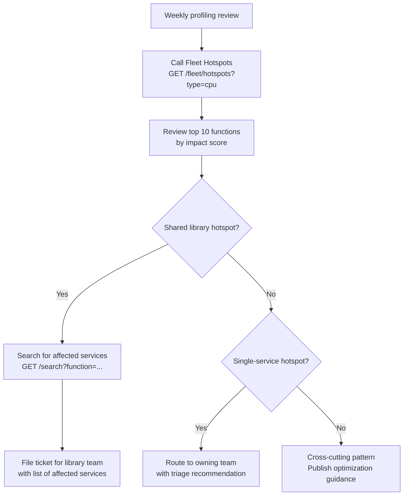

---

## Full Versions

The full versions of each function add PostgreSQL-backed SOR integrations. They serve the same API endpoints with the same parameters — the response includes additional fields.

### Full Triage

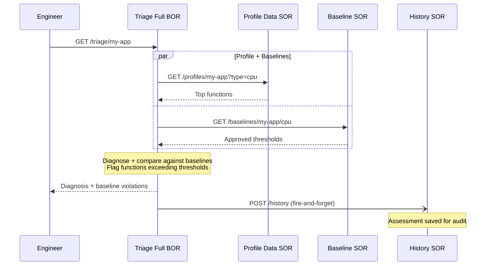

**Additional response fields:**

```json
{
  "profiles": {
    "cpu": {
      "diagnosis": "gc_pressure",
      "baselineViolations": [
        {
          "function": "G1 Young Generation",
          "currentPercent": 34.2,
          "threshold": 15.0,
          "exceededBy": 19.2,
          "severity": "warning"
        }
      ]
    }
  },
  "summary": {
    "baselineViolations": 1
  }
}
```

**Value over lite:** Instead of "GC is high," the full version says "GC is at 34.2% which exceeds the approved baseline of 15% by 19.2 points." Every assessment is saved for trend analysis and post-mortem review.

### Full Diff Report

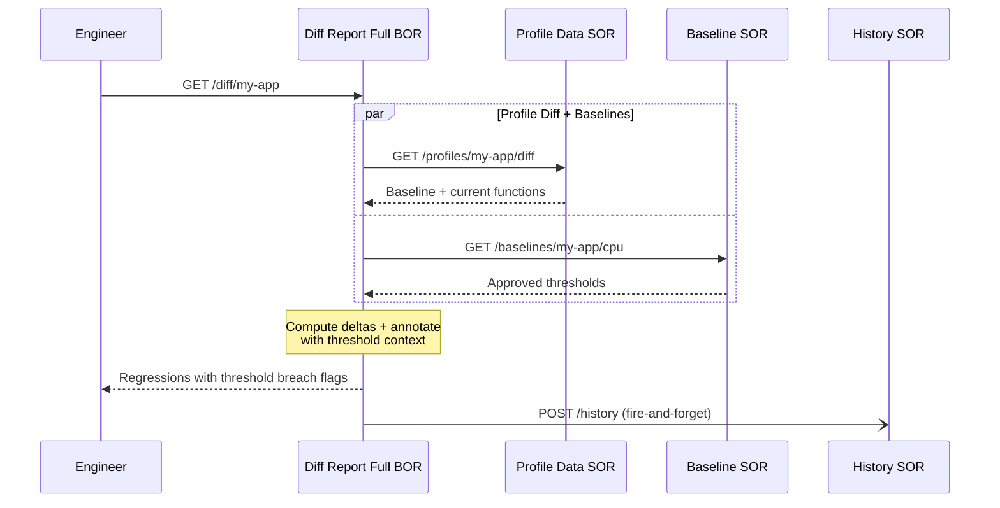

**Additional response fields:**

```json
{
  "regressions": [
    {
      "function": "com.example.DataSerializer.serialize",
      "baselinePercent": 2.1,
      "currentPercent": 8.7,
      "deltaPercent": 6.6,
      "approvedThreshold": 5.0,
      "exceedsThreshold": true
    }
  ],
  "summary": {
    "thresholdBreaches": 1
  }
}
```

**Value over lite:** Regressions are annotated with whether they breach an approved threshold, making deployment go/no-go decisions data-driven. Diff summaries are saved for post-mortem review.

### Full Fleet Search

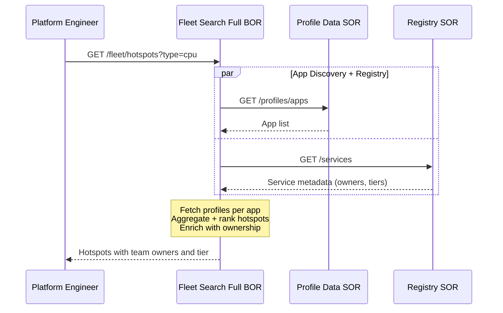

**Additional response fields:**

```json
{
  "hotspots": [
    {
      "function": "java.util.HashMap.resize",
      "serviceCount": 3,
      "criticalServiceCount": 1,
      "impactScore": 24.6,
      "services": [
        {
          "app": "app-a",
          "selfPercent": 8.2,
          "teamOwner": "team-a",
          "tier": "critical"
        }
      ]
    }
  ]
}
```

**Value over lite:** Results include who owns each service and its tier. Platform team can route hotspot findings directly to the responsible team. `criticalServiceCount` prioritizes hotspots affecting critical services.

---

All three functions use HTTP request/response only. No cron, Kafka, file upload/download, or protobuf.

---

## Deployment Reference

### Phase 1 — No Database (3 BOR + 1 SOR)

Requires only Pyroscope (already deployed). No PostgreSQL.

```
# Profile Data SOR — wraps Pyroscope API, no database
FUNCTION=ReadPyroscopeProfile.sor.v1
PYROSCOPE_URL=http://pyroscope:4040
PORT=8082

# Triage BOR
FUNCTION=ReadPyroscopeTriageAssessment.v1
PROFILE_DATA_URL=http://profile-data-sor:8082
PORT=8080

# Diff Report BOR
FUNCTION=ReadPyroscopeDiffReport.v1
PROFILE_DATA_URL=http://profile-data-sor:8082
PORT=8080

# Fleet Search BOR
FUNCTION=ReadPyroscopeFleetSearch.v1
PROFILE_DATA_URL=http://profile-data-sor:8082
PORT=8080
```

### Phase 2 — With PostgreSQL (3 BOR + 5 SOR)

Add database-backed SORs, then upgrade BOR functions from v1 → v2 by setting the additional SOR URLs. No code changes — config only.

```
# Profile Data SOR (unchanged from Phase 1)
FUNCTION=ReadPyroscopeProfile.sor.v1
PYROSCOPE_URL=http://pyroscope:4040
PORT=8082

# Baseline SOR (PostgreSQL)
FUNCTION=ReadPyroscopeBaseline.sor.v1
DB_HOST=postgres  DB_PORT=5432  DB_NAME=pyroscope  DB_USER=pyroscope  DB_PASSWORD=...
PORT=8081

# Triage History SOR (PostgreSQL)
FUNCTION=CreatePyroscopeTriageHistory.sor.v1
DB_HOST=postgres  DB_PORT=5432  DB_NAME=pyroscope  DB_USER=pyroscope  DB_PASSWORD=...
PORT=8081

# Service Registry SOR (PostgreSQL)
FUNCTION=ReadPyroscopeServiceRegistry.sor.v1
DB_HOST=postgres  DB_PORT=5432  DB_NAME=pyroscope  DB_USER=pyroscope  DB_PASSWORD=...
PORT=8081

# Alert Rule SOR (PostgreSQL)
FUNCTION=ReadPyroscopeAlertRule.sor.v1
DB_HOST=postgres  DB_PORT=5432  DB_NAME=pyroscope  DB_USER=pyroscope  DB_PASSWORD=...
PORT=8081

# Triage Full BOR (v2 — adds baseline comparison + audit trail)
FUNCTION=ReadPyroscopeTriageAssessment.v2
PROFILE_DATA_URL=http://profile-data-sor:8082
BASELINE_URL=http://baseline-sor:8081
HISTORY_URL=http://history-sor:8081
PORT=8080

# Diff Report Full BOR (v2 — adds threshold context + audit trail)
FUNCTION=ReadPyroscopeDiffReport.v2
PROFILE_DATA_URL=http://profile-data-sor:8082
BASELINE_URL=http://baseline-sor:8081
HISTORY_URL=http://history-sor:8081
PORT=8080

# Fleet Search Full BOR (v2 — adds service ownership enrichment)
FUNCTION=ReadPyroscopeFleetSearch.v2
PROFILE_DATA_URL=http://profile-data-sor:8082
REGISTRY_URL=http://registry-sor:8081
PORT=8080
```

### All FUNCTION Values

| Value | Layer | Phase | Requires | Description |
|-------|-------|:-----:|----------|-------------|
| `ReadPyroscopeProfile.sor.v1` | SOR | 1 | Pyroscope | Pyroscope API wrapper — parses flamebearer format |
| `ReadPyroscopeTriageAssessment.v1` | BOR | 1 | Profile Data SOR | Automated profile diagnosis |
| `ReadPyroscopeDiffReport.v1` | BOR | 1 | Profile Data SOR | Deployment comparison reports |
| `ReadPyroscopeFleetSearch.v1` | BOR | 1 | Profile Data SOR | Cross-service function search and hotspots |
| `ReadPyroscopeBaseline.sor.v1` | SOR | 2 | PostgreSQL | CRUD for performance thresholds |
| `CreatePyroscopeTriageHistory.sor.v1` | SOR | 2 | PostgreSQL | CRUD for triage assessment audit trail |
| `ReadPyroscopeServiceRegistry.sor.v1` | SOR | 2 | PostgreSQL | CRUD for service metadata and ownership |
| `ReadPyroscopeAlertRule.sor.v1` | SOR | 2 | PostgreSQL | CRUD for profiling-based alert rules |
| `ReadPyroscopeTriageAssessment.v2` | BOR | 2 | Profile Data + Baseline + History | Triage with baseline comparison and audit trail |
| `ReadPyroscopeDiffReport.v2` | BOR | 2 | Profile Data + Baseline + History | Diff with threshold context and audit trail |
| `ReadPyroscopeFleetSearch.v2` | BOR | 2 | Profile Data + Registry | Fleet search with service ownership enrichment |
