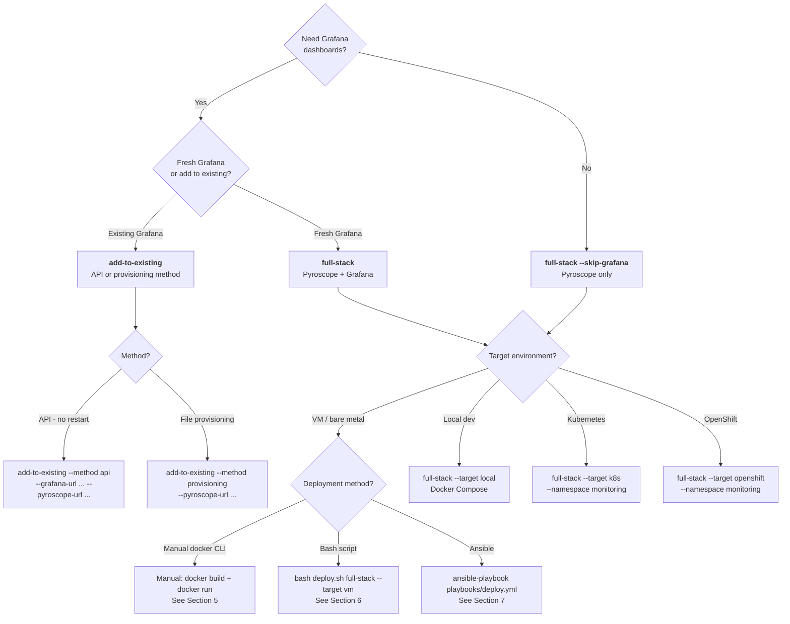
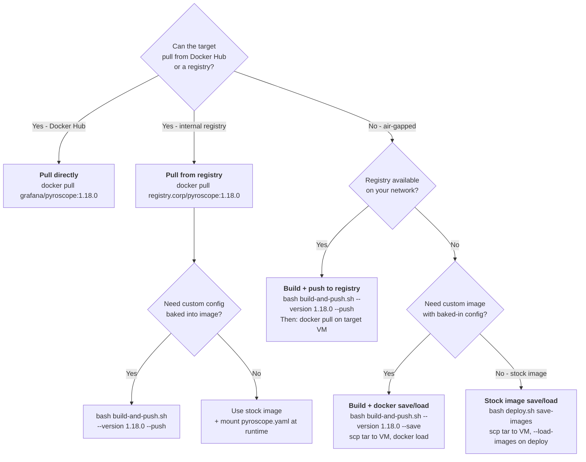
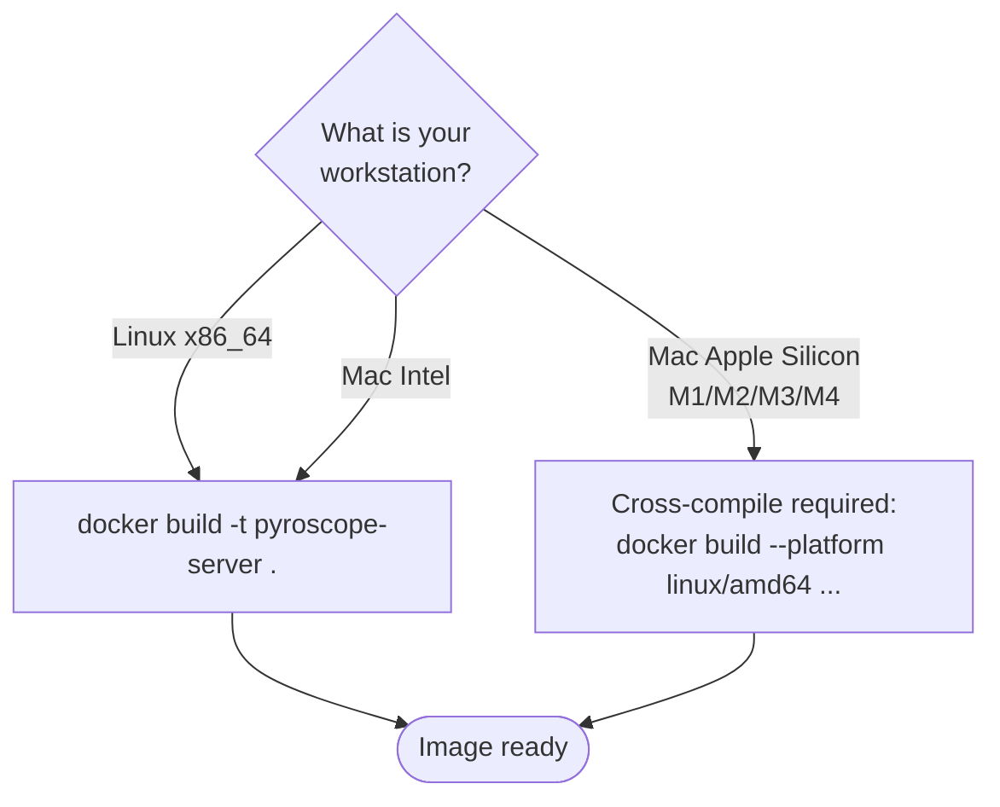
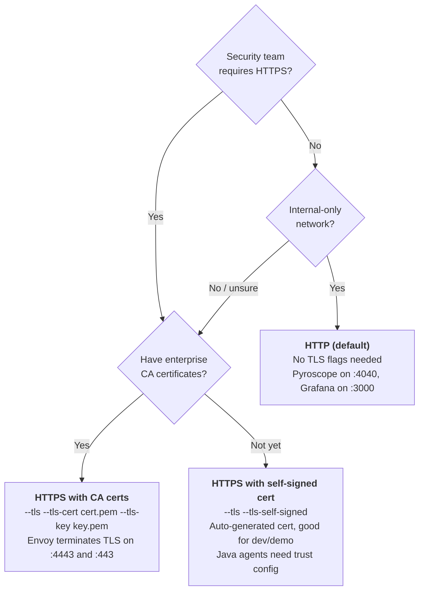
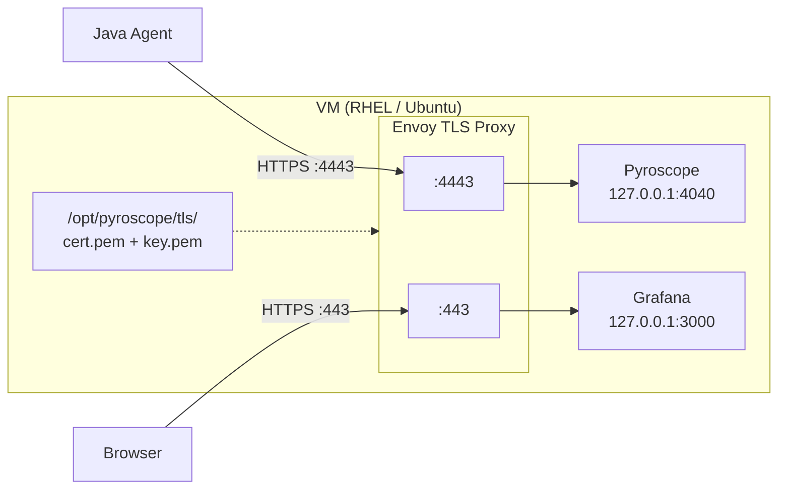
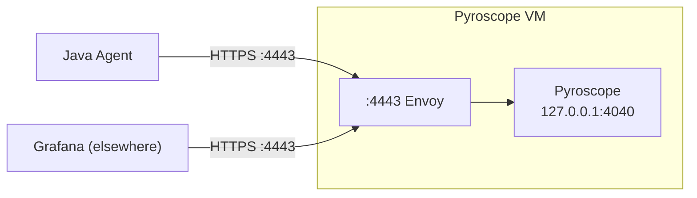
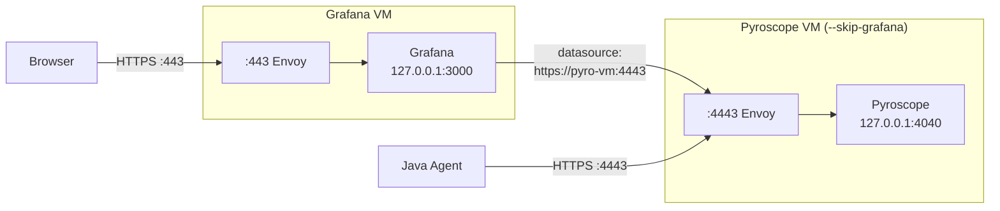

# Pyroscope Monolith Deployment Guide

This guide covers every deployment scenario for Pyroscope in monolithic mode,
with optional Grafana. It replaces the previous `monolithic-deployment-guide.md`
and `observability-deployment-guide.md` with a single source of truth.

**Tooling lives in `deploy/monolith/`:**

| File | Purpose |
|------|---------|
| `deploy.sh` | Lifecycle script -- deploy, status, stop, clean, logs |
| `build-and-push.sh` | Build, tag, push, save Docker images |
| `deploy-test.sh` | 45 unit tests for deploy.sh (no root/Docker needed) |
| `Dockerfile` | Standard build (official grafana/pyroscope base) |
| `Dockerfile.custom` | Custom base image (Alpine, UBI, Debian) |
| `pyroscope.yaml` | Server config (filesystem storage, port 4040) |
| `DOCKER-BUILD.md` | Image building reference |
| `ansible/` | Ansible role, playbooks, inventory |

---

## 1. Decision Tree: Which Deployment Path?

Start here. Answer the questions to find the exact command you need.



---

## 2. Decision Tree: Image Source

How do Docker images get onto the target machine?



### Cross-platform builds



---

## 3. Decision Tree: HTTP or HTTPS?



---

## 4. Quick Reference Table

| I want to... | Command |
|---|---|
| Deploy Pyroscope + Grafana on a VM (HTTP) | `bash deploy.sh full-stack --target vm` |
| Deploy Pyroscope only, no Grafana (HTTP) | `bash deploy.sh full-stack --target vm --skip-grafana` |
| Deploy with self-signed TLS | `bash deploy.sh full-stack --target vm --tls --tls-self-signed` |
| Deploy with enterprise CA certs | `bash deploy.sh full-stack --target vm --tls --tls-cert cert.pem --tls-key key.pem` |
| Deploy locally with Docker Compose | `bash deploy.sh full-stack --target local` |
| Deploy on Kubernetes | `bash deploy.sh full-stack --target k8s --namespace monitoring` |
| Deploy on OpenShift | `bash deploy.sh full-stack --target openshift --namespace monitoring` |
| Add Pyroscope to existing Grafana (API) | `bash deploy.sh add-to-existing --grafana-url http://grafana:3000 --pyroscope-url http://pyro:4040` |
| Add Pyroscope to existing Grafana (files) | `bash deploy.sh add-to-existing --method provisioning --pyroscope-url http://pyro:4040` |
| Save images for air-gapped VM | `bash deploy.sh save-images` |
| Save images including Envoy for TLS | `bash deploy.sh save-images --tls` |
| Load images and deploy on air-gapped VM | `bash deploy.sh full-stack --target vm --load-images /tmp/pyroscope-stack-images.tar` |
| Build custom image and push to registry | `bash build-and-push.sh --version 1.18.0 --push` |
| Build custom image and export as tar | `bash build-and-push.sh --version 1.18.0 --save` |
| Push stock image to internal registry | `bash build-and-push.sh --version 1.18.0 --pull-only --push` |
| List available Pyroscope versions | `bash build-and-push.sh --list-tags` |
| Dry run (validate without changes) | `bash deploy.sh full-stack --target vm --dry-run` |
| Check status | `bash deploy.sh status --target vm` |
| View logs | `bash deploy.sh logs --target vm` |
| Stop (preserve data) | `bash deploy.sh stop --target vm` |
| Full cleanup | `bash deploy.sh clean --target vm` |
| Deploy via Ansible | `ansible-playbook -i inventory playbooks/deploy.yml` |
| Ansible with TLS self-signed | `ansible-playbook ... -e tls_enabled=true -e tls_self_signed=true` |
| Ansible Pyroscope only | `ansible-playbook ... -e skip_grafana=true` |
| Ansible with air-gapped images | `ansible-playbook ... -e docker_load_path=/tmp/images.tar` |
| Remove container/image but keep data | `bash build-and-push.sh --clean-keep-data` |
| Use a custom base image (UBI/Alpine) | `docker build -f Dockerfile.custom ...` |
| Run deployment tests | `bash deploy-test.sh` |
| Mount custom pyroscope.yaml | `bash deploy.sh full-stack --target vm --pyroscope-config /opt/pyroscope/pyroscope.yaml` |

---

## 5. Step-by-Step: Manual VM Deployment

No scripts -- just Docker CLI commands. Good for understanding what deploy.sh does
under the hood, or for environments where you cannot run third-party scripts.

### 5a. HTTP with Grafana (full stack)

```bash
# ---- On your workstation (has internet) ----

# Pull and save images
docker pull grafana/pyroscope:1.18.0
docker pull grafana/grafana:11.5.2
docker save -o pyroscope-stack-images.tar \
    grafana/pyroscope:1.18.0 \
    grafana/grafana:11.5.2

# Transfer to VM
scp pyroscope-stack-images.tar operator@vm01.corp:/tmp/

# ---- On the target VM (as root) ----
ssh operator@vm01.corp
pbrun /bin/su -

# Load images
docker load -i /tmp/pyroscope-stack-images.tar

# Create volumes
docker volume create pyroscope-data
docker volume create grafana-data

# Start Pyroscope
docker run -d \
    --name pyroscope \
    --restart unless-stopped \
    -p 4040:4040 \
    -v pyroscope-data:/data \
    grafana/pyroscope:1.18.0

# Verify Pyroscope
curl -s http://localhost:4040/ready

# Stage Grafana config (provisioning files from the repo)
mkdir -p /opt/pyroscope/grafana/{provisioning/datasources,provisioning/dashboards,provisioning/plugins,dashboards}
# Copy provisioning YAML files and dashboards from the repo's config/grafana/ directory.
# Update the datasource URL to point to this VM's IP.

# Start Grafana (stock image with volume-mounted config)
docker run -d \
    --name grafana \
    --restart unless-stopped \
    -p 3000:3000 \
    -v grafana-data:/var/lib/grafana \
    -v /opt/pyroscope/grafana/grafana.ini:/etc/grafana/grafana.ini:ro \
    -v /opt/pyroscope/grafana/provisioning:/etc/grafana/provisioning:ro \
    -v /opt/pyroscope/grafana/dashboards:/var/lib/grafana/dashboards:ro \
    -e GF_INSTALL_PLUGINS=grafana-pyroscope-app,grafana-pyroscope-datasource \
    -e GF_SECURITY_ADMIN_PASSWORD=admin \
    grafana/grafana:11.5.2

# Verify Grafana
curl -s http://localhost:3000/api/health
```

### 5b. HTTP without Grafana (Pyroscope only)

```bash
# ---- On the target VM (as root) ----

docker load -i /tmp/pyroscope-stack-images.tar
docker volume create pyroscope-data

docker run -d \
    --name pyroscope \
    --restart unless-stopped \
    -p 4040:4040 \
    -v pyroscope-data:/data \
    grafana/pyroscope:1.18.0

curl -s http://localhost:4040/ready
```

### 5c. HTTPS with self-signed cert

```bash
# ---- On the target VM (as root) ----

# Load images (including Envoy)
docker load -i /tmp/pyroscope-stack-images.tar

# Generate self-signed certificate
mkdir -p /opt/pyroscope/tls
VM_IP=$(hostname -I | awk '{print $1}')
VM_HOSTNAME=$(hostname)

openssl req -x509 \
    -newkey rsa:2048 -nodes -days 365 \
    -subj "/CN=${VM_HOSTNAME}" \
    -addext "subjectAltName=DNS:${VM_HOSTNAME},DNS:localhost,IP:${VM_IP},IP:127.0.0.1" \
    -keyout /opt/pyroscope/tls/key.pem \
    -out /opt/pyroscope/tls/cert.pem

chmod 600 /opt/pyroscope/tls/key.pem
chmod 644 /opt/pyroscope/tls/cert.pem

# Start Pyroscope (bound to localhost -- Envoy handles external traffic)
docker volume create pyroscope-data
docker run -d \
    --name pyroscope \
    --restart unless-stopped \
    -p 127.0.0.1:4040:4040 \
    -v pyroscope-data:/data \
    grafana/pyroscope:1.18.0

# Start Grafana (bound to localhost)
docker volume create grafana-data
docker run -d \
    --name grafana \
    --restart unless-stopped \
    -p 127.0.0.1:3000:3000 \
    -v grafana-data:/var/lib/grafana \
    -v /opt/pyroscope/grafana/grafana.ini:/etc/grafana/grafana.ini:ro \
    -v /opt/pyroscope/grafana/provisioning:/etc/grafana/provisioning:ro \
    -v /opt/pyroscope/grafana/dashboards:/var/lib/grafana/dashboards:ro \
    -e GF_INSTALL_PLUGINS=grafana-pyroscope-app,grafana-pyroscope-datasource \
    -e GF_SECURITY_ADMIN_PASSWORD=admin \
    grafana/grafana:11.5.2

# Generate Envoy config (see deploy.sh generate_envoy_config for the full template)
# Write /opt/pyroscope/tls/envoy.yaml with listeners for :4443 -> 127.0.0.1:4040
# and :443 -> 127.0.0.1:3000

# Start Envoy TLS proxy
docker run -d \
    --name envoy-proxy \
    --restart unless-stopped \
    --network host \
    -v /opt/pyroscope/tls/envoy.yaml:/etc/envoy/envoy.yaml:ro \
    -v /opt/pyroscope/tls:/etc/envoy/tls:ro \
    envoyproxy/envoy:v1.31-latest

# Verify
curl -k https://localhost:4443/ready       # Pyroscope via Envoy
curl -k https://localhost:443/api/health   # Grafana via Envoy
```

---

## 6. Step-by-Step: Bash Script on VM

The `deploy.sh` script handles pre-flight checks, image loading, container lifecycle,
TLS setup, firewall ports, SELinux volume labels, and health checks -- all idempotent.

### 6a. SSH + pbrun workflow

```bash
# On your workstation -- save images
cd deploy/monolith
bash deploy.sh save-images
# Output: pyroscope-stack-images.tar

# Transfer files to VM
scp pyroscope-stack-images.tar operator@vm01.corp:/tmp/
scp deploy.sh operator@vm01.corp:/tmp/

# SSH to VM and become root
ssh operator@vm01.corp
pbrun /bin/su -

# Run from /tmp (or wherever you copied the script + repo)
cd /path/to/repo/deploy/monolith
```

### 6b. deploy.sh examples for each scenario

```bash
# --- Full stack, HTTP ---
bash deploy.sh full-stack --target vm \
    --load-images /tmp/pyroscope-stack-images.tar \
    --log-file /tmp/deploy.log

# --- Full stack, HTTP, Pyroscope only ---
bash deploy.sh full-stack --target vm --skip-grafana \
    --load-images /tmp/pyroscope-stack-images.tar

# --- Full stack, HTTPS (self-signed) ---
bash deploy.sh save-images --tls   # includes Envoy image
scp pyroscope-stack-images.tar operator@vm01.corp:/tmp/
# On VM:
bash deploy.sh full-stack --target vm \
    --tls --tls-self-signed \
    --load-images /tmp/pyroscope-stack-images.tar

# --- Full stack, HTTPS (CA certs) ---
bash deploy.sh full-stack --target vm \
    --tls --tls-cert /path/to/cert.pem --tls-key /path/to/key.pem

# --- Pyroscope only, HTTPS (self-signed) ---
bash deploy.sh full-stack --target vm --skip-grafana \
    --tls --tls-self-signed \
    --load-images /tmp/pyroscope-stack-images.tar

# --- Pyroscope only, HTTPS (CA certs) ---
bash deploy.sh full-stack --target vm --skip-grafana \
    --tls --tls-cert /path/to/cert.pem --tls-key /path/to/key.pem

# --- Add to existing Grafana (API method, no restart) ---
bash deploy.sh add-to-existing \
    --grafana-url http://grafana.corp:3000 \
    --grafana-api-key eyJrIj... \
    --pyroscope-url http://pyroscope.corp:4040

# --- Add to existing Grafana (provisioning files) ---
bash deploy.sh add-to-existing --method provisioning \
    --pyroscope-url http://pyroscope.corp:4040

# --- Custom Pyroscope image with mounted config ---
bash deploy.sh full-stack --target vm \
    --pyroscope-image pyroscope-server:1.18.0 \
    --pyroscope-config /opt/pyroscope/pyroscope.yaml

# --- Docker Compose locally ---
bash deploy.sh full-stack --target local

# --- Dry run ---
bash deploy.sh full-stack --target vm --dry-run
```

### 6c. Verify after deploy

```bash
bash deploy.sh status --target vm
curl -s http://localhost:4040/ready        # Pyroscope
curl -s http://localhost:3000/api/health   # Grafana (if deployed)
```

---

## 7. Step-by-Step: Ansible on VM

Ansible uses the same logic as deploy.sh but is inventory-driven, idempotent, and
works across multiple hosts. All Ansible files live in `deploy/monolith/ansible/`.

### 7a. Inventory setup with pbrun

Edit `ansible/inventory/hosts.yml`:

```yaml
all:
  children:
    # Full-stack: Pyroscope + Grafana
    pyroscope_full_stack:
      hosts:
        vm01.corp.example.com:
        # vm02.corp.example.com:

    # Add Pyroscope to existing Grafana
    pyroscope_add_to_existing:
      hosts:
        # grafana01.corp.example.com:
        #   grafana_url: http://localhost:3000
        #   grafana_api_key: "eyJrIj..."

  vars:
    ansible_user: operator
    ansible_become: true
    ansible_become_method: su
    # For pbrun:
    # ansible_become_method: pbrun
    # ansible_become_exe: /usr/local/bin/pbrun
```

### 7b. Group vars

Edit `ansible/inventory/group_vars/pyroscope.yml` to set shared defaults:

```yaml
pyroscope_mode: full-stack
pyroscope_image: grafana/pyroscope:latest
pyroscope_port: 4040
grafana_image: grafana/grafana:11.5.2
grafana_port: 3000
grafana_admin_password: admin
```

### 7c. Playbook examples

```bash
# --- Full stack, HTTP ---
ansible-playbook -i inventory playbooks/deploy.yml \
    -e docker_load_path=/tmp/pyroscope-stack-images.tar

# --- Full stack, HTTPS (self-signed) ---
ansible-playbook -i inventory playbooks/deploy.yml \
    -e docker_load_path=/tmp/pyroscope-stack-images.tar \
    -e tls_enabled=true \
    -e tls_self_signed=true

# --- Full stack, HTTPS (CA certs) ---
ansible-playbook -i inventory playbooks/deploy.yml \
    -e tls_enabled=true \
    -e tls_cert_src=/path/to/cert.pem \
    -e tls_key_src=/path/to/key.pem

# --- Pyroscope only (no Grafana) ---
ansible-playbook -i inventory playbooks/deploy.yml \
    -e skip_grafana=true \
    -e docker_load_path=/tmp/pyroscope-stack-images.tar

# --- Add to existing Grafana ---
ansible-playbook -i inventory playbooks/deploy.yml \
    -e pyroscope_mode=add-to-existing \
    -e grafana_url=http://grafana.corp:3000 \
    -e grafana_api_key=eyJrIj...

# --- Target a single host ---
ansible-playbook -i inventory playbooks/deploy.yml \
    --limit vm01.corp.example.com

# --- Dry run (check mode) ---
ansible-playbook -i inventory playbooks/deploy.yml --check

# --- Status ---
ansible-playbook -i inventory playbooks/status.yml

# --- Stop (preserve data) ---
ansible-playbook -i inventory playbooks/stop.yml

# --- Full cleanup ---
ansible-playbook -i inventory playbooks/clean.yml
```

### 7d. Split-VM topology (enterprise)

In production you may want Pyroscope and Grafana on separate VMs:

```yaml
# inventory/production/hosts.yml
all:
  children:
    pyroscope_full_stack:
      hosts:
        pyro-vm01.corp:
      vars:
        skip_grafana: true
    pyroscope_add_to_existing:
      hosts:
        grafana-vm01.corp:
      vars:
        pyroscope_mode: add-to-existing
        pyroscope_url: https://pyro-vm01.corp:4443
        grafana_url: http://localhost:3000
        grafana_api_key: "{{ vault_grafana_api_key }}"
  vars:
    tls_enabled: true
    tls_cert_src: "{{ vault_tls_cert_path }}"
    tls_key_src: "{{ vault_tls_key_path }}"
```

---

## 8. Step-by-Step: Kubernetes / OpenShift

### 8a. Kubernetes with kubectl

```bash
# Deploy full stack
bash deploy.sh full-stack --target k8s --namespace monitoring

# The script creates:
#   - Namespace (if needed)
#   - ConfigMaps for Grafana provisioning and dashboards
#   - Deployments + Services for Pyroscope and Grafana
#   - PVCs for persistent storage (10Gi Pyroscope, 2Gi Grafana)

# Access via port-forward
kubectl -n monitoring port-forward svc/pyroscope 4040:4040
kubectl -n monitoring port-forward svc/grafana 3000:3000

# With options
bash deploy.sh full-stack --target k8s \
    --namespace monitoring \
    --pyroscope-image grafana/pyroscope:1.18.0 \
    --storage-class gp3 \
    --pvc-size-pyroscope 50Gi

# Ephemeral (no PVC -- for dev/testing)
bash deploy.sh full-stack --target k8s --no-pvc

# Status
bash deploy.sh status --target k8s --namespace monitoring

# Cleanup
bash deploy.sh clean --target k8s --namespace monitoring
```

### 8b. OpenShift with oc

```bash
# Deploy full stack (creates Routes automatically)
bash deploy.sh full-stack --target openshift --namespace monitoring

# The script creates:
#   - Project (namespace)
#   - ConfigMaps for Grafana provisioning and dashboards
#   - Deployments + Services for Pyroscope and Grafana
#   - Routes for external access

# Status (shows pods, services, routes)
bash deploy.sh status --target openshift --namespace monitoring

# Cleanup
bash deploy.sh clean --target openshift --namespace monitoring
```

---

## 9. TLS Architecture

When `--tls` is enabled, an Envoy reverse proxy terminates TLS. Backend containers
bind to `127.0.0.1` only -- they are not externally reachable. Only Envoy binds
to `0.0.0.0` on the TLS ports.

### Single VM: full stack



### Single VM: Pyroscope only (--skip-grafana)



### Split VMs: Pyroscope + Grafana on separate hosts



---

## 10. Port Reference

| Service | HTTP Mode | HTTPS Mode (external) | HTTPS Mode (internal) |
|---------|-----------|----------------------|----------------------|
| Pyroscope | `0.0.0.0:4040` | `0.0.0.0:4443` (Envoy) | `127.0.0.1:4040` |
| Grafana | `0.0.0.0:3000` | `0.0.0.0:443` (Envoy) | `127.0.0.1:3000` |
| Envoy admin | -- | `127.0.0.1:9901` | `127.0.0.1:9901` |

**Override ports with environment variables or flags:**

| Variable / Flag | Default | Description |
|---|---|---|
| `PYROSCOPE_PORT` / `--pyroscope-port` | `4040` | Pyroscope HTTP port |
| `GRAFANA_PORT` / `--grafana-port` | `3000` | Grafana HTTP port |
| `TLS_PORT_PYROSCOPE` / `--tls-port-pyroscope` | `4443` | Pyroscope HTTPS port (Envoy) |
| `TLS_PORT_GRAFANA` / `--tls-port-grafana` | `443` | Grafana HTTPS port (Envoy) |

---

## 11. Java Agent Configuration

### HTTP

```bash
# Environment variable (works with Pyroscope Java agent)
PYROSCOPE_SERVER_ADDRESS=http://VM_IP:4040

# Or as JVM system property
-Dpyroscope.server.address=http://VM_IP:4040
```

### HTTPS with CA-signed certificate

```bash
# No extra trust config needed if the CA is already in the JVM truststore
PYROSCOPE_SERVER_ADDRESS=https://VM_IP:4443
```

### HTTPS with self-signed certificate

The JVM does not trust self-signed certificates by default. Two options:

```bash
# Option 1: Import cert into the JVM default truststore (affects all apps on this JVM)
keytool -import -alias pyroscope \
    -file /opt/pyroscope/tls/cert.pem \
    -keystore $JAVA_HOME/lib/security/cacerts \
    -storepass changeit -noprompt

PYROSCOPE_SERVER_ADDRESS=https://VM_IP:4443

# Option 2: Create a per-app truststore
keytool -import -alias pyroscope \
    -file cert.pem \
    -keystore pyroscope-trust.jks \
    -storepass changeit -noprompt

java -Djavax.net.ssl.trustStore=/path/to/pyroscope-trust.jks \
     -Djavax.net.ssl.trustStorePassword=changeit \
     -Dpyroscope.server.address=https://VM_IP:4443 \
     -jar myapp.jar
```

---

## 12. Day-2 Operations Quick Reference

### Status, stop, clean, logs

```bash
# Check what is running
bash deploy.sh status --target vm

# View recent logs
bash deploy.sh logs --target vm

# Follow logs for a specific container
docker logs -f pyroscope
docker logs -f grafana
docker logs -f envoy-proxy

# Stop (containers removed, volumes preserved)
bash deploy.sh stop --target vm

# Full cleanup (removes containers, volumes, images, config, certs)
bash deploy.sh clean --target vm
```

### Upgrade to a new version

```bash
# 1. Build or pull the new image
bash build-and-push.sh --version 1.19.0 --save
scp pyroscope-server-1.19.0.tar operator@vm01.corp:/tmp/

# 2. On VM: load new image
docker load -i /tmp/pyroscope-server-1.19.0.tar

# 3. Replace the container (volume preserved = data preserved)
docker rm -f pyroscope
docker run -d \
    --name pyroscope \
    --restart unless-stopped \
    -p 4040:4040 \
    -v pyroscope-data:/data \
    pyroscope-server:1.19.0

# 4. Verify
curl -s http://localhost:4040/ready
```

### Rollback

```bash
# Same as upgrade, but use the old image tag
docker rm -f pyroscope
docker run -d \
    --name pyroscope \
    --restart unless-stopped \
    -p 4040:4040 \
    -v pyroscope-data:/data \
    pyroscope-server:1.18.0
```

### Config changes (mounted config)

```bash
# Edit pyroscope.yaml on the host
vi /opt/pyroscope/pyroscope.yaml

# Restart to pick up changes
docker restart pyroscope
```

### Certificate renewal (TLS)

```bash
# Replace cert.pem and key.pem in /opt/pyroscope/tls/
cp new-cert.pem /opt/pyroscope/tls/cert.pem
cp new-key.pem /opt/pyroscope/tls/key.pem
chmod 600 /opt/pyroscope/tls/key.pem

# Restart Envoy to pick up new certs
docker restart envoy-proxy
```

### Backup profiling data

```bash
# While running (Docker volume backup)
docker run --rm \
    -v pyroscope-data:/data \
    -v /tmp:/backup \
    alpine tar czf /backup/pyroscope-backup.tar.gz -C /data .

# Restore
docker run --rm \
    -v pyroscope-data:/data \
    -v /tmp:/backup \
    alpine sh -c "cd /data && tar xzf /backup/pyroscope-backup.tar.gz"
```

---

## 13. Scenario Quick Reference Table

| Scenario | Grafana Mode | Method | TLS | Command |
|---|---|---|---|---|
| First deployment, VM, HTTP | `full-stack` | Bash | No | `bash deploy.sh full-stack --target vm --load-images /tmp/images.tar` |
| First deployment, VM, HTTPS (self-signed) | `full-stack` | Bash | Self-signed | `bash deploy.sh full-stack --target vm --tls --tls-self-signed --load-images /tmp/images.tar` |
| First deployment, VM, HTTPS (CA) | `full-stack` | Bash | CA | `bash deploy.sh full-stack --target vm --tls --tls-cert c.pem --tls-key k.pem` |
| Pyroscope only, VM, HTTP | `full-stack --skip-grafana` | Bash | No | `bash deploy.sh full-stack --target vm --skip-grafana --load-images /tmp/images.tar` |
| Pyroscope only, VM, HTTPS | `full-stack --skip-grafana` | Bash | Self-signed | `bash deploy.sh full-stack --target vm --skip-grafana --tls --tls-self-signed` |
| Add to existing Grafana, API | `add-to-existing` | Bash | No | `bash deploy.sh add-to-existing --grafana-url URL --pyroscope-url URL` |
| Add to existing Grafana, files | `add-to-existing` | Bash | No | `bash deploy.sh add-to-existing --method provisioning --pyroscope-url URL` |
| Full stack, Ansible, HTTP | `full-stack` | Ansible | No | `ansible-playbook -i inventory playbooks/deploy.yml -e docker_load_path=/tmp/images.tar` |
| Full stack, Ansible, HTTPS (self-signed) | `full-stack` | Ansible | Self-signed | `ansible-playbook -i inventory playbooks/deploy.yml -e tls_enabled=true -e tls_self_signed=true` |
| Full stack, Ansible, HTTPS (CA) | `full-stack` | Ansible | CA | `ansible-playbook -i inventory playbooks/deploy.yml -e tls_enabled=true -e tls_cert_src=c.pem -e tls_key_src=k.pem` |
| Pyroscope only, Ansible | `full-stack` | Ansible | No | `ansible-playbook -i inventory playbooks/deploy.yml -e skip_grafana=true` |
| Local dev, Docker Compose | `full-stack` | Bash | No | `bash deploy.sh full-stack --target local` |
| Kubernetes | `full-stack` | Bash | No | `bash deploy.sh full-stack --target k8s --namespace monitoring` |
| OpenShift | `full-stack` | Bash | No | `bash deploy.sh full-stack --target openshift --namespace monitoring` |
| Manual docker CLI, HTTP | `full-stack` | Manual | No | See Section 5a |
| Manual docker CLI, HTTPS | `full-stack` | Manual | Self-signed | See Section 5c |

---

## File Map

```
deploy/monolith/
|-- deploy.sh                     Main lifecycle script (deploy/status/stop/clean/logs)
|-- build-and-push.sh             Build, tag, push, save Docker images
|-- deploy-test.sh                45 unit tests for deploy.sh
|-- Dockerfile                    Standard build (grafana/pyroscope base)
|-- Dockerfile.custom             Custom base (Alpine, UBI, Debian, distroless)
|-- pyroscope.yaml                Server config (filesystem storage, port 4040)
|-- DOCKER-BUILD.md               Image building reference
|-- ansible/
|   |-- inventory/
|   |   |-- hosts.yml             Target VM inventory
|   |   `-- group_vars/
|   |       `-- pyroscope.yml     Shared role variables
|   |-- playbooks/
|   |   |-- deploy.yml            Deploy the stack
|   |   |-- status.yml            Check running status
|   |   |-- stop.yml              Stop (preserve data)
|   |   `-- clean.yml             Full cleanup
|   `-- roles/pyroscope-stack/
|       |-- defaults/main.yml     Role defaults (all configurable)
|       |-- tasks/
|       |   |-- main.yml          Entry point (dispatches by mode)
|       |   |-- preflight.yml     Pre-flight checks
|       |   |-- full-stack.yml    Full stack deployment
|       |   |-- tls.yml           TLS cert + Envoy deployment
|       |   |-- add-to-existing.yml
|       |   |-- stop.yml
|       |   `-- clean.yml
|       |-- templates/
|       |   |-- envoy.yaml.j2     Envoy TLS proxy config
|       |   |-- datasource.yaml.j2
|       |   |-- dashboard-provider.yaml.j2
|       |   `-- plugins.yaml.j2
|       `-- handlers/main.yml

config/grafana/
|-- provisioning/
|   |-- datasources/datasources.yaml
|   |-- dashboards/dashboards.yaml
|   `-- plugins/plugins.yaml
`-- dashboards/
    |-- pyroscope-overview.json
    |-- http-performance.json
    |-- verticle-performance.json
    |-- before-after-comparison.json
    |-- faas-server.json
    `-- jvm-metrics.json
```
