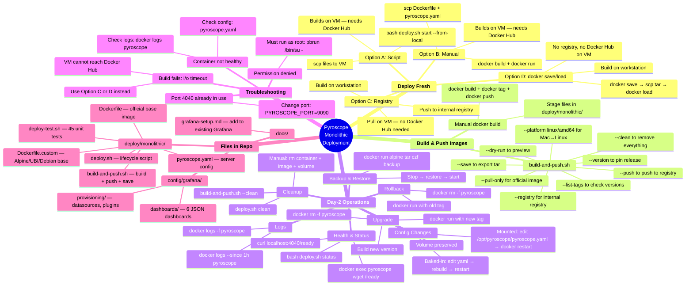
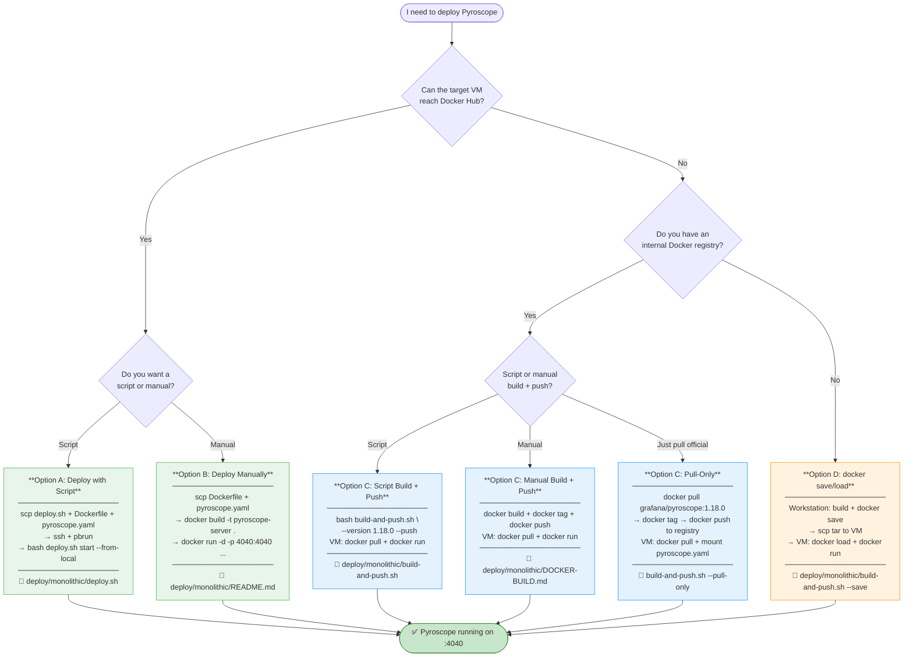
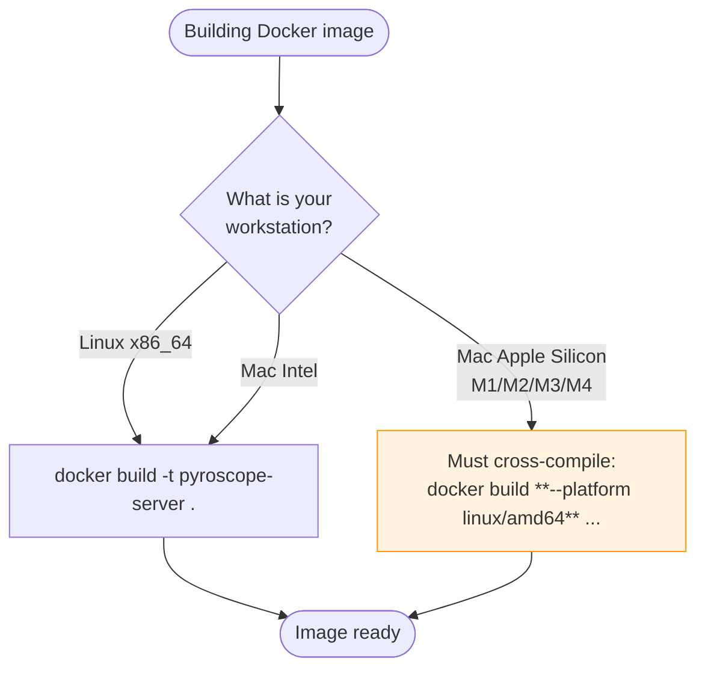
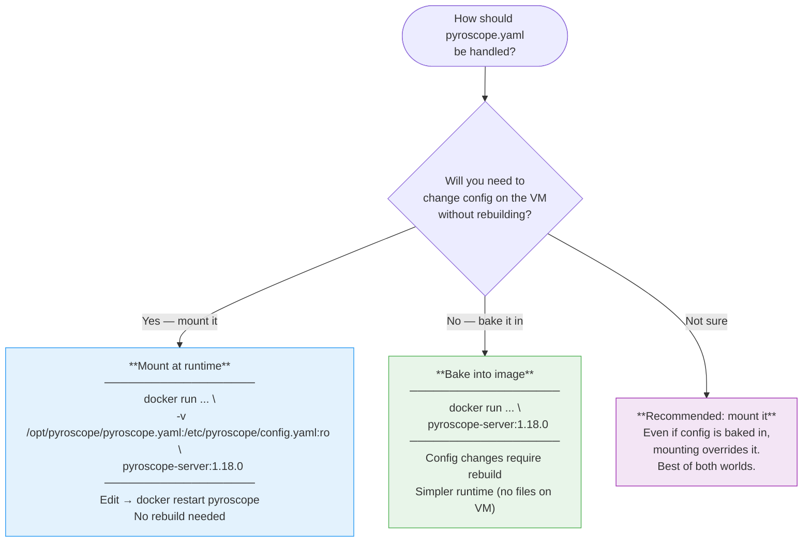
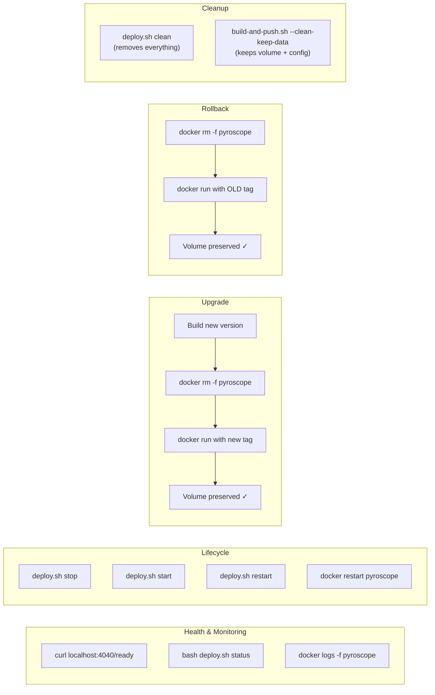
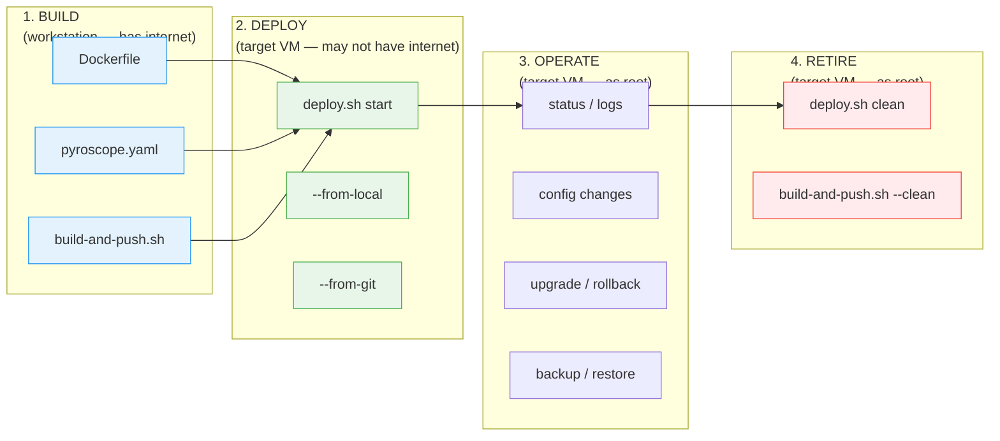

# Pyroscope Monolithic Deployment — Mind Map & Decision Guide

## Mind Map



## Decision Flowchart: Which Option Do I Use?



## Decision Flowchart: Building on Mac for Linux VM



## Config Baked-in vs Mounted — When to Use Which



## Day-2 Operations Quick Reference



## File Map: What's Where and When to Use It

```
repo root/
│
├── deploy/monolithic/                     ← ALL DEPLOYMENT FILES
│   │
│   ├── Dockerfile                         ← Standard build (official grafana/pyroscope base)
│   │                                        Used by: Options A, B, C (build), D
│   │
│   ├── Dockerfile.custom                  ← Custom base (Alpine, UBI, Debian, distroless)
│   │                                        Used by: enterprises requiring specific base images
│   │
│   ├── pyroscope.yaml                     ← Server config (filesystem storage at /data, port 4040)
│   │                                        Used by: ALL options
│   │
│   ├── deploy.sh                          ← Lifecycle script (start/stop/restart/logs/status/clean)
│   │                                        Used by: Option A, day-2 operations
│   │
│   ├── build-and-push.sh                  ← Build, tag, push, save, clean
│   │                                        Used by: Options C, D, cleanup
│   │
│   ├── deploy-test.sh                     ← 45 unit tests for deploy.sh
│   │                                        Run: bash deploy-test.sh (no root/Docker needed)
│   │
│   ├── README.md                          ← Complete deployment guide (Options A-D, day-2)
│   │                                        START HERE if deploying Pyroscope
│   │
│   └── DOCKER-BUILD.md                    ← Docker image build guide (Options A-D build focus)
│                                            START HERE if building images for registry
│
├── config/grafana/                        ← GRAFANA CONFIGURATION
│   ├── provisioning/
│   │   ├── datasources/datasources.yaml   ← Pyroscope + Prometheus datasources
│   │   ├── dashboards/dashboards.yaml     ← Dashboard provisioning config
│   │   └── plugins/plugins.yaml           ← Pyroscope plugin enablement
│   └── dashboards/
│       ├── pyroscope-overview.json        ← Top-level profiling overview
│       ├── http-performance.json          ← HTTP endpoint profiling
│       ├── verticle-performance.json      ← Vert.x verticle profiling
│       ├── before-after-comparison.json   ← Before/after flame graph comparison
│       ├── faas-server.json               ← FaaS runtime dashboard
│       └── jvm-metrics.json               ← JVM internals (needs Prometheus)
│
├── deploy/grafana/                        ← GRAFANA DEPLOYMENT (separate process)
│   └── README.md                          ← Standalone Grafana with baked-in dashboards
│
└── docs/
    ├── grafana-setup.md                   ← Add Pyroscope to EXISTING Grafana
    └── monolithic-deployment-guide.md     ← THIS FILE (mind map & decision guide)
```

## Scenario Quick Reference

| I want to... | Go to | Command / Option |
|---|---|---|
| Deploy Pyroscope for the first time | [README.md Option A](../deploy/monolithic/README.md#option-a-deploy-with-script) | `bash deploy.sh start --from-local` |
| Deploy without any script | [README.md Option B](../deploy/monolithic/README.md#option-b-deploy-manually-without-script) | `docker build` + `docker run` |
| Deploy but VM has no internet | [README.md Option C](../deploy/monolithic/README.md#option-c-pre-built-image-from-internal-registry) | `build-and-push.sh --push` then `docker pull` on VM |
| Deploy but VM has no internet AND no registry | [README.md Option D](../deploy/monolithic/README.md#option-d-build-locally-and-scp-image-to-vm-no-registry-needed) | `build-and-push.sh --save` then `scp` + `docker load` |
| Build image and push to internal registry | [DOCKER-BUILD.md](../deploy/monolithic/DOCKER-BUILD.md#option-a-build-and-push-with-script-recommended) | `build-and-push.sh --version 1.18.0 --push` |
| Push official image without building | [DOCKER-BUILD.md Option C](../deploy/monolithic/DOCKER-BUILD.md#option-c-pull-and-push-official-image-directly-no-build) | `build-and-push.sh --pull-only --push` |
| Build on Mac for Linux VM | [README.md cross-compile](../deploy/monolithic/README.md#building-from-a-mac-for-rhel) | Add `--platform linux/amd64` |
| Check what versions are available | [build-and-push.sh](../deploy/monolithic/build-and-push.sh) | `build-and-push.sh --list-tags` |
| Preview build without executing | [build-and-push.sh](../deploy/monolithic/build-and-push.sh) | `build-and-push.sh --dry-run` |
| Check if Pyroscope is healthy | [README.md Day-2](../deploy/monolithic/README.md#health-check) | `curl localhost:4040/ready` or `deploy.sh status` |
| View Pyroscope logs | [README.md Day-2](../deploy/monolithic/README.md#view-logs) | `docker logs -f pyroscope` or `deploy.sh logs` |
| Change pyroscope.yaml config | [README.md Day-2](../deploy/monolithic/README.md#config-changes) | Edit file → `docker restart pyroscope` |
| Upgrade to a new version | [README.md Upgrading](../deploy/monolithic/README.md#upgrading-to-a-new-pyroscope-version) | Build new → `docker rm -f` → `docker run` new |
| Roll back to previous version | [README.md Rolling back](../deploy/monolithic/README.md#rolling-back) | `docker rm -f` → `docker run` old tag |
| Back up profiling data | [README.md Backup](../deploy/monolithic/README.md#backup-profiling-data) | `docker run alpine tar czf` |
| Remove everything from VM | [README.md Cleanup](../deploy/monolithic/README.md#cleanup-and-uninstall) | `build-and-push.sh --clean` or `deploy.sh clean` |
| Remove container/image but keep data | [build-and-push.sh](../deploy/monolithic/build-and-push.sh) | `build-and-push.sh --clean-keep-data` |
| Add Pyroscope dashboards to existing Grafana | [grafana-setup.md](grafana-setup.md) | Copy provisioning + dashboards + restart |
| Deploy standalone Grafana with Pyroscope | [deploy/grafana/](../deploy/grafana/README.md) | Same patterns as Pyroscope deployment |
| Run deployment tests | [deploy-test.sh](../deploy/monolithic/deploy-test.sh) | `bash deploy-test.sh` (no root/Docker needed) |
| Use a custom base image (UBI, Alpine, Debian) | [DOCKER-BUILD.md Custom](../deploy/monolithic/DOCKER-BUILD.md#building-with-a-custom-base-image) | `docker build -f Dockerfile.custom` |

## Deployment Lifecycle


