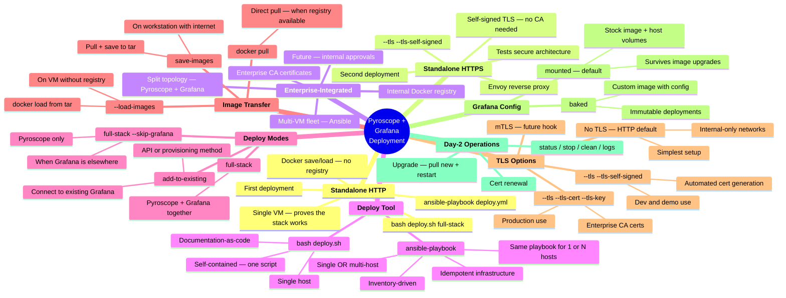
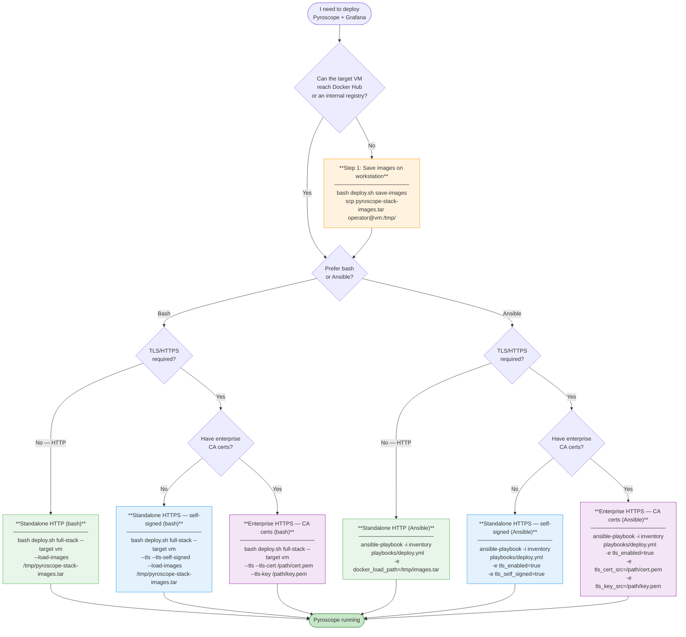
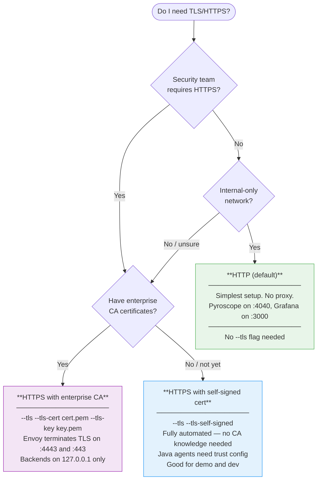
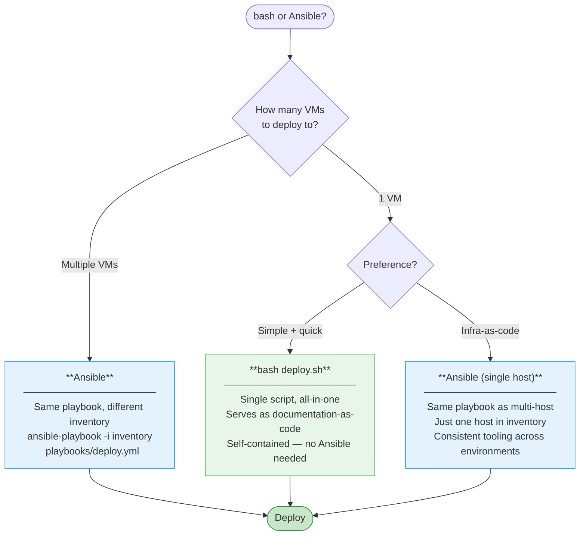
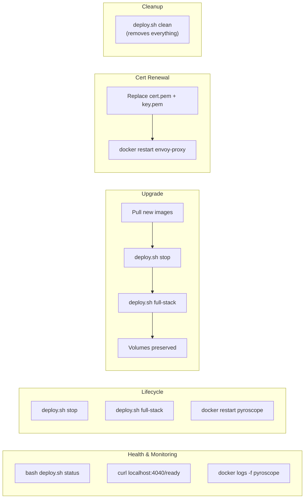

# Pyroscope + Grafana Deployment — Mind Map & Decision Guide

## Mind Map



## Decision Flowchart: Which Deployment Do I Need?



## Decision Flowchart: HTTP or HTTPS?



## Decision Flowchart: Bash or Ansible?



## Architecture: TLS Mode

### Single VM (Standalone)

```
┌──────────────────────────────────────────────────────┐
│  VM (RHEL 8.10)                                      │
│                                                      │
│  Java Agent ──HTTPS:4443──► ┌─────────┐ ┌──────────┐│
│                             │  Envoy  │→│Pyroscope ││
│  Browser ────HTTPS:443────► │ (proxy) │→│ Grafana  ││
│                             └─────────┘ └──────────┘│
│                                 ▲                    │
│                      /opt/pyroscope/tls/             │
│                      (cert.pem + key.pem)            │
└──────────────────────────────────────────────────────┘
```

### Split VMs (Enterprise-Integrated)

```
┌───────────────────────────────┐   ┌───────────────────────────────┐
│  Pyroscope VM                 │   │  Grafana VM                   │
│  (--skip-grafana)             │   │                               │
│  ┌───────┐  ┌───────────┐    │   │  ┌───────┐  ┌─────────┐      │
│  │ Envoy │→ │ Pyroscope │    │   │  │ Envoy │→ │ Grafana │      │
│  │ :4443 │  │ 127.0.0.1 │    │   │  │  :443 │  │127.0.0.1│      │
│  └───────┘  │   :4040   │    │   │  └───────┘  │  :3000  │      │
│             └───────────┘    │   │             └─────────┘      │
└───────────────────────────────┘   └───────────────────────────────┘
         ▲                                    │
         │              datasource:           │
         └────────── https://pyro-vm:4443 ────┘
```

When TLS is enabled, backend containers bind to `127.0.0.1` (not externally reachable). Only Envoy binds to `0.0.0.0` on the TLS ports.

## Port Reference

| Service | HTTP Mode | HTTPS Mode (external) | HTTPS Mode (internal) |
|---------|-----------|----------------------|----------------------|
| Pyroscope | `0.0.0.0:4040` | `0.0.0.0:4443` (Envoy) | `127.0.0.1:4040` |
| Grafana | `0.0.0.0:3000` | `0.0.0.0:443` (Envoy) | `127.0.0.1:3000` |
| Envoy admin | - | `127.0.0.1:9901` | `127.0.0.1:9901` |

## Step-by-Step: Standalone HTTP (First Deployment)

This is the simplest deployment. No TLS, no registry — just get the stack running.

### Using bash

```bash
# 1. On a machine with internet access — save Docker images to tar
bash deploy.sh save-images
# Output: pyroscope-stack-images.tar

# 2. Transfer to target VM
scp pyroscope-stack-images.tar operator@vm01.corp:/tmp/

# 3. SSH to target VM
ssh operator@vm01.corp
pbrun /bin/su -

# 4. Deploy (HTTP — default)
bash deploy.sh full-stack --target vm \
    --load-images /tmp/pyroscope-stack-images.tar \
    --log-file /tmp/deploy.log

# 5. Verify
bash deploy.sh status --target vm
curl -s http://localhost:4040/ready    # Pyroscope
curl -s http://localhost:3000/api/health  # Grafana
```

### Using Ansible

```bash
# 1. Save images (same as above)
bash deploy.sh save-images
scp pyroscope-stack-images.tar operator@vm01.corp:/tmp/

# 2. Edit inventory
cat > inventory/hosts.yml <<EOF
all:
  children:
    pyroscope_full_stack:
      hosts:
        vm01.corp.example.com:
  vars:
    ansible_user: operator
    ansible_become: true
    ansible_become_method: su
EOF

# 3. Deploy
ansible-playbook -i inventory playbooks/deploy.yml \
    -e docker_load_path=/tmp/pyroscope-stack-images.tar

# 4. Check status
ansible-playbook -i inventory playbooks/status.yml
```

### Configure Java agents

```bash
# Add to your Java service's environment:
PYROSCOPE_SERVER_ADDRESS=http://vm01.corp:4040
```

## Step-by-Step: Standalone HTTPS (Second Deployment)

Same workflow, but with self-signed TLS. No CA knowledge needed — the script generates everything.

### Using bash

```bash
# 1. Save images (includes Envoy image for TLS)
bash deploy.sh save-images --tls
# Output: pyroscope-stack-images.tar (includes pyroscope, grafana, envoy)

# 2. Transfer + SSH (same as HTTP)
scp pyroscope-stack-images.tar operator@vm01.corp:/tmp/
ssh operator@vm01.corp && pbrun /bin/su -

# 3. Deploy with self-signed TLS
bash deploy.sh full-stack --target vm \
    --load-images /tmp/pyroscope-stack-images.tar \
    --tls --tls-self-signed \
    --log-file /tmp/deploy.log

# 4. Verify
bash deploy.sh status --target vm
curl -k https://localhost:4443/ready          # -k for self-signed
curl -k https://localhost:443/api/health
```

### Using Ansible

```bash
ansible-playbook -i inventory playbooks/deploy.yml \
    -e docker_load_path=/tmp/pyroscope-stack-images.tar \
    -e tls_enabled=true \
    -e tls_self_signed=true
```

### Configure Java agents (self-signed)

```bash
# Option 1: Import cert into JVM truststore
keytool -import -alias pyroscope \
    -file /opt/pyroscope/tls/cert.pem \
    -keystore $JAVA_HOME/lib/security/cacerts \
    -storepass changeit -noprompt

PYROSCOPE_SERVER_ADDRESS=https://vm01.corp:4443

# Option 2: Custom truststore (per-app)
cp /opt/pyroscope/tls/cert.pem /path/to/app/
keytool -import -alias pyroscope \
    -file cert.pem -keystore pyroscope-trust.jks \
    -storepass changeit -noprompt

java -Djavax.net.ssl.trustStore=/path/to/pyroscope-trust.jks \
     -Djavax.net.ssl.trustStorePassword=changeit \
     -jar myapp.jar
```

## Enterprise-Integrated Deployment (Future)

This section documents the target state when internal processes and approvals are in place. The tooling is ready — what's needed is:

1. **Internal Docker registry** — push images instead of docker save/load
2. **Enterprise CA certificates** — obtained from security team
3. **Multi-VM topology** — separate Pyroscope and Grafana VMs
4. **Ansible fleet management** — inventory-driven multi-host deploys

### Enterprise deployment with CA certs

```bash
# Using bash (single VM)
bash deploy.sh full-stack --target vm \
    --tls --tls-cert /path/to/ca-signed-cert.pem \
    --tls-key /path/to/ca-signed-key.pem

# Using Ansible (multi-VM)
ansible-playbook -i inventory/production playbooks/deploy.yml \
    -e tls_enabled=true \
    -e tls_cert_src=/path/to/ca-signed-cert.pem \
    -e tls_key_src=/path/to/ca-signed-key.pem
```

### Split-VM topology (Ansible)

```yaml
# inventory/production/hosts.yml
all:
  children:
    pyroscope_servers:
      hosts:
        pyro-vm01.corp:
      vars:
        skip_grafana: true    # Pyroscope only on this VM
    grafana_servers:
      hosts:
        grafana-vm01.corp:
      vars:
        pyroscope_mode: add-to-existing
        pyroscope_url: https://pyro-vm01.corp:4443
        grafana_api_key: "{{ vault_grafana_api_key }}"
  vars:
    tls_enabled: true
    tls_cert_src: "{{ vault_tls_cert_path }}"
    tls_key_src: "{{ vault_tls_key_path }}"
```

### What needs to happen for enterprise-integrated

| Item | Status | Notes |
|------|--------|-------|
| Internal Docker registry | Pending | Need registry URL and push access |
| Enterprise CA certificates | Pending | Request from security team |
| Multi-VM approval | Pending | VM provisioning through infrastructure team |
| Ansible inventory setup | Ready | Playbook and roles support multi-host |
| mTLS (mutual TLS) | Future | Flag placeholder exists (`--tls-client-ca`) |

## Day-2 Operations Quick Reference



## File Map

```
deploy/observability/
├── deploy.sh                     # Main deployment script (bash)
├── README.md                     # Quick-start guide
└── ansible/
    ├── inventory/
    │   ├── hosts.yml             # Static inventory
    │   └── group_vars/
    │       └── pyroscope.yml     # Shared variables
    ├── playbooks/
    │   ├── deploy.yml            # Deploy stack
    │   ├── status.yml            # Check status
    │   ├── stop.yml              # Stop (preserve data)
    │   └── clean.yml             # Full cleanup
    └── roles/pyroscope-stack/
        ├── defaults/main.yml     # Default variables
        ├── tasks/
        │   ├── main.yml          # Entry point
        │   ├── preflight.yml     # Pre-flight checks
        │   ├── full-stack.yml    # Full stack deployment
        │   ├── tls.yml           # TLS cert + Envoy deployment
        │   ├── add-to-existing.yml
        │   ├── stop.yml          # Stop containers
        │   └── clean.yml         # Full cleanup
        ├── templates/
        │   ├── envoy.yaml.j2    # Envoy TLS proxy config
        │   ├── datasource.yaml.j2
        │   ├── dashboard-provider.yaml.j2
        │   └── plugins.yaml.j2
        └── handlers/main.yml
```

## Scenario Quick Reference

| I want to... | Command |
|---------------|---------|
| Deploy HTTP on a VM | `bash deploy.sh full-stack --target vm` |
| Deploy HTTPS (self-signed) | `bash deploy.sh full-stack --target vm --tls --tls-self-signed` |
| Deploy HTTPS (CA certs) | `bash deploy.sh full-stack --target vm --tls --tls-cert c.pem --tls-key k.pem` |
| Deploy Pyroscope only | `bash deploy.sh full-stack --target vm --skip-grafana` |
| Save images for air-gap | `bash deploy.sh save-images` |
| Load images on VM | `bash deploy.sh full-stack --target vm --load-images /tmp/images.tar` |
| Dry run (validate) | `bash deploy.sh full-stack --target vm --dry-run` |
| Check status | `bash deploy.sh status --target vm` |
| Stop (preserve data) | `bash deploy.sh stop --target vm` |
| Full cleanup | `bash deploy.sh clean --target vm` |
| Deploy via Ansible | `ansible-playbook -i inventory playbooks/deploy.yml` |
| Ansible + TLS self-signed | `ansible-playbook ... -e tls_enabled=true -e tls_self_signed=true` |
| Ansible + load images | `ansible-playbook ... -e docker_load_path=/tmp/images.tar` |
