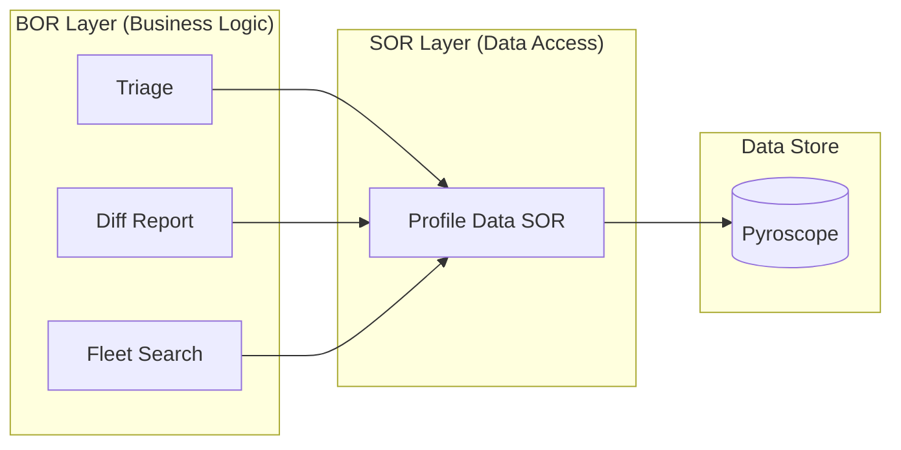
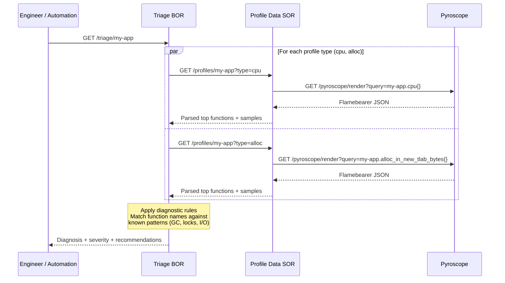
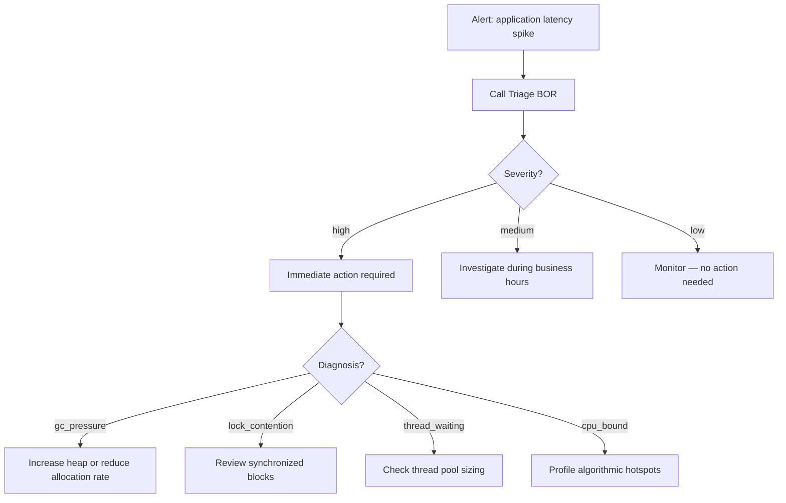
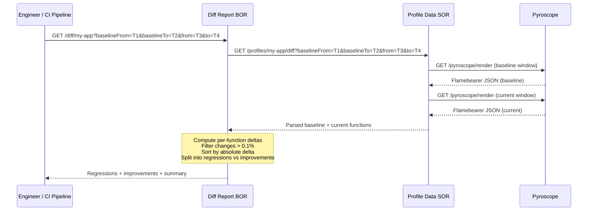
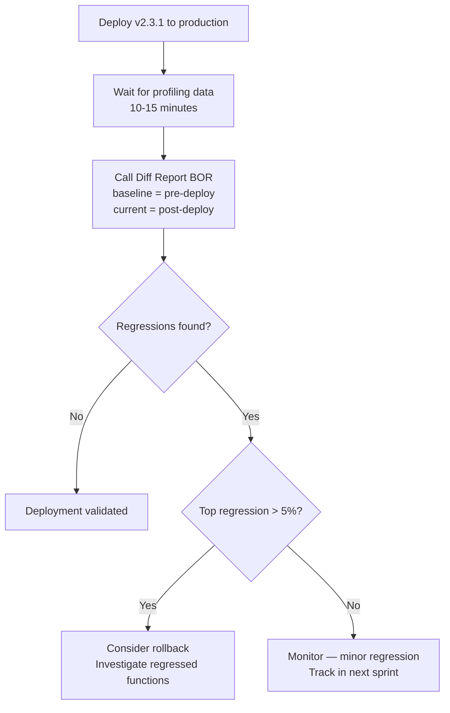
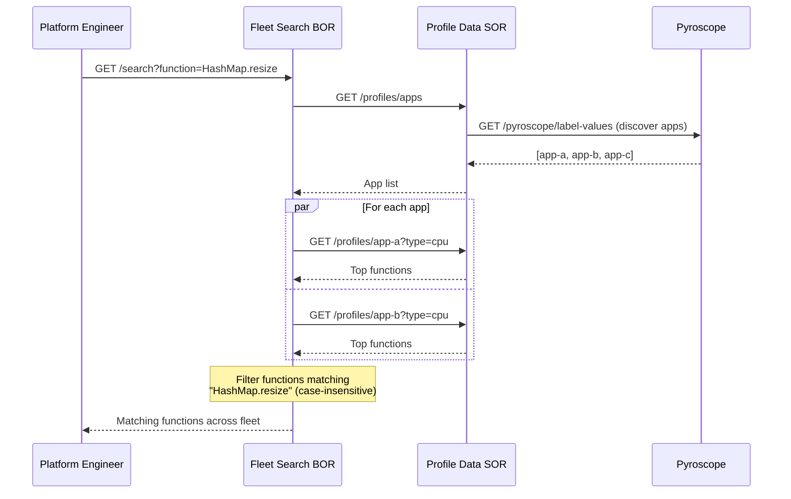

# Pyroscope Functions — Phase 1 (No Database)

3 BOR + 1 SOR. Requires only Pyroscope. No PostgreSQL.

---

## Architecture



```
┌──────────────────────────────────────────────┐
│              BOR (1 JAR)                     │
│  Triage    DiffReport    FleetSearch          │
└──────────────┬───────────────────────────────┘
               │ HTTP
┌──────────────▼───────────────────────────────┐
│              SOR (1 JAR)                     │
│           ProfileData                        │
└──────────────┬───────────────────────────────┘
               │ HTTP
┌──────────────▼───────────────────────────────┐
│           Pyroscope                          │
└──────────────────────────────────────────────┘
```

| Function | Layer | FUNCTION env var | What it does |
|----------|-------|-----------------|-------------|
| Profile Data | SOR | `ReadPyroscopeProfile.sor.v1` | Wraps Pyroscope HTTP API, parses flamebearer JSON into ranked function lists |
| Triage | BOR | `ReadPyroscopeTriageAssessment.v1` | Pattern-based diagnosis of CPU/alloc/lock/wall profiles |
| Diff Report | BOR | `ReadPyroscopeDiffReport.v1` | Per-function delta between two time windows |
| Fleet Search | BOR | `ReadPyroscopeFleetSearch.v1` | Cross-service function search and hotspot ranking |

All functions are stateless HTTP GET endpoints. No database, no cron, no Kafka.

---

## 1. Profile Triage

### Use Case

An engineer is paged at 2 AM for a latency spike. Instead of logging into Pyroscope and reading a flame graph, they call one endpoint:

```
GET /triage/my-app
```

Returns: **"gc_pressure — high severity — GC activity in CPU profile, check heap sizing. Top function: G1 Young Generation (34.2%)"**

No flame graph expertise required.

### Business Impact

| Impact Area | Benefit |
|-------------|---------|
| **MTTR reduction** | Eliminates the manual flame graph interpretation step. Diagnosis in seconds instead of 15-30 minutes. |
| **Knowledge democratization** | Junior engineers get the same diagnostic quality as profiling experts. |
| **Consistent incident response** | Every triage follows the same rules. No variance depending on who's on call. |

### How It Works



### Diagnostic Rules

| Profile Type | Patterns Detected | Diagnosis |
|-------------|-------------------|-----------|
| CPU | GC, G1, ParallelGC, ZGC | `gc_pressure` |
| CPU | park, sleep, Object.wait | `thread_waiting` |
| CPU | synchronized, ReentrantLock | `lock_contention` |
| CPU | Compiler, C1, C2 | `jit_overhead` |
| Alloc | StringBuilder, concat, String.format | `string_allocation` |
| Alloc | ArrayList, HashMap, resize, grow | `collection_resizing` |
| Alloc | Jackson, Gson, deserialize | `deserialization_overhead` |
| Wall | sleep, wait, park, idle | `idle_time` |
| Wall | socket, connect, dns, InputStream.read, OutputStream.write, SocketChannel | `network_io` |

### API

```
GET /triage/:appName
```

| Parameter | Default | Description |
|-----------|---------|-------------|
| `from` | now - 1h | Start time (epoch seconds) |
| `to` | now | End time (epoch seconds) |
| `types` | `cpu,alloc` | Comma-separated profile types to analyze |
| `limit` | `10` | Top N functions per profile type |

### Example

**Request:**
```
GET /triage/my-app
```

**Response:**
```json
{
  "appName": "my-app",
  "from": 1706000000,
  "to": 1706003600,
  "profiles": {
    "cpu": {
      "diagnosis": "gc_pressure",
      "totalSamples": 48230,
      "topFunctions": [
        { "name": "G1 Young Generation", "selfPercent": 34.2, "selfSamples": 16494 },
        { "name": "com.example.AppService.process", "selfPercent": 12.1, "selfSamples": 5836 }
      ],
      "recommendation": "GC activity in CPU profile — check heap sizing (-Xmx), reduce allocation rate. Top: G1 Young Generation"
    },
    "alloc": {
      "diagnosis": "collection_resizing",
      "totalSamples": 112000000,
      "topFunctions": [
        { "name": "java.util.HashMap.resize", "selfPercent": 18.5, "selfSamples": 20720000 }
      ],
      "recommendation": "Collection resizing — pre-size collections with expected capacity. Top: java.util.HashMap.resize"
    }
  },
  "summary": {
    "primaryIssue": "gc_pressure",
    "severity": "high",
    "recommendation": "GC activity in CPU profile — check heap sizing (-Xmx), reduce allocation rate. Top: G1 Young Generation"
  }
}
```

### Incident Workflow



---

## 2. Diff Report

### Use Case

A team deploys `my-app` v2.3.1 and needs to know if performance changed:

```
GET /diff/my-app?baselineFrom=1706000000&baselineTo=1706003600&from=1706003600&to=1706007200
```

Returns: **"1 regression — DataSerializer.serialize +6.6%. 1 improvement — CacheManager.lookup -12.2%."**

### Business Impact

| Impact Area | Benefit |
|-------------|---------|
| **Deployment confidence** | Know within minutes whether a deploy introduced regressions. |
| **Rollback decision support** | Quantified regression data justifies a rollback instead of guessing. |
| **Optimization validation** | Proves improvements with numbers. Justifies engineering investment. |
| **CI/CD integration** | Markdown output goes straight to PRs or Slack. |

### How It Works



### API

```
GET /diff/:appName
```

| Parameter | Default | Description |
|-----------|---------|-------------|
| `from` | `to` - 1h | Current window start (epoch seconds) |
| `to` | now | Current window end (epoch seconds) |
| `baselineFrom` | `from` - 1h | Baseline window start (epoch seconds) |
| `baselineTo` | `from` | Baseline window end (epoch seconds) |
| `type` | `cpu` | Profile type to compare |
| `limit` | `20` | Top N changes to return |
| `format` | `json` | Response format: `json` or `markdown` |

### Example (JSON)

```json
{
  "appName": "my-app",
  "profileType": "cpu",
  "baseline": { "from": 1706000000, "to": 1706003600 },
  "current": { "from": 1706003600, "to": 1706007200 },
  "regressions": [
    { "function": "com.example.DataSerializer.serialize", "baselinePercent": 2.1, "currentPercent": 8.7, "deltaPercent": 6.6 }
  ],
  "improvements": [
    { "function": "com.example.CacheManager.lookup", "baselinePercent": 15.3, "currentPercent": 3.1, "deltaPercent": -12.2 }
  ],
  "summary": { "regressionsCount": 1, "improvementsCount": 1, "topRegression": "com.example.DataSerializer.serialize (+6.6%)" }
}
```

### Deployment Validation Workflow



---

## 3. Fleet Search

### Use Case

The platform team wants to know how many services are affected by `HashMap.resize`:

```
GET /search?function=HashMap.resize&type=cpu
```

For fleet-wide hotspot ranking:

```
GET /fleet/hotspots?type=cpu&limit=10
```

### Business Impact

| Impact Area | Benefit |
|-------------|---------|
| **Shared library optimization** | Finds when a common library is a hotspot across many services. One fix improves all. |
| **Fleet-wide visibility** | See which functions burn the most CPU/memory across the entire organization. |
| **Prioritization** | Impact score (`serviceCount x maxSelfPercent`) ranks hotspots by organizational cost. |
| **Incident pattern detection** | Reveals whether multiple services share a common root cause. |

### How It Works



### API — Search

```
GET /search
```

| Parameter | Default | Description |
|-----------|---------|-------------|
| `function` | **(required)** | Function name substring (case-insensitive) |
| `type` | `cpu` | Profile type to search |
| `from` | now - 1h | Start time (epoch seconds) |
| `to` | now | End time (epoch seconds) |
| `apps` | all discovered | Comma-separated app names to restrict search |

### API — Hotspots

```
GET /fleet/hotspots
```

| Parameter | Default | Description |
|-----------|---------|-------------|
| `type` | `cpu` | Profile type to analyze |
| `limit` | `20` | Top N hotspots to return |
| `from` | now - 1h | Start time (epoch seconds) |
| `to` | now | End time (epoch seconds) |
| `apps` | all discovered | Comma-separated app names to restrict search |

### Example — Search

```json
{
  "query": "HashMap.resize",
  "profileType": "cpu",
  "matchCount": 3,
  "matches": [
    { "app": "app-a", "function": "java.util.HashMap.resize", "selfPercent": 8.2, "selfSamples": 3956 },
    { "app": "app-b", "function": "java.util.HashMap.resize", "selfPercent": 5.1, "selfSamples": 2108 },
    { "app": "app-c", "function": "java.util.HashMap.resize", "selfPercent": 1.3, "selfSamples": 412 }
  ]
}
```

### Example — Hotspots

```json
{
  "profileType": "cpu",
  "hotspots": [
    {
      "function": "G1 Young Generation",
      "serviceCount": 2,
      "maxSelfPercent": 14.1,
      "impactScore": 28.2,
      "services": [
        { "app": "app-a", "selfPercent": 14.1 },
        { "app": "app-d", "selfPercent": 9.8 }
      ]
    }
  ]
}
```

---

## Profile Data SOR

Wraps the Pyroscope HTTP API. No database. All BOR functions call through this SOR.

| Endpoint | Method | Description |
|----------|--------|-------------|
| `/profiles/:appName` | GET | Top functions for an app. Params: `type`, `from`, `to`, `limit` |
| `/profiles/:appName/diff` | GET | Functions for two time windows. Params: `type`, `baselineFrom`, `baselineTo`, `from`, `to`, `limit` |
| `/profiles/apps` | GET | All Pyroscope-monitored app names. Params: `from`, `to` |
| `/health` | GET | Returns `OK` |

---

## Design Patterns

**BOR/SOR Separation** — BOR owns business logic (diagnosis rules, delta computation, hotspot scoring). SOR owns data access (Pyroscope API parsing). Each layer deploys independently from a single fat JAR.

**Anti-Corruption Layer** — Profile Data SOR translates Pyroscope's raw flamebearer format into a clean domain model. BOR verticles never parse Pyroscope wire format.

**Single Artifact, Multiple Deployments** — One JAR per layer. `FUNCTION` env var selects which verticle runs. Three deployments of the same BOR JAR run three different functions.

**AbstractFunctionVerticle** — All verticles extend a common base class that handles HTTP server lifecycle, health endpoints, parameter extraction (`paramLong`, `paramInt`, `paramStr`), and error responses (`sendError`).

**Business Logic Extraction** — Diagnosis rules (`TriageRules`), delta computation (`DiffComputation`), and hotspot scoring (`HotspotScorer`) are stateless utility classes with `static` methods, testable without deploying verticles.

---

## Project Structure

| Project | Layer | Java Target |
|---------|-------|-------------|
| `pyroscope-bor` | BOR | 17 |
| `pyroscope-bor-java11` | BOR | 11 |
| `pyroscope-sor` | SOR | 17 |
| `pyroscope-sor-java11` | SOR | 11 |

### BOR Source

```
pyroscope-bor/src/main/java/com/pyroscope/bor/
├── AbstractFunctionVerticle.java    # HTTP lifecycle, health, param/error helpers
├── Main.java                        # Selects verticle by FUNCTION env var
├── SorClient.java                   # HTTP client for SOR communication
├── sor/
│   ├── ProfileType.java             # Enum: CPU, ALLOC, LOCK, WALL
│   └── PyroscopeClient.java         # Flamebearer parser
├── triage/
│   ├── TriageRules.java             # Diagnosis, severity, recommendation logic
│   └── TriageVerticle.java          # GET /triage/:appName
├── diffreport/
│   ├── DiffComputation.java         # Delta calculation, filtering, sorting
│   └── DiffReportVerticle.java      # GET /diff/:appName
└── fleetsearch/
    ├── HotspotScorer.java           # Impact score ranking
    └── FleetSearchVerticle.java     # GET /search, GET /fleet/hotspots
```

### SOR Source (Phase 1 only)

```
pyroscope-sor/src/main/java/com/pyroscope/sor/
├── AbstractFunctionVerticle.java
├── Main.java
├── ProfileType.java
├── PyroscopeClient.java
└── profiledata/
    └── ProfileDataVerticle.java     # Pyroscope API wrapper — no database
```

### Technology Stack

| Layer | Technology | Version |
|-------|-----------|---------|
| Runtime | OpenJDK | 17 (or 11) |
| Framework | Eclipse Vert.x | 4.5.8 |
| Build | Gradle + Shadow plugin | 7.6.4 |
| HTTP client | Vert.x WebClient | 4.5.8 |
| Testing | JUnit 5 + AssertJ + vertx-junit5 | 5.10.2 / 3.26.0 |

---

## Deployment

### Environment Variables — BOR

| Variable | Required | Description |
|----------|:--------:|-------------|
| `FUNCTION` | Yes | `ReadPyroscopeTriageAssessment.v1`, `ReadPyroscopeDiffReport.v1`, or `ReadPyroscopeFleetSearch.v1` |
| `PORT` | No | HTTP listen port (default: 8080) |
| `PROFILE_DATA_URL` | Yes | URL of Profile Data SOR |

### Environment Variables — SOR

| Variable | Required | Description |
|----------|:--------:|-------------|
| `FUNCTION` | Yes | `ReadPyroscopeProfile.sor.v1` |
| `PORT` | No | HTTP listen port (default: 8080) |
| `PYROSCOPE_URL` | Yes | Pyroscope server URL (e.g., `http://pyroscope:4040`) |

### Example

```
# Profile Data SOR — wraps Pyroscope API
FUNCTION=ReadPyroscopeProfile.sor.v1
PYROSCOPE_URL=http://pyroscope:4040
PORT=8082

# Triage BOR
FUNCTION=ReadPyroscopeTriageAssessment.v1
PROFILE_DATA_URL=http://profile-data-sor:8082
PORT=8080

# Diff Report BOR
FUNCTION=ReadPyroscopeDiffReport.v1
PROFILE_DATA_URL=http://profile-data-sor:8082
PORT=8080

# Fleet Search BOR
FUNCTION=ReadPyroscopeFleetSearch.v1
PROFILE_DATA_URL=http://profile-data-sor:8082
PORT=8080
```

---

## Build and Test

```bash
cd services/pyroscope-bor && ./gradlew shadowJar    # BOR fat JAR
cd services/pyroscope-sor && ./gradlew shadowJar    # SOR fat JAR
make compile                                         # Compile all
make test-bor                                        # All BOR tests (no Docker needed)
```

| Test Class | What It Tests |
|-----------|--------------|
| `ProfileTypeTest` | Profile type parsing, aliases, case insensitivity |
| `PyroscopeClientExtractTest` | Flamebearer JSON parsing, function extraction |
| `TriageRulesTest` | Diagnosis pattern matching, recommendations, severity |
| `DiffComputationTest` | Delta computation, filtering, sorting |
| `HotspotScorerTest` | Impact score calculation, ranking |
| `TriageVerticleIntegrationTest` | End-to-end triage against mock HTTP server |
| `DiffReportVerticleIntegrationTest` | End-to-end diff against mock HTTP server |
| `FleetSearchVerticleIntegrationTest` | End-to-end fleet search against mock HTTP server |
| `SorClientIntegrationTest` | SOR client HTTP calls against mock server |

---

## Upgrading to Phase 2

When PostgreSQL is approved, see [profiling-functions-phase2.md](profiling-functions-phase2.md). The upgrade:

1. Deploy 4 new PostgreSQL-backed SORs (Baseline, History, Registry, AlertRule)
2. Switch BOR `FUNCTION` env vars from v1 → v2
3. Set `BASELINE_URL`, `HISTORY_URL`, `REGISTRY_URL` on BOR deployments

No code changes. Config only. The v2 BORs silently skip any SOR whose URL is not set, so the upgrade can be done incrementally.
