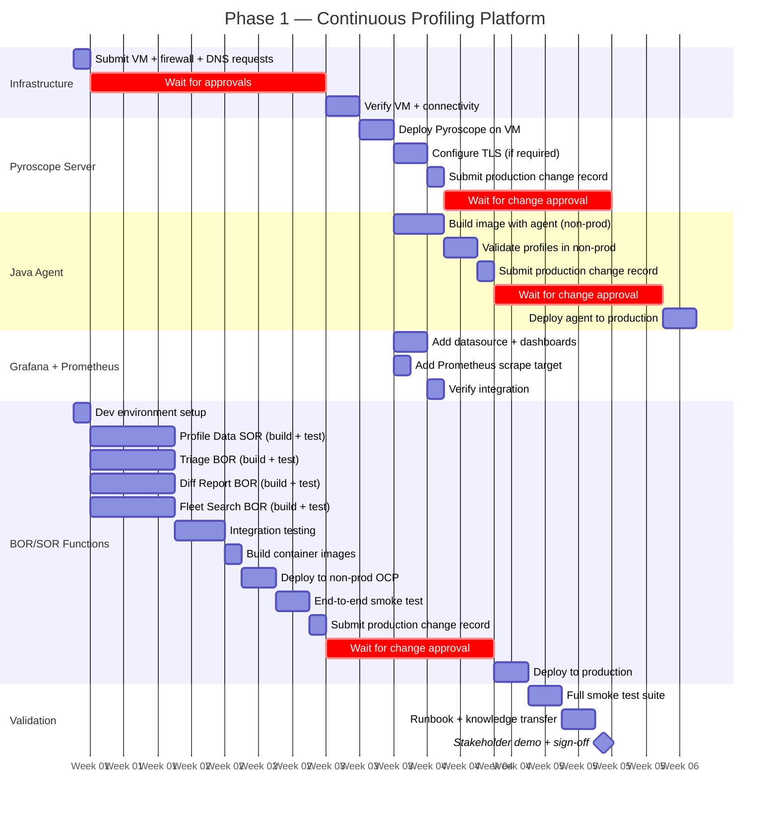

# Phase 1 Project Plan — Continuous Profiling Platform

High-level project plan for Phase 1 deployment. Designed for project tracking, time/cost
estimation, and stakeholder communication in an enterprise environment with change
management controls.

---

## Table of Contents

- [1. Scope definition](#1-scope-definition)
- [2. Prerequisites checklist](#2-prerequisites-checklist)
- [3. Epics and stories](#3-epics-and-stories)
- [4. Timeline](#4-timeline)
- [5. Effort summary](#5-effort-summary)
- [6. Risks and dependencies](#6-risks-and-dependencies)
- [7. Definition of done](#7-definition-of-done)
- [8. Phase 2 preview](#8-phase-2-preview)

---

## 1. Scope definition

### What "Phase 1" means

The term "Phase 1" is used across this project with specific meaning at each layer:

| Layer | Phase 1 scope | Phase 2 scope |
|-------|---------------|---------------|
| **Server architecture** | Pyroscope monolith on VM (Docker container) | Pyroscope microservices on OCP |
| **Function deployment** | 3 BOR + 1 SOR, no database | 3 BOR (v2) + 5 SOR, PostgreSQL |
| **JVM target** | faas-jvm11 (Java 11 compatible) | faas-jvm21 (Java 21 features) |
| **Integration** | Grafana datasource + Prometheus scrape target | Alerting rules, dashboards, SLOs |

Phase 1 delivers a fully functional continuous profiling platform with automated analysis
functions. Phase 2 adds persistence, baselines, and horizontal scaling.

### In scope

- Pyroscope server (monolith mode) on a dedicated VM with Docker
- Java agent configuration on OCP FaaS server pods
- Grafana datasource integration (existing Grafana on separate VM)
- Prometheus scrape target (existing Prometheus on separate VM)
- 3 BOR functions: Triage, Diff Report, Fleet Search (v1, no database)
- 1 SOR function: Profile Data (stateless Pyroscope API wrapper)
- Firewall rules between VM and OCP cluster
- Smoke tests and operational runbook

### Out of scope (deferred to Phase 2)

- PostgreSQL database and 4 additional SORs (Baseline, History, Registry, AlertRule)
- v2 BOR functions (baseline comparison, audit trails, ownership enrichment)
- Pyroscope microservices mode / OCP deployment of Pyroscope server
- FIPS-compliant builds
- Alerting rules and automated triage triggers
- HA / disaster recovery for Pyroscope server

---

## 2. Prerequisites checklist

Complete these before starting Epic 1. Each item includes the approving team and
typical enterprise lead time.

| # | Prerequisite | Approver | Lead time | Status |
|---|-------------|----------|-----------|--------|
| P1 | VM provisioned (2 CPU, 4 GB RAM, 100 GB disk, RHEL 8/9) | Infrastructure / VM team | 1-2 weeks | |
| P2 | Docker engine installed on VM | Infrastructure / VM team | Included in P1 | |
| P3 | DNS entry for Pyroscope VM (e.g. `pyroscope.corp.example.com`) | DNS / networking team | 3-5 days | |
| P4 | Firewall rule: OCP worker nodes → VM port 4040/TCP | Network / firewall team | 1-2 weeks | |
| P5 | Firewall rule: Grafana VM → Pyroscope VM port 4040/TCP | Network / firewall team | Included in P4 | |
| P6 | Firewall rule: Prometheus VM → Pyroscope VM port 4040/TCP | Network / firewall team | Included in P4 | |
| P7 | OCP namespace access for FaaS server pods | OCP platform team | 3-5 days | |
| P8 | Container registry access (pull Pyroscope image, push FaaS images) | Container platform team | 3-5 days | |
| P9 | Grafana admin access (add datasource) | Monitoring / Grafana team | 3-5 days | |
| P10 | Prometheus config access (add scrape target) | Monitoring / Prometheus team | 3-5 days | |
| P11 | Change management approval for production deployment | Change advisory board | 1-2 weeks | |

> **Tip:** Submit P1, P3, P4, P7-P10 in parallel on day 1. Most can be approved concurrently.
> The critical path is typically P1 (VM provisioning) and P4 (firewall rules).

---

## 3. Epics and stories

### Epic 1 — Infrastructure provisioning

Set up the VM, networking, and access required for all subsequent work.

| Story | Size | Hands-on | Wait | Depends on | Deliverable |
|-------|:----:|:--------:|:----:|------------|-------------|
| 1.1 Submit VM provisioning request | S | 1h | 1-2 weeks | — | VM available with Docker |
| 1.2 Submit firewall rule requests (OCP→VM, Grafana→VM, Prometheus→VM) | S | 1h | 1-2 weeks | — | TCP 4040 open |
| 1.3 Request DNS entry for Pyroscope VM | S | 30m | 3-5 days | — | `pyroscope.corp.example.com` resolves |
| 1.4 Verify VM access and Docker functionality | S | 1h | — | 1.1 | `docker run hello-world` succeeds |
| 1.5 Verify firewall connectivity from OCP pod to VM | S | 1h | — | 1.1, 1.2 | `curl http://<vm>:4040` from test pod |
| 1.6 Request container registry access | S | 30m | 3-5 days | — | Can pull `grafana/pyroscope` image |

> **Parallel work:** Stories 1.1, 1.2, 1.3, 1.6 are independent — submit all requests on day 1.

---

### Epic 2 — Pyroscope server deployment

Deploy and validate the Pyroscope monolith on the provisioned VM.

| Story | Size | Hands-on | Wait | Depends on | Deliverable |
|-------|:----:|:--------:|:----:|------------|-------------|
| 2.1 Pull Pyroscope image and start container | S | 1h | — | Epic 1 | Container running on VM |
| 2.2 Configure persistent storage (volume mount for `/data`) | S | 1h | — | 2.1 | Data survives container restart |
| 2.3 Configure systemd unit or docker-compose for auto-restart | S | 2h | — | 2.1 | Pyroscope starts on VM reboot |
| 2.4 Verify Pyroscope UI accessible from browser | S | 30m | — | 2.1, 1.2 | `http://<vm>:4040` loads |
| 2.5 Configure TLS (if required by security policy) | M | 4h | — | 2.1 | HTTPS endpoint functional |
| 2.6 Submit change record for production Pyroscope deployment | S | 1h | 1-2 weeks | 2.4 | Change approved |

> **Reference:** [deployment-guide.md § 7b](deployment-guide.md) for step-by-step server setup.
> [deployment-guide.md § Firewall rules](deployment-guide.md#17a-firewall-rules-monolith-on-vm-http) for port matrix.

---

### Epic 3 — Java agent rollout on OCP

Configure the Pyroscope Java agent on FaaS server pods so profiles are pushed to the VM.

| Story | Size | Hands-on | Wait | Depends on | Deliverable |
|-------|:----:|:--------:|:----:|------------|-------------|
| 3.1 Add Pyroscope Java agent JAR to FaaS server container image | M | 2h | — | Epic 2 | Image built with agent |
| 3.2 Configure JAVA_TOOL_OPTIONS with agent properties | S | 1h | — | 3.1 | Agent points to `http://<vm>:4040` |
| 3.3 Deploy updated image to non-production OCP namespace | M | 2h | — | 3.2, P7 | Profiles visible in Pyroscope UI |
| 3.4 Validate profile ingestion (check app name, profile types) | S | 1h | — | 3.3 | CPU, alloc, lock, wall profiles present |
| 3.5 Submit change record for production agent rollout | S | 1h | 1-2 weeks | 3.4 | Change approved |
| 3.6 Deploy agent to production OCP namespace | M | 2h | — | 3.5 | Production profiles flowing |

> **Reference:** [deployment-guide.md § Tree 7](deployment-guide.md) for hybrid topology setup.
> Agent overhead: 3-8% CPU, 20-40 MB memory — see [what-is-pyroscope.md § 5](what-is-pyroscope.md).

---

### Epic 4 — Grafana and Prometheus integration

Connect Pyroscope to existing monitoring infrastructure.

| Story | Size | Hands-on | Wait | Depends on | Deliverable |
|-------|:----:|:--------:|:----:|------------|-------------|
| 4.1 Add Pyroscope datasource to Grafana | S | 1h | — | Epic 2, P9 | Datasource health check green |
| 4.2 Import Pyroscope server health dashboard | M | 2h | — | 4.1 | Ingestion rate, query latency, storage usage panels |
| 4.3 Import function CPU overview dashboard | M | 2h | — | 4.1 | Top functions by CPU, filterable by label |
| 4.4 Import thread overview dashboard | M | 2h | — | 4.1 | Thread count by pool, thread states, event loop utilization |
| 4.5 Import thread leak detection dashboard | M | 2h | — | 4.1 | Thread creation rate, long-lived alerts, stuck thread detection |
| 4.6 Import function comparison (diff) dashboard | M | 2h | — | 4.1 | Side-by-side flame graphs for before/after deploy |
| 4.7 Import profiling overhead dashboard | S | 1h | — | 4.1 | Agent CPU/memory impact, push success rate |
| 4.8 Verify flame graph panel renders with real data | S | 30m | — | 4.2, Epic 3 | Flame graphs visible |
| 4.9 Add Pyroscope scrape target to Prometheus | S | 1h | — | Epic 2, P10 | Pyroscope metrics in Prometheus |
| 4.10 Verify Pyroscope server health metrics in Prometheus | S | 30m | — | 4.9 | `pyroscope_ingestion_*` metrics present |

> **Reference:** [grafana-setup.md](grafana-setup.md) for datasource provisioning.
> [dashboard-guide.md](dashboard-guide.md) for panel-by-panel reference.
> [profiling-use-cases.md](profiling-use-cases.md) for dashboard backlog and enterprise customization guide.

---

### Epic 5 — FaaS BOR/SOR function development

Build, test, and deploy the 4 profiling analysis functions. Stories are generic and should
be broken down further based on your team's SDLC process (sprint planning, code review
gates, CI/CD pipeline specifics).

| Story | Size | Hands-on | Wait | Depends on | Deliverable |
|-------|:----:|:--------:|:----:|------------|-------------|
| 5.1 Set up development environment (JDK 17, Gradle, IDE) | S | 2h | — | — | `./gradlew build` succeeds locally |
| 5.2 Build and unit test Profile Data SOR | M | 3-5 days | — | 5.1 | 46 unit tests pass, fat JAR built |
| 5.3 Build and unit test Triage BOR | M | 3-5 days | — | 5.1 | ProfileTypeTest, TriageRulesTest pass |
| 5.4 Build and unit test Diff Report BOR | M | 3-5 days | — | 5.1 | DiffComputationTest, HotspotScorerTest pass |
| 5.5 Build and unit test Fleet Search BOR | M | 3-5 days | — | 5.1 | FleetSearchVerticleIntegrationTest passes |
| 5.6 Integration test BOR→SOR locally (mock HTTP server) | M | 2-3 days | — | 5.2-5.5 | All 32 integration tests pass |
| 5.7 Build container images for BOR and SOR | S | 1 day | — | 5.6 | Images pushed to container registry |
| 5.8 Deploy SOR to OCP namespace | M | 1 day | — | 5.7, P7, P8 | Profile Data SOR responds on port 8082 |
| 5.9 Deploy BOR functions to OCP namespace | M | 1 day | — | 5.8 | Triage, Diff Report, Fleet Search on port 8080 |
| 5.10 End-to-end smoke test (call BOR, verify response) | M | 1 day | — | 5.9, Epic 3 | `GET /triage/bank-payment-service` returns diagnosis |
| 5.11 Submit change record for production function deployment | S | 1h | 1-2 weeks | 5.10 | Change approved |
| 5.12 Deploy functions to production OCP namespace | M | 1 day | — | 5.11 | Functions live in production |

> **Reference:** [function-architecture.md](function-architecture.md) for project structure and build commands.
> [function-reference.md](function-reference.md) for API signatures and curl examples.
> [production-questionnaire-phase1.md](production-questionnaire-phase1.md) for volume estimates and deployment config.

> **Note:** Stories 5.2-5.5 can run in parallel if multiple developers are available.
> The SDLC timeline for these stories depends on your team's sprint cadence, code review
> process, and CI/CD pipeline maturity. The estimates above assume a single developer.

---

### Epic 6 — Validation and handoff

Confirm everything works end-to-end and prepare for ongoing operations.

| Story | Size | Hands-on | Wait | Depends on | Deliverable |
|-------|:----:|:--------:|:----:|------------|-------------|
| 6.1 Run full smoke test suite across all functions | M | 1 day | — | Epics 2-5 | All endpoints return expected data |
| 6.2 Validate data retention and storage consumption | S | 2h | — | 6.1 | Disk usage within capacity plan |
| 6.3 Verify Pyroscope survives container/VM restart | S | 1h | — | 6.1 | Data persists across restarts |
| 6.4 Review and finalize operational runbook | M | 1 day | — | 6.1 | Runbook covers all failure scenarios |
| 6.5 Conduct knowledge transfer with operations team | M | 2h | — | 6.4 | Ops team can restart, troubleshoot, monitor |
| 6.6 Stakeholder demo and sign-off | S | 1h | — | 6.1 | Phase 1 accepted |

> **Reference:** [troubleshooting.md](troubleshooting.md) for diagnostic procedures.
> [runbook.md](runbook.md) for incident response playbooks.

---

## 4. Timeline

Realistic timeline accounting for enterprise approval cycles. Assumes a single engineer
with access to submit requests on day 1.

> **Note:** Dates in this Gantt chart are relative placeholders (Week 1, Week 2, etc.), not a committed schedule. Actual dates depend on when prerequisites are approved.

> **Critical path:** VM provisioning (2 weeks) → Pyroscope deployment → agent validation → production change approval.
> BOR/SOR development runs in parallel with infrastructure provisioning.

---

## 5. Effort summary

| Epic | Stories | Hands-on effort | Approval wait time | Total calendar |
|------|:-------:|:---------------:|:------------------:|:--------------:|
| 1. Infrastructure provisioning | 6 | 1 day | 2 weeks | 2-3 weeks |
| 2. Pyroscope server deployment | 6 | 1-2 days | 1-2 weeks | 2-3 weeks |
| 3. Java agent rollout | 6 | 1-2 days | 1-2 weeks | 2-3 weeks |
| 4. Grafana + Prometheus integration | 5 | 1 day | — | 1-2 days |
| 5. BOR/SOR function development | 12 | 4-6 weeks | 1-2 weeks | 5-8 weeks |
| 6. Validation and handoff | 6 | 1 week | — | 1 week |
| **Total** | **41** | **7-10 weeks** | **4-8 weeks** | **8-12 weeks** |

> **Key insight:** Only 7-10 weeks of actual engineering work, but enterprise approval
> cycles add 4-8 weeks of calendar time. Parallelizing Epic 5 (function development)
> with Epics 1-3 (infrastructure) reduces the overall timeline to **8-12 weeks**.
>
> With 2 developers working in parallel on BOR/SOR functions, the hands-on engineering
> portion of Epic 5 can compress from 4-6 weeks to 2-3 weeks.

### Cost breakdown (single engineer)

| Category | Estimate | Notes |
|----------|:--------:|-------|
| Engineering labor | 7-10 weeks FTE | Includes development, testing, deployment, documentation |
| VM infrastructure | 1 VM (2 CPU, 4 GB, 100 GB) | Existing VM fleet — no new hardware procurement |
| Software licensing | $0 | Pyroscope is AGPL-3.0, Grafana OSS is Apache 2.0 |
| Container registry | Existing | Uses current OCP internal registry |
| External dependencies | None | No SaaS, no cloud-only services |

---

## 6. Risks and dependencies

| # | Risk | Likelihood | Impact | Mitigation |
|---|------|:----------:|:------:|------------|
| R1 | VM provisioning delayed beyond 2 weeks | Medium | High — blocks Epics 2-4 | Submit request on day 1, escalate after 1 week, have backup VM identified |
| R2 | Firewall rule request delayed or denied | Medium | High — no profiles ingested | Include network diagram and port justification with request, reference [architecture.md § Network boundaries](architecture.md) |
| R3 | OCP namespace access restricted | Low | Medium — blocks agent + function deployment | Engage OCP team early, request matches existing FaaS server namespace |
| R4 | Java agent causes performance regression | Low | High — rollback required | Agent overhead is 3-8% CPU, 20-40 MB memory (bounded). Deploy to non-prod first, monitor for 48h before production |
| R5 | Pyroscope disk fills up | Low | Medium — ingestion stops | Default retention is 24h. 100 GB supports ~20 services. Monitor with Prometheus `pyroscope_storage_*` metrics |
| R6 | Change advisory board rejects production change | Low | High — delays production by 2+ weeks | Pre-brief CAB members, include rollback plan, reference zero-licensing-cost and bounded overhead |
| R7 | BOR/SOR development takes longer than estimated | Medium | Medium — delays Epic 5 | Core logic is already built and tested (243 tests). Estimate includes integration testing buffer |
| R8 | Grafana/Prometheus team unavailable for integration | Low | Low — Phase 1 works without Grafana | Pyroscope has its own UI. Grafana integration can be added post-launch |

### External dependencies

| Dependency | Owner | Required by |
|------------|-------|-------------|
| Pyroscope container image (`grafana/pyroscope:1.18.0`) | Grafana Labs (open source) | Epic 2 |
| Pyroscope Java agent JAR | Grafana Labs (open source) | Epic 3 |
| OCP cluster (existing) | OCP platform team | Epics 3, 5 |
| Grafana instance (existing) | Monitoring team | Epic 4 |
| Prometheus instance (existing) | Monitoring team | Epic 4 |
| FaaS server application (existing) | Application team | Epic 3 |

---

## 7. Definition of done

Phase 1 is complete when all of the following are true:

| # | Acceptance criteria | Verification |
|---|--------------------|--------------|
| D1 | Pyroscope server is running on VM and survives reboot | `curl http://<vm>:4040/ready` returns 200 after VM restart |
| D2 | Java agent is deployed on all target OCP pods | Pyroscope UI shows all application names with profiles |
| D3 | CPU, allocation, lock, and wall-clock profiles are being collected | All 4 profile types visible in Pyroscope UI for each app |
| D4 | Grafana datasource is connected and flame graphs render | Open Grafana → Explore → Pyroscope datasource → select app → flame graph appears |
| D5 | Prometheus is scraping Pyroscope server metrics | `pyroscope_ingestion_received_profiles_total` metric present in Prometheus |
| D6 | Profile Data SOR returns data from Pyroscope API | `curl http://<sor>:8082/profiles/apps` returns list of applications |
| D7 | Triage BOR returns a severity diagnosis | `curl http://<bor>:8080/triage/<app-name>` returns JSON with severity and diagnosis |
| D8 | Diff Report BOR returns a deployment comparison | `curl http://<bor>:8080/diff-report/<app-name>` returns JSON with changes |
| D9 | Fleet Search BOR returns fleet-wide hotspots | `curl http://<bor>:8080/fleet-search/<function-name>` returns ranked results |
| D10 | Operational runbook is reviewed and accepted by operations | Ops team confirms they can restart, troubleshoot, and monitor independently |

---

## 8. Phase 2 preview

Phase 2 builds on Phase 1 incrementally. No rearchitecting — the same BOR endpoints
gain new capabilities, and 4 new SOR endpoints are added.

| Change | What it adds | Prerequisite |
|--------|-------------|--------------|
| PostgreSQL database | Persistence for baselines, audit trails, service registry, alert rules | DBA provisions a PostgreSQL instance |
| 4 new SORs | Baseline, History, Registry, AlertRule | PostgreSQL + schema.sql applied |
| v2 BOR functions | Baseline comparison, threshold annotation, ownership enrichment, audit trail | New SORs deployed and URLs configured |
| Microservices mode (optional) | Horizontal scaling if ingestion exceeds single-node capacity | OCP namespace + S3-compatible object storage |

> The upgrade from Phase 1 to Phase 2 is documented in
> [production-questionnaire-phase2.md § Upgrade path](production-questionnaire-phase2.md).
> v2 BOR functions gracefully degrade if SOR URLs are not configured — incremental rollout is safe.

---

## References

| Document | Use |
|----------|-----|
| [deployment-guide.md](deployment-guide.md) | Step-by-step server and agent deployment |
| [architecture.md](architecture.md) | Topology diagrams and port matrix |
| [function-reference.md](function-reference.md) | BOR/SOR API reference |
| [function-architecture.md](function-architecture.md) | Project structure and build commands |
| [production-questionnaire-phase1.md](production-questionnaire-phase1.md) | Volume estimates and deployment config |
| [troubleshooting.md](troubleshooting.md) | Diagnostic procedures |
| [runbook.md](runbook.md) | Incident response playbooks |
| [what-is-pyroscope.md](what-is-pyroscope.md) | Business case and cost justification |
