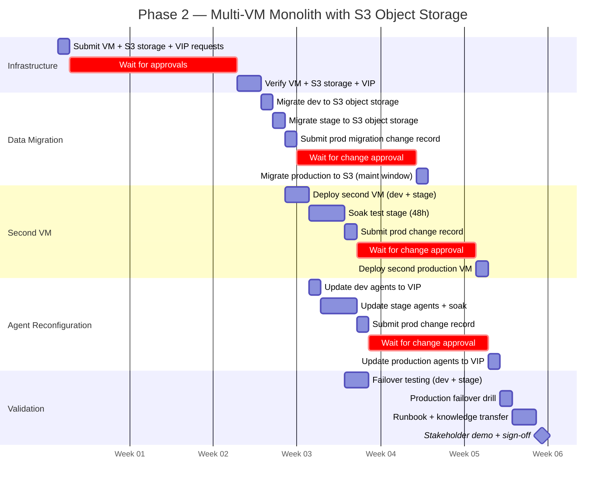

# Phase 2 Project Plan — Multi-VM Monolith with S3-Compatible Object Storage

High-level project plan for Phase 2 deployment. Adds high availability to the Pyroscope
monolith by deploying multiple VMs sharing S3-compatible object storage behind a load balancer.

---

## Table of Contents

- [1. Scope definition](#1-scope-definition)
- [2. Prerequisites checklist](#2-prerequisites-checklist)
- [3. Epics and stories](#3-epics-and-stories)
- [4. Timeline](#4-timeline)
- [5. Effort summary](#5-effort-summary)
- [6. Risks and dependencies](#6-risks-and-dependencies)
- [7. Definition of done](#7-definition-of-done)
- [8. Phase 3 preview](#8-phase-3-preview)

---

## 1. Scope definition

### What "Phase 2" means

Phase 2 adds HA to the Pyroscope monolith without rearchitecting. The same monolith
binary runs on two or more VMs, each configured to use the same S3-compatible object storage bucket. A load
balancer (F5 VIP) distributes traffic and provides automatic failover.

| Layer | Phase 1 scope | Phase 2 scope | Phase 3 scope |
|-------|---------------|---------------|---------------|
| **Server architecture** | Single VM monolith | Multi-VM monolith with S3-compatible object storage | Microservices on OCP |
| **Storage** | Local Docker volume | S3-compatible object storage (MinIO, AWS S3, GCS, or Azure Blob) | S3-compatible object storage |
| **High availability** | None (single point of failure) | Active-active via VIP load balancing | Replicated ingesters, pod rescheduling |
| **Load balancer** | None | F5 VIP with health check | OCP Service / Route |
| **Function deployment** | 3 BOR + 1 SOR, no database | Same as Phase 1 | 3 BOR (v2) + 5 SOR, PostgreSQL |
| **JVM target** | faas-jvm11 | faas-jvm11 (unchanged) | faas-jvm21 |

Phase 2 delivers HA for the profiling platform without requiring OCP namespace provisioning,
microservices expertise, or database infrastructure.

### In scope

- Second Pyroscope VM (same specs as Phase 1 VM)
- S3-compatible object storage bucket (MinIO on-prem, AWS S3, GCS, or Azure Blob)
- Both VMs configured with same S3 endpoint URL and credentials
- F5 VIP or HAProxy load balancer with health check (`GET /ready`)
- Data migration from local Docker volume to S3-compatible object storage
- Agent reconfiguration to push to VIP instead of direct VM
- Grafana and Prometheus reconfiguration to query/scrape via VIP
- Failover testing and RTO/RPO validation
- Updated operational runbook for multi-VM operations

### Out of scope (deferred to Phase 3)

- PostgreSQL database and additional SORs
- v2 BOR functions (baseline comparison, audit trails)
- Pyroscope microservices mode on OCP
- Horizontal scaling beyond 2 VMs

---

## 2. Prerequisites checklist

Complete these before starting Epic 1. Phase 1 must be complete and stable.

| # | Prerequisite | Approver | Lead time | Status |
|---|-------------|----------|-----------|--------|
| P1 | Phase 1 complete and stable (all D1-D10 criteria met) | Project owner | — | |
| P2 | Second VM provisioned (same specs as Phase 1 VM) | Infrastructure / VM team | 1-2 weeks | |
| P3 | S3-compatible object storage provisioned (MinIO, AWS S3, GCS, or Azure Blob) | Storage / cloud team | 1-2 weeks | |
| P4 | S3 bucket created with appropriate IAM policy and access credentials | Storage / cloud team | Included in P3 | |
| P5 | F5 VIP configured for Pyroscope (pool: both VMs, health check: `GET /ready`) | Network / F5 team | 1-2 weeks | |
| P6 | DNS entry updated or new entry for VIP (e.g. `pyroscope.corp.example.com`) | DNS / networking team | 3-5 days | |
| P7 | Firewall rules updated for second VM (same rules as Phase 1 VM) | Network / firewall team | 1 week | |
| P8 | TLS certificate updated for VIP FQDN (if changed from Phase 1) | Security / PKI team | 1-2 weeks | |
| P9 | Maintenance window approved for data migration | Change advisory board | 1-2 weeks | |

> **Tip:** Submit P2, P3, P5, P6, P7 in parallel on day 1. The critical path is
> typically P3 (S3 bucket provisioning) and P5 (F5 VIP configuration).

---

## 3. Epics and stories

### Epic 1 — Infrastructure provisioning (second VM + S3 object storage)

| Story | Size | Hands-on | Wait | Depends on | Env | Deliverable |
|-------|:----:|:--------:|:----:|------------|:---:|-------------|
| 1.1 Submit second VM provisioning request | S | 1h | 1-2 weeks | P1 | — | Second VM available |
| 1.2 Submit S3 object storage provisioning request | S | 1h | 1-2 weeks | — | — | S3 bucket and credentials available |
| 1.3 Submit F5 VIP configuration request | S | 1h | 1-2 weeks | — | — | VIP configured with health check |
| 1.4 Submit firewall rule requests for second VM | S | 30m | 1 week | — | — | TCP 4040 open to second VM |
| 1.5 Verify second VM access and Docker functionality | S | 1h | — | 1.1 | dev | `docker run hello-world` succeeds |
| 1.6 Configure S3 endpoint and credentials on both VMs | M | 2h | — | 1.1, 1.2 | dev | S3 endpoint URL and credentials configured on both VMs |
| 1.7 Verify shared storage (write on VM1, read on VM2) | S | 1h | — | 1.6 | dev | Object written by VM1 readable from VM2 |
| 1.8 Verify VIP routes to both VMs | S | 1h | — | 1.3, 1.5 | dev | `curl http://<vip>/ready` returns 200 |

> **Parallel work:** Stories 1.1-1.4 are independent — submit all requests on day 1.

---

### Epic 2 — Migrate Pyroscope data to S3 object storage

Migrate Pyroscope's data directory from local Docker volume to S3-compatible object storage.
Requires a brief maintenance window per environment.

| Story | Size | Hands-on | Wait | Depends on | Env | Deliverable |
|-------|:----:|:--------:|:----:|------------|:---:|-------------|
| 2.1 Stop Pyroscope on dev VM | S | 15m | — | Epic 1 | dev | Container stopped cleanly |
| 2.2 Upload `/data` contents to S3 bucket | M | 1-2h | — | 2.1 | dev | Data uploaded to S3 bucket |
| 2.3 Update Pyroscope storage config to S3 endpoint | S | 30m | — | 2.2 | dev | Container config points to S3 endpoint URL |
| 2.4 Start Pyroscope and validate data integrity | S | 30m | — | 2.3 | dev | Existing profiles queryable in UI |
| 2.5 Migrate stage Pyroscope to S3 object storage | M | 2h | — | 2.4 | stage | Stage data on S3 object storage |
| 2.6 Validate stage Pyroscope with production-like queries | S | 1h | — | 2.5 | stage | Flame graphs render, no data loss |
| 2.7 Submit change record for production data migration | S | 1h | 1-2 weeks | 2.6 | — | Change approved |
| 2.8 Migrate production Pyroscope to S3 object storage (maintenance window) | M | 2h | — | 2.7 | prod | Production data on S3 object storage |
| 2.9 Validate production data integrity | S | 1h | — | 2.8 | prod | All profiles queryable, no data loss |

> **Reference:** Data migration is a one-time operation. Schedule the production
> maintenance window (story 2.8) during a low-traffic period.

---

### Epic 3 — Deploy second Pyroscope VM

Start Pyroscope on the second VM, pointing to the same S3 object storage bucket.

| Story | Size | Hands-on | Wait | Depends on | Env | Deliverable |
|-------|:----:|:--------:|:----:|------------|:---:|-------------|
| 3.1 Deploy Pyroscope container on second dev VM | M | 2h | — | Epic 2 | dev | Second instance running on dev |
| 3.2 Validate both dev VMs serve same data | S | 1h | — | 3.1 | dev | Query either VM, same results |
| 3.3 Deploy Pyroscope on second stage VM | M | 2h | — | 3.2 | stage | Second instance running on stage |
| 3.4 Soak test stage (48h, both VMs serving traffic via VIP) | M | 1h + 48h soak | — | 3.3 | stage | No errors, data consistent |
| 3.5 Submit change record for production second VM | S | 1h | 1-2 weeks | 3.4 | — | Change approved |
| 3.6 Deploy Pyroscope on second production VM | M | 2h | — | 3.5 | prod | Second instance running on prod |
| 3.7 Validate production data consistency across both VMs | S | 1h | — | 3.6 | prod | Both VMs serve identical query results |

> **Important:** With S3-compatible object storage, both VMs can safely read and write
> concurrently — there are no block-level conflicts. The VIP distributes traffic
> across both VMs in an **active-active** configuration.

---

### Epic 4 — Load balancer and agent reconfiguration

Point agents, Grafana, and Prometheus to the VIP instead of a single VM.

| Story | Size | Hands-on | Wait | Depends on | Env | Deliverable |
|-------|:----:|:--------:|:----:|------------|:---:|-------------|
| 4.1 Configure F5 VIP health check for dev | S | 1h | — | Epic 3 | dev | VIP health check passes for active VM |
| 4.2 Update dev agents to push to VIP | M | 2h | — | 4.1 | dev | Agents push to `https://<vip>:443` |
| 4.3 Validate dev profile ingestion through VIP | S | 1h | — | 4.2 | dev | Profiles visible in Pyroscope UI via VIP |
| 4.4 Configure F5 VIP for stage, update stage agents | M | 2h | — | 4.3 | stage | Stage agents pushing through VIP |
| 4.5 Soak test stage agents through VIP (48h) | M | 1h + 48h soak | — | 4.4 | stage | No ingestion drops, no errors |
| 4.6 Submit change record for production agent reconfiguration | S | 1h | 1-2 weeks | 4.5 | — | Change approved |
| 4.7 Update production agents to push to VIP | M | 2h | — | 4.6 | prod | All production agents pushing to VIP |
| 4.8 Update Grafana datasource to VIP URL | S | 30m | — | 4.7 | prod | Grafana queries go through VIP |
| 4.9 Update Prometheus to scrape both VMs individually | S | 30m | — | 4.7 | prod | Per-VM metrics available |

> **Agent change is transparent.** The agent pushes to a URL. Changing from
> `http://<vm>:4040` to `https://<vip>:443` requires only updating `JAVA_TOOL_OPTIONS`.

---

### Epic 5 — HA validation and failover testing

Verify that the VIP failover works correctly and measure RTO/RPO.

| Story | Size | Hands-on | Wait | Depends on | Env | Deliverable |
|-------|:----:|:--------:|:----:|------------|:---:|-------------|
| 5.1 Stop active dev VM, verify VIP fails over to standby | M | 2h | — | Epic 4 | dev | Queries answered by standby VM |
| 5.2 Measure dev failover time (RTO) | S | 30m | — | 5.1 | dev | RTO documented |
| 5.3 Restart original VM, verify it rejoins | S | 30m | — | 5.2 | dev | Both VMs healthy again |
| 5.4 Failover test on stage under load | M | 2h | — | 5.3 | stage | Failover during active ingestion |
| 5.5 Measure stage data loss window (RPO) during failover | S | 1h | — | 5.4 | stage | RPO documented (expected: < 2 min) |
| 5.6 Scheduled failover drill on production | M | 2h | — | Epic 4 | prod | Production failover confirmed |
| 5.7 Document RTO/RPO results | S | 1h | — | 5.6 | — | Results added to runbook |

---

### Epic 6 — Monitoring and runbook updates

Update operational documentation and monitoring for multi-VM topology.

| Story | Size | Hands-on | Wait | Depends on | Env | Deliverable |
|-------|:----:|:--------:|:----:|------------|:---:|-------------|
| 6.1 Update Grafana datasource URL to VIP | S | 30m | — | Epic 4 | prod | Datasource health check green |
| 6.2 Add per-VM Prometheus scrape targets | S | 1h | — | Epic 4 | prod | Both VMs scraped individually |
| 6.3 Add VIP health alert to Prometheus | S | 1h | — | 6.2 | prod | Alert fires if VIP health check fails |
| 6.4 Import multi-VM health dashboard | M | 2h | — | 6.1 | prod | Per-VM metrics, VIP health, S3 storage panels |
| 6.5 Update operational runbook for multi-VM procedures | M | 1 day | — | Epic 5 | — | Runbook covers failover, restart, data migration |
| 6.6 Knowledge transfer with operations team | M | 2h | — | 6.5 | — | Ops team can perform failover drill |
| 6.7 Stakeholder demo and sign-off | S | 1h | — | 6.6 | — | Phase 2 accepted |

---

## 4. Timeline

Realistic timeline assuming Phase 1 is complete. Assumes a single engineer with
access to submit requests on day 1.

> **Note:** Dates in this Gantt chart are relative placeholders (Week 1, Week 2, etc.), not a committed schedule. Actual dates depend on when prerequisites are approved.

> **Critical path:** S3 object storage provisioning (2 weeks) → data migration → second VM → agent reconfiguration.
> Infrastructure requests and change approvals can overlap.

---

## 5. Effort summary

| Epic | Stories | Hands-on effort | Approval wait time | Total calendar |
|------|:-------:|:---------------:|:------------------:|:--------------:|
| 1. Infrastructure provisioning | 8 | 1 day | 2 weeks | 2-3 weeks |
| 2. Data migration | 9 | 1-2 days | 1-2 weeks | 2-3 weeks |
| 3. Second VM deployment | 7 | 1-2 days | 1-2 weeks | 2-3 weeks |
| 4. Agent reconfiguration | 9 | 1-2 days | 1-2 weeks | 2-3 weeks |
| 5. HA validation | 7 | 1-2 days | — | 1-2 days |
| 6. Monitoring and handoff | 6 | 2-3 days | — | 2-3 days |
| **Total** | **46** | **2-3 weeks** | **4-6 weeks** | **4-6 weeks** |

> **Key insight:** Only 2-3 weeks of engineering work, but enterprise approval
> cycles add 4-6 weeks. Many change records can be batched or submitted in parallel.

### Cost breakdown

| Category | Estimate | Notes |
|----------|:--------:|-------|
| Engineering labor | 2-3 weeks FTE | Includes migration, testing, validation, documentation |
| Second VM | 1 VM (same specs as Phase 1) | Existing VM fleet — no new hardware procurement |
| S3 object storage | S3 bucket (MinIO on-prem or cloud S3) | Existing infrastructure or cloud account |
| F5 VIP | 1 VIP configuration | Existing F5 infrastructure |
| Software licensing | $0 | Same Pyroscope AGPL-3.0 binary |

---

## 6. Risks and dependencies

| # | Risk | Likelihood | Impact | Mitigation |
|---|------|:----------:|:------:|------------|
| R1 | S3 object storage provisioning delayed | Medium | High — blocks data migration | Submit request on day 1, escalate after 1 week |
| R2 | F5 VIP configuration delayed | Medium | Medium — delays agent reconfiguration | Can test without VIP using direct VM access |
| R3 | S3 eventual consistency edge cases | Low | Low — brief read-after-write delay | S3 provides strong read-after-write consistency; MinIO also supports it |
| R4 | Data migration causes data loss | Low | High — historical profiles lost | Back up Docker volume before migration; validate object counts and checksums |
| R5 | VIP health check misconfigured | Low | Medium — no automatic failover | Test health check path (`GET /ready`) before going live |
| R6 | Agent push failures during VIP cutover | Low | Low — agent retries automatically | Agent retains samples in buffer; next push succeeds |
| R7 | S3 object storage latency higher than local disk | Low | Medium — slow queries | Test query latency against S3 endpoint before migration; MinIO on-prem typically matches network storage performance |
| R8 | Soak test reveals issues | Low | Medium — delays production | Allow buffer time for soak test iterations |

### External dependencies

| Dependency | Owner | Required by |
|------------|-------|-------------|
| S3-compatible object storage (MinIO, AWS S3, GCS, or Azure Blob) | Storage / cloud team | Epic 1 |
| Second VM (same specs as Phase 1) | Infrastructure / VM team | Epic 1 |
| F5 VIP configuration | Network / F5 team | Epic 4 |
| Maintenance window for data migration | Change advisory board | Epic 2 |
| Phase 1 stable and operational | Project team | All epics |

---

## 7. Definition of done

Phase 2 is complete when all of the following are true:

| # | Acceptance criteria | Verification |
|---|--------------------|--------------|
| D1 | Both Pyroscope VMs are running and configured with S3 object storage | `curl http://<vm1>:4040/ready` and `curl http://<vm2>:4040/ready` return 200 |
| D2 | S3 object storage bucket contains all profile data | Query same time range on both VMs — identical results |
| D3 | F5 VIP is routing traffic and health check is active | `curl https://<vip>/ready` returns 200 |
| D4 | All Java agents push through VIP | Pyroscope UI shows all application names with profiles |
| D5 | Grafana datasource points to VIP | Flame graphs render via VIP URL |
| D6 | Prometheus scrapes both VMs individually | `pyroscope_ingestion_received_profiles_total` from both VMs |
| D7 | VIP failover tested — standby VM takes over when active stops | Stop active VM, verify queries answered by standby within RTO |
| D8 | RTO < 2 minutes, RPO < 2 minutes documented | Failover test results recorded |
| D9 | Operational runbook updated for multi-VM procedures | Ops team can perform failover drill independently |
| D10 | Stakeholder demo completed and sign-off received | Phase 2 accepted |

---

## 8. Phase 3 preview

Phase 3 migrates from multi-VM monolith to microservices on OpenShift, adding
PostgreSQL-backed SORs and v2 BOR functions.

| Change | What it adds | Prerequisite |
|--------|-------------|--------------|
| Microservices on OCP | 7 Pyroscope components as separate pods, horizontal scaling | OCP namespace + S3-compatible object storage |
| PostgreSQL database | Persistence for baselines, audit trails, service registry, alert rules | DBA provisions PostgreSQL instance |
| 4 new SORs | Baseline, History, Registry, AlertRule | PostgreSQL + schema.sql applied |
| v2 BOR functions | Baseline comparison, threshold annotation, ownership enrichment, audit trail | New SORs deployed |
| Java 21 target | faas-jvm21 with modern Java features | JDK 21 on build servers |

> The migration from Phase 2 to Phase 3 is **server-side only** — Java agents do not
> change. The agent pushes to a URL; Phase 3 changes what is behind that URL (VIP →
> OCP distributor service).

---

## References

| Document | Use |
|----------|-----|
| [project-plan-phase1.md](project-plan-phase1.md) | Phase 1 plan (prerequisite) |
| [project-plan-phase3.md](project-plan-phase3.md) | Phase 3 plan (next phase) |
| [architecture.md](architecture.md) | Multi-VM topology diagram |
| [capacity-planning.md](capacity-planning.md) | Multi-VM sizing and S3 object storage requirements |
| [deployment-guide.md](deployment-guide.md) | Server deployment procedures |
| [troubleshooting.md](troubleshooting.md) | Diagnostic procedures |
| [runbook.md](runbook.md) | Incident response playbooks |
