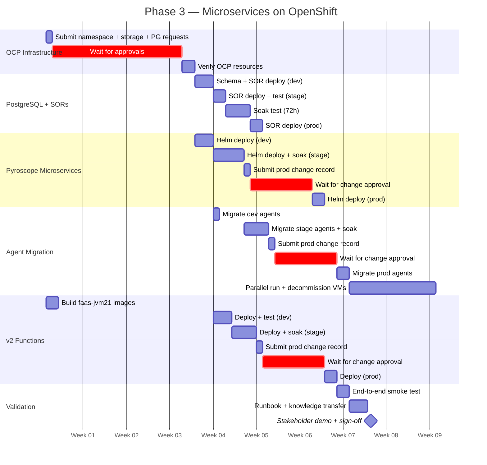

# Phase 3 Project Plan — Microservices on OpenShift

High-level project plan for Phase 3 deployment. Migrates Pyroscope from multi-VM monolith
to microservices mode on OpenShift Container Platform (OCP), adds PostgreSQL-backed SORs,
and upgrades BOR functions to v2.

---

## Table of Contents

- [1. Scope definition](#1-scope-definition)
- [2. Prerequisites checklist](#2-prerequisites-checklist)
- [3. Epics and stories](#3-epics-and-stories)
- [4. Timeline](#4-timeline)
- [5. Effort summary](#5-effort-summary)
- [6. Risks and dependencies](#6-risks-and-dependencies)
- [7. Definition of done](#7-definition-of-done)

---

## 1. Scope definition

### What "Phase 3" means

Phase 3 is the final deployment phase. Pyroscope migrates from VM monolith to
microservices on OCP, enabling horizontal scaling and native OCP integration.
Simultaneously, BOR/SOR functions are upgraded to v2 with PostgreSQL persistence.

| Layer | Phase 2 scope | Phase 3 scope |
|-------|---------------|---------------|
| **Server architecture** | Multi-VM monolith with block storage | Microservices on OCP (7 components) |
| **Storage** | Shared block storage (SAN/iSCSI) | RWX PVC backed by block storage (ODF/OCS) |
| **High availability** | Active-passive via VIP | Replicated ingesters, pod rescheduling |
| **Function deployment** | 3 BOR + 1 SOR, no database | 3 BOR (v2) + 5 SOR, PostgreSQL |
| **JVM target** | faas-jvm11 | faas-jvm21 (Java 21 features) |
| **Scaling** | Vertical (VM size) | Horizontal per component |

### In scope

- Pyroscope microservices (7 components) deployed via Helm chart on OCP
- RWX PersistentVolumeClaim backed by block storage (ODF/OCS with CephFS on block devices)
- OCP Routes with TLS edge termination for external Grafana access
- NetworkPolicy for namespace isolation
- PostgreSQL instance for SOR persistence
- 4 new SORs: Baseline, History, Registry, AlertRule
- v2 BOR functions: baseline comparison, threshold annotation, ownership enrichment, audit trail
- Java 21 target (faas-jvm21)
- Agent migration from Phase 2 VIP to OCP distributor service
- Parallel run with Phase 2 VMs during transition
- Decommission Phase 2 VMs after validation

### Out of scope

- FIPS-compliant builds
- Multi-cluster deployment
- Object storage backend (S3/GCS) — can be added post-Phase 3
- Automated triage triggers (future enhancement)

---

## 2. Prerequisites checklist

Complete these before starting Epic 1. Phase 2 must be complete and stable.

| # | Prerequisite | Approver | Lead time | Status |
|---|-------------|----------|-----------|--------|
| P1 | Phase 2 complete and stable (all D1-D10 criteria met) | Project owner | — | |
| P2 | OCP namespace provisioned (`pyroscope`) with resource quota (24 CPU, 40 Gi memory) | OCP platform team | 1-2 weeks | |
| P3 | RWX StorageClass available (block storage backed, e.g., ODF/OCS) | Storage / OCP platform team | 1-2 weeks | |
| P4 | PostgreSQL instance provisioned (dev, stage, prod) | DBA team | 2-4 weeks | |
| P5 | Container registry access for Pyroscope and FaaS images | Container platform team | 3-5 days | |
| P6 | Helm 3 available on deployment workstation | Engineering team | — | |
| P7 | RBAC: service account with pod/PVC create permissions in pyroscope namespace | OCP platform team | 3-5 days | |
| P8 | OCP Route hostname approved (e.g., `pyroscope.apps.cluster.company.com`) | Network / DNS team | 3-5 days | |
| P9 | NetworkPolicy allowing ingress from app namespaces to pyroscope namespace | Network / OCP platform team | 3-5 days | |
| P10 | JDK 21 available on build servers for faas-jvm21 | Build infrastructure team | 1 week | |

> **Tip:** Submit P2-P5 and P7-P10 in parallel on day 1. The critical path is
> typically P4 (PostgreSQL provisioning) and P3 (RWX StorageClass).

---

## 3. Epics and stories

### Epic 1 — OCP infrastructure provisioning

| Story | Size | Hands-on | Wait | Depends on | Env | Deliverable |
|-------|:----:|:--------:|:----:|------------|:---:|-------------|
| 1.1 Request OCP namespace with resource quota | S | 1h | 1-2 weeks | P1 | all | `pyroscope` namespace created |
| 1.2 Request RWX StorageClass (block storage backed) | S | 1h | 1-2 weeks | — | all | StorageClass available |
| 1.3 Request PostgreSQL instances (dev, stage, prod) | S | 1h | 2-4 weeks | — | all | PostgreSQL accessible |
| 1.4 Request container registry access | S | 30m | 3-5 days | — | all | Can push/pull images |
| 1.5 Configure RBAC / service account | S | 1h | 3-5 days | 1.1 | all | Service account ready |
| 1.6 Request OCP Route hostname | S | 30m | 3-5 days | 1.1 | all | Route hostname approved |
| 1.7 Verify OCP namespace, storage, and RBAC | S | 1h | — | 1.1-1.6 | dev | All resources accessible |

> **Parallel work:** Stories 1.1-1.6 are independent — submit all requests on day 1.

---

### Epic 2 — PostgreSQL setup and SOR deployment

| Story | Size | Hands-on | Wait | Depends on | Env | Deliverable |
|-------|:----:|:--------:|:----:|------------|:---:|-------------|
| 2.1 Apply schema.sql to dev PostgreSQL | S | 1h | — | 1.3 | dev | 4 tables created |
| 2.2 Build and deploy 4 new SOR images (Baseline, History, Registry, AlertRule) | M | 1 day | — | 2.1, 1.4 | dev | SORs responding on dev |
| 2.3 Integration test SORs against dev PostgreSQL | M | 1 day | — | 2.2 | dev | All SOR endpoints return expected data |
| 2.4 Apply schema.sql to stage PostgreSQL | S | 1h | — | 2.3 | stage | Tables created |
| 2.5 Deploy SORs to stage, integration test with v2 BORs | M | 1 day | — | 2.4 | stage | SORs healthy on stage |
| 2.6 Soak test stage SORs (72h) | M | 1h + 72h soak | — | 2.5 | stage | No errors, connection pool stable |
| 2.7 DBA applies schema.sql to production PostgreSQL | S | 1h | — | 2.6 | prod | Production tables created |
| 2.8 Deploy SORs to production | M | 2h | — | 2.7 | prod | SORs responding on prod |
| 2.9 Validate production SOR connectivity | S | 1h | — | 2.8 | prod | All endpoints healthy |

---

### Epic 3 — Pyroscope microservices deployment

Deploy the 7 Pyroscope components via Helm chart on OCP.

| Story | Size | Hands-on | Wait | Depends on | Env | Deliverable |
|-------|:----:|:--------:|:----:|------------|:---:|-------------|
| 3.1 Deploy Helm chart to dev namespace | M | 2h | — | 1.7 | dev | All 7 components healthy |
| 3.2 Create RWX PVC (block storage backed) | S | 1h | — | 1.2 | dev | PVC bound |
| 3.3 Validate all components healthy (`/ready` endpoints) | S | 1h | — | 3.1, 3.2 | dev | All pods ready |
| 3.4 Test ingestion (push test profiles to distributor) | M | 2h | — | 3.3 | dev | Profiles visible in query-frontend |
| 3.5 Deploy Helm chart to stage namespace | M | 2h | — | 3.4 | stage | All 7 components healthy |
| 3.6 Configure stage for production-like load | M | 2h | — | 3.5 | stage | Resource limits match production sizing |
| 3.7 Soak test stage (72h under load) | M | 1h + 72h soak | — | 3.6 | stage | Ingestion stable, queries < 5s p95 |
| 3.8 Submit change record for production Pyroscope deployment | S | 1h | 1-2 weeks | 3.7 | — | Change approved |
| 3.9 Deploy Helm chart to production namespace | M | 2h | — | 3.8 | prod | All 7 components healthy |
| 3.10 Validate production components and ingestion | S | 1h | — | 3.9 | prod | All pods ready, test profiles visible |

> **Reference:** [deploy/helm/pyroscope/examples/microservices-openshift.yaml](../deploy/helm/pyroscope/examples/microservices-openshift.yaml)
> for ready-to-use OCP Helm values.

---

### Epic 4 — Agent migration (VIP → OCP distributor)

Migrate Java agents from Phase 2 VIP to OCP distributor service. This is the cutover.

| Story | Size | Hands-on | Wait | Depends on | Env | Deliverable |
|-------|:----:|:--------:|:----:|------------|:---:|-------------|
| 4.1 Update dev agents to push to OCP distributor service | M | 2h | — | 3.4 | dev | Dev agents pushing to `pyroscope-distributor.pyroscope.svc:4040` |
| 4.2 Validate dev profiles appear in OCP Pyroscope | S | 1h | — | 4.1 | dev | Profiles visible in query-frontend |
| 4.3 Migrate stage agents to OCP distributor | M | 2h | — | 3.7 | stage | Stage agents pushing to OCP |
| 4.4 Validate no data loss during stage cutover | M | 2h | — | 4.3 | stage | Profile count matches expected rate |
| 4.5 Soak test stage (48h, agents via OCP) | M | 1h + 48h soak | — | 4.4 | stage | Ingestion stable, no drops |
| 4.6 Submit change record for production agent migration | S | 1h | 1-2 weeks | 4.5 | — | Change approved |
| 4.7 Rolling migration of production agents | L | 4h | — | 4.6 | prod | All agents pushing to OCP distributor |
| 4.8 Parallel run: keep Phase 2 VMs running during overlap period | M | — | 1-2 weeks | 4.7 | prod | Both systems receiving data |
| 4.9 Decommission Phase 2 VMs after retention overlap | M | 2h | — | 4.8 | prod | VMs shut down, block storage retained |

> **Agent change is transparent.** Update `pyroscope.server.address` from VIP URL to
> OCP distributor service URL. No code changes. Rolling restart of pods.

---

### Epic 5 — v2 BOR function deployment

Deploy faas-jvm21 BOR and SOR functions with v2 capabilities.

| Story | Size | Hands-on | Wait | Depends on | Env | Deliverable |
|-------|:----:|:--------:|:----:|------------|:---:|-------------|
| 5.1 Build faas-jvm21 BOR/SOR container images | M | 1 day | — | 1.4, P10 | — | Images pushed to registry |
| 5.2 Deploy v2 functions to dev OCP namespace | M | 2h | — | 5.1, Epic 2 | dev | v2 BOR + 5 SOR running |
| 5.3 Integration test v2 functions on dev | M | 2 days | — | 5.2 | dev | Baseline comparison, audit trails working |
| 5.4 Deploy v2 functions to stage | M | 2h | — | 5.3 | stage | v2 functions running on stage |
| 5.5 Soak test v2 functions on stage (48h) | M | 1h + 48h soak | — | 5.4 | stage | No errors, PostgreSQL connection pool stable |
| 5.6 Submit change record for production v2 deployment | S | 1h | 1-2 weeks | 5.5 | — | Change approved |
| 5.7 Deploy v2 functions to production | M | 2h | — | 5.6 | prod | v2 functions live in production |
| 5.8 End-to-end validation of v2 functions | M | 1 day | — | 5.7 | prod | Baseline, audit trail, ownership all working |

> **Reference:** [function-reference.md](function-reference.md) for v2 API signatures.
> [production-questionnaire-phase2.md](production-questionnaire-phase2.md) for volume estimates.

---

### Epic 6 — Grafana, monitoring, and alerting

| Story | Size | Hands-on | Wait | Depends on | Env | Deliverable |
|-------|:----:|:--------:|:----:|------------|:---:|-------------|
| 6.1 Update Grafana datasource to OCP Route or Service URL | S | 1h | — | Epic 3 | prod | Datasource health check green |
| 6.2 Import microservices component health dashboard | M | 2h | — | 6.1 | prod | Per-component (distributor, ingester, querier, etc.) panels |
| 6.3 Import fleet hotspots dashboard | M | 2h | — | 6.1 | prod | Top CPU/memory consumers across all functions |
| 6.4 Create enterprise customization guide for dashboards | M | 1 day | — | 6.3 | — | Guide for team-specific dashboard customization |
| 6.5 Configure Prometheus alerting rules for microservices | M | 2h | — | 6.1 | prod | Ingestion drop, query latency, storage alerts |
| 6.6 Update Prometheus scrape targets for OCP pods | S | 1h | — | Epic 3 | prod | Per-component metrics available |

---

### Epic 7 — Validation, decommission, and handoff

| Story | Size | Hands-on | Wait | Depends on | Env | Deliverable |
|-------|:----:|:--------:|:----:|------------|:---:|-------------|
| 7.1 End-to-end smoke test (all functions, all profile types) | M | 1 day | — | Epics 3-6 | prod | All endpoints return expected data |
| 7.2 Validate data retention and storage consumption on OCP | S | 2h | — | 7.1 | prod | PVC usage within capacity plan |
| 7.3 Decommission Phase 2 VMs (after retention overlap) | M | 2h | — | 4.9 | prod | VMs shut down |
| 7.4 Update operational runbook for OCP microservices | M | 1 day | — | 7.1 | — | Runbook covers pod restart, scaling, PVC expansion |
| 7.5 Knowledge transfer with operations team | M | 2h | — | 7.4 | — | Ops team can operate OCP deployment |
| 7.6 Stakeholder demo and sign-off | S | 1h | — | 7.5 | — | Phase 3 accepted |

---

## 4. Timeline

Realistic timeline assuming Phase 2 is complete. Assumes a single engineer with
access to submit requests on day 1.

> **Note:** Dates in this Gantt chart are relative placeholders (Week 1, Week 2, etc.), not a committed schedule. Actual dates depend on when prerequisites are approved.

> **Critical path:** PostgreSQL provisioning (2-4 weeks) → SOR deployment → v2 function testing → production.
> Pyroscope microservices deployment runs in parallel with SOR work.

---

## 5. Effort summary

| Epic | Stories | Hands-on effort | Approval wait time | Total calendar |
|------|:-------:|:---------------:|:------------------:|:--------------:|
| 1. OCP infrastructure provisioning | 7 | 1 day | 2-4 weeks | 2-4 weeks |
| 2. PostgreSQL setup + SOR deployment | 9 | 1-2 weeks | — | 1-2 weeks |
| 3. Pyroscope microservices deployment | 10 | 1-2 weeks | 1-2 weeks | 2-4 weeks |
| 4. Agent migration | 9 | 1-2 weeks | 1-2 weeks | 3-4 weeks |
| 5. v2 BOR function deployment | 8 | 1-2 weeks | 1-2 weeks | 2-4 weeks |
| 6. Grafana, monitoring, alerting | 4 | 2-3 days | — | 2-3 days |
| 7. Validation and handoff | 6 | 1 week | — | 1 week |
| **Total** | **53** | **4-6 weeks** | **4-6 weeks** | **8-12 weeks** |

> **Key insight:** 4-6 weeks of engineering work, with enterprise approval cycles
> adding 4-6 weeks. Running Epics 2-5 in parallel reduces the critical path.
> With 2 developers, Epics 2-3 (infrastructure) and Epics 4-5 (functions) can overlap.

### Cost breakdown

| Category | Estimate | Notes |
|----------|:--------:|-------|
| Engineering labor | 4-6 weeks FTE | Includes deployment, testing, migration, documentation |
| OCP namespace | 24 CPU, 40 Gi memory quota | Existing OCP cluster |
| RWX storage | 100-500 Gi PVC | Existing ODF/OCS infrastructure |
| PostgreSQL | 1 instance (dev/stage/prod) | Existing DBA-managed infrastructure |
| Software licensing | $0 | Pyroscope AGPL-3.0, Grafana OSS Apache 2.0 |

---

## 6. Risks and dependencies

| # | Risk | Likelihood | Impact | Mitigation |
|---|------|:----------:|:------:|------------|
| R1 | RWX StorageClass not available on OCP | Medium | High — blocks microservices | Verify with OCP platform team early; ODF/OCS provides RWX |
| R2 | PostgreSQL provisioning delayed | Medium | High — blocks SOR deployment | Submit request on day 1; can be done by DBA in parallel |
| R3 | Agent migration causes ingestion gap | Low | Medium — brief profiling gap | Rolling migration with parallel run; agents retry on failure |
| R4 | Microservices mode more complex to operate | Medium | Medium — ops learning curve | Knowledge transfer session, detailed runbook, Grafana dashboards |
| R5 | Memberlist gossip fails between ingester pods | Low | High — hash ring broken | Verify TCP+UDP 7946 allowed in NetworkPolicy; headless service configured |
| R6 | v2 BOR functions have regressions | Low | Medium — fallback to v1 | v2 gracefully degrades if SOR URLs not configured; can revert to v1 |
| R7 | Soak tests reveal performance issues | Medium | Medium — delays production | Budget extra sprint for soak test iterations |
| R8 | Phase 2 VM decommission premature | Low | High — data loss | Keep VMs running for full retention overlap period |

### External dependencies

| Dependency | Owner | Required by |
|------------|-------|-------------|
| OCP namespace + RBAC | OCP platform team | Epic 1 |
| RWX StorageClass (ODF/OCS) | Storage / OCP platform team | Epic 3 |
| PostgreSQL instances | DBA team | Epic 2 |
| Helm 3 | Engineering team | Epic 3 |
| JDK 21 on build servers | Build infrastructure team | Epic 5 |
| Phase 2 stable and operational | Project team | All epics |

---

## 7. Definition of done

Phase 3 is complete when all of the following are true:

| # | Acceptance criteria | Verification |
|---|--------------------|--------------|
| D1 | All 7 Pyroscope components healthy on OCP | All pods show Ready, `curl /ready` returns 200 for each |
| D2 | RWX PVC bound and accessible by ingesters, store-gateway, compactor | `kubectl get pvc` shows Bound, `df -h /data/pyroscope` shows expected size |
| D3 | Memberlist hash ring formed with 3 ingesters | `curl /memberlist` shows 3 members |
| D4 | All Java agents pushing to OCP distributor service | Pyroscope UI shows all application names |
| D5 | Grafana queries via OCP Route or Service URL | Flame graphs render with production data |
| D6 | Prometheus scraping all 7 components | Per-component metrics available |
| D7 | PostgreSQL SORs operational (Baseline, History, Registry, AlertRule) | All SOR endpoints return expected data |
| D8 | v2 BOR functions operational with baseline comparison and audit trail | `GET /triage/<app>` returns diagnosis with baseline annotation |
| D9 | Phase 2 VMs decommissioned (after retention overlap) | VMs shut down, block storage retained per policy |
| D10 | Operational runbook updated for OCP microservices | Ops team can restart pods, scale components, expand PVC |
| D11 | Stakeholder demo completed and sign-off received | Phase 3 accepted |

---

## References

| Document | Use |
|----------|-----|
| [project-plan-phase1.md](project-plan-phase1.md) | Phase 1 plan |
| [project-plan-phase2.md](project-plan-phase2.md) | Phase 2 plan (prerequisite) |
| [architecture.md](architecture.md) | OCP microservices topology diagram |
| [capacity-planning.md](capacity-planning.md) | Microservices component sizing |
| [deployment-guide.md](deployment-guide.md) | Microservices deployment steps |
| [function-reference.md](function-reference.md) | v2 BOR/SOR API reference |
| [function-architecture.md](function-architecture.md) | faas-jvm21 project structure |
| [production-questionnaire-phase2.md](production-questionnaire-phase2.md) | Phase 3 onboarding questionnaire |
| [deploy/helm/pyroscope/examples/microservices-openshift.yaml](../deploy/helm/pyroscope/examples/microservices-openshift.yaml) | OCP Helm values |
