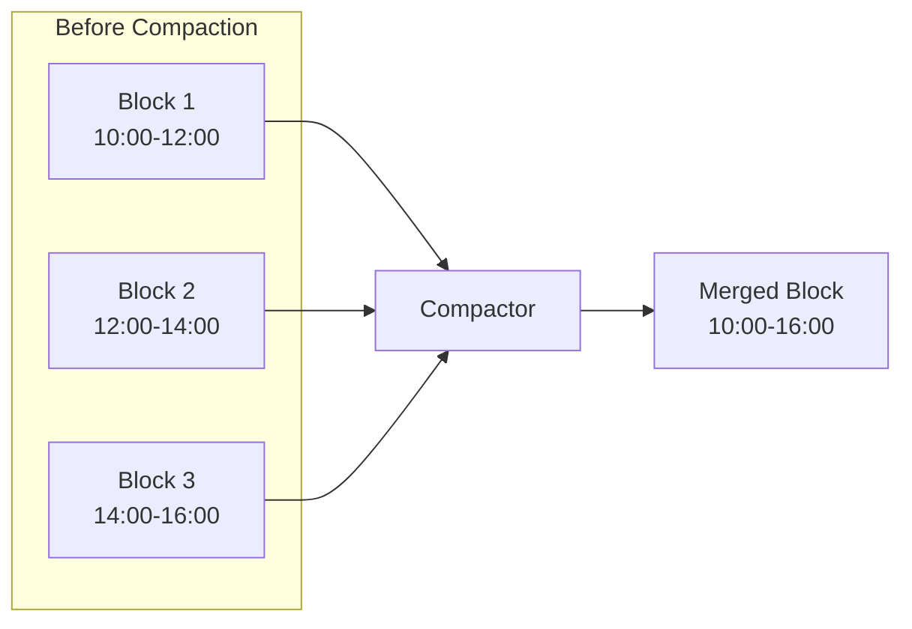
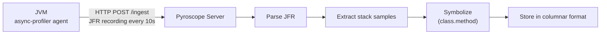
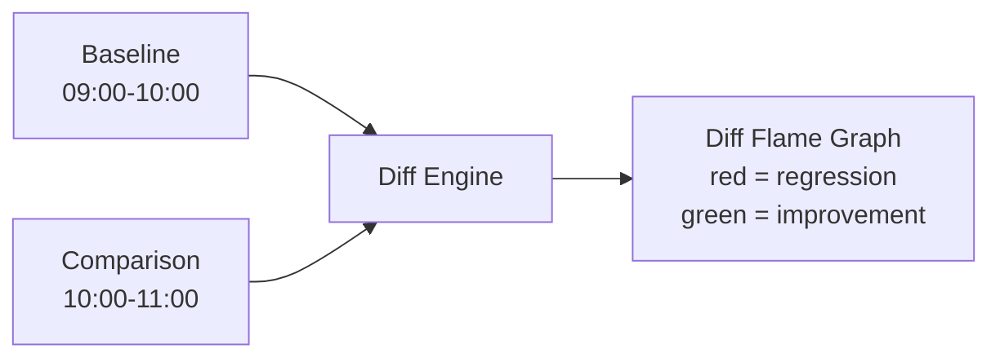
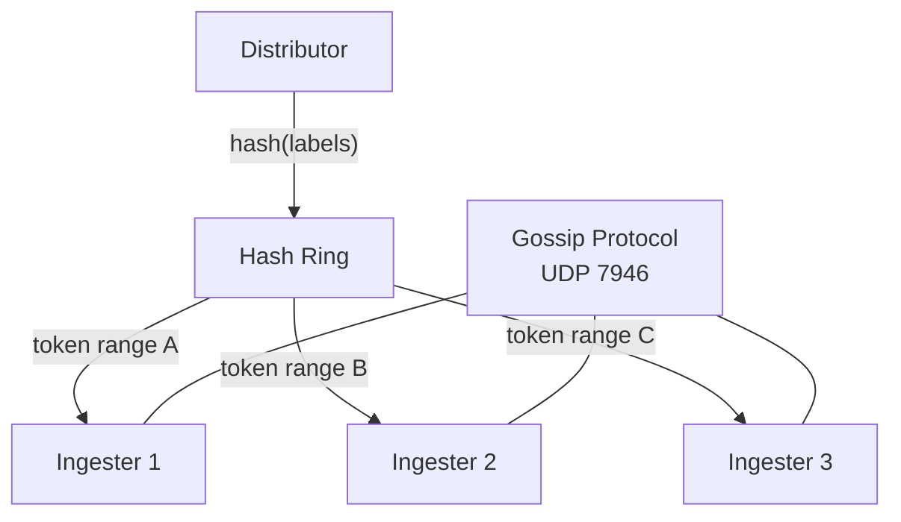
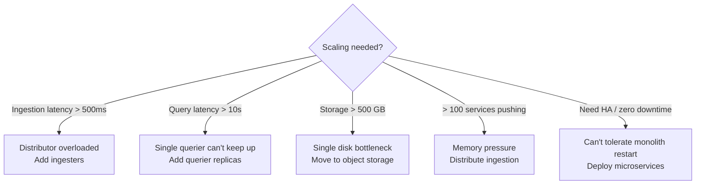

# Pyroscope Reference Guide

Expert mastery reference for becoming the organization's Pyroscope subject matter expert.
Target audience: the engineer who needs to sell this to leadership, support it in production,
and be the go-to person for all things profiling.

---

## Table of Contents

- **1. Pyroscope Internals** -- [Storage Engine](#storage-engine) | [Ingestion Pipeline](#ingestion-pipeline) | [Query Engine](#query-engine) | [Hash Ring](#hash-ring-microservices-mode)
- **2. Operational Expertise** -- [Capacity Planning](#capacity-planning) | [Scaling Triggers](#scaling-triggers) | [Failure Modes](#failure-modes-and-recovery) | [Retention](#retention-and-cleanup) | [Backup and Restore](#backup-and-restore)
- **3. Competitive Analysis** -- [vs Datadog](#pyroscope-vs-datadog-continuous-profiler) | [vs Elastic](#pyroscope-vs-elastic-universal-profiling) | [vs async-profiler standalone](#pyroscope-vs-async-profiler-standalone)
- **4. Talking Points** -- [Leadership](#for-leadership--funding-meetings) | [Security Review](#for-security-review) | [Architects](#for-architects) | [On-Call Engineers](#for-on-call-engineers)
- **5. Knowledge Areas Checklist** -- [Fundamentals](#fundamentals) | [Operations](#operations) | [Advanced](#advanced) | [Enterprise](#enterprise)
- **6. Recommended Study Path** -- [Study Path](#6-recommended-study-path)

---

# 1. Pyroscope Internals

## Storage Engine

Pyroscope's storage engine is based on Grafana Mimir's TSDB architecture, adapted for profiling data instead of time-series metrics. The core abstraction is the **block**.

### Block-based storage

Profiles are grouped into **2-hour blocks**. Each block is a self-contained unit on disk (or in object storage) containing three components:

| Component | Purpose |
|-----------|---------|
| **Index** | Maps label sets to profile series within the block |
| **Symbols table** | Deduplicated string table of class names, method names, and file paths |
| **Compressed profile data** | Columnar-encoded stack samples with timestamps |

A **series** is identified by its label set — the combination of application name, profile type, and any custom labels. For example:

```
{service_name="payment-service", __profile_type__="process_cpu", env="prod"}
```

### Compaction

Blocks are merged periodically by the **compactor** to reduce file count, reclaim space from deleted data, and apply retention policies. The compaction process:

1. Selects adjacent blocks that can be merged
2. Combines their indexes, symbols tables, and profile data
3. Drops data that exceeds the retention period
4. Writes a new, larger block and deletes the originals



In monolith mode, compaction runs as a background goroutine inside the single process. In microservices mode, a dedicated **compactor** component handles this work.

---

## Ingestion Pipeline

Profiling data flows from the agent running inside the JVM to the Pyroscope server via HTTP.



### Step by step

1. **Agent pushes JFR data** -- The Pyroscope Java agent uses async-profiler to record JFR (Java Flight Recorder) events. Every 10 seconds (configurable), it compresses the recording and sends it via `HTTP POST /ingest`.

2. **Server parses JFR recording** -- The server deserializes the JFR binary format, extracting stack trace samples, thread metadata, and timing information.

3. **Samples are symbolized** -- Raw addresses are resolved to human-readable `package.Class.method` strings using the symbols embedded in the JFR recording. These are stored in a deduplicated symbols table.

4. **Columnar storage** -- Symbolized samples are written to the current in-memory block in a columnar format optimized for aggregation queries (merging stack frames across time).

### Supported formats

| Format | Languages | Endpoint |
|--------|-----------|----------|
| **JFR** | Java | `POST /ingest` |
| **pprof** | Go, Python, Ruby | `POST /ingest` |
| **Connect API** | All (newer) | `push.v1.PusherService/Push` |

The Connect API (`push.v1.PusherService/Push`) is the newer gRPC/Connect-based ingestion endpoint used by updated agents and the Grafana Alloy collector.

---

## Query Engine

The query engine serves two primary operations: rendering flame graphs and computing diffs.

### Flame graph rendering

To produce a flame graph for a time range:

1. **Select blocks** that overlap the requested time window
2. **Filter series** by label matchers (e.g., `{service_name="payment-service"}`)
3. **Merge stack samples** across the time range — identical stack traces are summed
4. **Compute self and total time** for each function
5. **Return** the merged tree structure for rendering

### Label-based filtering

Queries use the same label selector syntax as PromQL:

```
{service_name="my-app"}                           # exact match
{service_name="my-app", env=~"prod|staging"}      # regex match
{service_name="my-app", instance!="worker-3"}     # negative match
```

### Profile types

Each profile type is stored as a separate series. The query must specify which type to retrieve:

| Profile Type | Metric Name | What It Measures |
|-------------|-------------|------------------|
| CPU | `process_cpu` | Functions consuming CPU cycles |
| Allocation | `memory:alloc:objects:count` | Where `new` objects are allocated |
| Mutex | `mutex:contentions:count` | Threads blocked on locks |
| Wall clock | `wall` | All threads regardless of state |
| Block | `block:contentions:count` | Threads blocked on I/O or sleep |
| Goroutine | `goroutine` | Go goroutine creation points |

### Diff queries

A diff query compares two time ranges to surface regressions or improvements:



The diff engine normalizes both flame graphs to the same total sample count, then computes per-function deltas. Positive deltas (regressions) appear red; negative deltas (improvements) appear green.

---

## Hash Ring (Microservices Mode)

In microservices mode, Pyroscope distributes ingestion across multiple **ingester** instances using a hash ring.



### How it works

1. **Consistent hashing** -- Each ingester registers tokens on a hash ring. An incoming profile's label set is hashed, and the profile is routed to the ingester that owns the corresponding token range.

2. **Memberlist gossip** -- Ring state is propagated using HashiCorp's [memberlist](https://github.com/hashicorp/memberlist) library, which uses UDP gossip on port **7946**. Ingesters announce their tokens and health status via this protocol.

3. **Replication factor** -- The replication factor (default **1**) controls how many ingesters receive a copy of each profile. Setting it to 3 provides fault tolerance at the cost of 3x storage.

4. **Rebalancing** -- When an ingester joins or leaves the ring, its token range is redistributed. The gossip protocol ensures all distributors converge on the new ring state within seconds.

### Microservices components

| Component | Role | Port |
|-----------|------|------|
| **Distributor** | Receives profiles, routes to ingesters via hash ring | 4040 |
| **Ingester** | Writes profiles to local block storage, registers on ring | 4040 |
| **Compactor** | Merges blocks, applies retention | 4040 |
| **Store-gateway** | Serves queries from long-term block storage | 4040 |
| **Querier** | Executes queries, merges results from ingesters + store-gateway | 4040 |
| **Query-frontend** | Request queue, splitting, caching for queries | 4040 |
| **Query-scheduler** | Distributes queries across querier pool | 4040 |
| **Overrides-exporter** | Exports per-tenant configuration overrides as metrics | 4040 |
| **Admin API** | Administrative endpoints | 4040 |

All components expose metrics on the same HTTP port (4040) but the gossip protocol uses a separate UDP port (7946).

---

# 2. Operational Expertise

## Capacity Planning

| Metric | Value | Notes |
|--------|-------|-------|
| Ingestion rate per JVM | ~100 samples/sec | Fixed by sampling frequency, independent of application load |
| Network per JVM | 10-50 KB per 10s push | Compressed JFR data; varies with stack depth and thread count |
| Storage per service per month | 1-5 GB (filesystem) | Less with object storage due to deduplication and compression |
| Server RAM | 2 GB for monolith (up to ~100 services) | Scale ingesters horizontally for more |
| Disk IOPS | Low | Sequential writes during ingestion, batch reads during queries |
| CPU (server) | 0.5-1 core for monolith | Ingestion parsing is the main CPU consumer |
| Agent overhead (JVM) | 3-8% CPU | All four profile types running simultaneously |

### Sizing example

For 50 Java services, each pushing profiles every 10 seconds:

- **Network ingress**: 50 services x 30 KB avg / 10s = ~150 KB/s sustained
- **Storage**: 50 x 3 GB/month avg = ~150 GB/month before compaction
- **Server resources**: 2 GB RAM, 1 CPU core, monolith mode

---

## Scaling Triggers

When to move from monolith to microservices mode:



| Trigger | Symptom | Resolution |
|---------|---------|------------|
| Ingestion latency > 500ms | Agents report push errors, data gaps | Move to microservices, scale ingesters horizontally |
| Query latency > 10s | Flame graphs slow to load, Grafana timeouts | Add querier replicas, enable query-frontend caching |
| Storage > 500 GB | Disk pressure alerts, compaction slows | Switch to object storage (S3, GCS, MinIO) |
| More than ~100 services | OOM kills, ingestion drops | Distribute across multiple ingesters |
| Need HA | Monolith downtime = no profiling | Deploy microservices with replication |

---

## Failure Modes and Recovery

| Failure | Impact | Recovery |
|---------|--------|----------|
| Pyroscope server down | Agents queue locally and retry (up to 8 retries with exponential backoff). No data loss for outages under ~2 minutes. Longer outages cause dropped profiles but no application impact. | Restart the container. Agents reconnect automatically. |
| Disk full | Ingestion stops. Existing data remains intact. Queries for historical data still work from already-compacted blocks. | Expand PVC or attached volume. Enable retention: `-compactor.blocks-retention-period=30d`. Delete old blocks manually if urgent: remove oldest `01*` directories from data path. |
| Ingester crash (microservices) | Hash ring rebalances within seconds. Brief gap in data for the token range owned by the crashed ingester. No impact on queries for previously compacted data. | Pod reschedules automatically (K8s/OCP). Ring reconverges via gossip. No manual intervention needed. |
| Query timeout | Flame graph fails to render. No data loss. Usually caused by wide time range or high-cardinality label query. | Narrow the query time range. Increase `query-frontend.timeout`. Add querier replicas for sustained load. |
| Agent crash | No profiling data collected for that JVM. No application impact -- the agent runs in a separate thread and its crash does not affect the host JVM. | Agent restarts with the JVM (attached via `-javaagent`). If the JVM is still running, the agent can be re-attached with `jcmd`. |
| Network partition (microservices) | Gossip protocol detects unreachable members. Distributor stops routing to unreachable ingesters. Partial data loss for the partition duration. | Resolve network issue. Ring reconverges automatically. |
| Object storage unavailable | Compactor cannot upload blocks. Queriers cannot read historical data. Recent data in ingesters still queryable. | Restore object storage access. Compactor retries automatically. |

---

## Retention and Cleanup

By default, Pyroscope applies **no retention** -- data grows indefinitely until disk is full.

### Configuring retention

| Mode | Configuration |
|------|---------------|
| **Monolith** | Add to `pyroscope.yaml`: `compactor: { blocks_retention_period: 30d }` |
| **Microservices** | Set in ConfigMap: `-compactor.blocks-retention-period=30d` |
| **CLI flag** | `-compactor.blocks-retention-period=30d` |

Retention is applied during compaction. After changing the retention period, data beyond the window is deleted at the next compaction cycle (typically within 2 hours).

### Manual cleanup

If disk space is critical before compaction runs:

```bash
# List blocks sorted by age (oldest first)
ls -lt /data/pyroscope/ | tail -20

# Remove blocks older than desired retention
# Each block directory is named with a ULID timestamp
```

---

## Backup and Restore

### Monolith (filesystem storage)

```bash
# Backup: tar the data directory while Pyroscope is stopped (consistent snapshot)
docker stop pyroscope
docker run --rm \
  -v pyroscope-data:/data:ro \
  -v /tmp:/backup \
  alpine tar czf /backup/pyroscope-backup.tar.gz -C /data .
docker start pyroscope

# Restore: extract into the data volume
docker stop pyroscope
docker run --rm \
  -v pyroscope-data:/data \
  -v /tmp:/backup \
  alpine sh -c "rm -rf /data/* && tar xzf /backup/pyroscope-backup.tar.gz -C /data"
docker start pyroscope
```

For a running backup (slightly less consistent but avoids downtime):

```bash
docker run --rm \
  -v pyroscope-data:/data:ro \
  -v /tmp:/backup \
  alpine tar czf /backup/pyroscope-backup.tar.gz -C /data .
```

### Microservices with object storage

Object storage (S3, GCS, MinIO) provides its own durability guarantees. Backups are typically unnecessary but can be achieved via:

- **Bucket versioning** -- enable on the object storage bucket
- **Cross-region replication** -- for disaster recovery
- **Bucket snapshots** -- provider-specific snapshot tools

### Kubernetes PVC snapshots

If supported by your storage class:

```bash
# Create a VolumeSnapshot
kubectl apply -f - <<EOF
apiVersion: snapshot.storage.k8s.io/v1
kind: VolumeSnapshot
metadata:
  name: pyroscope-backup-$(date +%Y%m%d)
spec:
  volumeSnapshotClassName: csi-snapclass
  source:
    persistentVolumeClaimName: pyroscope-data
EOF
```

---

# 3. Competitive Analysis

## Pyroscope vs Datadog Continuous Profiler

| Aspect | Pyroscope | Datadog |
|--------|-----------|---------|
| **License** | AGPL-3.0 (free, self-hosted) | Commercial ($15-35/host/month) |
| **Languages** | Java, Go, Python, Ruby, .NET, Node.js, Rust, eBPF | Java, Python, Go, .NET, Ruby, PHP |
| **Deployment** | Self-hosted or Grafana Cloud | SaaS only |
| **Data ownership** | Your infrastructure, your data | Datadog's cloud |
| **Integration** | Grafana native (same pane as metrics/logs/traces) | Datadog platform (APM, logs, metrics) |
| **Profile types** | CPU, alloc, mutex, wall, block, goroutine | CPU, wall, alloc, heap, mutex |
| **Agent overhead** | 3-8% (all profile types enabled) | 2-5% (CPU only by default) |
| **Retention** | Configurable, unlimited by default | 14 days (standard), 30 days (enterprise) |
| **Air-gapped** | Yes (self-hosted, no external dependencies) | No (requires Datadog SaaS connectivity) |

**When Pyroscope wins**: Cost-sensitive environments, data sovereignty requirements, air-gapped networks, existing Grafana investment, need for extended retention.

**When Datadog wins**: Already all-in on Datadog platform, need managed SaaS with zero ops, need correlated APM traces + profiles in one UI.

---

## Pyroscope vs Elastic Universal Profiling

| Aspect | Pyroscope | Elastic |
|--------|-----------|---------|
| **Approach** | Language-specific agents (JFR for Java) | eBPF-based (kernel-level, all languages) |
| **Overhead** | 3-8% (full profiling: CPU, alloc, mutex, wall) | <1% (eBPF sampling, CPU only) |
| **Detail level** | Function + line number, allocation tracking, lock contention | Function only (no line numbers for interpreted languages) |
| **Profile types** | CPU, alloc, mutex, wall, block | CPU only (eBPF-based) |
| **Deployment** | Agent per JVM (JAR) + Pyroscope server | Host agent (eBPF) + Elastic backend |
| **Kernel requirement** | None (userspace JFR) | Linux kernel 4.19+ with eBPF support |
| **License** | AGPL-3.0 | Elastic License 2.0 (not OSS) |
| **Container support** | Works in any container runtime | Requires privileged or CAP_BPF containers |

**When Pyroscope wins**: Need allocation/mutex/wall profiling (not just CPU), need line-level detail, run on older kernels, need true open-source license, restricted container environments.

**When Elastic wins**: Polyglot environment where you cannot instrument each language separately, need lowest possible overhead, already invested in Elastic stack, want kernel-level visibility.

---

## Pyroscope vs async-profiler (Standalone)

| Aspect | Pyroscope | async-profiler alone |
|--------|-----------|----------------------|
| **Always-on** | Yes -- continuous, 24/7 in production | No -- attach manually, run for a session, detach |
| **Historical data** | Yes -- time-series storage with configurable retention | No -- produces a single snapshot per session |
| **Multi-service** | Yes -- all JVMs push to one server, query any service | No -- per-JVM tool, manage output files manually |
| **UI** | Grafana + built-in Pyroscope UI | CLI output or standalone HTML file |
| **Diff analysis** | Yes -- compare any two time windows in the UI | Manual -- run two sessions, diff the outputs |
| **Overhead** | Same (Pyroscope uses async-profiler internally) | Same |
| **Setup** | Agent JAR + server deployment | Single JAR, no server needed |

**When Pyroscope wins**: Production monitoring, incident retrospection (data was captured before the incident), fleet-wide visibility, team collaboration via shared UI.

**When async-profiler wins**: One-off local debugging, development-time profiling, environments where you cannot deploy a server, quick ad-hoc investigation on a single JVM.

---

# 4. Talking Points for Internal Advocacy

## For Leadership / Funding Meetings

1. **"We can reduce MTTR from 30-90 minutes to 5-15 minutes for performance incidents."**
   Without profiling, the performance investigation loop is: check metrics, guess the cause, add logging, redeploy, wait for recurrence. With continuous profiling, the data from the incident window is already captured — open the flame graph and the bottleneck is visible in seconds.

2. **"Zero licensing cost — Pyroscope is open source (AGPL-3.0). Compare to $X/month for Datadog profiling."**
   For 50 hosts at $25/host/month, that is $15,000/year saved. The infrastructure cost for self-hosted Pyroscope is a single VM (2 GB RAM, 2 cores) for up to 100 services.

3. **"No code changes required — the agent attaches via an environment variable."**
   Add `JAVA_TOOL_OPTIONS="-javaagent:pyroscope.jar"` to the deployment manifest. No recompilation, no dependency changes, no code review needed.

4. **"Data exists before the incident — no reproduction step, no attaching debuggers in production."**
   This is the key differentiator of continuous profiling. When PagerDuty fires at 3am, the flame graph for that exact time window is already in the system.

5. **"3-8% CPU overhead is bounded and does not increase with load."**
   The overhead is a function of sampling frequency (fixed at ~100 Hz), not request rate. A service handling 100 req/s has the same profiling overhead as one handling 10,000 req/s.

---

## For Security Review

1. **"Agent runs inside the JVM process — no external network listeners added to the application."**
   The agent makes outbound HTTP connections to the Pyroscope server. It does not open any listening ports on the application container.

2. **"Profiling data contains function names and stack traces, not request payloads or PII."**
   The data is: `com.example.PaymentService.processPayment` consumed 12% CPU. It does not contain method arguments, return values, request bodies, database query results, or any business data.

3. **"FIPS-compliant builds are possible using Go BoringCrypto or Red Hat Go Toolset."**
   Pyroscope is written in Go. FIPS-validated TLS can be achieved by building with `GOEXPERIMENT=boringcrypto` or using Red Hat's FIPS-certified Go toolchain.

4. **"All traffic between agent and server is standard HTTP — can be encrypted with TLS."**
   Configure the agent with `PYROSCOPE_SERVER_ADDRESS=https://pyroscope.example.com`. TLS termination can happen at the server, a reverse proxy, or an ingress controller.

5. **"NetworkPolicy restricts who can query the profiling data."**
   In Kubernetes/OpenShift, apply a NetworkPolicy that allows ingress to port 4040 only from authorized namespaces or pods.

---

## For Architects

1. **"Pyroscope uses the same architecture as Grafana Mimir — battle-tested at scale."**
   Mimir handles billions of active time series at Grafana Labs. Pyroscope inherits the same block-based storage, hash ring distribution, and query-frontend architecture.

2. **"Monolith mode handles up to ~100 services on a single VM."**
   A 2 GB RAM, 2 core VM is sufficient. No distributed coordination, no object storage, no shared storage — a single Docker container.

3. **"Microservices mode scales horizontally — add ingesters for more ingestion, queriers for more queries."**
   Each component scales independently. Ingestion bottleneck? Add ingesters. Query bottleneck? Add queriers. Storage bottleneck? Switch to object storage.

4. **"Storage is block-based with configurable retention — no unbounded growth."**
   Set `-compactor.blocks-retention-period=30d` and storage is bounded. Compaction runs automatically.

5. **"Integrates natively with Grafana — same pane of glass as metrics and logs."**
   Pyroscope is a first-class Grafana data source. Flame graphs appear alongside Prometheus metrics, Loki logs, and Tempo traces in the same dashboard.

---

## For On-Call Engineers

1. **"Run `bash scripts/bottleneck.sh` — it tells you which function is the problem in 30 seconds."**
   The script queries Pyroscope for the affected service and time window, extracts the top CPU consumers, and outputs a ranked list.

2. **"Open the flame graph for the affected service and time window — the widest bar is the bottleneck."**
   In Grafana: select the service, select the profile type (usually CPU), set the time range to the incident window, and look for the widest plateau at the top of the flame graph.

3. **"Compare before/after flame graphs to verify your fix worked."**
   Use the diff view: set the baseline to the incident window and the comparison to after your fix was deployed. Green bars confirm the regression is resolved.

4. **"No need to reproduce the issue — the profiling data from the incident window is already captured."**
   Continuous profiling means every second of production execution is recorded. Go back to any time window and see exactly what the JVM was doing.

---

# 5. Knowledge Areas Checklist

Self-assessment: can you answer these questions confidently? Use this checklist to identify gaps in your expertise.

## Fundamentals

- [ ] What is a flame graph and how do you read one? (see [reading-flame-graphs.md](reading-flame-graphs.md))
- [ ] What are the 4 primary profile types (CPU, alloc, mutex, wall) and when do you use each?
- [ ] How does async-profiler work (JVMTI, AsyncGetCallTrace, perf_events)?
- [ ] What is the difference between self time and total time?
- [ ] How does the agent push data to the server (HTTP POST, JFR format, 10s interval)?

## Operations

- [ ] How do you deploy Pyroscope in monolith mode on a VM? (see [deployment-guide.md](deployment-guide.md))
- [ ] How do you deploy Pyroscope in microservices mode on OCP?
- [ ] What are the firewall rules needed? (TCP 4040 for monolith, + UDP 7946 + TCP 9095 for microservices)
- [ ] How do you troubleshoot "no data in UI"? (agent connectivity, profile type selection, time range, label mismatch)
- [ ] How do you backup and restore Pyroscope data?
- [ ] When should you move from monolith to microservices mode?

## Advanced

- [ ] How does the hash ring work for profile routing in microservices mode?
- [ ] What is the compaction process and why does it matter?
- [ ] How would you build a FIPS-compliant Pyroscope image?
- [ ] How would you integrate Pyroscope into a CI/CD pipeline for regression detection?
- [ ] How does Pyroscope compare to Datadog profiling, and what are the tradeoffs?

## Enterprise

- [ ] Can you present the business case for Pyroscope to leadership?
- [ ] Can you estimate the cost (infrastructure resources) for your deployment?
- [ ] Can you explain the security posture (data sensitivity, network exposure, FIPS)?
- [ ] Can you demonstrate a live incident triage using flame graphs?

---

# 6. Recommended Study Path

Progress through these in order. Each builds on the previous.

| Step | Resource | What You Learn |
|------|----------|----------------|
| 1 | [reading-flame-graphs.md](reading-flame-graphs.md) | How to read the core visualization |
| 2 | `bash scripts/run.sh` | See profiling in action on the demo app |
| 3 | [continuous-profiling-runbook.md](continuous-profiling-runbook.md) | Deployment, agent configuration, Grafana integration |
| 4 | [deployment-guide.md](deployment-guide.md) | All deployment options (monolith, microservices, VM, K8s, OCP) |
| 5 | [profiling-scenarios.md](profiling-scenarios.md) | Hands-on exercises identifying real bottlenecks |
| 6 | [Grafana Pyroscope docs](https://grafana.com/docs/pyroscope/latest/) | Official upstream documentation |
| 7 | [Pyroscope source code](https://github.com/grafana/pyroscope) | Focus on `pkg/ingester`, `pkg/querier`, `pkg/distributor` |
| 8 | Practice presenting | Use the talking points in Section 4 to explain Pyroscope to a non-technical audience |

### Suggested timeline

| Week | Focus |
|------|-------|
| Week 1 | Steps 1-2: fundamentals and demo |
| Week 2 | Steps 3-4: deployment and operations |
| Week 3 | Steps 5-6: hands-on scenarios and upstream docs |
| Week 4 | Steps 7-8: source code deep dive and presentation practice |

After completing this path, you should be able to confidently answer every question in the checklist above and present Pyroscope to any audience — from on-call engineers to executive leadership.
