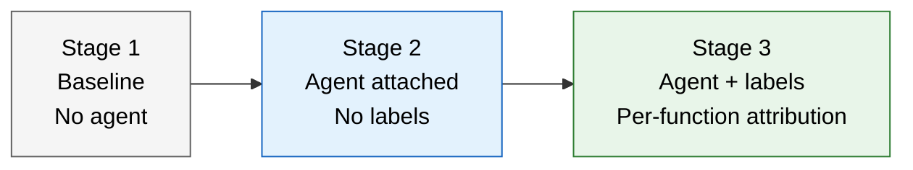

# Enterprise Testing Strategy — Continuous Profiling

Testing strategy for validating Pyroscope continuous profiling across three adoption
stages: baseline (no agent), agent without labels, and agent with labels. Each stage
has acceptance criteria that must pass before proceeding.

Target audience: platform engineers, QA leads, SREs, and Change Advisory Board reviewers.

---

## Table of Contents

- [1. Testing stages overview](#1-testing-stages-overview)
- [2. Stage 1: Baseline (before Pyroscope)](#2-stage-1-baseline-before-pyroscope)
- [3. Stage 2: Agent attached, no labels](#3-stage-2-agent-attached-no-labels)
- [4. Stage 3: Agent attached, with labels](#4-stage-3-agent-attached-with-labels)
- [5. Performance overhead validation](#5-performance-overhead-validation)
- [6. Comparison matrix](#6-comparison-matrix)
- [7. Test execution checklist](#7-test-execution-checklist)
- [8. Go/no-go criteria by stage](#8-gono-go-criteria-by-stage)
- [9. Rollback triggers](#9-rollback-triggers)
- [10. Cross-references](#10-cross-references)

---

## 1. Testing stages overview

Pyroscope adoption follows three distinct stages. Each stage adds capability but also
adds a component that must be validated before moving to the next.



| Stage | What changes | What you gain | What you test |
|-------|-------------|---------------|---------------|
| **Stage 1: Baseline** | Nothing — current production state | Baseline metrics for comparison | Application performance without profiling overhead |
| **Stage 2: Agent, no labels** | `JAVA_TOOL_OPTIONS="-javaagent:pyroscope.jar"` added | CPU, alloc, mutex, wall flame graphs per JVM | Overhead impact, data ingestion, flame graph visibility |
| **Stage 3: Agent + labels** | Profiling labels added (e.g., `function=SubmitPayment.v1`) | Per-function flame graphs on shared reactive servers | Label propagation, cardinality, per-function attribution accuracy |

---

## 2. Stage 1: Baseline (before Pyroscope)

### Purpose

Establish quantitative performance baselines **before** any profiling agent is
attached. Without this baseline, you cannot measure the overhead introduced by
Pyroscope or prove that profiling is safe for production.

### What to capture

| Metric | Source | How to capture |
|--------|--------|----------------|
| **CPU utilization** (p50, p95, p99) | Prometheus / Dynatrace | Record per-pod CPU over a representative load period (minimum 1 hour during peak) |
| **Memory utilization** (heap + non-heap) | JMX / Prometheus / Dynatrace | Record JVM heap used, committed, and max; non-heap (metaspace, code cache) |
| **Request latency** (p50, p95, p99) | Prometheus histograms / Dynatrace | Per-service latency distribution during the same load period |
| **Throughput** (req/sec) | Prometheus counters / Dynatrace | Aggregate and per-service request rates |
| **GC pause frequency and duration** | JMX GC metrics / GC logs | GC count, total pause time, max pause time over the test period |
| **Thread count** | JMX / Prometheus | Active threads, peak threads, daemon threads |
| **Error rate** | Application metrics / Dynatrace | HTTP 5xx rate, exception count |
| **Network I/O** | Node exporter / Dynatrace | Bytes sent/received per pod |

### Baseline test procedure

1. **Select test targets:** Choose 3-5 representative services covering different
   workload types (CPU-intensive, I/O-heavy, memory-intensive, mixed).

2. **Define load profile:** Use production traffic patterns or a load generator
   that replicates production. The load must be consistent and repeatable.

3. **Run baseline test (minimum 1 hour during peak):**
   ```bash
   # Record start time
   BASELINE_START=$(date -u +%Y-%m-%dT%H:%M:%SZ)

   # Run load generator (or observe production traffic)
   # ... wait for test duration ...

   BASELINE_END=$(date -u +%Y-%m-%dT%H:%M:%SZ)
   ```

4. **Export baseline metrics:**
   ```bash
   # Prometheus query examples for baseline capture
   # CPU: rate(process_cpu_seconds_total[5m])
   # Heap: jvm_memory_used_bytes{area="heap"}
   # Latency: histogram_quantile(0.99, rate(http_request_duration_seconds_bucket[5m]))
   # Throughput: rate(http_requests_total[5m])
   # GC: rate(jvm_gc_pause_seconds_sum[5m])
   ```

5. **Save baseline results** in a spreadsheet or dashboard snapshot. These numbers
   are the comparison target for Stage 2 and Stage 3.

### Acceptance criteria

- [ ] Baseline metrics captured for all selected services
- [ ] Load profile documented and repeatable
- [ ] Results saved in a format accessible to the team (dashboard snapshot, CSV, or Confluence page)
- [ ] Baseline covers at least one peak traffic period

---

## 3. Stage 2: Agent attached, no labels

### Purpose

Validate that the Pyroscope agent operates correctly and that the overhead is
within acceptable bounds. At this stage, flame graphs show all functions merged
per JVM — you can see **what the JVM is doing** but cannot attribute CPU/memory
to individual business functions on shared reactive servers.

### What changes

```yaml
# Add to deployment manifest (Kubernetes example)
env:
  - name: JAVA_TOOL_OPTIONS
    value: "-javaagent:/opt/pyroscope/pyroscope.jar"
  - name: PYROSCOPE_SERVER_ADDRESS
    value: "http://pyroscope.internal:4040"
  - name: PYROSCOPE_APPLICATION_NAME
    value: "my-service"
```

No application code changes. No recompilation. The agent attaches at JVM startup.

### Test matrix

| Test | Method | Pass criteria |
|------|--------|---------------|
| **Agent starts successfully** | Check agent logs for `PyroscopeAgent - starting profiling...` | Log message present within 30s of JVM start |
| **Profiles reach server** | Query `curl -s "http://pyroscope:4040/pyroscope/label-values?label=service_name"` | Service name appears in response |
| **Flame graph renders** | Open Grafana, select service, select CPU profile type, last 15 minutes | Non-empty flame graph with recognizable class/method names |
| **All 4 profile types work** | Switch profile type: CPU, alloc, mutex, wall | Each produces a non-empty flame graph |
| **CPU overhead** | Compare `rate(process_cpu_seconds_total[5m])` against Stage 1 baseline | Delta is **< 8%** (expected 3-5%) |
| **Memory overhead** | Compare JVM non-heap memory against Stage 1 baseline | Delta is **< 50 MB** (expected 20-40 MB) |
| **Latency impact** | Compare p99 latency against Stage 1 baseline | Delta is **< 5%** at p99 |
| **Throughput impact** | Compare req/sec against Stage 1 baseline | Delta is **< 2%** |
| **GC impact** | Compare GC pause frequency and duration against Stage 1 baseline | No significant increase (< 10% more GC time) |
| **Error rate** | Compare HTTP 5xx and exception count against Stage 1 baseline | No increase in error rate |
| **Agent crash resilience** | Kill the Pyroscope server, observe application behavior | Application continues normally; agent logs retries; no app errors |
| **Network traffic** | Measure additional network from agent pushes | **< 50 KB per 10s push** per JVM |

### What you can see (and what you cannot)

| Capability | Available? | Example |
|------------|:----------:|---------|
| CPU flame graph per JVM | Yes | "payment-service JVM uses 40% CPU in `JsonParser.parse()`" |
| Memory allocation flame graph | Yes | "fraud-service allocates 800 MB/min in `buildPDF()`" |
| Lock contention flame graph | Yes | "pricing-service has 200 threads blocked on `getConnection()`" |
| Wall-clock flame graph | Yes | "gateway waits 2.1s in `postTransaction()`" |
| **Per-function attribution** | **No** | Cannot distinguish `SubmitPayment.v1` from `GetBalance.v2` on the same Vert.x event loop |
| **Flame graph diff** | Yes | Compare pre-deploy vs post-deploy for the whole JVM |
| Historical query | Yes | "Show me what this JVM was doing at 3am last Tuesday" |

### Overhead comparison template

Record these numbers during the Stage 2 test and compare against Stage 1:

| Metric | Stage 1 (baseline) | Stage 2 (agent, no labels) | Delta | Within budget? |
|--------|:------------------:|:--------------------------:|:-----:|:--------------:|
| CPU p50 | ___ | ___ | ___% | < 8% |
| CPU p95 | ___ | ___ | ___% | < 8% |
| Heap used (avg) | ___ MB | ___ MB | ___ MB | < 50 MB non-heap |
| Latency p50 | ___ ms | ___ ms | ___% | < 5% |
| Latency p99 | ___ ms | ___ ms | ___% | < 5% |
| Throughput | ___ req/s | ___ req/s | ___% | < 2% drop |
| GC pause total | ___ ms/min | ___ ms/min | ___% | < 10% |
| Error rate | ___% | ___% | ___ | No increase |

### Acceptance criteria

- [ ] Agent starts and pushes profiles to server
- [ ] All 4 profile types produce non-empty flame graphs
- [ ] CPU overhead < 8% vs baseline
- [ ] Memory overhead < 50 MB vs baseline
- [ ] p99 latency impact < 5% vs baseline
- [ ] No increase in error rate
- [ ] Application unaffected when Pyroscope server is unavailable
- [ ] Overhead comparison template filled out and saved

---

## 4. Stage 3: Agent attached, with labels

### Purpose

Validate that profiling labels correctly attribute CPU, memory, lock, and I/O
consumption to individual business functions running on shared reactive server
threads (Vert.x, Spring WebFlux). This is the stage where profiling becomes
**actionable at the function level**.

### What changes

Labels are set in application code (or via a shared handler) at the entry point
of each business function:

```java
// Example: Vert.x handler sets a profiling label per function
router.route("/api/:function/*").handler(ctx -> {
    String functionName = ctx.pathParam("function");
    Pyroscope.LabelsWrapper.run(
        new LabelsSet("function", functionName),
        () -> ctx.next()
    );
});
```

For implementation approaches, see [vertx-labeling-guide.md](vertx-labeling-guide.md).

### Test matrix

| Test | Method | Pass criteria |
|------|--------|---------------|
| **Labels appear in Pyroscope** | Query `curl -s "http://pyroscope:4040/pyroscope/label-values?label=function"` | Function names appear in response |
| **Per-function flame graph** | Filter by `{service_name="my-service", function="SubmitPayment.v1"}` | Flame graph shows only SubmitPayment execution path |
| **Multiple functions distinguishable** | Filter by different function names, compare flame graphs | Each function shows a distinct execution profile |
| **Label cardinality** | Count unique label values: `curl -s ".../label-values?label=function" \| jq length` | Cardinality matches expected function count (not unbounded) |
| **Synchronous code coverage** | Profile a function with synchronous processing | Label covers the full synchronous call stack |
| **Async gap awareness** | Profile a function that uses `executeBlocking` or `CompletableFuture` | Understand and document where labels are lost on async boundaries (see [async-profiling-guide.md](async-profiling-guide.md)) |
| **CPU overhead (labels)** | Compare CPU against Stage 2 baseline | Additional delta from labels is **< 1%** |
| **Memory overhead (labels)** | Compare memory against Stage 2 baseline | Negligible additional overhead |
| **Diff with labels** | Deploy a code change, use flame graph diff filtered by function | Regression visible in the specific function that changed |
| **No label leakage** | Check that labels don't persist across requests on the same event loop thread | Filter by function A, verify function B's code does not appear |

### What you gain over Stage 2

| Capability | Stage 2 (no labels) | Stage 3 (with labels) |
|------------|:-------------------:|:---------------------:|
| "Which function uses the most CPU?" | Impossible on shared threads | Filter by `{function="X"}` — instant answer |
| "Did my deploy regress a specific function?" | Diff shows whole JVM | Diff filtered by function — precise regression |
| "Which function allocates the most memory?" | Merged across all functions | Per-function allocation flame graph |
| "Which function holds locks?" | Merged across all functions | Per-function lock contention flame graph |
| Alert on per-function CPU | Not possible | Possible with Grafana alerting on label-filtered queries |

### Overhead comparison template (Stage 2 vs Stage 3)

| Metric | Stage 2 (no labels) | Stage 3 (with labels) | Delta | Within budget? |
|--------|:-------------------:|:---------------------:|:-----:|:--------------:|
| CPU p50 | ___ | ___ | ___% | < 1% additional |
| CPU p95 | ___ | ___ | ___% | < 1% additional |
| Heap used (avg) | ___ MB | ___ MB | ___ MB | Negligible |
| Latency p99 | ___ ms | ___ ms | ___% | < 1% additional |
| Active series count | ___ | ___ | ___ | Within cardinality budget |

### Label cardinality guidelines

| Metric | Guideline | Risk if exceeded |
|--------|-----------|-----------------|
| Unique label values per key | < 500 | High cardinality increases storage and query cost |
| Total active series | < 10,000 | Ingester memory pressure; slow queries |
| Labels per profile | 1-3 keys (e.g., `function`, `env`) | More keys = exponential series growth |

**Warning:** Do not use request IDs, user IDs, timestamps, or any high-cardinality
value as a profiling label. Labels should identify **function types**, not individual
requests.

### Acceptance criteria

- [ ] Function names appear as label values in Pyroscope
- [ ] Per-function flame graphs render correctly for at least 3 different functions
- [ ] Functions are visually distinguishable in their flame graph profiles
- [ ] Label cardinality is bounded and within guidelines
- [ ] Additional CPU overhead from labels is < 1% over Stage 2
- [ ] No label leakage across requests on shared event loop threads
- [ ] Flame graph diff works with label filtering
- [ ] Async boundaries documented (where labels are and are not propagated)
- [ ] Overhead comparison template (Stage 2 vs Stage 3) filled out and saved

---

## 5. Performance overhead validation

### Three-stage comparison

This is the key deliverable for the Change Advisory Board. It demonstrates that
profiling overhead is bounded and acceptable at each stage.

| Metric | Stage 1 (baseline) | Stage 2 (agent) | Stage 3 (labels) | Total overhead |
|--------|:------------------:|:----------------:|:-----------------:|:--------------:|
| CPU p50 | ___ | ___ (+___%) | ___ (+___%) | ___% |
| CPU p99 | ___ | ___ (+___%) | ___ (+___%) | ___% |
| Memory (non-heap) | ___ MB | ___ MB (+___) | ___ MB (+___) | ___ MB |
| Latency p50 | ___ ms | ___ ms (+___%) | ___ ms (+___%) | ___% |
| Latency p99 | ___ ms | ___ ms (+___%) | ___ ms (+___%) | ___% |
| Throughput | ___ req/s | ___ req/s (-___%) | ___ req/s (-___%) | ___% drop |
| GC pause total | ___ ms/min | ___ ms/min (+___%) | ___ ms/min (+___%) | ___% |
| Error rate | ___% | ___% | ___% | No increase |

**Expected totals based on production benchmarks:**

| Metric | Expected total overhead | Source |
|--------|:----------------------:|--------|
| CPU | 3-8% | async-profiler JMH benchmarks at 10ms sample interval |
| Memory | 20-40 MB non-heap | Pyroscope agent circular buffer (fixed-size) |
| Latency | < 5% at p99 | Production measurements across enterprise deployments |
| Throughput | < 2% reduction | Overhead is per-sample, not per-request |
| Labels (incremental) | < 1% additional CPU | Label set/clear is a thread-local operation |

### Load test requirements

| Requirement | Minimum |
|-------------|---------|
| Test duration | 1 hour during representative load |
| Load consistency | Same load profile across all 3 stages |
| Services tested | 3-5 representative services |
| Profile types enabled | All 4: CPU, alloc, mutex, wall |
| Metric collection interval | 15s or finer |
| Statistical significance | Compare averages and percentiles, not single samples |

---

## 6. Comparison matrix

### Capability progression across stages

| Capability | Stage 1 (no Pyroscope) | Stage 2 (agent, no labels) | Stage 3 (agent + labels) |
|------------|:----------------------:|:--------------------------:|:------------------------:|
| Know CPU is high | Metrics (Dynatrace/Prometheus) | Metrics + flame graph showing which methods | Metrics + flame graph per function |
| Know which method is slow | No | Yes (JVM-wide) | Yes (per business function) |
| Know memory allocation hotspots | No | Yes (JVM-wide) | Yes (per business function) |
| Know lock contention sources | Thread dumps (manual) | Yes (JVM-wide) | Yes (per business function) |
| Compare before/after deploy | Metrics only | Flame graph diff (JVM-wide) | Flame graph diff (per function) |
| Historical investigation | Metrics + logs | Flame graphs for any past time window | Per-function flame graphs for any past time window |
| Alert on function-level CPU | No | No | Yes |
| MTTR for performance incidents | 60-120 min | 15-30 min | 5-15 min |
| Requires code changes | — | No | Yes (label handler) |
| Requires recompilation | — | No | Depends on approach (see [vertx-labeling-guide.md](vertx-labeling-guide.md)) |

### Value delivered at each stage

| Stage | Annual value estimate | Basis |
|-------|:--------------------:|-------|
| Stage 1 (baseline only) | $0 | No new capability |
| Stage 2 (agent, no labels) | $800,000-1,500,000 | MTTR reduction + infrastructure optimization + deployment safety (JVM-level) |
| Stage 3 (agent + labels) | $1,400,000-2,500,000 | All Stage 2 benefits + per-function attribution + developer productivity (see [value-proposition.md](value-proposition.md)) |

---

## 7. Test execution checklist

### Before testing

- [ ] Pyroscope server deployed and accessible (see [deployment-guide.md](deployment-guide.md))
- [ ] Grafana connected to Pyroscope data source (see [grafana-setup.md](grafana-setup.md))
- [ ] Pyroscope agent JAR available in container image or volume mount
- [ ] Load generator configured with repeatable load profile
- [ ] Monitoring dashboards set up to capture baseline and comparison metrics
- [ ] Rollback plan documented (see [templates/rollback-plan.md](templates/rollback-plan.md))

### Stage 1 execution

- [ ] Run load test against unmodified services (1 hour minimum)
- [ ] Export and save baseline metrics
- [ ] Verify load profile is documented and repeatable
- [ ] **Gate: Stage 1 acceptance criteria met**

### Stage 2 execution

- [ ] Add `JAVA_TOOL_OPTIONS` to deployment manifest for test services
- [ ] Deploy with agent attached (no labels)
- [ ] Verify agent startup in logs
- [ ] Verify profiles appear in Pyroscope UI
- [ ] Run identical load test (same duration, same load profile)
- [ ] Record overhead metrics in comparison template
- [ ] Test server unavailability — confirm application is unaffected
- [ ] **Gate: Stage 2 acceptance criteria met**

### Stage 3 execution

- [ ] Implement labeling approach (see [vertx-labeling-guide.md](vertx-labeling-guide.md))
- [ ] Deploy with labels enabled
- [ ] Verify function names appear as label values
- [ ] Run identical load test (same duration, same load profile)
- [ ] Record overhead metrics in comparison template
- [ ] Verify per-function flame graphs render correctly
- [ ] Test flame graph diff with label filtering
- [ ] Verify label cardinality is within budget
- [ ] Test for label leakage across requests
- [ ] **Gate: Stage 3 acceptance criteria met**

---

## 8. Go/no-go criteria by stage

### Stage 2 go/no-go

| Criterion | Threshold | Measurement |
|-----------|-----------|-------------|
| Agent attaches successfully | 100% of test services | Agent log messages |
| Profiles reach server | 100% of test services | label-values API |
| CPU overhead | < 8% vs Stage 1 | Prometheus/Dynatrace comparison |
| Latency impact | < 5% at p99 vs Stage 1 | Prometheus histograms |
| Error rate | No increase | Application metrics |
| Application resilience | Unaffected by server outage | Manual server stop test |

**Go:** All criteria met → proceed to Stage 3 (or production rollout without labels).
**No-go:** Any criterion failed → investigate, adjust agent config, retest.

### Stage 3 go/no-go

| Criterion | Threshold | Measurement |
|-----------|-----------|-------------|
| Labels propagate correctly | Function names visible in Pyroscope | label-values API |
| Per-function flame graphs | Distinguishable profiles for 3+ functions | Visual inspection in Grafana |
| Additional CPU overhead | < 1% vs Stage 2 | Prometheus comparison |
| Label cardinality | Within guidelines (< 500 unique values) | label-values count |
| No label leakage | Labels don't cross request boundaries | Filtered flame graph inspection |
| Diff with labels | Regression visible in function-filtered diff | Manual verification |

**Go:** All criteria met → production rollout with labels.
**No-go:** Any criterion failed → investigate labeling implementation, retest.

---

## 9. Rollback triggers

At any stage, roll back if:

| Trigger | Action | Recovery time |
|---------|--------|:-------------:|
| CPU overhead > 10% | Remove `JAVA_TOOL_OPTIONS`, restart pods | < 5 min (rolling restart) |
| Latency p99 increase > 10% | Remove `JAVA_TOOL_OPTIONS`, restart pods | < 5 min |
| Error rate increase | Remove `JAVA_TOOL_OPTIONS`, restart pods | < 5 min |
| Application crash attributed to agent | Remove `JAVA_TOOL_OPTIONS`, restart pods | < 5 min |
| Label leakage causing incorrect attribution | Remove labels (revert label handler), keep agent | < 15 min (redeploy) |
| Cardinality explosion | Remove labels, keep agent, investigate | < 15 min |

**Rollback is always safe:** Removing the `-javaagent` flag and restarting the JVM
fully removes Pyroscope. No application code was changed (Stage 2) or the label handler
can be independently reverted (Stage 3). See [templates/rollback-plan.md](templates/rollback-plan.md).

---

## 10. Cross-references

| Document | Relevance |
|----------|-----------|
| [deployment-guide.md](deployment-guide.md) | Server deployment for test environment |
| [agent-configuration-reference.md](agent-configuration-reference.md) | Agent properties and profile type configuration |
| [vertx-labeling-guide.md](vertx-labeling-guide.md) | Labeling strategy and implementation approaches |
| [async-profiling-guide.md](async-profiling-guide.md) | Async labeling limitations and workarounds |
| [capacity-planning.md](capacity-planning.md) | Overhead benchmarks and sizing |
| [value-proposition.md](value-proposition.md) | Quantified benefits referenced in value estimates |
| [templates/rollback-plan.md](templates/rollback-plan.md) | Rollback plan template |
| [troubleshooting.md](troubleshooting.md) | Diagnosing no-data and connectivity issues |
| [implementation-guide.md](implementation-guide.md) | End-to-end implementation reference |
