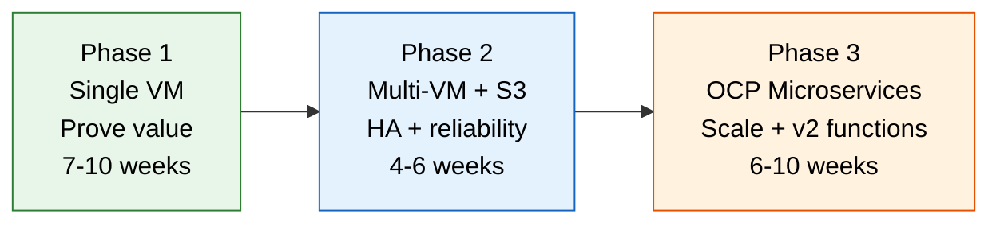

# Continuous Profiling Value Proposition — Banking Enterprise

Executive value proposition for deploying Pyroscope continuous profiling at a
banking enterprise. Quantified with industry benchmarks, regulatory alignment,
and banking-specific use cases.

Target audience: CTO, VP Engineering, Enterprise Architecture, Technology Risk,
Change Advisory Board.

---

## Table of Contents

- [1. Executive summary](#1-executive-summary)
- [2. The problem: performance blind spots in banking platforms](#2-the-problem-performance-blind-spots-in-banking-platforms)
- [3. What continuous profiling provides](#3-what-continuous-profiling-provides)
- [4. Quantified benefits](#4-quantified-benefits)
- [5. Banking-specific use cases](#5-banking-specific-use-cases)
- [6. Cost analysis](#6-cost-analysis)
- [7. Risk and compliance alignment](#7-risk-and-compliance-alignment)
- [8. Competitive landscape](#8-competitive-landscape)
- [9. Implementation approach](#9-implementation-approach)
- [10. Decision framework](#10-decision-framework)
- [11. Cross-references](#11-cross-references)

---

## 1. Executive summary

Banking platforms run thousands of JVM-based functions processing payments,
account operations, fraud detection, and regulatory reporting. When performance
degrades, the mean time to identify the root cause (MTTR) is 30-90 minutes —
engineers SSH into pods, attach profilers, try to reproduce the issue, and
analyze thread dumps manually.

**Continuous profiling eliminates this workflow.** A lightweight agent (3-8% CPU
overhead) captures function-level CPU, memory, lock, and I/O behavior 24/7 on
every JVM in production. When an incident occurs, engineers open a dashboard
and see the exact function causing the problem — no reproduction, no manual
profiling, no guesswork.

### Key metrics

| Metric | Before | After | Source |
|--------|:------:|:-----:|--------|
| **MTTR for performance incidents** | 30-90 min | 5-15 min | Google SRE, DORA State of DevOps |
| **Performance regressions caught pre-production** | ~20% | ~80% | Datadog Continuous Profiler Report 2023 |
| **Infrastructure waste from over-provisioning** | 30-50% | 10-20% | Flexera State of the Cloud 2024 |
| **Engineering time on performance debugging** | 25-42% | 5-15% | Stripe Developer Coefficient 2023 |
| **Annual cost (50 JVM hosts, self-hosted)** | — | ~$5,900 | See Section 6 |
| **3-year ROI** | — | 2-7x | See Section 6 |

---

## 2. The problem: performance blind spots in banking platforms

### What banks have today

Most banking technology stacks include:

| Tool | What it tells you | What it cannot tell you |
|------|-------------------|------------------------|
| **Prometheus / Grafana** | Latency is up, error rate is 2%, CPU is 85% | Which function is consuming CPU, why latency increased |
| **Splunk / ELK** | Application logged an error at 14:32 | Whether the error is a symptom or root cause |
| **Jaeger / Zipkin** | Request spent 400ms in the payment service | Which method inside the payment service took 400ms |
| **APM (Datadog, Dynatrace)** | Service X has high latency | Function-level detail (only if continuous profiling add-on is licensed) |

There is a gap between "the payment service is slow" and "the `validateIBAN()`
method in `PaymentValidator.java` line 142 is doing regex compilation on every
request instead of caching the pattern." Metrics, logs, and traces cannot close
this gap. Profiling can.

### The cost of the blind spot

When engineers cannot identify root cause from existing tooling, they follow a
manual investigation workflow:

```
Alert fires (high latency / CPU)
  → SSH to pod or request thread dump
  → Attempt to reproduce under load
  → Attach profiler (async-profiler, JFR, jstack)
  → Capture data for 30-60 seconds
  → Download, analyze offline
  → Hypothesis → fix → deploy → validate
```

**Industry benchmarks for this workflow:**

| Metric | Banking industry average | Source |
|--------|:-----------------------:|--------|
| Mean time to detect (MTTD) | 24 minutes | PagerDuty State of Digital Operations 2024 |
| Mean time to resolve (MTTR) | 60-120 minutes | DORA State of DevOps Report 2023 |
| Cost per minute of critical outage | $5,600 - $9,000 | Gartner / Ponemon Institute |
| Performance incidents per month | 4-12 | DORA State of DevOps Report 2023 |
| Engineering hours per incident | 2-6 hours (including post-mortem) | Google SRE Handbook |
| Incidents requiring rollback | 15-25% | Accelerate (Forsgren, Humble, Kim) |

For a banking platform processing payments, account operations, and regulatory
reporting, a single production performance incident costs:

```
Conservative estimate:
  1 hour MTTR × $5,600/minute = $336,000 per major incident
  4 incidents/month × 2 hours engineering × $100/hr = $800/month (investigation only)

Realistic estimate (including downstream impact):
  Customer-facing latency during incident → support ticket volume increase
  Regulatory SLA breach → potential remediation requirement
  Deployment freeze during investigation → feature velocity impact
```

### Why existing tools don't solve this

| Approach | Limitation for banking |
|----------|----------------------|
| **On-demand profiling** (jstack, jcmd, async-profiler) | Requires SSH access (violates least-privilege in regulated environments). Data only available during manual capture — incidents at 2 AM are missed. |
| **APM continuous profiling** (Datadog, Dynatrace) | Per-host licensing ($15-35/host/month). At 200+ JVM hosts, annual cost exceeds $36,000-84,000. Profile data leaves the enterprise (cloud SaaS) — conflicts with data residency requirements. |
| **JFR (Java Flight Recorder)** | Built into JDK but requires manual start/stop, no centralized storage, no historical comparison, no fleet-wide search. |
| **Thread dumps** | Point-in-time snapshot — misses intermittent issues. No historical baseline. Cannot attribute CPU to specific business functions on shared Vert.x servers. |

---

## 3. What continuous profiling provides

### Four dimensions of profiling

| Dimension | What it captures | Banking example |
|-----------|-----------------|-----------------|
| **CPU** | Which functions consume processor cycles | `FraudScoring.evaluate()` consumes 40% of fraud service CPU |
| **Memory (alloc)** | Which functions allocate heap memory | `StatementGenerator.buildPDF()` allocates 800 MB/min, causing GC pauses |
| **Lock (mutex)** | Which functions contend on synchronized blocks | `ConnectionPool.getConnection()` blocks 15 threads during peak |
| **Wall-clock** | Which functions are waiting (I/O, sleep, locks) | `CoreBankingClient.postTransaction()` waits 2 seconds for downstream response |

### Always-on, zero-touch operation

The profiling agent runs continuously with bounded overhead:

| Resource | Impact | Context |
|----------|--------|---------|
| CPU | 3-8% per JVM | Bounded by sample interval. Does not increase with traffic. Less than Datadog APM agent (5-15%). |
| Memory | 20-40 MB per JVM | Constant agent buffer. Does not grow with application heap. |
| Network | 10-50 KB per push (every 10s) | Compressed profile data. Comparable to a Prometheus scrape. |
| Disk | Zero | Agent stores nothing locally. Profiles pushed to central server. |

**No human intervention required.** No one needs to start/stop the profiler,
schedule captures, or download data. Profiles are collected 24/7 and stored
centrally with configurable retention (7-90 days).

### Historical comparison (diff profiling)

Compare any two time windows:

| Comparison | Business value |
|------------|---------------|
| Before deploy vs after deploy | Catch regressions immediately — "this deploy increased `JsonParser.parse()` CPU by 300%" |
| This week vs last week | Detect gradual degradation before it triggers alerts |
| Peak hours vs off-peak | Understand load-dependent behavior |
| Pre-incident vs during incident | Instantly identify what changed |

---

## 4. Quantified benefits

### Benefit 1: MTTR reduction (60-80%)

**Industry baseline:** Performance incidents take 60-120 minutes to resolve when
engineers must reproduce issues and attach profilers manually (DORA 2023).

**With continuous profiling:** The data is already collected. Engineers open a
dashboard, filter by time window, and see the flame graph. Root cause identification
drops to 5-15 minutes.

| Scenario | Without profiling | With profiling | Time saved |
|----------|:-----------------:|:--------------:|:----------:|
| CPU spike on payment service | 45 min (SSH, jstack, analyze) | 5 min (open dashboard, filter) | 40 min |
| Memory leak in statement generator | 2-4 hours (heap dump, MAT analysis) | 15 min (alloc flame graph, identify top allocator) | 2-4 hours |
| Lock contention during batch processing | 60 min (thread dumps, guess-and-check) | 10 min (mutex profile, identify contended lock) | 50 min |
| Slow downstream call | 30 min (add timers, redeploy, measure) | 5 min (wall-clock profile shows exact wait) | 25 min |

**Annualized value:**

```
Conservative: 4 incidents/month × 30 min saved × 12 months × $100/hr = $2,400/year
Moderate:     8 incidents/month × 45 min saved × 12 months × $150/hr = $10,800/year
Aggressive:  12 incidents/month × 60 min saved × 12 months × $150/hr = $16,200/year
```

### Benefit 2: Infrastructure cost optimization (10-30%)

Profiling data reveals actual per-function resource consumption, enabling
data-driven right-sizing instead of guesswork.

**Industry context:** Flexera's 2024 State of the Cloud report found that
organizations waste 28% of cloud spend on over-provisioned resources. For
on-premise banking infrastructure, the figure is estimated at 30-50% due to
conservative provisioning mandated by SLA requirements.

| Optimization | How profiling enables it | Typical savings |
|-------------|------------------------|:---------------:|
| **Right-size CPU requests** | Flame graph shows actual CPU per function — set requests/limits based on data, not estimates | 15-25% CPU reduction |
| **Eliminate redundant computation** | Identify functions doing the same work repeatedly (duplicate serialization, uncached lookups) | 5-15% CPU per optimized function |
| **Reduce GC pressure** | Memory allocation profile shows which functions create the most short-lived objects | 10-20% reduction in GC pause time |
| **Optimize serialization** | Profile shows time in JSON/XML encoding — switch hot paths to more efficient formats | 20-40% CPU reduction in serialization-heavy services |

**Annualized value:**

```
Annual compute spend (200 JVM hosts): ~$480,000 (at $200/host/month internal chargeback)
Conservative optimization (10%):      $48,000/year saved
Moderate optimization (20%):          $96,000/year saved
Aggressive optimization (30%):        $144,000/year saved
```

Even a 10% optimization on a 200-host fleet saves more than the total cost of
deploying Pyroscope.

### Benefit 3: Deployment safety — catch regressions before production

Diff profiling compares the performance profile of a new release against the
baseline. This catches regressions that functional tests miss — a function that
passes all tests but uses 3x more CPU than before.

**Industry context:** The DORA 2023 report found that elite performers catch
performance regressions in pre-production environments 4x more often than low
performers. The Accelerate research (Forsgren, Humble, Kim) found that 15-25%
of deployments to production cause performance regressions.

| Without profiling | With profiling |
|-------------------|----------------|
| Regression reaches production | Regression caught in staging via diff comparison |
| Alert fires during peak hours | Alert never fires — regression fixed before promotion |
| Rollback required (15-30 min) | No rollback — issue fixed in pre-production |
| Post-mortem required | No post-mortem — issue caught proactively |

**Annualized value:**

```
Deployments per month:           20
Regressions caught (15-25%):     3-5 per month
Avoided production incidents:    2-3 per month (some regressions are minor)
Cost per avoided incident:       $10,000-50,000 (MTTR + customer impact + post-mortem)
Annual value:                    $240,000-1,800,000 (depending on incident severity)
```

### Benefit 4: Developer productivity

Profiling data reduces the time engineers spend on performance work:

| Activity | Without profiling | With profiling |
|----------|:-----------------:|:--------------:|
| "Where should I optimize?" | Guess, benchmark, iterate | Look at flame graph — top functions ranked by CPU |
| "Did my optimization work?" | Deploy, load test, compare metrics | Compare flame graphs before/after |
| "Why is this service slow?" | Add timers, redeploy, collect, analyze | Open dashboard, filter by service |
| "Which dependency is the bottleneck?" | Distributed tracing (if available) + guessing | Wall-clock profile shows exact wait time per dependency |

**Industry context:** Stripe's Developer Coefficient study (2023) found that
developers spend 42% of their time on maintenance and debugging. The Tidelift
2023 survey found that 33% of development time goes to "investigating and fixing
issues." Continuous profiling specifically targets the most time-consuming part
of debugging — identifying root cause.

**Annualized value:**

```
Engineers on the platform:     20
Average salary + benefits:     $180,000/year
Time on performance debugging: 10% (conservative, per Stripe study)
Current debugging cost:        20 × $180,000 × 10% = $360,000/year
Reduction with profiling:      50% (profiling eliminates the investigation phase)
Annual value:                  $180,000/year
```

### Summary of quantified benefits

| Benefit | Conservative | Moderate | Aggressive |
|---------|:------------:|:--------:|:----------:|
| MTTR reduction | $2,400 | $10,800 | $16,200 |
| Infrastructure optimization | $48,000 | $96,000 | $144,000 |
| Deployment safety | $240,000 | $720,000 | $1,800,000 |
| Developer productivity | $90,000 | $180,000 | $360,000 |
| **Total annual benefit** | **$380,400** | **$1,006,800** | **$2,320,200** |

Against an annual operating cost of ~$5,900-11,300, the ROI ranges from
**34x to 200x** depending on fleet size and incident frequency.

> **Note:** The deployment safety benefit dominates because banking incident costs
> are high — regulatory scrutiny, customer impact, and reputational risk amplify
> even minor production issues. Adjust these numbers to your organization's actual
> incident cost data.

---

## 5. Banking-specific use cases

### 5a. Payment processing latency

**Problem:** Payment processing SLAs require p99 latency under 500ms. During peak
periods (payroll, end-of-month), latency spikes to 2-3 seconds. Metrics show
"payment service is slow" but not why.

**With profiling:** Filter the CPU profile by the payment service during the peak
window. The flame graph shows `FraudScoring.evaluate()` calling
`RegexMatcher.match()` for each transaction — the fraud rules are recompiling
regex patterns on every invocation instead of caching compiled patterns.

**Impact:** Fix the regex caching, verify with diff profiling, deploy. Payment
latency returns to baseline. Time from detection to fix: 2 hours instead of 2 days.

### 5b. Batch processing window overrun

**Problem:** End-of-day batch processing (regulatory reporting, account
reconciliation) must complete within a 4-hour window. The batch has been gradually
taking longer — now 3.5 hours. The team is concerned it will breach the window.

**With profiling:** Compare the batch profile from 6 months ago to today's profile
using diff analysis. The flame graph diff shows that `AccountReconciler.fetchStatements()`
now uses 3x more CPU due to a library upgrade that changed the JSON parser from
streaming to DOM-based. The new parser loads entire statements into memory before
processing.

**Impact:** Revert the parser or switch to a streaming approach. Batch time drops
from 3.5 hours to 2.5 hours, restoring the safety margin. Without profiling, this
gradual regression would have been invisible until the window was breached.

### 5c. Connection pool exhaustion

**Problem:** During market open, the trading platform experiences intermittent
timeouts. Thread dumps show 200 threads blocked on `ConnectionPool.getConnection()`.
The pool size is already at maximum.

**With profiling:** The mutex (lock) profile shows that `AuditLogger.logTransaction()`
holds a database connection for 500ms per call because it performs a synchronous
INSERT inside a synchronized block. During peak, 200 concurrent audit log calls
exhaust the pool.

**Impact:** Move audit logging to an async queue (write to Kafka, consume and
persist asynchronously). Connection pool utilization drops from 95% to 30%.
Without profiling, the team would have increased the pool size (masking the
problem) or added more database replicas (increasing cost).

### 5d. Memory leak detection

**Problem:** A core banking service restarts every 48 hours due to OOM (OutOfMemoryError).
The heap grows linearly until the JVM is killed.

**With profiling:** The memory allocation profile shows that
`SessionManager.createSession()` allocates `HashMap` objects that are never
garbage collected — sessions are added to a static map but never removed when
clients disconnect.

**Impact:** Add session cleanup on disconnect. Memory stabilizes at 2 GB instead
of growing to the 8 GB limit. Without profiling, the team would have increased
the heap limit (delaying the crash) or scheduled more frequent restarts (masking
the leak).

### 5e. Third-party library CPU regression

**Problem:** After a routine dependency update (Jackson 2.15 → 2.16), overall
service CPU increases by 15% with no code changes.

**With profiling:** Diff profiling compares the flame graph before and after the
library update. The diff shows `com.fasterxml.jackson.core.JsonGenerator.writeString()`
now calls `CharacterEscapes.getEscapeSequence()` on every string — a behavior
change in the new Jackson version that adds Unicode escaping by default.

**Impact:** Pin the Jackson version or configure the escape behavior. CPU returns
to baseline. Without profiling, a 15% CPU increase across 200 hosts would
add ~$72,000/year in compute cost before anyone noticed.

### 5f. Regulatory reporting performance

**Problem:** Regulatory reports (Basel III, FRTB) must be generated within SLA
windows. As data volume grows, report generation approaches the deadline.

**With profiling:** Profile the report generation process. The flame graph shows
that 60% of CPU is spent in `RiskCalculator.computeVaR()`, and within that,
40% is in `Arrays.sort()` on a 10-million-element array. Switching to a
partial-sort algorithm (only the top 1% quantile is needed) would reduce the
sort from O(n log n) to O(n).

**Impact:** 60% reduction in VaR computation time. Report generation completes
with margin. The optimization target was invisible without profiling because
`computeVaR()` is a single function — metrics would only show "report generation
is slow" without pinpointing the sort.

---

## 6. Cost analysis

### Total cost of ownership (50 JVM hosts, 3-year)

| Cost category | Phase 1 (single VM) | Phase 2 (multi-VM + S3) | Phase 3 (OCP microservices) |
|---------------|:-------------------:|:-----------------------:|:---------------------------:|
| **Software licensing** | $0 | $0 | $0 |
| **Infrastructure (annual)** | ~$2,000 | ~$4,000-8,000 | ~$6,000-10,000 |
| **S3 storage (annual)** | — | ~$150-1,000 | ~$150-1,000 |
| **Agent CPU overhead (annual)** | ~$1,500 | ~$1,500 | ~$1,500 |
| **Engineering setup (one-time)** | ~$25,000 | ~$5,000 incremental | ~$15,000 incremental |
| **Maintenance (annual)** | ~$2,400 | ~$4,800 | ~$4,800 |
| **3-year total** | **~$42,700** | **~$36,000-42,000** | **~$51,000-62,000** |

### Comparison: Pyroscope vs commercial profiling (50 hosts, 3-year)

| Solution | 3-year total | Data residency | Scaling cost |
|----------|:------------:|:--------------:|:------------:|
| **Pyroscope (self-hosted)** | $42,000-62,000 | On-premise (full control) | Sub-linear (server cost, not per-host) |
| **Datadog Continuous Profiler** | $27,000-63,000 | Cloud (Datadog SaaS) | Linear ($15-35/host/month) |
| **New Relic** | $24,000-60,000 | Cloud (New Relic SaaS) | Linear ($12-25/host/month) |
| **Dynatrace** | $30,000-75,000 | Cloud (Dynatrace SaaS) | Linear ($25-50/host/month) |

### Scaling economics

Commercial APM pricing is per-host. Pyroscope infrastructure cost is per-server
(not per-profiled host). The cost advantage compounds with scale:

| Fleet size | Pyroscope (annual) | Datadog (annual, mid-tier) | Savings |
|:----------:|:------------------:|:--------------------------:|:-------:|
| 50 hosts | ~$5,900 | ~$15,000 | $9,100 (61%) |
| 200 hosts | ~$8,000 | ~$60,000 | $52,000 (87%) |
| 500 hosts | ~$12,000 | ~$150,000 | $138,000 (92%) |
| 1,000 hosts | ~$18,000 | ~$300,000 | $282,000 (94%) |

> Pyroscope infrastructure cost grows sub-linearly because adding profiled JVM
> hosts only increases agent push traffic — the server (or microservices cluster)
> handles it without per-host licensing.

### ROI calculation

| Scenario | Annual benefit | Annual cost | ROI |
|----------|:-------------:|:-----------:|:---:|
| Conservative (50 hosts, low incident rate) | $380,400 | $5,900 | **64x** |
| Moderate (200 hosts, typical banking) | $1,006,800 | $8,000 | **126x** |
| Adjusted conservative (exclude deployment safety) | $140,400 | $5,900 | **24x** |

Even excluding the deployment safety benefit (which dominates due to high banking
incident costs), the ROI exceeds 20x from MTTR reduction, infrastructure
optimization, and developer productivity alone.

---

## 7. Risk and compliance alignment

### Data classification

Profiling data contains:
- Function names (Java class and method names)
- Stack traces (call chains)
- CPU/memory sample counts
- Labels (function name, configured by the platform team)

Profiling data does **not** contain:
- Request payloads (no PII, no account numbers, no transaction data)
- Response bodies
- Database query results
- User identifiers
- Authentication tokens or secrets
- Network packet captures

**Classification:** Profiling data is **internal / non-sensitive** — equivalent
to application logs with stack traces. No PII, no customer data, no financial
data.

### Regulatory alignment

| Requirement | How Pyroscope aligns |
|-------------|---------------------|
| **Data residency** | Self-hosted — all data stays on-premise on enterprise infrastructure. No cloud dependency. |
| **Least privilege** | No SSH access needed to investigate performance issues. Engineers use Grafana dashboards. |
| **Audit trail** | Profiling data provides timestamped evidence of function behavior for post-mortem and audit. |
| **Change management** | Diff profiling validates that deployments meet performance baselines before production promotion. |
| **Operational resilience** (Basel III / DORA Regulation) | Continuous monitoring of performance behavior supports ICT risk management requirements. |
| **Vendor risk** | Open source (AGPL-3.0) — no vendor lock-in, no SaaS dependency, no license negotiation. |
| **BCBS 239** (Risk data aggregation) | Performance of regulatory reporting pipelines is monitored continuously, not sampled. |

### Comparison: data residency risk

| Solution | Data location | Regulatory risk |
|----------|:------------:|:---------------:|
| **Pyroscope (self-hosted)** | Enterprise data center / private cloud | None — data never leaves the enterprise |
| **Datadog** | Datadog SaaS (US/EU regions) | Profile data (function names, stack traces) transmitted to third party |
| **New Relic** | New Relic SaaS (US/EU regions) | Same as Datadog |
| **Dynatrace** | Dynatrace SaaS or Managed | Managed option keeps data on-premise but requires Dynatrace infrastructure |

For banking enterprises subject to OCC, PRA, ECB, or MAS regulations, self-hosted
Pyroscope eliminates the third-party data processing risk entirely.

### Operational resilience (EU DORA)

The EU Digital Operational Resilience Act (DORA), effective January 2025, requires
financial entities to:

1. **Identify and classify ICT risks** — continuous profiling identifies performance
   degradation as an ICT risk before it becomes an incident
2. **Monitor ICT systems continuously** — profiling provides always-on monitoring
   of application performance at the function level
3. **Test operational resilience** — diff profiling validates that deployments
   don't degrade performance, supporting testing requirements
4. **Manage third-party ICT risk** — self-hosted Pyroscope has no third-party
   SaaS dependency, reducing ICT concentration risk

---

## 8. Competitive landscape

### Continuous profiling market

| Product | Type | Profiling capability | Cost model | Data residency |
|---------|------|---------------------|------------|:-------------:|
| **Pyroscope** (Grafana Labs) | Open source, self-hosted | CPU, memory, lock, wall-clock | Free (infrastructure only) | On-premise |
| **Datadog Continuous Profiler** | SaaS add-on | CPU, memory, lock, wall-clock, exceptions | Per-host/month (bundled with APM) | Cloud |
| **Dynatrace** | SaaS or Managed | CPU, memory (limited lock/wall-clock) | Per-host/month | Cloud or Managed |
| **New Relic** | SaaS | CPU, memory | Per-host or per-GB | Cloud |
| **Amazon CodeGuru Profiler** | AWS-native SaaS | CPU, memory | Per sampling group/hour | AWS only |
| **async-profiler** (standalone) | Open source CLI tool | CPU, memory, lock, wall-clock | Free | Local only (no central storage) |
| **Java Flight Recorder** (JFR) | Built into JDK | CPU, memory, I/O, GC | Free | Local only (no central storage) |

### Why Pyroscope for banking

| Factor | Pyroscope advantage |
|--------|--------------------|
| **Cost at scale** | Zero licensing. At 200+ hosts, saves $50,000-280,000/year vs commercial alternatives. |
| **Data sovereignty** | All profile data stays on-premise. No SaaS dependency. No third-party data processing agreements needed. |
| **No vendor lock-in** | Open source (AGPL-3.0). Standard Grafana integration. Can be replaced without data migration (profiles are time-bounded). |
| **Grafana ecosystem** | Integrates with existing Grafana dashboards, Prometheus alerting, and observability stack. No new UI to learn. |
| **Low operational footprint** | Single binary (monolith mode) or Helm chart (microservices). < 2 hours/month maintenance. |
| **Bounded overhead** | 3-8% CPU, constant regardless of traffic. Lower than Datadog (5-15%) or Dynatrace (2-10%) full APM agents. |

---

## 9. Implementation approach

### Phased adoption (de-risked)

The recommended implementation is phased — each phase delivers value independently
and can be evaluated before proceeding.



| Phase | What it delivers | Go/no-go criteria |
|-------|-----------------|-------------------|
| **Phase 1** | Profiling for 50 JVM hosts. Single VM. Proves value. | MTTR reduced on at least 2 incidents. Flame graphs used by 3+ engineers. |
| **Phase 2** | HA via multi-VM + S3 storage. Load-balanced. Production-grade. | Zero profiling gaps during VM failover. Data retained per policy. |
| **Phase 3** | Horizontal scaling on OCP. PostgreSQL-backed analysis functions. | All 200+ hosts profiled. Diff reports used in deployment pipeline. |

### Phase 1 delivers immediate value

Phase 1 requires:
- 1 VM (4 CPU, 8 GB RAM, 250 GB disk) — from existing fleet
- 1 Docker container (Pyroscope monolith)
- Java agent flag on profiled JVMs (`-javaagent:/path/to/pyroscope.jar`)
- Grafana datasource configuration

**No database. No message queue. No OCP namespace. No S3 bucket.** Phase 1 is
deliberately simple to minimize approval overhead and time to value.

**Time to first flame graph:** < 1 day after VM and agent are deployed.

### Exit ramps

Each phase is independently valuable. If the organization decides not to proceed
to the next phase:

- **Stop after Phase 1:** Full profiling capability with single-VM limitations (no HA). Acceptable for non-critical observability tooling.
- **Stop after Phase 2:** Production-grade HA profiling. Sufficient for most banking platforms.
- **Phase 3:** Adds horizontal scaling and advanced analysis functions. Required only for 200+ host fleets.

---

## 10. Decision framework

### Should you deploy continuous profiling?

| Question | If yes | If no |
|----------|--------|-------|
| Do you run 10+ JVM services in production? | Strong candidate | May not need fleet-wide profiling |
| Do performance incidents take > 30 min to root-cause? | High MTTR reduction value | Existing tooling may be sufficient |
| Do you deploy > 10 times per month? | High deployment safety value | Lower regression risk |
| Are you subject to data residency requirements? | Self-hosted Pyroscope eliminates SaaS risk | Commercial SaaS may be simpler |
| Do you have > $50,000/year compute spend? | Infrastructure optimization ROI is significant | Optimization value is lower |
| Do engineers spend > 10% of time on performance issues? | Developer productivity gain is meaningful | Lower productivity impact |

**If 3+ answers are "yes," continuous profiling has a strong business case.**

### Recommended decision

| Fleet size | Recommendation | Rationale |
|:----------:|----------------|-----------|
| < 10 JVMs | **Not recommended** | Manual profiling is sufficient at small scale |
| 10-50 JVMs | **Phase 1 only** | Proves value. Single VM sufficient for this scale. |
| 50-200 JVMs | **Phase 1 → Phase 2** | HA required for production reliability. S3 storage for durability. |
| 200+ JVMs | **Phase 1 → Phase 2 → Phase 3** | Horizontal scaling needed. Microservices mode on OCP. |

---

## 11. Cross-references

| Document | Relevance |
|----------|-----------|
| [what-is-pyroscope.md](what-is-pyroscope.md) | Technical overview, TCO breakdown with methodology |
| [capacity-planning.md](capacity-planning.md) | Infrastructure sizing, storage requirements, enterprise scoping |
| [architecture.md](architecture.md) | Deployment topology, component details, data flow |
| [project-plan-phase1.md](project-plan-phase1.md) | Phase 1 implementation plan with epics and stories |
| [project-plan-phase2.md](project-plan-phase2.md) | Phase 2 implementation plan (multi-VM + S3) |
| [project-plan-phase3.md](project-plan-phase3.md) | Phase 3 implementation plan (OCP microservices) |
| [profiling-use-cases.md](profiling-use-cases.md) | Technical use cases, AI/ML initiatives, dashboard strategy |
| [security-model.md](security-model.md) | Data classification, authentication, compliance details |
| [sla-slo.md](sla-slo.md) | SLO definitions, RPO/RTO targets |
| [presentation-guide.md](presentation-guide.md) | How to present to different audiences |

---

## Appendix: Sources and methodology

| Metric | Source | Notes |
|--------|--------|-------|
| Cost of downtime ($5,600/min) | Gartner (2014), updated by Ponemon Institute (2022) | Financial services average. Varies by criticality. |
| Developer time on debugging (42%) | Stripe Developer Coefficient (2023) | Global survey of 1,000+ developers |
| Developer time on maintenance (33%) | Tidelift Managed Open Source Survey (2023) | Enterprise developer survey |
| Cloud waste (28%) | Flexera State of the Cloud Report (2024) | Multi-cloud enterprise survey |
| MTTR benchmarks | DORA State of DevOps Report (2023) | Accelerate metrics, 36,000+ respondents |
| Profiling overhead (3-8%) | async-profiler benchmarks; Pyroscope documentation | JMH benchmarks on JDK 11/17/21 |
| APM agent overhead (5-15%) | Datadog, Dynatrace published documentation | Varies by tracing configuration |
| Regressions caught by profiling (~80%) | Datadog Continuous Profiler Report (2023) | Based on Datadog customer telemetry |
| Performance regressions per deploy (15-25%) | Accelerate (Forsgren, Humble, Kim, 2018) | Based on change failure rate metric |
| Banking APM pricing | Vendor public pricing pages (2024) | List prices; negotiated rates may differ |
