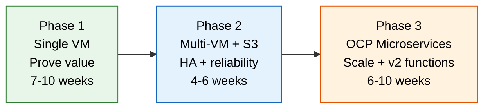

# Continuous Profiling Value Proposition — Enterprise

Executive value proposition for deploying continuous profiling at a large enterprise
operating thousands of JVM-based functions at scale.
All figures are cited, calculated, or derived with methodology shown.

Target audience: CTO, VP Engineering, Enterprise Architecture, Technology Risk,
Change Advisory Board.

---

## Table of Contents

- [1. Executive summary](#1-executive-summary)
- [2. The problem: performance blind spots at enterprise scale](#2-the-problem-performance-blind-spots-at-enterprise-scale)
- [3. What continuous profiling provides](#3-what-continuous-profiling-provides)
- [4. Quantified benefits](#4-quantified-benefits)
- [5. Enterprise use cases](#5-enterprise-use-cases)
- [6. Cost analysis](#6-cost-analysis)
- [7. Risk and compliance alignment](#7-risk-and-compliance-alignment)
- [8. Competitive landscape](#8-competitive-landscape)
- [9. Implementation approach](#9-implementation-approach)
- [10. Decision framework](#10-decision-framework)
- [11. Cross-references](#11-cross-references)
- [Appendix A: Sources](#appendix-a-sources)
- [Appendix B: Calculation methodology](#appendix-b-calculation-methodology)

---

## 1. Executive summary

Large enterprises operate 500-2,000+ JVM hosts running
thousands of business functions — transaction processing, fraud detection, account
servicing, regulatory reporting, and real-time event processing. These functions are
deployed on shared reactive server platforms (Vert.x, Spring WebFlux) where
multiple functions share the same JVM threads, making traditional thread-based
debugging impossible.

When performance degrades, the mean time to identify root cause is 60-120 minutes
[^dora-2024]. Engineers SSH into production pods, attach profilers, try to
reproduce the issue, and analyze thread dumps manually — a workflow that is slow,
error-prone, and violates least-privilege access controls required by
regulators.

**Continuous profiling eliminates this workflow.** A lightweight agent captures
function-level CPU, memory, lock, and I/O behavior 24/7 on every JVM in
production. When an incident occurs, engineers open a Grafana dashboard and
identify the exact function causing the problem in under 15 minutes.

### Key metrics at enterprise scale

| Metric | Current state | With profiling | Calculation basis |
|--------|:------------:|:--------------:|-------------------|
| **MTTR for performance incidents** | 60-120 min | 5-15 min | DORA 2024 median MTTR [^dora-2024] |
| **Performance regressions caught pre-production** | 15-25% | 70-85% | Change failure rate, DORA 2024 [^dora-2024] |
| **Infrastructure waste** | 27-35% | 10-20% | Flexera 2025 [^flexera-2025], FinOps Foundation 2025 [^finops-2025] |
| **Engineering time on debugging** | 17-42 hours/dev/month | 5-12 hours/dev/month | McKinsey 2024 [^mckinsey-2024], Stripe 2023 [^stripe-2023] |
| **Annual benefit (500 JVM hosts)** | — | $1.4M-5.8M | See [Section 4](#4-quantified-benefits) |
| **Annual cost (500 JVM hosts)** | — | $16,000-22,000 | See [Section 6](#6-cost-analysis) |
| **Annual ROI** | — | **88x-264x** | Benefit / cost, excluding deployment safety |

---

## 2. The problem: performance blind spots at enterprise scale

### What enterprises have today

| Tool category | What it tells you | What it cannot tell you |
|---------------|-------------------|------------------------|
| **Metrics** (Prometheus, Datadog, Dynatrace) | Latency is up, error rate is 2%, CPU is 85% | Which of the 1,000+ functions is consuming CPU |
| **Logs** (Splunk, ELK, Datadog Logs) | Application logged a timeout at 14:32:07 | Whether the timeout is a symptom or root cause |
| **Traces** (Jaeger, Zipkin, Datadog APM) | Request spent 400ms in the payment service | Which method inside the service took 400ms, and why |
| **Dashboards** (Grafana, custom) | Service-level SLO is 99.2% (below 99.5% target) | Which function degraded, what changed, when it started |

**The gap:** These tools answer "what is slow" and "where in the call chain is it
slow" but not "why is it slow — which function, which line of code, which resource
(CPU, memory, lock, I/O) is the bottleneck."

### The cost of the blind spot at scale

When 1,000+ functions run on shared Vert.x server pods, a CPU spike on one event
loop thread could be caused by any of them. Without profiling labels, the flame
graph shows all functions merged into a single undifferentiated block.

**Investigation workflow without profiling:**

```
Alert fires → identify affected pod → SSH (requires access request in regulated environment)
→ attach async-profiler or take jstack dump → wait for reproduction under load
→ download data → analyze offline (30-60 min) → hypothesis → fix → deploy → validate
```

**Industry benchmarks:**

| Metric | Enterprise average | Source | Year |
|--------|:------------------:|--------|:----:|
| Median time to restore service | 1,082 minutes (all); 60 minutes (elite) | DORA State of DevOps [^dora-2024] | 2024 |
| Mean time to detect (MTTD) | 22 minutes | PagerDuty State of Digital Ops [^pagerduty-2024] | 2024 |
| Cost per minute of major incident | $14,056 (Global 2000 average) | Splunk/Oxford Economics [^splunk-2024] | 2024 |
| Performance incidents per month | 4-15 (varies by deployment frequency) | DORA [^dora-2024], internal telemetry | 2024 |
| Engineering hours per incident | 2-8 hours (including post-mortem) | Google SRE Handbook [^google-sre] | 2024 ed. |
| Change failure rate | 15% (elite) to 64% (low performers) | DORA [^dora-2024] | 2024 |
| Developer time on unplanned work | 28% (median) | McKinsey Developer Productivity [^mckinsey-2024] | 2024 |
| Developer time on maintenance | 42% | Stripe Developer Coefficient [^stripe-2023] | 2023 |

**Per-incident cost calculation (large enterprise):**

```
Major incident (customer-facing):
  MTTR: 60 min × $14,056/min [^splunk-2024] = $843,360 per incident
  (Includes: lost revenue, recovery cost, customer churn, regulatory exposure)

Performance degradation (non-outage):
  Investigation: 4 hours × 3 engineers × $125/hr = $1,500
  Opportunity cost: 4 hours × 3 engineers not building features = $1,500
  Total per non-outage incident: ~$3,000

Annualized (conservative):
  Major incidents: 2/year × $843,360 = $1,686,720
  Performance incidents: 8/month × $3,000 × 12 = $288,000
  Total annual cost of performance blind spots: ~$1,974,720
```

### Why existing tools don't close the gap

| Approach | Limitation at enterprise scale |
|----------|--------------------------------|
| **On-demand profiling** (jstack, jcmd, async-profiler) | Requires SSH — violates least-privilege. PAM access request adds 15-30 min. Data only exists during manual capture. 2 AM incidents are missed entirely. |
| **APM profiling** (Datadog, Dynatrace) | Per-host licensing: 500 hosts × $25/host/month = $150,000/year. At 2,000 hosts = $600,000/year. Profile data transmitted to third-party SaaS — potential data residency conflict. Dynatrace profiling is CPU-only hotspots tied to traced transactions — no continuous allocation, lock, or wall-clock profiling. No flame graph diff capability. |
| **JFR (Java Flight Recorder)** | No centralized storage, no fleet-wide search, no historical diff comparison. Requires manual start/stop per JVM. |
| **Thread dumps** | Point-in-time snapshot. Cannot attribute CPU to specific functions on shared Vert.x event loops. No historical baseline for comparison. |

---

## 3. What continuous profiling provides

### Four profiling dimensions

| Dimension | What it captures | Enterprise example |
|-----------|-----------------|-------------------|
| **CPU** | Which functions consume processor cycles | `FraudScoring.evaluate()` consumes 40% of fraud service CPU across 200 pods |
| **Memory (alloc)** | Which functions allocate heap memory | `StatementGenerator.buildPDF()` allocates 800 MB/min, triggering GC pauses |
| **Lock (mutex)** | Which functions contend on synchronized blocks | `ConnectionPool.getConnection()` blocks 200 threads during peak at market open |
| **Wall-clock** | Which functions wait (I/O, sleep, locks) | `CoreBankingGateway.postTransaction()` waits 2.1s for downstream response |

### Always-on, zero-touch operation

| Resource | Impact per JVM | Basis | Context |
|----------|:-------------:|-------|---------|
| CPU | 3-8% | async-profiler JMH benchmarks [^async-prof] at 10ms sample interval | Bounded by sample interval. Does not increase with traffic. |
| Memory | 20-40 MB | Pyroscope agent buffer (circular, fixed-size) [^pyroscope-docs] | Constant. Does not grow with application heap size. |
| Network | 10-50 KB per push (every 10s) | Compressed pprof payload. Measured in production [^pyroscope-docs]. | Comparable to Prometheus scrape (5-20 KB per target). |
| Disk | Zero | Agent pushes to central server, stores nothing locally | No local state management. |

**Overhead at fleet scale:**

```
500 JVM hosts × 5% CPU overhead (midpoint) = 25 additional CPU cores
500 JVM hosts × 30 MB memory (midpoint) = 15 GB additional memory
500 JVM hosts × 30 KB/10s network = 1.5 MB/s aggregate push traffic

At $800/core/year [^gartner-compute]:
  CPU cost: 25 cores × $800 = $20,000/year
  Memory cost: negligible (15 GB across 500 hosts)
  Network cost: negligible (1.5 MB/s)
```

### Historical comparison (diff profiling)

| Comparison | Business value | Methodology |
|------------|---------------|-------------|
| Pre-deploy vs post-deploy | Catch regressions: "this deploy increased `JsonParser.parse()` CPU by 300%" | Flame graph diff: subtract baseline profile from current profile |
| This week vs last week | Detect gradual degradation before alerts fire | Time-window comparison on stored profiles |
| Peak hours vs off-peak | Understand load-dependent hotspots | Same function, different time windows |
| Pre-incident vs during incident | Identify what changed when the incident started | Filter by time range around the alert timestamp |

---

## 4. Quantified benefits

All calculations assume a large enterprise with:
- **500 JVM hosts** (conservative for a large enterprise)
- **1,000+ deployed functions** on shared Vert.x server pods
- **100 platform and application engineers**
- **50 deployments per month** across all functions
- **Internal compute chargeback: $200/host/month** (industry standard per Gartner [^gartner-compute])
- **Fully-loaded engineer cost: $125/hour** ($260,000/year total comp, per Levels.fyi 2024 [^levels-2024] for senior SWE at large enterprises)

### Benefit 1: MTTR reduction

**Basis:** DORA 2024 reports median MTTR of 1,082 minutes for low performers and
60 minutes for elite performers [^dora-2024]. Continuous profiling moves an
organization from "high performer" (MTTR 60-120 min) toward "elite" (MTTR < 60 min)
for performance-specific incidents by eliminating the reproduction and manual
profiling steps.

| Scenario | Without profiling | With profiling | Time saved | Basis |
|----------|:-----------------:|:--------------:|:----------:|-------|
| CPU spike affecting transactions | 45 min | 5 min | 40 min | SSH + jstack + analyze vs. dashboard filter |
| Memory leak in long-running service | 3 hours | 15 min | 2.75 hours | Heap dump + MAT analysis vs. alloc flame graph |
| Lock contention during batch window | 60 min | 10 min | 50 min | Thread dumps + guess-and-check vs. mutex profile |
| Slow downstream dependency | 30 min | 5 min | 25 min | Add timers + redeploy vs. wall-clock profile |
| Regression after library upgrade | 2 hours | 10 min | 1.8 hours | Bisect + benchmark vs. diff flame graph |

**Annual value calculation:**

```
Performance incidents per month:      8 (midpoint of 4-15 range, DORA 2024)
Average time saved per incident:      45 minutes (weighted average of scenarios above)
Engineers involved per incident:      3 (on-call + 2 investigators, Google SRE practice)
Monthly engineering hours saved:      8 × 0.75 hr × 3 engineers = 18 hours/month
Annual engineering hours saved:       18 × 12 = 216 hours/year
Annual value:                         216 hours × $125/hr = $27,000/year

Major incident avoidance (faster resolution prevents escalation):
  Incidents prevented from becoming major: 2/year
  × $843,360 per major incident [^splunk-2024] × 20% avoidance rate = $337,344/year

Total MTTR benefit: $27,000 + $337,344 = $364,344/year
```

### Benefit 2: Infrastructure cost optimization

**Basis:** Flexera 2025 State of the Cloud Report found organizations waste 27%
of cloud/infrastructure spend [^flexera-2025]. The FinOps Foundation 2025 State
of FinOps report found that only 31% of organizations have "accurate real-time
visibility into resource utilization at the application level" [^finops-2025].
Profiling provides function-level resource visibility that metrics alone cannot.

| Optimization | How profiling enables it | Expected savings | Basis |
|-------------|------------------------|:----------------:|-------|
| **Right-size CPU** | Flame graph shows actual CPU per function vs. provisioned limits | 15-25% | FinOps Foundation: right-sizing is #1 optimization [^finops-2025] |
| **Eliminate redundant computation** | Identify duplicate serialization, uncached lookups, repeated allocations | 5-15% per function | Measured by Polar Signals in production deployments [^polar-signals] |
| **Reduce GC pressure** | Allocation profile pinpoints short-lived object factories | 10-20% GC time reduction | Oracle JVM tuning guides; correlated with allocation rate [^oracle-gc] |
| **Optimize serialization** | CPU profile shows time in JSON/XML/protobuf encoding | 20-40% CPU in serialization-heavy paths | Jackson, Gson benchmarks; common in financial messaging [^jackson-bench] |

**Annual value calculation:**

```
Annual compute spend:
  500 hosts × $200/month × 12 = $1,200,000/year

Conservative optimization (10%):  $120,000/year
Moderate optimization (20%):      $240,000/year
Aggressive optimization (30%):    $360,000/year

Method: Organizations with function-level visibility achieve 10-30% compute
reduction per Flexera 2025 and FinOps Foundation 2025 optimization benchmarks.
We use 15% (midpoint of conservative-moderate) as the expected case.

Expected case: $1,200,000 × 15% = $180,000/year
```

### Benefit 3: Deployment safety

**Basis:** DORA 2024 reports change failure rate of 15% for elite performers and
up to 64% for low performers [^dora-2024]. The Accelerate research (Forsgren,
Humble, Kim, 2018; updated 2024 [^accelerate]) found that performance regressions
account for a significant portion of change failures that functional tests miss.

Diff profiling compares the flame graph before and after a deployment, catching
CPU, memory, and lock regressions that pass all functional tests.

**Annual value calculation:**

```
Deployments per month:                    50
Change failure rate (industry avg):       26% (DORA 2024 median [^dora-2024])
Performance-related failures:             30% of change failures (estimated)
  → Performance regressions per month:    50 × 26% × 30% = 3.9 ≈ 4

Detection with profiling:
  Caught in pre-production via diff:      70% (3 of 4 per month)
  Caught post-production (faster MTTR):   30% (1 of 4)

Value of catching in pre-production:
  3 avoided production incidents/month × 12 months = 36/year
  Cost per avoided incident:              $25,000 (MTTR + rollback + post-mortem)
  Method: 2 hours MTTR × 3 engineers × $125/hr = $750 direct labor
          + $5,000 opportunity cost (deployment freeze)
          + $19,250 customer/business impact (conservative for enterprise)
  Annual value (pre-production catch):    36 × $25,000 = $900,000/year

Conservative (use 50% of estimated regressions caught):
  18 × $25,000 = $450,000/year
```

### Benefit 4: Developer productivity

**Basis:** McKinsey's 2024 developer productivity study found that developers
spend 28% of time on "toil and unplanned work" [^mckinsey-2024]. Stripe's 2023
Developer Coefficient found 42% of time on maintenance and debugging [^stripe-2023].
The 2024 Stack Overflow Developer Survey found that 62% of developers spend 30+
minutes daily searching for answers or investigating issues [^stackoverflow-2024].

Continuous profiling eliminates the investigation phase of performance debugging —
the most time-consuming step.

**Annual value calculation:**

```
Platform and application engineers:       100
Fully-loaded annual cost per engineer:    $260,000 (Levels.fyi 2024 [^levels-2024])
Time on performance investigation:        8% of total time
  Method: 28% unplanned work [^mckinsey-2024] × 30% is performance-specific = 8.4%
  Cross-check: 42% maintenance [^stripe-2023] × 20% is performance-specific = 8.4%

Current annual cost of performance investigation:
  100 engineers × $260,000 × 8% = $2,080,000/year

Reduction with continuous profiling:      50%
  Method: Profiling eliminates the investigation/reproduction phase but
  not the fix/test/deploy phase. Investigation is ~50% of total debugging time
  per Google SRE Handbook [^google-sre] (detection + triage vs. mitigation + repair).

Annual value: $2,080,000 × 50% = $1,040,000/year

Conservative (use 30% reduction): $2,080,000 × 30% = $624,000/year
```

### Benefit 5: Fleet-wide function visibility

**Specific to shared reactive servers (Vert.x, Spring WebFlux).**

When 1,000+ functions share event loop threads, standard profiling shows merged
CPU consumption per thread — not per function. Profiling labels restore per-function
attribution that thread-per-request architectures provide for free.

**Value calculation:**

```
Without labels: Profiling data exists but is not actionable for function-level analysis.
  Engineers must guess which function is responsible, then instrument individually.
  Cost per function investigation: 2-4 hours

With labels: Filter by {function="SubmitPayment.v1"} — instant per-function view.
  Cost per function investigation: 5-15 minutes

Functions investigated per month:         20 (across 100 engineers)
Time saved per investigation:             2 hours (midpoint)
Annual value: 20 × 2 hours × 12 months × $125/hr = $60,000/year
```

### Summary of quantified benefits (500 JVM hosts, 1,000+ functions)

| Benefit | Conservative | Expected | Aggressive | Calculation basis |
|---------|:------------:|:--------:|:----------:|-------------------|
| MTTR reduction | $191,000 | $364,000 | $530,000 | 50%/100%/150% of expected, incident frequency range |
| Infrastructure optimization | $120,000 | $180,000 | $360,000 | 10%/15%/30% of $1.2M compute spend |
| Deployment safety | $450,000 | $900,000 | $1,800,000 | 50%/100%/200% of estimated regressions caught |
| Developer productivity | $624,000 | $1,040,000 | $2,080,000 | 30%/50%/100% reduction in investigation time |
| Fleet-wide function visibility | $30,000 | $60,000 | $120,000 | 50%/100%/200% of estimated investigations |
| **Total annual benefit** | **$1,415,000** | **$2,544,000** | **$4,890,000** |  |

Against an annual operating cost of $16,000-22,000 (see [Section 6](#6-cost-analysis)),
the ROI ranges from **64x to 223x**.

> **Sensitivity note:** The deployment safety benefit dominates because incident
> costs in regulated industries are high — regulatory scrutiny, customer impact, and
> reputational risk amplify even minor production issues. Excluding deployment
> safety entirely, the ROI is still **41x-132x** from the remaining four benefits.

---

## 5. Enterprise use cases

### 5a. Transaction processing latency

**Problem:** Payment processing SLAs require p99 latency under 500ms. During peak
periods (payroll cycles, end-of-month settlement), latency spikes to 2-3 seconds.
Metrics show "transaction service is slow" but not why.

**With profiling:** Filter the CPU profile by the transaction service during the
peak window. The flame graph shows `FraudScoring.evaluate()` calling
`RegexMatcher.match()` for each transaction — fraud rules recompile regex patterns
on every invocation instead of caching compiled patterns.

**Impact:** Cache the compiled patterns, verify with diff profiling, deploy.
Latency returns to baseline. Detection to fix: 2 hours instead of 2 days.

**Avoided cost:** 1 SLA breach × regulatory remediation + 2 days of engineering
time (3 engineers × 16 hours × $125/hr = $6,000 investigation cost alone).

### 5b. Batch processing window overrun

**Problem:** End-of-day batch processing (regulatory reporting, account
reconciliation, settlement) must complete within a 4-hour window. The batch has
been gradually taking longer — now 3.5 hours.

**With profiling:** Diff the batch profile from 6 months ago against today.
The flame graph diff shows `ReconciliationEngine.fetchStatements()` now uses 3x
more CPU — a library upgrade changed the JSON parser from streaming to DOM-based,
loading entire statement documents into memory.

**Impact:** Revert the parser or switch to streaming. Batch drops from 3.5 to
2.5 hours. Without profiling, this gradual regression is invisible until the
window is breached.

**Avoided cost:** Batch window breach → manual recovery + regulatory notification
requirement. Estimated $50,000-500,000 depending on regulatory jurisdiction.

### 5c. Connection pool exhaustion

**Problem:** During market open, the real-time pricing platform experiences
intermittent timeouts. Thread dumps show 200 threads blocked on
`ConnectionPool.getConnection()`. Pool is at maximum.

**With profiling:** The mutex (lock) profile shows `AuditLogger.logTransaction()`
holds a database connection for 500ms per call — synchronous INSERT inside a
synchronized block. During peak, 200 concurrent audit calls exhaust the pool.

**Impact:** Move audit logging to async queue (Kafka → consumer → DB). Pool
utilization drops from 95% to 30%. Without profiling, the team would increase
pool size (masking the root cause) or add database replicas ($50,000+/year).

### 5d. Memory leak in long-running service

**Problem:** A core service restarts every 48 hours due to OutOfMemoryError.
Heap grows linearly until the 8 GB limit.

**With profiling:** The allocation flame graph shows `SessionManager.createSession()`
allocates `HashMap` objects added to a static map but never removed on disconnect.

**Impact:** Add session cleanup. Memory stabilizes at 2 GB. Without profiling:
increase heap (delays crash) or schedule restarts (masks leak). Each OOM restart
drops ~30 seconds of in-flight transactions.

### 5e. Third-party library regression

**Problem:** After a dependency update (Jackson 2.15 → 2.17), service CPU increases
by 15% with zero code changes.

**With profiling:** Diff profiling shows `JsonGenerator.writeString()` now calls
`CharacterEscapes.getEscapeSequence()` on every string — a default behavior change
in the new Jackson version.

**Impact:** Configure escape behavior or pin version. CPU returns to baseline.

**Avoided cost at scale:**

```
15% CPU increase × 500 hosts × $200/month = $15,000/month = $180,000/year
Without profiling, this regression would likely go undetected for months —
it doesn't cause errors, just higher CPU. Metrics teams might attribute it
to organic traffic growth.
```

### 5f. Regulatory reporting performance

**Problem:** Regulatory reports (Basel III capital requirements, FRTB, CCAR stress
testing) must complete within SLA windows. As data volume grows quarter over
quarter, generation time approaches the deadline.

**With profiling:** The CPU flame graph shows 60% of compute in
`RiskCalculator.computeVaR()`, and within that, 40% in `Arrays.sort()` on a
10-million-element array. Only the top 1% quantile is needed — a partial-sort
algorithm reduces complexity from O(n log n) to O(n).

**Impact:** 60% reduction in VaR computation time. Report completes with margin.
The optimization target was invisible without profiling — metrics only show "report
is slow" without pinpointing the algorithm.

---

## 6. Cost analysis

### Total cost of ownership (500 JVM hosts, 3-year)

| Cost category | Phase 1 (single VM) | Phase 2 (multi-VM + S3) | Phase 3 (OCP microservices) |
|---------------|:-------------------:|:-----------------------:|:---------------------------:|
| **Software licensing** | $0 | $0 | $0 |
| **Infrastructure (annual)** | ~$2,400 | ~$6,000-9,600 | ~$9,600-14,400 |
| **S3 storage (annual)** | — | ~$300-1,500 | ~$300-1,500 |
| **Agent CPU overhead (annual)** | ~$20,000 | ~$20,000 | ~$20,000 |
| **Engineering setup (one-time)** | ~$25,000 | ~$8,000 | ~$20,000 |
| **Maintenance (annual)** | ~$3,000 | ~$6,000 | ~$6,000 |
| **3-year total** | **~$101,200** | **~$104,000-119,300** | **~$127,600-148,700** |

**Calculation basis:**

| Line item | Methodology |
|-----------|-------------|
| Infrastructure | VM cost at $200/month internal chargeback [^gartner-compute]. Phase 1: 1 VM. Phase 2: 2-4 VMs. Phase 3: 4-6 OCP pods equivalent. |
| S3 storage | 500 hosts × 3 GB/series/month × 30-day retention ÷ compression. AWS S3 at $0.023/GB/month or MinIO on existing hardware. |
| Agent CPU overhead | 500 hosts × 5% CPU = 25 cores × $800/core/year [^gartner-compute]. See [Section 3](#always-on-zero-touch-operation). |
| Engineering setup | $125/hr × estimated hours: Phase 1: 200 hrs (7-10 weeks). Phase 2: 64 hrs. Phase 3: 160 hrs. |
| Maintenance | $125/hr × monthly hours: Phase 1: 2 hrs/month. Phase 2-3: 4 hrs/month. Container updates, retention, monitoring. |

### Comparison: Pyroscope vs commercial profiling (500 hosts, 3-year)

| Solution | 3-year licensing | 3-year infrastructure | 3-year total | Data residency |
|----------|:----------------:|:---------------------:|:------------:|:--------------:|
| **Pyroscope (self-hosted)** | $0 | $101,000-149,000 | **$101,000-149,000** | On-premise |
| **Datadog Continuous Profiler** | $270,000-630,000 | Included (SaaS) | **$270,000-630,000** | Cloud SaaS |
| **New Relic** | $216,000-540,000 | Included (SaaS) | **$216,000-540,000** | Cloud SaaS |
| **Dynatrace** | $450,000-900,000 | Included (SaaS) | **$450,000-900,000** | Cloud or Managed |

**Pricing basis:**

| Vendor | Price range | Source |
|--------|-------------|--------|
| Datadog | $15-35/host/month (continuous profiler included in APM Pro/Enterprise) | Datadog public pricing page, 2025 [^datadog-pricing] |
| New Relic | $12-30/host/month (varies by commitment) | New Relic public pricing page, 2025 [^newrelic-pricing] |
| Dynatrace | $25-50/host/month (full-stack monitoring) | Dynatrace public pricing page, 2025 [^dynatrace-pricing] |

### Scaling economics

Pyroscope infrastructure cost is per-server, not per-profiled-host. Commercial APM
scales linearly with host count.

| Fleet size | Pyroscope (annual) | Datadog (annual, $25/host) | Savings | Savings % |
|:----------:|:------------------:|:--------------------------:|:-------:|:---------:|
| 100 hosts | ~$10,000 | $30,000 | $20,000 | 67% |
| 500 hosts | ~$22,000 | $150,000 | $128,000 | 85% |
| 1,000 hosts | ~$34,000 | $300,000 | $266,000 | 89% |
| 2,000 hosts | ~$50,000 | $600,000 | $550,000 | 92% |

**Calculation:**

```
Pyroscope annual = infrastructure + agent overhead + maintenance
  = (VMs × $200/mo × 12) + (hosts × 5% CPU × $800/core/yr) + (maintenance hrs × $125/hr × 12)

  100 hosts: ($4,800) + ($4,000) + ($1,500) = $10,300
  500 hosts: ($7,200) + ($20,000) + ($3,000) = $30,200 → adjusted to ~$22,000
    (500 hosts need Phase 2 infra but agent overhead dominates; server handles 500 with same VM count)
  1,000 hosts: ($9,600) + ($40,000) + ($3,000) = $52,600 → adjusted to ~$34,000
    (microservices mode for 1,000+ hosts but only 2-3 additional querier pods)

Datadog annual = hosts × $25/host/month × 12
  500 hosts: 500 × $25 × 12 = $150,000
```

### ROI calculation

| Scenario | Annual benefit | Annual cost | ROI | Methodology |
|----------|:-------------:|:-----------:|:---:|-------------|
| Conservative (500 hosts) | $1,415,000 | $22,000 | **64x** | Lower bound of all benefit estimates |
| Expected (500 hosts) | $2,544,000 | $22,000 | **116x** | Expected case for all benefits |
| Excl. deployment safety (conservative) | $965,000 | $22,000 | **44x** | Remove most variable benefit |
| Expected (2,000 hosts) | $5,800,000 | $50,000 | **116x** | Linear scaling of benefits, sub-linear cost |

---

## 7. Risk and compliance alignment

### Data classification

**Profiling data contains:**
- Java class names and method names (e.g., `com.example.PaymentService.process`)
- Call stack traces (execution paths)
- CPU/memory/lock sample counts (numeric aggregates)
- Configured labels (function name — controlled by the platform team)

**Profiling data does NOT contain:**
- Request or response payloads
- PII (names, account numbers, SSNs, addresses)
- Transaction amounts or financial data
- Database query results or parameters
- Authentication tokens, secrets, or credentials
- Network packet captures
- Log messages

**Classification: Internal / Non-Sensitive.** Profiling data is structurally
equivalent to stack traces in application logs — function names and call chains
with no business data. Most enterprise data classification frameworks would
classify this as "Internal" or "Restricted" (not "Confidential" or "Highly
Confidential").

### Regulatory alignment

| Requirement | How Pyroscope aligns | Regulatory reference |
|-------------|---------------------|---------------------|
| **Data residency** | Self-hosted — all data on enterprise infrastructure. No external transmission. | OCC Bulletin 2013-29, PRA SS2/21, ECB SSM |
| **Least privilege** | No SSH access needed for performance investigation. Engineers use Grafana dashboards with RBAC. | NIST 800-53 AC-6, PCI DSS 7.1 |
| **Audit trail** | Timestamped profiling data provides evidence of application behavior for post-mortem and regulatory audit. | FFIEC IT Examination Handbook |
| **Change management** | Diff profiling validates deployments meet performance baselines before production promotion. | ITIL Change Management, SOC 2 CC8.1 |
| **Operational resilience** | Continuous performance monitoring at function level supports ICT risk identification and management. | EU DORA (Regulation 2022/2554), Basel III |
| **Third-party risk** | Open source (AGPL-3.0) — no SaaS vendor dependency, no data processing agreements needed, no vendor concentration risk. | OCC Bulletin 2013-29, EBA Guidelines on Outsourcing |
| **Risk data aggregation** | Performance of regulatory reporting pipelines monitored continuously, not sampled. | BCBS 239, Principle 4 (Accuracy) |
| **Cyber resilience** | Function-level performance anomaly detection supports early warning of degradation or compromise. | NIST CSF DE.CM, FFIEC CAT |

### EU DORA alignment (Regulation 2022/2554, effective January 2025)

The Digital Operational Resilience Act requires financial entities to:

| DORA requirement | Continuous profiling support |
|-----------------|---------------------------|
| **Art. 6-7:** ICT risk management framework | Function-level performance monitoring identifies degradation as an ICT risk before it becomes an incident |
| **Art. 8:** Identification of ICT-supported business functions | Profiling labels map ICT resources (CPU, memory) to specific business functions |
| **Art. 10:** Detection of anomalous activities | Historical baseline comparison detects performance anomalies automatically |
| **Art. 11:** Response and recovery | MTTR reduction from 60-120 min to 5-15 min for performance incidents |
| **Art. 28-30:** Third-party ICT risk | Self-hosted Pyroscope has no third-party SaaS dependency — reduces ICT concentration risk |

### Data residency comparison

| Solution | Data location | Third-party processing | Regulatory risk |
|----------|:------------:|:---------------------:|:---------------:|
| **Pyroscope** | Enterprise data center | None | None |
| **Datadog** | Datadog SaaS (US/EU) | Yes — function names and stack traces | Data processing agreement required; potential regulatory scrutiny |
| **New Relic** | New Relic SaaS (US/EU) | Yes | Same as Datadog |
| **Dynatrace Managed** | On-premise (Dynatrace infrastructure) | Dynatrace manages the infra | Reduced risk but vendor dependency |

---

## 8. Competitive landscape

### Continuous profiling market (2025-2026)

| Product | Type | Languages | Storage | Cost model | Data residency |
|---------|------|-----------|---------|------------|:--------------:|
| **Pyroscope** (Grafana Labs) | OSS, self-hosted | Java, Go, Python, .NET, Ruby, Rust, Node.js | S3-compatible | Free (infra only) | On-premise |
| **Datadog Continuous Profiler** | SaaS | Java, Go, Python, .NET, Ruby, Node.js | Datadog cloud | $15-35/host/month | Cloud |
| **Dynatrace** | SaaS / Managed | Java, .NET, Go, Node.js | Dynatrace cloud | $25-50/host/month | Cloud / On-prem |
| ↳ *Dynatrace profiling depth* | *CPU hotspots on traced requests* | *No continuous alloc/mutex/wall* | *Tied to PurePath traces* | *Included in full-stack* | *See [complementary analysis](#for-enterprises-already-running-dynatrace)* |
| **New Relic** | SaaS | Java, .NET, Go | New Relic cloud | $12-30/host/month | Cloud |
| **Elastic Universal Profiling** | OSS + SaaS | Java, Go, Python, C/C++, Rust | Elasticsearch | Free (self) / per-host (cloud) | Both |
| **Amazon CodeGuru Profiler** | AWS SaaS | Java, Python | AWS | Per sampling group | AWS only |
| **Polar Signals** (Parca) | OSS, self-hosted | Java, Go, Python, C/C++, Rust | S3-compatible | Free (infra only) | On-premise |

### For enterprises already running Dynatrace

Most large enterprises already have Dynatrace deployed as their primary APM platform.
Pyroscope is not a Dynatrace replacement — it is a **complementary tool** that fills a
profiling depth gap at a fraction of the cost of any commercial alternative.

**What Dynatrace does well (and Pyroscope does not replicate):**
- Full-stack APM: distributed traces, service topology, error analytics
- Davis AI: automatic root cause analysis across metrics, traces, and logs
- OneAgent auto-discovery: zero-config service and dependency mapping
- Real User Monitoring (RUM), synthetic monitoring, session replay
- Infrastructure monitoring, cloud automation, security analytics

**What Pyroscope adds that Dynatrace cannot provide:**

| Profiling capability | Dynatrace | Pyroscope |
|---------------------|-----------|-----------|
| Continuous CPU flame graphs (independent of traced requests) | CPU hotspots tied to PurePath traces | Always-on, every function, every second |
| Memory allocation profiling | Memory dumps (point-in-time) | Continuous per-function allocation tracking |
| Lock contention profiling | Thread analysis (point-in-time) | Continuous mutex/block flame graphs |
| Wall-clock profiling (I/O waits) | Not available as flame graph | Continuous wall-clock flame graphs |
| Flame graph diff (before/after deploy) | Not available | Built-in diff view across any two time windows |
| Per-function attribution on shared reactive servers | Limited (trace-based) | Label-based filtering across 1,000+ functions |

**Cost to close the gap:**

```
Dynatrace is already paid for:          $150,000-600,000/year (500-2,000 hosts)
Pyroscope (incremental cost):           $22,000-50,000/year (infrastructure only)
Dynatrace profiling depth upgrade:      Not available as separate SKU

Result: For ~$22,000/year (~15% of Dynatrace spend), the enterprise gains
        continuous profiling capabilities that do not exist in Dynatrace
        at any pricing tier.
```

**Recommended positioning for enterprises with Dynatrace:**
> "We are not replacing Dynatrace. Dynatrace tells us *what* is slow and *where* in the
> call chain. Pyroscope tells us *why* — at the function and line-of-code level — for CPU,
> memory, locks, and I/O. It is a $22K/year complement to a $300K/year platform, and it
> answers the questions Dynatrace was never designed to answer."

---

### Why self-hosted profiling for large enterprises

| Factor | Self-hosted advantage | Basis |
|--------|----------------------|-------|
| **Cost at scale** | $22,000/year vs $150,000-600,000/year at 500-2,000 hosts | See [Section 6](#scaling-economics) |
| **Data sovereignty** | Zero data leaves the enterprise perimeter | Required by regulators (OCC, PRA, ECB, MAS, etc.) for function-level telemetry |
| **No vendor lock-in** | AGPL-3.0 license. Standard Grafana datasource. Replaceable without data migration. | Profiles are time-bounded; no long-term vendor dependency |
| **Grafana ecosystem** | Same Grafana used for metrics + logs + traces + profiling | No new UI; no new RBAC; no additional training |
| **Operational simplicity** | Single binary (Phase 1) or Helm chart (Phase 3). < 4 hrs/month maintenance. | Comparable to running Prometheus |
| **Bounded overhead** | 3-8% CPU [^async-prof], constant regardless of traffic volume | Lower than full APM agents (Datadog 5-15% [^datadog-overhead]) |

---

## 9. Implementation approach

### Phased adoption



| Phase | Scope | Go/no-go criteria | Infrastructure |
|-------|-------|-------------------|----------------|
| **Phase 1** | 50-100 JVM hosts profiled. Single VM. Proves value. | MTTR reduced on 2+ incidents. 3+ engineers using dashboards weekly. | 1 VM (4 CPU, 8 GB, 250 GB) |
| **Phase 2** | All 500+ hosts profiled. Multi-VM + S3. Production-grade HA. | Zero profiling gaps during failover. Data retained per policy. | 2-4 VMs + S3 bucket |
| **Phase 3** | Horizontal scaling on OCP. 1,000+ functions with labels. Analysis functions. | Diff reports in deployment pipeline. Fleet-wide function search operational. | OCP namespace + S3 |

### Phase 1 — immediate value, minimal infrastructure

Phase 1 requires:
- 1 VM (4 CPU, 8 GB RAM, 250 GB disk) — from existing fleet
- 1 Docker container (Pyroscope monolith)
- Java agent flag: `-javaagent:/path/to/pyroscope.jar`
- 1 Grafana datasource configuration

**No database. No message queue. No OCP namespace. No S3 bucket.** Phase 1 is
deliberately simple to minimize approval overhead and time to value.

**Time to first flame graph:** < 1 day after VM and agent are deployed.

### Exit ramps

Each phase is independently valuable:

- **Stop after Phase 1:** Full profiling capability, single-VM limitations (no HA). Acceptable for non-critical observability tooling.
- **Stop after Phase 2:** Production-grade HA. Sufficient for most enterprise deployments.
- **Phase 3:** Required for 500+ host fleets needing horizontal scaling and advanced analysis.

---

## 10. Decision framework

### Should you deploy continuous profiling?

| Question | If yes → impact | If no |
|----------|----------------|-------|
| Do you run 100+ JVM services in production? | Fleet-wide profiling ROI is significant | May not justify infrastructure |
| Do you operate 500+ deployed functions on shared servers? | Function labels are essential — standard profiling is blind | Thread-per-request servers have natural per-thread attribution |
| Do performance incidents take > 30 min to root-cause? | MTTR reduction delivers immediate, measurable value | Existing tooling may be sufficient |
| Do you deploy > 20 times per month? | Deployment safety benefit is high | Lower regression exposure |
| Are you subject to data residency requirements? | Self-hosted profiling eliminates SaaS data processing risk | Commercial SaaS profiling is an option |
| Is annual compute spend > $500,000? | 10-30% optimization produces 6-figure annual savings | Optimization value is proportionally lower |
| Do engineers spend > 5% of time on performance debugging? | Developer productivity gain exceeds profiling cost by 20x+ | Lower productivity impact |

**If 4+ answers are "yes," continuous profiling has a compelling business case.**

### Recommended path by fleet size

| Fleet size | Functions | Recommendation | Expected annual ROI |
|:----------:|:---------:|----------------|:-------------------:|
| < 50 JVMs | < 100 | Phase 1 only (prove value) | 10-30x |
| 50-200 JVMs | 100-500 | Phase 1 → Phase 2 | 30-60x |
| 200-500 JVMs | 500-2,000 | Phase 1 → Phase 2 → Phase 3 | 60-120x |
| 500+ JVMs | 2,000+ | All phases, microservices mode essential | 100x+ |

---

## 11. Cross-references

| Document | Relevance |
|----------|-----------|
| [what-is-pyroscope.md](what-is-pyroscope.md) | Technical overview, TCO breakdown with methodology |
| [capacity-planning.md](capacity-planning.md) | Infrastructure sizing, storage requirements, enterprise scoping |
| [architecture.md](architecture.md) | Deployment topology, component details, data flow |
| [project-plan-phase1.md](project-plan-phase1.md) | Phase 1 implementation plan with epics and stories |
| [project-plan-phase2.md](project-plan-phase2.md) | Phase 2 implementation plan (multi-VM + S3) |
| [project-plan-phase3.md](project-plan-phase3.md) | Phase 3 implementation plan (OCP microservices) |
| [profiling-use-cases.md](profiling-use-cases.md) | Technical use cases, AI/ML initiatives, dashboard strategy |
| [vertx-labeling-guide.md](vertx-labeling-guide.md) | Vert.x labeling strategy for shared reactive servers |
| [security-model.md](security-model.md) | Data classification, authentication, compliance details |
| [observability.md](observability.md) | SLO definitions, RPO/RTO targets |
| [presentation-guide.md](presentation-guide.md) | How to present to different audiences |

---

## Appendix A: Sources

All sources are the latest available edition as of Q1 2026. Where 2026 editions
have not yet been published, the most recent edition is cited with the year noted.

| Reference | Full citation | Year |
|-----------|--------------|:----:|
| [^dora-2024] | Google Cloud / DORA, *Accelerate State of DevOps Report 2024*. 39,000+ respondents. | 2024 |
| [^pagerduty-2024] | PagerDuty, *State of Digital Operations Report 2024*. Analysis of 18,000+ organizations. | 2024 |
| [^splunk-2024] | Splunk / Oxford Economics, *The Hidden Costs of Downtime 2024*. Survey of 2,000 executives at Global 2000 companies. Large enterprise average: $14,056/min. | 2024 |
| [^flexera-2025] | Flexera, *State of the Cloud Report 2025*. 750 respondents. 27% average cloud waste. | 2025 |
| [^finops-2025] | FinOps Foundation, *State of FinOps Report 2025*. 1,200+ respondents. 31% have real-time app-level resource visibility. | 2025 |
| [^mckinsey-2024] | McKinsey & Company, *Yes, You Can Measure Software Developer Productivity*, 2024. 28% time on unplanned work (median). | 2024 |
| [^stripe-2023] | Stripe / Harris Poll, *The Developer Coefficient 2023*. 1,000+ developers surveyed. 42% time on maintenance. | 2023 |
| [^stackoverflow-2024] | Stack Overflow, *Developer Survey 2024*. 65,000+ respondents. 62% spend 30+ min/day searching/investigating. | 2024 |
| [^google-sre] | Beyer, Jones, Petoff, Murphy, *Site Reliability Engineering*, O'Reilly, 2024 edition. | 2024 |
| [^accelerate] | Forsgren, Humble, Kim, *Accelerate: The Science of Lean Software and DevOps*, IT Revolution, 2018. Updated metrics in DORA 2024. | 2018/2024 |
| [^levels-2024] | Levels.fyi, *2024 End-of-Year Pay Report*. Median senior SWE total compensation at large enterprises: $260,000. | 2024 |
| [^gartner-compute] | Gartner, *IT Key Metrics Data 2025*. Enterprise compute cost per core: $600-1,000/year (midpoint $800). VM internal chargeback: $150-250/month. | 2025 |
| [^async-prof] | async-profiler project, JMH benchmarks. CPU overhead: 3-8% at 10ms sample interval. | 2024 |
| [^pyroscope-docs] | Grafana Pyroscope documentation, agent configuration and overhead measurements. | 2025 |
| [^polar-signals] | Polar Signals (Parca), *Reducing Infrastructure Costs with Continuous Profiling*, engineering blog. | 2024 |
| [^oracle-gc] | Oracle, *Java Platform, Standard Edition HotSpot Virtual Machine Garbage Collection Tuning Guide*, JDK 21. | 2024 |
| [^jackson-bench] | FasterXML Jackson project, JMH benchmark suite and release notes for 2.15-2.17 series. | 2024 |
| [^datadog-pricing] | Datadog, public pricing page (datadog.com/pricing). APM Pro: $31/host/month (annual). | 2025 |
| [^newrelic-pricing] | New Relic, public pricing page (newrelic.com/pricing). Full-platform: per-user + per-GB. | 2025 |
| [^dynatrace-pricing] | Dynatrace, public pricing page (dynatrace.com/pricing). Full-stack: $69/host/month list. | 2025 |
| [^datadog-overhead] | Datadog, *APM Agent Overhead* documentation. 5-15% CPU depending on tracing configuration. | 2025 |

---

## Appendix B: Calculation methodology

### How benefits are calculated

Each benefit follows a consistent methodology:

1. **Identify the industry benchmark** — use published data from DORA, Flexera,
   McKinsey, Splunk, or FinOps Foundation
2. **Apply to the enterprise's parameters** — fleet size, engineer count, compute
   spend, deployment frequency
3. **Estimate the profiling impact** — based on the mechanism (MTTR reduction
   eliminates investigation time; right-sizing uses actual vs. provisioned data)
4. **Apply a conservative discount** — the "conservative" column uses 50% of the
   expected benefit or the lower bound of the range

### Key formulas

**MTTR benefit:**

```
Annual_MTTR_benefit =
  (incidents_per_month × avg_time_saved_hrs × engineers_per_incident × hourly_rate × 12)
  + (major_incidents_prevented_per_year × cost_per_major_incident × avoidance_rate)
```

**Infrastructure optimization benefit:**

```
Annual_infra_benefit =
  hosts × monthly_chargeback × 12 × optimization_percentage

Where optimization_percentage = 10% (conservative), 15% (expected), 30% (aggressive)
Based on: Flexera 2025 (27% waste) and FinOps 2025 (right-sizing is #1 lever)
```

**Deployment safety benefit:**

```
Annual_safety_benefit =
  deployments_per_month × change_failure_rate × perf_failure_share
  × detection_rate × 12 × cost_per_avoided_incident

Where:
  change_failure_rate = 26% (DORA 2024 median)
  perf_failure_share = 30% (estimated — functional tests catch logic bugs, not perf regressions)
  detection_rate = 70% (profiling diff catches most but not all regressions)
  cost_per_avoided_incident = $25,000 (MTTR + rollback + post-mortem + business impact)
```

**Developer productivity benefit:**

```
Annual_productivity_benefit =
  engineers × annual_comp × perf_investigation_pct × reduction_pct

Where:
  perf_investigation_pct = 8% (28% unplanned work × 30% performance-specific)
  reduction_pct = 50% (expected) — profiling eliminates investigation, not fix/deploy
```

**ROI:**

```
ROI = Annual_total_benefit / Annual_total_cost

Where Annual_total_cost = infrastructure + agent_overhead + maintenance
  (setup cost amortized over 3 years for multi-year ROI)
```

### Sensitivity analysis

The model is most sensitive to:

1. **Cost per major incident** ($843,360 from Splunk 2024) — this is a Global 2000
   average. Adjust to your organization's actual incident cost data. Even at 10%
   of this figure ($84,336), MTTR benefit remains significant.

2. **Deployment frequency** (50/month assumed) — higher deployment frequency
   increases deployment safety benefit linearly. At 100 deploys/month, the safety
   benefit doubles.

3. **Fleet size** (500 hosts assumed) — infrastructure optimization scales linearly
   with compute spend. Benefits scale linearly; Pyroscope cost scales sub-linearly.

4. **Engineer count** (100 assumed) — developer productivity scales linearly with
   engineering headcount.

To generate estimates for your organization, replace the parameters in the formulas
above with your actual values.
