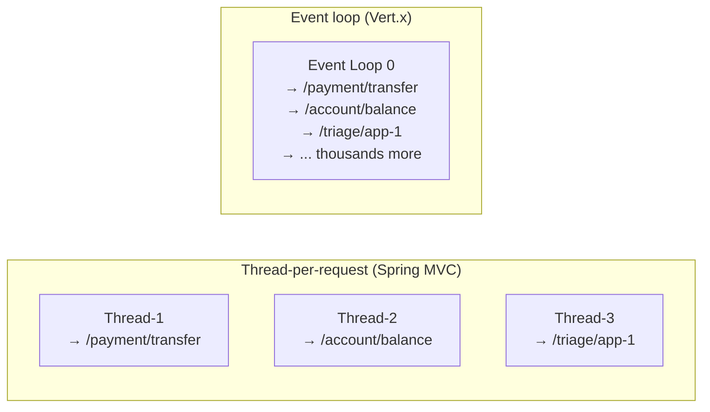
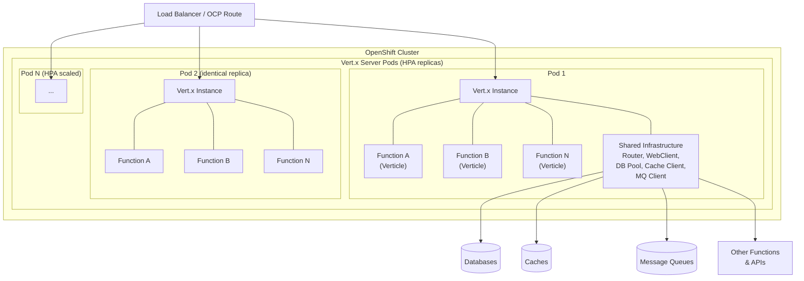
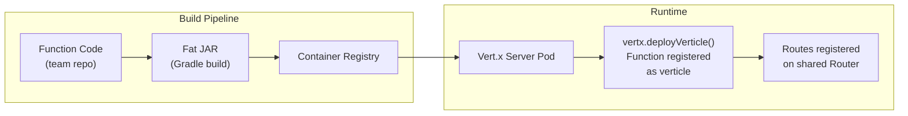
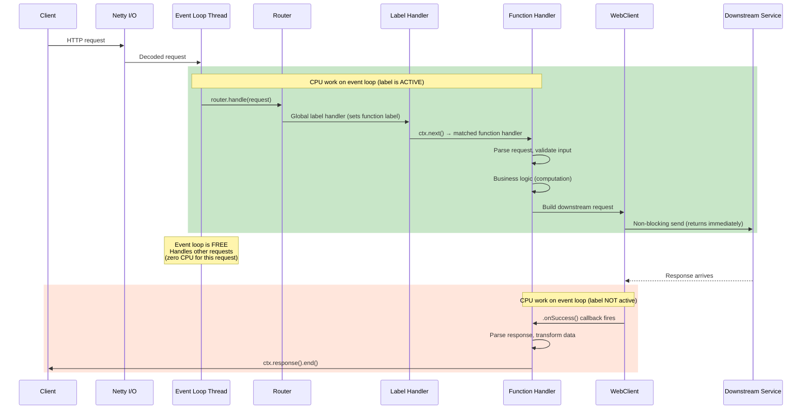
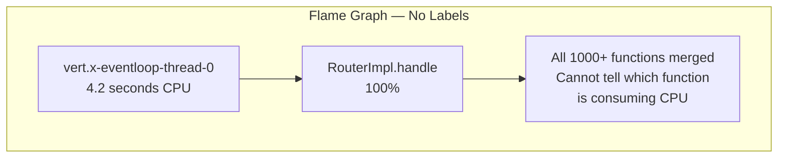
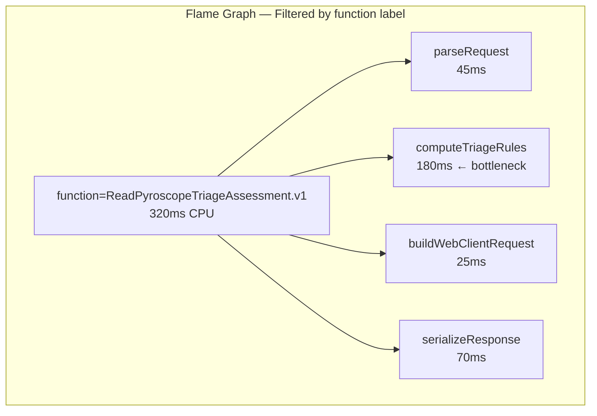
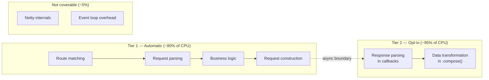
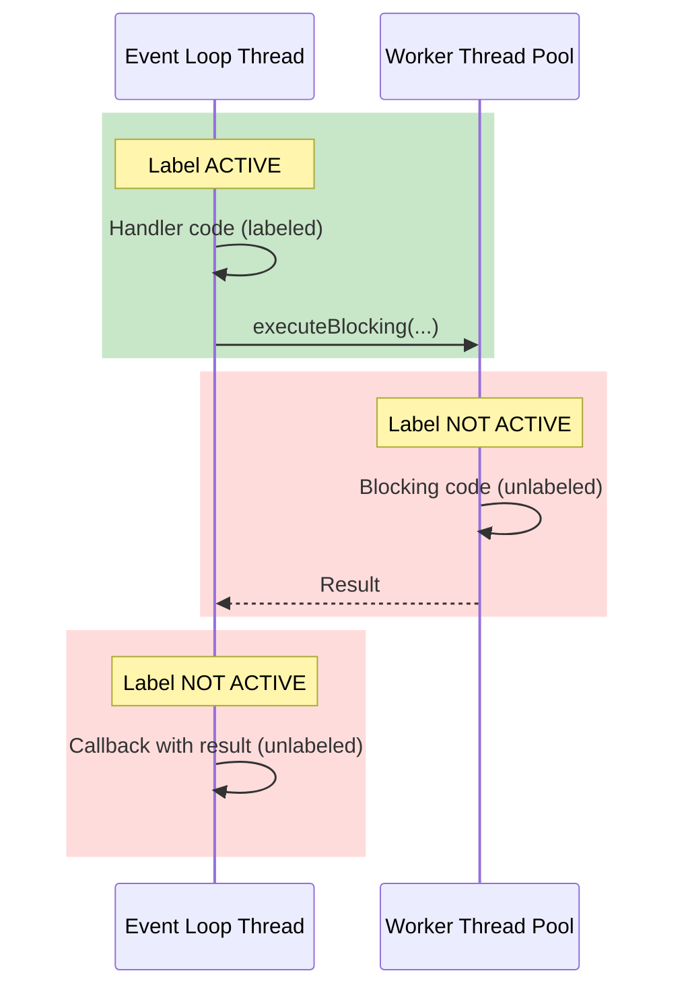
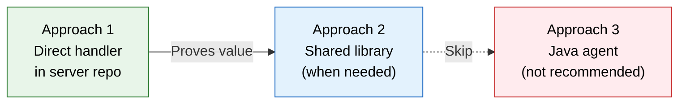

# Vert.x Profiling Labels — Component Guide and Labeling Strategy

Enterprise reference for Vert.x reactive server profiling with Pyroscope. Covers the
Vert.x component model, how each component appears in flame graphs, the labeling
strategy decision, and implementation approaches.

Target audience: platform engineers, function developers, and architects evaluating
profiling label strategies for Vert.x-based server platforms.

---

## Table of Contents

- [1. Vert.x for profiling engineers](#1-vertx-for-profiling-engineers)
- [2. Enterprise Vert.x architecture](#2-enterprise-vertx-architecture)
- [3. Vert.x components reference](#3-vertx-components-reference)
- [4. Request lifecycle](#4-request-lifecycle)
- [5. Why labels are required](#5-why-labels-are-required)
- [6. Labeling decision: one label (`function`)](#6-labeling-decision-one-label-function)
- [7. Synchronous vs async label coverage](#7-synchronous-vs-async-label-coverage)
- [8. executeBlocking visibility](#8-executeblocking-visibility)
- [9. Three implementation approaches](#9-three-implementation-approaches)
- [10. Best practices](#10-best-practices)
- [11. Cross-references](#11-cross-references)

---

## 1. Vert.x for profiling engineers

### What is Vert.x

Eclipse Vert.x is a reactive, non-blocking application framework for the JVM. Unlike
traditional thread-per-request frameworks (Spring MVC, JAX-RS), Vert.x uses a small
pool of **event loop threads** (typically 2x CPU cores) to handle all incoming requests
concurrently. No request gets its own thread.

### Why this matters for profiling

In a thread-per-request framework, a profiler can group CPU samples by thread name —
each thread maps to one request. In Vert.x, all requests share the same few threads:



**Thread-per-request:** The flame graph naturally shows "Thread-1 spent 200ms in
`processPayment()`" — you know which endpoint is responsible.

**Event loop:** The flame graph shows "Event Loop 0 spent 4 seconds in CPU" — but
which of the thousands of functions caused it? Impossible to tell without labels.

This is not a Pyroscope limitation. It affects **all profilers** (async-profiler, JFR,
YourKit, VisualVM) when used with event-loop frameworks. The Vert.x threading model
is fundamentally incompatible with thread-based attribution.

### What profiling labels solve

Pyroscope labels replace thread identity as the grouping mechanism. A label handler
tags each request's CPU samples with metadata (e.g., function name), restoring the
per-request visibility that thread-per-request frameworks provide for free.

---

## 2. Enterprise Vert.x architecture

### Server platform model

In an enterprise deployment, the Vert.x server is a **shared platform** maintained
by a central team. Function teams build their business logic as verticles (JARs) and
deploy them onto the shared server.



**Key characteristics:**

- **Shared Vert.x instance:** One JVM process hosts hundreds to thousands of verticles
- **HPA replicas:** Identical pods scaled horizontally — every replica runs the same set of functions
- **Central server repo:** Platform team maintains the server, infrastructure modules, and shared libraries
- **Function repos:** Teams write function code, build JARs, deploy as verticles onto the shared server
- **Shared infrastructure:** Database clients, cache clients, message queue clients, HTTP clients, health checks, and metrics are shared across all functions

### Function deployment model



Functions are discovered and deployed at server startup. Each function registers its
routes on the shared Router. The server exposes a single HTTP port — all function
endpoints are served through the same Router and event loop threads.

---

## 3. Vert.x components reference

Every Vert.x component listed below appears in flame graphs when it consumes CPU.
Understanding what each component does helps interpret profiling data — you can see
*which Vert.x component* is the bottleneck from the stack frame class names, even
without a label for it.

### Core runtime

| Component | What it does | Flame graph class pattern | Profiling notes |
|-----------|-------------|--------------------------|-----------------|
| **Vertx** | Singleton runtime — manages event loops, worker pool, timers, deployment | `io.vertx.core.impl.VertxImpl` | Top-level container. Event loop thread count = 2x CPU cores by default. |
| **Event Loop** | Non-blocking thread that handles all I/O and request processing | `io.vertx.core.impl.EventLoopContext` | A few threads handle all requests. Hot event loops indicate load imbalance or blocking code. |
| **Verticle** | Unit of deployment — each function is a verticle with its own lifecycle | Your verticle class name | Deployed via `vertx.deployVerticle()`. Has start/stop lifecycle. One or many per Vert.x instance. |
| **Context** | Per-verticle execution context — ties a verticle to its event loop | `io.vertx.core.impl.ContextImpl` | Ensures a verticle's handlers always run on the same event loop thread. |

### HTTP layer

| Component | What it does | Flame graph class pattern | Profiling notes |
|-----------|-------------|--------------------------|-----------------|
| **HttpServer** | Accepts inbound HTTP connections, TLS termination, request parsing | `io.vertx.core.http.impl.HttpServerImpl` | Low CPU typically. High CPU here indicates TLS overhead or connection storm. |
| **Router** | Matches HTTP request paths to handler functions | `io.vertx.ext.web.impl.RouterImpl` | Ordered handler chain. Global handlers run first, then route-specific. This is where the label handler registers. |
| **Route** | A single path pattern + handler binding | `io.vertx.ext.web.impl.RouteImpl` | Pattern matching (exact, parameterized, regex). Many routes = linear scan cost. |
| **RoutingContext** | Per-request state container — holds request, response, and arbitrary key-value data | `io.vertx.ext.web.impl.RoutingContextImpl` | Labels are stored here via `ctx.put()` for async propagation. Lives for the duration of one request. |
| **Handler** | A function that processes a RoutingContext | Your handler method name | The actual business logic. Synchronous code in the handler = where labels are active. |
| **BodyHandler** | Parses request body (JSON, form data, multipart) | `io.vertx.ext.web.handler.impl.BodyHandlerImpl` | CPU cost scales with payload size. Large request bodies appear here. |

### HTTP client (outbound)

| Component | What it does | Flame graph class pattern | Profiling notes |
|-----------|-------------|--------------------------|-----------------|
| **WebClient** | Non-blocking HTTP client for calling downstream services | `io.vertx.ext.web.client.impl.WebClientBase` | Request construction is synchronous (labeled). Response callbacks are async (unlabeled without Tier 2). |
| **HttpRequest** | Builder for an outbound HTTP request (headers, query params, body) | `io.vertx.ext.web.client.impl.HttpRequestImpl` | CPU here = building the request. Typically lightweight. |
| **HttpResponse** | Response from a downstream service | `io.vertx.ext.web.client.impl.HttpResponseImpl` | CPU here = parsing the response body. JSON parsing of large responses can be significant. |
| **ConnectionPool** | Manages persistent HTTP connections to downstream services | `io.vertx.core.http.impl.pool.*` | Connection reuse reduces TLS handshake overhead. Pool exhaustion causes queuing. |

### Async primitives

| Component | What it does | Flame graph class pattern | Profiling notes |
|-----------|-------------|--------------------------|-----------------|
| **Future** | Represents the result of an async operation | `io.vertx.core.impl.future.FutureImpl` | `.compose()`, `.map()`, `.onSuccess()` = async boundaries where labels are lost. |
| **Promise** | Writable side of a Future — completed by async code | `io.vertx.core.impl.future.PromiseImpl` | Used in `executeBlocking` and custom async operations. |
| **CompositeFuture** | Executes multiple Futures in parallel and joins results | `io.vertx.core.impl.future.CompositeFutureImpl` | Fan-out pattern for parallel downstream calls. Setup code is labeled; result callbacks are not. |

### Data serialization

| Component | What it does | Flame graph class pattern | Profiling notes |
|-----------|-------------|--------------------------|-----------------|
| **JsonObject** | Vert.x JSON object (wraps a Map) | `io.vertx.core.json.JsonObject` | `encode()` and `new JsonObject(string)` are common CPU hotspots. Large payloads = significant CPU. |
| **JsonArray** | Vert.x JSON array (wraps a List) | `io.vertx.core.json.JsonArray` | Same as JsonObject. Iteration over large arrays appears in profiles. |
| **Jackson** | Underlying JSON parser/serializer | `com.fasterxml.jackson.core.*` | JsonObject delegates to Jackson. Deep stack frames in Jackson indicate serialization bottlenecks. |

### Inter-verticle communication

| Component | What it does | Flame graph class pattern | Profiling notes |
|-----------|-------------|--------------------------|-----------------|
| **EventBus** | Asynchronous messaging between verticles (request-reply, pub-sub) | `io.vertx.core.eventbus.impl.EventBusImpl` | Labels do NOT propagate across EventBus messages. Each consumer runs in its own context. |
| **MessageCodec** | Serializes/deserializes EventBus messages | `io.vertx.core.eventbus.impl.CodecManager` | CPU cost of message encoding/decoding. Custom codecs can reduce this. |
| **Clustered EventBus** | EventBus across multiple JVMs (Hazelcast, Infinispan) | `io.vertx.spi.cluster.*` | Network serialization overhead. Visible in profiles during cross-node messaging. |

### Data clients

| Component | What it does | Flame graph class pattern | Profiling notes |
|-----------|-------------|--------------------------|-----------------|
| **Reactive SQL Client** | Non-blocking database access (PostgreSQL, Oracle, MySQL) | `io.vertx.sqlclient.*`, `io.vertx.pgclient.*` | Query construction is synchronous (labeled). Result set processing in callbacks is async (unlabeled). |
| **Redis Client** | Non-blocking cache access | `io.vertx.redis.client.*` | Command construction labeled; response parsing in callbacks unlabeled. |
| **Kafka Client** | Non-blocking message producer/consumer | `io.vertx.kafka.client.*` | Produce is labeled (synchronous send construction). Consume callbacks are unlabeled (triggered by broker push). |
| **AMQP / JMS Client** | Message queue integration | `io.vertx.amqp.*`, JMS bridge | Same labeled/unlabeled split as Kafka. |

### Resilience and operations

| Component | What it does | Flame graph class pattern | Profiling notes |
|-----------|-------------|--------------------------|-----------------|
| **Circuit Breaker** | Protects against downstream failures (open/half-open/closed states) | `io.vertx.circuitbreaker.*` | State transition logic. Open circuit = fast-fail (low CPU). Half-open = probe requests visible. |
| **Health Check** | Readiness and liveness probes for Kubernetes/OCP | `io.vertx.ext.healthchecks.*` | Low CPU. Appears in profiles during probe requests from the platform. |
| **Timeout** | Request/operation timeout handling | `io.vertx.core.impl.VertxImpl.setTimer` | Timer-based. Timeout callbacks fire on the event loop. |
| **Rate Limiter** | Throttles request rate per client or globally | Custom or `io.vertx.ext.web.handler.impl.*` | Token bucket or leaky bucket algorithms. Low CPU unless under extreme load. |

### Worker pool and blocking

| Component | What it does | Flame graph class pattern | Profiling notes |
|-----------|-------------|--------------------------|-----------------|
| **Worker Pool** | Separate thread pool for blocking operations | `io.vertx.core.impl.WorkerPool` | `executeBlocking()` runs code here. **Different thread = labels from event loop do not carry over.** |
| **Worker Verticle** | A verticle deployed on the worker pool instead of event loop | Verticle class on worker thread | All handlers run on worker threads. Blocking-safe but no event loop label propagation. |
| **executeBlocking** | Runs a blocking operation on the worker pool from event loop code | `io.vertx.core.impl.ContextImpl.executeBlocking` | Moves work off the event loop. Labels must be explicitly re-applied inside the blocking lambda. |

### Network internals

| Component | What it does | Flame graph class pattern | Profiling notes |
|-----------|-------------|--------------------------|-----------------|
| **Netty** | Underlying network I/O engine (NIO, epoll, kqueue) | `io.netty.channel.*`, `io.netty.buffer.*` | Framework internals. Not attributable to specific requests. High CPU in Netty = network bottleneck. |
| **SSL/TLS Engine** | TLS handshake and encryption | `io.netty.handler.ssl.*`, `sun.security.ssl.*` | TLS handshake CPU is per-connection, not per-request. Connection pooling reduces this. |
| **ByteBuf** | Netty's buffer management (allocation, pooling, reference counting) | `io.netty.buffer.PooledByteBufAllocator` | Memory allocation hotspot. Pooled allocators reduce GC pressure. |

---

## 4. Request lifecycle

How a request flows through Vert.x components. CPU work happens on the event loop
thread — both in the synchronous handler path and in async callbacks.



### Where CPU work happens

Even in a fully reactive framework, real CPU work runs **synchronously on the event
loop thread**. "Synchronous" here does not mean blocking — it means code that executes
directly before the first async boundary (e.g., `.send()`, `.compose()`).

| Phase | What happens | CPU work | Label active? |
|-------|-------------|----------|:-------------:|
| Route matching | Router scans registered routes for a path match | Low | Yes |
| Label handler | Global handler sets the `function` label via Pyroscope API | Negligible | Yes (this is what sets the label) |
| Request parsing | JSON body parsing, parameter extraction, validation | Medium | Yes |
| Business logic | Computation, rule evaluation, data transformation | Can be high | Yes |
| Request construction | Building the outbound HTTP/DB/cache/MQ request | Low | Yes |
| **Async boundary** | `.send()`, `.execute()` — returns immediately | None | — |
| I/O wait | Network round-trip to downstream service | Zero (non-blocking) | N/A |
| Response callback | `.onSuccess()`, `.compose()`, `.map()` — processes response | Variable | **No** |
| Response send | `ctx.response().end()` — write response to client | Low | **No** |

The label covers the **synchronous portion** — typically ~80% of total CPU work for
a request. The async callback portion is unlabeled unless Tier 2 propagation is used.

---

## 5. Why labels are required

### Without labels

A flame graph for the Vert.x server shows all functions merged on the event loop threads:



**This is useless.** You can see that the server is spending CPU, but you cannot
identify which of the 1000+ functions is responsible.

### With labels

Filter by `{function="ReadPyroscopeTriageAssessment.v1"}` and the flame graph shows
only that function's CPU:



**Now actionable.** The triage function is spending 56% of its CPU in rule computation —
the team can investigate and optimize.

---

## 6. Labeling decision: one label (`function`)

### The label

| Label | Source | Example value | Purpose |
|-------|--------|---------------|---------|
| `function` | Resolved at request time from the matched verticle/route | `ReadPyroscopeTriageAssessment.v1` | Identify which function is consuming CPU |

### Why one label

At enterprise scale (1000+ functions), each label multiplies the number of profiling
series. Series count directly impacts Pyroscope storage and query performance.

**Series explosion formula:**

```
total_series = unique_function_values × unique_label2_values × unique_label3_values × ...
```

| Labels | Unique values | Total series | Storage impact (30-day retention) |
|--------|:------------:|:------------:|:---------------------------------:|
| `function` only | 1,000 | 1,000 | ~3 TB |
| `function` + `endpoint` | 1,000 × 5 | 5,000 | ~15 TB |
| `function` + `endpoint` + `http.method` | 1,000 × 5 × 4 | 20,000 | ~60 TB |

One label keeps series count manageable. Additional labels can be added later —
adding a label is a non-breaking change (existing profiles remain queryable).

### What was considered and deferred

| Label | Why considered | Why deferred |
|-------|---------------|--------------|
| `endpoint` | Per-endpoint CPU attribution | Each function has few endpoints; `function` is sufficient to narrow scope. Add later if needed. |
| `component` | Identify Vert.x component (Router, WebClient, etc.) | Already visible from flame graph stack frame class names. A label would be redundant. |
| `http.method` | Distinguish GET/POST/PUT | Low diagnostic value at this scale. Add later if needed. |
| `downstream` | Identify which dependency is slow | Requires Tier 2 label propagation into async callbacks. Phase 2 enhancement. |
| `verticle` | Identify by verticle class name | Equivalent to `function` in most deployments. Chose `function` as it's more meaningful to teams. |

### How to add labels later

The label handler can be updated to set additional labels without changing any function
code. Existing profiles with the old label set remain queryable — Pyroscope treats
label sets additively.

---

## 7. Synchronous vs async label coverage

### How labels work in Vert.x

Pyroscope labels use Java `ThreadLocal` storage. The label handler calls
`LabelsWrapper.run(labels, () -> ctx.next())` which:

1. Sets the label on the current thread (event loop)
2. Executes the handler chain (synchronous path)
3. Clears the label when the handler returns

The label is **active** for all code that runs synchronously within the handler chain.
It is **not active** for async callbacks that fire later on the same event loop thread
(because the `ThreadLocal` has been cleared by then).

### Coverage model



**Tier 1 (automatic, zero code changes):**
The global label handler covers all synchronous code on the event loop — route
matching, request parsing, validation, business logic, and outbound request
construction. This is typically ~80% of CPU work because:
- Network I/O waiting is non-blocking (zero CPU — nothing to profile)
- Async callbacks are often lightweight (move data from buffer to response)

**Tier 2 (opt-in, per-call-site):**
When a function does heavy computation inside async callbacks (e.g., parsing large
JSON responses, running scoring algorithms on response data), the async portion can
be labeled by wrapping the async call with a label-propagating Future wrapper. This
extends coverage to ~95%.

**Not coverable (~5%):**
Netty internals, event loop scheduling overhead, and timer callbacks are framework
code not attributable to specific requests. This is an industry-wide limitation of
all profilers with event-loop frameworks.

### When Tier 2 is needed

Tier 2 is only necessary when profiling reveals significant CPU in async callbacks
that cannot be attributed to a specific function. Start with Tier 1 — most functions
will have sufficient visibility.

---

## 8. executeBlocking visibility

### The problem

When a function uses `executeBlocking()`, the blocking code runs on a **worker thread**,
not the event loop thread. Since Pyroscope labels use `ThreadLocal`, the label set by
the event loop handler does **not** carry over to the worker thread.



### Why this matters

`executeBlocking` in a reactive server is noteworthy — it means something is
intentionally blocking the worker pool (legacy library, file I/O, CPU-intensive
computation that would starve the event loop). Profiling should make these visible
so the platform team can:

1. **Verify intent:** Confirm the blocking code is supposed to be there
2. **Measure impact:** See how much CPU the blocking code consumes
3. **Identify candidates for refactoring:** Blocking code that could be replaced with non-blocking alternatives

### Labeling strategy for executeBlocking

The label can be explicitly re-applied inside the blocking lambda. This is not
automatic — it requires the function author to wrap their blocking code. The platform
team can provide a utility method that captures the current label and re-applies it:

```
captureLabels()  →  re-applies inside executeBlocking lambda
```

Alternatively, the platform team can search the codebase for `executeBlocking` usage
and flag each occurrence for review. This is a governance exercise, not a labeling
exercise — the goal is to know where blocking code exists and ensure it's intentional.

---

## 9. Three implementation approaches

### Approach 1: Direct handler in enterprise Vert.x server repo

**What:** Add a global `router.route().handler()` in the server startup code that
sets the `function` label for every request.

**Where:** In the server's main Router initialization, before all function routes
are registered.

**Effort:** ~15 lines of code, one pull request to the server repo.

**Dependency:** `compileOnly` on `io.pyroscope:agent` (the Pyroscope labels API).

| Advantage | Detail |
|-----------|--------|
| Fastest to implement | One PR, one reviewer, deployed in next release |
| Zero function team impact | No changes to any function code |
| No new dependencies | compileOnly — not bundled in the server JAR |
| Graceful degradation | NoClassDefFoundError caught when agent not attached |

| Limitation | Detail |
|------------|--------|
| Not reusable | Label logic is embedded in the server repo |
| No Tier 2 | Only covers synchronous path; no async propagation |
| Single repo | If other Vert.x servers exist, each needs its own handler |

**Recommendation:** Start here. Proves value immediately.

---

### Approach 2: Shared label handler library

**What:** Extract the label handler into a small, versioned library JAR that any
Vert.x server can depend on. The library provides:
- A label handler (Tier 1) — one line to register
- A Future wrapper (Tier 2) — opt-in per async call site

**Where:** Published to an internal Maven/Gradle repository. Server repo adds it as
a dependency.

**Effort:** Create library (1-2 days), publish, integrate into server repo.

| Advantage | Detail |
|-----------|--------|
| Reusable | Any Vert.x server can use it |
| Version-controlled | Updates ship as dependency bumps, not code changes |
| Includes Tier 2 | Async propagation available when needed |
| Consistent | Same labeling behavior across all servers |

| Limitation | Detail |
|------------|--------|
| New dependency | Requires publishing to internal Maven repo |
| Approval | Server repo adds a new dependency (review required) |
| More setup | Library creation, CI/CD, versioning |

**Recommendation:** Adopt after Approach 1 proves value, or when a second Vert.x
server needs labeling.

---

### Approach 3: Custom Java agent (bytecode instrumentation)

**What:** A separate `-javaagent` JAR that uses bytecode manipulation (e.g., ByteBuddy)
to automatically intercept Vert.x `Router.handle()` and inject labels without any
application code changes.

**Effort:** Weeks of development, ongoing maintenance across Vert.x versions.

| Advantage | Detail |
|-----------|--------|
| Truly zero code changes | No handler registration, no dependency |
| Automatic | Works for any Vert.x application |

| Limitation | Detail |
|------------|--------|
| JNI overhead | Bytecode weaving adds measurable latency per request |
| Fragile | Breaks across Vert.x minor versions when internals change |
| Hard to debug | Bytecode errors manifest as mysterious runtime failures |
| Rejected by community | async-profiler project attempted this and abandoned it due to overhead |
| Two agents | Pyroscope agent + custom agent = interaction risks |

**Recommendation:** Not recommended. Documented for decision context only.

The async-profiler project proposed a similar JVM-level approach for reactive
frameworks and **closed it without merging** due to JNI overhead concerns. The
Pyroscope Java agent maintainer confirmed there is no automatic solution for label
propagation across async boundaries. Handler-based labeling (Approaches 1 and 2) is
the industry-accepted pattern.

---

### Decision summary



---

## 10. Best practices

### Cardinality management

Every unique label value creates a separate profiling series in Pyroscope. At 1000+
functions, cardinality is the primary concern.

| Rule | Guidance |
|------|----------|
| **Keep total series under 10,000** | At 3 GB/series/month, 10,000 series = 30 TB/month |
| **Use stable, enumerable values** | Function names are known at deploy time — bounded cardinality |
| **Never use request-scoped values** | Request IDs, user IDs, timestamps = unbounded cardinality = storage explosion |
| **Measure before adding labels** | Check current series count before adding a second label |

### Naming conventions

| Convention | Example | Why |
|------------|---------|-----|
| Use the function's canonical name | `ReadPyroscopeTriageAssessment.v1` | Matches what teams already use to identify functions |
| Include version if relevant | `.v1`, `.v2` | Enables before/after comparison across versions |
| Use dot-separated names | `ReadPyroscope.TriageAssessment` | Consistent with Java package naming |
| Avoid spaces, special characters | `triage-assessment` not `Triage Assessment!` | Label values are used in query syntax |

### What NOT to label

| Bad label | Why | Cardinality |
|-----------|-----|-------------|
| `request_id=abc-123-def` | Unique per request — unbounded | Millions |
| `user_id=12345` | Unique per user — unbounded | Thousands-millions |
| `timestamp=1711900800` | Unique per second — unbounded | Unbounded |
| `trace_id=abc123` | Unique per trace — unbounded | Millions |
| `payload_hash=sha256:...` | Unique per request body — unbounded | Millions |

### Observability alignment

Align label naming with your existing observability stack:

| Concern | Alignment |
|---------|-----------|
| **Prometheus metrics** | Use the same function name in Prometheus labels so you can correlate profiling data with metrics |
| **Grafana dashboards** | Template variables should match label values so dashboards can filter both metrics and profiles |
| **OpenTelemetry traces** | If span names match function names, future span-profiling integration becomes possible |
| **Alerting** | Alert rules that reference function names should use the same naming as the profiling label |

### Storage impact estimation

```
monthly_storage = series_count × retention_days / 30 × 3 GB

Example:
  1,000 functions × 30 days / 30 × 3 GB = 3 TB/month
  1,000 functions × 7 days / 30 × 3 GB = 700 GB/month
```

Shorter retention dramatically reduces storage. See
[capacity-planning.md](capacity-planning.md) for detailed sizing.

---

## 11. Cross-references

| Document | Relevance |
|----------|-----------|
| [async-profiling-guide.md](async-profiling-guide.md) | Labeling implementation details, LabeledFuture (Tier 2), two-tier architecture |
| [labeling-analysis-prompt.md](labeling-analysis-prompt.md) | AI copilot prompt for analyzing the Vert.x server codebase |
| [configuration-reference.md](configuration-reference.md) | Pyroscope agent properties and environment variables |
| [capacity-planning.md](capacity-planning.md) | Storage sizing and series count impact |
| [architecture.md](architecture.md) | Deployment topology diagrams |
| [code-to-profiling-guide.md](code-to-profiling-guide.md) | How source code maps to flame graph frames |
