# Vert.x Profiling Labels — Component Guide and Labeling Strategy

Enterprise reference for Vert.x reactive server profiling with Pyroscope. Covers the
Vert.x component model, how each component appears in flame graphs, the labeling
strategy decision, and implementation approaches.

Target audience: platform engineers, function developers, and architects evaluating
profiling label strategies for Vert.x-based server platforms.

---

## Table of Contents

- [1. Vert.x for profiling engineers](#1-vertx-for-profiling-engineers)
- [2. Enterprise Vert.x architecture](#2-enterprise-vertx-architecture)
- [3. Vert.x components reference](#3-vertx-components-reference)
- [4. Request lifecycle](#4-request-lifecycle)
- [5. Why labels are required](#5-why-labels-are-required)
- [6. Labeling decision: one label (`function`)](#6-labeling-decision-one-label-function)
- [7. Synchronous vs async label coverage](#7-synchronous-vs-async-label-coverage)
- [8. executeBlocking visibility](#8-executeblocking-visibility)
- [9. Implementation approaches and risk analysis](#9-implementation-approaches-and-risk-analysis)
  - [9a. Approach overview](#9a-approach-overview)
  - [9b. Approach 1: Direct handler in server repo](#9b-approach-1-direct-handler-in-enterprise-vertx-server-repo)
  - [9c. Approach 2: Shared label handler library](#9c-approach-2-shared-label-handler-library-separate-repo)
  - [9d. Approach 3: Custom Java agent (not recommended)](#9d-approach-3-custom-java-agent-bytecode-instrumentation)
  - [9e. Decision summary](#9e-decision-summary)
  - [9f. Making the case for the server repo PR](#9f-making-the-case-for-the-server-repo-pr)
- [10. Best practices](#10-best-practices)
- [11. Cross-references](#11-cross-references)

---

## 1. Vert.x for profiling engineers

### What is Vert.x

Eclipse Vert.x is a reactive, non-blocking application framework for the JVM. Unlike
traditional thread-per-request frameworks (Spring MVC, JAX-RS), Vert.x uses a small
pool of **event loop threads** (typically 2x CPU cores) to handle all incoming requests
concurrently. No request gets its own thread.

### Why this matters for profiling

In a thread-per-request framework, a profiler can group CPU samples by thread name —
each thread maps to one request. In Vert.x, all requests share the same few threads:

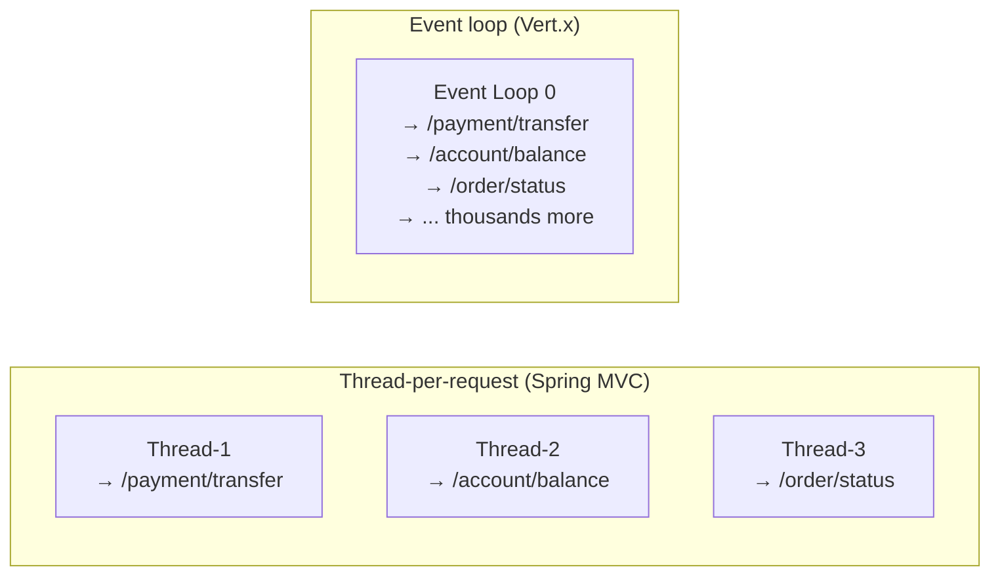

**Thread-per-request:** The flame graph naturally shows "Thread-1 spent 200ms in
`processPayment()`" — you know which endpoint is responsible.

**Event loop:** The flame graph shows "Event Loop 0 spent 4 seconds in CPU" — but
which of the thousands of functions caused it? Impossible to tell without labels.

This is not a Pyroscope limitation. It affects **all profilers** (async-profiler, JFR,
YourKit, VisualVM) when used with event-loop frameworks. The Vert.x threading model
is fundamentally incompatible with thread-based attribution.

### What profiling labels solve

Pyroscope labels replace thread identity as the grouping mechanism. A label handler
tags each request's CPU samples with metadata (e.g., function name), restoring the
per-request visibility that thread-per-request frameworks provide for free.

---

## 2. Enterprise Vert.x architecture

### Server platform model

In an enterprise deployment, the Vert.x server is a **shared platform** maintained
by a central team. Function teams build their business logic as verticles (JARs) and
deploy them onto the shared server.

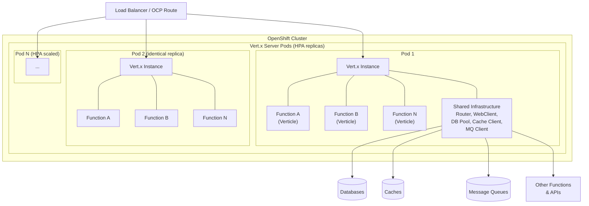

**Key characteristics:**

- **Shared Vert.x instance:** One JVM process hosts hundreds to thousands of verticles
- **HPA replicas:** Identical pods scaled horizontally — every replica runs the same set of functions
- **Central server repo:** Platform team maintains the server, infrastructure modules, and shared libraries
- **Function repos:** Teams write function code, build JARs, deploy as verticles onto the shared server
- **Shared infrastructure:** Database clients, cache clients, message queue clients, HTTP clients, health checks, and metrics are shared across all functions

### Typical enterprise function patterns

Enterprise functions on a shared Vert.x server follow common integration patterns.
Each pattern has different CPU characteristics in the flame graph:

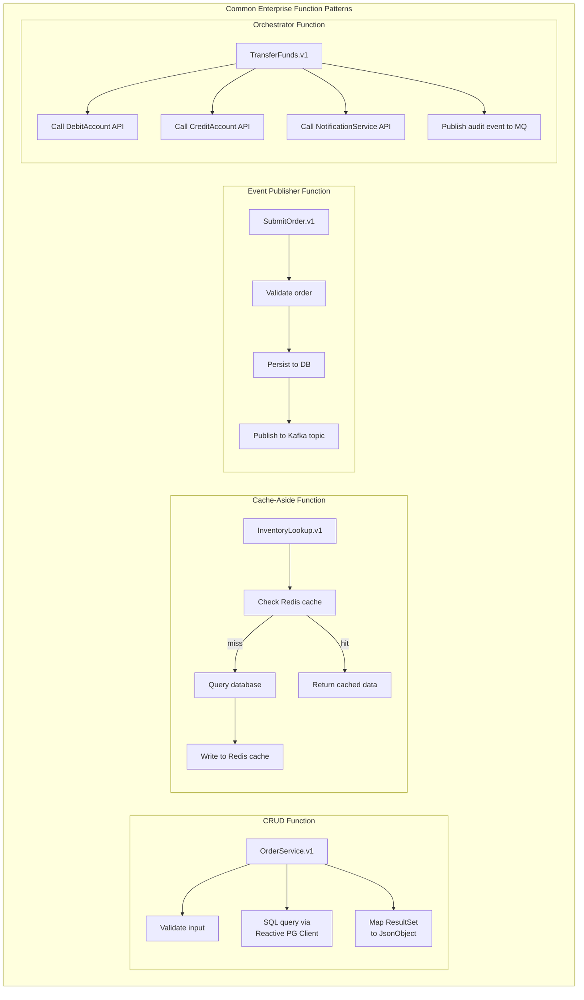

### CPU distribution by pattern

Where CPU time is spent varies by function pattern. This determines how much value
the profiling label provides:

| Pattern | Synchronous CPU (labeled) | Async CPU (unlabeled) | Label value |
|---------|:-------------------------:|:---------------------:|:-----------:|
| **CRUD** (DB read/write) | 70-90% — validation, query construction, result mapping | 10-30% — response parsing | High |
| **Cache-aside** (Redis + DB) | 60-80% — cache key construction, query build, serialization | 20-40% — cache/DB response parsing | High |
| **Event publisher** (Kafka/MQ) | 80-95% — validation, persistence, message construction | 5-20% — publish acknowledgment | Very high |
| **Orchestrator** (fan-out API calls) | 40-60% — request construction for each downstream call | 40-60% — response parsing from each call | Medium (Tier 2 needed) |
| **Compute-heavy** (in-memory processing) | 90-100% — algorithm runs synchronously on event loop | 0-10% | Very high |
| **Gateway/proxy** (pass-through) | 20-40% — header manipulation, routing | 60-80% — response forwarding | Low (Tier 2 needed) |

### Function deployment model

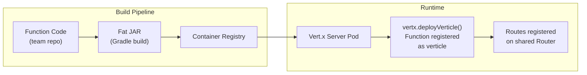

Functions are discovered and deployed at server startup. Each function registers its
routes on the shared Router. The server exposes a single HTTP port — all function
endpoints are served through the same Router and event loop threads.

---

## 3. Vert.x components reference

Every Vert.x component listed below appears in flame graphs when it consumes CPU.
Understanding what each component does helps interpret profiling data — you can see
*which Vert.x component* is the bottleneck from the stack frame class names, even
without a label for it.

### Core runtime

| Component | What it does | Flame graph class pattern | Profiling notes |
|-----------|-------------|--------------------------|-----------------|
| **Vertx** | Singleton runtime — manages event loops, worker pool, timers, deployment | `io.vertx.core.impl.VertxImpl` | Top-level container. Event loop thread count = 2x CPU cores by default. |
| **Event Loop** | Non-blocking thread that handles all I/O and request processing | `io.vertx.core.impl.EventLoopContext` | A few threads handle all requests. Hot event loops indicate load imbalance or blocking code. |
| **Verticle** | Unit of deployment — each function is a verticle with its own lifecycle | Your verticle class name | Deployed via `vertx.deployVerticle()`. Has start/stop lifecycle. One or many per Vert.x instance. |
| **Context** | Per-verticle execution context — ties a verticle to its event loop | `io.vertx.core.impl.ContextImpl` | Ensures a verticle's handlers always run on the same event loop thread. |

### HTTP layer

| Component | What it does | Flame graph class pattern | Profiling notes |
|-----------|-------------|--------------------------|-----------------|
| **HttpServer** | Accepts inbound HTTP connections, TLS termination, request parsing | `io.vertx.core.http.impl.HttpServerImpl` | Low CPU typically. High CPU here indicates TLS overhead or connection storm. |
| **Router** | Matches HTTP request paths to handler functions | `io.vertx.ext.web.impl.RouterImpl` | Ordered handler chain. Global handlers run first, then route-specific. This is where the label handler registers. |
| **Route** | A single path pattern + handler binding | `io.vertx.ext.web.impl.RouteImpl` | Pattern matching (exact, parameterized, regex). Many routes = linear scan cost. |
| **RoutingContext** | Per-request state container — holds request, response, and arbitrary key-value data | `io.vertx.ext.web.impl.RoutingContextImpl` | Labels are stored here via `ctx.put()` for async propagation. Lives for the duration of one request. |
| **Handler** | A function that processes a RoutingContext | Your handler method name | The actual business logic. Synchronous code in the handler = where labels are active. |
| **BodyHandler** | Parses request body (JSON, form data, multipart) | `io.vertx.ext.web.handler.impl.BodyHandlerImpl` | CPU cost scales with payload size. Large request bodies appear here. |

### HTTP client (outbound)

| Component | What it does | Flame graph class pattern | Profiling notes |
|-----------|-------------|--------------------------|-----------------|
| **WebClient** | Non-blocking HTTP client for calling downstream services | `io.vertx.ext.web.client.impl.WebClientBase` | Request construction is synchronous (labeled). Response callbacks are async (unlabeled without Tier 2). |
| **HttpRequest** | Builder for an outbound HTTP request (headers, query params, body) | `io.vertx.ext.web.client.impl.HttpRequestImpl` | CPU here = building the request. Typically lightweight. |
| **HttpResponse** | Response from a downstream service | `io.vertx.ext.web.client.impl.HttpResponseImpl` | CPU here = parsing the response body. JSON parsing of large responses can be significant. |
| **ConnectionPool** | Manages persistent HTTP connections to downstream services | `io.vertx.core.http.impl.pool.*` | Connection reuse reduces TLS handshake overhead. Pool exhaustion causes queuing. |

### Async primitives

| Component | What it does | Flame graph class pattern | Profiling notes |
|-----------|-------------|--------------------------|-----------------|
| **Future** | Represents the result of an async operation | `io.vertx.core.impl.future.FutureImpl` | `.compose()`, `.map()`, `.onSuccess()` = async boundaries where labels are lost. |
| **Promise** | Writable side of a Future — completed by async code | `io.vertx.core.impl.future.PromiseImpl` | Used in `executeBlocking` and custom async operations. |
| **CompositeFuture** | Executes multiple Futures in parallel and joins results | `io.vertx.core.impl.future.CompositeFutureImpl` | Fan-out pattern for parallel downstream calls. Setup code is labeled; result callbacks are not. |

### Data serialization

| Component | What it does | Flame graph class pattern | Profiling notes |
|-----------|-------------|--------------------------|-----------------|
| **JsonObject** | Vert.x JSON object (wraps a Map) | `io.vertx.core.json.JsonObject` | `encode()` and `new JsonObject(string)` are common CPU hotspots. Large payloads = significant CPU. |
| **JsonArray** | Vert.x JSON array (wraps a List) | `io.vertx.core.json.JsonArray` | Same as JsonObject. Iteration over large arrays appears in profiles. |
| **Jackson** | Underlying JSON parser/serializer | `com.fasterxml.jackson.core.*` | JsonObject delegates to Jackson. Deep stack frames in Jackson indicate serialization bottlenecks. |

### Inter-verticle communication

| Component | What it does | Flame graph class pattern | Profiling notes |
|-----------|-------------|--------------------------|-----------------|
| **EventBus** | Asynchronous messaging between verticles (request-reply, pub-sub) | `io.vertx.core.eventbus.impl.EventBusImpl` | Labels do NOT propagate across EventBus messages. Each consumer runs in its own context. |
| **MessageCodec** | Serializes/deserializes EventBus messages | `io.vertx.core.eventbus.impl.CodecManager` | CPU cost of message encoding/decoding. Custom codecs can reduce this. |
| **Clustered EventBus** | EventBus across multiple JVMs (Hazelcast, Infinispan) | `io.vertx.spi.cluster.*` | Network serialization overhead. Visible in profiles during cross-node messaging. |

### Data clients

| Component | What it does | Flame graph class pattern | Profiling notes |
|-----------|-------------|--------------------------|-----------------|
| **Reactive SQL Client** | Non-blocking database access (PostgreSQL, Oracle, MySQL) | `io.vertx.sqlclient.*`, `io.vertx.pgclient.*` | Query construction is synchronous (labeled). Result set processing in callbacks is async (unlabeled). |
| **Redis Client** | Non-blocking cache access | `io.vertx.redis.client.*` | Command construction labeled; response parsing in callbacks unlabeled. |
| **Kafka Client** | Non-blocking message producer/consumer | `io.vertx.kafka.client.*` | Produce is labeled (synchronous send construction). Consume callbacks are unlabeled (triggered by broker push). |
| **AMQP / JMS Client** | Message queue integration | `io.vertx.amqp.*`, JMS bridge | Same labeled/unlabeled split as Kafka. |

### Resilience and operations

| Component | What it does | Flame graph class pattern | Profiling notes |
|-----------|-------------|--------------------------|-----------------|
| **Circuit Breaker** | Protects against downstream failures (open/half-open/closed states) | `io.vertx.circuitbreaker.*` | State transition logic. Open circuit = fast-fail (low CPU). Half-open = probe requests visible. |
| **Health Check** | Readiness and liveness probes for Kubernetes/OCP | `io.vertx.ext.healthchecks.*` | Low CPU. Appears in profiles during probe requests from the platform. |
| **Timeout** | Request/operation timeout handling | `io.vertx.core.impl.VertxImpl.setTimer` | Timer-based. Timeout callbacks fire on the event loop. |
| **Rate Limiter** | Throttles request rate per client or globally | Custom or `io.vertx.ext.web.handler.impl.*` | Token bucket or leaky bucket algorithms. Low CPU unless under extreme load. |

### Worker pool and blocking

| Component | What it does | Flame graph class pattern | Profiling notes |
|-----------|-------------|--------------------------|-----------------|
| **Worker Pool** | Separate thread pool for blocking operations | `io.vertx.core.impl.WorkerPool` | `executeBlocking()` runs code here. **Different thread = labels from event loop do not carry over.** |
| **Worker Verticle** | A verticle deployed on the worker pool instead of event loop | Verticle class on worker thread | All handlers run on worker threads. Blocking-safe but no event loop label propagation. |
| **executeBlocking** | Runs a blocking operation on the worker pool from event loop code | `io.vertx.core.impl.ContextImpl.executeBlocking` | Moves work off the event loop. Labels must be explicitly re-applied inside the blocking lambda. |

### Network internals

| Component | What it does | Flame graph class pattern | Profiling notes |
|-----------|-------------|--------------------------|-----------------|
| **Netty** | Underlying network I/O engine (NIO, epoll, kqueue) | `io.netty.channel.*`, `io.netty.buffer.*` | Framework internals. Not attributable to specific requests. High CPU in Netty = network bottleneck. |
| **SSL/TLS Engine** | TLS handshake and encryption | `io.netty.handler.ssl.*`, `sun.security.ssl.*` | TLS handshake CPU is per-connection, not per-request. Connection pooling reduces this. |
| **ByteBuf** | Netty's buffer management (allocation, pooling, reference counting) | `io.netty.buffer.PooledByteBufAllocator` | Memory allocation hotspot. Pooled allocators reduce GC pressure. |

---

## 4. Request lifecycle

How a request flows through Vert.x components. CPU work happens on the event loop
thread — both in the synchronous handler path and in async callbacks.

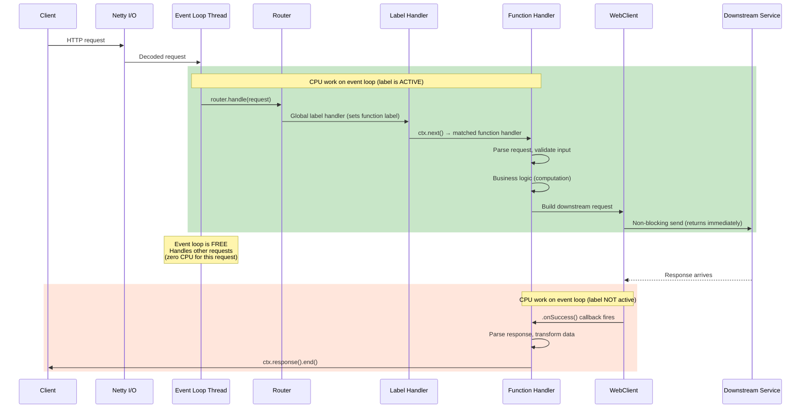

### Label coverage for a typical CRUD function

This sequence diagram shows a realistic enterprise function (order lookup with
cache and database) and exactly where the label is active vs inactive:

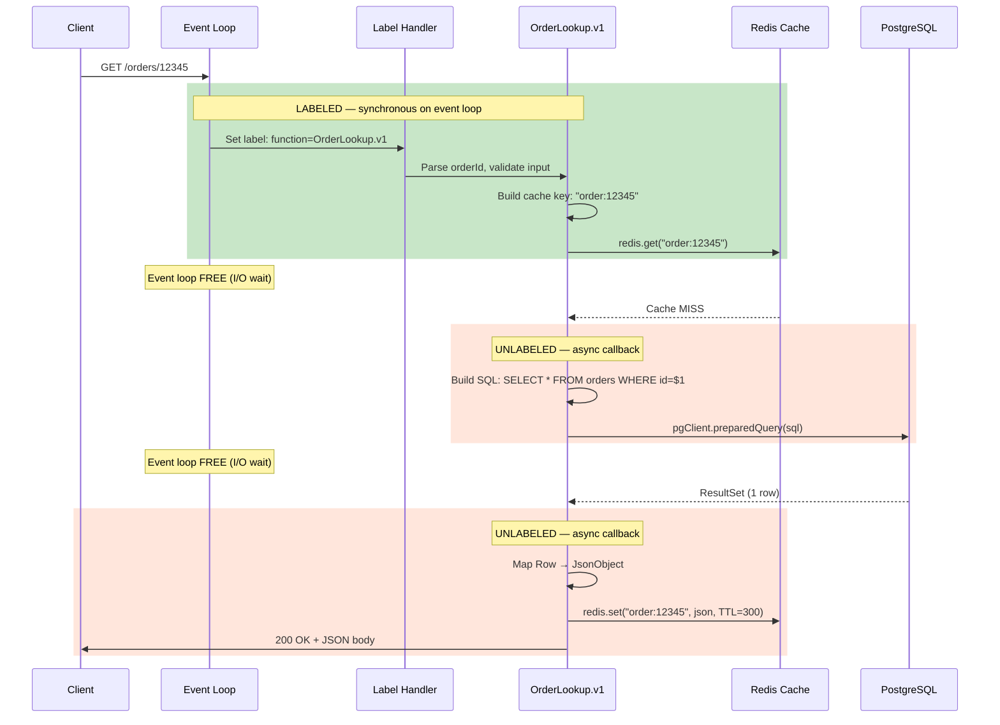

In this example, the labeled portion captures input validation, cache key
construction, and the initial cache lookup — typically the most CPU-intensive
synchronous work. The async callbacks (DB result mapping, cache write) are
unlabeled but usually lightweight. If profiling shows significant unlabeled CPU
in callbacks, Tier 2 propagation can be added.

### Where CPU work happens

Even in a fully reactive framework, real CPU work runs **synchronously on the event
loop thread**. "Synchronous" here does not mean blocking — it means code that executes
directly before the first async boundary (e.g., `.send()`, `.compose()`).

| Phase | What happens | CPU work | Label active? |
|-------|-------------|----------|:-------------:|
| Route matching | Router scans registered routes for a path match | Low | Yes |
| Label handler | Global handler sets the `function` label via Pyroscope API | Negligible | Yes (this is what sets the label) |
| Request parsing | JSON body parsing, parameter extraction, validation | Medium | Yes |
| Business logic | Computation, rule evaluation, data transformation | Can be high | Yes |
| Request construction | Building the outbound HTTP/DB/cache/MQ request | Low | Yes |
| **Async boundary** | `.send()`, `.execute()` — returns immediately | None | — |
| I/O wait | Network round-trip to downstream service | Zero (non-blocking) | N/A |
| Response callback | `.onSuccess()`, `.compose()`, `.map()` — processes response | Variable | **No** |
| Response send | `ctx.response().end()` — write response to client | Low | **No** |

The label covers the **synchronous portion** — typically ~80% of total CPU work for
a request. The async callback portion is unlabeled unless Tier 2 propagation is used.

---

## 4b. Shared event loop — why attribution is hard

Multiple functions with different dependency patterns share the same event loop
threads. Without labels, their CPU samples are indistinguishable:

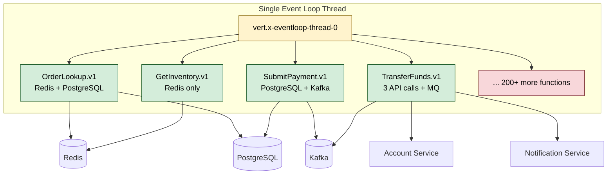

The flame graph for this event loop thread shows `JsonObject.encode()`, `PgClient.query()`,
`RedisAPI.get()`, and `KafkaProducer.send()` all merged into one stack — no way to tell
which function triggered which call. The `function` label solves this: filter by
`{function="SubmitPayment.v1"}` and only that function's DB + Kafka CPU is visible.

---

## 5. Why labels are required

### Without labels

A flame graph for the Vert.x server shows all functions merged on the event loop threads:

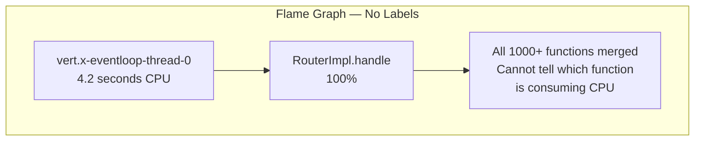

**This is useless.** You can see that the server is spending CPU, but you cannot
identify which of the 1000+ functions is responsible.

### With labels

Filter by `{function="SubmitPayment.v1"}` and the flame graph shows
only that function's CPU:

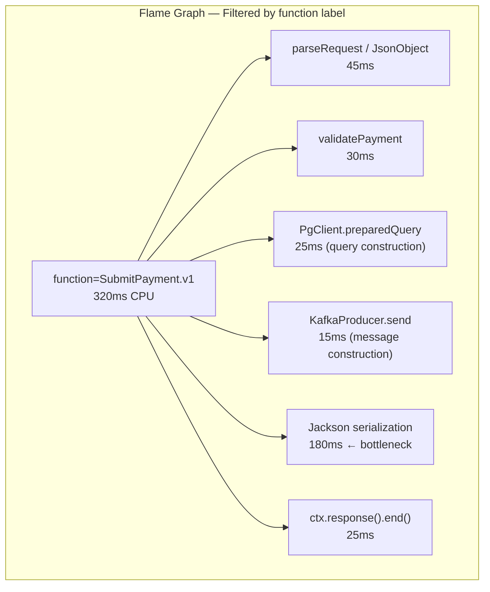

**Now actionable.** The payment function is spending 56% of its CPU in Jackson
serialization — the team can investigate switching to a more efficient format
or caching serialized responses.

---

## 6. Labeling decision: one label (`function`)

### The label

| Label | Source | Example value | Purpose |
|-------|--------|---------------|---------|
| `function` | Resolved at request time from the matched verticle/route | `SubmitPayment.v1` | Identify which function is consuming CPU |

### Why one label

At enterprise scale (1000+ functions), each label multiplies the number of profiling
series. Series count directly impacts Pyroscope storage and query performance.

**Series explosion formula:**

```
total_series = unique_function_values × unique_label2_values × unique_label3_values × ...
```

| Labels | Unique values | Total series | Storage impact (30-day retention) |
|--------|:------------:|:------------:|:---------------------------------:|
| `function` only | 1,000 | 1,000 | ~3 TB |
| `function` + `endpoint` | 1,000 × 5 | 5,000 | ~15 TB |
| `function` + `endpoint` + `http.method` | 1,000 × 5 × 4 | 20,000 | ~60 TB |

One label keeps series count manageable. Additional labels can be added later —
adding a label is a non-breaking change (existing profiles remain queryable).

### What was considered and deferred

| Label | Why considered | Why deferred |
|-------|---------------|--------------|
| `endpoint` | Per-endpoint CPU attribution | Each function has few endpoints; `function` is sufficient to narrow scope. Add later if needed. |
| `component` | Identify Vert.x component (Router, WebClient, etc.) | Already visible from flame graph stack frame class names. A label would be redundant. |
| `http.method` | Distinguish GET/POST/PUT | Low diagnostic value at this scale. Add later if needed. |
| `downstream` | Identify which dependency is slow | Requires Tier 2 label propagation into async callbacks. Phase 2 enhancement. |
| `verticle` | Identify by verticle class name | Equivalent to `function` in most deployments. Chose `function` as it's more meaningful to teams. |

### How to add labels later

The label handler can be updated to set additional labels without changing any function
code. Existing profiles with the old label set remain queryable — Pyroscope treats
label sets additively.

---

## 7. Synchronous vs async label coverage

### How labels work in Vert.x

Pyroscope labels use Java `ThreadLocal` storage. The label handler calls
`LabelsWrapper.run(labels, () -> ctx.next())` which:

1. Sets the label on the current thread (event loop)
2. Executes the handler chain (synchronous path)
3. Clears the label when the handler returns

The label is **active** for all code that runs synchronously within the handler chain.
It is **not active** for async callbacks that fire later on the same event loop thread
(because the `ThreadLocal` has been cleared by then).

### Coverage model

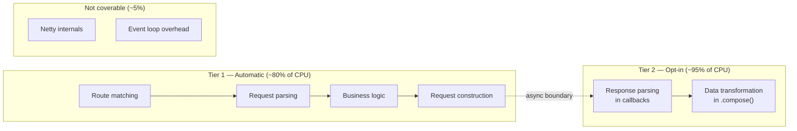

**Tier 1 (automatic, zero code changes):**
The global label handler covers all synchronous code on the event loop — route
matching, request parsing, validation, business logic, and outbound request
construction. This is typically ~80% of CPU work because:
- Network I/O waiting is non-blocking (zero CPU — nothing to profile)
- Async callbacks are often lightweight (move data from buffer to response)

**Tier 2 (opt-in, per-call-site):**
When a function does heavy computation inside async callbacks (e.g., parsing large
JSON responses, running scoring algorithms on response data), the async portion can
be labeled by wrapping the async call with a label-propagating Future wrapper. This
extends coverage to ~95%.

**Not coverable (~5%):**
Netty internals, event loop scheduling overhead, and timer callbacks are framework
code not attributable to specific requests. This is an industry-wide limitation of
all profilers with event-loop frameworks.

### When Tier 2 is needed

Tier 2 is only necessary when profiling reveals significant CPU in async callbacks
that cannot be attributed to a specific function. Start with Tier 1 — most functions
will have sufficient visibility.

---

## 8. executeBlocking visibility

### The problem

When a function uses `executeBlocking()`, the blocking code runs on a **worker thread**,
not the event loop thread. Since Pyroscope labels use `ThreadLocal`, the label set by
the event loop handler does **not** carry over to the worker thread.

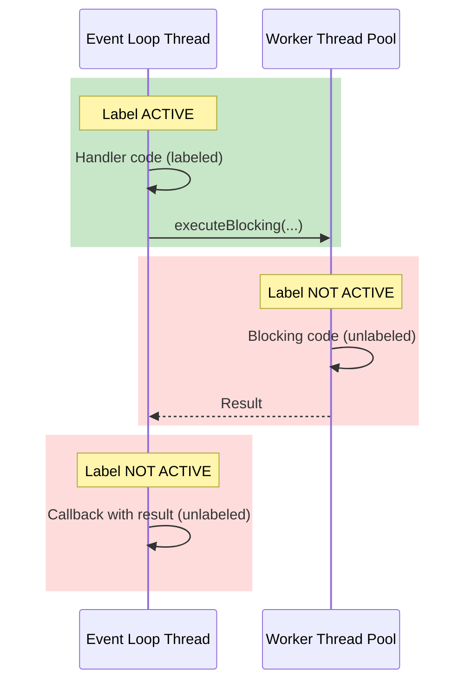

### Why this matters

`executeBlocking` in a reactive server is noteworthy — it means something is
intentionally blocking the worker pool (legacy library, file I/O, CPU-intensive
computation that would starve the event loop). Profiling should make these visible
so the platform team can:

1. **Verify intent:** Confirm the blocking code is supposed to be there
2. **Measure impact:** See how much CPU the blocking code consumes
3. **Identify candidates for refactoring:** Blocking code that could be replaced with non-blocking alternatives

### Labeling strategy for executeBlocking

The label can be explicitly re-applied inside the blocking lambda. This is not
automatic — it requires the function author to wrap their blocking code. The platform
team can provide a utility method that captures the current label and re-applies it:

```
captureLabels()  →  re-applies inside executeBlocking lambda
```

Alternatively, the platform team can search the codebase for `executeBlocking` usage
and flag each occurrence for review. This is a governance exercise, not a labeling
exercise — the goal is to know where blocking code exists and ensure it's intentional.

---

## 9. Implementation approaches and risk analysis

Three approaches exist for setting profiling labels on a shared Vert.x server.
This section documents each approach, the detailed risks of the agent-based
approach, and the recommended implementation path.

### 9a. Approach overview

```mermaid
graph TB
    subgraph "Approach 1 — Direct handler in enterprise server repo"
        A1["~15 lines in server startup code"]
        A1 --> A1R["router.route().handler(labelHandler)"]
        A1R --> A1D["compileOnly dependency on io.pyroscope:agent"]
    end

    subgraph "Approach 2 — Shared label handler library (separate repo)"
        A2["Create profiling-labels library"]
        A2 --> A2P["Publish to internal Maven/Gradle repo"]
        A2P --> A2I["Server repo adds 1-line dependency + 1-line registration"]
    end

    subgraph "Approach 3 — Custom Java agent (bytecode instrumentation)"
        A3["Build -javaagent JAR with ByteBuddy"]
        A3 --> A3T["Intercept RouterImpl.handle() at class load time"]
        A3T --> A3L["Inject label set/clear around handler chain"]
    end

    style A1 fill:#e8f5e9,stroke:#2e7d32,color:#000
    style A2 fill:#e3f2fd,stroke:#1565c0,color:#000
    style A3 fill:#ffebee,stroke:#c62828,color:#000
```

| | Approach 1 | Approach 2 | Approach 3 |
|---|:---:|:---:|:---:|
| **Code change to server repo** | ~15 lines (handler + dependency) | ~3 lines (dependency + registration) | Zero |
| **New repo required** | No | Yes (library repo) | Yes (agent repo) |
| **PR to server repo** | Yes (one PR) | Yes (one PR) | No |
| **Tier 1 coverage** | Yes | Yes | Yes |
| **Tier 2 coverage (async)** | No (add later) | Yes (included) | Partial (limited) |
| **Maintenance burden** | Near zero | Library releases | 36-combination test matrix |
| **Vert.x version sensitivity** | None (public API) | None (public API) | High (internal classes) |
| **JDK version sensitivity** | None | None | High (bytecode verification) |
| **Per-request overhead** | ~0.2 us | ~0.2 us | 1-7 us (50x more) |
| **Risk of silent failure** | None | None | High |
| **Security review complexity** | Standard code review | Standard dependency review | Runtime bytecode modification review |
| **Production blast radius** | Handler only | Handler only | Entire JVM (class loading) |

---

### 9b. Approach 1: Direct handler in enterprise Vert.x server repo

**What:** Add a global `router.route().handler()` in the server startup code that
sets the `function` label for every request.

**Where:** In the server's main Router initialization, before all function routes
are registered.

**Effort:** ~15 lines of code, one pull request to the server repo.

**Dependency:** `compileOnly` on `io.pyroscope:agent` (the Pyroscope labels API).
`compileOnly` means the dependency is used at compile time for type checking but
is NOT bundled into the server JAR. Zero runtime footprint if the agent is not
attached.

**How it works:**

```
Server startup:
  1. Router created
  2. Label handler registered as first global handler:
       router.route().handler(ctx -> {
         String functionName = resolveFunctionName(ctx);
         try {
           LabelsWrapper.run(Map.of("function", functionName), () -> ctx.next());
         } catch (NoClassDefFoundError e) {
           ctx.next();  // graceful degradation — agent not attached
         }
       });
  3. Function routes registered (by function teams, in function repos)
  4. Server starts listening
```

**Why this is the best engineering approach:**

| Factor | Detail |
|--------|--------|
| **Uses Vert.x public API** | `Router`, `RoutingContext`, `Handler` — stable across Vert.x 4.x and 5.x under semver guarantee |
| **Standard Handler pattern** | Same pattern as auth handlers, CORS handlers, body handlers — familiar to every Vert.x developer |
| **No bytecode manipulation** | Code is compiled normally by javac. No runtime class rewriting. No JVM agent interaction. |
| **Zero overhead vs normal handler** | A handler in the Vert.x chain has zero interception overhead — it IS the chain. ~0.2 us per request (ThreadLocal write + clear). |
| **Graceful degradation** | `NoClassDefFoundError` caught if Pyroscope agent is not attached. Server runs normally without labels. |
| **JIT-friendly** | HotSpot can inline the handler normally. No broken inline chains, no forced safepoints. |
| **Zero function team impact** | No changes to any function code, function build files, or function repos |
| **Testable** | Unit test the handler in isolation with a mock RoutingContext |

**Limitations:**

| Limitation | Detail | Mitigation |
|------------|--------|------------|
| Requires PR to server repo | Server repo is owned by another team | See [Section 9f](#9f-making-the-case-for-the-server-repo-pr) |
| Not reusable across servers | Handler is embedded in one server repo | Extract to library (Approach 2) when a second server needs it |
| No Tier 2 (async callbacks) | Only covers synchronous handler path (~80% of CPU) | Add Tier 2 later if profiling reveals significant unlabeled async CPU |

**Recommendation:** Start here. This is the correct engineering approach.

---

### 9c. Approach 2: Shared label handler library (separate repo)

**What:** Create a small, versioned library JAR in a **separate repository** that
any Vert.x server can depend on. The library provides:
- A label handler (Tier 1) — one line to register
- A `LabeledFuture` wrapper (Tier 2) — opt-in per async call site
- Configuration (label name, function name resolver strategy)

**Where the code lives:**

```
profiling-labels/              ← NEW REPO (owned by profiling/observability team)
├── build.gradle               ← Publishes to internal Maven repo
├── src/main/java/
│   └── com/corp/profiling/
│       ├── ProfilingLabelHandler.java    ← Tier 1: global handler
│       ├── LabeledFuture.java           ← Tier 2: async propagation wrapper
│       └── FunctionNameResolver.java    ← Strategy interface for name resolution
└── src/test/java/
    └── ...                              ← Unit tests with mock RoutingContext
```

**Integration into the enterprise server repo (one-time, ~3 lines):**

```
// build.gradle (server repo)
dependencies {
    compileOnly 'com.corp:profiling-labels:1.0.0'
}

// Server startup code (server repo)
router.route().handler(new ProfilingLabelHandler(functionNameResolver));
```

**Effort:** 1-2 days to create the library. 1 PR to the server repo (3 lines).

**Advantages over Approach 1:**

| Advantage | Detail |
|-----------|--------|
| **Reusable** | Any Vert.x server adds it as a dependency. No copy-paste. |
| **Version-controlled** | Updates ship as dependency bumps, not code changes to the server repo |
| **Includes Tier 2** | `LabeledFuture` wrapper for async propagation — available when teams need it |
| **Independently testable** | Library has its own test suite, CI/CD, release pipeline |
| **Consistent across servers** | Same labeling behavior everywhere. No drift between server implementations. |
| **Owned by profiling team** | Profiling team controls the release cadence. No dependency on server team for label changes. |

**Limitations:**

| Limitation | Detail | Mitigation |
|------------|--------|------------|
| Still requires a PR to server repo | Server repo adds a dependency (3 lines) | Smaller PR than Approach 1 — just a dependency, not logic |
| New repo and release pipeline | Must publish to internal Maven repo | Standard Gradle publish task — < 1 day setup |
| Dependency approval process | Server team must approve a new dependency | `compileOnly` scope — not bundled. No transitive dependencies. |

**When to use Approach 2 instead of Approach 1:**

- When multiple Vert.x servers need profiling labels
- When Tier 2 (async propagation) is needed from the start
- When the profiling team wants to own the label handler lifecycle independently
- When the server repo team prefers adding a dependency over adding logic

**Recommendation:** Use Approach 2 when Approach 1 has proven value and you want
to scale to multiple servers, or if the server team prefers a clean dependency
over embedded code.

---

### 9d. Approach 3: Custom Java agent (bytecode instrumentation)

**What:** A separate `-javaagent` JAR that uses bytecode manipulation (ByteBuddy,
ASM, or Javassist) to automatically intercept Vert.x `RouterImpl.handle()` and
inject label set/clear calls without any application code changes.

**Effort:** 2-4 weeks of development. Ongoing maintenance across Vert.x and JDK
versions.

**How it works at the JVM level:**

```
Agent registers a ClassFileTransformer via java.lang.instrument.Instrumentation
  → Every class loaded by the JVM passes through the transformer
  → Agent pattern-matches on Vert.x internal class names:
      io.vertx.ext.web.impl.RouterImpl
      io.vertx.ext.web.impl.RouteImpl
      io.vertx.ext.web.impl.RoutingContextImpl
  → ByteBuddy rewrites the matched class bytecode:

Original bytecode:
  RouterImpl.handle(HttpServerRequest) → iterates routes → calls handler

Instrumented bytecode:
  RouterImpl.handle(HttpServerRequest)
    → [INJECTED] resolve function name from route metadata
    → [INJECTED] PyroscopeLabels.set("function", name)
    → iterates routes → calls handler
    → [INJECTED] PyroscopeLabels.clear()  (in finally block)
```

**Advantages:**

| Advantage | Detail |
|-----------|--------|
| Zero code changes to any repo | No PR to server repo. No dependency. No handler registration. |
| Automatic | Attach the agent JAR to JAVA_TOOL_OPTIONS and labels appear |

### 9d-i. Detailed risk analysis for custom agent approach

The following risks are specific, technical, and well-documented by the async-profiler
and Pyroscope maintainer communities. They are not theoretical — each has been
observed in production or in upstream project evaluations.

#### Risk 1: Silent breakage on Vert.x version upgrades

Bytecode instrumentation targets **implementation classes** (`RouterImpl`,
`RouteImpl`, `RoutingContextImpl`) which are internal and not covered by
Vert.x's semver public API guarantee.

| Vert.x change | What breaks | Failure mode |
|----------------|-------------|-------------|
| `RouterImpl.handle()` method signature changes (parameter type, return type) | ByteBuddy intercept fails — method not found | Agent loads, JVM starts, labels silently not set |
| `RouteImpl` refactored into `RouteState` + `RouteImpl` (happened in Vert.x 4.x) | Agent intercepts wrong class | Labels never set — discovered weeks later during incident |
| `RoutingContextImpl` constructor adds a field | ByteBuddy advice accessing `this` fields breaks | `NoSuchFieldError` at runtime |
| Package rename from `io.vertx.ext.web.impl` to different package | Pattern match on class name fails | Agent becomes no-op silently |
| Netty version bump changes request decode path | Stack frame where `handle()` is called shifts | Agent intercepts at wrong lifecycle point |

**The critical problem:** These breakages are **silent**. The JVM starts, functional
tests pass, the application serves requests normally — but labels are never set.
You discover the breakage weeks or months later when an incident occurs and the
flame graphs show no function attribution. This is worse than not having the agent
at all — you believe you have profiling labels but you don't.

**Contrast with Approaches 1 and 2:** Handler-based approaches use the Vert.x
**public API** (`Router`, `RoutingContext`, `Handler`). Public API compatibility
is guaranteed by Vert.x's semver policy. A handler registered on Vert.x 4.0
works on 4.5, 5.0, and beyond without changes.

#### Risk 2: Two-agent interaction on the same JVM

The Pyroscope profiling agent (`pyroscope.jar`) is already a `-javaagent`. Adding
a second custom agent creates interaction risks:

**Class transformer ordering is undefined.** Both agents register
`ClassFileTransformer` instances. If both transform the same class (e.g., both
touch `RoutingContextImpl`), the second transformer receives bytecode already
modified by the first. The result is unpredictable.

**ThreadLocal contention.** Pyroscope labels use `ThreadLocal` storage. The
profiling agent reads labels during stack sampling on a separate sampler thread
via `AsyncGetCallTrace`. If the custom agent sets/clears labels on the event
loop thread while the sampler thread reads them, there is a race window. The
Pyroscope agent handles this for its own public labels API — a custom agent
bypassing the API could corrupt label state.

**Instrumentation instance conflicts.** Both agents receive a reference to
`java.lang.instrument.Instrumentation` via `premain()`. If the custom agent calls
`retransformClasses()` after the Pyroscope agent has already transformed a class,
it can undo the profiling agent's instrumentation.

**Diagnostic complexity.** When something goes wrong in production (missing labels,
overhead spike, class verification error), you must determine which agent caused
it. Stack traces from bytecode-instrumented code contain synthetic frames, bridge
methods, and ByteBuddy-generated classes:

```
java.lang.NoSuchFieldError: pyroscope$$label_context
    at io.vertx.ext.web.impl.RouterImpl$ByteBuddy$auxiliary$Vk3p2f.handle(Unknown Source)
    at io.vertx.ext.web.impl.RouterImpl$ByteBuddy$proxyDelegate$8f2a.handle(Unknown Source)
```

This stack trace is nearly impossible to debug without deep knowledge of both agents.

#### Risk 3: JVM overhead per request

Bytecode interception via ByteBuddy advice adds overhead on **every invocation**
of every intercepted method:

```
Per-request overhead (bytecode agent):
  1. Method entry advice (capture args, resolve function name) → 1-5 us
  2. Label set (ThreadLocal write)                              → 0.1 us
  3. Original method body                                       → unchanged
  4. Method exit advice (clear label, finally block)            → 0.5-2 us
  5. Forced safepoint poll on method entry/exit                 → 0-3 us
  Total: 1.6-10.1 us per request

Per-request overhead (handler-based, Approaches 1 and 2):
  1. Handler invoked by Router (normal handler chain)           → 0 additional
  2. Label set (ThreadLocal write)                              → 0.1 us
  3. ctx.next() (normal handler chain)                          → 0 additional
  4. Label clear (finally block)                                → 0.1 us
  Total: ~0.2 us per request
```

**The handler approach is ~50x less overhead** because:

- A handler is a normal part of the Vert.x execution path — no interception
- The JIT compiler can inline the handler normally. ByteBuddy advice **breaks the
  inline chain**, preventing HotSpot's most powerful optimization.
- ByteBuddy-instrumented methods force a **safepoint poll** on every entry/exit.
  Safepoint polls cause all JVM threads to pause briefly, adding p99 latency jitter.
  This is the reason the async-profiler maintainers abandoned the agent approach
  — the overhead defeats the purpose of a low-overhead profiler.

At 10,000 RPS across the server:

```
Agent approach:  10,000 × 5 us (midpoint) = 50 ms/second of additional CPU (5% overhead)
Handler approach: 10,000 × 0.2 us        = 2 ms/second of additional CPU (0.2% overhead)
```

#### Risk 4: Class verification failures

The JVM verifies bytecode at class load time. If the agent produces invalid
bytecode (wrong stack map frames, type mismatches, missing exception table
entries), the class fails to load with a `VerifyError`.

- ByteBuddy's `@Advice.OnMethodEnter` / `@Advice.OnMethodExit` inject bytecode
  into the target method. If the advice references types not on the boot
  classpath, the verifier rejects the class.
- **Java 17+ has stricter bytecode verification than Java 11.** An agent that works
  on JDK 11 can fail on JDK 17 with the same Vert.x version.
- If Vert.x uses `sealed` classes or `records` (Java 17+) in internal
  implementation, bytecode manipulation is restricted by the JVM spec.

A `VerifyError` on `RouterImpl` means **the entire Vert.x server fails to start.**
In production. At 2 AM. After a JDK upgrade that nobody associated with the
custom agent.

#### Risk 5: Maintenance test matrix

The custom agent must be tested against every combination of:

| Dimension | Values | Count |
|-----------|--------|:-----:|
| JDK version | 11, 17, 21 | 3 |
| Vert.x version | 4.4.x, 4.5.x, 5.x | 3 |
| Pyroscope agent version | current, current-1 | 2 |
| OS | Linux (prod), macOS (dev) | 2 |
| **Total combinations** | | **36** |

Every Vert.x minor release (e.g., 4.5.8 → 4.5.9) requires re-running the full
matrix because internal class changes can happen in any release. Compare to
handler-based approaches: test once against the public API — it works across all
versions.

#### Risk 6: Security and compliance review in regulated environments

A custom `-javaagent` that rewrites bytecode at runtime triggers security review:

| Question from security/compliance | Impact |
|----------------------------------|--------|
| "This agent modifies production code at runtime — what is the blast radius?" | Must demonstrate the agent cannot affect application logic beyond labels |
| "How is the agent's integrity verified? Can a compromised agent inject arbitrary code?" | Requires JAR signing, checksum verification, supply chain security review |
| "Does the agent access request payloads, credentials, or PII through intercepted methods?" | Must prove the agent only reads route metadata, not request data |
| "Who owns the agent? What is the support/patching SLA?" | Must staff a maintenance team for a custom JVM agent in production |

A `router.route().handler()` in the server repo raises **none** of these concerns —
it is standard application code, reviewed through the normal PR process, compiled at
build time, and subject to the same security scanning as all other code.

#### Risk summary

| Risk | Severity | Likelihood | Silent? | Mitigation cost |
|------|:--------:|:----------:|:-------:|:---------------:|
| Vert.x internal class change breaks labels | Critical | High (every minor release) | Yes | 36-combo test matrix, every release |
| Two-agent interaction corrupts labels/profiles | High | Medium | Partial | Extensive integration testing |
| JVM overhead from safepoints and broken inlining | Medium | Certain (inherent) | No | Cannot be mitigated — fundamental |
| VerifyError on JDK upgrade crashes server | Critical | Medium | No | JDK upgrade testing for every version |
| Security review delays deployment | Medium | High (regulated environments) | No | Documentation and justification |
| Maintenance burden (36-combo test matrix) | Medium | Certain | N/A | Dedicated CI pipeline |

**Recommendation: Not recommended.** The async-profiler project (which underlies
the Pyroscope Java agent) explored automatic context propagation for reactive
frameworks via bytecode instrumentation and **abandoned it** because:

1. **Safepoint overhead** — instrumented methods force safepoint polls, adding p99
   latency jitter that defeats the purpose of a low-overhead profiler
2. **Framework-specific logic** — each reactive framework (Vert.x, Project Reactor,
   RxJava, Netty) requires different interception points; no generic solution exists
3. **Async boundary limitation** — even intercepting the entry point, labels are
   `ThreadLocal` and do not propagate to `.compose()`, `.map()`, or `executeBlocking()`
   callbacks; the agent would need to intercept the entire Vert.x async API

Their conclusion: **application-level labeling (handler-based) is the correct
approach** because only the application knows the semantic mapping from request
to function name.

---

### 9e. Decision summary

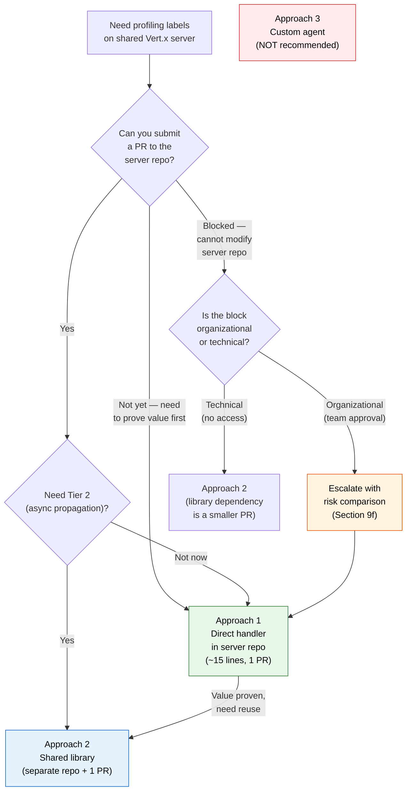

| Scenario | Recommended approach | Rationale |
|----------|---------------------|-----------|
| Server repo team is receptive to a small PR | **Approach 1** | Fastest path. ~15 lines. Proves value in days. |
| Server repo team prefers dependencies over code | **Approach 2** | 3-line PR (dependency + registration). Logic owned by profiling team. |
| Multiple Vert.x servers need labels | **Approach 2** | Library is reusable. One dependency per server. |
| Tier 2 (async propagation) needed from day 1 | **Approach 2** | Library includes `LabeledFuture` wrapper. |
| Cannot modify server repo at all | **Escalate** | See [Section 9f](#9f-making-the-case-for-the-server-repo-pr). Agent approach is not the answer. |
| "We don't own the server repo" | **Still Approach 1 or 2** | A 3-15 line PR is a collaboration, not a takeover. |

---

### 9f. Making the case for the server repo PR

If the enterprise Vert.x server is owned by a different team, submitting a PR
requires making the case that the change is safe, minimal, and valuable.

**The PR is ~15 lines.** It adds:
1. A `compileOnly` dependency on `io.pyroscope:agent` (not bundled in the JAR)
2. A global handler registered before all function routes
3. A try/catch for `NoClassDefFoundError` (graceful degradation)

**Arguments for the server repo team:**

| Concern | Response |
|---------|----------|
| "This adds a new dependency" | `compileOnly` — not bundled in the JAR. No transitive dependencies. Zero bytes added to the server artifact. |
| "What if the Pyroscope agent isn't attached?" | The handler catches `NoClassDefFoundError` and calls `ctx.next()`. Server behaves identically to today. Zero impact. |
| "What if it affects performance?" | One `ThreadLocal` write + clear per request = ~0.2 us. Same overhead as the existing CORS handler. |
| "We don't want profiling concerns in the server" | The label handler is an observability handler — same category as metrics, health checks, and access logging. Standard practice in Vert.x. |
| "What if we need to roll it back?" | Remove the handler. One-line change. No data migration, no state to clean up. |
| "Function teams will be affected" | Zero function team impact. No changes to any function code, build file, or deployment. |

**If the PR is still blocked**, Approach 2 (shared library) reduces the PR to
3 lines (dependency + one-line handler registration). The profiling team owns all
the logic in a separate repo. The server team reviews only the dependency addition.

**The agent approach (Approach 3) should never be used as a workaround for an
organizational blocker.** The engineering risks (silent breakage, JVM overhead,
two-agent interaction, 36-combo test matrix, security review) vastly outweigh the
organizational cost of getting a 3-15 line PR approved.

---

## 10. Best practices

### Cardinality management

Every unique label value creates a separate profiling series in Pyroscope. At 1000+
functions, cardinality is the primary concern.

| Rule | Guidance |
|------|----------|
| **Keep total series under 10,000** | At 3 GB/series/month, 10,000 series = 30 TB/month |
| **Use stable, enumerable values** | Function names are known at deploy time — bounded cardinality |
| **Never use request-scoped values** | Request IDs, user IDs, timestamps = unbounded cardinality = storage explosion |
| **Measure before adding labels** | Check current series count before adding a second label |

### Naming conventions

| Convention | Example | Why |
|------------|---------|-----|
| Use the function's canonical name | `SubmitPayment.v1` | Matches what teams already use to identify functions |
| Include version if relevant | `.v1`, `.v2` | Enables before/after comparison across versions |
| Use dot-separated names | `Orders.SubmitPayment` | Consistent with Java package naming |
| Avoid spaces, special characters | `submit-payment` not `Submit Payment!` | Label values are used in query syntax |

### What NOT to label

| Bad label | Why | Cardinality |
|-----------|-----|-------------|
| `request_id=abc-123-def` | Unique per request — unbounded | Millions |
| `user_id=12345` | Unique per user — unbounded | Thousands-millions |
| `timestamp=1711900800` | Unique per second — unbounded | Unbounded |
| `trace_id=abc123` | Unique per trace — unbounded | Millions |
| `payload_hash=sha256:...` | Unique per request body — unbounded | Millions |

### Observability alignment

Align label naming with your existing observability stack:

| Concern | Alignment |
|---------|-----------|
| **Prometheus metrics** | Use the same function name in Prometheus labels so you can correlate profiling data with metrics |
| **Grafana dashboards** | Template variables should match label values so dashboards can filter both metrics and profiles |
| **OpenTelemetry traces** | If span names match function names, future span-profiling integration becomes possible |
| **Alerting** | Alert rules that reference function names should use the same naming as the profiling label |

### Storage impact estimation

```
monthly_storage = series_count × retention_days / 30 × 3 GB

Example:
  1,000 functions × 30 days / 30 × 3 GB = 3 TB/month
  1,000 functions × 7 days / 30 × 3 GB = 700 GB/month
```

Shorter retention dramatically reduces storage. See
[capacity-planning.md](capacity-planning.md) for detailed sizing.

---

## 11. Cross-references

| Document | Relevance |
|----------|-----------|
| [async-profiling-guide.md](async-profiling-guide.md) | Labeling implementation details, LabeledFuture (Tier 2), two-tier architecture |
| [labeling-analysis-prompt.md](labeling-analysis-prompt.md) | AI copilot prompt for analyzing the Vert.x server codebase |
| [configuration-reference.md](configuration-reference.md) | Pyroscope agent properties and environment variables |
| [capacity-planning.md](capacity-planning.md) | Storage sizing and series count impact |
| [architecture.md](architecture.md) | Deployment topology diagrams |
| [code-to-profiling-guide.md](code-to-profiling-guide.md) | How source code maps to flame graph frames |
