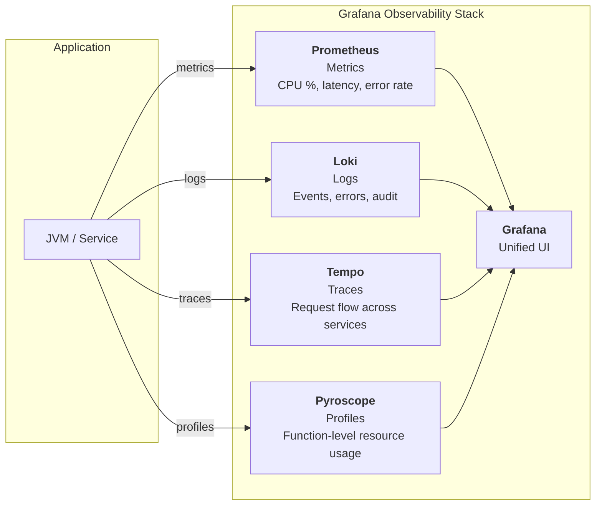
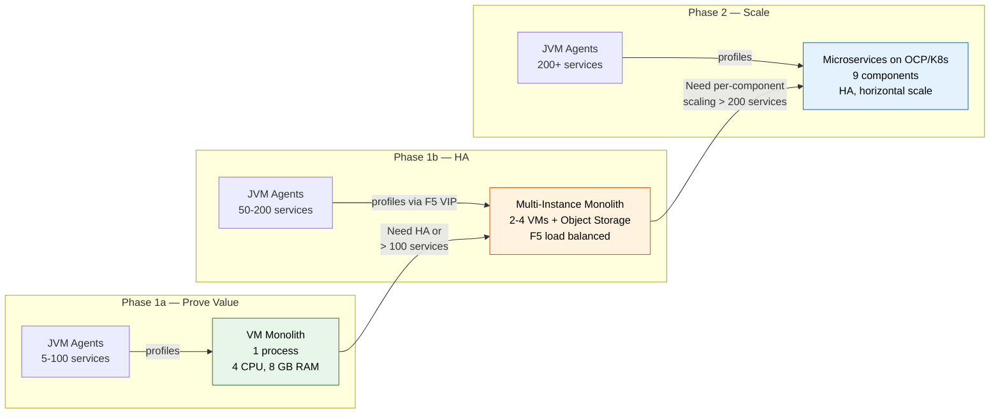

# What Is Pyroscope — Executive Overview

Business case for continuous profiling with Pyroscope: what it is, what problem it solves,
how it changes incident response, what it costs, and how to adopt it in phases.

---

## Table of Contents

- [1. What is continuous profiling?](#1-what-is-continuous-profiling)
- [2. What is Pyroscope?](#2-what-is-pyroscope)
- [3. The problem it solves](#3-the-problem-it-solves)
- [4. How it changes incident response](#4-how-it-changes-incident-response)
- [5. Cost of implementation](#5-cost-of-implementation)
- [6. Comparison with alternatives](#6-comparison-with-alternatives)
- [7. Deployment phases](#7-deployment-phases)
- [8. Who uses it and for what](#8-who-uses-it-and-for-what)
- [9. Risk assessment](#9-risk-assessment)
- [10. Next steps](#10-next-steps)

---

## 1. What is continuous profiling?

Continuous profiling is always-on, low-overhead sampling of what application code is doing at
function-level detail. A lightweight agent periodically inspects every thread in a running
process, records which function is executing, and streams the results to a central server.
This happens continuously in production — not during debugging sessions, not during load tests,
but all the time, on every instance, capturing data before anyone knows there is a problem.

**Analogy:** Metrics tell you the engine temperature is high. Profiling tells you which
piston is overheating.

### Four profile types

| Profile Type | What It Captures | Example Finding |
|-------------|------------------|-----------------|
| **CPU** | Methods actively consuming CPU cycles | `PaymentVerticle.sha256()` consuming 38% of CPU |
| **Allocation** | Where `new` objects are created, driving garbage collection | `JsonParser.readTree()` allocating 1.2 GB/min |
| **Mutex** | Threads blocked on locks (`synchronized`, `Lock`) | `ConnectionPool.getConnection()` lock contention at 200 ms/s |
| **Wall clock** | All threads regardless of state — running, sleeping, or blocked | `HttpClient.send()` waiting 4 s on downstream timeout |

All four types run simultaneously with a combined overhead of 3-8% CPU.

---

## 2. What is Pyroscope?

Pyroscope is an open-source continuous profiling platform maintained by Grafana Labs. It
ingests profile data from application agents, stores it in a time-series-aware format, and
provides flame graph visualization for root cause analysis.

| Property | Value |
|----------|-------|
| **License** | AGPL-3.0 — free to self-host, no per-host or per-seat fees |
| **Maintained by** | Grafana Labs (same team behind Grafana, Loki, Tempo, Mimir) |
| **Language support** | Java, Go, Python, Ruby, .NET, Rust, Node.js, eBPF |
| **Deployment modes** | Monolith (single process) and microservices (HA, horizontal scale) |
| **UI** | Built-in web UI at port 4040 and native Grafana integration |

### Where Pyroscope fits in the Grafana observability stack



Each signal answers a different question. Together they form a complete picture:

| Signal | Question it answers |
|--------|-------------------|
| Metrics (Prometheus) | **What** is happening? (CPU at 85%, latency at 2 s) |
| Logs (Loki) | **When** did it happen? (error at 14:32:07) |
| Traces (Tempo) | **Where** in the request path? (payment-service span = 1.8 s) |
| Profiles (Pyroscope) | **Why** is it happening? (`sha256()` calling `MessageDigest.getInstance()` on every request) |

---

## 3. The problem it solves

### The current incident response cycle

When production alerts fire today, teams follow a predictable — and slow — escalation:

```
Alert → Metrics → Logs → Traces → Guess → Code change → Redeploy → Wait → Repeat
                                     └── 30-90 minutes ──┘
```

The bottleneck is the gap between "CPU is high" and "this specific function in this specific
class is the cause." Existing tools cannot bridge that gap:

### What existing tools miss

| Tool | What It Shows | What It Cannot Show | The Gap |
|------|--------------|---------------------|---------|
| **Prometheus / Metrics** | CPU %, heap usage, request rate, latency percentiles | Which function consumes the CPU or allocates the memory | Symptoms only — no root cause |
| **Application Logs** | Events the developer chose to log — errors, state changes | Runtime behavior of code paths that contain no log statements | Silent hot paths are invisible |
| **Distributed Tracing** | Request flow across services, per-span latency | Internal CPU/allocation/lock behavior within a single service | Service-level, not function-level |
| **Heap Dumps** | Object graph at a single point in time | Allocation rate over time; requires stop-the-world pause | Disruptive, single snapshot, reactive |
| **Thread Dumps** | Thread state at a single instant | Historical lock contention patterns; requires manual trigger | Point-in-time, manual, reactive |

### The concrete example

Without profiling, the investigation for "CPU at 85% on payment-service" looks like:

1. Check Prometheus: CPU is high, heap is normal, request rate is steady.
2. Search logs: no errors, no obvious changes.
3. Check traces: payment-service spans are slow, but which internal call?
4. **Guess:** maybe it is the database query? Add logging, redeploy, wait 15 min.
5. Not the database. **Guess again:** maybe JSON serialization? Add more logging, redeploy.
6. After 45 minutes and 3 redeployments: discover that `PaymentVerticle.sha256()` calls
   `MessageDigest.getInstance("SHA-256")` on every request instead of reusing the instance.

With profiling, step 1 is: open the CPU flame graph for payment-service, see `sha256()` at
38% width, click it, read the call stack. Time to root cause: 2 minutes.

---

## 4. How it changes incident response

### MTTR reduction

| Metric | Without Profiling | With Profiling | Improvement |
|--------|-------------------|----------------|-------------|
| **Time to root cause** | 30-90 min (guess-redeploy cycles) | 5-15 min (flame graph lookup) | 70-85% reduction |
| **Redeployments during investigation** | 2-5 (add logging, test hypotheses) | 0 (data already captured) | Eliminated |
| **Reproduction required** | Often — need to trigger the condition | Never — data exists before the incident | Eliminated |
| **Code changes for diagnosis** | Yes — add logging, enable debug flags | No — agent attaches via environment variable | Zero code changes |
| **Mean incident duration** | 45-120 min (triage + fix + deploy) | 15-30 min (identify + fix + deploy) | 60-75% reduction |

### Key properties

- **Data exists before the incident.** The agent captures profiles continuously. When an
  alert fires at 2 AM, the profiling data for the preceding hours is already stored. There is
  no reproduction step, no "can you do that again while I have the debugger attached."

- **No code changes required.** The Java agent attaches at JVM startup via a single
  environment variable:
  ```
  JAVA_TOOL_OPTIONS="-javaagent:/opt/pyroscope/pyroscope.jar"
  ```
  No recompilation, no bytecode modification, no application restarts beyond the initial deployment.

- **Continuous comparison.** Pyroscope stores time-series profile data, enabling diff flame
  graphs that highlight what changed between a healthy period and an incident. This is
  equivalent to always having a "before" baseline to compare against.

---

## 5. Cost of implementation

### Agent overhead (per JVM)

| Resource | Impact | Notes |
|----------|--------|-------|
| **CPU** | 3-8% combined (all 4 profile types) | Bounded — does not increase with application load |
| **Memory** | 20-40 MB agent heap | Fixed allocation, not proportional to application heap |
| **Network** | 10-50 KB per upload (every 10 s) | Compressed pprof format; ~0.5-5 KB/s sustained |
| **Latency** | < 1 ms per request (sampling, not tracing) | No per-request instrumentation; timer-based sampling |

### Storage (Pyroscope server)

| Metric | Estimate |
|--------|----------|
| **Ingestion per service** | 10-50 KB per upload, every 10 seconds |
| **Storage per service per month** | 1-5 GB (depends on cardinality and retention) |
| **Default retention** | 30 days (configurable; Pyroscope default is unlimited) |
| **Compression** | Automatic; pprof wire format + server-side compaction |

### Server resources (monolith mode)

| Resource | Minimum | Recommended |
|----------|---------|-------------|
| **RAM** | 1 GB | 2 GB |
| **CPU** | 0.5 cores | 1 core |
| **Disk** | 50 GB | 100 GB (SSD recommended) |

### Licensing cost

| Solution | Cost Model | Annual Cost (50 hosts) |
|----------|-----------|----------------------|
| **Pyroscope** (self-hosted) | Free — AGPL-3.0 open source | $0 |
| **Grafana Cloud Profiles** | Per-host cloud pricing | Varies by tier |
| **Datadog Continuous Profiler** | $15-35/host/month (bundled with APM) | $9,000-21,000 |
| **New Relic** | Per-host or per-GB pricing | $8,000-20,000 |
| **Dynatrace** | Per-host pricing | $10,000-25,000 |

Self-hosting Pyroscope eliminates recurring licensing costs. The only cost is the
infrastructure to run the server (1 VM or 1 container) and the 3-8% CPU overhead on
instrumented JVMs.

### Total cost of ownership by phase

The following TCO calculations assume 50 profiled JVM hosts and 3-year amortization
for infrastructure costs.

#### Phase 1a — Single monolith (prove value)

| Cost category | One-time | Annual | 3-year total |
|---------------|:--------:|:------:|:------------:|
| **Software licensing** | $0 | $0 | $0 |
| **VM** (1× 4 CPU, 8 GB, 250 GB — from existing fleet) | $0 | ~$2,000 (internal chargeback) | $6,000 |
| **Agent CPU overhead** (3-5% × 50 hosts) | $0 | ~$1,500 (1.5-2.5 cores equivalent) | $4,500 |
| **Engineering** (7-10 weeks FTE setup) | ~$25,000 | — | $25,000 |
| **Ongoing maintenance** (< 2 hrs/month) | — | ~$2,400 | $7,200 |
| **Total** | **$25,000** | **~$5,900** | **~$42,700** |

#### Phase 1b — Multi-instance monolith with object storage (HA)

| Cost category | One-time | Annual | 3-year total |
|---------------|:--------:|:------:|:------------:|
| **Software licensing** | $0 | $0 | $0 |
| **VMs** (2-4× 4 CPU, 8 GB — from existing fleet) | $0 | ~$4,000-8,000 (internal chargeback) | $12,000-24,000 |
| **Object storage** (MinIO: 2-node cluster, 500 GB) | ~$3,000 (hardware) | ~$1,000 (power/maintenance) | $6,000 |
| **Object storage** (AWS S3: 500 GB, if cloud) | $0 | ~$150-300 (storage + requests) | $450-900 |
| **F5 VIP** (from existing F5 infrastructure) | $0 | $0 | $0 |
| **Agent CPU overhead** (3-5% × 50 hosts) | $0 | ~$1,500 | $4,500 |
| **Engineering** (1-2 weeks incremental from Phase 1a) | ~$5,000 | — | $5,000 |
| **Ongoing maintenance** (< 4 hrs/month) | — | ~$4,800 | $14,400 |
| **Total (on-prem MinIO)** | **~$8,000** | **~$11,300** | **~$41,900** |
| **Total (cloud S3)** | **~$5,000** | **~$10,450** | **~$36,350** |

#### Comparison: Pyroscope vs commercial APM profiling (50 hosts, 3 years)

| Solution | 3-year licensing | 3-year infrastructure | 3-year total | Savings vs commercial |
|----------|:----------------:|:---------------------:|:------------:|:---------------------:|
| **Pyroscope Phase 1a** | $0 | ~$42,700 | **~$42,700** | $24,300-90,300 |
| **Pyroscope Phase 1b** (on-prem) | $0 | ~$41,900 | **~$41,900** | $25,100-91,100 |
| **Pyroscope Phase 1b** (cloud S3) | $0 | ~$36,350 | **~$36,350** | $30,650-96,650 |
| **Datadog** (50 hosts) | $27,000-63,000 | Included (SaaS) | **$27,000-63,000** | — |
| **New Relic** (50 hosts) | $24,000-60,000 | Included (SaaS) | **$24,000-60,000** | — |
| **Dynatrace** (50 hosts) | $30,000-75,000 | Included (SaaS) | **$30,000-75,000** | — |

> **Key insight:** Even with the additional infrastructure cost of object storage for Phase 1b HA,
> self-hosted Pyroscope is **$25,000-96,000 cheaper** than commercial alternatives over 3 years.
> The cost advantage grows with scale — commercial APM pricing is per-host, while Pyroscope
> infrastructure costs grow sub-linearly (adding hosts doesn't require more Pyroscope VMs until
> you exceed ~200 services).

#### How we determined these numbers

- **VM costs:** Based on typical enterprise internal chargeback rates ($150-200/month for a 4-core VM). Adjust to your organization's rates.
- **Object storage (MinIO):** 2-node MinIO cluster on commodity hardware (2× $1,500 servers with 1 TB SSD each). Power and maintenance at ~$500/node/year.
- **Object storage (cloud):** AWS S3 Standard at $0.023/GB/month + PUT/GET request pricing. 500 GB profile data with ~10M requests/month.
- **Agent overhead:** 3-5% CPU across 50 hosts ≈ 1.5-2.5 additional cores. Valued at the marginal cost of compute in your environment (~$600-1,000/core/year).
- **Engineering:** Fully-loaded engineer cost at ~$100/hour. Phase 1a: 7-10 weeks. Phase 1b incremental: 1-2 weeks.
- **Maintenance:** Container updates, retention management, monitoring reviews. < 2 hrs/month (Phase 1a), < 4 hrs/month (Phase 1b with object storage).
- **Commercial APM:** Published list prices from vendor documentation (Datadog, New Relic, Dynatrace). Actual negotiated rates may differ.

#### MTTR savings in monetary terms

The value of Pyroscope compounds beyond infrastructure cost avoidance:

| Metric | Calculation | Annual value |
|--------|-------------|:------------:|
| **MTTR reduction** | 4 incidents/month × 30 min saved × $100/hr engineer | **$2,400/year** |
| **Avoided redeployments** | 4 incidents/month × 2 avoided deploys × 15 min × $100/hr | **$2,400/year** |
| **Infrastructure right-sizing** | 10-30% reduction on over-provisioned resources × $50,000 compute spend | **$5,000-15,000/year** |
| **Prevented outages** | 1-2 regressions caught early/year × $10,000 avg outage cost | **$10,000-20,000/year** |
| **Total annual return** | | **$19,800-39,800/year** |

> At $19,800-39,800/year in returns against ~$5,900-11,300/year in costs, Pyroscope delivers
> a **2-7x annual ROI** depending on your incident frequency and infrastructure spend.

---

## 6. Comparison with alternatives

| Approach | Overhead | Root Cause Capability | Always-On? | Licensing Cost | Deployment Effort |
|----------|----------|----------------------|-----------|----------------|-------------------|
| **Metrics only** (Prometheus) | < 1% | Low — symptoms only, no function-level detail | Yes | Free | Already deployed |
| **APM** (Datadog, New Relic, Dynatrace) | 5-15% (tracing + profiling) | High — tracing + profiling combined | Yes | $15-35/host/month | Agent + SaaS account |
| **On-demand profiling** (debugger, jstack, hprof) | 0% normally, 20-50% during capture | High — but only at capture time | No | Free | Manual, per-incident |
| **Continuous profiling** (Pyroscope) | 3-8% | High — function-level, all 4 dimensions | Yes | Free (self-hosted) | Agent + 1 server |

**Summary:** Pyroscope provides the root cause capability of commercial APM tools and the
always-on coverage that on-demand profiling lacks, at zero licensing cost and lower overhead
than full APM agents.

---

## 7. Deployment phases

### Phase 1: Monolith on VM

Deploy a single Pyroscope process on an existing VM. Attach agents to JVMs via environment
variables. This covers the majority of use cases and provides immediate value.

- **Server:** 1 VM, 2 GB RAM, 1 CPU, 100 GB disk
- **Agent:** 1 JAR file per JVM, configured via `JAVA_TOOL_OPTIONS`
- **Grafana:** Optional — Pyroscope has its own UI at port 4040
- **Capacity:** Up to ~100 services sending profiles
- **Time to deploy:** 1-2 hours (server) + 5 minutes per JVM (agent)

### Phase 1b: Multi-instance monolith with object storage (HA)

When HA is required or the single monolith approaches capacity (~100 services), add
additional monolith instances behind an F5 load balancer with shared object storage.

- **Server:** 2-4 VMs, each 4 CPU, 8 GB RAM, 50 GB local disk (WAL/temp)
- **Object storage:** S3-compatible (MinIO on-premise, AWS S3, GCS, or Azure Blob) — 250 GB-1 TB
- **F5 VIP:** Round-robin or least-connections across all instances
- **HA:** F5 health checks remove unhealthy instances; any instance serves any query via shared object storage
- **Capacity:** 50-200 services
- **Incremental cost:** ~$3,000-8,000 one-time (MinIO hardware + additional VMs) or ~$150-300/year (cloud S3)

### Phase 2: Microservices on OCP/K8s

When ingestion volume exceeds multi-instance monolith capacity (>200 services, or
per-component scaling is needed), migrate to microservices mode with 9 distributed components.

- **Components:** distributor, ingester, compactor, store-gateway, query-frontend, query-scheduler, querier, overrides-exporter, gateway
- **Storage:** Requires S3-compatible object storage (MinIO, AWS S3, GCS, or Azure Blob)
- **HA:** Replicas per component, independent scaling
- **Capacity:** Hundreds to thousands of services

### Phase progression



**Recommendation:** Start with Phase 1a. A single monolith deployment proves value within days,
requires no Kubernetes knowledge, and the agent configuration is identical for all phases.
Phase 1b adds HA with object storage when needed. Migration to Phase 2 is a server-side
change only — agents continue to push profiles to the same endpoint.

---

## 8. Who uses it and for what

| Role | Use Case | Value |
|------|----------|-------|
| **On-call SRE** | Open flame graph during incident, identify root cause function in minutes | Reduces MTTR from 30-90 min to 5-15 min |
| **Developer** | Compare flame graphs before/after a code change to validate performance impact | Prevents performance regressions before production |
| **Tech Lead** | Review profiling data during sprint retrospectives to prioritize optimization work | Data-driven decisions on where to spend engineering time |
| **Engineering Manager** | Track MTTR reduction and incident resolution metrics | Quantifiable improvement in operational efficiency |
| **Capacity Planning** | Identify inefficient code consuming excess CPU/memory across the fleet | Right-size infrastructure based on actual code behavior, not just load averages |
| **Security / Compliance** | Deploy with FIPS-compliant JDK builds; profile crypto operations | Ensure cryptographic implementations meet compliance requirements |

---

## 9. Risk assessment

### What could go wrong

| Risk | Likelihood | Impact | Mitigation |
|------|-----------|--------|------------|
| **3-8% CPU overhead** on instrumented JVMs | Certain (by design) | Low — bounded, does not grow with load | Tunable sampling rate; disable individual profile types if needed |
| **Storage growth** on Pyroscope server | Expected | Low — predictable, linear with service count | Retention policies (enterprise default 30 days, configurable); storage tiers |
| **Pyroscope server downtime** | Possible | Minimal — agents queue and retry; applications unaffected | Monolith: systemd auto-restart. Microservices: HA replicas |
| **Network bandwidth** from agents to server | Low | Negligible — 0.5-5 KB/s per JVM | Compressed pprof format; configurable upload interval |
| **Compatibility issues** with JVM versions | Low | Medium — profiling may not attach | Tested with JDK 11, 17, 21; uses standard JVMTI interface |

### What happens if Pyroscope is down

- **Application impact:** None. The Pyroscope agent is a background thread. If it cannot
  reach the server, it queues profile data and retries. If the queue fills, it drops profile
  data silently. The application continues running normally with zero functional impact.
- **Data impact:** Profile data for the downtime window is lost. When the server recovers,
  new data resumes immediately.
- **Monitoring impact:** Flame graphs are unavailable during downtime. All other
  observability signals (metrics, logs, traces) continue independently.

---

## 10. Next steps

| Step | Action | Document |
|------|--------|----------|
| 1 | **Choose a deployment option** — VM, Kubernetes, OpenShift, Docker Compose | [deployment-guide.md](deployment-guide.md) |
| 2 | **Follow implementation steps** — server setup, agent configuration, Grafana integration | [continuous-profiling-runbook.md](continuous-profiling-runbook.md) |
| 3 | **Start with Phase 1** — monolith on a VM, agents on 5-10 JVMs to prove value | [deployment-guide.md, Section 7](deployment-guide.md#7-monolith-manual-vm-deployment) |
| 4 | **Review flame graph fundamentals** before first incident use | [reading-flame-graphs.md](reading-flame-graphs.md) |
| 5 | **Evaluate Phase 2** when ingestion exceeds monolith capacity or HA is required | [deployment-guide.md, Section 12](deployment-guide.md#12-microservices-mode) |

**Recommended starting point:** Deploy a Pyroscope monolith on an existing VM (1-2 hours),
attach agents to 5 JVMs (25 minutes total), and open the flame graph UI. The value is
visible immediately — no dashboards, no alert rules, no configuration tuning needed to see
the first flame graph.
