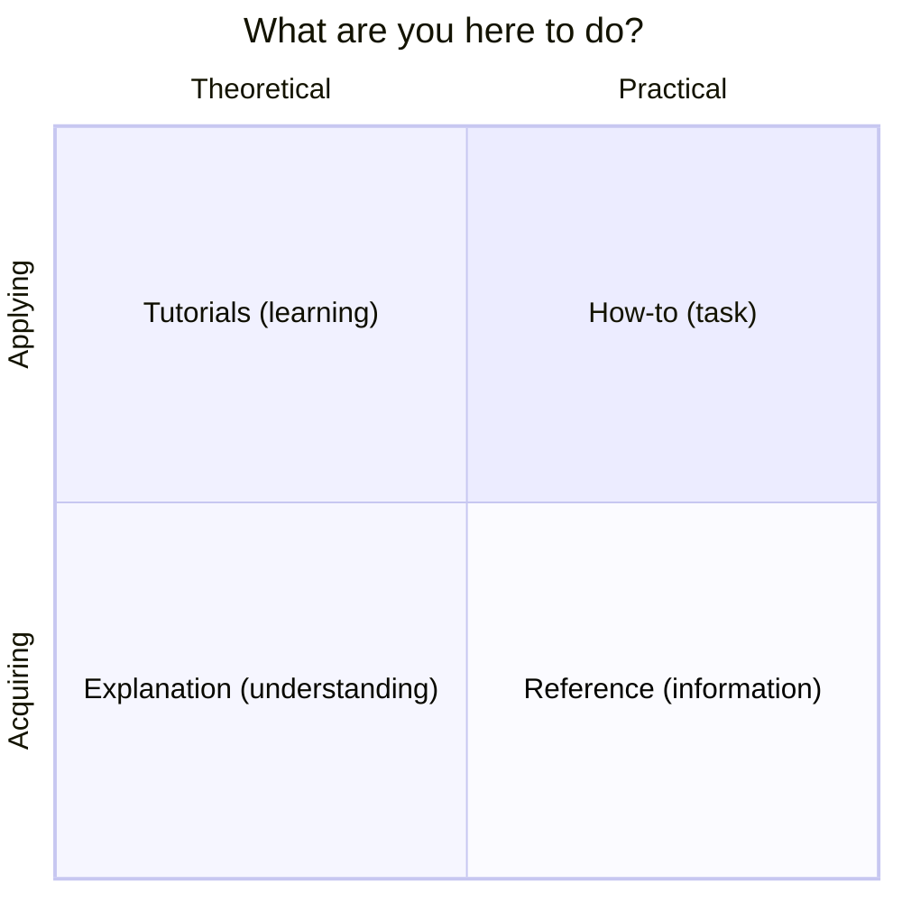

# Phase 2 docs

Organised per [Diataxis](https://diataxis.fr/). Four quadrants, four reader
intents.

## Tutorials
- [01 · Getting started](tutorials/01-getting-started.md)
- [02 · Your first regression](tutorials/02-your-first-regression.md)
- [03 · Chat with profiles](tutorials/03-chat-with-profiles.md)

## How-to
- [Runbook — operate the stack](how-to/runbook.md)
- [Trigger an incident](how-to/trigger-an-incident.md)
- [Switch LLM provider (Ollama / Claude / GPT / Gemini)](how-to/switch-llm-provider.md)
- [Add a new DAG](how-to/add-a-dag.md)
- [Connect phase-1 Grafana to phase-2 data](how-to/connect-grafana.md)

## Reference
- [Architecture & infrastructure](reference/architecture.md)
- [API endpoints](reference/api.md)
- [Postgres schema](reference/db-schema.md)
- [DAGs (Airflow)](reference/dags.md)
- [UI pages](reference/ui-pages.md)
- [Grafana integration (phase 2 data in phase-1 Grafana)](reference/grafana-integration.md)

## Explanation
- [Value proposition](explanation/value-proposition.md) — what shifts when you add this layer; quantified outcomes
- [**Differentiation** vs Datadog / Grafana Cloud / New Relic / DIY](explanation/differentiation.md)
- [ML use cases mapped to features](explanation/ml-use-cases.md) — per use case: what it replaces + what's unique
- [Why BFF + SPA (vs Streamlit, Grafana plugin)](explanation/why-bff-plus-spa.md)
- [LLM provider neutrality](explanation/llm-provider-neutrality.md)
- [Orchestrator choice (Airflow vs Prefect vs Dagster)](explanation/orchestrator-choice.md)
- [Auth strategy (deferred; design here)](explanation/auth-strategy.md)
