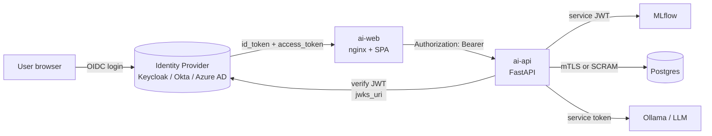

# Explanation — auth strategy (deferred)

**Current state: auth is intentionally absent.** The demo runs on localhost
with default credentials everywhere. This doc is the design for how auth
will be added when we're ready.

## Threat model (for the live demo)

| surface           | current                                          | risk                                           |
|-------------------|--------------------------------------------------|------------------------------------------------|
| phase-1 Grafana   | `admin/admin` + anon view enabled                | low (localhost)                                |
| phase-2 Web UI    | no auth                                          | low (localhost)                                |
| phase-2 API       | no auth                                          | low (localhost)                                |
| phase-2 Airflow   | `admin/admin`                                    | low (localhost)                                |
| phase-2 MLflow    | no auth                                          | low (localhost)                                |
| phase-2 MinIO     | `minioadmin/minioadmin`                          | low (localhost)                                |
| phase-2 Postgres  | `postgres/postgres`, bound to 127.0.0.1 via port | **medium** if laptop-shared; else low          |
| phase-2 Ollama    | no auth                                          | low                                            |
| outbound LLMs     | API keys in `.env`                                | medium (don't commit)                          |

All defaults are fine on a personal laptop. The rest of this doc covers
adding real auth for anything beyond that.

## Goals

1. Identity at the edge; services trust the gateway.
2. Per-route authorisation in the BFF.
3. Service-to-service auth between Airflow/API/MLflow/Postgres.
4. No secrets in the SPA bundle.
5. Drop-in replaceable identity provider (Okta, Azure AD, Google, Keycloak).

## Target architecture



## Edge: SPA + nginx

- SPA never stores long-lived credentials. Tokens live in memory +
  HttpOnly cookie for refresh.
- nginx accepts the login callback, exchanges code for tokens, sets the
  session cookie, and forwards `Authorization: Bearer <access_token>` to
  the API.
- Alternative: [oauth2-proxy](https://oauth2-proxy.github.io/oauth2-proxy/)
  sidecar in front of nginx. Same effect, less bespoke nginx.

## BFF: FastAPI

Add a dependency that validates the JWT against the IdP's JWKS:

```python
from fastapi import Depends, HTTPException
import httpx, jwt

async def current_user(authorization: str = Header(...)) -> dict:
    token = authorization.removeprefix("Bearer ")
    jwks = await cached_jwks()
    try:
        return jwt.decode(token, jwks, algorithms=["RS256"], audience=AUDIENCE)
    except jwt.InvalidTokenError:
        raise HTTPException(401)
```

Per-route scopes declared via `Depends`:

```python
@router.post("/chat")
async def chat(req: ChatRequest, user=Depends(require_scope("demo.chat"))):
    ...
```

Scopes we'd likely add:

| scope             | who                               |
|-------------------|-----------------------------------|
| `demo.read`       | read profiles, hotspots, incidents |
| `demo.chat`       | use `/chat`                       |
| `demo.admin`      | trigger incidents, DAGs            |

## Service-to-service

- **API → Postgres:** per-env password, TLS; set a role with least-privilege
  grants instead of the `postgres` superuser.
- **Airflow → Postgres:** same — dedicated `airflow` DB user with only
  `airflow` DB privileges (already isolated by DB boundary).
- **API → MLflow:** MLflow server can be protected with basic auth or a
  reverse-proxy-enforced OIDC; FastAPI uses a service principal.
- **API → Ollama / LLM providers:** outbound API key in server env.
  Rotate via secret manager; never returned to the SPA.
- **API → Pyroscope:** for multi-tenant Pyroscope, pass an `X-Scope-OrgID`
  header.

## Secrets management

Local dev: `.env` file (gitignored).

Production: pull from a secret manager (Vault, AWS Secrets Manager, Azure
Key Vault) at container start using an init-container or agent sidecar.
Never bake into images.

## What NOT to do

- Don't add API keys to the SPA at build time via `VITE_*` env vars —
  they end up in the bundle.
- Don't store tokens in `localStorage` (XSS exfiltration).
- Don't trust client-side scope checks; re-check on the server.
- Don't introduce a second auth system for Airflow if you already run
  OIDC — front it with the same proxy.

## When to add this

Auth is *not* the shape-critical part of the demo. Add it when:

1. The stack leaves localhost.
2. More than one developer shares the instance.
3. You start storing real customer data in Postgres.

Until then, the config above describes the destination without adding
implementation cost to the demo.
