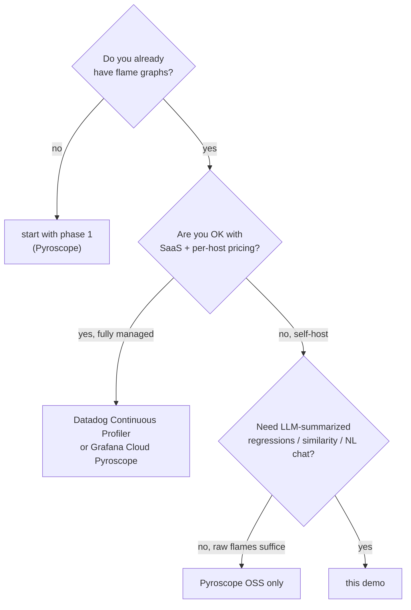

# Explanation — competitive positioning

How phase 2 differs from the alternatives a team typically considers
when they want "AI on top of profiling data". This doc lives next to
[value-proposition.md](value-proposition.md) but goes deeper on
specific competitors.

## The buying decision tree

## Versus raw Pyroscope

Pyroscope is brilliant at what it does — capture, store, render flame
graphs. It is intentionally not an analytics platform.

| dimension | Pyroscope alone | Pyroscope + phase 2 |
|---|---|---|
| flame graph rendering | ✓ best-in-class | same (uses Pyroscope) |
| regression detection | manual (eyeball diff view) | automated, hourly |
| LLM summary | none | every regression has one |
| similarity search | none | pgvector cosine, sub-ms |
| natural language queries | none | grounded SSE chat |
| feature store / TSDB | none | Postgres + pgvector |
| MLOps integration | none | MLflow tracking + model registry |
| cross-service leaderboard | manual per-query | one SQL |

**Phase 2 doesn't compete with Pyroscope. It *extends* it.** Phase 1's
Pyroscope flame graphs remain the source of truth.

## Versus Datadog Continuous Profiler

| dimension | Datadog | this demo |
|---|---|---|
| flame graphs | ✓ | ✓ (via Pyroscope) |
| profile-level regression diff | ✓ "Compare profiles" view | ✓ |
| **LLM summaries of regressions** | ✗ | ✓ |
| **Cross-incident similarity** | ✗ | ✓ pgvector |
| **Natural-language chat over profile data** | partial (Bits AI, generic) | ✓ grounded in live state |
| **Multi-LLM provider** | locked to Datadog's | ✓ Ollama/Claude/GPT/Gemini |
| **Self-host / air-gap** | ✗ SaaS only | ✓ |
| **Per-host pricing** | yes (~$15-40/host/month) | $0 (your infra) |
| Production maturity | enterprise-grade | demo-grade |
| First-party tracing integration | ✓ APM | requires OpenTelemetry |

**When Datadog wins:** large enterprise with budget, no security
constraints around data exfiltration, prefers managed.

**When phase 2 wins:** privacy-sensitive workloads, cost-sensitive
teams, want to extend with custom models, prefer open data.

## Versus Grafana Cloud Pyroscope + Grafana ML

Grafana Cloud bundles Pyroscope hosting with some ML features (Adaptive
Metrics, Asserts, k6 cloud). Some overlap.

| dimension | Grafana Cloud | this demo |
|---|---|---|
| Pyroscope hosting | ✓ managed | self-host |
| anomaly detection on metrics | ✓ Asserts | ✓ for profile features |
| **LLM summaries** | partial via Grafana LLM app | ✓ first-class |
| **Profile-level similarity** | ✗ | ✓ |
| **Profile chat** | ✗ | ✓ |
| **Multi-LLM** | ✗ | ✓ |
| Vendor lock-in | high | none — you own everything |
| Cost at fleet scale | per-ingest pricing | infra cost only |

**When Grafana Cloud wins:** want managed Pyroscope, comfortable with
SaaS, already on Grafana Cloud.

**When phase 2 wins:** want the AI layer to be yours, not theirs.

## Versus New Relic

New Relic has CodeStream and Grok (their AI assistant) but no
function-level continuous profiler at the level of Pyroscope.

| dimension | New Relic | this demo |
|---|---|---|
| continuous profiling | partial — "Browser Performance Insights" / Java agent | full Pyroscope |
| function-level flame graphs | ◐ thread-level | ✓ |
| LLM features | Grok (chat) | ✓ chat + summaries + similarity |
| Self-host | ✗ | ✓ |

Phase 2 is a category New Relic doesn't compete in directly.

## Versus DIY scripts

The closest thing to phase 2 today, in most teams that haven't bought
a vendor, is "a couple of scripts a senior SRE wrote".

| dimension | DIY scripts | this demo |
|---|---|---|
| Flame-graph regression alerts | possible (1-2 weeks) | shipped |
| LLM summaries | possible (1 week) | shipped |
| Similarity search | possible (3-4 weeks for pgvector wiring) | shipped |
| NL chat | possible (1-2 weeks) | shipped |
| Reusability | one engineer's brain | repository, tests, docs |
| Maintenance | "the SRE who wrote it left" | tested, JaCoCo, IT suite |

The DIY path *gets to the same place* but takes 2-3 engineer-months and
is bus-factor-1. Phase 2 is the reference implementation that compresses
that to a weekend of integration work.

## Versus open-source AIOps platforms (LinkedIn, Uber, Microsoft)

LinkedIn's Burrito, Uber's "M3", Microsoft's various incident-mining
toolkits are all interesting but:

- Most are paper-ware, not deployable code.
- None target *profiling data* specifically.
- All assume you already have a senior platform team to operate them.

Phase 2 is **deployable in 15 minutes**, scoped to profiling, and
designed for a small team to extend.

## What phase 2 does NOT replace

Be honest about scope:

| concern | use this | not this |
|---|---|---|
| Distributed tracing across services | OpenTelemetry / Tempo / Jaeger | phase 2 |
| Metrics + alerting on RED/USE | Prometheus / Grafana | phase 2 |
| Log search | Loki / Elastic | phase 2 |
| Request-level causality | tracing | phase 2 (profiles are aggregate) |
| SLO management | OpenSLO + dashboards | phase 2 |

Phase 2 is the **ML layer on top of profiling**. It complements the
above, not replaces them.

## Compound differentiation

The single biggest differentiator isn't any one feature — it's that
**all six Tier 1 capabilities ship in one integrated stack you can
read, run on a laptop, and modify**. Vendors give you a subset, locked
behind their UI; DIY gives you all of it but takes months.

The demo's job is to short-circuit the months.
