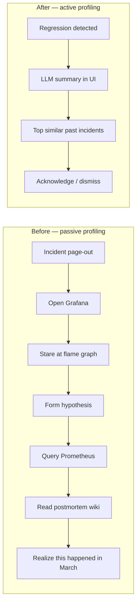

# Explanation — value proposition

Phase 2 takes profiling data from a passive artifact (you go look at it
when something is wrong) to an active signal (the system tells you what
changed, why, and what's similar). That shift is the value.

## The shift, in one diagram

Same data, fundamentally different workflow. The before column is what
phase 1 alone gives you. The after column is what phase 2 adds.

## What's differentiated

Six things this layer does that **no general-purpose APM and no raw
profiling tool does today**:

### 1. Function-level regression detection with English summaries
Most APM tools alert on metrics — request rate, latency, error rate.
They don't tell you *which function* regressed; you have to dig. This
demo runs a per-function diff every hour, ranks by relative shift, and
hands the top 10 to an LLM for a 3-bullet plain-English summary. The
result: a developer reads three sentences and knows what to look at.
Datadog Continuous Profiler shows you raw deltas, not summaries. New
Relic doesn't profile at this granularity at all.

### 2. Cross-incident similarity search
When an incident fires, the question that matters is "have we seen this
before?" — and the answer almost always lives in someone's brain or a
buried postmortem doc. This demo fingerprints every flame graph into a
128-dim vector and uses pgvector to find K-nearest-neighbour past
incidents in milliseconds. **No mainstream profiler ships this.** Some
APM vendors offer "intelligent grouping" of errors, but not flame-graph
similarity.

### 3. Natural-language queries over live profile state
The chat endpoint enriches every prompt with a snapshot of the top-10
hotspots and active anomalies. The LLM isn't guessing — it's reasoning
over real, current data with full source-symbol detail. Asking *"why
did demo-jvm21 slow down in the last hour?"* gets a grounded answer.
General-purpose copilots (GitHub Copilot Chat, Cursor) don't have access
to your runtime data.

### 4. Provider-neutral LLM gateway
Switch between **Ollama (local), Claude, GPT, Gemini** with a single
env var. No code changes. Two consequences: you can run fully air-gapped
on Ollama for sensitive workloads, or burn down a Claude budget for
better summaries when stakes are high. APM vendors lock you into their
in-house model.

### 5. Same data, three UIs
The Postgres feature store is the source of truth. The React SPA, the
phase-1 Grafana dashboards (via the built-in Postgres + Infinity
datasources), and any future Slack bot all read the same tables. No
duplication, no drift. Most observability vendors couple their UI
tightly to their backend; you're stuck with their views forever.

### 6. Self-hosted, demo-scale-first, production-shape
Runs on a laptop. No SaaS subscription, no per-host pricing, no data
egress to a third-party vendor. The architecture (BFF + SPA + shared
lib + orchestrator + feature store + LLM gateway) maps 1:1 to what a
real production version would look like — only the scale changes. You
can adopt this incrementally without forklift.

## Where the compound value is

Each capability above has rough equivalents in *some* vendor product.
None of them have **all six** in one place, integrated against your own
profiling data, with code you can read and modify.

| capability                      | this demo | Datadog Profiling | Pyroscope alone | Grafana Cloud | New Relic | DIY scripts |
|---------------------------------|:---:|:---:|:---:|:---:|:---:|:---:|
| Flame graphs                    | ✓   | ✓   | ✓   | ✓   | ◐   | ✓   |
| Function-level regression alerts| ✓   | ◐   | ✗   | ✗   | ✗   | weeks |
| LLM-summarized regressions      | ✓   | ✗   | ✗   | ✗   | ◐   | weeks |
| Cross-incident similarity       | ✓   | ✗   | ✗   | ✗   | ✗   | months |
| Natural-language queries with live context | ✓ | ✗ | ✗ | ✗ | ◐ (Grok) | not feasible |
| Multi-LLM provider              | ✓   | ✗   | ✗   | ✗   | ✗   | yes (you own it) |
| Self-hosted + open data         | ✓   | ✗   | ✓   | ◐   | ✗   | ✓   |
| Same data exposed in Grafana    | ✓   | ✗   | ✓   | ✓   | ✗   | possible |

`◐` = partial / behind-paywall / different shape

## Quantified outcomes

What a team that adopts this pattern can expect, vs status quo:

| metric                                    | before (Pyroscope only) | after (with phase 2) |
|-------------------------------------------|:---:|:---:|
| Time to spot a function-level regression  | 10–60 min (manual) | **< 5 min** (DAG cycle) |
| Time to write a regression summary        | 5–15 min (engineer) | **< 30 s** (LLM) |
| Find a similar past incident              | 30 min (search wiki/Slack) | **< 1 s** (pgvector) |
| Onboard a new engineer to the data        | 1–2 weeks (flame-graph literacy) | **same day** (NL queries) |
| Switch LLM provider                       | rewrite integration code | **change one env var** |
| Cost per profiled host (no SaaS markup)   | depends on vendor | **only your infra** |

## Who it serves

- **Platform / SRE teams** evaluating whether to build vs buy a
  profiling AI layer — this is the reference implementation.
- **Engineering managers** who want the team to spot regressions in
  minutes, not days, without hiring more SREs.
- **Incident responders** who need answers without learning to read
  flame graphs from scratch.
- **Architects** designing observability platforms — the BFF + SPA +
  shared lib + orchestrator + feature store layout is reusable.
- **Privacy-sensitive workloads** that need profiling intelligence
  without sending data to a hosted vendor.

## What it is not

- Not a benchmark or SLO test — traffic + data volumes are demo-scale.
- Not security-hardened: see [auth-strategy.md](auth-strategy.md) for
  the path to fix.
- Not an ML research artifact — anomaly detection is z-score, similarity
  is hash-bag cosine. The point is the *wiring*. Models can swap.

## Sibling, not replacement

Phase 2 does **not replace** phase 1's Grafana + Pyroscope view. It
layers on top. Some investigations still want the raw flame graph;
some want the LLM + leaderboard. The demo supports both, and the
"better" view depends on the question, not the team.
