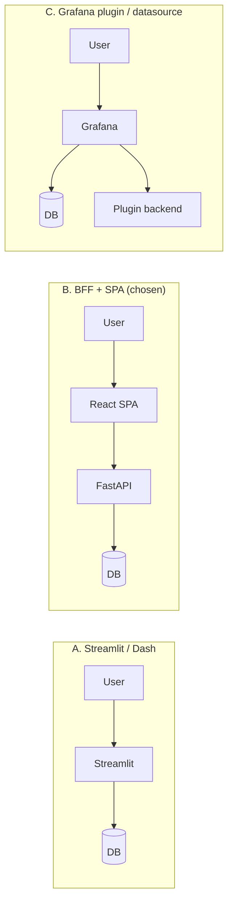

# Explanation — why BFF + SPA (not Streamlit, not a Grafana plugin)

## Three patterns considered

## Why **B** was chosen

- **Flame-graph diff UX.** React has `react-flame-graph` / d3-flame-graph
  with proper zoom + diff overlay. Streamlit has no equivalent; a
  Grafana plugin would require Go + React anyway.
- **Streaming chat UX.** SSE in React is trivial. Streamlit's chat
  element streams but lacks fine-grained control over formatting and
  cancellation. Grafana is not a chat host.
- **Server-side secrets.** LLM API keys stay in the BFF, never reach the
  browser. Streamlit runs user code in the same process that renders the
  UI — key handling is awkward.
- **Layered testability.** BFF is a pure function of inputs → JSON. We
  can test it without a browser. Streamlit tests need Playwright.

## Why **A (Streamlit)** was rejected

- Flame-graph rendering: no good library.
- Streaming: usable but fiddly.
- One container bundles UI + state + secrets.

## Why **C (Grafana plugin)** was rejected

- Writing a custom plugin is Go + React work; we'd end up writing the
  same code as the SPA minus the freedom to design non-dashboard UX
  (chat, diff, leaderboard cards).
- But it's not ignored: Grafana gets **read-only** access to phase-2
  data via the built-in Postgres datasource + Infinity plugin. Two
  dashboards, zero custom code. See [../reference/grafana-integration.md](../reference/grafana-integration.md).

## What the BFF is NOT

- **Not a thick middleware.** Every router calls `lib/` or Postgres and
  returns JSON. Business logic lives in `lib/`.
- **Not a place for auth today.** `/chat` is unauthenticated in the demo.
  See [auth-strategy.md](auth-strategy.md) for where auth lives once
  we add it (answer: it goes in the BFF).

## The shared-lib rule

The single most important design invariant:

> Every piece of logic that produces data is in `lib/`. Both the FastAPI
> routes *and* the Airflow DAGs import from `lib/`.

This prevents the all-too-common drift where the DAG writes one view and
the API computes another. Same function → same answer.
