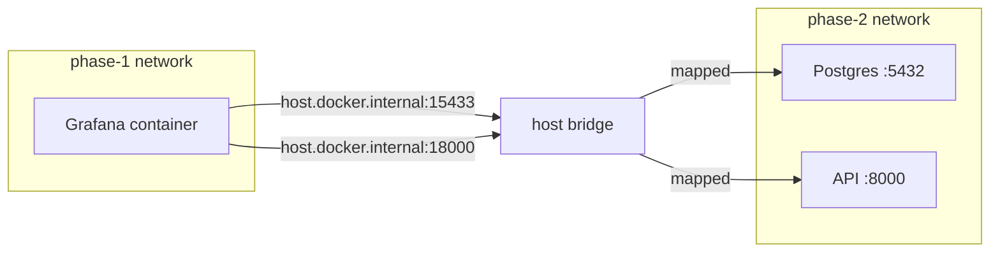

# How-to — connect phase-1 Grafana to phase-2 data

Phase 1's Grafana is already configured for this — the datasources and
dashboards are committed under `local-demo/config/grafana/`. This doc
explains *how* the wiring works and how to re-create it yourself if you
delete or reset phase 1.

## What was added to phase 1

| file                                                      | purpose                                |
|-----------------------------------------------------------|----------------------------------------|
| `config/grafana/provisioning/datasources/ai-postgres.yaml` | Postgres + Infinity datasources        |
| `config/grafana/dashboards/fleet-hotspots.json`           | SQL dashboard over `function_features` |
| `config/grafana/dashboards/ai-incidents.json`             | SQL dashboard for incidents & regressions |

And in `docker-compose.yaml`:

```yaml
grafana:
  environment:
    GF_INSTALL_PLUGINS: yesoreyeram-infinity-datasource
  extra_hosts: ["host.docker.internal:host-gateway"]
```

## Why `host.docker.internal`

Phase 1 and phase 2 run in **separate compose projects** with separate
Docker networks. Cross-network traffic goes via the host's loopback.
`extra_hosts: ["host.docker.internal:host-gateway"]` makes that name
resolvable inside the phase-1 Grafana container.



## When panels show "No data"

Pick the likely cause, in order:

1. phase-2 Postgres not running — `cd ai && ./scripts/up.sh`.
2. Tables not populated — `./scripts/seed.sh`.
3. Port mismatch — `.env` in ai/ has `POSTGRES_PORT=15433`. If up.sh
   bumped it to 15434, update `ai-postgres.yaml` URL. (We hardcode
   15433 because the datasource is provisioned in phase-1 before phase-2's
   `.env` is written.)
4. Plugin not installed — check Grafana logs:
   `docker compose logs grafana | grep -i infinity`.

## Reset path

If provisioning is broken:

```bash
(cd local-demo && docker compose restart grafana)
```

Grafana re-reads provisioning files on restart.
