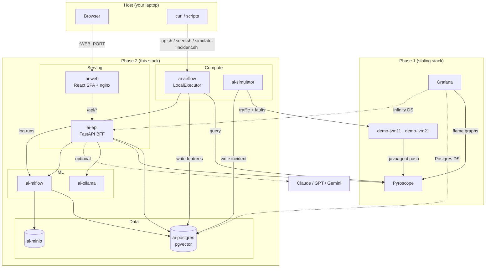
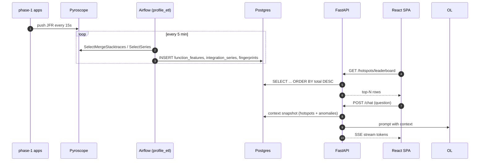
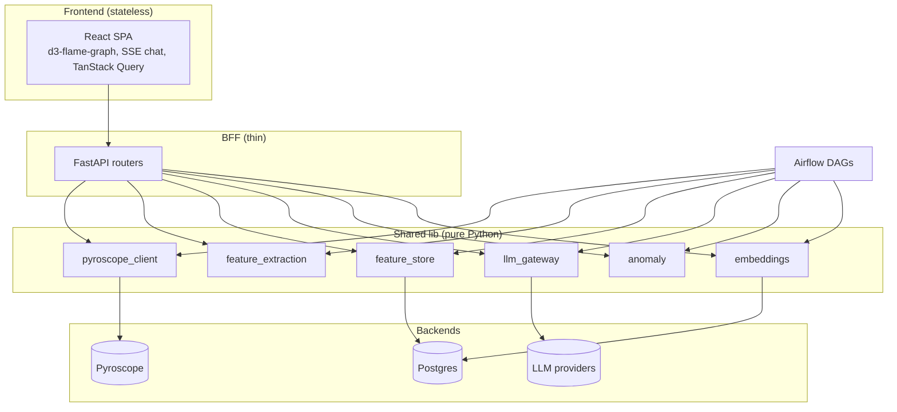

# Reference — architecture & infrastructure

## Topology

## Container inventory

| container      | image / build                              | role                                           |
|----------------|--------------------------------------------|------------------------------------------------|
| `ai-postgres`  | `pgvector/pgvector:pg16`                   | single DB; 3 logical DBs (ai, airflow, mlflow) |
| `ai-minio`     | `minio/minio`                              | S3-compatible artifact store                   |
| `ai-minio-init`| `minio/mc`                                 | one-shot bucket creation                       |
| `ai-mlflow`    | `ghcr.io/mlflow/mlflow`                    | tracking + model registry                      |
| `ai-ollama`    | `ollama/ollama`                            | local LLM runtime                              |
| `ai-ollama-init`| `curlimages/curl`                         | one-shot `/api/pull` for default model         |
| `ai-airflow`   | built (`config/airflow/Dockerfile`)        | scheduler + webserver (`standalone`)           |
| `ai-api`       | built (`apps/api/Dockerfile`)              | FastAPI BFF                                    |
| `ai-web`       | built (`apps/web/Dockerfile`)              | Vite-built SPA served by nginx                 |
| `ai-simulator` | built (`apps/simulator/Dockerfile`)        | traffic + incident patterns (profile: simulate)|

## Profiling-data flow

## Layered architecture rationale

**One lib, two consumers.** The Airflow DAGs and the FastAPI endpoints both
import from `lib/`. No duplicated "DAG logic" vs "API logic".

## Isolation from phase 1

- Separate compose project (`name: pyroscope-local-demo-ai`).
- Separate network, volumes namespaced.
- Host-bridge access to phase-1 Pyroscope via `host.docker.internal:4041`.
- Phase-1 Grafana talks to phase-2 Postgres and API via `host.docker.internal`.

## Ports (defaults; autowired)

See [../../README.md](../../README.md) Quickstart.
