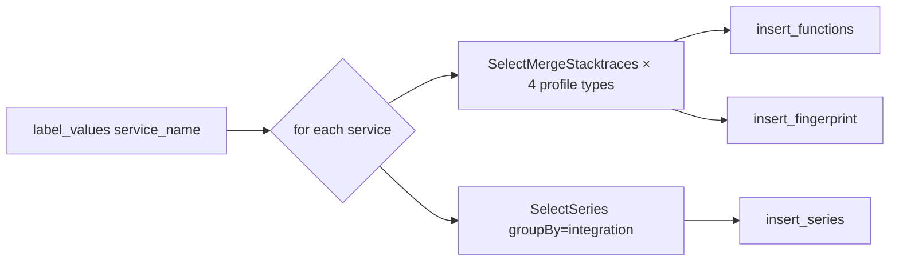

# Reference — DAGs

Four Airflow DAGs, all in `dags/`, executed by `LocalExecutor`.

| DAG                        | schedule        | writes                                          |
|----------------------------|-----------------|-------------------------------------------------|
| `profile_etl`              | `*/5 * * * *`   | `function_features`, `integration_series`, `fingerprints` |
| `anomaly_detect`           | `*/5 * * * *`   | `anomalies`                                     |
| `regression_detect`        | `@hourly`       | `regressions` (includes LLM summary)            |
| `daily_hotspot_report`     | `0 2 * * *`     | MinIO + MLflow artifact; also prunes retention  |

## `profile_etl`

Captures four profile types: CPU, alloc, lock, block.

## `anomaly_detect`

Reads the last hour of `integration_series`, groups by `(service, integration)`,
runs a rolling z-score (`window=20`, `threshold=3.0`). High-|z| points become
rows in `anomalies`.

## `regression_detect`

Compares two windows (`before`: 60–30 min ago; `after`: last 30 min).
Functions whose average `total_value` shifted by >50% become regression rows.
The batch (top-10 by absolute shift) is sent to the configured LLM (Ollama
by default) for a human summary, and the summary is stored alongside every
row so the UI can surface it.

## `daily_hotspot_report`

- Builds a markdown report (top-10 CPU / alloc / lock of the last 24 h).
- Uploads to `s3://artifacts/hotspot-reports/<date>.md` (MinIO).
- Logs to MLflow experiment `daily-hotspots` as an artifact.
- Runs `SELECT prune_old_data()` for retention.

## Adding a DAG

See [../how-to/add-a-dag.md](../how-to/add-a-dag.md).
