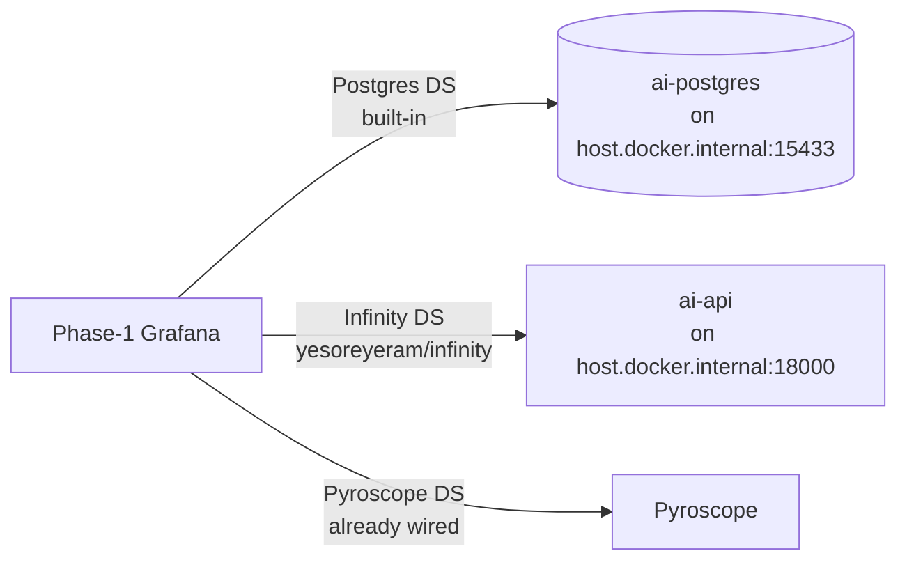

# Reference — Grafana integration (phase 2 data in phase-1 Grafana)

Phase-1 Grafana is configured to read phase-2 data via **two new datasources**
and **two new dashboards**. No custom plugin code.

## Datasources

Provisioned in `config/grafana/provisioning/datasources/ai-postgres.yaml`:

| name          | type                                 | url                                      |
|---------------|--------------------------------------|------------------------------------------|
| AI-Postgres   | `postgres` (built-in)                | `host.docker.internal:15433` db=`ai`     |
| AI-API        | `yesoreyeram-infinity-datasource`    | `http://host.docker.internal:18000`      |

The Infinity plugin is installed via `GF_INSTALL_PLUGINS` in phase-1's
`docker-compose.yaml`. `host.docker.internal` resolves via `extra_hosts`.

## Dashboards

Dropped into `config/grafana/dashboards/`:

- `fleet-hotspots.json` — top-N CPU/alloc/lock from Postgres; per-integration time series.
- `ai-incidents.json` — incidents list, recent anomalies, LLM-summarized regressions.

Both read from Postgres (`AI-Postgres` datasource). The Infinity datasource
is wired up for future panels that call the FastAPI BFF (e.g., LLM
summaries, similarity results).

## Making it work

1. Start phase 1 (Grafana).
2. Start phase 2 (Postgres on 15433, API on 18000).
3. Phase-1 Grafana auto-reloads provisioning every 10 s.
4. Open phase-1 Grafana → Dashboards → folder "Local Demo" → "Fleet Hotspots (AI phase 2)" / "AI Incidents & Regressions (phase 2)".

Panels will say "No data" until `./ai/scripts/seed.sh` or the scheduled DAG
has populated the feature tables.
